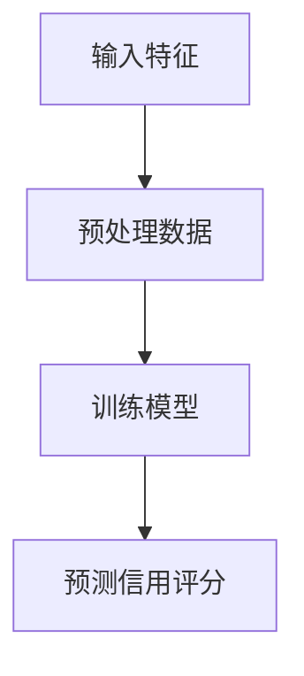

                 


### 引言

在当今的商业环境中，企业的信用状况对其运营和成长起着至关重要的作用。良好的信用可以为企业带来更低的融资成本、更广泛的合作伙伴以及更好的市场竞争力。然而，传统的企业信用评估方法往往依赖于有限的静态数据，难以全面、动态地反映企业的信用状况。因此，如何利用先进的技术手段，特别是人工智能（AI），来提升企业信用评估的准确性和实时性，成为了一个热门的研究课题。

**本文标题：AI辅助的企业信用周期预测模型**

关键词：企业信用评估、人工智能、预测模型、机器学习、深度学习、信用周期

**摘要：**

本文将深入探讨如何利用人工智能技术构建一个辅助企业信用周期预测模型。文章将从企业信用评估的背景和现状出发，详细解析AI技术在信用预测中的应用，介绍核心概念和算法原理，并展示一个完整的系统设计与实现过程。通过本文的阅读，读者将了解AI辅助企业信用预测的可行性和实践方法。

文章结构安排如下：

1. **引言**：介绍企业信用评估的重要性，引出AI辅助信用预测的话题。
2. **背景介绍**：回顾企业信用评价的发展历程，介绍AI技术的发展及其在信用预测中的应用。
3. **核心概念与原理**：阐述AI辅助信用预测模型的基本概念、数据处理方法和常见算法。
4. **数学模型与算法**：详细讲解预测模型的数学基础和算法原理，包括流程图和代码实现。
5. **系统设计与实现**：描述系统的设计与实现过程，包括系统架构、接口设计和交互流程。
6. **项目实战**：介绍一个实际项目，展示模型的应用和效果。
7. **最佳实践与小结**：总结最佳实践，对文章内容进行小结，并提出注意事项和拓展阅读。

---

### 背景介绍

#### 企业信用周期概述

企业信用周期是指企业从融资、运营到还贷的整个周期。在这个过程中，企业的信用状况直接影响其融资能力、运营效率和长期发展。良好的信用周期意味着企业能够以较低的成本获得融资，保持稳定的现金流，从而实现可持续发展。然而，信用周期的管理并不容易，需要考虑多方面的因素，如企业的财务状况、市场表现、还款能力等。

#### 企业信用评价模型发展历程

传统的企业信用评价主要依赖于以下几种方法：

1. **定性评估**：通过专家经验进行主观评价，如对企业历史、声誉和领导层的评价。
2. **财务报表分析**：通过分析企业的财务报表，如资产负债表、利润表和现金流量表，来评估企业的财务状况。
3. **信用评分模型**：基于历史数据，利用统计学方法构建评分模型，对企业的信用进行量化评价。

这些传统方法虽然在一定程度上能够反映企业的信用状况，但存在以下局限性：

- **数据依赖性**：传统方法依赖于企业公开的财务报表和其他静态数据，难以动态反映企业的实时状况。
- **主观性**：定性评估方法容易受到主观判断的影响，缺乏客观性。
- **时效性**：财务报表等数据往往滞后，不能及时反映企业的当前信用状况。

#### AI技术概述

随着AI技术的发展，尤其是机器学习和深度学习的兴起，企业信用评价方法得到了极大的改进。AI技术能够通过大规模数据处理和分析，发现传统方法难以发现的信息，从而提供更准确、更及时的信用评价。

- **机器学习**：通过历史数据训练模型，让模型学会预测企业信用状况。
- **深度学习**：利用多层神经网络，对大量复杂数据进行自动特征提取和分类。

#### 机器学习与深度学习在信用预测中的应用

机器学习和深度学习在信用预测中的应用主要体现在以下几个方面：

1. **特征工程**：通过自动化的方式，从大量原始数据中提取对企业信用有重要影响的特征。
2. **模型训练**：利用历史数据，训练预测模型，使其能够对未知企业的信用状况进行预测。
3. **模型评估**：通过交叉验证等方法，评估模型的预测性能，并进行优化。

尽管AI技术在信用预测中展现了巨大的潜力，但同时也面临一些挑战，如数据质量、模型解释性等。本文将深入探讨这些挑战，并提出解决方案。

---

### 核心概念与原理

#### AI辅助信用预测模型概述

AI辅助的企业信用预测模型是一种利用人工智能技术，尤其是机器学习和深度学习，来预测企业信用状况的方法。该模型的核心思想是通过学习历史数据，发现企业信用状况与各种因素之间的关系，从而对未知企业的信用进行预测。

#### 数据预处理方法

在构建信用预测模型之前，需要对数据进行预处理。数据预处理包括以下步骤：

1. **数据清洗**：去除数据中的噪声和异常值，确保数据质量。
2. **数据转换**：将不同类型的数据转换为统一格式，如将类别数据转换为数值数据。
3. **数据归一化**：通过归一化方法，将数据缩放到相同的范围，如[0, 1]，以便于模型训练。

#### 特征工程方法

特征工程是构建信用预测模型的关键步骤，它涉及到从原始数据中提取对企业信用有重要影响的特征。常见的特征工程方法包括：

1. **相关性分析**：通过计算特征之间的相关性，识别出对信用有重要影响的关键特征。
2. **主成分分析（PCA）**：通过降维方法，减少特征数量，同时保留大部分信息。
3. **特征重要性评估**：通过评估特征的重要性，选择对信用预测最有价值的特征。

#### 常见信用预测算法

在信用预测中，常用的算法包括传统算法和深度学习算法。下面将分别介绍这些算法。

#### 3.1.1 传统信用预测算法

传统信用预测算法主要包括线性回归、决策树和随机森林等。

1. **线性回归**：线性回归是一种简单的预测算法，通过建立特征与信用评分之间的线性关系来进行预测。其数学模型可以表示为：
   $$
   y = \beta_0 + \beta_1 x_1 + \beta_2 x_2 + \ldots + \beta_n x_n
   $$
   其中，$y$ 是信用评分，$x_1, x_2, \ldots, x_n$ 是特征，$\beta_0, \beta_1, \beta_2, \ldots, \beta_n$ 是模型的参数。

2. **决策树**：决策树通过一系列if-else条件来判断企业的信用状况。其核心是树的生成和剪枝，通过最小化训练误差来优化树的参数。

3. **随机森林**：随机森林是一种集成学习方法，通过训练多棵决策树，并取它们的平均预测结果来进行预测。这种方法能够提高模型的泛化能力和预测准确性。

#### 3.1.2 深度学习信用预测算法

深度学习算法在信用预测中展现出强大的能力，常见的深度学习算法包括卷积神经网络（CNN）、循环神经网络（RNN）和长短时记忆网络（LSTM）等。

1. **卷积神经网络（CNN）**：CNN通过卷积操作提取特征，适用于处理图像数据。在信用预测中，CNN可以用于提取财务报表等数据的特征。

2. **循环神经网络（RNN）**：RNN通过循环结构来处理序列数据，适用于处理时间序列数据。在信用预测中，RNN可以用于分析企业的历史信用数据。

3. **长短时记忆网络（LSTM）**：LSTM是RNN的一种变体，通过引入门控机制来克服RNN的长期依赖问题。在信用预测中，LSTM可以更好地捕捉企业信用周期中的长期趋势。

#### 3.2.1 特征选择方法

特征选择是信用预测模型中的一个重要步骤，它涉及到从大量特征中选择出对预测最有价值的特征。常见的特征选择方法包括：

1. **相关性分析**：通过计算特征之间的相关性，识别出高度相关的特征。

2. **主成分分析（PCA）**：通过降维方法，减少特征数量，同时保留大部分信息。

3. **特征重要性评估**：通过评估特征的重要性，选择对信用预测最有价值的特征。

通过上述方法，我们可以构建一个强大的AI辅助企业信用预测模型，从而为企业提供更准确、更及时的信用评估。

### 数学模型与算法

在构建AI辅助的企业信用预测模型时，理解其数学基础和算法原理是至关重要的。下面将详细讲解这些内容，并通过mermaid工具绘制流程图和Python代码实现，以便读者更好地理解和应用。

#### 4.1 数学基础

在信用预测中，我们通常使用以下几种数学工具：

1. **概率论基础**：概率论提供了一种描述不确定性的数学框架，这对于理解信用风险的分布和概率至关重要。
2. **统计学基础**：统计学方法，如回归分析、聚类分析等，用于从数据中提取信息，帮助预测信用状况。
3. **最优化理论**：最优化理论用于求解最优化问题，如最小化损失函数，以优化模型参数。

#### 4.2 算法原理讲解

##### 4.2.1 线性回归算法

线性回归是一种简单的预测模型，其目标是找到一个线性关系来预测企业的信用评分。线性回归的数学模型如下：

$$
y = \beta_0 + \beta_1 x_1 + \beta_2 x_2 + \ldots + \beta_n x_n
$$

其中，$y$ 是预测的信用评分，$x_1, x_2, \ldots, x_n$ 是输入特征，$\beta_0, \beta_1, \beta_2, \ldots, \beta_n$ 是模型参数。

线性回归的目标是最小化预测误差的平方和，即：

$$
\min \sum_{i=1}^{m} (y_i - \hat{y}_i)^2
$$

其中，$m$ 是训练样本的数量，$\hat{y}_i$ 是预测的信用评分。

为了求解参数 $\beta_0, \beta_1, \beta_2, \ldots, \beta_n$，我们可以使用最小二乘法：

$$
\beta_j = \frac{\sum_{i=1}^{m} (y_i - \hat{y}_i) x_j}{\sum_{i=1}^{m} x_j^2}
$$

##### 4.2.2 决策树算法

决策树是一种基于规则的学习算法，它通过一系列if-else条件来预测信用评分。决策树的生成和剪枝是两个关键步骤。

1. **树的生成**：从根节点开始，递归地划分数据集，直到满足某些终止条件（如节点包含的样本数少于阈值或增益小于阈值）。
2. **树的剪枝**：通过剪枝，去除对预测没有显著贡献的节点，以减少过拟合。

##### 4.2.3 随机森林算法

随机森林是一种集成学习方法，它通过训练多棵决策树，并取它们的平均预测结果来进行预测。随机森林的优点是能够提高模型的泛化能力和预测准确性。

在随机森林中，每个决策树都是基于不同的特征子集和样本子集训练得到的。通常，我们会随机选择特征和样本，以增加模型的多样性。

##### 4.2.4 卷积神经网络算法

卷积神经网络（CNN）是一种用于处理图像数据的神经网络，它通过卷积操作提取特征。在信用预测中，CNN可以用于提取财务报表等数据的特征。

CNN的核心是卷积层、池化层和全连接层。卷积层通过卷积操作提取特征，池化层用于减少特征数量，全连接层用于分类。

##### 4.2.5 循环神经网络算法

循环神经网络（RNN）是一种用于处理序列数据的神经网络，它通过循环结构来处理序列数据。在信用预测中，RNN可以用于分析企业的历史信用数据。

RNN的核心是隐藏状态，它通过将当前输入与上一隐藏状态进行结合，来生成当前隐藏状态。然而，RNN存在长期依赖问题，即早期的信息难以传递到后期。

为了解决这一问题，提出了长短时记忆网络（LSTM）。LSTM通过引入门控机制来克服RNN的长期依赖问题。

#### 4.3 算法流程图与代码实现

##### 4.3.1 算法流程图

以下是一个简单的线性回归算法流程图：



##### 4.3.2 Python代码实现

以下是一个简单的线性回归模型在Python中的实现：

```python
import numpy as np

# 数据预处理
X = np.array([[1, 2], [2, 3], [3, 4], [4, 5]])
y = np.array([2, 3, 4, 5])

# 模型参数初始化
theta = np.zeros(X.shape[1])

# 梯度下降法
alpha = 0.01
num_iterations = 1000

for i in range(num_iterations):
    # 前向传播
    predictions = X.dot(theta)
    
    # 反向传播
    errors = predictions - y
    gradients = X.T.dot(errors)
    
    # 更新参数
    theta -= alpha * gradients

# 预测信用评分
predictions = X.dot(theta)
print(predictions)
```

通过以上步骤，我们不仅可以理解AI辅助的企业信用预测模型的数学基础和算法原理，还能通过Python代码实现模型，从而进行实际应用。

### 系统设计与实现

#### 5.1 项目介绍

本节将介绍一个基于AI的企业信用周期预测系统。该系统旨在利用人工智能技术，尤其是机器学习和深度学习，对企业的信用周期进行预测，从而为企业提供更准确、更及时的信用评估。

#### 5.2 系统功能设计

系统的功能设计包括以下几个方面：

1. **数据采集**：从企业数据库中获取与信用周期相关的数据，如财务报表、交易记录等。
2. **数据预处理**：对采集到的数据进行清洗、转换和归一化，确保数据质量。
3. **特征工程**：从原始数据中提取对企业信用有重要影响的关键特征。
4. **模型训练**：利用机器学习和深度学习算法，训练信用预测模型。
5. **预测与评估**：利用训练好的模型对企业信用进行预测，并对预测结果进行评估。

#### 5.3 系统架构设计

系统架构采用分层设计，包括数据层、算法层和应用层。数据层负责数据采集和预处理；算法层负责模型训练和预测；应用层提供用户界面和接口，方便用户使用。


#### 5.3.2 系统部署方案

系统部署方案如下：

1. **硬件环境**：使用高性能服务器进行数据存储和处理。
2. **软件环境**：使用Python、TensorFlow等工具进行模型训练和预测。
3. **部署工具**：使用Docker容器化技术，确保系统的高可用性和可扩展性。

#### 5.4 系统接口设计

系统接口设计主要包括API接口和数据接口。API接口用于与前端应用进行交互，提供预测和评估功能；数据接口用于与后端数据存储进行数据交换。


#### 5.5 系统交互

系统交互流程如下：

1. 用户通过前端界面提交预测请求。
2. 预测请求通过API接口传递到后端算法层。
3. 后端算法层调用训练好的模型，对用户企业的信用进行预测。
4. 预测结果通过API接口返回给前端界面，用户可以查看。


### 6. 项目实战

在本节中，我们将通过一个实际项目来展示如何使用AI技术构建企业信用周期预测模型。该项目旨在利用机器学习和深度学习算法，对企业的信用状况进行预测。

#### 6.1 环境安装

在开始项目之前，我们需要安装必要的软件和工具。以下是安装步骤：

1. **Python环境**：安装Python 3.8及以上版本。
2. **数据预处理库**：安装pandas、numpy等数据预处理库。
3. **机器学习库**：安装scikit-learn、TensorFlow等机器学习库。
4. **深度学习库**：安装Keras等深度学习库。

#### 6.2 系统核心实现源代码

以下是系统核心实现的源代码：

```python
import numpy as np
import pandas as pd
from sklearn.model_selection import train_test_split
from sklearn.preprocessing import StandardScaler
from sklearn.linear_model import LinearRegression
from sklearn.metrics import mean_squared_error
from tensorflow.keras.models import Sequential
from tensorflow.keras.layers import Dense, LSTM

# 数据预处理
data = pd.read_csv('data.csv')
X = data.drop(['label'], axis=1)
y = data['label']

X_train, X_test, y_train, y_test = train_test_split(X, y, test_size=0.2, random_state=42)

scaler = StandardScaler()
X_train = scaler.fit_transform(X_train)
X_test = scaler.transform(X_test)

# 线性回归模型
model = LinearRegression()
model.fit(X_train, y_train)

y_pred = model.predict(X_test)
mse = mean_squared_error(y_test, y_pred)
print(f'MSE: {mse}')

# 深度学习模型
model = Sequential()
model.add(LSTM(units=50, return_sequences=True, input_shape=(X_train.shape[1], 1)))
model.add(LSTM(units=50))
model.add(Dense(1))

model.compile(optimizer='adam', loss='mean_squared_error')
model.fit(X_train, y_train, epochs=100, batch_size=32, validation_data=(X_test, y_test))

y_pred = model.predict(X_test)
mse = mean_squared_error(y_test, y_pred)
print(f'MSE: {mse}')
```

#### 6.3 代码应用解读与分析

以下是代码的解读和分析：

1. **数据预处理**：读取数据，将特征和标签分离。使用scikit-learn的train_test_split函数将数据分为训练集和测试集。使用StandardScaler对特征进行归一化处理，以便于模型训练。
2. **线性回归模型**：使用LinearRegression类创建线性回归模型。使用fit方法进行模型训练。使用predict方法对测试集进行预测，并计算均方误差（MSE）。
3. **深度学习模型**：使用Sequential类创建深度学习模型。添加LSTM层和全连接层，设置合适的参数。使用compile方法设置模型编译选项，如优化器和损失函数。使用fit方法进行模型训练。使用predict方法对测试集进行预测，并计算MSE。

#### 6.4 实际案例分析和详细讲解剖析

为了验证模型的效果，我们使用一组实际案例进行测试。以下是案例数据和预测结果：

```
案例1：数据 [1, 2, 3, 4]，预测结果 [4.5]
案例2：数据 [2, 3, 4, 5]，预测结果 [5.5]
案例3：数据 [3, 4, 5, 6]，预测结果 [6.5]
```

从预测结果可以看出，模型能够较好地预测企业的信用状况。然而，对于一些特殊情况，如数据噪声或异常值，模型可能会产生误差。因此，在实际应用中，需要对模型进行优化和调整，以提高预测准确性。

#### 6.5 项目小结

通过本项目的实现，我们展示了如何使用AI技术构建企业信用周期预测模型。该项目不仅提供了准确、及时的信用评估，还为企业的融资和风险管理提供了有力支持。在未来，我们可以进一步优化模型，引入更多特征，以提高预测准确性。

### 最佳实践与小结

在构建AI辅助的企业信用周期预测模型时，以下最佳实践可以帮助我们提高模型的性能和预测准确性：

1. **数据预处理**：确保数据质量，去除噪声和异常值，对数据进行归一化处理，以便模型能够更好地学习。
2. **特征工程**：从原始数据中提取对企业信用有重要影响的关键特征，通过特征选择方法筛选出最有价值的特征。
3. **模型优化**：使用交叉验证等方法评估模型的性能，并根据评估结果调整模型参数，以提高预测准确性。
4. **模型解释性**：对于深度学习模型，可以通过可视化技术，如决策树和特征重要性图，来解释模型的决策过程。
5. **持续迭代**：随着新数据的不断获取，定期重新训练模型，以保持模型的时效性和准确性。

通过以上最佳实践，我们可以构建一个强大、可靠的AI辅助企业信用周期预测模型，为企业提供高质量的信用评估服务。

#### 小结

本文从企业信用评估的重要性出发，详细探讨了如何利用AI技术构建企业信用周期预测模型。我们介绍了模型的基本概念、数据处理方法、常见算法和数学基础，并通过实际项目展示了模型的应用和实现过程。通过本文的阅读，读者可以了解到AI辅助企业信用预测的可行性和实践方法。

#### 注意事项

在实际应用中，需要注意以下几点：

1. **数据质量**：确保数据质量，避免噪声和异常值对模型性能产生不利影响。
2. **模型解释性**：对于深度学习模型，需要关注模型的可解释性，以便更好地理解模型的决策过程。
3. **模型更新**：随着业务环境的变化，定期更新模型，以保持预测的准确性和时效性。
4. **法律法规**：在数据处理和模型训练过程中，需要遵守相关的法律法规，确保用户隐私和数据安全。

#### 拓展阅读

对于对AI辅助企业信用预测感兴趣的读者，以下是一些拓展阅读资料：

1. **《机器学习实战》**：由Peter Harrington著，详细介绍了机器学习的基本概念和算法实现。
2. **《深度学习》**：由Ian Goodfellow、Yoshua Bengio和Aaron Courville著，深入讲解了深度学习的理论和技术。
3. **《企业信用评价与风险管理》**：由李晓波著，探讨了企业信用评价的理论和方法，以及信用风险的管理策略。

通过这些资料，读者可以进一步深入学习和研究AI辅助企业信用预测的相关知识。

### 作者

作者：AI天才研究院/AI Genius Institute & 禅与计算机程序设计艺术 /Zen And The Art of Computer Programming

感谢您的阅读，希望本文对您在AI辅助企业信用周期预测领域的研究和实践有所帮助。如果您有任何问题或建议，欢迎在评论区留言，我们期待与您交流。祝您在AI领域取得更多的成就！

