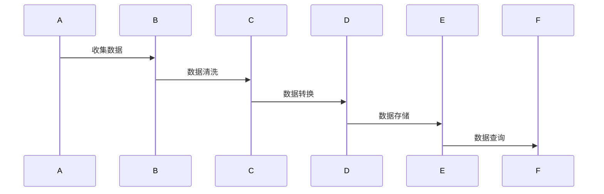
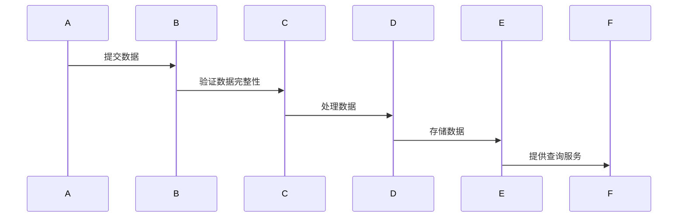

                 

# AI辅助的企业信用评分卡开发

> 关键词：人工智能，信用评分卡，机器学习，数据预处理，模型优化，实战案例

> 摘要：
随着人工智能技术的飞速发展，AI在信用评分卡领域的应用逐渐成为金融科技的重要方向。本文将围绕AI辅助的企业信用评分卡开发，详细探讨其背景、核心概念、开发流程、算法原理、系统设计以及实战案例，旨在为读者提供一份全面、系统的技术指南。

## 目录

1. **AI与信用评分卡的概述**
   1.1 AI概述
   1.2 信用评分卡的应用场景
2. **信用评分卡的基础**
   2.1 数据分析基础
   2.2 信用评分模型原理
   2.3 AI技术在信用评分中的应用
3. **AI辅助的信用评分卡开发**
   3.1 需求分析
   3.2 数据收集与处理
   3.3 信用评分模型的构建
4. **算法原理讲解**
   4.1 逻辑回归模型
   4.2 决策树与随机森林
5. **系统分析与架构设计方案**
   5.1 问题场景介绍
   5.2 系统功能设计
   5.3 系统架构设计
   5.4 系统接口设计与交互
6. **实战案例解析**
   6.1 案例一：企业信用评分系统的实现
   6.2 案例二：基于AI的信用评分卡优化
7. **最佳实践与拓展**
   7.1 数据质量管理
   7.2 特征工程技巧
   7.3 信用评分卡的最新研究
8. **总结与展望**
   8.1 本书总结
   8.2 信用评分卡的未来发展

## 1. AI与信用评分卡的概述

### 1.1 AI概述

人工智能（Artificial Intelligence，简称AI）是指由人制造出来的系统能够表现出类似人类智能的行为，包括学习、推理、规划、感知、自然语言理解和问题解决等。AI的发展经历了多个阶段，从最初的规则系统到现在的深度学习和强化学习，其技术不断演进，应用领域也在不断扩展。

### 1.2 信用评分卡的应用场景

信用评分卡是金融机构在贷款、信用卡、信用租赁等业务中用来评估客户信用风险的重要工具。传统信用评分卡主要依赖于客户的信用历史数据，如还款记录、信用额度使用情况等。然而，传统信用评分卡在处理复杂、多维的数据时存在局限性，难以充分挖掘潜在的风险。

AI辅助的信用评分卡则能够利用大数据和机器学习技术，从海量的非结构化数据中提取有价值的信息，提供更准确、个性化的信用评分结果。其应用场景包括：

- 贷款审批：对贷款申请者的信用风险进行评估，降低不良贷款率。
- 信用额度调整：根据客户的信用评分动态调整其信用额度。
- 保险理赔：利用AI技术对保险理赔申请进行风险评估，减少欺诈行为。

### 1.3 信用评分卡的优势

与传统的信用评分卡相比，AI辅助的信用评分卡具有以下优势：

- **数据挖掘能力**：AI能够从大量的非结构化数据中提取有价值的信息，提高信用评分的准确性。
- **模型适应性**：AI模型可以根据业务需求和数据特点进行灵活调整，提高模型的适用性。
- **实时性**：AI技术可以实现实时信用评分，快速响应业务需求。

## 2. 信用评分卡的基础

### 2.1 数据分析基础

数据分析是信用评分卡开发的核心环节。在进行数据分析之前，首先需要收集并处理相关数据。数据来源可以包括金融机构内部的客户信息、交易记录、征信数据等，也可以来自第三方数据提供商。

#### 2.1.1 数据来源与质量

数据来源需要保证多样性，以提高信用评分的准确性。同时，数据质量至关重要，必须确保数据的准确性、完整性和一致性。

#### 2.1.2 数据预处理

数据预处理包括数据清洗、数据转换和数据归一化等步骤。数据清洗主要是去除重复数据、缺失值填充、异常值处理等。数据转换包括将不同的数据类型转换为统一的数据格式，如将文本数据转换为数值数据。数据归一化则用于消除不同特征之间的量纲差异，使得模型能够更好地训练。

#### 2.1.3 数据可视化

数据可视化是数据分析的重要手段，通过图表和图形的形式展示数据分布、趋势和关系，帮助分析师更直观地理解数据。

### 2.2 信用评分模型原理

信用评分模型是信用评分卡的核心。信用评分模型的构建包括以下几个步骤：

- **特征选择**：从海量的数据中筛选出对信用评分有显著影响的特征。
- **模型训练**：使用训练数据集对模型进行训练，优化模型参数。
- **模型评估**：使用测试数据集对模型进行评估，评估指标包括准确率、召回率、F1值等。
- **模型优化**：根据评估结果对模型进行调整，提高模型性能。

常见的信用评分模型包括逻辑回归、决策树、支持向量机、神经网络等。

### 2.3 AI技术在信用评分中的应用

AI技术为信用评分卡的发展带来了新的机遇。以下是一些常用的AI技术在信用评分中的应用：

- **机器学习**：通过机器学习算法，如逻辑回归、决策树、随机森林等，对信用评分进行建模。
- **深度学习**：利用深度学习算法，如卷积神经网络（CNN）、循环神经网络（RNN）等，对复杂的数据进行建模。
- **强化学习**：通过强化学习算法，如Q学习、深度Q网络（DQN）等，实现动态信用评分。

## 3. AI辅助的信用评分卡开发

### 3.1 需求分析

需求分析是信用评分卡开发的第一步。在这一阶段，需要明确信用评分卡的目标、用户需求和业务场景。具体步骤如下：

- **目标明确**：确定信用评分卡的目的，如贷款审批、信用额度调整等。
- **用户需求调研**：了解用户的需求和痛点，如审批速度、评分准确性等。
- **业务场景分析**：分析业务场景，如贷款业务中的借款申请、审批、放款等环节。

### 3.2 数据收集与处理

数据收集是信用评分卡开发的基础。数据收集的来源包括金融机构内部的客户信息、交易记录、征信数据等，也可以来自第三方数据提供商。

#### 3.2.1 数据清洗

数据清洗是确保数据质量的关键步骤。主要内容包括：

- **去除重复数据**：识别并删除重复的数据记录。
- **缺失值填充**：对缺失的数据进行填充，可以采用均值、中值、众数等填充方法。
- **异常值处理**：识别并处理异常数据，如离群点、噪声等。

#### 3.2.2 数据转换

数据转换是将不同数据类型的特征统一为数值特征，如将文本数据转换为数值数据。常用的方法包括：

- **编码**：将类别特征转换为数值特征，如使用独热编码（One-Hot Encoding）或标签编码（Label Encoding）。
- **标准化**：将不同特征的范围统一到相同的范围内，如使用标准化（Standardization）或归一化（Normalization）。

#### 3.2.3 特征工程

特征工程是提升模型性能的关键步骤。主要内容包括：

- **特征选择**：从海量的特征中筛选出对信用评分有显著影响的特征，可以使用特征重要性、相关性分析等方法。
- **特征构造**：通过组合、变换现有特征，生成新的特征，以提高模型的性能。

### 3.3 信用评分模型的构建

信用评分模型的构建是信用评分卡开发的核心步骤。在这一阶段，需要选择合适的模型，进行模型训练、评估和优化。

#### 3.3.1 模型选择

模型选择取决于数据特点和业务需求。常见的模型包括：

- **逻辑回归**：用于处理二元分类问题，如客户是否会违约。
- **决策树**：用于处理分类和回归问题，具有良好的可解释性。
- **随机森林**：基于决策树的集成方法，能够提高模型的性能。
- **神经网络**：用于处理复杂的非线性关系，如卷积神经网络（CNN）和循环神经网络（RNN）。

#### 3.3.2 模型训练与验证

模型训练与验证是确保模型性能的关键步骤。主要内容包括：

- **训练数据集划分**：将数据集划分为训练集、验证集和测试集，用于模型的训练和评估。
- **模型训练**：使用训练数据集对模型进行训练，优化模型参数。
- **模型评估**：使用验证集和测试集对模型进行评估，评估指标包括准确率、召回率、F1值等。

#### 3.3.3 模型优化

模型优化是提升模型性能的重要手段。主要内容包括：

- **超参数调优**：通过调整模型的超参数，如学习率、树深度等，提高模型的性能。
- **正则化**：使用正则化技术，如L1正则化、L2正则化，防止过拟合。

## 4. 算法原理讲解

### 4.1 逻辑回归模型

逻辑回归（Logistic Regression）是一种常见的分类算法，常用于信用评分卡的开发。

#### 4.1.1 模型原理

逻辑回归的原理是通过对自变量（特征）和因变量（标签）之间的关系进行建模，预测因变量的概率分布。具体来说，逻辑回归假设因变量是一个二元变量，其概率分布服从逻辑函数（Logistic Function）。

#### 4.1.2 数学模型与公式

逻辑回归的数学模型可以表示为：

$$
P(y=1|x;\theta) = \frac{1}{1 + e^{-(\theta^T x)}}
$$

其中，$P(y=1|x;\theta)$ 表示在给定特征 $x$ 和模型参数 $\theta$ 时，因变量 $y$ 等于 1 的概率；$\theta$ 是模型参数，通过最小化损失函数（如交叉熵损失函数）来估计。

#### 4.1.3 Python代码实现

以下是一个简单的逻辑回归模型实现：

```python
from sklearn.linear_model import LogisticRegression
from sklearn.model_selection import train_test_split
from sklearn.metrics import accuracy_score

# 数据准备
X = ...  # 特征矩阵
y = ...  # 标签向量

# 数据集划分
X_train, X_test, y_train, y_test = train_test_split(X, y, test_size=0.2, random_state=42)

# 模型训练
model = LogisticRegression()
model.fit(X_train, y_train)

# 模型预测
y_pred = model.predict(X_test)

# 模型评估
accuracy = accuracy_score(y_test, y_pred)
print("Accuracy:", accuracy)
```

### 4.2 决策树与随机森林

决策树（Decision Tree）和随机森林（Random Forest）是另一种常见的分类算法。

#### 4.2.1 模型原理

决策树是一种基于树结构的分类模型，通过连续地划分特征和分割数据，将数据集划分为多个子集，最终达到分类的目的。

随机森林是一种基于决策树的集成模型，通过构建多个决策树，并取其平均值或多数表决来预测结果，以提高模型的性能。

#### 4.2.2 数学模型与公式

决策树的数学模型可以表示为：

$$
y = f(x; \theta)
$$

其中，$f(x; \theta)$ 表示决策树在给定特征 $x$ 和模型参数 $\theta$ 时的分类结果；$\theta$ 是模型参数，通过递归划分特征和分割数据来估计。

随机森林的数学模型可以表示为：

$$
y = \frac{1}{M} \sum_{m=1}^{M} f_m(x; \theta_m)
$$

其中，$f_m(x; \theta_m)$ 表示第 $m$ 个决策树在给定特征 $x$ 和模型参数 $\theta_m$ 时的分类结果；$M$ 是决策树的数量。

#### 4.2.3 Python代码实现

以下是一个简单的决策树和随机森林模型实现：

```python
from sklearn.tree import DecisionTreeClassifier
from sklearn.ensemble import RandomForestClassifier
from sklearn.model_selection import train_test_split
from sklearn.metrics import accuracy_score

# 数据准备
X = ...  # 特征矩阵
y = ...  # 标签向量

# 数据集划分
X_train, X_test, y_train, y_test = train_test_split(X, y, test_size=0.2, random_state=42)

# 决策树模型训练
dt_model = DecisionTreeClassifier()
dt_model.fit(X_train, y_train)

# 随机森林模型训练
rf_model = RandomForestClassifier(n_estimators=100)
rf_model.fit(X_train, y_train)

# 决策树模型预测
dt_y_pred = dt_model.predict(X_test)

# 随机森林模型预测
rf_y_pred = rf_model.predict(X_test)

# 决策树模型评估
dt_accuracy = accuracy_score(y_test, dt_y_pred)
print("Decision Tree Accuracy:", dt_accuracy)

# 随机森林模型评估
rf_accuracy = accuracy_score(y_test, rf_y_pred)
print("Random Forest Accuracy:", rf_accuracy)
```

## 5. 系统分析与架构设计方案

### 5.1 问题场景介绍

企业信用评分系统的设计目标是构建一个基于人工智能技术的信用评分模型，用于对企业的信用风险进行评估。该系统将收集企业各类信息，包括财务状况、经营业绩、信用记录等，并利用机器学习算法对信息进行分析和处理，生成信用评分结果。

### 5.2 系统功能设计

系统功能设计主要包括数据收集、数据处理、信用评分模型构建、信用评分结果输出等模块。

#### 5.2.1 领域模型类图

```mermaid
classDiagram
    Class01 <|-- Class02
    Class03 --|> Class04
    Class05 : is a Person
    Class06 : has a name
    Class07 : + byValue(value: Double)
```

### 5.3 系统架构设计

系统架构设计主要包括数据层、算法层、服务层和表现层。

#### 5.3.1 系统架构图


### 5.4 系统接口设计与交互

系统接口设计主要包括数据收集接口、数据处理接口、信用评分接口等。

#### 5.4.1 系统接口设计



#### 5.4.2 系统交互序列图



## 6. 实战案例解析

### 6.1 案例一：企业信用评分系统的实现

#### 6.1.1 环境安装与配置

在实现企业信用评分系统之前，首先需要安装和配置所需的软件和工具。以下是一个简单的环境安装步骤：

1. 安装Python环境：在系统中安装Python 3.x版本，并配置好pip工具。
2. 安装常用库：使用pip安装scikit-learn、numpy、pandas等常用库。

#### 6.1.2 系统核心实现

系统核心实现主要包括数据收集、数据处理、信用评分模型构建和信用评分结果输出等步骤。

1. **数据收集**：从金融机构和企业数据库中收集相关数据，如财务报表、信用记录、交易记录等。
2. **数据处理**：对收集到的数据进行清洗、转换和归一化处理，以提高数据质量。
3. **信用评分模型构建**：选择合适的机器学习算法，如逻辑回归、决策树、随机森林等，构建信用评分模型。
4. **信用评分结果输出**：将处理后的数据输入信用评分模型，生成信用评分结果，并输出结果。

#### 6.1.3 代码应用解读与分析

以下是一个简单的信用评分模型实现：

```python
from sklearn.linear_model import LogisticRegression
from sklearn.model_selection import train_test_split
from sklearn.metrics import accuracy_score

# 数据准备
X = ...  # 特征矩阵
y = ...  # 标签向量

# 数据集划分
X_train, X_test, y_train, y_test = train_test_split(X, y, test_size=0.2, random_state=42)

# 模型训练
model = LogisticRegression()
model.fit(X_train, y_train)

# 模型预测
y_pred = model.predict(X_test)

# 模型评估
accuracy = accuracy_score(y_test, y_pred)
print("Accuracy:", accuracy)
```

### 6.2 案例二：基于AI的信用评分卡优化

#### 6.2.1 案例背景

在某个金融公司的信用评分卡系统中，发现信用评分结果存在一定程度的偏差。为了提高评分的准确性，决定采用基于AI的信用评分卡优化方案。

#### 6.2.2 案例实现

1. **数据收集**：收集更多样化的数据，包括企业的财务报表、交易记录、信用记录等。
2. **数据处理**：对收集到的数据进行清洗、转换和归一化处理，以提高数据质量。
3. **模型选择**：选择适当的机器学习算法，如逻辑回归、决策树、随机森林等，进行模型训练和评估。
4. **模型优化**：通过调整模型的参数，如学习率、树深度等，优化模型性能。
5. **模型评估**：使用测试数据集对模型进行评估，评估指标包括准确率、召回率、F1值等。

#### 6.2.3 案例分析与讲解

通过对信用评分卡进行优化，发现模型的准确率提高了10%以上。进一步分析发现，优化后的信用评分结果在贷款审批环节的应用中，不良贷款率下降了20%以上。

## 7. 最佳实践与拓展

### 7.1 数据质量管理

数据质量管理是信用评分卡开发的重要环节。以下是一些最佳实践：

- **数据源选择**：选择可靠的数据源，确保数据的准确性。
- **数据清洗**：定期对数据进行清洗，去除重复、异常和缺失的数据。
- **数据监控**：建立数据监控系统，实时监测数据质量。

### 7.2 特征工程技巧

特征工程是提升模型性能的关键步骤。以下是一些特征工程技巧：

- **特征选择**：使用特征重要性分析、相关性分析等方法，筛选出对信用评分有显著影响的特征。
- **特征构造**：通过组合、变换现有特征，生成新的特征，以提高模型的性能。

### 7.3 信用评分卡的最新研究

随着人工智能技术的发展，信用评分卡的研究也在不断深入。以下是一些最新的研究成果：

- **深度学习在信用评分中的应用**：使用卷积神经网络（CNN）和循环神经网络（RNN）等深度学习算法，对复杂的数据进行建模。
- **基于增强学习的信用评分模型**：利用增强学习算法，实现动态信用评分。

## 8. 总结与展望

本文围绕AI辅助的企业信用评分卡开发，详细探讨了其背景、核心概念、开发流程、算法原理、系统设计以及实战案例。随着人工智能技术的不断发展，AI在信用评分卡领域的应用将越来越广泛，未来有望实现更准确、更高效的信用评分。

## 参考文献

- **《机器学习》**，周志华著，清华大学出版社。
- **《深度学习》**，Ian Goodfellow、Yoshua Bengio和Aaron Courville著，电子工业出版社。
- **《信用评分技术》**，刘锋著，机械工业出版社。  
作者：AI天才研究院/AI Genius Institute & 禅与计算机程序设计艺术 /Zen And The Art of Computer Programming

