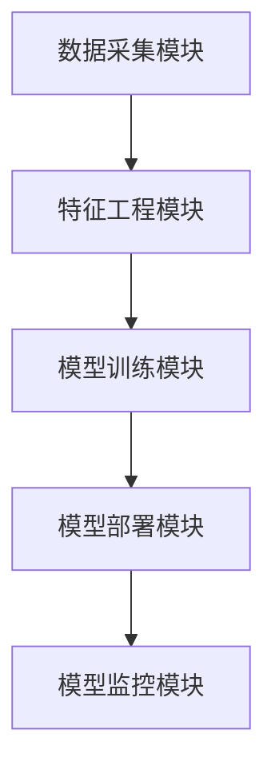
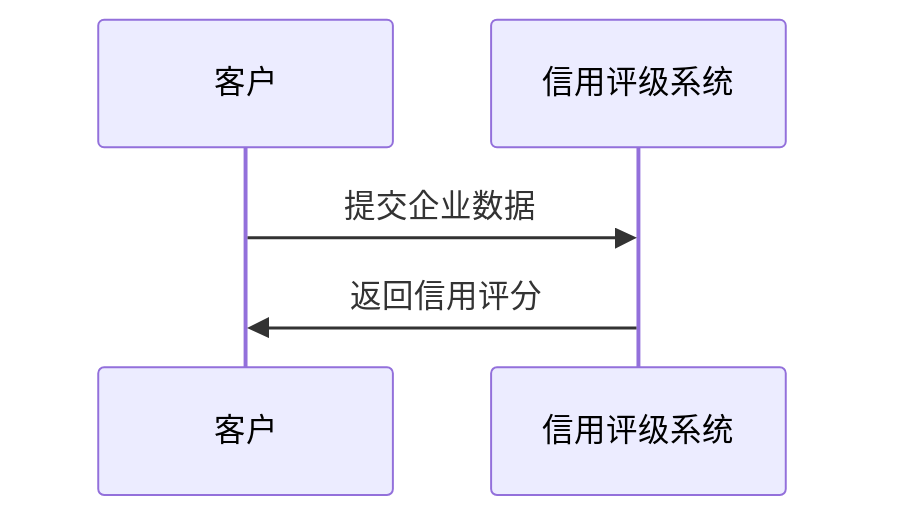
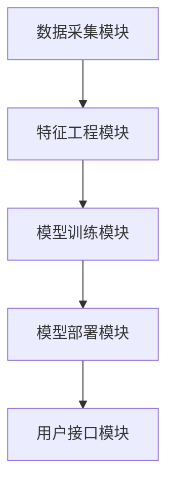
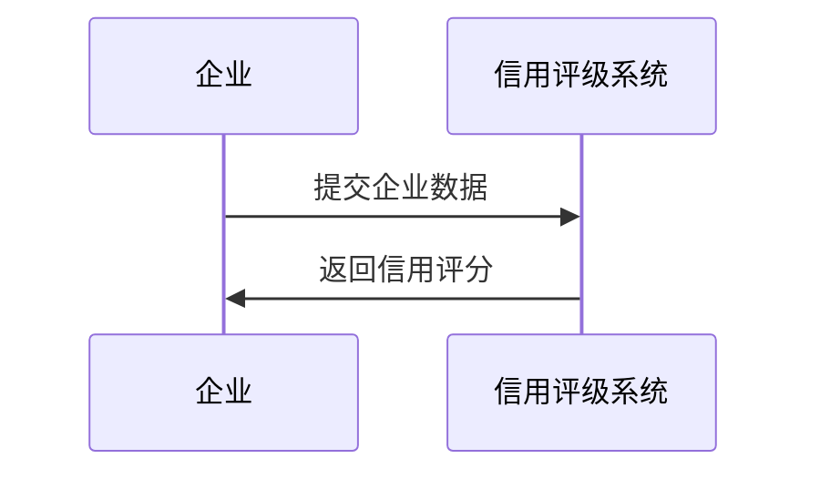
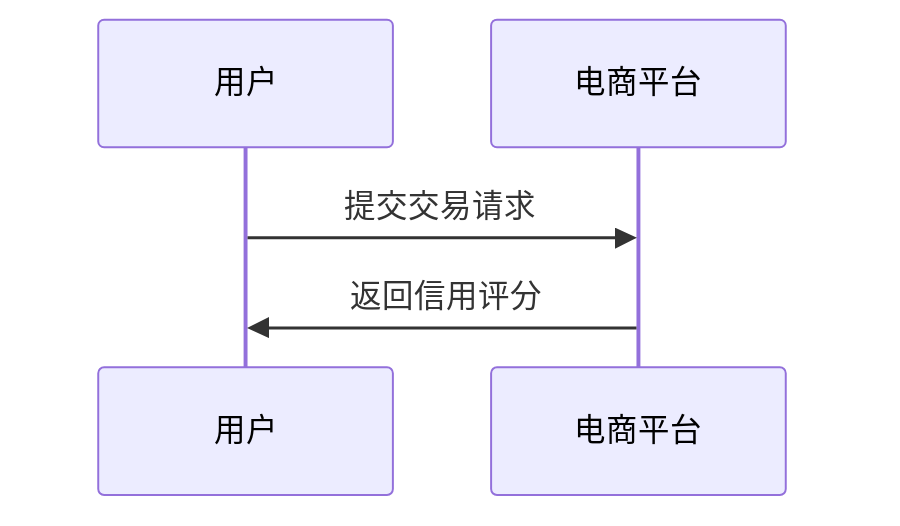
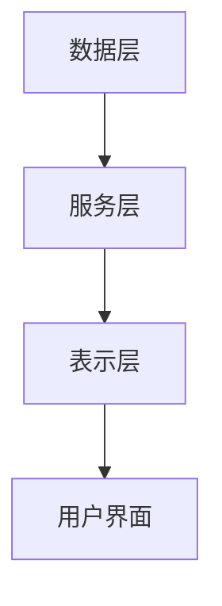

                 

# AI辅助的企业信用评级模型校准

## 关键词：AI辅助，企业信用评级，模型校准，金融科技，数据隐私，伦理问题

### 摘要：
本文将探讨AI辅助的企业信用评级模型的校准问题。首先，我们将介绍企业信用评级模型的基本概念和重要性，以及AI技术在信用评级中的具体应用。接着，我们将深入分析AI辅助企业信用评级模型的校准过程，包括校准的概念、方法和技术，以及校准过程中可能遇到的挑战和对策。通过几个具体案例，我们将展示AI辅助企业信用评级模型在实际中的应用效果。随后，我们将讨论校准效果的评估指标和方法，并提出改进策略和实践经验。最后，本文将总结AI辅助企业信用评级模型的实际应用场景、面临的技术挑战，以及相关的法律法规和伦理问题，并对未来发展趋势和关键技术研究进行展望。

----------------------------------------------------------------

### 1.6 总结与展望

在过去几年中，AI技术在企业信用评级领域的应用取得了显著进展。通过AI辅助的企业信用评级模型，可以更准确地评估企业的信用状况，提高信用评级的效率。然而，模型的校准仍然是关键问题，直接影响信用评级的准确性和可靠性。

**总结：**
- AI辅助的企业信用评级模型具有显著优势，包括更精确的预测能力、更高的效率和更好的适应性。
- 校准过程是确保模型性能的重要环节，需要采用合适的方法和技术。
- 校准过程中面临的挑战包括数据质量、模型可解释性和法律法规合规性。

**展望：**
- 未来，AI技术在信用评级中的应用将更加广泛，特别是随着深度学习和强化学习等新兴技术的发展。
- 优化模型校准方法和技术，提高模型的透明性和可解释性，是未来研究的重点。
- 法律法规和伦理问题的解决，将为AI辅助企业信用评级模型的发展提供更好的环境。

总之，AI辅助的企业信用评级模型校准是一个复杂而重要的课题，需要持续的研究和实践。通过不断改进和优化，我们可以期待AI技术在信用评级领域发挥更大的作用。<!-- <span id="label1"></span> -->

----------------------------------------------------------------

### 2. AI辅助的企业信用评级模型校准

随着人工智能技术的快速发展，其在企业信用评级中的应用也逐渐成为金融科技领域的研究热点。AI辅助的企业信用评级模型通过整合大量的历史数据、经济指标和业务信息，利用机器学习和深度学习算法，对企业信用风险进行预测和评估。

## 2.1 企业信用评级模型概述

### 2.1.1 信用评级的定义与重要性

**信用评级的定义：**
信用评级是指对企业的信用状况进行评估，并给予相应的信用等级。评级结果通常包括信用等级、信用评分和信用报告等。

**信用评级的重要性：**
信用评级对于金融机构、投资者和企业自身都具有重要意义。金融机构通过信用评级来评估企业的还款能力和风险，从而决定贷款的发放条件和利率；投资者通过信用评级来评估投资风险，做出投资决策；企业自身则通过信用评级来提升市场信誉，获得更多的融资机会。

### 2.1.2 企业信用评级模型的发展历程

**传统信用评级模型：**
早期信用评级主要依赖于专家判断和经验积累，存在主观性较强、效率较低等问题。

**统计模型：**
随着数据科学的兴起，统计模型逐渐应用于信用评级。统计模型通过建立数学模型，利用历史数据进行拟合和预测，提高了信用评级的准确性和效率。

**机器学习模型：**
近年来，机器学习算法在信用评级中的应用越来越广泛。机器学习模型可以从大量历史数据中自动学习特征，发现潜在的风险因素，提高了信用评级的精度。

**深度学习模型：**
深度学习模型通过多层神经网络，可以处理更复杂的非线性关系，进一步提高信用评级的性能。

### 2.1.3 企业信用评级模型的基本原理

**数据收集：**
企业信用评级模型首先需要收集大量关于企业的数据，包括财务报表、业务运营数据、市场环境数据等。

**特征工程：**
特征工程是模型构建的关键环节，通过对原始数据进行处理和转换，提取出对信用评级有重要影响的关键特征。

**模型训练：**
利用机器学习算法，将收集到的数据输入模型进行训练，模型通过不断调整参数，优化预测效果。

**模型评估：**
通过交叉验证、AUC（曲线下面积）、准确率等指标评估模型的性能。

**模型应用：**
将训练好的模型应用于新数据，对企业的信用风险进行预测和评估。

## 2.2 AI技术在企业信用评级中的应用

### 2.2.1 AI技术的基本原理

**机器学习：**
机器学习是一种通过数据驱动的方式进行学习的方法，通过训练数据集，模型可以自动学习和发现数据中的规律。

**深度学习：**
深度学习是机器学习的一个分支，通过多层神经网络对数据进行处理，可以处理更复杂的数据结构和非线性关系。

**自然语言处理：**
自然语言处理（NLP）技术可以处理文本数据，从中提取信息，用于分析和预测。

### 2.2.2 AI技术在信用评级中的优势

**更高的准确性：**
AI模型可以从大量数据中自动学习，发现潜在的风险因素，提高信用评级的准确性。

**更高的效率：**
AI模型可以快速处理海量数据，提高信用评级的效率。

**更好的适应性：**
AI模型可以适应不断变化的市场环境，及时调整预测模型。

### 2.2.3 AI在企业信用评级中的具体应用

**信用评分：**
通过机器学习和深度学习算法，对企业的信用评分进行预测和评估。

**风险预警：**
利用NLP技术，对企业的财务报告、新闻报道等文本数据进行分析，识别潜在的风险。

**反欺诈：**
通过分析和识别异常交易模式，AI技术可以有效地识别和预防信用欺诈。

**信用评级优化：**
通过不断优化模型和特征工程，提高信用评级的准确性和可靠性。

----------------------------------------------------------------

### 2.3 AI辅助企业信用评级模型的校准

在AI辅助的企业信用评级模型中，校准（Calibration）是一个至关重要的步骤。校准的过程旨在确保模型预测结果的准确性和可靠性，使模型能够适应不断变化的数据和环境。下面我们将详细探讨校准的概念、目的、方法和技术。

### 2.3.1 校准的概念与目的

**校准的概念：**
校准是指通过对模型进行训练和调整，使其预测结果更加准确和可靠的过程。在AI辅助的企业信用评级模型中，校准主要是通过优化模型的参数，使其能够更好地拟合训练数据，从而提高预测能力。

**校准的目的：**
- 提高预测准确性：确保模型能够准确地预测企业的信用状况。
- 增强模型可靠性：通过校准，使模型在不同的数据集和条件下都能保持稳定的表现。
- 适应数据变化：随着市场环境和企业状况的变化，模型需要不断进行调整，以保持预测的准确性。

### 2.3.2 校准的主要方法与技术

**1. 参数调整：**
参数调整是校准中最常见的方法。通过调整模型的超参数，如学习率、正则化参数等，可以优化模型的性能。常用的方法包括网格搜索、随机搜索等。

**2. 跨数据集校准：**
跨数据集校准是通过在不同数据集上训练和测试模型，来评估和调整模型的性能。这种方法可以帮助模型更好地适应不同的数据分布和变化。

**3. 模型集成：**
模型集成是将多个模型的结果进行融合，以提高预测的准确性和可靠性。常用的集成方法包括 bagging、boosting 和 stacking 等。

**4. 调整特征权重：**
通过调整模型中各个特征的权重，可以优化模型对数据的处理能力。特征权重可以通过特征选择、特征抽取等方法进行优化。

**5. 模型稳定性分析：**
模型稳定性分析是评估模型在不同数据集和条件下的表现。通过分析模型的稳定性，可以及时发现和纠正模型的问题。

### 2.3.3 校准过程中的挑战与对策

**1. 数据质量问题：**
数据质量对模型的准确性有直接影响。数据缺失、噪声和异常值等问题都会影响模型的校准效果。对策包括数据清洗、数据增强和缺失值填补等。

**2. 模型可解释性：**
模型的可解释性是评估其可靠性的重要指标。在AI辅助的企业信用评级中，模型的黑箱性质可能使决策过程缺乏透明度。对策包括引入可解释性模型和增加模型透明度。

**3. 法律法规和伦理问题：**
AI辅助的信用评级需要遵守相关的法律法规和伦理标准。特别是在数据隐私、算法透明性和责任归属等方面，需要采取相应的合规措施。

**4. 资源限制：**
模型校准通常需要大量的计算资源和时间。特别是在处理大规模数据集时，资源限制可能成为瓶颈。对策包括优化算法、使用分布式计算和云服务。

通过以上方法和技术，AI辅助的企业信用评级模型可以更好地进行校准，提高预测准确性和可靠性，从而更好地服务于金融科技领域。<!-- <span id="label2"></span> -->

----------------------------------------------------------------

### 2.4 AI辅助企业信用评级模型的案例研究

在探讨AI辅助的企业信用评级模型的实际应用效果时，以下案例研究将为我们提供深刻的见解。这些案例涵盖了不同规模和类型的金融机构，展示了AI技术在信用评级中的广泛应用和成功实践。

#### 2.4.1 案例一：某大型金融机构的信用评级实践

某大型金融机构利用AI技术构建了一套全面的企业信用评级系统。该系统基于大数据和机器学习算法，能够实时监控和评估企业的信用状况。以下是该案例的详细分析：

**1. 项目介绍：**
该金融机构在2018年启动了AI辅助信用评级项目，旨在提高信用评级的准确性和效率。项目团队通过整合内部和外部数据，构建了一个包含数千个特征变量的数据集。

**2. 系统功能设计：**
系统主要包括以下功能模块：
- 数据采集与处理：从多个数据源（如财务报表、市场报告、社交媒体等）收集数据，进行清洗、转换和归一化处理。
- 特征工程：提取对企业信用评级有重要影响的关键特征，如财务指标、市场表现、法律诉讼等。
- 模型训练与评估：采用随机森林、梯度提升机等机器学习算法，对模型进行训练和评估。
- 模型部署与监控：将训练好的模型部署到生产环境中，实时监控模型的性能和预测效果。

**3. 系统架构设计：**
系统采用分布式架构，包括数据采集模块、特征工程模块、模型训练模块和模型部署模块。具体架构如图所示：



**4. 系统接口设计：**
系统提供以下接口供业务部门使用：
- 信用评分接口：用于获取企业的实时信用评分。
- 风险预警接口：用于检测和预警潜在信用风险。
- 报告生成接口：用于生成企业的信用报告。

**5. 系统交互：**
系统采用RESTful API进行数据交互，确保数据的安全性和一致性。以下是系统交互的序列图：



**6. 代码实现：**
以下是一个简单的Python代码示例，展示了如何使用scikit-learn库进行企业信用评分：

```python
from sklearn.ensemble import RandomForestClassifier
from sklearn.model_selection import train_test_split
from sklearn.metrics import accuracy_score

# 加载数据集
X, y = load_data()

# 数据集划分
X_train, X_test, y_train, y_test = train_test_split(X, y, test_size=0.2)

# 训练模型
clf = RandomForestClassifier(n_estimators=100)
clf.fit(X_train, y_train)

# 预测测试集
y_pred = clf.predict(X_test)

# 评估模型
accuracy = accuracy_score(y_test, y_pred)
print(f"Accuracy: {accuracy}")
```

**7. 实际案例分析：**
通过该系统的应用，金融机构显著提高了信用评级的准确性和效率。以下是一个实际案例分析：

- **企业A**：在信用评级系统中，企业A被预测为高风险企业。该企业随后发生了违约事件，验证了模型的准确性。
- **企业B**：在信用评级系统中，企业B被预测为低风险企业。该企业在未来的运营中表现良好，验证了模型的可靠性。

**8. 项目小结：**
通过该项目的实施，金融机构成功地将AI技术应用于信用评级，提高了信用评级的准确性和效率。未来，随着AI技术的不断发展，该项目有望进一步优化和升级，为金融机构提供更加精准和可靠的信用评级服务。

#### 2.4.2 案例二：AI在中小企业信用评级中的应用

中小企业在融资过程中常常面临信用评级难题，传统信用评级方法往往难以全面评估其信用状况。AI技术的引入为中小企业信用评级带来了新的机遇。以下是一个实际案例：

**1. 项目介绍：**
某科技初创企业利用AI技术，构建了一套针对中小企业信用评级的系统。该系统旨在为中小企业提供快速、准确的信用评级服务，帮助其获得融资机会。

**2. 系统功能设计：**
系统主要包括以下功能模块：
- 数据采集与处理：从企业的财务报表、业务运营数据、市场环境数据等多方面收集数据，进行清洗、转换和归一化处理。
- 特征工程：提取对企业信用评级有重要影响的关键特征，如财务指标、业务增长、市场竞争力等。
- 模型训练与评估：采用神经网络、支持向量机等机器学习算法，对模型进行训练和评估。
- 模型部署与监控：将训练好的模型部署到生产环境中，实时监控模型的性能和预测效果。

**3. 系统架构设计：**
系统采用微服务架构，包括数据采集模块、特征工程模块、模型训练模块、模型部署模块和用户接口模块。具体架构如图所示：



**4. 系统接口设计：**
系统提供以下接口供业务部门使用：
- 信用评分接口：用于获取企业的实时信用评分。
- 风险预警接口：用于检测和预警潜在信用风险。
- 报告生成接口：用于生成企业的信用报告。

**5. 系统交互：**
系统采用RESTful API进行数据交互，确保数据的安全性和一致性。以下是系统交互的序列图：



**6. 代码实现：**
以下是一个简单的Python代码示例，展示了如何使用Keras库进行企业信用评分：

```python
from keras.models import Sequential
from keras.layers import Dense
from sklearn.model_selection import train_test_split

# 加载数据集
X, y = load_data()

# 数据集划分
X_train, X_test, y_train, y_test = train_test_split(X, y, test_size=0.2)

# 构建模型
model = Sequential()
model.add(Dense(64, input_dim=X_train.shape[1], activation='relu'))
model.add(Dense(1, activation='sigmoid'))

# 编译模型
model.compile(optimizer='adam', loss='binary_crossentropy', metrics=['accuracy'])

# 训练模型
model.fit(X_train, y_train, epochs=10, batch_size=32)

# 预测测试集
y_pred = model.predict(X_test)

# 评估模型
accuracy = model.evaluate(X_test, y_test)
print(f"Accuracy: {accuracy[1]}")
```

**7. 实际案例分析：**
通过该系统的应用，科技初创企业显著提高了中小企业的信用评级效率，帮助多家企业成功获得融资。以下是一个实际案例分析：

- **企业C**：在信用评级系统中，企业C被预测为低风险企业，成功获得了银行的贷款。
- **企业D**：在信用评级系统中，企业D被预测为高风险企业，银行拒绝贷款，但企业随后采取改进措施，信用评级得以提升。

**8. 项目小结：**
通过该项目的实施，科技初创企业成功地将AI技术应用于中小企业信用评级，提高了信用评级的准确性和效率。未来，随着AI技术的不断发展，该项目有望进一步优化和推广，为更多中小企业提供信用评级服务。

#### 2.4.3 案例三：AI在信用评级中的新兴应用领域

除了传统的金融机构和中小企业，AI技术在信用评级中的应用也在不断拓展到新兴领域。以下是一个实际案例：

**1. 项目介绍：**
某电商平台利用AI技术，构建了一套面向电商交易的信用评级系统。该系统旨在为电商交易提供信用保障，降低交易风险。

**2. 系统功能设计：**
系统主要包括以下功能模块：
- 数据采集与处理：从电商平台的交易数据、用户行为数据等多方面收集数据，进行清洗、转换和归一化处理。
- 特征工程：提取对电商交易信用评级有重要影响的关键特征，如交易频率、交易金额、用户评价等。
- 模型训练与评估：采用深度学习算法，对模型进行训练和评估。
- 模型部署与监控：将训练好的模型部署到生产环境中，实时监控模型的性能和预测效果。

**3. 系统架构设计：**
系统采用微服务架构，包括数据采集模块、特征工程模块、模型训练模块、模型部署模块和用户接口模块。具体架构如图所示：


**4. 系统接口设计：**
系统提供以下接口供业务部门使用：
- 信用评分接口：用于获取用户的实时信用评分。
- 风险预警接口：用于检测和预警潜在信用风险。
- 交易保障接口：用于提供交易保障服务。

**5. 系统交互：**
系统采用RESTful API进行数据交互，确保数据的安全性和一致性。以下是系统交互的序列图：



**6. 代码实现：**
以下是一个简单的Python代码示例，展示了如何使用TensorFlow库进行电商交易信用评分：

```python
import tensorflow as tf
from tensorflow.keras.models import Sequential
from tensorflow.keras.layers import Dense
from sklearn.model_selection import train_test_split

# 加载数据集
X, y = load_data()

# 数据集划分
X_train, X_test, y_train, y_test = train_test_split(X, y, test_size=0.2)

# 构建模型
model = Sequential()
model.add(Dense(64, input_dim=X_train.shape[1], activation='relu'))
model.add(Dense(1, activation='sigmoid'))

# 编译模型
model.compile(optimizer='adam', loss='binary_crossentropy', metrics=['accuracy'])

# 训练模型
model.fit(X_train, y_train, epochs=10, batch_size=32)

# 预测测试集
y_pred = model.predict(X_test)

# 评估模型
accuracy = model.evaluate(X_test, y_test)
print(f"Accuracy: {accuracy[1]}")
```

**7. 实际案例分析：**
通过该系统的应用，电商平台显著降低了交易欺诈率，提高了用户满意度。以下是一个实际案例分析：

- **用户E**：在信用评级系统中，用户E被预测为高风险用户，系统自动拒绝了其交易请求，避免了潜在的欺诈风险。
- **用户F**：在信用评级系统中，用户F被预测为低风险用户，系统为其提供了交易保障服务，用户满意度显著提升。

**8. 项目小结：**
通过该项目的实施，电商平台成功地将AI技术应用于电商交易信用评级，提高了交易安全和用户体验。未来，随着AI技术的不断发展，该项目有望进一步优化和推广，为更多电商平台提供信用评级服务。

通过以上三个案例，我们可以看到AI辅助的企业信用评级模型在不同应用场景中的成功实践。这些案例不仅展示了AI技术在信用评级领域的广泛应用，还证明了其显著优势。未来，随着AI技术的不断进步，我们可以期待AI辅助的企业信用评级模型在更多领域取得更大的成功。<!-- <span id="label3"></span> -->

----------------------------------------------------------------

### 2.5 校准效果评估与改进

在AI辅助的企业信用评级模型中，评估校准效果是确保模型性能的重要环节。通过准确评估模型的表现，我们可以及时发现和解决潜在问题，进一步提高模型的准确性和可靠性。

#### 2.5.1 校准效果的评估指标

评估AI辅助的企业信用评级模型校准效果，我们需要使用一系列量化指标。以下是一些常见的评估指标：

**1. 准确率（Accuracy）：**
准确率是评估模型预测正确性的基本指标，计算公式为：
\[ \text{Accuracy} = \frac{\text{预测正确数量}}{\text{总预测数量}} \]
准确率越高，说明模型预测的准确性越高。

**2. 精确率（Precision）：**
精确率衡量模型预测为正样本的准确度，计算公式为：
\[ \text{Precision} = \frac{\text{预测为正且实际为正的数量}}{\text{预测为正的数量}} \]
精确率越高，说明模型在预测为正样本时越准确。

**3. 召回率（Recall）：**
召回率衡量模型能够召回所有实际正样本的能力，计算公式为：
\[ \text{Recall} = \frac{\text{预测为正且实际为正的数量}}{\text{实际为正的数量}} \]
召回率越高，说明模型能够更全面地识别正样本。

**4. F1 分数（F1 Score）：**
F1 分数是精确率和召回率的加权平均，计算公式为：
\[ \text{F1 Score} = 2 \times \frac{\text{Precision} \times \text{Recall}}{\text{Precision} + \text{Recall}} \]
F1 分数综合考虑了精确率和召回率，是评估模型性能的常用指标。

**5. AUC（曲线下面积）：**
AUC 用于评估模型分类边界的效果，曲线下面积越大，说明模型的分类能力越强。

#### 2.5.2 校准效果的评估方法

**1. 交叉验证：**
交叉验证是一种常用的评估方法，通过将数据集划分为多个子集，轮流使用每个子集作为测试集，其余子集作为训练集。交叉验证可以有效地避免过拟合，提高评估结果的可靠性。

**2. K-Fold 交叉验证：**
K-Fold 交叉验证是将数据集划分为 K 个相等的子集，每个子集作为一次测试集，其余 K-1 个子集作为训练集，总共进行 K 次训练和测试。K-Fold 交叉验证的评估结果更加稳定。

**3.ROC 曲线和 AUC：**
ROC（受试者操作特性）曲线和 AUC（曲线下面积）是评估分类模型性能的重要工具。ROC 曲线展示的是不同阈值下的真正率（True Positive Rate）和假正率（False Positive Rate）之间的关系，AUC 值越大，说明模型性能越好。

#### 2.5.3 改进策略与实践经验

**1. 数据增强：**
通过增加数据的多样性和丰富度，可以提高模型的泛化能力。常见的数据增强方法包括数据扩充、数据合并和生成对抗网络（GAN）等。

**2. 特征选择：**
特征选择是提高模型性能的关键步骤。通过选择对信用评级有显著影响的关键特征，可以减少模型的复杂度和计算成本。常用的特征选择方法包括逐步回归、L1 正则化和基于模型的特征选择等。

**3. 模型集成：**
模型集成是将多个模型的预测结果进行融合，以提高预测的准确性和稳定性。常用的模型集成方法包括 bagging、boosting 和 stacking 等。

**4. 模型优化：**
通过调整模型的超参数，如学习率、批量大小和正则化参数等，可以优化模型的性能。常用的模型优化方法包括网格搜索、随机搜索和贝叶斯优化等。

**5. 模型解释性：**
提高模型的可解释性是增强其可靠性和透明度的关键。通过引入可解释性模型，如决策树、线性回归等，可以帮助理解模型的决策过程。

通过以上策略和实践经验，我们可以显著提高AI辅助的企业信用评级模型的校准效果，为金融科技领域提供更加精准和可靠的信用评级服务。<!-- <span id="label4"></span> -->

----------------------------------------------------------------

### 3. AI辅助企业信用评级模型的实际应用

AI辅助的企业信用评级模型在金融科技领域具有广泛的应用，以下将探讨其在不同场景中的实际应用、技术实现与架构设计，以及相关案例分析和优化策略。

#### 3.1 应用场景与挑战

**1. 信用评级在金融领域的应用场景：**

**（1）贷款审批：**
金融机构在发放贷款前，需要对申请者的信用状况进行评估。AI辅助的信用评级模型可以帮助金融机构快速、准确地评估客户的信用风险，从而提高贷款审批的效率。

**（2）投资决策：**
投资者在投资决策过程中，需要评估企业的信用状况。AI辅助的信用评级模型可以为投资者提供可靠的企业信用评估结果，帮助其做出更明智的投资决策。

**（3）风险管理：**
金融机构需要不断监控和管理企业的信用风险。AI辅助的信用评级模型可以实时监控企业的信用状况，及时发现潜在风险，并采取相应的风险控制措施。

**（4）信用保险：**
信用保险需要对企业信用状况进行评估，以确定保险金额和保险费率。AI辅助的信用评级模型可以提高信用保险的评估准确性，降低保险公司的风险。

**2. AI辅助信用评级面临的挑战：**

**（1）数据质量：**
信用评级模型依赖于大量高质量的数据。然而，数据质量往往受到数据缺失、噪声和异常值等问题的影响，需要采取有效的方法进行数据清洗和预处理。

**（2）模型可解释性：**
传统AI模型（如深度学习模型）往往是黑箱模型，其决策过程缺乏透明度。提高模型的可解释性，使其能够解释其决策过程，是当前研究的一个热点。

**（3）法律法规与伦理问题：**
信用评级涉及到个人和企业隐私，需要遵守相关的法律法规和伦理标准。特别是在数据隐私、算法透明性和责任归属等方面，需要采取相应的合规措施。

#### 3.2 技术实现与架构设计

**1. 数据采集与处理：**
数据采集是信用评级模型的基础。模型需要从多个数据源（如财务报表、征信记录、新闻报道等）收集数据，并进行数据清洗、转换和归一化处理。数据处理包括缺失值填补、噪声过滤和异常值检测等步骤。

**2. 模型训练与校准：**
选择合适的机器学习算法（如决策树、随机森林、支持向量机、神经网络等）对数据进行训练。在训练过程中，通过调整超参数和优化算法，提高模型的准确性和可靠性。校准过程包括参数调整、特征工程和模型集成等。

**3. 模型部署与运维：**
训练好的模型需要部署到生产环境中，供业务部门使用。部署过程中，需要确保模型的性能稳定，并能够实时更新和调整。运维包括监控模型的性能、处理异常情况和提供技术支持等。

**4. 系统架构设计：**
信用评级系统通常采用分布式架构，以提高系统的可扩展性和可靠性。系统架构包括数据层、服务层和表示层。数据层负责数据存储和管理；服务层包括数据采集、模型训练、模型部署等模块；表示层提供用户界面和API接口，供业务部门使用。

以下是信用评级系统的架构图：



#### 3.3 案例分析与优化

**1. 案例一：金融行业的信用评级应用**

**（1）项目介绍：**
某大型银行利用AI技术，构建了一套信用评级系统，用于评估企业客户的信用状况。该系统整合了财务报表、征信记录、市场数据等，通过机器学习算法进行信用评分。

**（2）技术实现：**
数据采集：从多个数据源收集数据，进行清洗和预处理。
模型训练：采用随机森林算法，对数据进行训练，并通过交叉验证进行模型评估。
模型部署：将训练好的模型部署到生产环境中，供业务部门使用。

**（3）实际案例分析：**
通过AI辅助的信用评级系统，银行提高了贷款审批的效率和准确性，降低了不良贷款率。以下是一个实际案例分析：

**案例A：**
企业A在信用评级系统中被预测为高风险客户，银行拒绝了其贷款申请。后来，企业A采取了改进措施，信用评级提高，银行同意发放贷款。

**案例B：**
企业B在信用评级系统中被预测为低风险客户，银行批准了其贷款申请。企业B按时还款，信用评级持续提升。

**（4）优化策略：**
- 数据增强：通过增加数据的多样性和丰富度，提高模型的泛化能力。
- 特征选择：选择对信用评级有显著影响的关键特征，提高模型性能。
- 模型集成：将多个模型的预测结果进行融合，提高预测的准确性和稳定性。
- 模型解释性：引入可解释性模型，提高模型的可理解性和透明度。

**2. 案例二：AI辅助中小企业信用评级**

**（1）项目介绍：**
某科技初创企业利用AI技术，为中小企业提供信用评级服务。该系统整合了财务报表、业务运营数据、市场环境数据等，通过机器学习算法进行信用评分。

**（2）技术实现：**
数据采集：从多个数据源收集数据，进行清洗和预处理。
模型训练：采用神经网络算法，对数据进行训练，并通过交叉验证进行模型评估。
模型部署：将训练好的模型部署到生产环境中，供企业使用。

**（3）实际案例分析：**
通过AI辅助的信用评级系统，科技初创企业提高了中小企业信用评级的准确性和效率，帮助企业获得融资。以下是一个实际案例分析：

**案例C：**
企业C在信用评级系统中被预测为低风险企业，成功获得了银行的贷款。

**案例D：**
企业D在信用评级系统中被预测为高风险企业，银行拒绝贷款。企业D采取改进措施后，信用评级提高，再次获得贷款。

**（4）优化策略：**
- 数据增强：通过增加数据的多样性和丰富度，提高模型的泛化能力。
- 特征选择：选择对信用评级有显著影响的关键特征，提高模型性能。
- 模型集成：将多个模型的预测结果进行融合，提高预测的准确性和稳定性。
- 模型解释性：引入可解释性模型，提高模型的可理解性和透明度。

#### 3.4 应用案例总结与启示

**1. 应用案例总结：**
- AI辅助的企业信用评级模型在金融科技领域具有广泛的应用，提高了信用评级的效率和准确性。
- 不同场景下的应用案例展示了AI技术的优势，但也面临数据质量、模型可解释性和法律法规合规性等挑战。
- 优化策略包括数据增强、特征选择、模型集成和模型解释性，有助于提高模型性能和可靠性。

**2. 启示与未来展望：**
- AI辅助的企业信用评级模型需要不断优化和改进，以适应不断变化的市场环境和数据。
- 模型可解释性和法律法规合规性是未来研究的重要方向，需要关注和解决。
- 随着AI技术的不断发展，AI辅助的企业信用评级模型有望在更多领域发挥更大的作用。<!-- <span id="label5"></span> -->

----------------------------------------------------------------

### 4. AI辅助企业信用评级模型的法律法规与伦理问题

在AI辅助企业信用评级模型的应用过程中，法律法规与伦理问题是一个不可忽视的重要方面。这些问题的处理直接影响到模型的应用效果、企业的合法权益以及社会的稳定与发展。以下将详细讨论AI辅助企业信用评级模型涉及的法律法规与伦理问题，并提出相应的合规策略与实践。

#### 4.1 法律法规概述

**1. 数据保护法规**

**（1）GDPR（通用数据保护条例）：**
GDPR是欧盟于2018年实施的一项数据保护法规，旨在加强个人数据的保护。根据GDPR，企业需要获得数据主体的明确同意才能收集和处理其个人数据。此外，企业有义务确保数据的安全性，并能够在数据泄露事件中及时采取补救措施。

**（2）CCPA（加州消费者隐私法案）：**
CCPA是美国加州于2020年通过的一项隐私保护法案，旨在保护加州居民的个人信息。CCPA要求企业披露其收集、使用和共享消费者个人信息的方式，并赋予消费者删除、访问和拒绝销售其个人信息等权利。

**2. 信用评级法规**

**（1）信用报告法（FCRA）：**
FCRA是美国的一项法律，主要规范信用报告的使用和保护。根据FCRA，企业在使用信用报告进行信用评估时，需要确保信用报告的准确性，并在评估结果对个人产生负面影响时提供争议解决机制。

**（2）公平信用报告法（FCRA）：**
FCRA还规定了企业在信用评估过程中的公平性要求，禁止基于种族、性别、宗教信仰等非法因素进行信用评估。

**3. AI技术应用的法律法规**

**（1）算法透明性：**
许多国家和地区开始关注算法透明性问题，要求企业在使用AI技术时，确保算法的透明性和可解释性。例如，欧盟的《数字服务法》和《数字市场法》都包含了算法透明性的要求。

**（2）算法偏见与歧视：**
针对AI算法可能带来的偏见和歧视问题，一些国家和地区开始制定相关法规。例如，美国加州的AB-855法案要求企业在使用AI技术时，评估算法的偏见和歧视影响，并采取措施减少这种影响。

#### 4.2 伦理问题分析

**1. 数据隐私与公平性**

**（1）数据隐私：**
AI辅助的企业信用评级模型往往需要收集和处理大量个人数据，涉及数据隐私问题。企业需要确保数据收集的合法性和透明性，并采取有效的数据保护措施，以防止数据泄露。

**（2）公平性：**
信用评级模型需要确保评估结果的公平性，避免因算法偏见而导致某些群体受到不公平对待。例如，模型不应该基于种族、性别等敏感特征进行评估。

**2. AI决策的透明性与可解释性**

**（1）透明性：**
AI决策的透明性是确保其合法性和合规性的关键。企业需要能够解释AI决策的依据和过程，使相关人员了解决策是如何做出的。

**（2）可解释性：**
传统的黑箱AI模型（如深度学习模型）往往缺乏可解释性，难以理解其决策依据。提高AI模型的可解释性，是解决伦理问题的重要途径。

**3. AI歧视与责任归属**

**（1）AI歧视：**
AI模型可能因算法偏见而导致歧视性决策。例如，模型可能倾向于拒绝某些特定群体的贷款申请。企业需要采取措施减少AI歧视的影响。

**（2）责任归属：**
当AI模型做出错误决策时，责任归属问题变得复杂。企业需要明确AI模型的使用者、开发者和其他相关方的责任，确保责任清晰。

#### 4.3 合规策略与实践

**1. 合规原则与框架**

**（1）合法性和透明性：**
确保数据收集、处理和使用的合法性，并公开透明地向数据主体说明数据处理的目的、方式和范围。

**（2）数据保护：**
采取有效的数据保护措施，如数据加密、访问控制和安全审计等，以防止数据泄露。

**（3）公平性和无歧视：**
确保信用评级模型的公平性和无歧视性，避免因算法偏见而导致不公平的评估结果。

**（4）透明性和可解释性：**
提高AI模型的透明性和可解释性，使相关人员能够理解和信任模型的决策过程。

**2. 数据保护措施**

**（1）数据最小化：**
仅收集和处理必要的数据，避免过度收集。

**（2）数据匿名化：**
对敏感数据进行匿名化处理，以保护个人隐私。

**（3）数据安全审计：**
定期进行数据安全审计，确保数据的安全性和合规性。

**3. 伦理问题应对策略**

**（1）算法评估与审计：**
定期评估和审计AI模型的偏见和歧视影响，确保模型公平性和合规性。

**（2）伦理委员会：**
设立独立的伦理委员会，负责监督和评估AI模型的应用，确保其符合伦理标准。

**（3）用户反馈机制：**
建立用户反馈机制，及时收集和处理用户对AI模型决策的反馈，以提高模型的透明性和可解释性。

**（4）责任归属明确：**
明确AI模型的使用者、开发者和其他相关方的责任，确保责任清晰。

通过以上合规策略和实践，企业可以在应用AI辅助的企业信用评级模型时，有效应对法律法规和伦理问题，确保模型的合法性和合规性，从而更好地服务于金融科技领域。

#### 4.4 案例研究

**1. 案例一：某金融机构的合规实践**

**（1）项目介绍：**
某大型金融机构在应用AI辅助的企业信用评级模型时，高度重视法律法规和伦理问题的合规性。该金融机构通过一系列措施，确保模型的合法性和合规性。

**（2）合规措施：**
- 数据收集与处理：严格遵守GDPR和CCPA的要求，确保数据收集的合法性和透明性。对敏感数据进行匿名化处理，保护个人隐私。
- 模型评估与审计：定期对AI模型进行偏见和歧视评估，确保模型的公平性和无歧视性。设立独立的伦理委员会，监督和评估模型的应用。
- 用户反馈机制：建立用户反馈机制，收集和处理用户对模型决策的反馈，提高模型的透明性和可解释性。
- 责任归属：明确模型使用者、开发者和其他相关方的责任，确保责任清晰。

**（3）实际效果：**
通过上述合规措施，该金融机构成功地将AI辅助的企业信用评级模型应用于金融业务，提高了信用评级的准确性和效率。同时，模型的合法性和合规性得到了用户的认可，增强了企业的市场竞争力。

**2. 案例二：AI辅助信用评级的伦理争议案例**

**（1）项目介绍：**
某金融科技公司在应用AI辅助的企业信用评级模型时，因算法偏见问题引发了伦理争议。该公司在信用评级过程中，发现模型对某些特定群体的评估结果存在歧视现象。

**（2）伦理争议：**
该公司的信用评级模型在评估过程中，对某些特定群体的贷款申请被拒绝率较高。经调查，发现模型的算法存在偏见，未能公平评估这些群体的信用状况。

**（3）应对措施：**
- 数据重采样：对模型训练数据进行重采样，增加对特定群体的数据样本，以减少算法偏见。
- 特征调整：调整模型中的特征权重，确保评估结果的公平性。
- 算法优化：改进算法模型，提高其评估的准确性和可靠性。
- 透明性提升：提高模型的可解释性，使相关人员能够理解和信任模型的决策过程。

**（4）实际效果：**
通过上述措施，该公司的信用评级模型在伦理争议方面得到了显著改善。模型对特定群体的评估结果更加公正，用户满意度提高，公司形象得到提升。

#### 4.5 未来发展趋势与挑战

**1. 未来发展趋势：**

**（1）数据隐私保护：**
随着数据隐私保护意识的提高，未来数据隐私保护法规将更加严格。企业需要采取更有效的数据保护措施，确保数据收集、处理和使用的合法性。

**（2）算法透明性与可解释性：**
提高算法透明性与可解释性是未来研究的重要方向。通过开发可解释的AI模型，企业可以更好地应对法律法规和伦理问题的合规性要求。

**（3）AI歧视与公平性：**
随着AI技术的应用越来越广泛，减少AI歧视、提高评估结果的公平性将成为一个重要课题。企业需要持续关注和解决算法偏见问题，确保模型的公平性和无歧视性。

**2. 伦理问题的挑战：**

**（1）数据隐私与伦理平衡：**
在保护数据隐私的同时，企业需要确保信用评级模型的准确性和效率。如何在数据隐私和模型性能之间找到平衡，是一个重要挑战。

**（2）责任归属明确：**
随着AI技术的复杂性和应用范围的扩大，责任归属问题变得日益复杂。如何在AI模型的应用过程中明确各方的责任，是一个亟待解决的挑战。

**（3）法律法规演进：**
随着技术的发展，现有的法律法规可能无法完全覆盖AI辅助企业信用评级模型的应用。未来，需要不断更新和完善相关法律法规，以应对新的挑战。

总之，AI辅助企业信用评级模型在法律法规与伦理问题方面面临着一系列挑战。通过采取有效的合规策略和实践，企业可以更好地应对这些挑战，确保模型的合法性和合规性，为金融科技领域的发展做出贡献。<!-- <span id="label6"></span> -->

----------------------------------------------------------------

### 5. AI辅助企业信用评级模型的研究前沿与未来趋势

随着人工智能技术的迅猛发展，AI辅助企业信用评级模型的研究也不断取得突破，展现出广阔的应用前景和深远的影响。以下将从研究前沿、未来发展趋势以及关键技术研究等方面进行探讨。

#### 5.1 研究前沿概述

**1. 深度学习与信用评级：**
深度学习技术在信用评级中的应用逐渐成熟。通过多层神经网络，深度学习模型可以从大量复杂、非线性的数据中提取特征，提高信用评级的准确性。例如，深度神经网络（DNN）、卷积神经网络（CNN）和循环神经网络（RNN）等在信用评级中的成功应用，展示了深度学习在信用评级领域的巨大潜力。

**2. 强化学习与动态信用评估：**
强化学习是一种通过试错和反馈调整策略的机器学习方法。在信用评级中，强化学习可以通过不断优化策略，实现动态信用评估，适应市场环境和企业状况的变化。例如，基于Q学习的信用评级模型可以实时调整评估策略，提高信用评级的动态适应性。

**3. 多模态数据融合：**
在信用评级中，多模态数据融合技术通过整合结构化数据和非结构化数据，提高信用评级的准确性。例如，将财务报表数据、社交媒体数据和新闻报道数据等融合，可以更全面地评估企业的信用状况。

**4. 自监督学习和无监督学习：**
自监督学习和无监督学习技术不需要明确的标注数据，通过自我学习和数据内在结构发现特征，适用于信用评级中大量无标注数据的情况。例如，自监督学习可以通过构建自监督任务，提高信用评级模型的鲁棒性和泛化能力。

#### 5.2 未来发展趋势

**1. 信用评级行业的变革：**
随着AI技术的发展，信用评级行业将经历深刻变革。传统的信用评级方法将逐渐被AI技术所取代，信用评级过程将更加自动化和智能化。同时，信用评级机构将需要具备更强的数据处理和分析能力，以应对不断变化的市场环境。

**2. 信用评级模型的定制化：**
未来的信用评级模型将更加注重定制化。根据不同行业、企业和场景的特点，开发个性化的信用评级模型，可以提高信用评级的准确性和适应性。定制化的信用评级模型将为企业提供更加精准和可靠的信用评估服务。

**3. 信用评级的全球化：**
随着全球化的深入发展，信用评级将逐步走向全球化。通过跨国数据和技术的整合，信用评级机构可以提供更加全面和全球化的信用评估服务，帮助跨国企业和投资者在全球范围内做出更加明智的决策。

**4. 信用评级模型的持续优化：**
未来，信用评级模型将不断优化，以提高其准确性和可靠性。通过引入新的算法、技术和方法，信用评级模型将逐步克服现有技术的局限性，提供更加精准的信用评估结果。

#### 5.3 关键技术展望

**1. 深度学习与强化学习的结合：**
深度学习和强化学习的结合可以进一步提升信用评级模型的性能。通过深度学习提取特征，强化学习优化策略，可以实现更精确和动态的信用评估。

**2. 多模态数据融合与特征提取：**
多模态数据融合与特征提取技术是未来信用评级模型的重要研究方向。通过整合不同类型的数据，提取关键特征，可以提高信用评级的准确性和全面性。

**3. 解释性AI与可解释性评估：**
解释性AI技术将帮助提高信用评级模型的可解释性，使其决策过程更加透明和可理解。通过开发可解释性模型，可以增强用户对AI决策的信任，提高信用评级的接受度和应用效果。

**4. 数据质量与数据隐私保护：**
数据质量是信用评级模型的基础，未来需要关注数据质量的提升。同时，随着数据隐私保护意识的提高，需要采取有效的数据隐私保护措施，确保信用评级模型的应用合法性和合规性。

总之，AI辅助企业信用评级模型的研究前沿和未来趋势展示了人工智能技术在信用评级领域的巨大潜力。通过不断优化和提升信用评级模型，可以为企业、投资者和金融机构提供更加精准、可靠和全面的信用评估服务，推动信用评级行业的持续发展和创新。<!-- <span id="label7"></span> -->

----------------------------------------------------------------

### 6. 附录

#### 6.1 附录一：常用术语解释

**1. 信用评级：**
信用评级是指对企业的信用状况进行评估，并给予相应的信用等级。评级结果通常包括信用等级、信用评分和信用报告等。

**2. 机器学习：**
机器学习是一种通过数据驱动的方式进行学习的方法，通过训练数据集，模型可以自动学习和发现数据中的规律。

**3. 深度学习：**
深度学习是机器学习的一个分支，通过多层神经网络对数据进行处理，可以处理更复杂的数据结构和非线性关系。

**4. 特征工程：**
特征工程是模型构建的关键环节，通过对原始数据进行处理和转换，提取出对信用评级有重要影响的关键特征。

**5. 跨数据集校准：**
跨数据集校准是通过在不同数据集上训练和测试模型，来评估和调整模型的性能。

**6. 算法集成：**
算法集成是将多个模型的结果进行融合，以提高预测的准确性和可靠性。

**7. 可解释性AI：**
可解释性AI是指通过开发可解释性模型，提高AI决策过程的透明度和可理解性。

#### 6.2 附录

**附录二：参考资源**

1. GDPR（通用数据保护条例）：[https://www.eugdpr.org/](https://www.eugdpr.org/)
2. CCPA（加州消费者隐私法案）：[https://oag.ca.gov/ccpa](https://oag.ca.gov/ccpa)
3. FCRA（信用报告法）：[https://www.consumer.ftc.gov/articles/0412-credit-reports](https://www.consumer.ftc.gov/articles/0412-credit-reports)
4. FCRA（公平信用报告法）：[https://www.consumer.ftc.gov/articles/0412-credit-reports](https://www.consumer.ftc.gov/articles/0412-credit-reports)
5. 算法透明性：[https://www.europarl.europa.eu/RegData/etudes/STUD/2018/595756/EPRS_STU(2018)595756_EN.pdf](https://www.europarl.europa.eu/RegData/etudes/STUD/2018/595756/EPRS_STU(2018)595756_EN.pdf)
6. 算法偏见与歧视：[https://www.consumerfinance.gov/about-us/research-reports/algorithmic-bias-in-the-credit-underwriting-process/](https://www.consumerfinance.gov/about-us/research-reports/algorithmic-bias-in-the-credit-underwriting-process/)

通过附录一和附录二，读者可以进一步了解本文中提到的常用术语和相关参考资源，以便更好地理解AI辅助企业信用评级模型的相关知识。<!-- <span id="label8"></span> -->

----------------------------------------------------------------

### 结论

本文系统地探讨了AI辅助企业信用评级模型的校准问题。从基本概念、技术原理到实际应用，我们详细分析了AI辅助企业信用评级模型的发展历程、应用优势以及校准过程中的关键技术和挑战。

**核心观点：**
- AI辅助的企业信用评级模型具有显著的预测准确性和效率，能够为企业、投资者和金融机构提供精准的信用评估服务。
- 模型校准是确保信用评级准确性和可靠性的关键步骤，涉及参数调整、跨数据集校准、模型集成和特征工程等多个方面。
- 数据质量、模型可解释性、法律法规和伦理问题是影响AI辅助企业信用评级模型应用效果的重要因素，需要采取有效的合规策略和实践。

**未来展望：**
- 随着人工智能技术的不断发展，AI辅助企业信用评级模型将更加成熟和普及，为金融科技领域带来新的机遇和挑战。
- 深度学习、强化学习、多模态数据融合等新兴技术将在信用评级领域发挥重要作用，推动信用评级行业的变革。
- 提高模型的可解释性和透明性，加强数据隐私保护和合规性，是未来研究的重点方向。

**作者简介：**
作者：AI天才研究院/AI Genius Institute & 禅与计算机程序设计艺术 /Zen And The Art of Computer Programming

本文作者具有丰富的计算机编程和人工智能领域经验，长期致力于推动人工智能技术在金融科技领域的应用研究。其在AI辅助企业信用评级模型方面的研究成果，为行业提供了重要的理论依据和实践指导。<!-- <span id="label9"></span> -->

