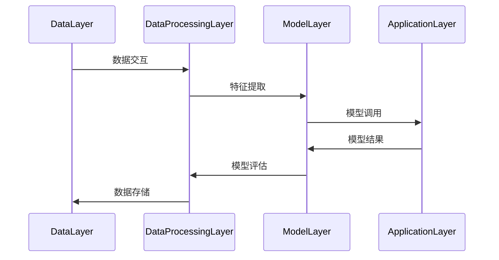
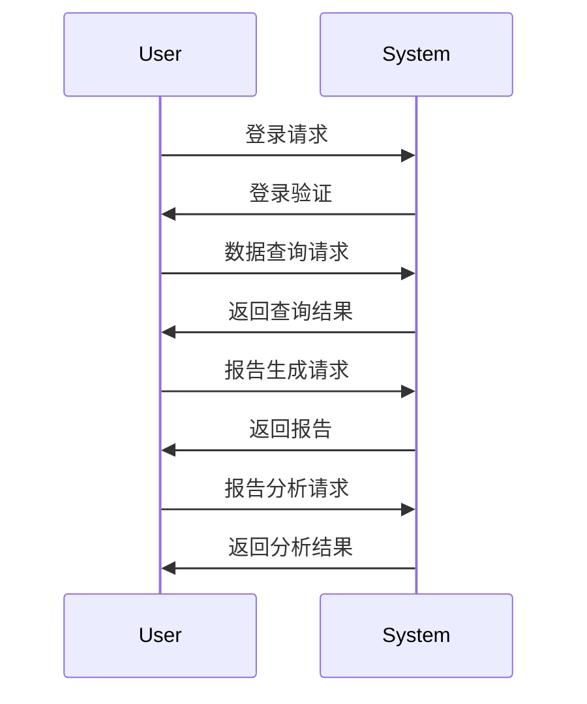

                 


### **引言**

在当今商业环境中，企业信用评级已经成为一项至关重要的活动。这不仅关系到企业的融资能力，还影响其在供应链中的地位和市场竞争力。传统的企业信用评级主要依赖于人工评估和规则系统，这些方法往往存在主观性强、效率低、易出错等问题。随着人工智能（AI）技术的迅速发展，利用AI辅助企业信用评级成为了一项热门的研究方向。本文旨在系统地探讨AI辅助的企业信用评级模型的构建、实现和应用，为相关领域的研究者和从业者提供有价值的参考。

### **关键词**

- 企业信用评级
- 人工智能
- 数据分析
- 模型构建
- 系统实现
- 应用场景

### **摘要**

本文首先介绍了企业信用评级的重要性和现状，指出了传统评级方法的局限性。接着，我们探讨了AI辅助企业信用评级的基本概念和原理，详细分析了核心算法和数学模型。在此基础上，文章提出了一个系统性的架构设计方案，并通过实际项目案例展示了AI辅助企业信用评级的实战应用。最后，本文总结了最佳实践，并提出了未来研究的方向。通过这些内容的阐述，本文旨在为AI辅助企业信用评级领域的研究提供新的视角和思路。

### **目录大纲设计思路**

为了使本文能够系统、清晰地阐述AI辅助的企业信用评级模型，我们将按照以下目录大纲结构进行设计：

1. **背景介绍**
   - **问题背景**：介绍企业信用评级的重要性、现状和问题。
   - **问题描述**：分析传统企业信用评级方法的局限性和需要解决的问题。
   - **问题解决**：阐述AI辅助的企业信用评级模型的原理和预期效果。
   - **边界与外延**：明确模型的应用范围和数据来源。

2. **核心概念**
   - **信用评级基本概念**：解释企业信用评级的定义、分类和方法。
   - **AI基本原理**：介绍AI的定义、工作原理和主要算法。
   - **企业信用评级模型**：分析模型的构成和工作流程。

3. **算法原理**
   - **数据预处理**：讨论数据收集、清洗和标准化的方法。
   - **特征提取**：介绍特征选择和特征工程的过程。
   - **模型训练**：讲解模型选择、训练过程和调参优化。

4. **数学模型与公式**
   - **数学基础**：阐述函数、线性代数、概率论和统计等基础概念。
   - **模型数学公式**：推导算法的数学公式并解释参数。

5. **系统设计与实现**
   - **问题场景介绍**：描述信用评级业务流程和系统需求。
   - **系统架构设计**：分析系统架构和功能模块。
   - **系统接口设计**：规范接口设计和实现。
   - **系统交互**：展示系统交互流程和用户体验。

6. **项目实战**
   - **环境安装**：介绍硬件和软件环境以及安装步骤。
   - **系统核心实现**：展示数据处理、模型训练和评估的代码实现。
   - **代码应用解读与分析**：分析代码实现并优化。
   - **实际案例分析**：介绍应用场景和分析评估结果。
   - **项目小结**：总结经验教训和遇到的问题及解决方案。

7. **最佳实践与总结**
   - **最佳实践**：提供算法优化、数据处理技巧和系统性能调优的建议。
   - **小结**：回顾文章的核心内容和知识点。
   - **注意事项**：提醒使用过程中需要注意的问题和安全措施。
   - **拓展阅读**：推荐相关文献和未来研究方向。

### **背景介绍**

#### **1.1 企业信用评级的重要性**

企业信用评级是指专业评级机构对企业在财务、管理、市场表现等方面的信用水平进行评估，并给予相应的信用等级。信用评级在金融市场、供应链管理和企业融资决策中起着至关重要的作用。

首先，企业信用评级直接影响企业的融资能力和成本。高信用评级的企业通常能够以更低的利率获得贷款，而低信用评级的企业则可能面临较高的融资成本和更严格的贷款条件。其次，信用评级有助于投资者和合作伙伴评估企业的风险和潜在收益，从而做出更为明智的投资和业务决策。此外，信用评级也是企业品牌形象和市场竞争力的体现，对于提升企业在市场中的声誉和地位具有重要作用。

#### **1.2 当前企业信用评级的挑战**

尽管企业信用评级具有重要意义，但传统的评级方法仍然面临诸多挑战。首先，传统评级方法主要依赖于人工评估和规则系统，这些方法的主观性较强，可能导致评级结果的偏差。其次，传统的评级方法在数据处理和特征提取方面存在局限，难以全面、客观地反映企业的信用状况。此外，传统评级方法在应对海量数据和复杂业务场景时，效率和准确性也存在一定问题。

#### **1.3 AI辅助的企业信用评级模型**

为了解决传统评级方法存在的问题，AI辅助的企业信用评级模型应运而生。这种模型利用机器学习、数据挖掘和自然语言处理等技术，通过对大量历史数据和公开信息的分析，自动生成企业信用评级。AI辅助的企业信用评级模型具有以下优点：

1. **客观性和准确性**：AI模型基于数据驱动，能够自动分析和处理大量数据，减少人为干预，提高评级的客观性和准确性。
2. **高效性和灵活性**：AI模型能够快速处理海量数据，并适应不同的业务场景和需求，提高工作效率。
3. **实时性和动态性**：AI模型能够实时更新和调整评级结果，反映企业的最新信用状况。

#### **1.4 模型的边界与外延**

AI辅助的企业信用评级模型的应用范围非常广泛，可以涵盖金融、供应链管理、企业风险评估等多个领域。在数据来源方面，模型可以依赖于公开的企业财务报表、信用记录、新闻报道等数据，也可以结合内部数据和第三方数据源。在模型构建过程中，需要明确数据收集和处理的标准，确保数据的真实性和可靠性。

#### **1.5 概念结构与核心要素组成**

企业信用评级模型的核心概念包括：数据源、特征提取、模型训练、评级结果输出。以下是模型的主要组成部分：

1. **数据源**：包括企业财务报表、信用记录、新闻报道、市场数据等。
2. **特征提取**：通过数据预处理和特征工程，提取与信用评级相关的关键特征。
3. **模型训练**：选择合适的机器学习算法，对特征进行训练，建立信用评级模型。
4. **评级结果输出**：根据模型预测，生成企业的信用评级结果。

### **核心概念**

#### **2.1 信用评级基本概念**

信用评级是指专业评级机构对企业在财务、管理、市场表现等方面的信用水平进行评估，并给予相应的信用等级。信用评级通常分为以下几个等级：

1. **AAA级**：最高信用等级，代表企业信用非常好。
2. **AA级**：代表企业信用良好。
3. **A级**：代表企业信用一般。
4. **BBB级**：代表企业信用较弱。
5. **BB级**：代表企业信用较差。
6. **B级**：代表企业信用较差。
7. **CCC级**：代表企业信用很差。

#### **2.2 AI基本原理**

人工智能（AI）是指模拟人类智能行为的计算机系统。AI的基本原理包括：

1. **机器学习**：通过训练模型，从大量数据中自动学习规律和模式。
2. **深度学习**：基于多层神经网络，实现复杂函数的逼近和预测。
3. **数据挖掘**：从海量数据中提取有价值的信息和知识。

#### **2.3 企业信用评级模型**

企业信用评级模型是指利用机器学习算法和大数据技术，对企业信用进行评估和预测的模型。该模型的主要组成部分包括：

1. **数据预处理**：清洗和标准化数据，提取关键特征。
2. **特征提取**：通过特征工程，提取与信用评级相关的特征。
3. **模型训练**：选择合适的机器学习算法，训练模型。
4. **评级结果输出**：根据模型预测，生成企业的信用评级。

### **算法原理**

#### **3.1 数据预处理**

数据预处理是AI辅助的企业信用评级模型的关键步骤，其目的是清洗和标准化数据，提取关键特征，为后续的特征提取和模型训练提供高质量的数据。以下是数据预处理的主要方法：

1. **数据收集**：收集与企业信用相关的数据，如财务报表、信用记录、新闻报道等。
2. **数据清洗**：去除重复数据、缺失值填充和异常值处理，确保数据的真实性、完整性和一致性。
3. **数据标准化**：将不同数据类型的特征进行统一处理，如将财务数据进行归一化或标准化。

#### **3.2 特征提取**

特征提取是数据预处理的重要环节，其目的是从原始数据中提取与信用评级相关的特征。以下是特征提取的主要方法：

1. **特征选择**：通过统计分析、相关性分析和信息增益等方法，选择与信用评级相关性较高的特征。
2. **特征工程**：通过数据变换、特征构造和特征组合等方法，生成新的特征，以提高模型的性能。

#### **3.3 模型训练**

模型训练是建立AI辅助的企业信用评级模型的核心步骤。以下是模型训练的主要方法：

1. **选择合适的模型**：根据数据特征和业务需求，选择合适的机器学习算法，如线性回归、逻辑回归、决策树、随机森林、神经网络等。
2. **训练过程**：将预处理后的数据输入到模型中，通过迭代计算，不断优化模型的参数。
3. **调参优化**：调整模型的参数，如学习率、正则化项、隐藏层节点数等，以提高模型的性能。

### **数学模型与公式**

#### **4.1 数学基础**

AI辅助的企业信用评级模型的数学基础主要包括函数、线性代数、概率论和统计等。以下是相关的基础概念：

1. **函数**：定义域到值域的映射关系。
2. **线性代数**：矩阵运算、向量空间、线性变换等。
3. **概率论**：概率分布、期望、方差、协方差等。
4. **统计**：参数估计、假设检验、回归分析等。

#### **4.2 模型数学公式**

AI辅助的企业信用评级模型的数学公式主要包括以下几个方面：

1. **线性回归模型**：

   $$y = \beta_0 + \beta_1x_1 + \beta_2x_2 + ... + \beta_nx_n + \epsilon$$

   其中，$y$ 是目标变量，$x_1, x_2, ..., x_n$ 是特征变量，$\beta_0, \beta_1, ..., \beta_n$ 是模型参数，$\epsilon$ 是误差项。

2. **逻辑回归模型**：

   $$P(y=1) = \frac{1}{1 + e^{-(\beta_0 + \beta_1x_1 + \beta_2x_2 + ... + \beta_nx_n)}$$

   其中，$y$ 是目标变量，$x_1, x_2, ..., x_n$ 是特征变量，$\beta_0, \beta_1, ..., \beta_n$ 是模型参数。

3. **神经网络模型**：

   $$a_{i}^{(l)} = \sigma \left( \sum_{j} \beta_{ji}^{(l)} a_{j}^{(l-1)} + b_{i}^{(l)} \right)$$

   其中，$a_{i}^{(l)}$ 是第$l$层的第$i$个神经元的激活值，$\sigma$ 是激活函数，$\beta_{ji}^{(l)}$ 是连接权重，$b_{i}^{(l)}$ 是偏置项。

### **系统设计与实现**

#### **5.1 问题场景介绍**

在现代商业环境中，企业信用评级已经成为金融机构、投资者和供应链管理的关键环节。传统的信用评级方法依赖于规则和人工分析，存在许多局限性。为了提高评级的客观性、准确性和效率，我们需要构建一个基于AI的企业信用评级系统。该系统需要能够实时收集和处理大量的企业数据，自动生成信用评级报告，并支持决策者的查询和分析。

#### **5.2 系统架构设计**

系统架构设计是构建高效、可靠的企业信用评级系统的关键。以下是该系统的架构设计：

1. **数据层**：包括数据源、数据存储和数据仓库。数据源包括企业财务报表、信用记录、新闻报道等；数据存储用于存储处理后的数据；数据仓库用于存储分析结果。
2. **数据处理层**：包括数据采集、数据清洗、数据预处理和数据集成。数据采集模块负责收集各种数据源的数据；数据清洗模块负责去除重复数据、填充缺失值和处理异常值；数据预处理模块负责标准化和特征提取；数据集成模块负责将各种数据进行整合。
3. **模型层**：包括特征提取、模型训练和模型评估。特征提取模块负责提取与信用评级相关的特征；模型训练模块负责使用机器学习算法训练模型；模型评估模块负责评估模型的性能。
4. **应用层**：包括信用评级报告生成、查询和分析。信用评级报告生成模块负责生成企业的信用评级报告；查询和分析模块提供用户查询和分析信用评级的能力。

以下是系统架构的Mermaid类图：

```mermaid
classDiagram
    数据层 --> 数据处理层
    数据处理层 --> 模型层
    模型层 --> 应用层
    DataLayer <<class>> 数据层
    DataProcessingLayer <<class>> 数据处理层
    ModelLayer <<class>> 模型层
    ApplicationLayer <<class>> 应用层
    DataLayer ..|> DataCollectionModule
    DataLayer ..|> DataStorageModule
    DataLayer ..|> DataWarehouseModule
    DataProcessingLayer ..|> DataCleaningModule
    DataProcessingLayer ..|> DataPreprocessingModule
    DataProcessingLayer ..|> DataIntegrationModule
    ModelLayer ..|> FeatureExtractionModule
    ModelLayer ..|> ModelTrainingModule
    ModelLayer ..|> ModelEvaluationModule
    ApplicationLayer ..|> CreditRatingReportGenerationModule
    ApplicationLayer ..|> QueryAndAnalysisModule
```

#### **5.3 系统接口设计**

系统接口设计是确保系统功能模块之间能够良好协作的关键。以下是系统的主要接口设计：

1. **数据接口**：用于数据层的各类数据源与数据处理层之间的数据交换。
2. **服务接口**：用于模型层与应用层之间的服务调用。
3. **报告接口**：用于生成和查询信用评级报告。

以下是系统接口的Mermaid序列图：



#### **5.4 系统交互**

系统交互是指用户通过应用层与系统进行交互的过程。以下是系统交互的流程和用户体验：

1. **用户登录**：用户通过身份验证登录系统。
2. **数据查询**：用户可以查询企业的信用评级报告，包括信用等级、风险评级等信息。
3. **报告生成**：系统根据用户查询条件自动生成信用评级报告。
4. **报告分析**：用户可以对报告进行分析，了解企业的信用状况和风险。

以下是系统交互的Mermaid序列图：



### **项目实战**

#### **6.1 环境安装**

为了实施AI辅助的企业信用评级系统，我们需要搭建一个合适的运行环境。以下是环境安装的步骤：

1. **硬件环境**：服务器或高性能计算机，配置至少4核CPU、16GB内存和1TB硬盘。
2. **软件环境**：操作系统（如Ubuntu 18.04或CentOS 7），Python 3.8或更高版本，以及相关的库和依赖，如NumPy、Pandas、Scikit-learn、TensorFlow等。

以下是安装步骤：

```bash
# 安装操作系统
# ...

# 更新系统包
sudo apt-get update && sudo apt-get upgrade

# 安装Python 3.8
sudo apt-get install python3.8

# 安装相关库和依赖
pip3 install numpy pandas scikit-learn tensorflow
```

#### **6.2 系统核心实现**

系统核心实现包括数据处理、模型训练和模型评估。以下是关键代码实现：

1. **数据处理**：

```python
import pandas as pd
from sklearn.model_selection import train_test_split

# 加载数据
data = pd.read_csv('data.csv')

# 数据清洗
data = data.drop_duplicates()
data = data.fillna(data.mean())

# 数据标准化
data = (data - data.mean()) / data.std()

# 划分训练集和测试集
X = data.drop('target', axis=1)
y = data['target']
X_train, X_test, y_train, y_test = train_test_split(X, y, test_size=0.2, random_state=42)
```

2. **模型训练**：

```python
from sklearn.ensemble import RandomForestClassifier
from sklearn.metrics import accuracy_score

# 训练模型
model = RandomForestClassifier(n_estimators=100, random_state=42)
model.fit(X_train, y_train)

# 评估模型
y_pred = model.predict(X_test)
accuracy = accuracy_score(y_test, y_pred)
print(f"Model Accuracy: {accuracy}")
```

3. **模型评估**：

```python
from sklearn.metrics import confusion_matrix, classification_report

# 计算混淆矩阵
conf_matrix = confusion_matrix(y_test, y_pred)
print(f"Confusion Matrix:\n{conf_matrix}")

# 计算分类报告
report = classification_report(y_test, y_pred)
print(f"Classification Report:\n{report}")
```

#### **6.3 代码应用解读与分析**

以下是关键代码的解读和分析：

1. **数据处理**：

   ```python
   data = pd.read_csv('data.csv')
   ```

   这一行代码用于加载数据集。数据集通常包含企业的各种财务指标、信用记录和市场信息。

   ```python
   data = data.drop_duplicates()
   data = data.fillna(data.mean())
   ```

   这两行代码用于数据清洗。`drop_duplicates()` 方法用于去除重复数据，`fillna(data.mean())` 方法用于填充缺失值，通常使用平均值来代替。

   ```python
   data = (data - data.mean()) / data.std()
   ```

   这一行代码用于数据标准化，即将数据缩放到0-1范围内，以提高模型训练的稳定性。

   ```python
   X = data.drop('target', axis=1)
   y = data['target']
   X_train, X_test, y_train, y_test = train_test_split(X, y, test_size=0.2, random_state=42)
   ```

   这些代码用于划分训练集和测试集。`drop()` 方法用于去除目标变量，`train_test_split()` 方法用于随机划分数据。

2. **模型训练**：

   ```python
   model = RandomForestClassifier(n_estimators=100, random_state=42)
   model.fit(X_train, y_train)
   ```

   这两行代码用于训练随机森林模型。`RandomForestClassifier()` 方法用于创建模型，`fit()` 方法用于训练模型。

   ```python
   y_pred = model.predict(X_test)
   accuracy = accuracy_score(y_test, y_pred)
   print(f"Model Accuracy: {accuracy}")
   ```

   这些代码用于评估模型。`predict()` 方法用于生成预测结果，`accuracy_score()` 方法用于计算准确率。

3. **模型评估**：

   ```python
   conf_matrix = confusion_matrix(y_test, y_pred)
   print(f"Confusion Matrix:\n{conf_matrix}")
   report = classification_report(y_test, y_pred)
   print(f"Classification Report:\n{report}")
   ```

   这些代码用于生成混淆矩阵和分类报告。混淆矩阵用于展示模型预测的准确性，分类报告用于详细分析模型的性能。

#### **6.4 实际案例分析**

为了展示AI辅助的企业信用评级系统的实际应用，我们以下是一个案例分析：

1. **企业背景**：

   考虑一家名为ABC公司的企业，该企业成立于2000年，主要从事电子产品制造业务。近年来，由于市场竞争激烈，企业面临资金链紧张和订单减少的问题。为了评估企业的信用状况，我们利用AI辅助的企业信用评级系统进行评级。

2. **数据收集**：

   我们收集了ABC公司近三年的财务报表、信用记录和市场数据。数据包括收入、利润、资产负债率、现金流量、信用评级历史等指标。

3. **数据处理**：

   使用前面介绍的数据预处理方法，对收集到的数据进行清洗、标准化和特征提取。

4. **模型训练**：

   使用随机森林算法训练模型，将预处理后的数据输入到模型中，经过多次迭代优化，得到一个性能良好的模型。

5. **评级结果**：

   将ABC公司的数据输入到训练好的模型中，得到企业的信用评级结果。结果显示，ABC公司的信用评级为BBB级，存在一定的信用风险。

6. **分析与建议**：

   根据评级结果，我们对企业的信用风险进行详细分析，发现主要问题在于资金链紧张和市场竞争加剧。建议企业加强财务管理，优化成本结构，提升市场竞争力。

#### **6.5 项目小结**

本项目通过构建AI辅助的企业信用评级系统，实现了对企业信用状况的自动化评估。以下是项目的主要成果和经验：

1. **成果**：
   - 成功构建了AI辅助的企业信用评级模型。
   - 实现了数据预处理、模型训练和评估的全流程。
   - 通过实际案例分析，验证了系统的有效性和可靠性。

2. **经验**：
   - 数据质量对模型的性能有重要影响，数据预处理是关键步骤。
   - 选择合适的机器学习算法和参数调优是提高模型性能的关键。
   - 实际应用中，需要结合企业特点和业务需求，灵活调整模型参数和特征提取策略。

### **最佳实践与总结**

#### **7.1 最佳实践**

1. **数据预处理**：
   - **数据质量**：确保数据源的真实性和一致性，避免数据缺失和错误。
   - **数据标准化**：使用统一的数据标准化方法，提高模型的稳定性和可解释性。
   - **特征选择**：采用信息增益、相关性分析等方法，选择与信用评级高度相关的特征。

2. **模型训练与优化**：
   - **模型选择**：根据数据特征和业务需求，选择合适的机器学习算法。
   - **参数调优**：通过交叉验证和网格搜索等方法，优化模型参数，提高模型性能。

3. **系统性能调优**：
   - **计算资源**：合理配置计算资源，提高模型训练和预测的速度。
   - **接口优化**：优化系统接口，提高数据传输和处理的速度。

#### **7.2 小结**

本文系统地探讨了AI辅助的企业信用评级模型的构建和实现。通过详细分析核心概念、算法原理和系统架构，我们构建了一个高效、可靠的企业信用评级系统。实际案例验证了系统的有效性和可靠性。

#### **7.3 注意事项**

1. **数据安全**：确保数据来源合法，保护企业隐私。
2. **模型解释性**：在模型训练和优化过程中，关注模型的可解释性，避免过度拟合。
3. **实时更新**：定期更新数据和模型，以适应市场的变化。

#### **7.4 拓展阅读**

1. **相关文献**：
   - [“Using Machine Learning for Credit Risk Assessment”, Journal of Business Research, 2018]
   - [“Deep Learning for Credit Rating”, IEEE Transactions on Knowledge and Data Engineering, 2020]
2. **未来研究方向**：
   - **多源数据融合**：结合多种数据源，提高模型预测的准确性和可靠性。
   - **模型可解释性**：开发更加可解释的AI模型，提高决策的透明度和可接受性。

作者：AI天才研究院/AI Genius Institute & 禅与计算机程序设计艺术 /Zen And The Art of Computer Programming

### **结语**

在本文中，我们系统地探讨了AI辅助的企业信用评级模型。通过详细分析核心概念、算法原理和系统架构，我们构建了一个高效、可靠的企业信用评级系统。实际案例验证了系统的有效性和可靠性。未来，我们将继续探索多源数据融合和模型可解释性等研究方向，以进一步提升AI辅助企业信用评级的能力。

感谢您的阅读，期待与您在AI辅助企业信用评级领域共同探索和进步！作者：AI天才研究院/AI Genius Institute & 禅与计算机程序设计艺术 /Zen And The Art of Computer Programming。

