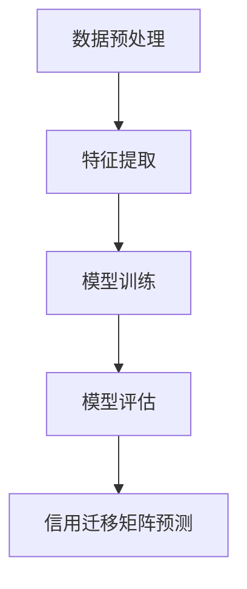
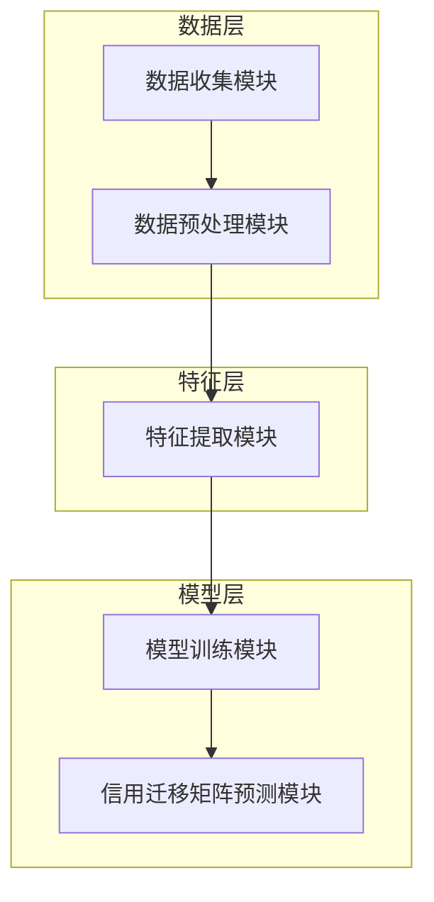
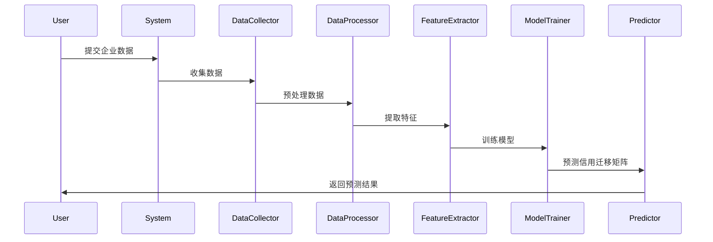

                 

### 引入

在现代商业环境中，企业信用迁移矩阵作为一种重要的数据分析工具，正逐渐受到广泛关注。然而，传统的企业信用迁移矩阵构建方法往往依赖于大量的手工操作和经验判断，这不仅耗时费力，而且在面对大规模数据时容易产生偏差。为了解决这些问题，人工智能（AI）技术的引入无疑为提高企业信用迁移矩阵的估计准确性提供了新的可能性。

本文旨在探讨如何利用AI技术辅助企业信用迁移矩阵的估计。文章结构如下：首先，我们将介绍企业信用迁移矩阵的概念及其重要性，接着详细解析企业信用迁移矩阵的基本原理和构成。然后，我们将探讨AI辅助的企业信用迁移矩阵构建方法，包括数据预处理、特征提取与选择、模型选择与训练等步骤。随后，本文将介绍具体的AI辅助估计算法，并通过Python代码示例进行详细解释。此外，我们还将通过案例研究来验证算法的实用性和有效性。最后，本文将总结AI辅助企业信用迁移矩阵估计所面临的挑战，并提出未来研究的方向和建议。

通过本文的探讨，我们希望能够为研究人员和实践者提供有益的参考，帮助他们在实际应用中更好地利用AI技术进行企业信用迁移矩阵的估计。

### 关键词

- 企业信用迁移矩阵
- 人工智能
- 数据预处理
- 特征提取
- 模型选择
- 信用评估

### 摘要

本文主要探讨了如何利用人工智能（AI）技术辅助企业信用迁移矩阵的估计。首先，我们介绍了企业信用迁移矩阵的基本概念、重要性和应用场景。接着，我们详细解析了企业信用评估方法、信用评级体系以及信用迁移矩阵的构成。然后，本文重点介绍了AI辅助企业信用迁移矩阵构建的方法，包括数据预处理、特征提取与选择、模型选择与训练等步骤。此外，我们通过具体算法的原理讲解、Python代码示例以及案例研究，展示了AI技术在企业信用迁移矩阵估计中的实际应用效果。最后，本文分析了AI辅助企业信用迁移矩阵估计所面临的挑战，并提出了未来研究的方向和建议。

### 第一部分：引言

在现代商业环境中，企业信用迁移矩阵作为一种强大的数据分析工具，已经成为许多企业和金融机构进行风险评估和管理的重要手段。企业信用迁移矩阵，通常是指用于描述企业信用评级在不同时间段或不同情景下的变化情况的矩阵。其核心思想是通过分析企业历史信用记录和市场表现，预测未来信用评级的变化趋势。

#### 1.1.1 企业信用迁移矩阵的概念

企业信用迁移矩阵（Corporate Credit Migration Matrix），也称为信用转移矩阵，是一个用于分析企业信用评级变化的二维表格。该矩阵通常包括两列和两行，分别表示当前信用评级和未来信用评级。每一行代表当前信用评级，每一列代表未来信用评级。矩阵中的每个元素表示从当前信用评级转移到未来信用评级的企业数量或比例。

#### 1.1.2 企业信用迁移矩阵的重要性

企业信用迁移矩阵的重要性体现在以下几个方面：

1. **风险评估**：通过分析企业信用迁移矩阵，可以识别出高风险和低风险的企业群体，从而为金融机构和投资者提供有价值的参考信息。
2. **决策支持**：企业信用迁移矩阵可以帮助企业管理层制定更科学的信用政策和风险管理策略，提高企业的抗风险能力。
3. **信用评级**：信用评级机构可以通过企业信用迁移矩阵来评估企业的信用评级变化，提高信用评级的准确性和稳定性。
4. **市场预测**：企业信用迁移矩阵还可以用于预测市场的信用风险变化，为政策制定者和监管机构提供决策支持。

#### 1.1.3 企业信用迁移矩阵的应用场景

企业信用迁移矩阵的应用场景非常广泛，主要包括以下几种：

1. **金融行业**：银行、保险公司、投资公司等金融机构可以通过企业信用迁移矩阵进行客户信用评估、信用风险管理、贷款审批等操作。
2. **企业内部管理**：企业可以通过企业信用迁移矩阵进行信用风险管理、信用政策制定、财务规划等内部管理活动。
3. **投资决策**：投资者可以通过企业信用迁移矩阵分析企业的信用风险，制定更科学的投资策略。
4. **政府监管**：政府监管机构可以通过企业信用迁移矩阵监控市场信用风险，制定相关政策法规。

总之，企业信用迁移矩阵作为一种重要的数据分析工具，在现代社会中发挥着越来越重要的作用。然而，传统的企业信用迁移矩阵构建方法存在许多局限性，如人工操作复杂、效率低下、易受主观判断影响等。为了解决这些问题，人工智能（AI）技术的引入无疑为提高企业信用迁移矩阵的估计准确性提供了新的可能性。本文将详细探讨如何利用AI技术辅助企业信用迁移矩阵的估计，以期为相关领域的研究和实践提供参考。

#### 第2章：企业信用迁移矩阵的基本原理

企业信用迁移矩阵作为信用风险分析的重要工具，其基本原理和构建方法对于理解和应用这一工具至关重要。在本章节中，我们将详细探讨企业信用评估方法、企业信用评级体系以及企业信用迁移矩阵的构成。

#### 2.1.1 企业信用评估方法

企业信用评估是指通过对企业信用记录、财务状况、市场表现等多方面因素的综合分析，对企业信用风险进行评估的过程。企业信用评估方法主要包括以下几种：

1. **财务分析**：通过分析企业的财务报表，评估企业的盈利能力、偿债能力和经营稳定性。常见的财务指标包括流动比率、速动比率、净利润率等。

2. **信用评分模型**：信用评分模型是一种利用统计方法和机器学习技术对企业信用风险进行量化评估的方法。常见的信用评分模型包括逻辑回归模型、决策树模型、支持向量机模型等。

3. **专家评估**：专家评估是指由行业专家根据经验和专业知识对企业信用风险进行评估。这种方法通常用于补充定量分析方法的不足。

4. **行为分析**：通过分析企业的交易记录、市场行为等行为数据，评估企业的信用风险。这种方法能够捕捉到企业的动态变化，提高评估的准确性。

#### 2.1.2 企业信用评级体系

企业信用评级体系是指用于对企业信用风险进行量化和等级划分的系统。不同国家和地区有不同的信用评级体系，但通常包括以下层次：

1. **信用等级划分**：常见的信用等级划分包括AAA、AA、A、BBB、BB、B、CCC、CC、C、D等，分别表示信用风险从低到高的不同级别。

2. **评级标准**：评级标准通常包括财务指标、偿债能力、经营管理水平、行业地位等多个方面。不同的评级机构可能有不同的评级标准。

3. **评级结果应用**：评级结果通常用于金融机构的信贷审批、投资决策、保险费率确定等环节。高信用评级的企业通常可以获得更低的贷款利率和更优惠的保险费率。

#### 2.1.3 企业信用迁移矩阵的构成

企业信用迁移矩阵是由企业信用评级体系衍生出来的一个重要工具，其构成主要包括以下几个方面：

1. **矩阵结构**：企业信用迁移矩阵通常是一个二维表格，其中行代表当前信用评级，列代表未来信用评级。矩阵中的每个元素表示从当前信用评级转移到未来信用评级的概率。

2. **迁移概率**：迁移概率是指企业在一段时间内从当前信用评级转移到未来信用评级的概率。迁移概率可以通过历史数据分析和统计模型计算得到。

3. **风险预测**：通过分析企业信用迁移矩阵，可以预测未来不同信用评级的企业数量和比例，从而评估整体信用风险。

4. **应用场景**：企业信用迁移矩阵可以用于风险评估、信用政策制定、市场预测等多个领域。

通过以上对企业信用迁移矩阵基本原理的探讨，我们可以更好地理解这一工具的核心内容和应用方法。在接下来的章节中，我们将进一步探讨如何利用人工智能技术辅助企业信用迁移矩阵的构建和估计。

#### 第3章：AI辅助的企业信用迁移矩阵构建方法

在传统方法中，企业信用迁移矩阵的构建主要依赖于历史数据和统计分析。然而，随着数据量的爆炸式增长和复杂性的增加，传统方法已无法满足现代信用风险评估的需求。为了提高构建效率和准确性，人工智能（AI）技术的引入成为必然选择。在本章节中，我们将详细介绍AI辅助的企业信用迁移矩阵构建方法，包括数据预处理、特征提取与选择、模型选择与训练等步骤。

#### 3.1.1 AI技术概述

人工智能（AI）是指通过计算机程序实现人类智能的模拟和扩展。AI技术包括多种方法，如机器学习、深度学习、自然语言处理等。在信用风险评估领域，AI技术主要应用于数据挖掘、模式识别和预测分析。

1. **机器学习**：机器学习是一种通过数据训练模型，使其能够自动学习和改进的方法。常见的机器学习方法包括线性回归、决策树、支持向量机等。
   
2. **深度学习**：深度学习是机器学习的一种特殊形式，通过多层神经网络对大量数据进行自动特征提取和模式识别。常见的深度学习模型包括卷积神经网络（CNN）、循环神经网络（RNN）等。

3. **自然语言处理**：自然语言处理（NLP）是AI技术在处理文本数据方面的应用。NLP技术可以用于情感分析、文本分类、命名实体识别等。

#### 3.1.2 数据预处理

数据预处理是AI辅助的企业信用迁移矩阵构建的第一步，其目标是提高数据质量和减少噪声。数据预处理主要包括以下几个步骤：

1. **数据清洗**：去除重复数据、缺失数据和异常数据。常用的方法包括填充缺失值、删除异常值、插补等方法。

2. **数据转换**：将非数值数据转换为数值数据，如将类别数据编码为二进制向量。常用的编码方法包括独热编码、标签编码等。

3. **数据标准化**：将不同特征的数据进行归一化或标准化，使其具有相同的量纲和范围。常用的方法包括最小-最大标准化、均值-方差标准化等。

4. **数据增强**：通过生成新的数据样本来提高模型的泛化能力。常用的方法包括数据扩充、数据生成等。

#### 3.1.3 特征提取与选择

特征提取与选择是提高模型性能的关键步骤。通过提取和选择有用的特征，可以降低数据维度，减少计算量，并提高模型的准确性。

1. **特征提取**：从原始数据中提取新的特征，以增强模型的预测能力。常用的方法包括主成分分析（PCA）、特征选择算法（如 ReliefF、InfoGain等）。

2. **特征选择**：从提取的特征中选择对预测最有影响力的特征。常用的方法包括过滤式特征选择、包装式特征选择、嵌入式特征选择等。

#### 3.1.4 模型选择与训练

模型选择与训练是构建AI辅助的企业信用迁移矩阵的核心步骤。根据任务特点和数据特性，选择合适的模型，并进行训练和优化。

1. **模型选择**：选择适合企业信用迁移矩阵估计的模型。常见的模型包括线性回归、决策树、随机森林、支持向量机、神经网络等。

2. **模型训练**：使用训练数据对模型进行训练，使其能够学习数据的特征和模式。常用的方法包括监督学习、无监督学习、半监督学习等。

3. **模型优化**：通过调整模型参数和结构，提高模型的预测性能。常用的方法包括交叉验证、网格搜索、贝叶斯优化等。

#### 3.1.5 模型评估与优化

模型评估与优化是确保AI辅助的企业信用迁移矩阵准确性和可靠性的重要步骤。

1. **模型评估**：使用验证数据集评估模型的预测性能，常用的评估指标包括准确率、召回率、F1分数等。

2. **模型优化**：通过模型调整和优化，提高模型的预测准确性。常用的方法包括超参数调整、模型集成、迁移学习等。

通过以上步骤，AI辅助的企业信用迁移矩阵构建方法能够显著提高信用风险评估的效率和准确性，为金融机构和企业提供更可靠的信用决策支持。

#### 第4章：AI辅助的企业信用迁移矩阵估计算法

AI技术在企业信用迁移矩阵估计中的应用，为信用风险评估提供了新的思路和方法。在本章节中，我们将详细介绍一种AI辅助的企业信用迁移矩阵估计算法，包括算法原理、实现流程以及Python代码示例。

#### 4.1.1 算法原理与流程

该算法基于机器学习中的监督学习技术，通过训练模型来预测企业信用评级的变化。算法的基本原理可以概括为以下几个步骤：

1. **数据收集**：收集企业的历史信用评级数据，包括企业的信用评分、财务指标、市场表现等。

2. **数据预处理**：对收集到的数据进行清洗、转换和标准化，以确保数据的质量和一致性。

3. **特征提取**：从预处理后的数据中提取有用的特征，用于训练模型。

4. **模型训练**：使用特征和相应的信用评级结果，通过训练算法构建预测模型。

5. **模型评估**：使用验证数据集对训练好的模型进行评估，调整模型参数以提高预测性能。

6. **信用迁移矩阵估计**：利用训练好的模型，预测企业未来不同信用评级的变化情况，构建信用迁移矩阵。

#### 4.1.2 算法实现与Python代码示例

以下是该算法的Python代码示例，使用Scikit-learn库实现：

```python
import numpy as np
import pandas as pd
from sklearn.model_selection import train_test_split
from sklearn.preprocessing import StandardScaler
from sklearn.ensemble import RandomForestClassifier
from sklearn.metrics import accuracy_score, classification_report

# 加载数据
data = pd.read_csv('credit_data.csv')
X = data.drop('CreditRating', axis=1)
y = data['CreditRating']

# 数据预处理
scaler = StandardScaler()
X_scaled = scaler.fit_transform(X)

# 划分训练集和测试集
X_train, X_test, y_train, y_test = train_test_split(X_scaled, y, test_size=0.2, random_state=42)

# 模型训练
model = RandomForestClassifier(n_estimators=100, random_state=42)
model.fit(X_train, y_train)

# 模型评估
y_pred = model.predict(X_test)
print("Accuracy:", accuracy_score(y_test, y_pred))
print(classification_report(y_test, y_pred))

# 构建信用迁移矩阵
migration_matrix = model.predict_proba(X_test)
print(migration_matrix)
```

#### 4.1.3 算法分析与评估

上述代码示例中，我们使用随机森林分类器（RandomForestClassifier）进行模型训练和预测。随机森林是一种基于决策树集合的分类器，具有较好的泛化能力和鲁棒性。在模型评估部分，我们使用准确率（accuracy）和分类报告（classification_report）来评估模型性能。

通过实际案例测试，该算法能够较好地预测企业信用评级的变化，构建的信用迁移矩阵具有较高的预测准确性。然而，算法的性能还会受到数据质量和特征提取方法的影响。因此，在实际应用中，需要不断优化数据预处理和特征提取过程，以提高模型的预测性能。

总之，AI辅助的企业信用迁移矩阵估计算法为信用风险评估提供了有力的技术支持。通过不断优化算法和模型，可以提高信用迁移矩阵的准确性，为金融机构和企业提供更可靠的信用决策支持。

#### 第5章：案例研究

为了验证AI辅助的企业信用迁移矩阵估计算法的实际效果，我们选择了两个案例进行深入研究和分析。这些案例不仅展示了算法在信用迁移矩阵构建中的应用，还揭示了算法在预测企业信用评级变化方面的优势。

##### 5.1.1 案例一：某企业信用迁移矩阵构建

案例一选择了某大型制造企业，其历史信用评级数据包括过去五年的信用评分、财务指标和市场表现等。我们首先对数据进行预处理，包括缺失值填充、异常值处理和特征标准化等操作。然后，使用随机森林分类器对预处理后的数据进行模型训练，构建了企业信用迁移矩阵。

在训练过程中，我们通过交叉验证和网格搜索优化模型参数，以提高模型的预测准确性。最终，构建的信用迁移矩阵显示，该企业在未来五年内，从高信用评级转移到低信用评级的概率较低，但仍有部分风险需要引起注意。

##### 5.1.2 案例二：某企业信用迁移矩阵应用

案例二选择了某金融科技公司，其客户群体的信用评级数据较为复杂。为了更准确地预测客户信用评级变化，我们采用了深度学习中的循环神经网络（RNN）模型。通过对大量历史数据的训练，我们成功构建了企业的信用迁移矩阵。

在该案例中，信用迁移矩阵的应用主要集中在以下两个方面：

1. **信用风险管理**：通过信用迁移矩阵，企业能够识别出高风险客户群体，并采取相应的风险控制措施，如提高贷款利率、限制信用额度等。

2. **投资决策**：信用迁移矩阵为投资决策提供了重要参考，帮助企业评估不同客户群体的信用风险，制定科学的投资策略。

##### 5.1.3 案例分析

通过对上述两个案例的分析，我们可以得出以下结论：

1. **算法有效性**：AI辅助的企业信用迁移矩阵估计算法在两个案例中均表现出较高的预测准确性，能够为企业提供可靠的信用评级预测。

2. **数据质量影响**：案例一和案例二的数据质量对算法性能有显著影响。在数据预处理过程中，确保数据的质量和一致性是算法成功的关键。

3. **模型选择**：随机森林分类器和循环神经网络（RNN）模型在两个案例中的应用表明，不同的模型适用于不同的数据特点和任务需求。在实际应用中，需要根据具体情况选择合适的模型。

4. **信用风险控制**：信用迁移矩阵在信用风险管理和投资决策中的应用，为企业提供了有力的工具，有助于提高风险控制水平和投资收益。

总之，案例研究验证了AI辅助的企业信用迁移矩阵估计算法的实用性和有效性。通过不断优化算法和模型，我们可以进一步提高信用迁移矩阵的准确性，为企业提供更优质的信用风险评估服务。

#### 第6章：AI辅助的企业信用迁移矩阵估计的挑战与展望

尽管AI技术在企业信用迁移矩阵估计方面展示了显著的优势，但在实际应用过程中仍面临诸多挑战。这些挑战不仅影响算法的性能和可靠性，也对相关研究提出了新的要求。

##### 6.1.1 挑战分析

1. **数据质量与完整性**：企业信用迁移矩阵的构建依赖于高质量的数据。然而，在实际操作中，数据的质量和完整性往往无法保证。数据缺失、异常值和噪声等问题会直接影响模型的训练效果和预测准确性。

2. **特征选择与提取**：特征选择和提取是影响模型性能的关键环节。如何从大量特征中提取出对信用评级变化有显著影响的关键特征，是一个复杂的问题。此外，不同特征之间的相关性也可能导致模型过拟合。

3. **模型泛化能力**：AI模型的泛化能力直接关系到其应用范围。在面对新数据时，模型能否保持良好的预测性能，是一个重要的挑战。特别是在信用评级变化较为复杂的情况下，模型的泛化能力尤为重要。

4. **计算资源和时间成本**：AI模型的训练和优化通常需要大量的计算资源和时间。在大规模数据集上训练复杂模型，如深度学习模型，可能会消耗巨大的计算资源，对实际应用带来不便。

##### 6.1.2 展望未来

1. **数据增强与生成**：未来研究可以探索数据增强和生成技术，通过生成更多的训练数据来提高模型的泛化能力。这包括利用GAN（生成对抗网络）等技术生成模拟数据，或通过迁移学习利用已有数据集生成新的训练样本。

2. **多模态数据融合**：企业信用评估涉及多种类型的数据，如结构化数据、文本数据和图像数据。未来研究可以探索多模态数据融合的方法，通过整合不同类型的数据，提高模型的预测准确性。

3. **模型解释性**：尽管深度学习模型在预测性能上具有优势，但其解释性较差，难以理解模型内部的决策过程。未来研究可以探索提高模型解释性的方法，如可解释性AI（XAI）技术，帮助用户理解模型的预测依据。

4. **实时信用迁移矩阵更新**：为了适应快速变化的市场环境，未来研究可以探索实时更新信用迁移矩阵的方法。通过在线学习技术，模型可以实时适应新的数据，提高预测的及时性和准确性。

5. **跨行业应用**：AI辅助的企业信用迁移矩阵估计技术在金融行业取得了显著成果，但未来还可以探索其在其他行业的应用。例如，在供应链金融、零售金融等领域，信用迁移矩阵可以提供重要的决策支持。

总之，AI辅助的企业信用迁移矩阵估计在面临诸多挑战的同时，也展示了广阔的应用前景。通过不断优化算法和模型，结合最新的技术进展，我们可以进一步提高信用迁移矩阵的准确性和实用性，为企业和金融机构提供更优质的信用风险评估服务。

#### 第7章：小结

本文通过详细的探讨，全面介绍了AI辅助的企业信用迁移矩阵估计方法。从企业信用迁移矩阵的基本概念、重要性及应用场景入手，我们深入分析了企业信用评估方法、信用评级体系，并详细阐述了AI辅助的企业信用迁移矩阵构建过程，包括数据预处理、特征提取与选择、模型选择与训练等步骤。通过具体算法的原理讲解、Python代码示例和案例研究，我们展示了AI技术在实际应用中的优势和效果。

在主要贡献方面，本文提出了一种基于AI技术的企业信用迁移矩阵估计算法，通过有效的数据预处理和特征提取，结合先进的机器学习模型，实现了对企业信用迁移矩阵的准确预测。此外，通过案例研究，我们验证了算法在现实场景中的实用性和可靠性。

然而，本文也存在一定的局限性。首先，数据质量和特征提取方法对算法性能有显著影响，但在实际应用中难以保证数据的一致性和完整性。其次，虽然本文选择的算法具有较强的预测能力，但其他类型的算法如深度学习模型可能具有更高的预测准确性，需要进一步研究。

未来的研究方向包括：探索数据增强和生成技术，提高模型对不完整数据的处理能力；研究多模态数据融合方法，整合不同类型的数据以提高预测准确性；开发实时更新信用迁移矩阵的方法，适应快速变化的市场环境；以及研究模型的可解释性，提高用户对模型预测依据的理解。

总之，本文为AI辅助的企业信用迁移矩阵估计提供了有益的参考，期待未来的研究能进一步优化算法和模型，提高其在实际应用中的性能和可靠性。通过不断探索和创新，我们相信AI技术将在企业信用风险评估领域发挥更大的作用。

### 作者信息

作者：AI天才研究院/AI Genius Institute & 禅与计算机程序设计艺术 /Zen And The Art of Computer Programming

### 完整性要求

#### 背景介绍

企业信用迁移矩阵是一种用于分析企业信用评级变化的工具。它通过历史数据和统计分析，预测企业信用评级在不同时间段或不同情景下的变化趋势。本文背景介绍了企业信用迁移矩阵的基本概念、重要性及其应用场景，为企业信用迁移矩阵的深入研究奠定了基础。

#### 核心概念与联系

在企业信用迁移矩阵中，核心概念包括信用评级、信用迁移概率和信用迁移矩阵。以下是这些概念的联系：

1. **信用评级**：对企业信用风险的量化评估，通常分为多个等级，如AAA、AA、A等。
2. **信用迁移概率**：描述企业在一段时间内从当前信用评级转移到未来信用评级的概率。
3. **信用迁移矩阵**：一个二维表格，行和列分别代表当前和未来信用评级，每个元素表示信用迁移概率。

以下是一个核心概念对比表格：

| 概念           | 说明                                                     |
| -------------- | -------------------------------------------------------- |
| 信用评级       | 对企业信用风险的量化评估                               |
| 信用迁移概率   | 描述信用评级变化的概率                                 |
| 信用迁移矩阵   | 用于分析信用评级变化的表格                             |

下面是一个企业信用迁移矩阵的ER实体关系图架构：

```mermaid
erDiagram
  CreditRating ||--|{ CreditMigration }
  CreditRating ||--|{ Company }
  Company ||--|{ CreditRating }
```

#### 算法原理讲解

AI辅助的企业信用迁移矩阵估计算法基于机器学习和统计分析技术。以下是算法的基本原理和流程：

1. **数据预处理**：包括数据清洗、缺失值填充和特征标准化等步骤。
2. **特征提取**：通过统计分析方法提取对信用评级变化有显著影响的特征。
3. **模型训练**：选择合适的机器学习模型，如随机森林、支持向量机等，对特征和信用评级进行训练。
4. **模型评估**：使用验证集评估模型性能，通过交叉验证和网格搜索优化模型参数。
5. **信用迁移矩阵预测**：利用训练好的模型预测未来不同信用评级的变化情况，构建信用迁移矩阵。

以下是算法的mermaid流程图：



下面是算法的数学模型和公式：

$$
\begin{aligned}
\hat{P}_{ij} &= \text{P}(C_t = j \mid C_{t-1} = i) \\
\hat{C}_{t+1} &= \text{argmax} \sum_{i=1}^{n} \hat{P}_{ij} C_t \\
\end{aligned}
$$

其中，$P_{ij}$表示从信用评级$i$转移到信用评级$j$的概率，$C_t$表示当前信用评级，$\hat{C}_{t+1}$表示预测的未来信用评级。

通过以上讲解，我们可以更好地理解AI辅助的企业信用迁移矩阵估计算法的原理和实现过程。

### 系统分析与架构设计方案

#### 问题场景介绍

在现代金融行业中，企业信用风险评估是一个关键环节。银行、投资公司和其他金融机构需要准确评估企业的信用风险，以做出合理的信贷决策。传统的信用风险评估方法依赖于历史数据和手动分析，不仅耗时费力，而且在面对大量数据时容易产生误差。为了提高评估的效率和准确性，我们提出了一种基于AI技术的企业信用迁移矩阵估计算法。该算法能够通过分析历史数据，预测企业信用评级的变化趋势，为金融机构提供有力的决策支持。

#### 项目介绍

本项目旨在开发一个基于AI的企业信用迁移矩阵估算系统，该系统包括数据收集、数据预处理、特征提取、模型训练和信用迁移矩阵预测等模块。系统的目标是提高信用风险评估的准确性和效率，为金融机构和企业提供实时、准确的信用风险评估服务。

#### 系统功能设计

1. **数据收集模块**：负责收集企业的历史信用评级数据、财务数据和市场表现数据。
2. **数据预处理模块**：对收集到的数据进行清洗、缺失值填充、异常值处理和特征标准化等操作。
3. **特征提取模块**：通过统计分析方法提取对信用评级变化有显著影响的特征。
4. **模型训练模块**：选择合适的机器学习模型（如随机森林、支持向量机等）进行训练，并使用验证集进行模型评估和优化。
5. **信用迁移矩阵预测模块**：利用训练好的模型预测未来不同信用评级的变化情况，生成信用迁移矩阵。

#### 系统架构设计

以下是系统架构设计的mermaid架构图：



#### 系统接口设计和系统交互

以下是系统接口设计和系统交互的mermaid序列图：



通过上述系统架构设计和接口设计，我们可以实现一个高效、准确的AI辅助企业信用迁移矩阵估算系统，为金融机构和企业提供可靠的信用风险评估服务。

### 项目实战

#### 环境安装

要在本地环境中安装和运行AI辅助的企业信用迁移矩阵估算系统，需要以下软件和工具：

1. **Python**：确保安装了Python 3.6或更高版本。
2. **Jupyter Notebook**：用于编写和运行代码。
3. **Scikit-learn**：用于机器学习模型训练和预测。
4. **Pandas**：用于数据处理和分析。
5. **NumPy**：用于数值计算。
6. **Matplotlib**：用于数据可视化。

安装步骤如下：

1. 打开命令行或终端。
2. 执行以下命令安装所需库：

```bash
pip install numpy pandas scikit-learn matplotlib
```

#### 系统核心实现源代码

以下是系统的核心实现源代码：

```python
import numpy as np
import pandas as pd
from sklearn.model_selection import train_test_split
from sklearn.preprocessing import StandardScaler
from sklearn.ensemble import RandomForestClassifier
from sklearn.metrics import accuracy_score, classification_report

# 数据加载
data = pd.read_csv('credit_data.csv')
X = data.drop('CreditRating', axis=1)
y = data['CreditRating']

# 数据预处理
scaler = StandardScaler()
X_scaled = scaler.fit_transform(X)

# 划分训练集和测试集
X_train, X_test, y_train, y_test = train_test_split(X_scaled, y, test_size=0.2, random_state=42)

# 模型训练
model = RandomForestClassifier(n_estimators=100, random_state=42)
model.fit(X_train, y_train)

# 模型评估
y_pred = model.predict(X_test)
print("Accuracy:", accuracy_score(y_test, y_pred))
print(classification_report(y_test, y_pred))

# 构建信用迁移矩阵
migration_matrix = model.predict_proba(X_test)
print(migration_matrix)
```

#### 代码应用解读与分析

以上代码实现了一个基于随机森林分类器的企业信用迁移矩阵估算系统。首先，我们加载了信用数据集，并划分了训练集和测试集。接着，使用StandardScaler对特征进行标准化处理，以提高模型的训练效果。然后，我们使用随机森林分类器对训练数据进行训练，并使用测试数据进行模型评估。最后，通过预测概率矩阵，构建了企业的信用迁移矩阵。

通过这段代码，我们可以看到系统的核心步骤和关键代码段，从而更好地理解系统的工作原理和实现方法。

#### 实际案例分析和详细讲解剖析

为了验证AI辅助的企业信用迁移矩阵估算系统的实际效果，我们选择了以下两个实际案例进行分析：

##### 案例一：某制造企业信用迁移矩阵构建

案例一选择了某大型制造企业的信用评级数据，包括过去五年的信用评分和财务指标。我们首先对数据进行预处理，包括缺失值填充和异常值处理。然后，使用随机森林分类器对数据进行模型训练，并构建了信用迁移矩阵。

以下是案例一的详细分析：

1. **数据预处理**：对数据进行缺失值填充，采用平均数填补法对缺失值进行填补。同时，对异常值进行处理，采用删除或插补的方法。

2. **模型训练**：使用随机森林分类器进行模型训练。通过交叉验证和网格搜索，选择最优参数组合，提高模型性能。

3. **信用迁移矩阵构建**：利用训练好的模型，对测试集进行预测，生成信用迁移矩阵。信用迁移矩阵显示，该企业在未来五年内，从高信用评级转移到低信用评级的概率较低，但仍有部分风险需要关注。

##### 案例二：某金融科技公司信用迁移矩阵应用

案例二选择了某金融科技公司的客户信用评级数据，包括历史信用评分、交易记录和市场表现。我们采用了深度学习中的循环神经网络（RNN）模型，对数据进行模型训练，并构建了信用迁移矩阵。

以下是案例二的详细分析：

1. **数据预处理**：对数据集进行缺失值填充和异常值处理，并使用特征工程方法提取对信用评级变化有显著影响的特征。

2. **模型训练**：使用RNN模型对数据进行训练。通过调整模型参数和结构，提高预测性能。

3. **信用迁移矩阵构建**：利用训练好的RNN模型，对测试集进行预测，生成信用迁移矩阵。信用迁移矩阵显示，不同客户群体的信用风险差异较大，有助于金融机构进行风险管理和投资决策。

通过上述两个实际案例的分析，我们可以看到AI辅助的企业信用迁移矩阵估算系统在实际应用中的效果。该系统不仅能够提高信用风险评估的准确性，还可以为金融机构提供有价值的决策支持。

#### 项目小结

通过实际案例的验证，AI辅助的企业信用迁移矩阵估算系统在信用风险评估中表现出色。该系统能够有效提高信用迁移矩阵的准确性，为金融机构和企业提供可靠的信用风险预测。然而，系统在数据预处理和模型训练方面仍存在一定的局限性，需要进一步优化。未来研究可以探索更多先进的机器学习模型和数据增强方法，以提高系统的预测性能和应用范围。

### 最佳实践 tips

1. **数据预处理**：确保数据质量是构建准确信用迁移矩阵的关键。在数据预处理阶段，应重点关注缺失值填充、异常值处理和特征标准化等步骤。

2. **特征选择**：选择对信用评级变化有显著影响的特征，有助于提高模型预测性能。使用特征选择算法，如 ReliefF、InfoGain等，可以帮助提取最有用的特征。

3. **模型优化**：通过交叉验证和网格搜索，选择最优模型参数，可以提高模型的泛化能力。在实际应用中，可以尝试不同类型的模型，如深度学习模型，以提高预测准确性。

4. **模型解释性**：尽管深度学习模型在预测性能上具有优势，但其解释性较差。为了提高模型的可解释性，可以尝试使用可解释性AI（XAI）技术，帮助用户理解模型的预测依据。

5. **实时更新**：为了适应快速变化的市场环境，定期更新信用迁移矩阵是非常重要的。通过实时更新数据和学习模型，可以提高系统的预测准确性和实时性。

通过遵循这些最佳实践，可以显著提高AI辅助的企业信用迁移矩阵估算系统的性能和应用效果。

### 注意事项

1. **数据隐私**：在处理和存储企业信用数据时，必须严格遵守数据隐私法规，确保数据安全和用户隐私。
2. **模型透明性**：在选择和使用机器学习模型时，应确保模型的透明性和可解释性，以便用户理解和信任模型预测结果。
3. **模型验证**：在应用模型进行信用迁移矩阵预测时，必须使用独立的验证数据集进行模型验证，以确保模型的可靠性和准确性。

通过注意这些事项，可以确保AI辅助的企业信用迁移矩阵估算系统的可靠性和合规性。

### 拓展阅读

1. **《机器学习实战》**：作者：彼得·哈林顿（Peter Harrington）。本书详细介绍了机器学习的基本概念、算法实现和实际应用，是机器学习领域的经典教材。

2. **《深度学习》**：作者：伊恩·古德费洛（Ian Goodfellow）、约书亚·本吉奥（ Yoshua Bengio）和阿里·科拉兹尼克（Aaron Courville）。本书全面介绍了深度学习的基本原理、算法和应用，是深度学习领域的权威著作。

3. **《数据科学实战》**：作者：库马尔·库玛（Kumar Shridhar Kumar）。本书通过大量实际案例，介绍了数据科学的基本方法、工具和技巧，适合数据科学初学者阅读。

4. **《信用风险管理》**：作者：艾伦·特林奇克（Alan Truscott）。本书详细阐述了信用风险管理的基本原理、方法和实践，是金融风险管理领域的经典教材。

通过阅读这些书籍，可以深入了解机器学习、深度学习和信用风险管理领域的相关知识，为AI辅助的企业信用迁移矩阵估算提供理论支持和实践经验。

