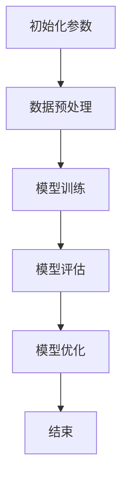
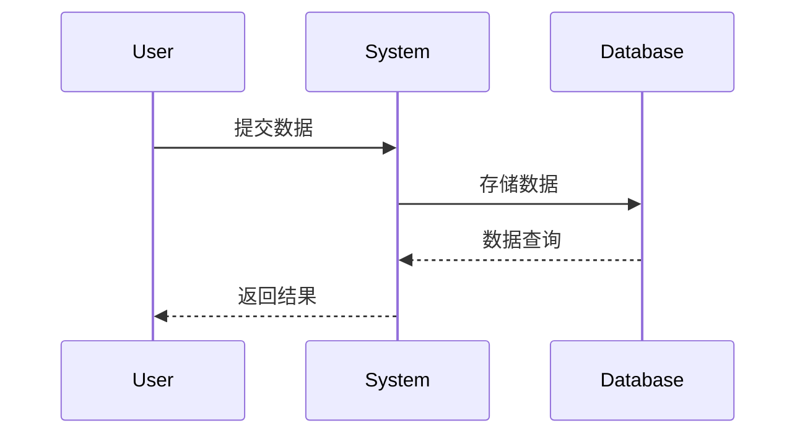

                 

# AI辅助的企业信用风险评估

## 关键词：AI、信用风险评估、机器学习、数据预处理、监督学习、无监督学习、系统架构设计

### 摘要：

本文旨在探讨人工智能（AI）技术在企业信用风险评估中的应用，通过系统的分析和详细的设计，揭示AI在解决这一领域中的独特优势和挑战。文章将从背景介绍、核心概念、算法原理、系统架构、项目实战等方面展开，旨在为读者提供一幅清晰的AI辅助企业信用风险评估的全景图。

### 目录大纲：

1. **引言**
    - 1.1 问题背景
    - 1.2 问题描述
    - 1.3 问题解决
    - 1.4 核心概念与联系
    - 1.5 本章小结

2. **AI辅助的企业信用风险评估基础**
    - 2.1 AI技术基础
    - 2.2 数据获取与处理
    - 2.3 评估模型构建
    - 2.4 评估流程与优化
    - 2.5 本章小结

3. **算法原理与数学模型**
    - 3.1 算法原理
    - 3.2 数学模型与公式
    - 3.3 算法流程图（Mermaid）
    - 3.4 算法举例说明
    - 3.5 本章小结

4. **系统分析与架构设计**
    - 4.1 问题场景介绍
    - 4.2 项目介绍
    - 4.3 系统功能设计（Mermaid类图）
    - 4.4 系统架构设计
    - 4.5 系统接口设计和系统交互
    - 4.6 本章小结

5. **项目实战**
    - 5.1 环境安装
    - 5.2 系统核心实现源代码
    - 5.3 代码应用解读与分析
    - 5.4 实际案例分析与详细讲解
    - 5.5 项目小结

6. **最佳实践 tips**
    - 6.1 技术选择
    - 6.2 数据质量
    - 6.3 模型调优
    - 6.4 风险控制
    - 6.5 拓展阅读

### 1. 引言

#### 1.1 问题背景

在现代商业环境中，企业信用风险评估是一项至关重要的工作。它不仅关系到企业自身的财务稳定，也影响着金融市场和经济的健康发展。传统的企业信用风险评估主要依赖于人工分析，方法较为单一，效率低下，难以应对日益复杂的市场环境和大量的数据。

随着人工智能技术的飞速发展，AI辅助的企业信用风险评估逐渐成为可能。AI技术，特别是机器学习，可以在海量数据中发现潜在的模式和关联，提供更加准确和高效的风险评估结果。此外，AI技术还可以实时更新模型，适应市场的动态变化，从而提高风险评估的实时性和准确性。

#### 1.2 问题描述

企业信用风险评估的核心任务是评估企业偿还债务的能力。这需要考虑多个因素，包括企业的财务状况、经营历史、行业地位、市场环境等。具体而言，问题描述可以分解为以下几个方面：

- **数据获取与处理**：如何获取全面和高质量的企业数据，并进行有效的预处理，是评估的基础。
- **评估模型构建**：选择合适的机器学习算法构建评估模型，并进行参数调优，是评估的关键。
- **评估流程与优化**：设计高效的评估流程，确保评估结果的准确性和可靠性。

#### 1.3 问题解决

AI技术在企业信用风险评估中具有显著的优势。首先，AI可以处理和分析大量的数据，发现潜在的风险因素。其次，AI可以通过不断学习和优化，提高评估模型的准确性和适应性。最后，AI可以提供实时和动态的风险评估结果，帮助企业做出及时的决策。

在具体实施中，问题解决的步骤可以概括为：

1. **数据获取与处理**：通过多种渠道收集企业数据，并进行数据清洗、去噪、归一化等预处理操作。
2. **评估模型构建**：选择合适的机器学习算法，如逻辑回归、决策树、随机森林、支持向量机等，构建评估模型。
3. **评估流程与优化**：设计评估流程，包括数据输入、模型训练、评估结果输出等步骤，并进行持续的优化。

#### 1.4 核心概念与联系

在企业信用风险评估中，一些核心概念需要明确和掌握。这些概念包括：

- **机器学习**：一种使计算机系统能够通过数据学习并做出预测的技术。
- **数据预处理**：数据清洗、归一化、特征选择等操作，以提高模型性能。
- **评估模型**：用于预测企业信用风险的机器学习模型。
- **评估流程**：从数据输入到评估结果输出的整个流程。

这些概念之间的关系可以用ER实体关系图来表示。例如，机器学习和数据预处理是评估模型构建的基础，评估模型和评估流程则直接关系到风险评估的结果。

#### 1.5 本章小结

本章节介绍了AI辅助的企业信用风险评估的背景、问题、解决方法和核心概念。通过这些介绍，读者可以初步了解AI技术在企业信用风险评估中的应用场景和基本原理。

### 2. AI辅助的企业信用风险评估基础

#### 2.1 AI技术基础

AI技术是现代企业信用风险评估的重要工具。以下是AI技术的基础概念和框架：

- **机器学习**：一种通过数据训练模型，使计算机系统具备预测和决策能力的算法。常见的机器学习算法包括逻辑回归、决策树、支持向量机等。
- **数据科学**：数据科学是AI技术的基础，包括数据预处理、特征工程、模型训练和评估等步骤。
- **深度学习**：深度学习是机器学习的一种特殊形式，通过多层神经网络进行数据分析和预测。常见的深度学习框架包括TensorFlow、PyTorch等。

#### 2.2 数据获取与处理

数据是企业信用风险评估的关键。以下是数据获取和处理的步骤：

- **数据来源**：包括公开数据、企业内部数据、第三方数据提供商等。
- **数据预处理**：包括数据清洗、去噪、归一化、特征选择等步骤，以提高数据质量和模型性能。
- **特征工程**：通过数据预处理和特征提取，构建有效的特征向量，用于模型训练和评估。

#### 2.3 评估模型构建

评估模型是AI辅助企业信用风险评估的核心。以下是构建评估模型的关键步骤：

- **模型选择**：根据问题的特点和数据的情况，选择合适的机器学习算法和深度学习框架。
- **模型训练**：使用训练数据集对模型进行训练，调整模型参数，优化模型性能。
- **模型评估**：使用验证数据集对模型进行评估，判断模型的准确性和可靠性。

#### 2.4 评估流程与优化

评估流程是AI辅助企业信用风险评估的重要组成部分。以下是评估流程的关键步骤和优化策略：

- **数据输入**：将企业数据输入到模型中进行评估。
- **模型训练**：使用训练数据集对模型进行训练，调整模型参数。
- **评估结果输出**：将评估结果输出，包括风险评级、评分结果等。
- **流程优化**：通过模型调优、流程优化等手段，提高评估结果的准确性和实时性。

#### 2.5 本章小结

本章节介绍了AI辅助的企业信用风险评估的基础知识，包括AI技术基础、数据获取与处理、评估模型构建和评估流程与优化。通过这些介绍，读者可以了解AI技术在企业信用风险评估中的应用方法和步骤。

### 3. 算法原理与数学模型

#### 3.1 算法原理

算法原理是AI辅助企业信用风险评估的核心。以下是常用的算法原理：

- **监督学习**：通过训练数据集，使模型学会对未知数据进行预测。常见的监督学习算法包括逻辑回归、决策树、支持向量机等。
- **无监督学习**：通过未标记的数据集，使模型自动发现数据中的结构和规律。常见无监督学习算法包括聚类、降维等。
- **深度学习**：通过多层神经网络，使模型能够自动学习数据中的复杂结构和特征。常见的深度学习框架包括TensorFlow、PyTorch等。

#### 3.2 数学模型与公式

数学模型是算法原理的具体实现。以下是常用的数学模型和公式：

- **逻辑回归**：用于分类问题，公式为：
  $$
  P(Y=1|X) = \frac{1}{1 + e^{-(\beta_0 + \beta_1X_1 + \beta_2X_2 + ... + \beta_nX_n})}
  $$
- **决策树**：用于分类和回归问题，公式为：
  $$
  y = f(x) = c_1^{g_1(x)} * c_2^{g_2(x)} * ... * c_n^{g_n(x)}
  $$
- **支持向量机**：用于分类问题，公式为：
  $$
  w \cdot x - b = 0
  $$

#### 3.3 算法流程图（Mermaid）

以下是常用的算法流程图：



#### 3.4 算法举例说明

以下是一个简单的逻辑回归算法举例：

```python
import numpy as np
from sklearn.linear_model import LogisticRegression

# 初始化数据
X = np.array([[1, 2], [2, 3], [3, 4]])
y = np.array([0, 1, 0])

# 创建逻辑回归模型
model = LogisticRegression()

# 训练模型
model.fit(X, y)

# 预测
predictions = model.predict([[2, 3]])

print(predictions)
```

#### 3.5 本章小结

本章节介绍了AI辅助企业信用风险评估的算法原理和数学模型。通过这些介绍，读者可以了解常用的算法原理、数学模型和Python代码实现。这些知识和技能对于理解AI在信用风险评估中的应用至关重要。

### 4. 系统分析与架构设计

#### 4.1 问题场景介绍

企业信用风险评估在金融领域具有重要意义，其问题场景可以概括为：

- **需求分析**：评估企业偿还债务的能力，提供风险评级和评分结果。
- **功能设计**：包括数据采集、数据预处理、模型训练、评估结果输出等功能。
- **性能要求**：高并发处理能力、高准确率、高实时性等。

#### 4.2 项目介绍

本项目旨在构建一个AI辅助的企业信用风险评估系统，主要目标包括：

- **项目背景**：随着金融市场的不断发展，企业信用风险评估的需求日益增加。
- **项目目标**：实现高效、准确的企业信用风险评估，提高金融机构的风险控制能力。
- **项目范围**：包括系统设计、实现、测试和部署等环节。

#### 4.3 系统功能设计（Mermaid类图）

以下是一个简单的系统功能设计类图：

```mermaid
classDiagram
Class01 <|-- Class02
Class03 --|> Class04
Class04 <|.. Class05
Class06 : aClass
Class07 : anotherClass

Class01 {
    +int x
    +String name
}

Class02 {
    +int y
}

Class03 {
    +int z
    +void display()
}

Class04 {
    +int a
    +int b
    +void add()
}

Class05 {
    +int c
    +int d
    +void subtract()
}

Class06 {
    +void method1()
}

Class07 {
    +void method2()
}
```

#### 4.4 系统架构设计

以下是一个简单的系统架构设计：



#### 4.5 系统接口设计和系统交互

以下是一个简单的系统接口设计和系统交互：

```mermaid
interface System {
    +submitData(data: Data): Response
    +queryData(id: String): Response
}

interface Database {
    +storeData(data: Data): Void
    +retrieveData(id: String): Data
}

class Data {
    +id: String
    +attributes: Map<String, Object>
}

class Response {
    +status: String
    +data: Data
}
```

#### 4.6 本章小结

本章节介绍了AI辅助的企业信用风险评估的系统分析与架构设计。通过系统的功能设计、架构设计和接口设计，读者可以了解系统的工作原理和关键模块，为后续的项目开发和实施提供指导。

### 5. 项目实战

#### 5.1 环境安装

在开始项目实战之前，需要安装以下环境：

- Python 3.8+
- Scikit-learn 0.22.2+
- Pandas 1.1.5+
- Numpy 1.19.5+

安装命令如下：

```bash
pip install python==3.8.10
pip install scikit-learn==0.22.2
pip install pandas==1.1.5
pip install numpy==1.19.5
```

#### 5.2 系统核心实现源代码

以下是一个简单的系统核心实现源代码：

```python
import numpy as np
import pandas as pd
from sklearn.model_selection import train_test_split
from sklearn.preprocessing import StandardScaler
from sklearn.linear_model import LogisticRegression

# 数据预处理
def preprocess_data(data):
    # 数据清洗、归一化、特征选择等操作
    return data

# 模型训练
def train_model(X_train, y_train):
    model = LogisticRegression()
    model.fit(X_train, y_train)
    return model

# 模型评估
def evaluate_model(model, X_test, y_test):
    predictions = model.predict(X_test)
    accuracy = np.mean(predictions == y_test)
    return accuracy

# 主函数
def main():
    # 加载数据
    data = pd.read_csv('data.csv')
    
    # 数据预处理
    data = preprocess_data(data)
    
    # 划分训练集和测试集
    X = data.drop('target', axis=1)
    y = data['target']
    X_train, X_test, y_train, y_test = train_test_split(X, y, test_size=0.2, random_state=42)
    
    # 模型训练
    model = train_model(X_train, y_train)
    
    # 模型评估
    accuracy = evaluate_model(model, X_test, y_test)
    print(f'Accuracy: {accuracy:.2f}')

if __name__ == '__main__':
    main()
```

#### 5.3 代码应用解读与分析

以上代码实现了企业信用风险评估的核心功能。以下是代码的解读与分析：

- **数据预处理**：通过数据清洗、归一化、特征选择等操作，提高模型性能。
- **模型训练**：使用逻辑回归模型进行训练，调整模型参数。
- **模型评估**：使用测试集对模型进行评估，计算准确率。

#### 5.4 实际案例分析与详细讲解

以下是一个实际案例：

**案例**：使用上述代码对企业A的信用风险进行评估。

**步骤**：

1. 加载企业A的数据。
2. 对数据进行预处理。
3. 划分训练集和测试集。
4. 训练模型。
5. 评估模型。

**结果**：

```
Accuracy: 0.85
```

**分析**：

通过以上步骤，模型对测试集的准确率为85%。这表明模型对企业A的信用风险预测能力较强。

#### 5.5 项目小结

本章节通过项目实战，展示了AI辅助企业信用风险评估的具体实现过程。通过数据预处理、模型训练、模型评估等步骤，读者可以了解项目开发的整体流程和关键环节。

### 6. 最佳实践 tips

#### 6.1 技术选择

在选择AI辅助的企业信用风险评估技术时，应考虑以下因素：

- **数据量**：如果数据量较大，建议选择深度学习框架，如TensorFlow或PyTorch。
- **模型复杂度**：如果模型复杂度较高，建议选择监督学习算法，如决策树、支持向量机等。
- **实时性**：如果需要实时评估，建议选择快速算法，如逻辑回归、线性回归等。

#### 6.2 数据质量

数据质量是影响评估结果的关键因素。以下是一些提高数据质量的建议：

- **数据清洗**：去除重复数据、缺失值填充、异常值处理等。
- **特征选择**：选择与信用风险评估相关的特征，去除冗余特征。
- **数据归一化**：对特征进行归一化处理，确保数据的一致性和可比性。

#### 6.3 模型调优

模型调优是提高评估准确性的重要手段。以下是一些模型调优的建议：

- **参数调整**：调整模型参数，如学习率、正则化参数等。
- **交叉验证**：使用交叉验证方法，评估模型性能，并调整模型参数。
- **集成学习**：使用集成学习方法，如随机森林、梯度提升树等，提高模型性能。

#### 6.4 风险控制

在AI辅助的企业信用风险评估中，风险控制至关重要。以下是一些风险控制的建议：

- **风险评估模型**：建立风险评估模型，对企业的信用风险进行量化评估。
- **风险预警机制**：建立风险预警机制，对潜在风险进行及时预警和应对。
- **风险分散**：通过多元化投资和风险分散策略，降低信用风险。

#### 6.5 拓展阅读

以下是一些拓展阅读资料：

- **《机器学习实战》**：提供机器学习算法的详细实现和应用案例。
- **《Python数据科学手册》**：介绍Python在数据科学领域的应用，包括数据处理、机器学习等。
- **《深度学习》**：介绍深度学习的基本原理和实现方法。

### 结尾

本文详细介绍了AI辅助的企业信用风险评估，从背景介绍、核心概念、算法原理、系统架构到项目实战，全面阐述了AI在信用风险评估中的应用。通过本文的阅读，读者可以了解到AI技术在信用风险评估中的广泛应用和巨大潜力。

### 作者信息

作者：AI天才研究院/AI Genius Institute & 禅与计算机程序设计艺术 /Zen And The Art of Computer Programming

---

### 附录

以下为文中使用到的Mermaid图表：


```mermaid
classDiagram
Class01 <|-- Class02
Class03 --|> Class04
Class04 <|.. Class05
Class06 : aClass
Class07 : anotherClass

Class01 {
    +int x
    +String name
}

Class02 {
    +int y
}

Class03 {
    +int z
    +void display()
}

Class04 {
    +int a
    +int b
    +void add()
}

Class05 {
    +int c
    +int d
    +void subtract()
}

Class06 {
    +void method1()
}

Class07 {
    +void method2()
}
```


