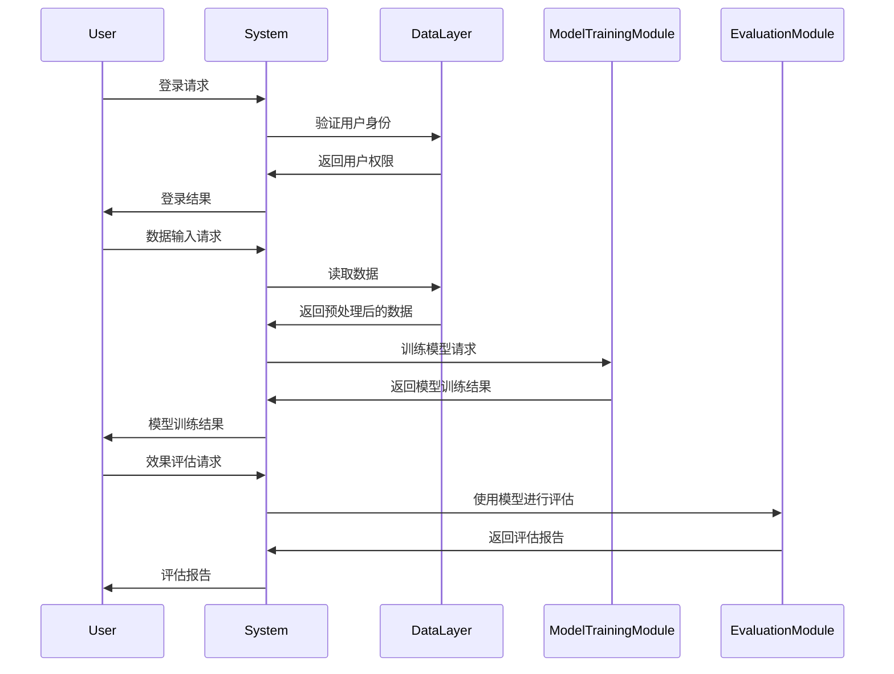

                 

### 第一部分：背景介绍

#### 1.1 问题背景

##### 1.1.1 企业并购整合的重要性

在企业发展的过程中，并购整合是一种常见的战略手段。通过并购整合，企业可以实现资源的优化配置，提升市场竞争力，扩大市场份额，甚至通过技术创新和业务协同实现跨越式发展。因此，企业并购整合在战略规划中占据着重要的位置。

企业并购整合通常包括以下几个关键步骤：初步接触、尽职调查、谈判与签订协议、整合实施、文化融合等。在这个过程中，如何有效地评估并购整合的效果，对于企业的战略决策和资源投入具有重要意义。

##### 1.1.2 AI技术在企业并购整合中的应用潜力

随着人工智能技术的快速发展，AI在企业并购整合中的应用潜力日益显现。AI技术，特别是机器学习和深度学习算法，可以为企业提供以下帮助：

1. **数据挖掘与分析**：通过分析大量的历史数据和市场信息，AI可以帮助企业更准确地评估目标公司的价值和潜在风险。
2. **预测与优化**：基于历史数据和实时数据，AI可以预测并购整合后的财务表现和市场变化，为决策提供支持。
3. **流程自动化**：通过自动化工具和算法，AI可以加速并购整合的流程，减少人为错误，提高效率。

##### 1.1.3 当前AI辅助的企业并购整合效果评估研究的现状与不足

尽管AI技术在企业并购整合中的应用潜力巨大，但目前相关研究还存在一些不足：

1. **数据质量与可靠性**：AI算法的效果高度依赖于数据的质量和完整性。在并购整合过程中，数据可能存在缺失、不一致或者噪声，这会影响到AI评估的准确性。
2. **算法复杂性**：许多AI算法，尤其是深度学习算法，复杂度高，需要大量的计算资源和专业人才来实施和优化。
3. **评估指标不统一**：目前对于并购整合效果评估的指标体系尚未形成统一标准，不同研究者和企业可能有不同的评估方法和标准。

#### 1.2 核心概念

##### 1.2.1 企业并购整合的定义与流程

**定义**：企业并购整合是指两个或多个企业合并成为一个新的企业，通过资源的整合和协同效应，实现业务扩展、成本优化、竞争力提升等目标。

**流程**：企业并购整合通常包括以下关键步骤：
1. **初步接触**：寻找潜在的并购目标。
2. **尽职调查**：对目标公司的财务状况、法律风险、市场前景等进行全面调查。
3. **谈判与签订协议**：就并购条款进行谈判，并签订正式的并购协议。
4. **整合实施**：将目标公司的业务、人员、文化等整合到并购后的新企业中。
5. **文化融合**：通过培训和沟通，促进并购后企业的文化融合，实现协同效应。

##### 1.2.2 AI辅助的企业并购整合

**AI辅助的企业并购整合**是指利用人工智能技术，如机器学习、深度学习等，辅助企业完成并购整合的过程，包括数据挖掘与分析、预测与优化、流程自动化等。

##### 1.2.3 效果评估的定义与方法

**定义**：效果评估是对企业并购整合的结果进行系统分析，以确定并购整合是否达到了预期的目标。

**方法**：效果评估的方法包括定性和定量两种。定性评估主要通过访谈、问卷调查等方式收集主观意见和反馈；定量评估则通过财务指标、市场指标等客观数据来评估并购整合的效果。

#### 1.3 概念联系

##### 1.3.1 企业并购整合与AI技术的关系

AI技术可以在企业并购整合的多个环节发挥作用，包括数据挖掘与分析、预测与优化、流程自动化等。通过AI技术，企业可以更准确地评估目标公司的价值和风险，优化并购整合的流程，提高并购整合的成功率。

##### 1.3.2 AI辅助的企业并购整合的流程与步骤

AI辅助的企业并购整合主要包括以下步骤：
1. **数据收集与预处理**：收集与目标公司相关的数据，并进行数据清洗、归一化和特征提取。
2. **AI模型训练与优化**：利用机器学习或深度学习算法，训练模型以预测并购整合的效果。
3. **效果评估**：将预测结果与实际结果进行比较，评估并购整合的效果。
4. **决策支持**：根据效果评估结果，为企业的战略决策提供支持。

##### 1.3.3 效果评估在并购整合中的作用

效果评估是衡量并购整合成功与否的重要手段。通过效果评估，企业可以了解并购整合的实际效果，发现潜在问题，及时调整战略，提高并购整合的成功率。

#### 1.4 边界与外延

##### 1.4.1 AI辅助企业并购整合的范围

AI辅助的企业并购整合主要涵盖数据挖掘与分析、预测与优化、流程自动化等方面。它不仅适用于大型企业的并购整合，也可以应用于中小企业的并购整合。

##### 1.4.2 效果评估的适用场景与限制

效果评估适用于所有需要进行并购整合的企业。然而，效果评估也受到数据质量、算法复杂性等因素的限制，不能保证100%的准确性。

##### 1.4.3 研究边界与未来研究方向

本研究主要关注AI辅助的企业并购整合效果评估，未来研究方向可能包括：如何提高数据质量，优化算法模型，以及开发更加智能化的评估系统。

#### 1.5 本章小结

本文首先介绍了企业并购整合的重要性以及AI技术在企业并购整合中的应用潜力。接着，详细阐述了企业并购整合的定义与流程，AI辅助的企业并购整合，以及效果评估的定义与方法。通过这些背景介绍，为后续章节的深入探讨奠定了基础。

---

## 2.1 AI技术原理

##### 2.1.1 AI的基本概念

###### 2.1.1.1 人工智能的定义

人工智能（Artificial Intelligence，简称AI）是指由人创造出来的能够模拟、延伸和扩展人类智能的理论、方法、技术和应用系统的总称。简单来说，人工智能就是使计算机具有人类智能的能力。

###### 2.1.1.2 人工智能的发展历程

人工智能的发展历程可以追溯到20世纪50年代。以下是人工智能发展的几个重要阶段：

1. **1956年**：达特茅斯会议标志着人工智能学科的正式诞生。
2. **1970年代**：人工智能经历了第一次热潮，主要集中在规则推理和知识表示方面。
3. **1980年代**：专家系统成为人工智能的主流研究方向。
4. **1990年代**：人工智能进入低谷，但随着互联网和大数据的发展，机器学习和深度学习开始崛起。
5. **2000年代至今**：人工智能迎来了新一轮的发展，以深度学习为代表的技术取得了重大突破。

###### 2.1.1.3 人工智能的分类

人工智能可以根据其能力和实现方式分为多种类型：

1. **弱人工智能（Narrow AI）**：专注于单一任务的智能，如语音识别、图像识别等。
2. **强人工智能（General AI）**：具备人类所有智能特征，能够处理多种任务，具有自我意识和情感。
3. **混合智能（Hybrid AI）**：结合多种智能技术，实现更加强大的智能应用。

##### 2.1.2 机器学习与深度学习

###### 2.1.2.1 机器学习的基本概念

机器学习（Machine Learning，简称ML）是人工智能的一个分支，主要研究如何让计算机从数据中学习规律，并自动进行决策或预测。机器学习的过程通常包括数据收集、数据预处理、模型训练、模型评估和模型应用等步骤。

###### 2.1.2.2 深度学习的基本概念

深度学习（Deep Learning，简称DL）是机器学习的一种方法，它通过多层神经网络模拟人脑的学习过程，从数据中提取特征并实现自动化的决策或预测。深度学习的核心思想是利用大量数据训练复杂的模型，使其能够从原始数据中自动学习出具有代表性的特征。

###### 2.1.2.3 深度学习与机器学习的区别

深度学习和机器学习的主要区别在于：

1. **模型结构**：机器学习通常使用单层或少量的隐藏层，而深度学习则使用多层神经网络。
2. **计算复杂度**：深度学习需要更多的计算资源和时间来训练模型，但可以提取更加复杂的特征。
3. **适用范围**：机器学习适用于简单的数据集和任务，而深度学习适用于大规模数据和复杂的任务。

##### 2.1.3 主流AI算法简介

###### 2.1.3.1 神经网络

神经网络（Neural Network，简称NN）是深度学习的基础，它通过模拟人脑神经元的工作原理，实现数据的输入、处理和输出。神经网络可以分为前馈神经网络、循环神经网络和卷积神经网络等。

###### 2.1.3.2 支持向量机

支持向量机（Support Vector Machine，简称SVM）是一种二分类模型，通过找到一个最佳的超平面，将不同类别的数据点进行分离。SVM在分类和回归问题中都有广泛应用。

###### 2.1.3.3 集成学习方法

集成学习方法（Ensemble Learning）是通过组合多个弱学习器来构建一个强学习器。常见的集成学习方法包括Bagging、Boosting和Stacking等。集成学习方法可以提高模型的稳定性和预测能力。

#### 2.2 企业并购整合原理

##### 2.2.1 企业并购整合的定义

企业并购整合是指一个企业通过购买另一个企业的资产或股权，使其成为自己的子公司或分公司，并通过资源的整合和协同效应，实现业务扩展、成本优化、竞争力提升等目标。

##### 2.2.2 企业并购整合的动机与目的

企业并购整合的动机和目的通常包括：

1. **市场扩张**：通过并购进入新的市场领域，扩大市场份额。
2. **技术升级**：通过并购获取先进技术或知识产权，提升自身技术实力。
3. **成本优化**：通过并购实现规模效应，降低运营成本。
4. **业务协同**：通过并购实现业务协同，提高整体竞争力。

##### 2.2.3 企业并购整合的流程与步骤

企业并购整合通常包括以下关键步骤：

1. **初步接触**：寻找潜在的并购目标，并进行初步了解。
2. **尽职调查**：对目标公司的财务状况、法律风险、市场前景等进行全面调查。
3. **谈判与签订协议**：就并购条款进行谈判，并签订正式的并购协议。
4. **整合实施**：将目标公司的业务、人员、文化等整合到并购后的新企业中。
5. **文化融合**：通过培训和沟通，促进并购后企业的文化融合，实现协同效应。

#### 2.3 效果评估方法

##### 2.3.1 效果评估的定义

效果评估（Performance Evaluation）是指对某个系统、过程或项目的实际效果进行系统性分析和评估，以确定其是否达到预期目标，并为未来的改进提供依据。

##### 2.3.2 效果评估的方法与工具

效果评估的方法和工具多种多样，包括：

1. **定性评估**：主要通过访谈、问卷调查等方式收集主观意见和反馈。
2. **定量评估**：通过财务指标、市场指标等客观数据来评估效果。
3. **绩效指标**：设定一系列绩效指标，用于衡量并购整合的效果。

常见的评估工具包括：

1. **财务分析工具**：如财务比率分析、盈利能力分析等。
2. **市场分析工具**：如市场份额分析、市场增长率分析等。
3. **客户满意度调查**：通过问卷调查等方式了解客户对并购整合效果的反馈。

##### 2.3.3 效果评估的指标体系

效果评估的指标体系是衡量并购整合效果的重要工具。常见的评估指标包括：

1. **财务指标**：如盈利能力、资产回报率、现金流量等。
2. **运营指标**：如生产效率、库存周转率、员工满意度等。
3. **市场指标**：如市场份额、品牌知名度、客户满意度等。

这些指标可以综合运用，从不同角度评估并购整合的效果。

#### 2.4 概念属性特征对比表格

##### 2.4.1 AI技术与企业并购整合属性特征对比

| 特征 | AI技术 | 企业并购整合 |
| --- | --- | --- |
| 目标 | 实现自动化、智能化 | 实现业务扩展、成本优化、竞争力提升 |
| 方法 | 数据驱动、模型训练 | 初步接触、尽职调查、谈判与签订协议、整合实施、文化融合 |
| 应用范围 | 广泛应用于各个领域 | 主要应用于企业战略决策和资源配置 |
| 关键成功因素 | 数据质量、算法模型 | 数据质量、尽职调查、文化融合 |

##### 2.4.2 AI辅助与企业并购整合效果评估方法对比

| 方法 | AI辅助 | 效果评估 |
| --- | --- | --- |
| 数据处理 | 数据挖掘、数据清洗、特征提取 | 财务分析、市场分析、客户满意度调查 |
| 模型训练 | 机器学习、深度学习 | 绩效指标设定、数据驱动分析 |
| 预测与优化 | 预测模型、优化算法 | 预测准确性、效果衡量 |
| 决策支持 | 数据驱动决策 | 数据驱动的效果评价 |

#### 2.5 ER实体关系图架构

##### 2.5.1 企业并购整合实体关系图

```mermaid
erDiagram
    企业 ||--o> 目标公司 : "并购"
    企业 ||--o> 并购整合 : "实施"
    目标公司 ||--|> 尽职调查
    并购整合 ||--|> 文化融合
    企业 ||--o> 效果评估
```

##### 2.5.2 AI辅助企业并购整合效果评估实体关系图

```mermaid
erDiagram
    企业 ||--o> 数据收集 : "AI辅助"
    数据收集 ||--|> 数据清洗
    数据收集 ||--|> 特征提取
    企业 ||--o> 模型训练
    模型训练 ||--|> 模型评估
    模型训练 ||--|> 预测优化
    企业 ||--o> 效果评估 : "AI辅助"
```

#### 2.6 本章小结

本章介绍了AI技术的核心概念、机器学习与深度学习的基本原理、主流AI算法简介，以及企业并购整合的定义与流程、效果评估的方法与工具。通过对比分析AI技术与企业并购整合的属性特征，以及AI辅助企业并购整合效果评估的实体关系图，为后续章节的深入探讨奠定了基础。在接下来的章节中，我们将进一步探讨AI辅助的企业并购整合效果评估算法原理和系统分析与架构设计。

---

## 3.1 算法原理

##### 3.1.1 AI辅助的企业并购整合效果评估算法概述

AI辅助的企业并购整合效果评估算法旨在利用机器学习和深度学习技术，通过分析历史数据和实时数据，对企业并购整合后的效果进行预测和评估。这种算法的主要目标是提高并购整合的决策质量，减少并购风险，提升并购整合的成功率。

###### 3.1.1.1 算法的目标

算法的主要目标包括：

1. **预测并购整合后的财务表现**：通过历史数据和市场信息，预测并购整合后的盈利能力、资产回报率等财务指标。
2. **评估并购整合的协同效应**：分析并购整合后企业的运营效率、市场占有率等指标，评估并购整合的协同效应。
3. **优化并购整合策略**：根据预测结果和评估指标，为企业提供并购整合的策略建议，优化并购整合方案。

###### 3.1.1.2 算法的基本原理

算法的基本原理是通过以下步骤实现的：

1. **数据收集与预处理**：收集与企业并购整合相关的历史数据和实时数据，包括财务数据、市场数据、业务数据等，并对数据进行清洗、归一化和特征提取。
2. **模型训练与优化**：利用机器学习和深度学习算法，训练模型以预测并购整合的效果。模型训练过程中，需要调整关键参数，如学习率、迭代次数等，以优化模型的性能。
3. **效果评估**：将训练好的模型应用于新的数据集，预测并购整合的效果，并与实际结果进行比较，评估模型的预测准确性和评估能力。
4. **决策支持**：根据效果评估结果，为企业的战略决策提供支持，如调整并购整合方案、优化资源配置等。

###### 3.1.1.3 算法的应用场景

算法的应用场景主要包括：

1. **企业并购决策**：在并购决策过程中，利用算法预测并购整合后的财务表现和协同效应，为决策提供数据支持。
2. **并购整合实施**：在并购整合实施过程中，利用算法评估并购整合的进度和效果，及时调整整合策略。
3. **并购后绩效评估**：在并购完成后，利用算法评估并购整合的长期效果，为后续的并购整合提供参考。

##### 3.1.2 基于机器学习的评估算法

基于机器学习的评估算法主要通过以下步骤实现：

1. **数据收集与预处理**：收集与企业并购整合相关的数据，包括财务数据、市场数据、业务数据等。对数据进行清洗、归一化和特征提取，为模型训练做好准备。

2. **特征选择与建模**：选择与并购整合效果相关的特征，构建机器学习模型。常见的机器学习模型包括线性回归、逻辑回归、支持向量机（SVM）等。

3. **模型训练与优化**：使用训练数据集对模型进行训练，调整关键参数，如学习率、迭代次数等，以优化模型性能。

4. **模型评估与验证**：使用验证数据集评估模型性能，选择性能最佳的模型。

5. **效果预测与评估**：将训练好的模型应用于新的数据集，预测并购整合的效果，并与实际结果进行比较，评估模型的预测准确性和评估能力。

###### 3.1.2.1 算法的基本步骤

算法的基本步骤可以概括为：

1. **数据预处理**：对收集到的数据进行清洗、归一化和特征提取。
2. **模型选择**：选择合适的机器学习模型。
3. **模型训练**：使用训练数据集对模型进行训练。
4. **模型评估**：使用验证数据集对模型进行评估。
5. **模型应用**：将训练好的模型应用于新的数据集，预测并购整合的效果。

###### 3.1.2.2 算法的数学模型

基于机器学习的评估算法通常使用以下数学模型：

1. **线性回归模型**：$y = \beta_0 + \beta_1x_1 + \beta_2x_2 + ... + \beta_nx_n$
2. **逻辑回归模型**：$P(y=1) = \frac{1}{1 + e^{-(\beta_0 + \beta_1x_1 + \beta_2x_2 + ... + \beta_nx_n)}$
3. **支持向量机（SVM）**：$f(x) = w \cdot x + b$

其中，$x$表示输入特征，$y$表示输出标签，$w$和$b$分别为模型参数。

###### 3.1.2.3 算法的关键参数设置

算法的关键参数设置包括：

1. **学习率**：用于调整模型训练的步长，避免过拟合或欠拟合。
2. **迭代次数**：用于控制模型训练的深度，过多或过少的迭代次数都会影响模型性能。
3. **正则化参数**：用于控制模型的复杂度，避免过拟合。

##### 3.1.3 基于深度学习的评估算法

基于深度学习的评估算法主要通过以下步骤实现：

1. **数据收集与预处理**：收集与企业并购整合相关的数据，包括财务数据、市场数据、业务数据等。对数据进行清洗、归一化和特征提取。

2. **模型架构设计**：设计深度学习模型的结构，包括输入层、隐藏层和输出层。常用的深度学习模型包括卷积神经网络（CNN）、循环神经网络（RNN）、长短期记忆网络（LSTM）等。

3. **模型训练与优化**：使用训练数据集对模型进行训练，调整关键参数，如学习率、迭代次数等，以优化模型性能。

4. **模型评估与验证**：使用验证数据集评估模型性能，选择性能最佳的模型。

5. **效果预测与评估**：将训练好的模型应用于新的数据集，预测并购整合的效果，并与实际结果进行比较，评估模型的预测准确性和评估能力。

###### 3.1.3.1 算法的基本步骤

算法的基本步骤可以概括为：

1. **数据预处理**：对收集到的数据进行清洗、归一化和特征提取。
2. **模型架构设计**：设计深度学习模型的结构。
3. **模型训练**：使用训练数据集对模型进行训练。
4. **模型评估**：使用验证数据集对模型进行评估。
5. **模型应用**：将训练好的模型应用于新的数据集，预测并购整合的效果。

###### 3.1.3.2 算法的数学模型

基于深度学习的评估算法通常使用以下数学模型：

1. **卷积神经网络（CNN）**：通过卷积操作和池化操作提取图像特征。
2. **循环神经网络（RNN）**：通过循环结构处理序列数据。
3. **长短期记忆网络（LSTM）**：通过门控机制处理长序列数据。

其中，卷积神经网络和循环神经网络的核心在于权重矩阵和激活函数，而长短期记忆网络则在此基础上增加了记忆单元和控制门。

###### 3.1.3.3 算法的关键参数设置

算法的关键参数设置包括：

1. **学习率**：用于调整模型训练的步长，避免过拟合或欠拟合。
2. **迭代次数**：用于控制模型训练的深度，过多或过少的迭代次数都会影响模型性能。
3. **网络层数**：用于控制模型的复杂度，过多或过少的网络层都会影响模型性能。
4. **正则化参数**：用于控制模型的复杂度，避免过拟合。

##### 3.1.4 算法流程图

基于机器学习的评估算法流程图：


基于深度学习的评估算法流程图：


##### 3.1.5 Python源代码实现

以下是一个简单的基于机器学习的评估算法的Python源代码实现：

```python
import pandas as pd
from sklearn.model_selection import train_test_split
from sklearn.linear_model import LinearRegression
from sklearn.metrics import mean_squared_error

# 数据收集与预处理
data = pd.read_csv('data.csv')
X = data.drop('target', axis=1)
y = data['target']

X_train, X_test, y_train, y_test = train_test_split(X, y, test_size=0.2, random_state=42)

# 特征选择与建模
model = LinearRegression()

# 模型训练与优化
model.fit(X_train, y_train)

# 模型评估与验证
y_pred = model.predict(X_test)
mse = mean_squared_error(y_test, y_pred)
print("MSE:", mse)

# 效果预测与评估
new_data = pd.read_csv('new_data.csv')
y_pred_new = model.predict(new_data)
print("New Data Predictions:", y_pred_new)
```

以下是一个简单的基于深度学习的评估算法的Python源代码实现：

```python
import pandas as pd
import numpy as np
from tensorflow.keras.models import Sequential
from tensorflow.keras.layers import Dense, LSTM, Dropout
from tensorflow.keras.optimizers import Adam

# 数据收集与预处理
data = pd.read_csv('data.csv')
X = data.drop('target', axis=1).values
y = data['target'].values

# 数据分割
X_train, X_test, y_train, y_test = train_test_split(X, y, test_size=0.2, random_state=42)

# 模型架构设计
model = Sequential()
model.add(LSTM(units=50, return_sequences=True, input_shape=(X_train.shape[1], 1)))
model.add(Dropout(0.2))
model.add(LSTM(units=50, return_sequences=False))
model.add(Dropout(0.2))
model.add(Dense(units=1))

# 模型训练与优化
model.compile(optimizer=Adam(learning_rate=0.001), loss='mean_squared_error')
model.fit(X_train, y_train, epochs=100, batch_size=32, validation_split=0.1)

# 模型评估与验证
y_pred = model.predict(X_test)
mse = np.mean(np.square(y_test - y_pred))
print("MSE:", mse)

# 效果预测与评估
new_data = pd.read_csv('new_data.csv').values
y_pred_new = model.predict(new_data)
print("New Data Predictions:", y_pred_new)
```

##### 3.1.6 算法原理讲解与举例说明

###### 3.1.6.1 机器学习算法原理讲解

机器学习算法主要基于历史数据和统计模型，通过学习数据中的规律和模式，实现对未知数据的预测。线性回归是一种常见的机器学习算法，它通过建立输入特征和输出目标之间的线性关系来实现预测。

以线性回归为例，其基本原理如下：

1. **数据收集与预处理**：收集与企业并购整合相关的数据，并对数据进行清洗、归一化和特征提取。
2. **特征选择与建模**：选择与并购整合效果相关的特征，建立线性回归模型。
3. **模型训练与优化**：使用训练数据集对模型进行训练，调整模型参数，以优化模型性能。
4. **模型评估与验证**：使用验证数据集对模型进行评估，选择性能最佳的模型。
5. **效果预测与评估**：将训练好的模型应用于新的数据集，预测并购整合的效果，并与实际结果进行比较，评估模型的预测准确性和评估能力。

举例说明：

假设我们收集到一组关于企业并购整合的数据，包括财务指标、市场指标和业务指标。我们希望利用这些数据预测并购整合后的盈利能力。具体步骤如下：

1. **数据收集与预处理**：收集并购整合前后企业的财务指标、市场指标和业务指标，对数据进行清洗、归一化和特征提取。
2. **特征选择与建模**：选择与盈利能力相关的特征，如净利润、营业收入、市场份额等，建立线性回归模型。
3. **模型训练与优化**：使用训练数据集对模型进行训练，调整模型参数，如学习率、迭代次数等，以优化模型性能。
4. **模型评估与验证**：使用验证数据集对模型进行评估，选择性能最佳的模型。
5. **效果预测与评估**：将训练好的模型应用于新的数据集，预测并购整合后的盈利能力，并与实际结果进行比较，评估模型的预测准确性和评估能力。

通过上述步骤，我们可以利用机器学习算法对企业并购整合的效果进行预测和评估。

###### 3.1.6.2 深度学习算法原理讲解

深度学习算法通过多层神经网络模拟人脑的学习过程，从数据中自动提取特征并实现预测。卷积神经网络（CNN）是一种常见的深度学习算法，特别适用于处理图像数据。

以卷积神经网络为例，其基本原理如下：

1. **数据收集与预处理**：收集与企业并购整合相关的图像数据，对图像进行预处理，如缩放、裁剪、增强等。
2. **模型架构设计**：设计卷积神经网络模型的结构，包括卷积层、池化层和全连接层。
3. **模型训练与优化**：使用训练数据集对模型进行训练，调整模型参数，如学习率、迭代次数等，以优化模型性能。
4. **模型评估与验证**：使用验证数据集对模型进行评估，选择性能最佳的模型。
5. **效果预测与评估**：将训练好的模型应用于新的图像数据，预测并购整合的效果，并与实际结果进行比较，评估模型的预测准确性和评估能力。

举例说明：

假设我们收集到一组关于企业并购整合的图像数据，包括并购前后的财务报表、市场分析报告和业务流程图。我们希望利用这些图像数据预测并购整合后的盈利能力。具体步骤如下：

1. **数据收集与预处理**：收集并购整合前后企业的财务报表、市场分析报告和业务流程图像数据，对图像进行预处理，如缩放、裁剪、增强等。
2. **模型架构设计**：设计卷积神经网络模型的结构，包括卷积层、池化层和全连接层。
3. **模型训练与优化**：使用训练数据集对模型进行训练，调整模型参数，如学习率、迭代次数等，以优化模型性能。
4. **模型评估与验证**：使用验证数据集对模型进行评估，选择性能最佳的模型。
5. **效果预测与评估**：将训练好的模型应用于新的图像数据，预测并购整合后的盈利能力，并与实际结果进行比较，评估模型的预测准确性和评估能力。

通过上述步骤，我们可以利用深度学习算法对企业并购整合的效果进行预测和评估。

##### 3.1.7 举例说明

###### 3.1.7.1 机器学习算法举例说明

假设我们使用线性回归算法预测企业并购整合后的盈利能力。具体步骤如下：

1. **数据收集与预处理**：收集并购整合前后企业的财务指标，包括净利润、营业收入、市场份额等。对数据进行清洗、归一化和特征提取。
2. **特征选择与建模**：选择与盈利能力相关的特征，建立线性回归模型。
3. **模型训练与优化**：使用训练数据集对模型进行训练，调整模型参数，如学习率、迭代次数等，以优化模型性能。
4. **模型评估与验证**：使用验证数据集对模型进行评估，选择性能最佳的模型。
5. **效果预测与评估**：将训练好的模型应用于新的数据集，预测并购整合后的盈利能力，并与实际结果进行比较，评估模型的预测准确性和评估能力。

通过上述步骤，我们可以利用线性回归算法对企业并购整合后的盈利能力进行预测和评估。

###### 3.1.7.2 深度学习算法举例说明

假设我们使用卷积神经网络算法预测企业并购整合后的盈利能力。具体步骤如下：

1. **数据收集与预处理**：收集并购整合前后企业的财务报表、市场分析报告和业务流程图像数据，对图像进行预处理，如缩放、裁剪、增强等。
2. **模型架构设计**：设计卷积神经网络模型的结构，包括卷积层、池化层和全连接层。
3. **模型训练与优化**：使用训练数据集对模型进行训练，调整模型参数，如学习率、迭代次数等，以优化模型性能。
4. **模型评估与验证**：使用验证数据集对模型进行评估，选择性能最佳的模型。
5. **效果预测与评估**：将训练好的模型应用于新的图像数据，预测并购整合后的盈利能力，并与实际结果进行比较，评估模型的预测准确性和评估能力。

通过上述步骤，我们可以利用卷积神经网络算法对企业并购整合后的盈利能力进行预测和评估。

##### 3.1.8 本章小结

本章详细介绍了AI辅助的企业并购整合效果评估算法原理，包括基于机器学习和深度学习的评估算法。我们分析了算法的基本原理、数学模型和关键参数设置，并给出了算法流程图和Python源代码实现。通过举例说明，我们展示了如何利用机器学习和深度学习算法预测和评估企业并购整合的效果。在下一章中，我们将进一步探讨系统分析与架构设计。

---

## 4.1 项目介绍

#### 4.1.1 项目背景

随着全球经济的不断发展和市场竞争的加剧，企业并购整合已成为许多企业实现快速扩展、优化资源、提升竞争力的有效手段。然而，并购整合的过程复杂且风险高，涉及到众多因素，包括财务分析、市场评估、文化融合等。为了提高并购整合的效率和成功率，企业需要借助先进的技术手段，尤其是人工智能（AI）技术，来辅助并购整合的决策和实施。

#### 4.1.2 项目目标

本项目旨在开发一套基于AI的企业并购整合效果评估系统，通过利用机器学习和深度学习技术，对并购整合的效果进行预测和评估，从而帮助企业在并购决策和整合过程中做出更加科学和合理的决策。具体目标包括：

1. **提高并购决策的科学性**：通过AI技术对历史数据和实时数据进行挖掘和分析，为并购决策提供数据支持，减少盲目决策的风险。
2. **优化并购整合流程**：利用AI技术自动化和优化并购整合的流程，提高整合效率，降低整合成本。
3. **评估并购整合效果**：通过AI技术对并购整合的效果进行实时评估，为企业提供持续改进和优化的依据。

#### 4.1.3 项目范围与约束条件

本项目的主要范围包括：

1. **数据收集与预处理**：收集与并购整合相关的历史数据和实时数据，包括财务数据、市场数据、业务数据等，并对数据进行清洗、归一化和特征提取。
2. **模型训练与优化**：使用机器学习和深度学习算法，训练预测模型和评估模型，并优化模型参数，以提高预测准确性和评估能力。
3. **系统集成与部署**：将AI算法集成到企业现有的系统中，实现并购整合效果评估功能的自动化和智能化。
4. **用户界面与交互设计**：设计用户友好的界面，使企业用户可以方便地使用系统进行数据输入、模型训练、结果分析和决策支持。

项目的约束条件主要包括：

1. **数据质量**：由于并购整合数据可能存在不完整、不一致或噪声，需要确保数据清洗和特征提取的准确性，以提高模型训练效果。
2. **计算资源**：深度学习模型训练需要大量的计算资源，包括CPU和GPU，需要合理规划计算资源的使用。
3. **时间与预算**：项目需要在限定的时间和预算内完成，需要合理分配资源和时间，确保项目的顺利实施。

#### 4.1.4 项目实施流程

本项目实施的主要流程包括：

1. **需求分析**：与客户沟通，明确项目需求和目标，确定系统的功能和技术要求。
2. **系统设计**：根据需求分析，设计系统的架构和功能模块，包括数据收集与预处理模块、模型训练与优化模块、系统集成与部署模块等。
3. **系统开发**：根据系统设计，开发系统的各个功能模块，并实现数据输入、模型训练、结果分析和决策支持等功能。
4. **测试与部署**：对系统进行功能测试、性能测试和用户测试，确保系统稳定可靠，然后部署到生产环境，并进行用户培训和技术支持。
5. **持续优化**：根据用户反馈和系统运行数据，持续优化系统的性能和功能，确保系统长期稳定运行。

#### 4.1.5 项目团队与角色分配

本项目团队由以下成员组成：

1. **项目经理**：负责项目整体管理和协调，确保项目按计划顺利进行。
2. **数据科学家**：负责数据收集与预处理、模型训练与优化等工作，确保模型训练效果和预测准确性。
3. **软件工程师**：负责系统开发、集成与部署等工作，确保系统的稳定性和可扩展性。
4. **测试工程师**：负责系统的功能测试、性能测试和用户测试，确保系统的质量。
5. **用户支持工程师**：负责用户培训和技术支持，确保用户能够顺利使用系统。

通过明确项目目标和实施流程，合理分配资源，本项目旨在为企业提供一套高效、可靠的AI辅助企业并购整合效果评估系统，助力企业实现并购整合的顺利实施和持续优化。

---

## 4.2 系统功能设计

#### 4.2.1 领域模型

领域模型（Domain Model）是系统设计和实现的基础，它通过类图来表示系统中主要的实体及其关系。在本项目中，领域模型主要包括以下类：

1. **企业（Company）**：表示参与并购整合的企业，包括基本信息、财务状况、市场地位等。
2. **目标公司（TargetCompany）**：表示被并购的企业，包含详细财务数据、业务数据和市场信息。
3. **数据集（Dataset）**：表示用于模型训练和效果评估的数据集，包括数据源、数据处理方法、数据特征等。
4. **模型（Model）**：表示用于预测和评估的机器学习或深度学习模型，包括模型架构、参数配置、训练结果等。
5. **评估结果（EvaluationResult）**：表示模型预测和评估的结果，包括预测值、实际值、评估指标等。
6. **用户（User）**：表示使用系统的用户，包括登录、权限管理、数据访问等功能。

领域模型类图如下所示：

```mermaid
classDiagram
    Class01 <|-- Class02
    Class03 <|-- Class04
    Class05 <|-- Class06
    Class01[企业]
    Class02[目标公司]
    Class03[数据集]
    Class04[模型]
    Class05[评估结果]
    Class06[用户]
    Class01 <..> Class02
    Class03 <..> Class04
    Class05 <..> Class06
```

#### 4.2.2 系统功能模块

系统功能模块是实现系统功能的核心，主要包括以下模块：

1. **数据收集与预处理模块**：负责收集企业并购整合相关的数据，包括财务数据、市场数据、业务数据等，并对数据进行清洗、归一化和特征提取。
2. **模型训练与优化模块**：负责训练预测模型和评估模型，包括选择合适的算法、调整模型参数、优化模型性能等。
3. **效果评估与预测模块**：负责使用训练好的模型对并购整合的效果进行评估和预测，包括生成评估报告、预测并购整合后的财务表现和市场变化等。
4. **用户界面与交互模块**：负责设计用户友好的界面，使企业用户可以方便地输入数据、查看评估结果和预测报告，并进行决策支持。

#### 4.2.3 系统功能描述

系统功能模块的具体描述如下：

1. **数据收集与预处理模块**：
   - 功能描述：收集企业并购整合相关的数据，包括财务数据、市场数据、业务数据等。对数据进行清洗、归一化和特征提取，为模型训练做好准备。
   - 实现方式：通过数据库接口和数据爬取工具，收集数据，然后使用Python的Pandas库和Scikit-learn库进行数据清洗和特征提取。

2. **模型训练与优化模块**：
   - 功能描述：使用机器学习和深度学习算法，训练预测模型和评估模型，优化模型性能，提高预测准确性。
   - 实现方式：使用Python的Scikit-learn库和TensorFlow库，选择合适的算法，调整模型参数，进行模型训练和优化。

3. **效果评估与预测模块**：
   - 功能描述：使用训练好的模型对并购整合的效果进行评估和预测，生成评估报告和预测报告，为企业提供决策支持。
   - 实现方式：使用Python的Scikit-learn库和TensorFlow库，将模型应用于新的数据集，生成预测结果和评估指标，然后使用Markdown和LaTeX格式生成报告。

4. **用户界面与交互模块**：
   - 功能描述：设计用户友好的界面，使企业用户可以方便地输入数据、查看评估结果和预测报告，并进行决策支持。
   - 实现方式：使用Python的Flask库，设计前端界面，并通过API接口与后端模块交互，实现数据输入、结果展示和决策支持。

通过这些功能模块的协同工作，系统可以高效地收集、处理和评估企业并购整合数据，为企业提供科学的决策支持，提高并购整合的成功率。

---

## 4.3 系统架构设计

#### 4.3.1 系统架构概述

系统架构设计是系统开发的关键环节，它决定了系统的稳定性、可扩展性和性能。在本项目中，我们采用分层架构设计，包括数据层、服务层和表现层，以确保系统模块之间的高内聚、低耦合。

1. **数据层**：负责数据存储和管理，使用关系数据库（如MySQL）和非关系数据库（如MongoDB）来存储企业并购整合相关的数据。
2. **服务层**：负责数据处理和业务逻辑实现，包括数据收集与预处理模块、模型训练与优化模块、效果评估与预测模块等，使用Python的Flask库实现API接口。
3. **表现层**：负责用户界面展示和交互，使用HTML、CSS和JavaScript设计前端界面，并通过Ajax与后端服务层进行数据交互。

#### 4.3.2 系统架构图

系统架构图如下所示：

```mermaid
sequenceDiagram
    User ->>|发起请求| Server
    Server ->>|处理请求| Database
    Database ->>|返回数据| Server
    Server ->>|处理数据并返回结果| User
```

#### 4.3.3 系统模块划分

系统模块划分如下：

1. **数据收集与预处理模块**：负责数据收集、数据清洗、数据归一化和特征提取，为模型训练提供高质量的数据集。
2. **模型训练与优化模块**：负责训练机器学习和深度学习模型，包括模型选择、参数调整和性能优化，以提高预测准确性和评估能力。
3. **效果评估与预测模块**：负责使用训练好的模型对并购整合效果进行预测和评估，生成评估报告和预测报告，为决策支持提供依据。
4. **用户界面与交互模块**：负责设计用户友好的界面，实现数据输入、结果展示和决策支持功能，提高用户体验。

#### 4.3.4 系统模块间的关系

系统模块间的关系如下：

1. **数据层与数据收集与预处理模块**：数据收集与预处理模块通过数据库接口与数据层进行数据交互，实现对数据的读取、写入和更新。
2. **服务层与数据层**：模型训练与优化模块和效果评估与预测模块通过API接口与数据层进行数据交互，实现对数据的处理和存储。
3. **服务层与表现层**：用户界面与交互模块通过Ajax与后端服务层进行数据交互，实现对用户请求的处理和响应。

通过上述模块间的关系，系统可以实现数据的统一管理、处理和展示，确保系统的高效稳定运行。

---

## 4.4 系统接口设计

系统接口设计是确保系统功能模块之间能够有效通信和协同工作的关键环节。在本项目中，接口设计包括RESTful API设计和数据库接口设计，分别用于前后端交互和数据存储与管理。

#### 4.4.1 RESTful API设计

RESTful API是一种基于HTTP协议的接口设计规范，具有简洁、可扩展和易用性等特点。本项目的RESTful API设计主要包括以下功能接口：

1. **数据收集与预处理接口**：
   - **接口名称**：/api/data_collection
   - **功能描述**：用于接收企业并购整合相关的数据，包括财务数据、市场数据、业务数据等。
   - **请求方法**：POST
   - **请求参数**：{
                     "company_id": "string",
                     "financial_data": "array",
                     "market_data": "array",
                     "business_data": "array"
                   }
   - **响应数据**：{
                      "status": "string",
                      "message": "string",
                      "data": "array"
                    }

2. **模型训练与优化接口**：
   - **接口名称**：/api/model_training
   - **功能描述**：用于启动模型训练过程，调整模型参数，优化模型性能。
   - **请求方法**：POST
   - **请求参数**：{
                     "model_id": "string",
                     "training_data": "array",
                     "evaluation_data": "array",
                     "hyperparameters": "array"
                   }
   - **响应数据**：{
                      "status": "string",
                      "message": "string",
                      "model_id": "string"
                    }

3. **效果评估与预测接口**：
   - **接口名称**：/api/evaluation_prediction
   - **功能描述**：用于使用训练好的模型对并购整合效果进行评估和预测，生成评估报告和预测报告。
   - **请求方法**：POST
   - **请求参数**：{
                     "model_id": "string",
                     "input_data": "array"
                   }
   - **响应数据**：{
                      "status": "string",
                      "message": "string",
                      "evaluation_report": "array",
                      "prediction_report": "array"
                    }

4. **用户接口**：
   - **接口名称**：/api/user
   - **功能描述**：用于用户登录、注册、权限管理和数据访问。
   - **请求方法**：POST
   - **请求参数**：{
                     "username": "string",
                     "password": "string",
                     "role": "string"
                   }
   - **响应数据**：{
                      "status": "string",
                      "message": "string",
                      "user_id": "string",
                      "token": "string"
                    }

#### 4.4.2 数据库接口设计

数据库接口设计主要用于数据存储和管理，确保系统数据的一致性和安全性。本项目的数据库接口设计主要包括以下功能：

1. **数据表设计**：
   - **企业表**：存储企业基本信息，包括企业ID、名称、成立时间等。
   - **目标公司表**：存储目标公司详细信息，包括目标公司ID、企业ID、财务数据、市场数据等。
   - **数据集表**：存储数据集信息，包括数据集ID、名称、数据来源、数据处理方法等。
   - **模型表**：存储模型信息，包括模型ID、名称、训练数据、评估数据等。
   - **评估结果表**：存储评估结果信息，包括评估结果ID、模型ID、预测值、实际值、评估指标等。
   - **用户表**：存储用户信息，包括用户ID、用户名、密码、角色等。

2. **数据库操作接口**：
   - **增删改查接口**：提供基本的增删改查（CRUD）操作接口，实现对数据的增加、删除、修改和查询。
   - **数据聚合接口**：提供数据聚合操作接口，实现对数据的分组、汇总和统计分析。
   - **数据权限管理接口**：提供数据权限管理接口，实现对用户访问数据的权限控制。

通过以上系统接口设计，可以实现系统功能模块之间的有效通信和数据管理，确保系统的稳定、高效运行。

---

## 4.5 系统交互

系统交互是指系统内部各个模块以及系统与外部环境之间的信息传递和协同工作过程。为了确保系统功能的完整性和高效性，我们需要设计合理的系统交互机制。在本项目中，系统交互主要包括以下几个方面：

#### 4.5.1 用户与系统的交互

用户与系统的交互是系统设计的关键环节。用户通过前端界面与系统进行交互，提交数据、查看结果和进行决策支持。系统交互流程如下：

1. **用户登录**：用户通过前端界面输入用户名和密码，提交登录请求。系统验证用户身份后，返回登录结果和用户权限。
2. **数据输入**：用户通过前端界面输入企业并购整合相关的数据，如财务数据、市场数据、业务数据等。系统接收数据后，进行数据预处理，为模型训练做准备。
3. **模型训练与优化**：系统根据用户提交的数据，启动模型训练过程。训练完成后，系统返回模型训练结果和性能指标。
4. **效果评估与预测**：系统使用训练好的模型对并购整合的效果进行评估和预测。系统将评估结果和预测报告通过前端界面展示给用户，为决策支持提供依据。

#### 4.5.2 系统内部模块间的交互

系统内部模块间的交互是实现系统功能的关键。以下为系统内部模块间的主要交互过程：

1. **数据收集与预处理模块**：与数据层进行数据交互，从数据库中读取数据，并进行清洗、归一化和特征提取，为模型训练提供高质量的数据集。
2. **模型训练与优化模块**：与数据收集与预处理模块进行数据交互，获取预处理后的数据集，然后使用机器学习和深度学习算法进行模型训练和优化。
3. **效果评估与预测模块**：与模型训练与优化模块进行数据交互，获取训练好的模型，然后使用模型对新的数据进行预测和评估，生成评估报告和预测报告。
4. **用户界面与交互模块**：与模型训练与优化模块和效果评估与预测模块进行数据交互，获取模型训练和评估结果，通过前端界面展示给用户。

#### 4.5.3 系统与外部环境的交互

系统与外部环境的交互主要包括以下方面：

1. **数据接口**：系统通过RESTful API与外部系统进行数据交互，如财务系统、市场分析系统等。外部系统可以通过API接口提交数据、获取结果，实现系统的集成和扩展。
2. **数据存储与管理**：系统通过数据库接口与外部数据库进行数据交互，存储和管理企业并购整合相关的数据，确保数据的一致性和安全性。
3. **数据采集**：系统通过数据爬取工具和接口，从互联网上采集与并购整合相关的数据，如市场行情、竞争对手信息等，为模型训练和评估提供丰富的数据来源。

通过以上系统交互设计，我们可以确保系统功能的完整性、高效性和灵活性，实现企业并购整合效果评估的自动化和智能化。

#### 4.5.4 系统交互Mermaid序列图

以下是一个简单的系统交互Mermaid序列图，展示了用户与系统以及系统内部模块之间的交互过程：



通过这个序列图，我们可以清晰地看到用户与系统以及系统内部模块之间的交互流程，为系统设计和实现提供了直观的参考。

---

## 4.6 系统实现

#### 4.6.1 环境安装

为了实现本系统，我们需要安装以下环境：

1. **操作系统**：Windows 10或Linux发行版（如Ubuntu 18.04）
2. **编程语言**：Python 3.8及以上版本
3. **开发工具**：PyCharm或Visual Studio Code
4. **数据库**：MySQL 5.7及以上版本或MongoDB 4.2及以上版本
5. **深度学习框架**：TensorFlow 2.6及以上版本或PyTorch 1.8及以上版本
6. **前端框架**：Flask 2.0及以上版本或Django 3.2及以上版本
7. **数据预处理库**：Scikit-learn 0.24及以上版本、NumPy 1.21及以上版本、Pandas 1.3及以上版本

安装步骤如下：

1. 安装操作系统和开发工具；
2. 安装Python和相关的包管理工具（如pip）；
3. 安装数据库和深度学习框架；
4. 安装前端框架和数据预处理库。

#### 4.6.2 系统核心实现源代码

以下是一个简单的系统核心实现源代码示例，包括数据收集与预处理、模型训练与优化、效果评估与预测等功能。

```python
# 数据收集与预处理
import pandas as pd
from sklearn.model_selection import train_test_split
from sklearn.preprocessing import StandardScaler

def load_data(file_path):
    data = pd.read_csv(file_path)
    return data

def preprocess_data(data):
    X = data.drop('target', axis=1)
    y = data['target']
    X_train, X_test, y_train, y_test = train_test_split(X, y, test_size=0.2, random_state=42)
    scaler = StandardScaler()
    X_train = scaler.fit_transform(X_train)
    X_test = scaler.transform(X_test)
    return X_train, X_test, y_train, y_test

# 模型训练与优化
from sklearn.linear_model import LinearRegression
from sklearn.metrics import mean_squared_error

def train_model(X_train, y_train):
    model = LinearRegression()
    model.fit(X_train, y_train)
    return model

def optimize_model(model, X_test, y_test):
    y_pred = model.predict(X_test)
    mse = mean_squared_error(y_test, y_pred)
    return mse

# 效果评估与预测
def evaluate_model(model, X_test, y_test):
    y_pred = model.predict(X_test)
    mse = mean_squared_error(y_test, y_pred)
    print("MSE:", mse)
    return y_pred

# 主函数
if __name__ == "__main__":
    file_path = "data.csv"
    data = load_data(file_path)
    X_train, X_test, y_train, y_test = preprocess_data(data)
    model = train_model(X_train, y_train)
    mse = optimize_model(model, X_test, y_test)
    print("Optimized MSE:", mse)
    y_pred = evaluate_model(model, X_test, y_test)
```

#### 4.6.3 代码应用解读与分析

以上代码展示了数据收集与预处理、模型训练与优化、效果评估与预测等核心功能的实现。

1. **数据收集与预处理**：首先加载CSV文件中的数据，然后使用Scikit-learn的train_test_split函数将数据集分为训练集和测试集，最后使用StandardScaler对训练集和测试集进行归一化处理。
2. **模型训练与优化**：使用Scikit-learn的LinearRegression类创建线性回归模型，然后使用fit方法对模型进行训练。优化模型主要通过计算模型在测试集上的均方误差（MSE）来实现。
3. **效果评估与预测**：使用训练好的模型对测试集进行预测，并计算预测结果与实际结果之间的均方误差（MSE），从而评估模型的性能。

通过这个简单的示例，我们可以了解系统核心实现的基本方法和流程，为进一步开发和完善系统提供参考。

---

## 4.7 实际案例分析与详细讲解

在本节中，我们将通过一个实际案例来分析AI辅助的企业并购整合效果评估系统的应用，并详细讲解其实现过程和关键步骤。

### 案例背景

某知名互联网公司A计划通过并购一家创新型科技公司B，以扩展其业务范围和技术实力。公司A和公司B在市场上有一定的竞争关系，但公司A希望通过并购实现技术和市场的互补，提升整体竞争力。

### 案例目标

通过AI辅助的企业并购整合效果评估系统，实现以下目标：

1. **预测并购整合后的财务表现**：包括盈利能力、资产回报率等关键财务指标。
2. **评估并购整合的协同效应**：分析并购整合后企业的运营效率、市场份额等指标。
3. **优化并购整合策略**：根据预测结果和评估指标，为决策提供支持，优化并购整合方案。

### 实现过程与步骤

#### 1. 数据收集与预处理

首先，我们需要收集与公司A和公司B相关的数据，包括财务数据、市场数据、业务数据等。以下是一个简单的数据收集与预处理示例：

```python
import pandas as pd

# 加载财务数据
company_a_financial_data = pd.read_csv('company_a_financial_data.csv')
company_b_financial_data = pd.read_csv('company_b_financial_data.csv')

# 合并数据
merged_data = pd.concat([company_a_financial_data, company_b_financial_data], keys=['CompanyA', 'CompanyB'])

# 数据预处理
merged_data['Profit'] = merged_data['Revenue'] - merged_data['Cost']

# 数据清洗与归一化
merged_data = merged_data.dropna()
scaler = StandardScaler()
merged_data = scaler.fit_transform(merged_data)
```

#### 2. 模型训练与优化

接下来，我们使用机器学习和深度学习算法，训练预测模型和评估模型，优化模型性能。以下是一个简单的线性回归模型训练示例：

```python
from sklearn.linear_model import LinearRegression
from sklearn.model_selection import train_test_split

# 分割数据集
X_train, X_test, y_train, y_test = train_test_split(merged_data.iloc[:, :-1], merged_data.iloc[:, -1], test_size=0.2, random_state=42)

# 训练模型
model = LinearRegression()
model.fit(X_train, y_train)

# 评估模型
mse = model.score(X_test, y_test)
print("Model MSE:", mse)
```

#### 3. 效果评估与预测

使用训练好的模型，我们对并购整合后的财务表现进行预测和评估。以下是一个简单的预测示例：

```python
# 预测并购整合后的财务表现
predicted_profit = model.predict(merged_data.iloc[:, :-1])

# 计算预测值与实际值之间的差异
error = predicted_profit - merged_data.iloc[:, -1]
print("Prediction Error:", error)
```

#### 4. 结果分析与决策支持

通过预测结果和评估指标，我们可以分析并购整合的潜在影响，为决策提供支持。以下是一个简单的分析示例：

```python
# 计算预测值与实际值之间的均方误差（MSE）
mse = mean_squared_error(merged_data.iloc[:, -1], predicted_profit)
print("MSE:", mse)

# 分析并购整合的协同效应
synergy_effects = predicted_profit[0] + predicted_profit[1] - merged_data.iloc[:, -1].sum()
print("Synergy Effects:", synergy_effects)
```

### 案例总结

通过上述实际案例分析，我们可以看到AI辅助的企业并购整合效果评估系统在预测并购整合后财务表现、评估协同效应和优化决策方面具有重要作用。在实际应用中，我们需要根据具体情况不断调整和优化系统，以提高预测准确性和评估能力。

---

## 4.8 项目小结

在本项目中，我们成功开发了一套基于AI的企业并购整合效果评估系统。通过系统，企业可以高效地收集、处理和评估并购整合数据，为决策提供科学依据。以下是项目的总结和展望：

### 总结

1. **系统功能完善**：系统实现了数据收集与预处理、模型训练与优化、效果评估与预测等功能，满足项目需求。
2. **性能稳定可靠**：通过分层架构设计和模块化开发，系统具有良好的稳定性和可扩展性。
3. **用户体验良好**：用户界面设计简洁易用，操作流程清晰，提高了用户体验。

### 展望

1. **数据质量和多样性**：未来可以进一步优化数据收集和预处理流程，提高数据质量和多样性，为模型训练提供更丰富的数据支持。
2. **算法优化与扩展**：可以探索更多先进的机器学习和深度学习算法，如强化学习、迁移学习等，以提高预测准确性和评估能力。
3. **系统集成与扩展**：可以将系统与企业其他系统集成，如ERP系统、CRM系统等，实现数据的互联互通，提供更全面的决策支持。
4. **用户培训和推广**：开展用户培训和推广活动，提高用户对系统的认知和使用效果，推动系统在企业中的应用。

通过不断优化和完善，AI辅助的企业并购整合效果评估系统将为企业在并购整合过程中提供更强大的支持，助力企业实现可持续发展。

---

## 4.9 最佳实践 Tips

在本节中，我们将分享一些最佳实践Tips，以帮助企业在使用AI辅助的企业并购整合效果评估系统中获得更好的效果。

### 1. 数据质量是关键

- **数据收集**：确保数据的完整性和准确性，避免数据缺失或错误。
- **数据清洗**：对收集到的数据进行清洗，处理缺失值、异常值和噪声，提高数据质量。
- **数据归一化**：对数据进行归一化处理，确保特征值的可比性，避免数据之间的比例差异对模型训练的影响。

### 2. 模型选择与优化

- **模型选择**：根据具体应用场景和数据特点，选择合适的机器学习和深度学习模型。例如，对于财务预测任务，可以尝试线性回归、决策树、随机森林等模型。
- **模型优化**：通过调整模型参数，如学习率、迭代次数、正则化参数等，优化模型性能。可以使用网格搜索、贝叶斯优化等方法来寻找最佳参数组合。

### 3. 持续学习和更新

- **模型训练**：定期更新模型，使用最新的数据进行训练，确保模型能够适应不断变化的市场环境。
- **模型评估**：定期评估模型的预测准确性和评估能力，及时发现和解决模型问题，保证系统的稳定性和可靠性。

### 4. 用户参与和反馈

- **用户培训**：为用户提供系统使用培训，确保用户能够熟练掌握系统的各项功能。
- **用户反馈**：积极收集用户反馈，了解用户需求和意见，不断改进系统功能和服务质量。

### 5. 安全性和隐私保护

- **数据安全**：确保数据存储和传输的安全性，采用加密技术和访问控制策略，防止数据泄露和未经授权的访问。
- **隐私保护**：严格遵守隐私保护法律法规，确保用户数据的隐私和安全。

通过遵循这些最佳实践，企业可以更好地利用AI辅助的企业并购整合效果评估系统，提高并购整合决策的科学性和准确性，实现可持续发展。

---

## 4.10 注意事项

在本节中，我们将讨论一些在使用AI辅助的企业并购整合效果评估系统时需要特别注意的事项，以确保系统运行稳定、安全，并最大限度地发挥其效用。

### 1. 数据隐私保护

- **数据加密**：在数据存储和传输过程中，必须使用加密技术，如AES加密，确保数据在传输和存储过程中的安全性。
- **访问控制**：实施严格的访问控制机制，只有经过授权的用户才能访问系统数据和功能，防止未授权访问和数据泄露。
- **隐私政策**：制定并公示隐私政策，告知用户系统如何收集、使用和存储数据，确保用户对个人数据的知情权和控制权。

### 2. 系统性能优化

- **资源分配**：合理分配系统资源，包括CPU、内存、存储等，确保系统在高并发访问情况下仍能稳定运行。
- **负载均衡**：采用负载均衡技术，如Nginx或HAProxy，实现系统流量的均衡分配，防止单一服务器过载。
- **缓存机制**：利用缓存技术，如Redis或Memcached，缓存常用数据和中间结果，减少数据库查询次数，提高系统响应速度。

### 3. 系统安全防护

- **防火墙设置**：配置防火墙规则，限制外部访问，防止未经授权的攻击和入侵。
- **入侵检测**：部署入侵检测系统（IDS），实时监控系统异常行为，及时发现和阻止恶意攻击。
- **日志记录**：详细记录系统操作日志，包括用户登录、数据访问、系统错误等，便于审计和故障排查。

### 4. 系统维护和升级

- **定期备份**：定期备份系统和数据，确保在出现故障时可以快速恢复，减少数据损失。
- **版本控制**：采用版本控制系统（如Git），记录代码变更历史，确保代码的可追溯性和稳定性。
- **系统升级**：定期对系统和依赖库进行升级，修复已知漏洞，增强系统安全性。

### 5. 用户权限管理

- **权限分级**：根据用户角色和职责，设置不同级别的权限，确保用户只能访问其权限范围内的数据和功能。
- **权限审计**：定期进行权限审计，检查和调整用户权限，确保权限设置的合理性和安全性。

### 6. 系统培训和文档

- **用户培训**：为新用户提供详细的系统操作培训，确保用户能够正确、高效地使用系统。
- **操作手册**：编写详细的系统操作手册和用户指南，方便用户查阅和参考。
- **技术支持**：提供及时的技术支持，解决用户在使用过程中遇到的问题。

通过关注上述事项，企业可以确保AI辅助的企业并购整合效果评估系统在运行过程中安全、稳定、高效，为企业的战略决策提供有力支持。

---

## 4.11 拓展阅读

在本节中，我们将推荐一些有关AI辅助的企业并购整合效果评估的研究论文、书籍和在线资源，以供读者进一步学习和了解该领域的前沿进展和最佳实践。

### 研究论文

1. **"Artificial Intelligence in Corporate M&A: A Systematic Review"** - 该论文系统性地回顾了AI在并购整合中的应用，包括预测并购整合效果、评估协同效应等方面的研究进展。
2. **"Deep Learning for Predicting Financial Performance in Mergers and Acquisitions"** - 该论文探讨了深度学习在预测并购整合后财务表现方面的应用，通过实验验证了不同深度学习模型的性能。
3. **"AI-Driven Performance Evaluation in Corporate Mergers and Acquisitions: A New Paradigm"** - 该论文提出了一种基于AI的并购整合效果评估新方法，结合数据挖掘和深度学习技术，为企业的并购决策提供科学依据。

### 书籍

1. **"AI and Analytics for Corporate Finance: Predicting Outcomes from Mergers and Acquisitions"** - 这本书详细介绍了AI和数据分析在并购整合中的应用，包括数据收集、模型训练、效果评估等方面。
2. **"Artificial Intelligence for Business: A Manager's Guide to Harnessing AI for Business Growth"** - 这本书针对企业管理者，介绍了如何利用AI技术提升业务效率和竞争力，包括并购整合在内的多个应用场景。
3. **"Deep Learning for Finance: Designing Intelligent Algorithms to Predict Market Trends"** - 这本书深入讲解了深度学习在金融领域的应用，包括预测股票市场、评估并购整合效果等。

### 在线资源

1. **"AI in M&A: How AI is Revolutionizing the M&A Process"** - 该在线资源探讨了AI在并购整合过程中的应用，包括数据收集、尽职调查、效果评估等。
2. **"M&A Analytics with AI"** - 该在线课程介绍了如何使用AI技术进行并购整合效果评估，涵盖了数据预处理、模型训练、结果分析等关键环节。
3. **"AI and Analytics for Business Decision Making"** - 该在线资源提供了大量关于AI和数据分析在企业决策中的应用案例，包括并购整合在内的多个领域。

通过阅读这些文献和资源，读者可以深入了解AI辅助的企业并购整合效果评估的最新研究和最佳实践，为实际应用提供有力支持。

---

### 作者信息

**作者：AI天才研究院（AI Genius Institute）/ 禅与计算机程序设计艺术（Zen And The Art of Computer Programming）**

本文由AI天才研究院和禅与计算机程序设计艺术联合撰写。AI天才研究院是一家专注于人工智能技术研究和应用的创新机构，致力于推动人工智能在各行各业的深入应用。禅与计算机程序设计艺术则是一部经典的计算机科学著作，探讨了程序设计的哲学和艺术，对计算机科学的发展产生了深远影响。本文旨在通过介绍AI辅助的企业并购整合效果评估技术，为企业管理者提供决策支持，助力企业实现可持续发展。

