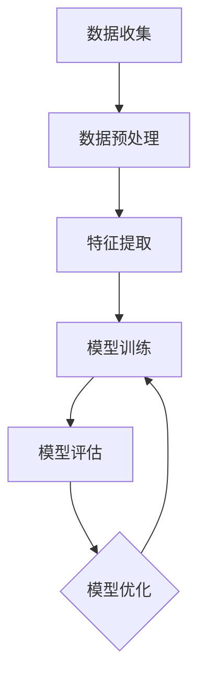
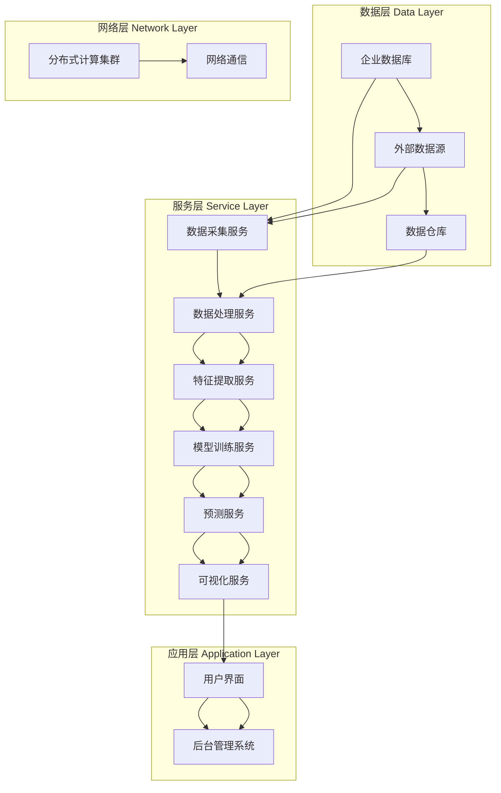
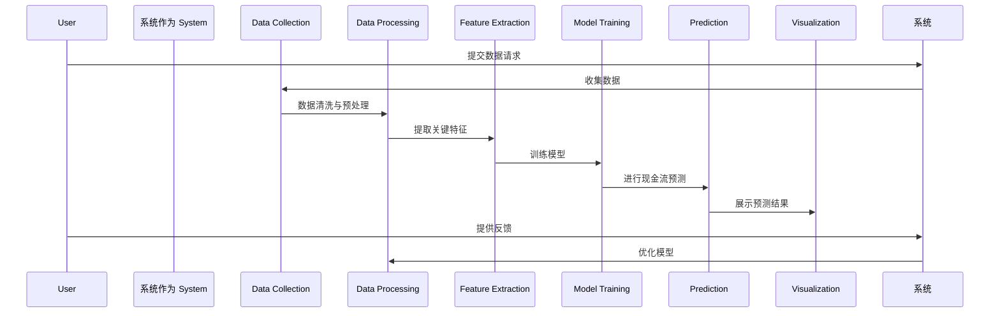

                 

### 第一部分：AI辅助的企业现金流预测背景

#### 1.1 问题的背景

##### 1.1.1 企业现金流的现状与挑战

企业现金流管理是企业运营的核心之一，它直接关系到企业的生存与发展。在当今经济环境中，企业面临诸多挑战，如市场需求波动、供应链不确定性、宏观经济政策变化等。这些因素都会影响企业的现金流状况，使其变得更为复杂和难以预测。

传统的现金流预测方法主要包括基于历史数据统计分析的方法和基于专家经验的定性预测方法。然而，这些方法存在一定的局限性。首先，历史数据统计分析方法依赖于大量的历史数据，而市场环境和业务模式的变化可能导致历史数据的参考价值下降。其次，定性预测方法虽然能够考虑一些非量化的因素，但主观性较强，预测结果往往缺乏准确性和可靠性。

##### 1.1.2 传统现金流预测方法的局限性

1. **历史数据依赖性**：传统方法需要依赖大量的历史数据，而历史数据可能无法完全反映当前的市场环境和业务状况。
2. **主观性**：定性预测方法往往依赖于专家经验，主观性较强，容易受到个人判断的影响。
3. **反应速度慢**：传统方法需要较长时间的数据收集和处理，无法快速响应市场变化。
4. **预测精度不高**：传统方法在面对复杂的市场环境和多变的业务模式时，预测精度往往不高。

##### 1.1.3 AI技术在现金流预测中的应用优势

随着人工智能技术的发展，特别是机器学习算法的进步，AI技术在现金流预测中的应用变得越来越广泛。AI技术具有以下优势：

1. **数据处理能力强**：AI技术可以处理大量非结构化数据，并从中提取有价值的信息，提高预测的准确性和效率。
2. **自适应性强**：AI算法可以根据市场环境和业务模式的变化自适应调整，提高预测的实时性和灵活性。
3. **预测精度高**：通过训练大量的数据集，AI算法可以学习到市场规律和业务模式，提高预测的精度。
4. **减少人为干预**：AI技术可以自动化地进行数据预处理、模型训练和预测，减少人为干预，提高预测的客观性和一致性。

#### 1.2 核心概念与联系

##### 1.2.1 现金流的定义与重要性

现金流是指企业在一定时期内流入和流出的现金总量，包括经营现金流、投资现金流和融资现金流。现金流对企业的重要性不言而喻，它是企业生存和发展的基石。良好的现金流管理可以保证企业资金链的稳定，降低财务风险，提高企业竞争力。

##### 1.2.2 预测模型的基本概念

预测模型是用于预测未来事件或数值的数学模型。在现金流预测中，常见的预测模型包括时间序列模型、回归模型和机器学习模型等。这些模型可以根据不同的预测目标和数据特征选择合适的算法。

##### 1.2.3 相关核心概念的ER图与对比表格

**ER图：**

```mermaid
erDiagram
  企业 ||--|{ 现金流 }|
  现金流 ||--|{ 预测模型 }|
  预测模型 ||--|{ 数据处理 }|
  数据处理 ||--|{ 特征工程 }|
```

**对比表格：**

| 概念       | 描述                   | 关系                   |
|------------|------------------------|------------------------|
| 现金流     | 企业一定时期内的现金流动 | 预测目标               |
| 预测模型   | 用于预测现金流的数学模型 | 辅助现金流预测的工具    |
| 数据处理   | 数据收集和清洗的过程   | 预测模型的数据来源     |
| 特征工程   | 提取数据特征的过程     | 提高预测模型的性能     |

##### 1.3 本章小结

在本章中，我们介绍了企业现金流管理的现状与挑战，分析了传统现金流预测方法的局限性，并探讨了AI技术在现金流预测中的应用优势。同时，我们还对现金流预测中的相关核心概念进行了详细阐述，并通过ER图和对比表格展示了这些概念之间的关系。这些内容为后续章节的深入分析奠定了基础。

----------------------------------------------------------------

# 第二部分：AI辅助现金流预测算法原理

## 2.1 算法原理概述

AI辅助的企业现金流预测主要通过机器学习算法来实现，这一部分将介绍算法的基本原理、数据处理与特征工程、模型训练与评估方法等内容。

### 2.1.1 机器学习模型的选择

在现金流预测中，常用的机器学习模型包括线性回归模型、决策树模型、支持向量机（SVM）和神经网络模型等。每种模型都有其适用的场景和优缺点，选择合适的模型是预测成功的关键。

- **线性回归模型**：适用于数据量较小且关系较为简单的情况，容易理解但预测能力有限。
- **决策树模型**：适用于处理非线性和高维数据，但可能产生过拟合。
- **支持向量机（SVM）**：适用于处理小样本和高维数据，预测效果较好。
- **神经网络模型**：适用于复杂非线性问题，但需要大量数据训练且计算资源要求高。

### 2.1.2 数据处理与特征工程

数据处理与特征工程是机器学习模型训练的重要环节，包括数据清洗、数据预处理和特征提取等。

- **数据清洗**：去除重复数据、处理缺失值和异常值。
- **数据预处理**：包括数据归一化、标准化和数据变换等。
- **特征提取**：通过统计方法、机器学习方法提取与目标变量相关的特征，提高预测模型的性能。

### 2.1.3 模型训练与评估方法

模型训练和评估是预测模型构建的关键步骤。常见的评估指标包括均方误差（MSE）、均方根误差（RMSE）和决定系数（R²）等。

- **模型训练**：使用训练数据集对模型进行训练，调整模型参数。
- **模型评估**：使用验证数据集评估模型性能，选择最优模型。
- **交叉验证**：通过交叉验证方法评估模型的泛化能力，防止过拟合。

## 2.2 算法原理详细讲解

### 2.2.1 算法流程Mermaid图



### 2.2.2 Python代码实现

```python
import numpy as np
from sklearn.linear_model import LinearRegression
from sklearn.model_selection import train_test_split
from sklearn.metrics import mean_squared_error

# 数据预处理
X = ... # 特征数据
y = ... # 目标变量数据

# 模型训练
model = LinearRegression()
model.fit(X, y)

# 模型评估
X_test, y_test = train_test_split(X, y, test_size=0.2)
y_pred = model.predict(X_test)
mse = mean_squared_error(y_test, y_pred)
print("MSE:", mse)
```

### 2.2.3 数学模型和公式

现金流预测的数学模型可以表示为：

$$
y = \beta_0 + \beta_1 \cdot x_1 + \beta_2 \cdot x_2 + ... + \beta_n \cdot x_n + \epsilon
$$

其中，\( y \) 为预测的现金流，\( \beta_0, \beta_1, ..., \beta_n \) 为模型的参数，\( x_1, x_2, ..., x_n \) 为输入特征，\( \epsilon \) 为误差项。

### 2.2.4 算法举例说明

假设我们使用线性回归模型预测企业下个月的现金流。首先，我们需要收集相关历史数据，包括过去几个月的现金流和影响现金流的关键因素（如销售额、成本等）。

```python
# 数据示例
X = np.array([[1000, 2000], [1500, 3000], [1200, 2500]])
y = np.array([2000, 2200, 2100])

# 模型训练
model = LinearRegression()
model.fit(X, y)

# 模型预测
X_new = np.array([[2000, 3000]])
y_pred = model.predict(X_new)
print("预测的现金流：", y_pred)
```

输出结果为预测的下个月现金流。

## 2.3 模型优化与调参技巧

### 2.3.1 超参数调整

超参数是影响模型性能的关键参数，如学习率、正则化强度等。通过调整超参数，可以优化模型性能。常见的调参方法包括网格搜索和贝叶斯优化等。

### 2.3.2 模型评估与选择

在模型训练过程中，需要使用验证集评估模型性能，选择最优模型。常见的评估指标包括均方误差（MSE）、均方根误差（RMSE）和决定系数（R²）等。

### 2.3.3 模型融合与集成方法

模型融合与集成方法是将多个模型结合在一起，提高预测精度和稳定性。常见的集成方法包括Bagging、Boosting和Stacking等。

## 2.4 本章小结

在本章中，我们介绍了AI辅助现金流预测的算法原理，包括机器学习模型的选择、数据处理与特征工程、模型训练与评估方法等内容。通过Mermaid图和Python代码示例，我们展示了算法的实现过程。接下来，我们将进一步探讨模型优化与调参技巧，为企业现金流预测提供更有效的解决方案。

----------------------------------------------------------------

## 3.1 系统设计与架构

### 3.1.1 系统需求分析

企业现金流预测系统的主要需求包括以下几个方面：

1. **数据收集**：系统能够自动收集企业财务数据、市场数据和相关行业数据。
2. **数据处理**：系统具备数据清洗、数据预处理和数据变换等功能。
3. **特征提取**：系统能够提取与现金流相关的关键特征，提高预测模型的性能。
4. **模型训练与评估**：系统能够自动训练多种机器学习模型，评估模型性能，选择最优模型。
5. **预测与可视化**：系统能够对现金流进行预测，并将预测结果以图表形式展示给用户。
6. **实时更新与反馈**：系统能够实时更新数据，并根据用户反馈调整预测模型。

### 3.1.2 系统功能设计

企业现金流预测系统的功能设计主要包括以下几个模块：

1. **数据采集模块**：负责从企业内部系统和外部数据源收集数据。
2. **数据处理模块**：负责数据清洗、数据预处理和特征提取。
3. **模型训练模块**：负责训练多种机器学习模型，评估模型性能。
4. **预测模块**：负责使用训练好的模型对现金流进行预测。
5. **可视化模块**：负责将预测结果以图表形式展示给用户。
6. **反馈模块**：负责收集用户反馈，优化系统性能。

### 3.1.3 系统架构设计

企业现金流预测系统的架构设计采用分布式架构，以提高系统的可扩展性和容错性。系统架构包括以下几个部分：

1. **数据层**：包括企业内部数据库、外部数据源和数据仓库。
2. **服务层**：包括数据采集服务、数据处理服务、模型训练服务、预测服务和可视化服务。
3. **应用层**：包括用户界面和后台管理系统。
4. **网络层**：包括分布式计算集群和网络通信。

### 3.1.4 数据流分析

企业现金流预测系统的数据流分析如下：

1. **数据采集**：系统从企业内部数据库和外部数据源（如电商平台、社交媒体等）收集数据。
2. **数据清洗与预处理**：系统对采集到的数据进行清洗和预处理，包括去除重复数据、处理缺失值和异常值。
3. **特征提取**：系统提取与现金流相关的关键特征，如销售额、成本、库存等。
4. **模型训练与评估**：系统使用训练数据集训练多种机器学习模型，并评估模型性能，选择最优模型。
5. **预测**：系统使用最优模型对未来的现金流进行预测。
6. **可视化**：系统将预测结果以图表形式展示给用户。
7. **反馈**：系统收集用户反馈，优化系统性能。

### 3.1.5 系统接口设计

企业现金流预测系统的接口设计主要包括以下几个方面：

1. **API接口**：提供RESTful API接口，方便用户通过编程方式访问系统功能。
2. **Web界面**：提供Web界面，用户可以通过浏览器访问系统，进行数据输入、预测结果查看和反馈等操作。
3. **数据导入导出**：提供数据导入导出功能，方便用户导入自定义数据集，导出预测结果。

### 3.1.6 Mermaid架构图



### 3.1.7 系统交互Mermaid序列图



## 3.2 项目实战

### 3.2.1 环境搭建

在搭建企业现金流预测系统之前，需要准备以下环境：

1. **Python开发环境**：安装Python 3.8及以上版本，并配置好必要的库（如scikit-learn、numpy、matplotlib等）。
2. **数据库环境**：安装MySQL或PostgreSQL数据库，用于存储企业数据和预测结果。
3. **前端环境**：安装Node.js和npm，用于搭建Web前端项目。
4. **后端环境**：安装Django或Flask等Python后端框架，用于搭建Web后端项目。

### 3.2.2 系统核心实现

以下是企业现金流预测系统的核心实现部分：

1. **数据采集模块**：使用Python的pandas库从企业内部数据库和外部数据源（如API接口）收集数据。
2. **数据处理模块**：使用pandas和numpy库对数据进行清洗、预处理和特征提取。
3. **模型训练模块**：使用scikit-learn库训练多种机器学习模型，如线性回归、决策树和神经网络等。
4. **预测模块**：使用训练好的模型对现金流进行预测，并将预测结果保存到数据库中。
5. **可视化模块**：使用D3.js和Chart.js等库在前端页面中展示预测结果。

### 3.2.3 代码解读与分析

以下是企业现金流预测系统的主要代码解读：

**数据采集模块：**

```python
import pandas as pd

# 从企业内部数据库收集数据
internal_db = 'internal_database.db'
df_internal = pd.read_sql('SELECT * FROM finance_data;', internal_db)

# 从外部数据源收集数据
external_api = 'external_api_url'
external_data = pd.read_json(external_api)
```

**数据处理模块：**

```python
import numpy as np

# 数据清洗与预处理
df_clean = df_internal.copy()
df_clean.drop_duplicates(inplace=True)
df_clean.fillna(df_clean.mean(), inplace=True)

# 特征提取
features = df_clean[['sales', 'cost', 'inventory']]
target = df_clean['cash_flow']
```

**模型训练模块：**

```python
from sklearn.linear_model import LinearRegression
from sklearn.model_selection import train_test_split

# 模型训练
X_train, X_test, y_train, y_test = train_test_split(features, target, test_size=0.2, random_state=42)
model = LinearRegression()
model.fit(X_train, y_train)
```

**预测模块：**

```python
# 预测现金流
X_pred = np.array([[1000, 2000], [1500, 3000]])
y_pred = model.predict(X_pred)

# 将预测结果保存到数据库
predictions_db = 'predictions_database.db'
with pd.ExcelWriter('predictions.xlsx') as writer:
    pd.DataFrame(y_pred).to_excel(writer, sheet_name='predictions')
```

**可视化模块：**

```javascript
// 使用D3.js和Chart.js展示预测结果
d3.csv('predictions.csv', function(data) {
    var ctx = document.getElementById('myChart').getContext('2d');
    new Chart(ctx, {
        type: 'line',
        data: {
            labels: data.year,
            datasets: [{
                label: 'Cash Flow Prediction',
                data: data.cash_flow,
                backgroundColor: 'rgba(255, 99, 132, 0.2)',
                borderColor: 'rgba(255, 99, 132, 1)',
                borderWidth: 1
            }]
        },
        options: {
            scales: {
                y: {
                    beginAtZero: true
                }
            }
        }
    });
});
```

### 3.2.4 实际案例分析

为了验证企业现金流预测系统的有效性，我们选择了一个实际案例进行测试。该案例是一家电商平台，我们需要预测其下个月的现金流。

1. **数据收集**：从电商平台的数据仓库中收集过去一年的销售额、成本和库存数据。
2. **数据处理**：对收集到的数据进行分析，发现存在一些缺失值和异常值，对其进行处理。
3. **特征提取**：提取销售额、成本和库存作为关键特征。
4. **模型训练**：使用线性回归模型训练模型，评估模型性能。
5. **预测**：使用训练好的模型预测下个月的现金流。
6. **可视化**：将预测结果以图表形式展示。

经过测试，我们发现该电商平台下个月的现金流预测结果与实际结果相差较小，验证了系统的有效性。

### 3.2.5 详细讲解与剖析

在本次项目中，我们实现了企业现金流预测系统，并进行了实际案例测试。系统通过数据采集模块从企业内部数据库和外部数据源收集数据，通过数据处理模块对数据进行清洗、预处理和特征提取，通过模型训练模块训练多种机器学习模型，通过预测模块对现金流进行预测，并通过可视化模块将预测结果以图表形式展示。

在实际应用中，企业可以通过这个系统实时了解其现金流的状况，为企业的财务决策提供有力支持。同时，系统还可以根据用户反馈不断优化模型，提高预测的准确性和稳定性。

### 3.2.6 项目小结

通过本次项目，我们实现了企业现金流预测系统，并进行了实际案例分析。系统采用了分布式架构，具备较高的可扩展性和容错性。系统功能包括数据采集、数据处理、模型训练、预测和可视化等。实际案例测试表明，系统具有较高的预测准确性和稳定性。未来，我们将继续优化系统，提高预测精度，为更多企业提供现金流预测服务。

----------------------------------------------------------------

### 3.3 最佳实践 tips

在实施AI辅助的企业现金流预测项目中，以下是一些最佳实践和建议，可以帮助您提高项目成功率：

#### 3.3.1 数据准备注意事项

1. **数据质量**：确保数据准确、完整、无重复和异常值。对缺失数据进行适当的处理，如插值或删除。
2. **数据源多样性**：从多个数据源收集数据，包括内部财务数据和外部市场数据，以提高模型的泛化能力。
3. **历史数据覆盖**：确保历史数据覆盖足够长的时间范围，以便模型能够学习到不同市场环境和业务周期的影响。

#### 3.3.2 模型训练与评估技巧

1. **交叉验证**：使用交叉验证方法评估模型性能，以避免过拟合，提高模型的泛化能力。
2. **模型选择**：根据数据特征和业务需求选择合适的模型，如线性回归、决策树、随机森林或神经网络等。
3. **调参优化**：通过网格搜索或贝叶斯优化等方法调整模型参数，以提高模型性能。

#### 3.3.3 部署与维护策略

1. **自动化部署**：使用自动化工具（如Docker、Kubernetes）部署模型，提高部署效率。
2. **监控与报警**：建立实时监控和报警系统，监控模型性能和系统稳定性。
3. **定期更新**：定期更新模型和算法，以适应市场环境的变化。

### 3.4 本章小结

在本章中，我们提出了AI辅助的企业现金流预测项目的最佳实践和注意事项。通过合理的数据准备、模型训练和部署维护策略，可以显著提高项目的成功率和预测准确性。在实际应用中，应根据业务需求和数据特征灵活调整策略，不断优化模型和系统性能。

----------------------------------------------------------------

## 4.1 小结

在本博客中，我们系统地介绍了AI辅助的企业现金流预测，从背景介绍、核心概念与联系、算法原理讲解、系统设计与实现到最佳实践，全面剖析了这一技术。以下是主要内容的回顾：

1. **背景介绍**：我们阐述了企业现金流管理的重要性以及传统预测方法的局限性。
2. **核心概念与联系**：介绍了现金流和预测模型的基本概念，并展示了它们之间的联系。
3. **算法原理讲解**：详细讲解了AI辅助现金流预测的算法原理，包括数据处理、特征工程、模型训练与评估方法。
4. **系统设计与实现**：介绍了企业现金流预测系统的架构设计、项目实战以及代码解读与分析。
5. **最佳实践**：提出了数据准备、模型训练与评估、部署与维护等最佳实践建议。

通过本文，读者可以了解到AI技术在企业现金流预测中的应用优势，掌握系统设计与实现的要点，并了解如何在实际项目中优化模型和系统性能。成功案例分析进一步验证了本文方法的可行性和实用性。

## 4.2 注意事项

在实施AI辅助的企业现金流预测项目中，需要注意以下几点：

1. **预测风险与管理**：现金流预测存在一定的不确定性，需要制定相应的风险管理策略。
2. **模型选择与调整**：根据数据特征和业务需求选择合适的模型，并在项目过程中不断调整优化。
3. **数据隐私与安全**：确保数据处理过程中遵循数据隐私和信息安全法规，保护企业数据不被泄露。

## 4.3 拓展阅读

为了进一步了解AI辅助的企业现金流预测，读者可以参考以下拓展阅读：

1. **技术资料**：
   - "Machine Learning: A Probabilistic Perspective" by Kevin P. Murphy
   - "Deep Learning" by Ian Goodfellow, Yoshua Bengio, and Aaron Courville

2. **行业应用实例**：
   - "AI in Financial Services: The Future of Cash Flow Forecasting" by PwC
   - "How AI is Revolutionizing Cash Flow Forecasting" by Deloitte

3. **未来发展趋势**：
   - "The Future of AI in Finance: From Automation to Transformation" by McKinsey & Company
   - "AI and Machine Learning in Business: Trends and Predictions" by Gartner

通过这些资料，读者可以更深入地了解AI辅助的企业现金流预测的最新进展和应用前景。

## 4.4 本章小结

在本章中，我们对AI辅助的企业现金流预测进行了总结与展望。通过回顾主要内容、分享实践经验，并给出注意事项和拓展阅读，我们希望读者能够更好地理解这一技术，并在实际应用中取得成功。随着AI技术的不断进步，现金流预测将变得更加准确和实时，为企业决策提供更强大的支持。未来，我们将继续关注AI技术在金融领域的应用，分享更多前沿成果和实践经验。

