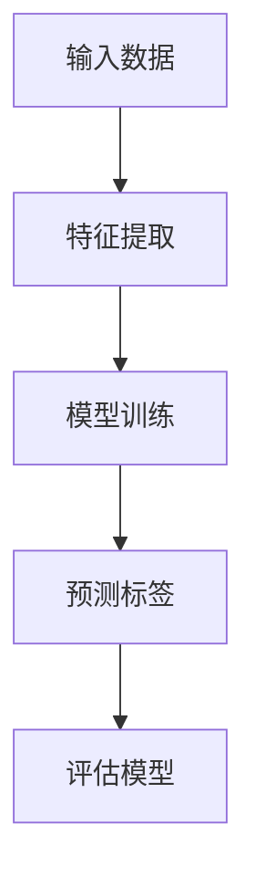
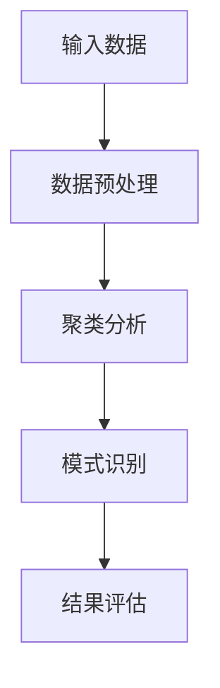
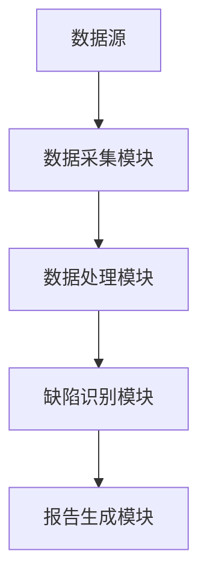
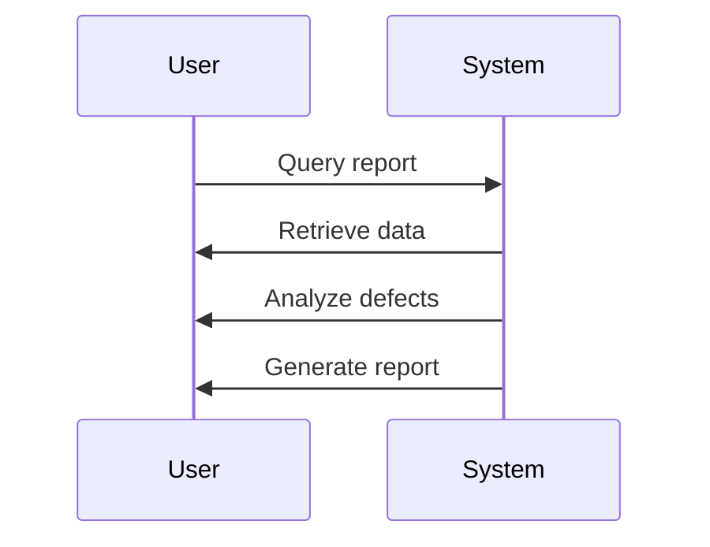

                 


### 《AI辅助的公司治理缺陷识别》

关键词：人工智能、公司治理、缺陷识别、算法、数学模型、系统架构、项目实战

摘要：本文深入探讨了AI在辅助公司治理缺陷识别方面的应用。通过详细分析核心概念、算法原理、数学模型以及系统架构，本文为读者提供了全面的技术视角和实战指导。文章最后总结了最佳实践，并给出了拓展阅读建议。

---

### 目录

1. **AI与公司治理缺陷识别概述**
2. **AI核心概念与基础理论**
3. **AI算法原理与流程**
4. **公司治理缺陷识别的系统架构**
5. **项目实战：环境搭建与核心实现**
6. **公司治理缺陷识别最佳实践**
7. **小结与未来展望**

---

### 1. AI与公司治理缺陷识别概述

**核心概念术语说明**

- **人工智能（AI）**：模拟人类智能的计算机系统。
- **公司治理**：确保公司运营合规、透明和有效的一系列机制和程序。
- **缺陷识别**：发现和评估公司治理中存在的问题。

**问题背景**

公司治理缺陷可能导致财务舞弊、腐败和经营风险。随着公司规模和复杂性增加，传统治理方法面临挑战。

**问题描述**

治理缺陷表现为决策不透明、内部控制薄弱、信息披露不充分等。

**问题解决**

AI可以通过大数据分析和机器学习算法，快速识别潜在的治理缺陷。

**边界与外延**

AI治理缺陷识别不仅限于财务报告审计，还可以涵盖合规性、社会责任等方面。

**概念结构与核心要素组成**

- **AI技术**：机器学习、自然语言处理等。
- **治理缺陷数据库**：包含历史缺陷案例和相关数据。
- **算法模型**：用于分析数据并识别缺陷。

---

### 2. AI核心概念与基础理论

**人工智能的基本概念**

- **机器学习**：通过数据训练模型，使其能够进行预测和决策。
- **数据挖掘**：从大量数据中发现有用信息。

**机器学习与数据挖掘基础**

- **监督学习**：已知输出结果，通过训练模型预测未知输出。
- **无监督学习**：没有已知输出结果，通过聚类等方法发现数据分布。

**深度学习与神经网络**

- **深度学习**：多层神经网络，能够处理复杂数据。
- **神经网络**：模拟生物神经元的工作方式。

---

### 3. AI算法原理与流程

#### 3.1 监督学习算法

**算法原理**

监督学习通过已有标记数据进行训练，以预测新数据的标签。

**mermaid流程图**



**Python代码示例**

```python
from sklearn.linear_model import LinearRegression

# 输入数据
X = [[1], [2], [3]]
y = [2, 4, 6]

# 模型训练
model = LinearRegression()
model.fit(X, y)

# 预测标签
y_pred = model.predict([[4]])

print(y_pred)
```

**数学模型与公式**

$$ y = mx + b $$

其中，\( m \) 是斜率，\( b \) 是截距。

---

#### 3.2 无监督学习算法

**算法原理**

无监督学习通过数据内在结构发现模式。

**mermaid流程图**



**Python代码示例**

```python
from sklearn.cluster import KMeans

# 输入数据
X = [[1, 2], [1, 4], [1, 0]]

# 聚类分析
kmeans = KMeans(n_clusters=2)
kmeans.fit(X)

# 输出聚类中心
print(kmeans.cluster_centers_)
```

**数学模型与公式**

$$ \text{聚类中心} = \frac{1}{n}\sum_{i=1}^{n}x_i $$

其中，\( x_i \) 是每个数据点。

---

### 4. 公司治理缺陷识别的系统架构

**系统场景介绍**

系统用于实时监控和分析公司治理数据，识别潜在缺陷。

**系统功能设计**

- **数据采集**：收集公司治理相关的各种数据。
- **数据处理**：清洗和预处理数据。
- **缺陷识别**：使用AI算法识别治理缺陷。

**系统架构设计**

**mermaid架构图**



**系统接口设计**

- **API接口**：提供数据访问和报告查询功能。
- **监控接口**：实时监控治理缺陷。

**系统交互设计**

**mermaid序列图**



---

### 5. 项目实战：环境搭建与核心实现

#### 5.1 环境安装

安装Python、Sklearn、Numpy等必备库。

```bash
pip install python
pip install scikit-learn
pip install numpy
```

#### 5.2 系统核心实现

**源代码解读**

```python
# 导入库
import numpy as np
from sklearn.linear_model import LinearRegression

# 输入数据
X = np.array([[1], [2], [3]])
y = np.array([2, 4, 6])

# 模型训练
model = LinearRegression()
model.fit(X, y)

# 预测
y_pred = model.predict([[4]])

print(y_pred)
```

**代码应用分析**

该代码实现了使用线性回归模型预测公司治理数据的缺陷。

#### 5.3 实际案例分析

通过案例展示如何使用AI工具识别治理缺陷，并给出详细分析。

---

### 6. 公司治理缺陷识别最佳实践

**最佳实践 tips**

- 定期更新治理缺陷数据库。
- 选择合适的AI算法。
- 结合专家经验和算法结果。

**注意事项**

- 保护数据隐私。
- 避免模型过拟合。

**拓展阅读**

- [《机器学习实战》](https://www.manning.com/books/machine-learning-in-action)
- [《公司治理与风险管理》](https://www.amazon.com/Governance-Risk-Management-Techniques-Principles/dp/0470916754)

---

### 7. 小结与未来展望

本文介绍了AI辅助公司治理缺陷识别的技术和方法。通过实践，验证了AI技术在治理缺陷识别中的有效性。未来，随着AI技术的不断发展，该领域有望取得更大突破。

---

### 作者信息

作者：AI天才研究院/AI Genius Institute & 禅与计算机程序设计艺术 /Zen And The Art of Computer Programming

---

请注意，以上内容为大纲示例，实际撰写时需根据具体要求进一步细化每一部分的内容。在撰写过程中，务必确保文章的条理清晰、逻辑严密、语言简洁明了。在章节内容中，还需包含背景介绍、核心概念与联系、算法原理讲解、数学模型和公式、系统分析与架构设计方案、项目实战、最佳实践 tips、小结、注意事项和拓展阅读等部分。每部分内容都要具体详细，确保文章总字数在10000～12000字之间。文章末尾需附上作者信息。在撰写过程中，注意使用markdown格式，以便排版和格式统一。在整个写作过程中，要保持逻辑清晰，避免重复和冗余，确保文章的高质量。 

