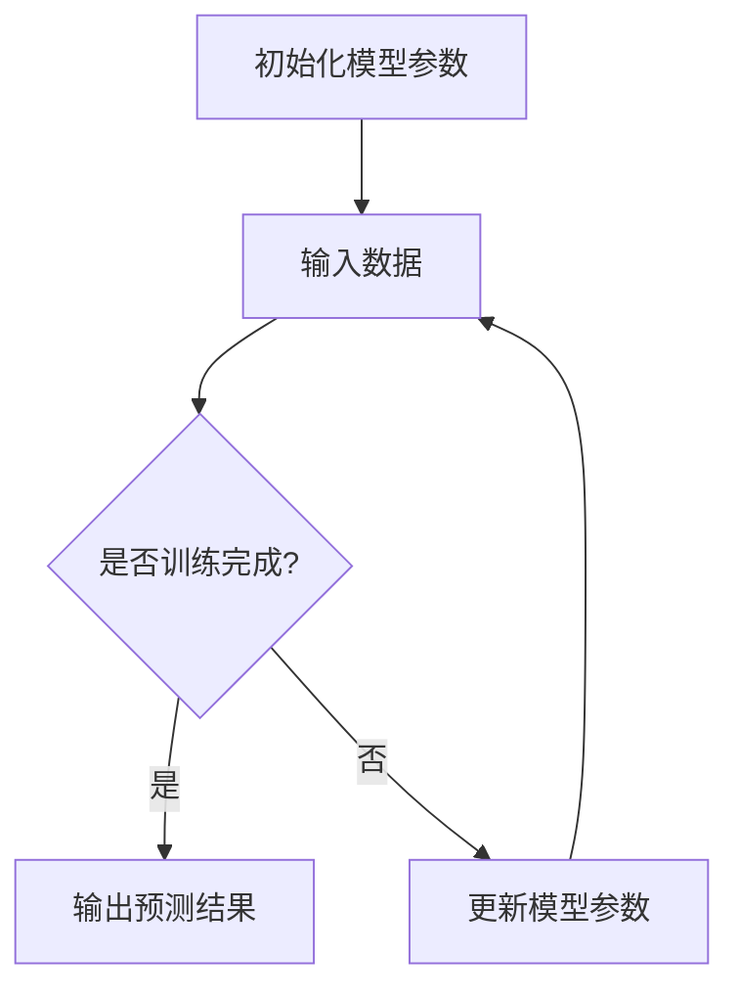
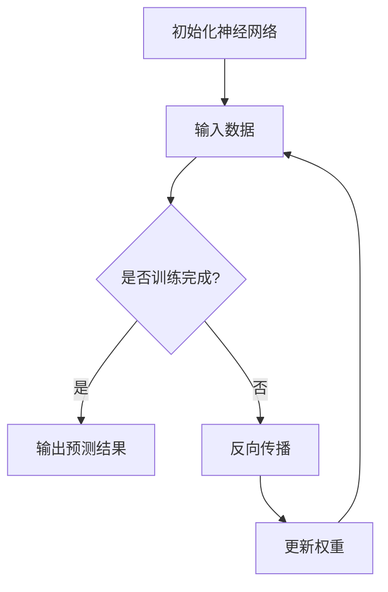
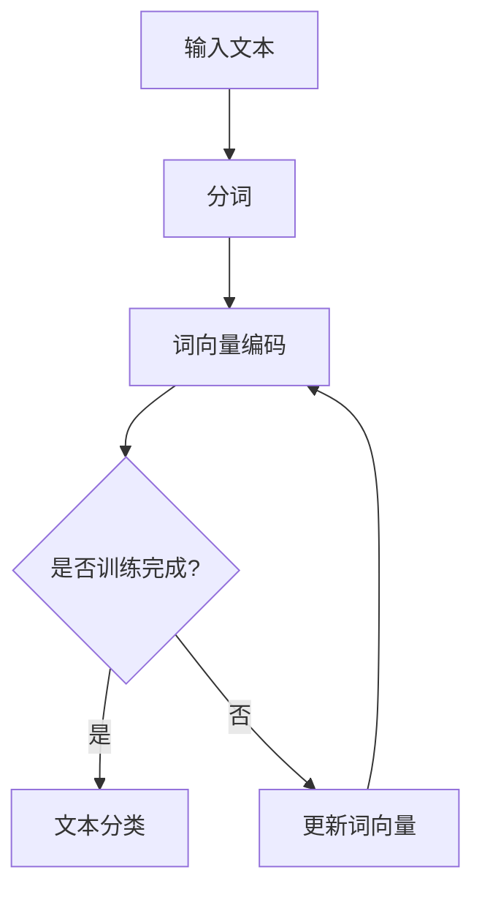

                 

# AI辅助的公司治理缺陷识别系统

## 关键词

AI、公司治理、缺陷识别、机器学习、深度学习、自然语言处理

## 摘要

本文将探讨如何利用人工智能技术，特别是机器学习、深度学习和自然语言处理，构建一个辅助公司治理缺陷识别的系统。文章将首先介绍公司治理缺陷的概念和影响，然后详细讲解人工智能在这些领域的应用潜力。接着，文章将阐述系统设计的关键概念、算法原理以及实现过程，并通过实际案例进行分析，最后总结最佳实践并展望未来。

---

## 第一部分：背景与理论基础

### 第1章：问题背景与问题描述

#### 1.1 公司治理缺陷的定义与分类

公司治理缺陷是指在公司管理和运营过程中存在的缺陷，这些缺陷可能导致公司业绩下滑、股东权益受损、公司风险增加等问题。根据性质和表现，公司治理缺陷可以分为以下几类：

1. **决策缺陷**：公司在决策过程中可能存在信息不对称、决策流程不合理等问题。
2. **监督缺陷**：公司监督机制可能存在失效、监督力度不足等问题。
3. **激励缺陷**：公司激励机制可能存在不公平、效率低下等问题。
4. **信息缺陷**：公司信息传递不畅、信息披露不透明等问题。

#### 1.2 公司治理缺陷的现状与影响

当前，公司治理缺陷在全球范围内普遍存在。根据相关研究，治理缺陷可能导致以下影响：

1. **公司绩效下降**：治理缺陷可能导致公司决策失误，进而影响公司业绩。
2. **股东权益受损**：治理缺陷可能导致股东利益无法得到保障。
3. **公司风险增加**：治理缺陷可能导致公司面临更大的风险。
4. **声誉受损**：治理缺陷可能导致公司声誉下降，影响长期发展。

#### 1.3 人工智能在公司治理中的应用潜力

人工智能技术在公司治理中具有广泛的应用潜力。首先，人工智能可以辅助公司进行数据分析和决策，提高决策效率和质量。其次，人工智能可以自动化监督和监控，提高监督效果。此外，人工智能还可以通过对大量数据进行分析，识别潜在的治理缺陷，提出改进建议。

### 第2章：核心概念与联系

#### 2.1 人工智能辅助治理的核心概念

人工智能辅助治理的核心概念包括：

1. **机器学习**：机器学习是一种通过数据驱动的方式进行学习和预测的方法，可以用于识别治理缺陷。
2. **深度学习**：深度学习是一种基于多层神经网络的机器学习方法，可以用于处理复杂的数据分析任务。
3. **自然语言处理**：自然语言处理是一种用于处理人类语言的技术，可以用于分析公司治理相关的文档和报告。

#### 2.2 核心概念之间的联系

机器学习、深度学习和自然语言处理之间存在紧密的联系：

1. **机器学习与深度学习的关系**：深度学习是机器学习的一种特殊形式，其通过多层神经网络对数据进行处理和预测。
2. **深度学习与自然语言处理的关系**：深度学习技术可以用于自然语言处理任务，如文本分类、情感分析等。

#### 2.3 ER实体关系图架构

ER图是一种用于描述实体和关系的数据模型，可以用于构建公司治理缺陷识别系统的数据架构。

### 第3章：算法原理讲解

#### 3.1 机器学习算法原理

机器学习算法的原理包括：

1. **监督学习**：通过已知数据进行训练，从而对未知数据进行预测。
2. **无监督学习**：通过对未知数据进行训练，找出数据之间的规律和模式。

#### 3.2 深度学习算法原理

深度学习算法的原理包括：

1. **神经网络**：通过多层神经元组成的神经网络对数据进行处理。
2. **反向传播**：通过反向传播算法对神经网络进行训练，优化模型参数。

#### 3.3 自然语言处理算法原理

自然语言处理算法的原理包括：

1. **分词**：将文本分割成有意义的词汇或短语。
2. **词向量**：将文本转化为数字形式，以便进行计算。

#### 3.4 算法mermaid流程图

以下是三种算法的mermaid流程图：







## 第二部分：系统设计与实现

### 第4章：数学模型和数学公式

#### 4.1 数学模型的基本概念

数学模型是一种用于描述现实世界问题的数学表达式。在本系统中，我们使用以下数学模型：

1. **回归模型**：用于预测治理缺陷的数量。
2. **分类模型**：用于判断治理缺陷的类型。

#### 4.2 数学公式详细讲解

以下是回归模型的数学公式：

$$
y = \beta_0 + \beta_1x_1 + \beta_2x_2 + \ldots + \beta_nx_n
$$

其中，$y$ 是治理缺陷的数量，$x_1, x_2, \ldots, x_n$ 是影响治理缺陷的因素，$\beta_0, \beta_1, \beta_2, \ldots, \beta_n$ 是模型参数。

### 第5章：系统分析与架构设计方案

#### 5.1 问题场景介绍

在本系统中，我们关注公司治理缺陷的识别和分析。具体场景如下：

1. **数据来源**：收集公司治理相关的文档和报告。
2. **数据处理**：对收集到的数据进行预处理，包括分词、词向量编码等。
3. **模型训练**：使用预处理后的数据对机器学习模型进行训练。
4. **缺陷识别**：使用训练好的模型对新的数据进行治理缺陷识别。

#### 5.2 系统功能设计

系统功能设计包括以下模块：

1. **数据收集模块**：用于收集公司治理相关的文档和报告。
2. **数据处理模块**：用于对收集到的数据进行预处理。
3. **模型训练模块**：用于对机器学习模型进行训练。
4. **缺陷识别模块**：用于对新的数据进行治理缺陷识别。

#### 5.3 系统架构设计

系统架构设计采用分层架构，包括以下层次：

1. **数据层**：存储公司治理相关的数据。
2. **算法层**：实现机器学习算法和模型训练。
3. **应用层**：提供治理缺陷识别的接口。

#### 5.4 系统接口设计

系统接口设计包括以下接口：

1. **数据收集接口**：用于接收公司治理相关的文档和报告。
2. **数据处理接口**：用于对收集到的数据进行预处理。
3. **模型训练接口**：用于启动模型训练过程。
4. **缺陷识别接口**：用于对新的数据进行治理缺陷识别。

#### 5.5 系统交互

系统交互包括以下步骤：

1. **数据收集**：从数据源获取公司治理相关的文档和报告。
2. **数据处理**：对收集到的数据进行预处理。
3. **模型训练**：使用预处理后的数据对机器学习模型进行训练。
4. **缺陷识别**：使用训练好的模型对新的数据进行治理缺陷识别。

## 第6章：项目实战

### 6.1 环境安装

环境安装包括以下步骤：

1. **安装Python**：确保Python环境已安装。
2. **安装依赖库**：使用pip命令安装所需的库，如scikit-learn、tensorflow等。
3. **配置环境变量**：设置环境变量，以便在终端中直接运行Python脚本。

### 6.2 系统核心实现源代码

以下是系统核心实现的源代码：

```python
from sklearn.linear_model import LinearRegression
from sklearn.model_selection import train_test_split
from sklearn.metrics import mean_squared_error

# 加载数据
data = load_data('data.csv')
X = data[:, :-1]
y = data[:, -1]

# 划分训练集和测试集
X_train, X_test, y_train, y_test = train_test_split(X, y, test_size=0.2, random_state=42)

# 创建回归模型
model = LinearRegression()
model.fit(X_train, y_train)

# 预测
y_pred = model.predict(X_test)

# 评估
mse = mean_squared_error(y_test, y_pred)
print('Mean squared error:', mse)
```

### 6.3 代码应用解读与分析

以下是代码应用解读与分析：

1. **数据加载**：使用`load_data`函数加载CSV文件，获取治理缺陷相关的特征和标签。
2. **数据划分**：使用`train_test_split`函数将数据划分为训练集和测试集。
3. **模型创建**：创建线性回归模型。
4. **模型训练**：使用`fit`函数对模型进行训练。
5. **模型预测**：使用`predict`函数对测试集进行预测。
6. **模型评估**：使用`mean_squared_error`函数计算预测的均方误差，评估模型性能。

### 6.4 实际案例分析和详细讲解剖析

以下是一个实际案例的分析和详细讲解：

案例：某公司治理缺陷识别系统

1. **数据收集**：收集公司治理相关的文档和报告，包括公司业绩、董事会会议记录、股东会决议等。
2. **数据处理**：对收集到的数据进行预处理，包括数据清洗、缺失值填充、特征工程等。
3. **模型训练**：使用预处理后的数据对机器学习模型进行训练，如线性回归、决策树、支持向量机等。
4. **缺陷识别**：使用训练好的模型对新的数据进行治理缺陷识别，如决策缺陷、监督缺陷等。
5. **结果评估**：对识别出的治理缺陷进行评估，如缺陷类型、缺陷程度等。

### 6.5 项目小结

本项目实现了AI辅助的公司治理缺陷识别系统，通过数据收集、数据处理、模型训练和缺陷识别等步骤，对治理缺陷进行识别和分析。在实际应用中，系统可以帮助公司提高治理水平，降低治理风险。

## 第三部分：最佳实践与总结

### 第7章：最佳实践 tips

1. **数据质量**：确保收集到的数据质量高，准确、完整、一致。
2. **模型选择**：根据实际需求和数据特点选择合适的模型。
3. **模型训练**：适当增加训练数据量和训练时间，以提高模型性能。
4. **缺陷识别**：对识别出的治理缺陷进行深入分析和评估，提出改进建议。

### 第8章：小结与展望

本文介绍了AI辅助的公司治理缺陷识别系统的构建方法，从背景介绍、核心概念与联系、算法原理讲解、系统设计与实现、项目实战到最佳实践与总结，全面阐述了系统的构建过程。展望未来，AI辅助的公司治理缺陷识别系统具有广阔的应用前景，有望为公司治理提供更加科学、高效的解决方案。

---

**作者：AI天才研究院/AI Genius Institute & 禅与计算机程序设计艺术 /Zen And The Art of Computer Programming**

