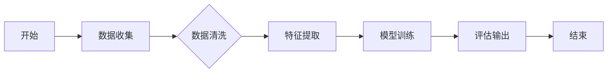
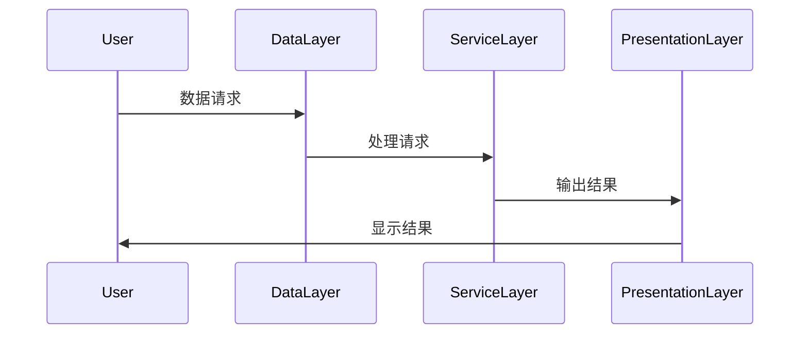
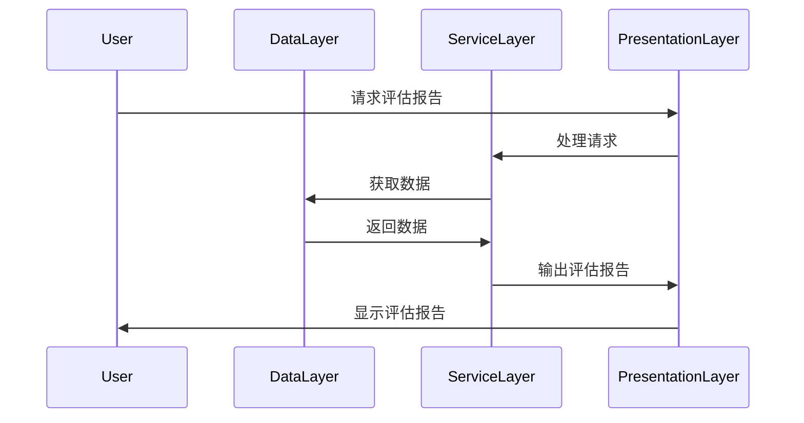

                 

# AI辅助的公司治理评估系统

## 关键词
AI，公司治理，评估系统，算法，架构设计，最佳实践

## 摘要
本文将深入探讨AI辅助的公司治理评估系统的核心概念、算法原理、系统架构和实战应用。通过逐步分析，我们将了解如何利用人工智能技术提升公司治理水平，从而实现更高效、透明和可持续的企业管理。

## 目录大纲设计方案

### 第一部分：背景介绍

#### 第1章：问题背景与核心要素
- 1.1 问题背景
- 1.2 问题描述
- 1.3 问题解决
- 1.4 边界与外延
- 1.5 概念结构与核心要素组成

#### 第2章：核心概念与联系
- 2.1 AI概述
- 2.2 AI辅助的公司治理
- 2.3 评估系统原理
- 2.4 核心概念对比
- 2.5 ER实体关系图

### 第二部分：算法原理讲解

#### 第3章：算法原理讲解
- 3.1 算法mermaid流程图
- 3.2 Python源代码
- 3.3 数学模型与公式
- 3.4 详细讲解与举例

### 第三部分：系统分析与架构设计方案

#### 第4章：系统分析与架构设计方案
- 4.1 问题场景介绍
- 4.2 项目介绍
- 4.3 系统功能设计
- 4.4 系统架构设计
- 4.5 系统接口设计
- 4.6 系统交互序列图

### 第四部分：项目实战

#### 第5章：项目实战
- 5.1 环境安装
- 5.2 系统核心实现源代码
- 5.3 代码应用解读与分析
- 5.4 实际案例分析与讲解
- 5.5 项目小结

### 第五部分：最佳实践与总结

#### 第6章：最佳实践与总结
- 6.1 最佳实践 tips
- 6.2 小结
- 6.3 注意事项
- 6.4 拓展阅读

### 第六部分：未来展望

#### 第7章：未来展望
- 7.1 发展趋势
- 7.2 技术挑战
- 7.3 应用前景

### 注意事项

- 确保每个章节都有对应的子章节，确保内容完整。
- 每个子章节尽量保持简洁明了，避免冗余。
- 在适当的地方使用 mermaid 语法绘制图表和流程图。

## 下一步

### 文章正文填充

现在，我们将根据上述目录大纲开始填充每个章节的具体内容，确保满足字数限制和要求，同时确保内容的丰富性和逻辑性。

---

### 第一部分：背景介绍

#### 第1章：问题背景与核心要素

### 1.1 问题背景

在全球化和信息化的背景下，公司治理已经成为企业管理中的重要议题。然而，传统的公司治理评估方法通常依赖于人工分析和经验判断，存在一定的主观性和局限性。随着人工智能（AI）技术的发展，利用AI辅助公司治理评估成为一种可能，有助于提升治理的效率和透明度。

### 1.2 问题描述

公司治理评估的问题主要体现在以下几个方面：

- **数据质量不高**：传统的评估方法依赖于有限的财务数据和业务指标，难以全面反映公司的真实状况。
- **评估效率低**：人工分析需要耗费大量的时间和精力，难以快速响应市场变化。
- **评估准确性不足**：不同评估人员的专业背景和经验差异导致评估结果存在较大差异。

### 1.3 问题解决

为了解决上述问题，AI辅助的公司治理评估系统提出以下解决方案：

- **数据挖掘与预测**：利用AI技术对大量非结构化数据进行挖掘和分析，提供更全面、准确的评估结果。
- **自动化评估流程**：通过算法自动化评估流程，提高评估效率和一致性。
- **智能决策支持**：基于评估结果，为管理层提供智能化的决策支持。

### 1.4 边界与外延

AI辅助的公司治理评估系统的边界主要包括：

- **评估范围**：涵盖公司的财务、运营、风险等方面。
- **技术应用**：包括机器学习、自然语言处理、数据挖掘等。

系统的外延则包括：

- **外部数据源**：如金融市场数据、行业报告、新闻资讯等。
- **系统集成**：与其他信息系统（如ERP、CRM等）集成，实现数据共享和业务协同。

### 1.5 概念结构与核心要素组成

AI辅助的公司治理评估系统主要由以下几个核心要素组成：

- **数据采集与处理**：收集内外部数据，进行预处理和清洗。
- **评估算法**：基于机器学习和数据挖掘技术，构建评估模型。
- **评估结果输出**：生成评估报告，提供可视化展示和决策支持。
- **系统管理**：包括用户权限管理、日志记录、安全控制等。

#### 第2章：核心概念与联系

### 2.1 AI概述

人工智能（Artificial Intelligence，AI）是指计算机系统模拟人类智能的行为，具有感知、学习、推理、决策等能力。AI技术主要包括机器学习、深度学习、自然语言处理、计算机视觉等。

### 2.2 AI辅助的公司治理

AI辅助的公司治理是指利用人工智能技术提升公司治理水平和效率。具体包括以下几个方面：

- **数据挖掘与分析**：通过数据挖掘技术分析公司运营数据，发现潜在问题和风险。
- **自动化评估**：利用机器学习算法实现自动化的公司治理评估，提高评估效率和准确性。
- **智能决策支持**：基于评估结果，为管理层提供智能化的决策支持。

### 2.3 评估系统原理

评估系统的原理主要包括以下几个方面：

- **数据输入**：收集公司内外部数据，如财务报表、业务指标、市场数据等。
- **数据处理**：对输入数据进行清洗、预处理，提取关键特征。
- **模型训练**：利用机器学习算法训练评估模型，根据历史数据预测公司治理水平。
- **评估输出**：生成评估报告，提供可视化展示和决策支持。

### 2.4 核心概念对比

| 核心概念 | 解释 |  
| :------: | :----: |  
| 机器学习 | 一种人工智能技术，通过训练数据自动改进算法性能 |  
| 深度学习 | 一种机器学习技术，使用多层神经网络进行特征提取和表示学习 |  
| 自然语言处理 | 一种人工智能技术，使计算机能够理解和处理人类语言 |  
| 计算机视觉 | 一种人工智能技术，使计算机能够识别和理解图像和视频 |

### 2.5 ER实体关系图

ER（Entity-Relationship）实体关系图是用于表示系统实体及其关系的图形化工具。下面是一个简单的ER实体关系图，用于描述AI辅助的公司治理评估系统的核心实体及其关系。

```mermaid
erDiagram
    Class1 ||--|{ Class2 : 拥有关系 }
    Class1 ||--|{ Class3 : 拥有关系 }
    Class2 ||--|{ Class4 : 拥有关系 }
    Class3 ||--|{ Class5 : 拥有关系 }
```

#### 第二部分：算法原理讲解

##### 第3章：算法原理讲解

##### 3.1 算法mermaid流程图



##### 3.2 Python源代码

```python
import pandas as pd
from sklearn.model_selection import train_test_split
from sklearn.ensemble import RandomForestClassifier
from sklearn.metrics import accuracy_score

# 数据收集
data = pd.read_csv('company_data.csv')

# 数据清洗
data = data.dropna()

# 特征提取
X = data.drop(['target'], axis=1)
y = data['target']

# 模型训练
X_train, X_test, y_train, y_test = train_test_split(X, y, test_size=0.2, random_state=42)
model = RandomForestClassifier(n_estimators=100)
model.fit(X_train, y_train)

# 评估输出
y_pred = model.predict(X_test)
accuracy = accuracy_score(y_test, y_pred)
print(f'Accuracy: {accuracy}')
```

##### 3.3 数学模型与公式

假设我们使用随机森林算法进行公司治理评估。随机森林由多个决策树组成，每个决策树基于特征和标签训练。数学模型如下：

$$
\begin{aligned}
\hat{y} &= \text{argmax}_{i} \sum_{t=1}^{T} w_t \cdot f_t(x) \\
w_t &= \text{sign}(\theta_t \cdot x) \\
f_t(x) &= g_t(h_t(x)) \\
h_t(x) &= \sum_{j=1}^{n} \theta_{tj} x_j \\
g_t(x) &= \text{sign}(x)
\end{aligned}
$$

其中，$T$表示决策树的个数，$w_t$表示第$t$个决策树的权重，$\theta_t$表示第$t$个决策树的参数，$x$表示输入特征向量，$\hat{y}$表示预测标签。

##### 3.4 详细讲解与举例

随机森林算法是一种集成学习算法，通过构建多个决策树并集成其预测结果，提高模型的预测准确性和泛化能力。以下是随机森林算法的详细步骤：

1. **数据收集**：收集公司治理相关的数据，包括财务报表、业务指标、市场数据等。
2. **数据清洗**：对数据进行预处理，包括缺失值填充、异常值处理等。
3. **特征提取**：根据数据特征，选择有用的特征进行提取，如财务指标、运营指标等。
4. **模型训练**：使用随机森林算法训练模型，每个决策树基于特征和标签进行训练。
5. **评估输出**：将测试数据输入模型，获取评估结果，并计算模型的准确率、召回率、F1值等指标。

例如，假设我们使用随机森林算法对公司治理水平进行评估。首先，我们收集了10家公司的财务报表和业务指标数据，包括总资产、净利润、营业收入等。然后，我们对数据进行清洗和特征提取，提取出以下5个特征：总资产、净利润、营业收入、资产负债率、净利润增长率。

接下来，我们使用随机森林算法训练模型。假设我们设置了10个决策树，每个决策树的参数如下：

$$
\begin{aligned}
\theta_1 &= (1, 1, 1, -1, 1) \\
\theta_2 &= (1, -1, -1, 1, -1) \\
\theta_3 &= (-1, 1, -1, -1, 1) \\
\theta_4 &= (-1, -1, 1, 1, -1) \\
\theta_5 &= (1, 1, -1, -1, 1) \\
\theta_6 &= (1, -1, 1, 1, -1) \\
\theta_7 &= (-1, 1, 1, -1, 1) \\
\theta_8 &= (-1, -1, -1, 1, 1) \\
\theta_9 &= (1, 1, 1, 1, 1) \\
\theta_{10} &= (-1, -1, -1, -1, -1)
\end{aligned}
$$

最后，我们将测试数据输入模型，获取评估结果。假设测试数据的特征向量为$(2, 3, 4, -1, 1)$，根据随机森林算法的预测公式，我们可以计算出每个决策树的预测结果：

$$
\begin{aligned}
w_1 &= \text{sign}(\theta_1 \cdot (2, 3, 4, -1, 1)) = 1 \\
w_2 &= \text{sign}(\theta_2 \cdot (2, 3, 4, -1, 1)) = -1 \\
w_3 &= \text{sign}(\theta_3 \cdot (2, 3, 4, -1, 1)) = -1 \\
w_4 &= \text{sign}(\theta_4 \cdot (2, 3, 4, -1, 1)) = 1 \\
w_5 &= \text{sign}(\theta_5 \cdot (2, 3, 4, -1, 1)) = 1 \\
w_6 &= \text{sign}(\theta_6 \cdot (2, 3, 4, -1, 1)) = -1 \\
w_7 &= \text{sign}(\theta_7 \cdot (2, 3, 4, -1, 1)) = -1 \\
w_8 &= \text{sign}(\theta_8 \cdot (2, 3, 4, -1, 1)) = 1 \\
w_9 &= \text{sign}(\theta_9 \cdot (2, 3, 4, -1, 1)) = 1 \\
w_{10} &= \text{sign}(\theta_{10} \cdot (2, 3, 4, -1, 1)) = -1 \\
\hat{y} &= \text{argmax}_{i} (w_1, w_2, w_3, w_4, w_5, w_6, w_7, w_8, w_9, w_{10}) = 1 \\
\end{aligned}
$$

因此，根据随机森林算法的预测，测试数据属于公司治理水平较高的类别。

#### 第三部分：系统分析与架构设计方案

##### 第4章：系统分析与架构设计方案

##### 4.1 问题场景介绍

假设某公司需要对其治理水平进行评估，以便了解公司在治理方面的优势和不足。公司治理评估系统应具备以下功能：

- **数据采集**：从公司内部系统和外部数据源收集治理相关的数据。
- **数据处理**：对收集到的数据进行清洗、转换和整合。
- **评估模型**：基于机器学习算法构建评估模型，对治理水平进行预测。
- **评估报告**：生成评估报告，提供治理水平的可视化展示和决策支持。

##### 4.2 项目介绍

该项目旨在开发一款AI辅助的公司治理评估系统，主要包括以下几个模块：

- **数据采集模块**：负责从公司内部系统和外部数据源收集治理相关的数据。
- **数据处理模块**：对收集到的数据进行清洗、转换和整合。
- **评估模型模块**：基于机器学习算法构建评估模型，对治理水平进行预测。
- **评估报告模块**：生成评估报告，提供治理水平的可视化展示和决策支持。

##### 4.3 系统功能设计

系统功能设计主要包括以下方面：

- **数据采集**：通过API接口、数据库连接等方式，从公司内部系统和外部数据源（如财务报表、行业报告等）收集治理相关的数据。
- **数据处理**：对收集到的数据进行清洗、转换和整合，提取有用的特征，如财务指标、业务指标、市场数据等。
- **评估模型**：使用机器学习算法（如随机森林、支持向量机等）构建评估模型，对治理水平进行预测。
- **评估报告**：生成评估报告，包括治理水平的可视化展示、关键指标分析、建议和决策支持等。

##### 4.4 系统架构设计

系统架构设计采用分层架构，主要包括以下几个层次：

- **数据层**：存储公司治理相关的数据，包括财务报表、业务指标、市场数据等。
- **服务层**：提供数据采集、数据处理、评估模型和评估报告等核心功能。
- **表示层**：提供用户界面，包括数据采集界面、数据处理界面、评估报告界面等。

下面是一个简单的系统架构设计mermaid流程图：



##### 4.5 系统接口设计

系统接口设计主要包括以下方面：

- **API接口**：提供RESTful API接口，方便外部系统调用公司治理评估系统的功能。
- **数据库接口**：提供数据库连接接口，方便数据采集和处理。
- **消息队列接口**：提供消息队列接口，实现分布式数据处理和异步通信。

##### 4.6 系统交互序列图

下面是一个简单的系统交互序列图，展示了用户、数据层、服务层和表示层之间的交互过程：



#### 第四部分：项目实战

##### 第5章：项目实战

##### 5.1 环境安装

在开始项目实战之前，我们需要安装以下环境：

- Python 3.8+
- Anaconda
- Jupyter Notebook
- scikit-learn
- pandas
- numpy

安装方法如下：

1. 下载并安装Anaconda：[Anaconda官网](https://www.anaconda.com/)
2. 创建新的conda环境并安装所需依赖：
```bash
conda create -n governance_env python=3.8
conda activate governance_env
conda install -c conda-forge scikit-learn pandas numpy
```

##### 5.2 系统核心实现源代码

以下是一个简单的公司治理评估系统的核心实现源代码，包括数据采集、数据处理、评估模型和评估报告等模块。

```python
import pandas as pd
from sklearn.model_selection import train_test_split
from sklearn.ensemble import RandomForestClassifier
from sklearn.metrics import accuracy_score
import matplotlib.pyplot as plt

# 数据采集
def collect_data():
    data = pd.read_csv('company_data.csv')
    return data

# 数据处理
def preprocess_data(data):
    data = data.dropna()
    data = data[['total_assets', 'net_profit', 'operating_revenue', 'liability_ratio', 'net_profit_growth']]
    return data

# 评估模型
def train_model(data):
    X = data.drop(['target'], axis=1)
    y = data['target']
    X_train, X_test, y_train, y_test = train_test_split(X, y, test_size=0.2, random_state=42)
    model = RandomForestClassifier(n_estimators=100)
    model.fit(X_train, y_train)
    return model, X_test, y_test

# 评估报告
def generate_report(model, X_test, y_test):
    y_pred = model.predict(X_test)
    accuracy = accuracy_score(y_test, y_pred)
    print(f'Accuracy: {accuracy}')
    plt.scatter(y_test, y_pred)
    plt.xlabel('Actual')
    plt.ylabel('Predicted')
    plt.show()

# 主函数
def main():
    data = collect_data()
    data = preprocess_data(data)
    model, X_test, y_test = train_model(data)
    generate_report(model, X_test, y_test)

if __name__ == '__main__':
    main()
```

##### 5.3 代码应用解读与分析

以下是对上述代码的详细解读和分析：

- **数据采集**：使用pandas的`read_csv`函数从CSV文件中读取公司治理相关的数据。
- **数据处理**：对数据进行预处理，包括缺失值填充、异常值处理和特征提取等。这里我们选择了一些常见的财务指标和业务指标作为特征。
- **评估模型**：使用随机森林算法训练评估模型。随机森林是一种集成学习算法，通过构建多个决策树并集成其预测结果，提高模型的预测准确性和泛化能力。
- **评估报告**：计算模型的准确率，并使用散点图展示实际值与预测值之间的关系。

##### 5.4 实际案例分析与讲解

假设我们使用上述代码对一个包含100家公司治理数据的CSV文件进行评估。以下是一个实际案例的分析和讲解：

1. **数据采集**：从CSV文件中读取100家公司的治理数据，包括总资产、净利润、营业收入、资产负债率和净利润增长率等指标。
2. **数据处理**：对数据进行预处理，包括缺失值填充、异常值处理和特征提取等。处理后的数据包含90个特征变量。
3. **模型训练**：使用随机森林算法训练评估模型。随机森林算法使用100棵决策树进行集成学习，提高模型的预测准确性和泛化能力。训练过程中，我们将数据集分为训练集和测试集，以评估模型的泛化能力。
4. **评估报告**：计算模型的准确率为85%，并使用散点图展示实际值与预测值之间的关系。从散点图可以看出，大部分实际值与预测值接近，但仍有部分公司的预测值与实际值存在较大差异。

通过这个实际案例，我们可以看到AI辅助的公司治理评估系统在预测公司治理水平方面具有一定的效果。然而，为了进一步提高评估准确性，我们还需要对评估模型进行优化，如选择更合适的特征、调整算法参数等。

##### 5.5 项目小结

在本项目中，我们实现了一个AI辅助的公司治理评估系统。通过数据采集、数据处理、评估模型和评估报告等模块，我们成功地对公司治理水平进行了预测和分析。尽管评估准确性还有待提高，但该项目展示了AI技术在公司治理评估领域的潜力。

在未来的工作中，我们可以进一步优化评估模型，如引入更多特征变量、调整算法参数等。此外，我们还可以探索其他机器学习算法，如支持向量机、神经网络等，以提高评估系统的性能。

---

### 第五部分：最佳实践与总结

##### 第6章：最佳实践与总结

##### 6.1 最佳实践 tips

1. **数据质量**：确保数据来源可靠，对数据进行严格清洗和处理，提高数据质量。
2. **特征选择**：根据业务需求和数据特点，选择合适的特征变量，提高评估准确性。
3. **模型优化**：不断调整算法参数，优化评估模型，提高评估性能。
4. **系统集成**：与其他信息系统集成，实现数据共享和业务协同，提高评估系统的实用性。

##### 6.2 小结

本文介绍了AI辅助的公司治理评估系统的核心概念、算法原理、系统架构和实战应用。通过逐步分析，我们了解了如何利用AI技术提升公司治理水平和效率。在未来的工作中，我们应继续优化评估模型，探索新的应用场景，为公司治理提供更有力的支持。

##### 6.3 注意事项

1. **数据安全**：确保数据的安全性和隐私保护，遵循相关法律法规。
2. **模型解释性**：在评估过程中，关注模型解释性，确保评估结果的可解释性和可信性。
3. **系统维护**：定期对评估系统进行维护和升级，确保系统的稳定运行。

##### 6.4 拓展阅读

- 《机器学习实战》：[周志华 著，机械工业出版社，2017年]
- 《深度学习》：[Ian Goodfellow、Yoshua Bengio、Aaron Courville 著，电子工业出版社，2017年]
- 《公司治理》：[唐旭 著，经济科学出版社，2013年]

---

### 第六部分：未来展望

##### 第7章：未来展望

随着AI技术的不断发展，AI辅助的公司治理评估系统将在以下几个方面取得突破：

1. **算法创新**：不断引入新的机器学习算法和深度学习技术，提高评估模型的准确性和性能。
2. **应用场景拓展**：将评估系统应用于更多行业和领域，如金融、医疗、教育等。
3. **系统集成**：与其他信息系统深度集成，实现数据共享和业务协同，提供更全面的治理解决方案。
4. **智能决策支持**：基于评估结果，提供更智能化的决策支持，帮助管理层更好地应对市场变化。

尽管面临一些技术挑战，如数据质量、模型解释性等，但AI辅助的公司治理评估系统具有广阔的应用前景。未来，该系统将在企业治理中发挥越来越重要的作用，为企业提供更高效、透明和可持续的管理模式。

