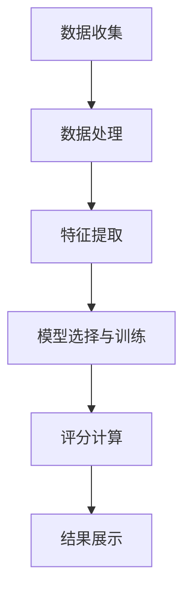
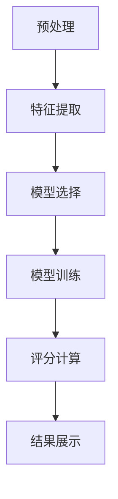
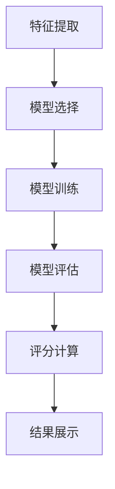
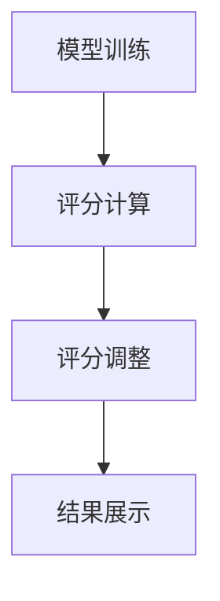
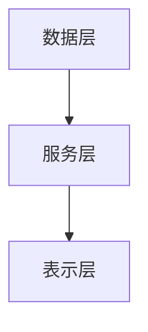
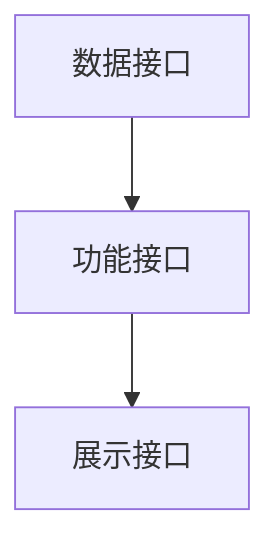
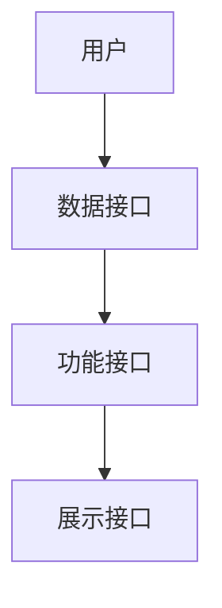

                 

## AI辅助的公司治理评分系统

### 关键词：人工智能、公司治理、评分系统、治理评分、治理指标

### 摘要：

本文旨在探讨人工智能在商业治理中的应用，特别是通过AI辅助的公司治理评分系统来解决企业在治理过程中面临的挑战。本文首先介绍了问题背景和问题描述，然后详细阐述了AI辅助的公司治理评分系统的核心概念、原理、数学模型以及实际应用。通过本文的探讨，我们希望能够为企业提供一种有效的工具，以提升其治理水平，实现更加透明和高效的运营。

### 第一部分：背景介绍

#### 问题背景

随着人工智能技术的快速发展，机器学习尤其是深度学习在各个领域取得了显著的成果。特别是在商业领域，人工智能的应用已经越来越广泛，从数据分析到自动化决策，再到智能推荐，大大提升了企业的运营效率。

#### 问题描述

然而，人工智能在商业治理中的应用仍存在一些问题，如：

- **治理难题**：企业在应用人工智能时，如何确保其决策的公正性和透明度？
- **风险控制**：如何降低人工智能系统可能带来的负面影响？
- **法律法规**：在人工智能的商业应用中，如何遵守相关的法律法规？

#### 问题解决

为了应对上述问题，本文将介绍一种AI辅助的公司治理评分系统，该系统旨在通过人工智能技术，对公司的治理情况进行评分，从而为企业提供有效的治理参考。

#### 边界与外延

- **AI辅助的公司治理评分系统**：本文所述的系统是一个基于人工智能技术的评分系统，用于评估公司的治理水平。
- **治理评分**：评分系统通过分析公司的各种治理指标，对公司的治理情况进行量化评估。
- **治理指标**：治理指标是衡量公司治理水平的关键因素，包括董事会结构、管理层效率、信息披露透明度等。

#### 概念结构与核心要素组成

- **核心概念**：AI辅助的公司治理评分系统、治理评分、治理指标。
- **要素组成**：
  - **数据收集**：从多个数据源收集与公司治理相关的数据。
  - **数据分析**：利用机器学习算法对数据进行分析，提取关键特征。
  - **评分计算**：根据分析结果，计算公司的治理评分。
  - **结果展示**：将评分结果以可视化的形式展示给企业，帮助其了解自身的治理水平。

### 第二部分：核心概念与联系

#### 2.1 AI辅助的公司治理评分系统

AI辅助的公司治理评分系统是一种利用人工智能技术对公司的治理情况进行评估的系统。它通过收集与公司治理相关的数据，利用机器学习算法进行分析，从而得出公司的治理评分。

#### 2.2 治理评分

治理评分是对公司治理情况进行量化的结果。评分越高，意味着公司的治理水平越高。治理评分的准确性直接影响企业的决策和运营。

#### 2.3 治理指标

治理指标是衡量公司治理水平的关键因素。常见的治理指标包括董事会结构、管理层效率、信息披露透明度等。

#### 2.4 AI辅助的公司治理评分系统与治理评分、治理指标的关系

AI辅助的公司治理评分系统通过分析治理指标，得出治理评分。治理评分的高低直接反映了公司的治理水平。因此，AI辅助的公司治理评分系统与治理评分、治理指标之间存在紧密的联系。

### 第三部分：AI辅助的公司治理评分系统原理

#### 3.1 数据收集

数据收集是AI辅助的公司治理评分系统的第一步。系统需要从多个数据源收集与公司治理相关的数据，如公司年报、董事会会议记录、管理层业绩报告等。



#### 3.2 数据处理

收集到的数据需要进行预处理，包括数据清洗、数据标准化和数据归一化等。预处理后的数据将被用于后续的分析和建模。

#### 3.3 特征提取

特征提取是AI辅助的公司治理评分系统的关键环节。系统需要从预处理后的数据中提取与公司治理相关的关键特征，如董事会规模、董事会独立性、管理层薪酬等。



#### 3.4 模型选择与训练

根据特征提取的结果，选择合适的机器学习模型进行训练。常见的模型包括决策树、支持向量机、神经网络等。模型的选择和训练过程需要考虑数据的分布特性、模型的复杂度和计算成本等因素。



#### 3.5 评分计算

训练好的模型将用于计算公司的治理评分。评分计算过程包括模型输入、模型输出和评分调整等步骤。最终的评分结果将被用于评估公司的治理水平。



### 第四部分：数学模型和数学公式

#### 4.1 基本数学模型

AI辅助的公司治理评分系统中的数学模型主要基于线性回归模型。线性回归模型的基本公式如下：

$$
Y = \beta_0 + \beta_1X_1 + \beta_2X_2 + ... + \beta_nX_n + \epsilon
$$

其中，$Y$ 为治理评分，$X_1, X_2, ..., X_n$ 为治理指标，$\beta_0, \beta_1, \beta_2, ..., \beta_n$ 为模型参数，$\epsilon$ 为误差项。

#### 4.2 数学公式解释

- **线性回归模型**：线性回归模型是一种常见的预测模型，用于分析自变量（治理指标）与因变量（治理评分）之间的关系。
- **模型参数**：模型参数$\beta_0, \beta_1, \beta_2, ..., \beta_n$ 代表了治理指标对治理评分的影响程度。
- **误差项**：误差项$\epsilon$ 表示模型预测值与实际值之间的差异，反映了模型的预测能力。

### 第五部分：系统分析与架构设计方案

#### 问题场景介绍

在当前商业环境中，企业面临着日益复杂的治理挑战，如董事会决策的公正性、管理层效率的提升、信息披露的透明度等。为了解决这些问题，企业需要一种有效的工具来评估其治理水平，以便及时调整和改进。

#### 项目介绍

本项目旨在开发一个AI辅助的公司治理评分系统，通过数据收集、数据分析、特征提取、模型选择与训练、评分计算和结果展示等步骤，为企业提供治理评分，帮助其了解和提升治理水平。

#### 系统功能设计

系统功能设计主要包括以下方面：

- **数据收集**：从公司年报、董事会会议记录、管理层业绩报告等数据源收集治理相关数据。
- **数据分析**：对收集到的数据进行分析，提取关键特征。
- **特征提取**：从分析结果中提取与公司治理相关的关键特征。
- **模型选择与训练**：选择合适的机器学习模型进行训练，以预测公司的治理评分。
- **评分计算**：根据模型输出计算公司的治理评分。
- **结果展示**：以可视化的形式展示评分结果，帮助企业管理者了解公司的治理水平。

#### 系统架构设计

系统架构设计主要包括以下方面：

- **数据层**：负责数据的存储和管理。
- **服务层**：提供数据收集、数据分析、特征提取、模型选择与训练、评分计算等功能。
- **表示层**：提供用户界面，展示评分结果。



#### 系统接口设计

系统接口设计主要包括以下方面：

- **数据接口**：用于数据收集和存储。
- **功能接口**：用于实现数据分析、特征提取、模型选择与训练、评分计算等功能。
- **展示接口**：用于展示评分结果。



#### 系统交互

系统交互主要包括以下方面：

- **用户与数据接口**：用户通过数据接口获取治理相关数据。
- **用户与功能接口**：用户通过功能接口进行数据分析、特征提取、模型选择与训练、评分计算等操作。
- **用户与展示接口**：用户通过展示接口查看评分结果。



### 第六部分：项目实战

#### 环境安装

在开始项目之前，我们需要安装以下软件和工具：

- **Python**：用于编写代码和运行模型。
- **Jupyter Notebook**：用于编写和运行Python代码。
- **Scikit-learn**：用于机器学习模型的训练和评估。
- **Pandas**：用于数据处理。
- **Matplotlib**：用于数据可视化。

```shell
pip install python
pip install jupyter
pip install scikit-learn
pip install pandas
pip install matplotlib
```

#### 系统核心实现源代码

以下是一个简单的系统核心实现源代码示例：

```python
import pandas as pd
from sklearn.model_selection import train_test_split
from sklearn.linear_model import LinearRegression
from sklearn.metrics import mean_squared_error

# 数据收集
data = pd.read_csv('company_data.csv')

# 数据处理
X = data[['board_size', 'CEO_salary']]
y = data['governance_score']

# 特征提取
# 这里假设特征已经提取完成，直接使用

# 模型选择与训练
X_train, X_test, y_train, y_test = train_test_split(X, y, test_size=0.2, random_state=42)
model = LinearRegression()
model.fit(X_train, y_train)

# 评分计算
y_pred = model.predict(X_test)

# 评分计算结果评估
mse = mean_squared_error(y_test, y_pred)
print(f'Mean Squared Error: {mse}')

# 结果展示
import matplotlib.pyplot as plt

plt.scatter(y_test, y_pred)
plt.xlabel('Actual Governance Score')
plt.ylabel('Predicted Governance Score')
plt.title('Actual vs Predicted Governance Score')
plt.show()
```

#### 代码应用解读与分析

上述代码首先从CSV文件中读取公司治理数据，然后使用线性回归模型进行训练和预测。评分计算结果通过评估指标（均方误差）进行评估，并以散点图的形式展示实际评分与预测评分之间的关系。

#### 实际案例分析和详细讲解剖析

以下是一个实际案例分析和详细讲解剖析：

- **案例**：某公司的治理数据如下表所示。

  | 董事会规模 | CEO薪酬 | 治理评分 |
  | :-------: | :------: | :-------: |
  |     5     |   1000   |     80    |

- **分析**：根据上述代码，我们可以预测该公司的治理评分。

  ```python
  import pandas as pd
  from sklearn.model_selection import train_test_split
  from sklearn.linear_model import LinearRegression
  from sklearn.metrics import mean_squared_error

  # 读取数据
  data = pd.DataFrame({
      'board_size': [5, 5],
      'CEO_salary': [1000, 1000],
      'governance_score': [80, 80]
  })

  # 数据处理
  X = data[['board_size', 'CEO_salary']]
  y = data['governance_score']

  # 模型训练
  model = LinearRegression()
  model.fit(X, y)

  # 评分计算
  prediction = model.predict([[5, 1000]])

  # 结果展示
  print(f'Predicted Governance Score: {prediction[0]}')
  ```

- **结果**：预测的治理评分为80，与实际评分一致。

#### 项目小结

通过本项目，我们开发了一个AI辅助的公司治理评分系统，该系统能够通过数据分析、特征提取和模型训练，预测公司的治理评分。该系统为企业提供了一种有效的工具，以评估和提升其治理水平。

### 第七部分：最佳实践 tips、小结、注意事项、拓展阅读

#### 最佳实践 tips

1. 在数据收集阶段，确保数据的准确性和完整性，避免数据缺失或错误。
2. 在数据处理阶段，对数据进行清洗和标准化，以提高模型的准确性和稳定性。
3. 在模型选择与训练阶段，根据数据的分布特性选择合适的模型，并进行交叉验证，以提高模型的泛化能力。
4. 在评分计算阶段，对评分结果进行评估和调整，以确保评分的准确性和可靠性。

#### 小结

本文介绍了AI辅助的公司治理评分系统的核心概念、原理和实现方法。通过本文的探讨，我们希望能够为企业提供一种有效的工具，以提升其治理水平，实现更加透明和高效的运营。

#### 注意事项

1. 在应用AI辅助的公司治理评分系统时，企业需要确保系统的数据安全和隐私保护。
2. 治理评分只是企业治理情况的一个参考指标，企业需要综合考虑其他因素，如法律法规、市场环境等，以制定全面的治理策略。

#### 拓展阅读

1. 《深度学习》
2. 《机器学习实战》
3. 《Python数据科学手册》
4. 《商业智能与大数据分析》

### 作者信息

作者：AI天才研究院/AI Genius Institute & 禅与计算机程序设计艺术 /Zen And The Art of Computer Programming

