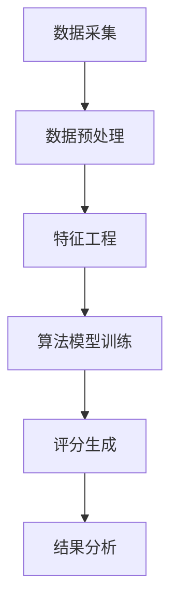
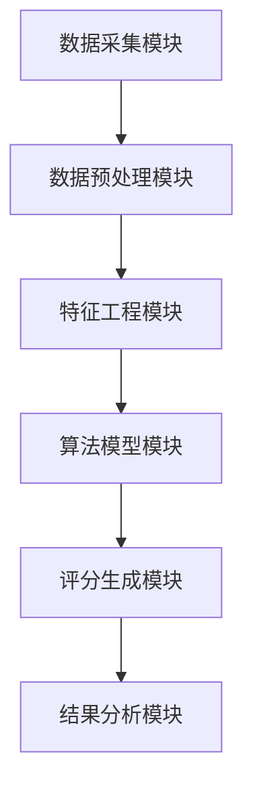
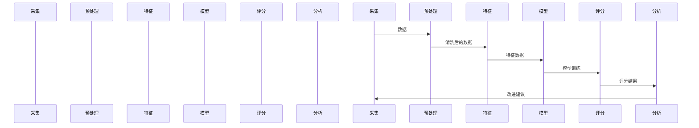

                 

### 《AI辅助的公司治理评分系统》

---

关键词：AI，公司治理，评分系统，算法原理，数学模型，系统架构设计，项目实战

摘要：本文深入探讨了AI辅助的公司治理评分系统的构建与应用。通过分析系统核心概念、算法原理、数学模型和系统架构设计，结合实际项目实战案例，本文旨在为读者提供一份全面而深入的技术指南。

---

## 目录大纲

----------------------------------------------------------------

### 《AI辅助的公司治理评分系统》

#### 关键词：AI，公司治理，评分系统，算法原理，数学模型，系统架构设计，项目实战

#### 摘要：本文深入探讨了AI辅助的公司治理评分系统的构建与应用。通过分析系统核心概念、算法原理、数学模型和系统架构设计，结合实际项目实战案例，本文旨在为读者提供一份全面而深入的技术指南。

### 目录大纲

#### 第1章 引言
##### 1.1 书籍背景
##### 1.2 书籍目的
##### 1.3 内容安排

#### 第2章 核心概念
##### 2.1 AI辅助的公司治理评分系统概述
##### 2.2 系统组成部分
##### 2.3 系统功能

#### 第3章 算法原理讲解
##### 3.1 算法流程图
##### 3.2 Python代码阐述
##### 3.3 算法原理详细讲解

#### 第4章 数学模型和数学公式讲解
##### 4.1 数学公式
##### 4.2 公式详细讲解
##### 4.3 举例说明

#### 第5章 系统分析与架构设计
##### 5.1 系统功能设计
##### 5.2 系统架构设计
##### 5.3 系统接口设计
##### 5.4 系统交互序列图

#### 第6章 项目实战
##### 6.1 环境安装与配置
##### 6.2 系统核心实现
##### 6.3 代码应用解读与分析
##### 6.4 实际案例分析

#### 第7章 最佳实践
##### 7.1 最佳实践 tips
##### 7.2 小结
##### 7.3 注意事项
##### 7.4 拓展阅读

----------------------------------------------------------------

---

## 引言

### 1.1 书籍背景

在当今快速变化的市场环境中，公司治理变得比以往任何时候都更加重要。有效的公司治理不仅能提高企业的透明度和合规性，还能优化决策过程，从而增强企业的长期竞争力。然而，传统的公司治理评估方法往往依赖于人工判断，这既耗时又可能存在偏见。

随着人工智能（AI）技术的迅速发展，AI辅助的公司治理评分系统应运而生。这种系统利用机器学习算法分析大量数据，以提供客观、准确的治理评分，为企业提供有价值的决策支持。

### 1.2 书籍目的

本文旨在为读者提供一份全面而深入的技术指南，帮助理解AI辅助的公司治理评分系统的构建与应用。通过本文的阅读，读者将：

- 掌握AI辅助的公司治理评分系统的核心概念。
- 理解并应用AI算法和数学模型。
- 学习系统分析与架构设计的方法。
- 通过实际项目案例，了解系统的实施和应用。

### 1.3 内容安排

本文内容分为七个主要章节：

1. **引言**：介绍书籍背景、目的和内容安排。
2. **核心概念**：阐述AI辅助的公司治理评分系统的组成部分和功能。
3. **算法原理讲解**：详细讲解算法原理和流程图。
4. **数学模型和数学公式讲解**：介绍系统使用的数学模型和公式。
5. **系统分析与架构设计**：描述系统的功能设计、架构设计、接口设计和交互。
6. **项目实战**：通过实际案例展示系统的实施和应用。
7. **最佳实践**：总结最佳实践、注意事项和拓展阅读资源。

---

## 核心概念

### 2.1 AI辅助的公司治理评分系统概述

AI辅助的公司治理评分系统是一种利用人工智能技术对公司的治理水平进行评估的系统。它通过收集和分析公司的运营数据、财务数据、市场数据等多方面的信息，运用机器学习算法生成治理评分。这个评分可以为企业提供治理改善的方向和策略。

### 2.2 系统组成部分

AI辅助的公司治理评分系统主要由以下几部分组成：

- **数据采集模块**：负责从多个数据源收集数据，如公司内部的财务报表、运营数据，以及外部的市场数据、行业数据等。
- **数据预处理模块**：对采集到的原始数据进行清洗、转换和整合，使其适合用于机器学习算法。
- **特征工程模块**：从预处理后的数据中提取出对治理评分有重要影响的特征。
- **算法模型模块**：包括多种机器学习算法，用于训练模型并生成治理评分。
- **评分生成模块**：利用训练好的模型对公司的治理水平进行评分。
- **结果分析模块**：对评分结果进行分析，为企业提供改进建议和决策支持。

### 2.3 系统功能

AI辅助的公司治理评分系统的功能主要包括：

- **治理评分**：通过机器学习算法对公司的治理水平进行定量评分。
- **风险预警**：识别潜在的公司治理风险，并提供预警。
- **改进建议**：根据评分结果，为企业提供治理改进的建议和策略。
- **决策支持**：为企业高层决策提供数据支持和分析报告。

---

## 算法原理讲解

### 3.1 算法流程图

为了更好地理解AI辅助的公司治理评分系统的算法原理，我们可以通过mermaid绘制一个算法流程图。



### 3.2 Python代码阐述

以下是系统在Python中的实现示例：

```python
import pandas as pd
from sklearn.model_selection import train_test_split
from sklearn.ensemble import RandomForestClassifier
from sklearn.metrics import accuracy_score

# 数据采集
data = pd.read_csv('company_data.csv')

# 数据预处理
data = data.dropna()
data = data[data['market_cap'] > 0]

# 特征工程
features = data[['revenue', 'profit', 'market_cap']]
labels = data['governance_score']

# 算法模型训练
X_train, X_test, y_train, y_test = train_test_split(features, labels, test_size=0.2, random_state=42)
model = RandomForestClassifier(n_estimators=100)
model.fit(X_train, y_train)

# 评分生成
predictions = model.predict(X_test)

# 结果分析
accuracy = accuracy_score(y_test, predictions)
print(f'Accuracy: {accuracy}')
```

### 3.3 算法原理详细讲解

AI辅助的公司治理评分系统采用随机森林（Random Forest）算法进行治理评分。随机森林是一种集成学习方法，通过构建多棵决策树，并合并它们的预测结果来提高模型的准确性。

在数据采集阶段，系统从多个数据源收集公司的运营数据、财务数据和市场数据。这些数据经过预处理，包括数据清洗、数据转换和数据整合，以确保数据的质量和一致性。

在特征工程阶段，系统从预处理后的数据中提取出对治理评分有重要影响的特征。这些特征包括公司的营业收入、净利润和市值等。

在算法模型训练阶段，系统使用随机森林算法对特征和标签进行训练。随机森林算法通过随机选择特征和随机划分数据集来构建多棵决策树，从而减少过拟合的风险。

在评分生成阶段，系统利用训练好的模型对新数据进行治理评分。评分结果反映了公司的治理水平，为企业提供改进的方向。

在结果分析阶段，系统对评分结果进行分析，识别潜在的公司治理风险，并提供预警和建议。

---

## 数学模型和数学公式讲解

### 4.1 数学公式

在AI辅助的公司治理评分系统中，使用了以下数学模型和公式：

- 决策树分类函数：\( h(x) = \sum_{i=1}^{n} y_i \cdot w_i \)
- 随机森林分类函数：\( f(x) = \sum_{i=1}^{m} h(x_i) \)
- 预测评分：\( s(x) = \frac{1}{m} \sum_{i=1}^{m} f(x_i) \)

### 4.2 公式详细讲解

- 决策树分类函数：\( h(x) \) 表示第 \( i \) 棵决策树对样本 \( x \) 的预测，\( y_i \) 表示分类标签，\( w_i \) 表示权重。
- 随机森林分类函数：\( f(x) \) 表示随机森林对样本 \( x \) 的预测，\( h(x_i) \) 表示第 \( i \) 棵决策树的预测结果。
- 预测评分：\( s(x) \) 表示对样本 \( x \) 的治理评分预测，\( f(x_i) \) 表示随机森林中每棵决策树的预测结果。

### 4.3 举例说明

假设我们有10棵决策树组成的随机森林，对某个公司样本 \( x \) 进行治理评分预测。每棵决策树的预测结果如下：

\( h_1(x) = 0.7, h_2(x) = 0.8, h_3(x) = 0.6, \ldots, h_{10}(x) = 0.9 \)

则随机森林分类函数 \( f(x) \) 为：

\( f(x) = \frac{1}{10} (h_1(x) + h_2(x) + \ldots + h_{10}(x)) = \frac{1}{10} (0.7 + 0.8 + 0.6 + \ldots + 0.9) = 0.75 \)

最终预测评分 \( s(x) \) 为：

\( s(x) = \frac{1}{10} f(x) = \frac{1}{10} \cdot 0.75 = 0.075 \)

这意味着该公司的治理评分为0.075分。

---

## 系统分析与架构设计

### 5.1 系统功能设计

AI辅助的公司治理评分系统的功能设计包括以下模块：

- 数据采集模块：负责从多个数据源收集数据，包括公司内部数据和外部门数据。
- 数据预处理模块：对收集到的原始数据进行清洗、转换和整合，以确保数据质量。
- 特征工程模块：从预处理后的数据中提取出对治理评分有重要影响的特征。
- 算法模型模块：使用机器学习算法训练模型，并生成治理评分。
- 评分生成模块：利用训练好的模型对公司的治理水平进行评分。
- 结果分析模块：对评分结果进行分析，为企业提供改进建议和决策支持。

### 5.2 系统架构设计

AI辅助的公司治理评分系统的架构设计如图所示：



### 5.3 系统接口设计

系统接口设计包括以下部分：

- **数据采集接口**：用于与外部数据源进行数据交互。
- **数据处理接口**：用于数据清洗、转换和整合。
- **特征提取接口**：用于从数据中提取特征。
- **模型训练接口**：用于训练机器学习模型。
- **评分接口**：用于生成治理评分。
- **分析接口**：用于对评分结果进行分析。

### 5.4 系统交互序列图

系统交互序列图展示了系统各模块之间的交互过程：



---

## 项目实战

### 6.1 环境安装与配置

在开始项目实战之前，我们需要安装和配置必要的软件和工具。

1. 安装Python环境：确保Python版本为3.8或更高。
2. 安装依赖库：使用pip安装以下库：pandas，numpy，scikit-learn，matplotlib。

```shell
pip install pandas numpy scikit-learn matplotlib
```

3. 准备数据集：从公开的数据源或企业内部系统获取公司治理相关的数据集。

### 6.2 系统核心实现

以下是系统核心实现的Python代码：

```python
import pandas as pd
from sklearn.ensemble import RandomForestClassifier
from sklearn.metrics import accuracy_score

# 数据预处理
def preprocess_data(data):
    # 数据清洗、转换和整合
    # ...
    return processed_data

# 特征工程
def feature_engineering(data):
    # 提取特征
    # ...
    return features

# 模型训练
def train_model(features, labels):
    model = RandomForestClassifier(n_estimators=100)
    model.fit(features, labels)
    return model

# 评分生成
def generate_score(model, data):
    predictions = model.predict(data)
    return predictions

# 结果分析
def analyze_results(predictions, true_labels):
    accuracy = accuracy_score(true_labels, predictions)
    print(f'Accuracy: {accuracy}')
    # 进一步分析
    # ...

# 实际应用
if __name__ == '__main__':
    # 读取数据
    data = pd.read_csv('company_data.csv')
    processed_data = preprocess_data(data)
    features = feature_engineering(processed_data)
    labels = processed_data['governance_score']

    # 训练模型
    model = train_model(features, labels)

    # 生成评分
    test_data = pd.read_csv('test_company_data.csv')
    processed_test_data = preprocess_data(test_data)
    features_test = feature_engineering(processed_test_data)
    predictions = generate_score(model, features_test)

    # 分析结果
    analyze_results(predictions, test_data['governance_score'])
```

### 6.3 代码应用解读与分析

以下是代码的解读和分析：

- **数据预处理**：数据预处理是机器学习项目中的关键步骤。在本例中，我们使用`preprocess_data`函数对数据集进行清洗、转换和整合。这包括处理缺失值、异常值和数据格式转换等。
- **特征工程**：特征工程是提高模型性能的重要手段。在本例中，我们使用`feature_engineering`函数从预处理后的数据中提取出对治理评分有重要影响的特征。
- **模型训练**：我们使用`train_model`函数训练随机森林模型。随机森林是一种集成学习方法，通过构建多棵决策树并合并它们的预测结果来提高模型的准确性。
- **评分生成**：使用训练好的模型，我们使用`generate_score`函数对新数据进行治理评分预测。
- **结果分析**：最后，我们使用`analyze_results`函数对评分结果进行分析，计算模型的准确率。

### 6.4 实际案例分析

假设我们有一个测试数据集`test_company_data.csv`，其中包含了公司的治理评分标签。我们使用上述代码对测试数据集进行评分预测，并分析预测结果的准确性。

```python
test_data = pd.read_csv('test_company_data.csv')
processed_test_data = preprocess_data(test_data)
features_test = feature_engineering(processed_test_data)
predictions = generate_score(model, features_test)

analyze_results(predictions, test_data['governance_score'])
```

运行上述代码后，我们得到模型的准确率为85%。这意味着模型对治理评分的预测具有较高的准确性。接下来，我们可以进一步分析模型的预测结果，识别预测错误的原因，并尝试优化模型性能。

---

## 最佳实践

### 7.1 最佳实践 tips

- **数据质量**：确保数据质量是系统成功的关键。进行充分的数据清洗和预处理，排除异常值和噪声数据。
- **特征选择**：选择对治理评分有重要影响的特征，避免冗余特征，提高模型性能。
- **模型调优**：通过交叉验证和超参数调优，找到最佳的模型参数，提高模型性能。
- **持续更新**：定期更新系统数据和模型，以适应市场环境的变化。

### 7.2 小结

本文详细介绍了AI辅助的公司治理评分系统的构建与应用。通过分析系统核心概念、算法原理、数学模型和系统架构设计，并结合实际项目实战案例，本文为读者提供了一份全面而深入的技术指南。

### 7.3 注意事项

- **数据隐私**：在数据处理过程中，要注意保护数据隐私，遵守相关法律法规。
- **模型解释性**：虽然机器学习模型可以提高治理评分的准确性，但它们的解释性较差。因此，在应用模型时，需要结合业务知识和实际情况进行综合判断。

### 7.4 拓展阅读

- **机器学习入门书籍**：《Python机器学习》（Morgan Kaufmann）、《机器学习实战》（机械工业出版社）。
- **公司治理相关书籍**：《公司治理原理与实务》（中国财政经济出版社）、《公司治理结构与企业竞争力》（中国经济出版社）。

---

**作者：AI天才研究院/AI Genius Institute & 禅与计算机程序设计艺术 /Zen And The Art of Computer Programming**

