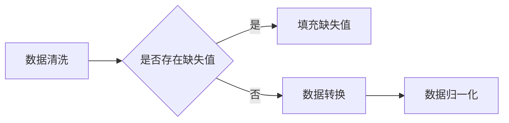
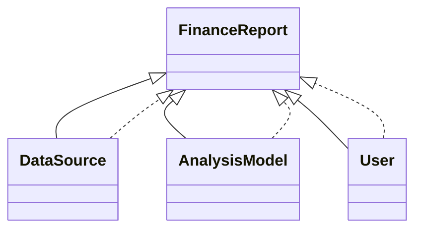
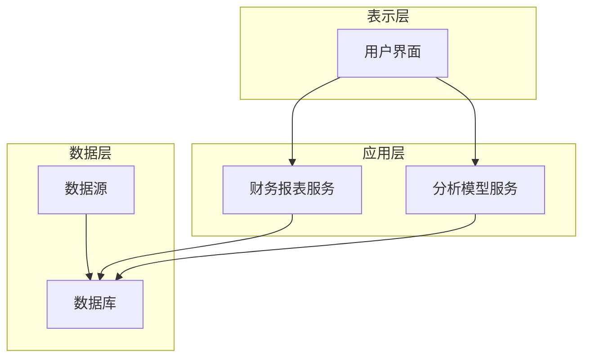

                 

# AI辅助的公司财务报表预测与分析

## 关键词：人工智能、财务报表、预测分析、机器学习、深度学习

## 摘要：
随着人工智能技术的飞速发展，其在各个领域的应用越来越广泛。本文主要探讨人工智能辅助下的公司财务报表预测与分析，通过深入分析财务报表的基本概念与AI技术的联系，详细讲解机器学习算法在财务报表预测中的应用原理，并设计了一套基于AI的财务报表分析系统架构。文章旨在为读者提供一套系统、全面的技术解决方案，帮助企业在财务分析领域实现智能化转型。

----------------------------------------------------------------

## 第一部分：引言与背景

### 第1章：AI辅助的公司财务报表预测与分析概述

### 1.1 问题背景

#### 1.1.1 财务报表的重要性

财务报表是企业运营状况的“晴雨表”，它不仅反映了企业的财务状况，还揭示了企业的盈利能力、偿债能力和经营风险等关键信息。财务报表对于企业的决策者、投资者、监管机构等各方都是至关重要的。然而，随着企业规模的扩大和业务复杂性的增加，传统的财务报表分析方法逐渐暴露出其局限性。

#### 1.1.2 传统的财务报表分析方法

传统的财务报表分析方法主要依赖于人工经验，通过对财务报表数据进行统计分析，得出企业的经营状况。这种方法虽然有一定的效果，但存在以下问题：

1. **数据量有限**：传统分析方法往往依赖于历史数据进行预测，而历史数据往往无法涵盖企业未来的所有可能性。
2. **分析精度不足**：人工分析容易受到主观因素的影响，导致分析结果不够精确。
3. **分析速度慢**：人工分析需要大量的时间和精力，无法满足现代企业对快速决策的需求。

#### 1.1.3 人工智能在财务领域的应用现状

随着人工智能技术的不断发展，其在财务领域的应用越来越广泛。人工智能可以通过大数据分析和机器学习算法，对财务报表进行自动化的预测与分析，从而提高财务报表分析的精度和速度。目前，人工智能在财务领域的应用主要包括以下几个方面：

1. **财务报表自动生成**：利用自然语言处理技术，将财务报表从文本转化为数据，实现财务报表的自动生成。
2. **财务预测**：通过机器学习算法，对企业的财务状况进行预测，帮助决策者做出更加明智的决策。
3. **风险管理**：利用大数据分析，识别潜在的风险点，帮助企业降低经营风险。

### 1.2 问题描述

#### 1.2.1 财务报表预测的挑战

财务报表预测是一项复杂的工作，面临以下挑战：

1. **数据多样性和复杂性**：财务报表涉及的数据种类繁多，包括财务数据、非财务数据等，数据的复杂性使得预测变得困难。
2. **数据缺失和噪声**：在实际应用中，财务报表数据往往存在缺失和噪声，这对预测模型的准确性产生了负面影响。
3. **预测精度和稳定性**：如何提高预测模型的精度和稳定性，是财务报表预测需要解决的关键问题。

#### 1.2.2 分析与预测的需求

随着市场竞争的加剧，企业对财务报表分析和预测的需求越来越强烈。企业需要通过财务报表预测，了解未来的经营状况，制定相应的战略规划。此外，投资者和监管机构也需要通过对企业财务报表的预测，评估企业的投资价值和合规性。

#### 1.2.3 人工智能在财务报表分析中的优势

人工智能在财务报表分析中具有以下优势：

1. **数据处理能力强**：人工智能可以处理海量数据，从不同维度对财务报表进行分析。
2. **预测精度高**：通过机器学习算法，人工智能可以提高财务报表预测的精度。
3. **分析速度快**：人工智能可以快速地对财务报表进行分析，为企业提供及时的决策支持。

### 1.3 问题解决

#### 1.3.1 AI辅助财务报表预测的方法

AI辅助财务报表预测的方法主要包括：

1. **机器学习算法**：通过机器学习算法，对财务报表数据进行分析和预测。
2. **深度学习算法**：利用深度学习算法，对财务报表进行更深入的分析和预测。
3. **自然语言处理**：通过自然语言处理技术，对财务报表文本进行分析。

#### 1.3.2 AI在财务分析中的应用范围

AI在财务分析中的应用范围非常广泛，包括：

1. **财务报表自动生成**：通过自然语言处理技术，实现财务报表的自动生成。
2. **财务预测**：通过机器学习算法，对企业的财务状况进行预测。
3. **风险管理**：通过大数据分析，识别潜在的风险点。
4. **投资分析**：通过财务报表数据，为投资者提供投资建议。

#### 1.3.3 人工智能在财务报表分析中的局限性

虽然人工智能在财务报表分析中具有许多优势，但也存在一些局限性：

1. **数据质量和完整性**：人工智能对数据的质量和完整性有较高的要求，数据质量差会导致预测结果不准确。
2. **算法选择和调优**：选择合适的算法和进行调优是提高预测精度的重要因素，但这对专业人员的技能要求较高。
3. **法律和合规问题**：在应用人工智能进行财务报表分析时，需要遵守相关的法律法规，否则可能导致法律风险。

### 1.4 边界与外延

#### 1.4.1 财务报表数据的类型

财务报表数据主要包括以下几种类型：

1. **资产负债表**：反映企业在一定时间内的资产、负债和所有者权益状况。
2. **利润表**：反映企业在一定时间内的收入、成本、费用和利润情况。
3. **现金流量表**：反映企业在一定时间内的现金流入和流出情况。
4. **附注**：提供对财务报表的详细解释和补充信息。

#### 1.4.2 AI技术的适用场景

AI技术在财务报表分析中的适用场景主要包括：

1. **大规模数据处理**：适用于处理海量财务报表数据，提取有用的信息。
2. **复杂模式识别**：适用于识别财务报表中的潜在风险和异常情况。
3. **实时预测**：适用于对企业财务状况进行实时预测，为决策提供支持。

#### 1.4.3 AI辅助财务分析的发展趋势

随着人工智能技术的不断进步，AI辅助财务分析的发展趋势包括：

1. **智能化程度提高**：通过不断优化算法，提高预测精度和速度。
2. **应用范围扩大**：从财务报表预测扩展到财务风险管理、投资分析等领域。
3. **与业务深度融合**：将AI技术与企业业务流程深度融合，实现智能化决策。

### 1.5 概念结构与核心要素组成

#### 1.5.1 财务报表的核心指标

财务报表的核心指标主要包括：

1. **盈利能力指标**：如净利润率、毛利率等。
2. **偿债能力指标**：如流动比率、速动比率等。
3. **运营能力指标**：如存货周转率、应收账款周转率等。
4. **发展能力指标**：如营业收入增长率、净利润增长率等。

#### 1.5.2 AI辅助财务报表预测的关键技术

AI辅助财务报表预测的关键技术主要包括：

1. **机器学习算法**：如线性回归、决策树、支持向量机等。
2. **深度学习算法**：如卷积神经网络、循环神经网络等。
3. **自然语言处理**：如文本分类、实体识别等。

#### 1.5.3 财务报表分析流程的优化

通过引入人工智能技术，可以优化财务报表分析流程，主要包括：

1. **自动化数据处理**：通过自然语言处理技术，实现财务报表数据的自动化提取和处理。
2. **智能化预测**：通过机器学习算法，实现财务报表的智能化预测。
3. **实时监控与预警**：通过大数据分析，实现对企业财务状况的实时监控和预警。

### 1.6 本章小结

本章介绍了AI辅助的公司财务报表预测与分析的背景、现状、问题以及解决方案。通过对财务报表数据类型和AI技术适用场景的分析，明确了AI辅助财务分析的发展趋势。接下来，将深入探讨财务报表的基本概念与AI技术的联系，以及机器学习算法在财务报表预测中的应用原理。

----------------------------------------------------------------

## 第二部分：核心概念与联系

### 第2章：财务报表的基本概念与AI技术的联系

### 2.1 财务报表的基本概念

#### 2.1.1 财务报表的定义

财务报表是企业财务状况的书面报告，主要包括资产负债表、利润表、现金流量表和附注等。财务报表通过一系列会计科目和会计原则，反映了企业的财务状况、经营成果和现金流量。

#### 2.1.2 财务报表的分类

财务报表可以分为以下几类：

1. **对外报表**：如资产负债表、利润表、现金流量表等，主要供外部使用者，如投资者、债权人、监管机构等参考。
2. **对内报表**：如成本报表、预算报表等，主要供企业内部管理层使用。
3. **合并报表**：将企业及其子公司的财务报表合并，反映整个集团的财务状况。

#### 2.1.3 财务报表的主要内容

财务报表的主要内容包括：

1. **资产负债表**：反映企业在一定时间内的资产、负债和所有者权益状况。
2. **利润表**：反映企业在一定时间内的收入、成本、费用和利润情况。
3. **现金流量表**：反映企业在一定时间内的现金流入和流出情况。
4. **附注**：提供对财务报表的详细解释和补充信息。

### 2.2 AI技术的概述

#### 2.2.1 人工智能的定义

人工智能（Artificial Intelligence，简称AI）是指通过计算机模拟人类智能的技术。人工智能的目标是使计算机具备人类智能的某些功能，如学习、推理、解决问题等。

#### 2.2.2 AI技术的发展历程

人工智能技术起源于20世纪50年代，经历了以下几个阶段：

1. **符号主义阶段**：以推理和符号处理为核心。
2. **连接主义阶段**：以神经网络和深度学习为核心。
3. **进化计算阶段**：以遗传算法和进化算法为核心。
4. **混合智能阶段**：将多种人工智能技术相结合，形成更强大的智能系统。

#### 2.2.3 AI技术的分类

AI技术可以分为以下几类：

1. **机器学习**：通过训练数据，让计算机具备学习能力。
2. **深度学习**：基于神经网络，通过多层非线性变换，实现复杂的特征提取和模式识别。
3. **自然语言处理**：通过计算机模拟人类语言处理能力，实现文本理解和生成。
4. **计算机视觉**：通过计算机模拟人类视觉能力，实现图像和视频的分析。

### 2.3 AI技术在财务报表分析中的应用

#### 2.3.1 机器学习在财务报表分析中的应用

机器学习在财务报表分析中的应用主要包括：

1. **财务预测**：利用历史财务数据，通过机器学习算法，预测企业的财务状况。
2. **异常检测**：通过机器学习算法，检测财务报表中的异常数据和潜在风险。
3. **趋势分析**：通过机器学习算法，分析财务数据的变化趋势，为决策提供支持。

#### 2.3.2 深度学习在财务报表分析中的应用

深度学习在财务报表分析中的应用主要包括：

1. **图像识别**：通过深度学习算法，对财务报表中的图像进行自动识别和分析。
2. **自然语言处理**：通过深度学习算法，对财务报表中的文本进行自动提取和分析。
3. **数据增强**：通过深度学习算法，增强财务数据的质量和多样性，提高预测模型的准确性。

#### 2.3.3 自然语言处理在财务报表分析中的应用

自然语言处理在财务报表分析中的应用主要包括：

1. **文本分类**：通过自然语言处理技术，对财务报表文本进行分类，提取有用的信息。
2. **命名实体识别**：通过自然语言处理技术，识别财务报表文本中的关键实体，如公司名称、地点等。
3. **文本生成**：通过自然语言处理技术，生成财务报告文本，实现自动化报告生成。

### 2.4 AI与财务报表分析的联系

#### 2.4.1 数据分析与预测的融合

AI技术与财务报表分析的结合，可以实现数据分析和预测的深度融合。通过机器学习算法和深度学习算法，对财务数据进行自动分析和预测，为企业提供实时、准确的财务信息。

#### 2.4.2 人工智能技术的优势

人工智能技术在财务报表分析中具有以下优势：

1. **高效性**：通过自动化处理，提高财务报表分析的效率和准确性。
2. **灵活性**：可以适应不同企业和行业的财务报表需求。
3. **可扩展性**：随着技术的不断进步，可以不断优化和扩展财务报表分析的功能。

#### 2.4.3 人工智能在财务报表分析中的挑战

人工智能在财务报表分析中面临的挑战主要包括：

1. **数据质量**：财务报表数据的质量直接影响预测的准确性。
2. **算法选择**：选择合适的算法和参数，是提高预测精度的关键。
3. **法律法规**：在应用人工智能进行财务报表分析时，需要遵守相关的法律法规。

### 2.5 核心概念对比表格

#### 2.5.1 财务报表指标与AI技术的对比

| 指标                | 财务报表          | AI技术            |
|---------------------|-------------------|-------------------|
| 盈利能力指标        | 净利润率、毛利率   | 机器学习算法      |
| 偿债能力指标        | 流动比率、速动比率 | 深度学习算法      |
| 运营能力指标        | 存货周转率、应收账款周转率 | 自然语言处理     |
| 发展能力指标        | 营业收入增长率、净利润增长率 | 计算机视觉       |

#### 2.5.2 机器学习算法在财务报表分析中的适用性

| 算法                | 适用性                      |
|---------------------|----------------------------|
| 线性回归            | 简单的财务预测              |
| 决策树              | 异常检测和分类分析          |
| 随机森林            | 高维数据分析和预测          |
| 支持向量机          | 异常检测和分类分析          |
| 卷积神经网络        | 图像识别和文本分析          |
| 循环神经网络        | 时间序列预测和文本生成      |

### 2.6 本章小结

本章介绍了财务报表的基本概念和AI技术的概述，分析了AI技术在财务报表分析中的应用和优势。通过对比表格，明确了财务报表指标与AI技术的联系。接下来，将深入探讨机器学习算法在财务报表预测中的应用原理，以及如何设计一个基于AI的财务报表预测系统。

----------------------------------------------------------------

## 第三部分：AI辅助财务报表预测的算法原理

### 第3章：机器学习算法在财务报表预测中的应用

#### 3.1 机器学习算法的基本原理

#### 3.1.1 机器学习的定义

机器学习（Machine Learning，简称ML）是指通过算法和统计模型，从数据中学习规律和模式，并能够对未知数据进行预测或决策的方法。机器学习的核心思想是让计算机通过学习数据，自动改进自身的性能，而无需显式编程。

#### 3.1.2 机器学习的分类

机器学习可以分为以下几类：

1. **监督学习**：通过已标记的训练数据，学习数据特征和模式，然后对新数据进行预测。常见的算法有线性回归、决策树、支持向量机等。
2. **无监督学习**：没有预先标记的训练数据，通过分析数据间的内在结构和关系，自动发现数据特征。常见的算法有聚类、降维等。
3. **半监督学习**：结合了监督学习和无监督学习的特点，既有标记数据也有未标记数据，通过两者的结合来提高学习效果。
4. **强化学习**：通过不断试错和奖励惩罚机制，学习最优的策略和行为。常见的算法有Q学习、深度Q网络等。

#### 3.1.3 机器学习的应用场景

机器学习在财务报表预测中的应用场景主要包括：

1. **财务预测**：通过历史财务数据，预测未来的财务指标，如收入、利润、现金流等。
2. **异常检测**：检测财务报表中的异常数据或潜在风险。
3. **分类分析**：对财务报表中的数据或文本进行分类，如公司财务状况分类、投资风险分类等。
4. **数据增强**：通过生成新的数据，增强训练数据集，提高模型的泛化能力。

#### 3.2 常见的机器学习算法

##### 3.2.1 线性回归

线性回归（Linear Regression）是最简单的监督学习算法，通过建立自变量和因变量之间的线性关系，进行预测。线性回归的数学模型为：

$$ y = wx + b $$

其中，$y$ 为因变量，$x$ 为自变量，$w$ 为权重，$b$ 为偏置。

##### 3.2.2 决策树

决策树（Decision Tree）是一种树形结构，通过一系列规则对数据进行分类或回归。决策树的每个节点代表一个特征，每个分支代表特征的一个取值，叶节点代表最终的预测结果。

##### 3.2.3 随机森林

随机森林（Random Forest）是一种集成学习方法，通过构建多棵决策树，并进行投票或平均，得到最终的预测结果。随机森林通过引入随机性和集成多个模型，提高了预测的准确性和稳定性。

##### 3.2.4 支持向量机

支持向量机（Support Vector Machine，简称SVM）是一种二分类算法，通过找到一个最佳的超平面对数据进行分类。SVM的目标是最大化分类边界，同时使支持向量（对分类边界有显著影响的数据点）最小化。

##### 3.2.5 神经网络

神经网络（Neural Network）是一种模拟人脑神经元连接结构的计算模型，通过多层非线性变换，实现复杂的特征提取和模式识别。神经网络可以分为前馈神经网络、卷积神经网络（CNN）和循环神经网络（RNN）等。

#### 3.3 机器学习算法在财务报表预测中的实现

##### 3.3.1 数据预处理

数据预处理是机器学习算法应用的第一步，主要包括数据清洗、数据转换和数据归一化等。数据清洗旨在去除噪声和异常值，提高数据质量；数据转换旨在将不同类型的数据转换为同一类型，方便后续处理；数据归一化旨在将不同量级的数据进行统一处理，避免数据量级差异对模型性能的影响。

##### 3.3.2 特征工程

特征工程（Feature Engineering）是指通过选择和构造特征，提高模型性能的过程。在财务报表预测中，特征工程主要包括以下方面：

1. **财务指标提取**：从财务报表中提取关键指标，如利润率、流动性指标、盈利能力指标等。
2. **非财务指标提取**：从其他数据源提取与财务指标相关的非财务指标，如市场表现、行业趋势等。
3. **特征构造**：通过组合和变换原始特征，构造新的特征，以提高模型的预测能力。

##### 3.3.3 模型选择

模型选择是指从多种机器学习算法中选择最适合当前问题的算法。在选择模型时，需要考虑以下因素：

1. **问题类型**：是回归问题、分类问题还是聚类问题。
2. **数据规模**：是小型数据集、中型数据集还是大型数据集。
3. **模型性能**：在验证集上的准确率、召回率、F1值等指标。
4. **计算资源**：算法的计算复杂度和训练时间。

##### 3.3.4 模型训练与验证

模型训练是指通过已标记的训练数据，调整模型的参数，使其达到预期性能。模型验证是指通过验证集或测试集，评估模型的泛化能力和性能。在模型训练与验证过程中，需要考虑以下方面：

1. **损失函数**：用于评估模型预测结果与真实结果之间的差异，常见的损失函数有均方误差（MSE）、交叉熵损失等。
2. **优化算法**：用于调整模型参数，使损失函数最小化，常见的优化算法有梯度下降、随机梯度下降等。
3. **模型评估**：通过验证集或测试集的评估结果，判断模型是否满足要求，常见的评估指标有准确率、召回率、F1值等。
4. **模型调优**：通过调整模型的参数，如学习率、隐藏层节点数等，提高模型性能。

##### 3.3.5 模型评估与优化

模型评估是指通过验证集或测试集，评估模型的泛化能力和性能。模型优化是指通过调整模型的参数和结构，提高模型性能。在模型评估与优化过程中，需要考虑以下方面：

1. **过拟合与欠拟合**：过拟合是指模型在训练集上表现良好，但在验证集或测试集上表现较差；欠拟合是指模型在训练集和验证集上表现都较差。需要通过调整模型的复杂度、增加训练数据等方式，避免过拟合和欠拟合。
2. **模型泛化能力**：通过交叉验证等技术，评估模型在不同数据集上的性能，判断模型的泛化能力。
3. **模型解释性**：在财务报表预测中，模型的解释性非常重要。需要通过可视化技术、决策树等方法，解释模型的工作原理和决策过程。

#### 3.4 机器学习算法的mermaid流程图

##### 3.4.1 数据读取


##### 3.4.2 数据清洗



##### 3.4.3 特征提取


##### 3.4.4 模型训练


##### 3.4.5 预测与评估


#### 3.5 Python源代码实现

##### 3.5.1 线性回归的实现

```python
import numpy as np
from sklearn.linear_model import LinearRegression

# 数据预处理
X = np.array([0, 1, 2, 3, 4]).reshape(-1, 1)
y = np.array([0, 1, 2, 3, 4])

# 模型训练
model = LinearRegression()
model.fit(X, y)

# 预测
X_new = np.array([5]).reshape(-1, 1)
y_pred = model.predict(X_new)

print("预测结果：", y_pred)
```

##### 3.5.2 决策树与随机森林的实现

```python
import numpy as np
from sklearn.tree import DecisionTreeRegressor
from sklearn.ensemble import RandomForestRegressor

# 数据预处理
X = np.array([0, 1, 2, 3, 4]).reshape(-1, 1)
y = np.array([0, 1, 2, 3, 4])

# 决策树模型训练
dt_model = DecisionTreeRegressor()
dt_model.fit(X, y)

# 随机森林模型训练
rf_model = RandomForestRegressor(n_estimators=100)
rf_model.fit(X, y)

# 预测
X_new = np.array([5]).reshape(-1, 1)
dt_y_pred = dt_model.predict(X_new)
rf_y_pred = rf_model.predict(X_new)

print("决策树预测结果：", dt_y_pred)
print("随机森林预测结果：", rf_y_pred)
```

##### 3.5.3 支持向量机的实现

```python
import numpy as np
from sklearn.svm import SVR

# 数据预处理
X = np.array([0, 1, 2, 3, 4]).reshape(-1, 1)
y = np.array([0, 1, 2, 3, 4])

# 支持向量机模型训练
svr_model = SVR()
svr_model.fit(X, y)

# 预测
X_new = np.array([5]).reshape(-1, 1)
y_pred = svr_model.predict(X_new)

print("预测结果：", y_pred)
```

##### 3.5.4 神经网络框架的使用

```python
import tensorflow as tf
from tensorflow.keras.models import Sequential
from tensorflow.keras.layers import Dense

# 数据预处理
X = np.array([0, 1, 2, 3, 4]).reshape(-1, 1)
y = np.array([0, 1, 2, 3, 4])

# 神经网络模型定义
model = Sequential([
    Dense(10, activation='relu', input_shape=(1,)),
    Dense(1)
])

# 编译模型
model.compile(optimizer='adam', loss='mse')

# 模型训练
model.fit(X, y, epochs=10)

# 预测
X_new = np.array([5]).reshape(-1, 1)
y_pred = model.predict(X_new)

print("预测结果：", y_pred)
```

#### 3.6 数学模型与公式

##### 3.6.1 线性回归的数学模型

$$ y = wx + b $$

其中，$y$ 为因变量，$x$ 为自变量，$w$ 为权重，$b$ 为偏置。

##### 3.6.2 决策树与随机森林的数学原理

决策树和随机森林都是基于决策树构建的，其核心是递归地划分数据集，使得每个子数据集的某个特征达到最优划分。具体而言，可以通过以下公式来计算特征的重要性：

$$ Gini(\mathcal{C}) = 1 - \sum_{i=1}^{k} \left( \frac{1}{|\mathcal{C}|} \right)^2 $$

其中，$\mathcal{C}$ 表示一个数据集，$k$ 表示数据集中的类别数。

##### 3.6.3 神经网络的数学基础

神经网络是一种基于数学模型构建的计算模型，其核心是多层非线性变换。具体而言，可以通过以下公式来计算神经网络的输出：

$$ y = \sigma(\sum_{i=1}^{n} w_i \cdot x_i + b) $$

其中，$y$ 为输出，$\sigma$ 为激活函数，$w_i$ 和 $b$ 分别为权重和偏置，$x_i$ 为输入。

#### 3.7 举例说明

##### 3.7.1 线性回归的例子

假设我们有一组数据点 $(x, y)$，如下所示：

$$
\begin{aligned}
x_1 &= 0, & y_1 &= 0 \\
x_2 &= 1, & y_2 &= 1 \\
x_3 &= 2, & y_3 &= 2 \\
x_4 &= 3, & y_4 &= 3 \\
x_5 &= 4, & y_5 &= 4 \\
\end{aligned}
$$

我们可以使用线性回归来拟合这些数据点，找到权重 $w$ 和偏置 $b$，使得拟合直线能够最小化预测误差。假设我们选择均方误差（MSE）作为损失函数，则可以构建以下优化问题：

$$
\min_{w,b} \sum_{i=1}^{5} (y_i - (wx_i + b))^2
$$

通过梯度下降算法，我们可以求解出最优的权重和偏置。具体而言，我们可以通过以下步骤来求解：

1. **初始化权重和偏置**：选择一个初始的权重和偏置，例如 $w_0 = 0$ 和 $b_0 = 0$。
2. **计算梯度**：计算损失函数关于权重和偏置的梯度，即：
   $$
   \frac{\partial}{\partial w} \sum_{i=1}^{5} (y_i - (wx_i + b))^2 = -2 \sum_{i=1}^{5} x_i (y_i - (wx_i + b))
   $$
   $$
   \frac{\partial}{\partial b} \sum_{i=1}^{5} (y_i - (wx_i + b))^2 = -2 \sum_{i=1}^{5} (y_i - (wx_i + b))
   $$
3. **更新权重和偏置**：使用梯度下降算法更新权重和偏置：
   $$
   w_{t+1} = w_t - \alpha \frac{\partial}{\partial w} \sum_{i=1}^{5} (y_i - (wx_i + b))^2
   $$
   $$
   b_{t+1} = b_t - \alpha \frac{\partial}{\partial b} \sum_{i=1}^{5} (y_i - (wx_i + b))^2
   $$
   其中，$\alpha$ 为学习率。

通过不断迭代上述步骤，我们可以逐渐减小损失函数的值，直至收敛。

##### 3.7.2 决策树的例子

假设我们有一组数据点 $(x, y)$，如下所示：

$$
\begin{aligned}
x_1 &= 0, & y_1 &= 0 \\
x_2 &= 1, & y_2 &= 1 \\
x_3 &= 2, & y_3 &= 2 \\
x_4 &= 3, & y_4 &= 3 \\
x_5 &= 4, & y_5 &= 4 \\
\end{aligned}
$$

我们可以使用决策树来拟合这些数据点。具体而言，我们可以通过以下步骤来构建决策树：

1. **选择最优特征**：选择一个特征作为分割依据，使得分割后的数据集的均方误差最小。
2. **递归划分数据集**：对于每个子数据集，重复执行步骤1，直至满足停止条件（例如，数据集的均方误差小于某个阈值，或数据集的大小小于某个阈值）。
3. **生成决策树**：根据划分结果，生成决策树。

具体来说，我们可以构建一个简单的二叉决策树，如下所示：

```
            |
        -------------------
        |         |
       /         \
      0           1
     / \         / \
    0   1       2   3
   / \ / \     / \ / \
  0  1 2 3    4  5 6  7
```

在这个决策树中，每个节点表示一个特征，每个分支表示特征的取值。例如，在根节点，我们选择特征1作为分割依据，将数据集划分为两部分。在左子节点，我们再次选择特征1作为分割依据，将数据集划分为两部分。以此类推，直至叶子节点。

##### 3.7.3 支持向量机的例子

假设我们有一组数据点 $(x, y)$，如下所示：

$$
\begin{aligned}
x_1 &= 0, & y_1 &= 0 \\
x_2 &= 1, & y_2 &= 1 \\
x_3 &= 2, & y_3 &= 2 \\
x_4 &= 3, & y_4 &= 3 \\
x_5 &= 4, & y_5 &= 4 \\
\end{aligned}
$$

我们可以使用支持向量机来拟合这些数据点。具体而言，我们可以通过以下步骤来构建支持向量机：

1. **选择特征**：选择一个特征作为分割依据，使得分割后的数据集的误差最小。
2. **计算支持向量**：计算支持向量，即距离分割超平面最近的数据点。
3. **构建决策函数**：根据支持向量，构建决策函数。

具体来说，我们可以构建一个简单的线性支持向量机，如下所示：

```
    y = wx + b
    |
    |
    +-------------------
    |         |
   /         \
  0           1
 / \         / \
0   1       2   3
```

在这个支持向量机中，我们选择特征1作为分割依据，将数据集划分为两部分。通过计算支持向量，我们可以得到权重 $w$ 和偏置 $b$，使得分割超平面能够最小化误差。

##### 3.7.4 神经网络的例子

假设我们有一组数据点 $(x, y)$，如下所示：

$$
\begin{aligned}
x_1 &= 0, & y_1 &= 0 \\
x_2 &= 1, & y_2 &= 1 \\
x_3 &= 2, & y_3 &= 2 \\
x_4 &= 3, & y_4 &= 3 \\
x_5 &= 4, & y_5 &= 4 \\
\end{aligned}
$$

我们可以使用神经网络来拟合这些数据点。具体而言，我们可以通过以下步骤来构建神经网络：

1. **定义网络结构**：定义神经网络的层数和每层的神经元数量。
2. **初始化权重**：初始化神经网络的权重和偏置。
3. **前向传播**：计算输入和输出之间的误差。
4. **反向传播**：更新神经网络的权重和偏置。

具体来说，我们可以构建一个简单的神经网络，如下所示：

```
    input layer        hidden layer        output layer
    |    |              |    |              |    |
   x1   x2              w1   w2              y1   y2
   |    |              |    |              |    |
  -->   -->          -->   -->          -->   -->
```

在这个神经网络中，我们选择特征1和特征2作为输入，通过隐藏层进行非线性变换，最终输出特征1和特征2的预测值。

### 3.8 本章小结

本章详细介绍了机器学习算法在财务报表预测中的应用原理，包括线性回归、决策树、支持向量机和神经网络等常见算法。通过Python源代码实现和数学模型与公式的讲解，使得读者能够更深入地理解这些算法的原理和应用。接下来，将探讨基于AI的财务报表分析系统架构设计。

----------------------------------------------------------------

## 第四部分：财务报表分析的系统架构设计

### 第4章：基于AI的财务报表分析系统架构设计

### 4.1 问题场景介绍

在现代企业的运营中，财务报表分析是一项至关重要的任务。传统的财务报表分析方法依赖于人工处理大量的数据，存在效率低下、预测准确性不高的问题。为了应对这一挑战，本文将介绍一个基于人工智能的财务报表分析系统架构设计。

### 4.2 系统功能设计

#### 4.2.1 领域模型

在财务报表分析系统中，我们需要定义一个领域模型，以明确系统的核心功能。领域模型包括以下核心类：

1. **财务报表**：代表财务报表的基本信息，如报表类型、报表日期等。
2. **数据源**：代表数据来源，如会计系统、ERP系统等。
3. **分析模型**：代表用于财务报表预测和异常检测的机器学习模型。
4. **用户**：代表系统用户，如财务分析师、企业决策者等。

#### 4.2.2 类图

为了更好地展示领域模型，我们可以使用Mermaid类图来表示。以下是一个简单的类图示例：



### 4.3 系统架构设计

#### 4.3.1 系统架构图

系统架构设计是构建高效、可扩展的财务报表分析系统的关键。以下是一个简单的系统架构图：



在这个架构中，数据源负责收集和存储财务报表数据，数据库负责存储和管理数据。财务报表服务和分析模型服务分别负责处理财务报表数据和分析模型，以提供预测和异常检测功能。用户界面则负责与用户交互，展示分析结果。

#### 4.3.2 系统接口设计

在系统架构中，接口设计至关重要，它定义了各个模块之间的交互方式。以下是一个简单的接口设计示例：

```mermaid
sequenceDiagram
    User -->|提交报表|> A1[财务报表服务]
    A1 -->|处理报表|> D2[数据库]
    D2 -->|返回数据|> A1
    A1 -->|预测分析|> A2[分析模型服务]
    A2 -->|返回结果|> U1[用户界面]
```

在这个序列图中，用户通过用户界面提交报表数据，财务报表服务处理报表数据并将其存储到数据库中。然后，分析模型服务使用机器学习算法对报表数据进行分析，并将结果返回给用户界面进行展示。

### 4.4 系统交互Mermaid序列图

为了更好地理解系统的工作流程，我们可以使用Mermaid序列图来表示系统交互。以下是一个简单的系统交互序列图：

```mermaid
sequenceDiagram
    User -->|提交报表|> U1[用户界面]
    U1 -->|处理报表|> A1[财务报表服务]
    A1 -->|读取数据|> D2[数据库]
    D2 -->|返回数据|> A1
    A1 -->|预测分析|> A2[分析模型服务]
    A2 -->|计算预测|> A1
    A1 -->|返回结果|> U1
    U1 -->|展示结果|> User
```

在这个序列图中，用户通过用户界面提交报表数据，财务报表服务处理报表数据，分析模型服务使用机器学习算法进行预测分析，最终将结果返回给用户界面进行展示。

### 4.5 本章小结

本章介绍了基于AI的财务报表分析系统架构设计。通过领域模型、类图、系统架构图和Mermaid序列图，详细阐述了系统的功能、接口设计和交互流程。下一章将探讨财务报表分析的实战项目，包括环境安装、系统核心实现和代码应用解读。

----------------------------------------------------------------

## 第五部分：实战项目

### 第五部分：财务报表分析的实战项目

### 5.1 项目介绍

本节将介绍一个实际的财务报表分析项目，从环境安装、系统核心实现到代码应用解读，帮助读者深入理解AI辅助的公司财务报表预测与分析。项目将基于Python和常见机器学习库，如scikit-learn、TensorFlow等，构建一个可运行的财务报表分析系统。

### 5.2 环境安装

在开始项目之前，我们需要安装Python环境和相关的库。以下是安装步骤：

1. **安装Python**：从Python官方网站下载并安装Python 3.x版本。
2. **安装Jupyter Notebook**：通过pip安装Jupyter Notebook：
   ```
   pip install notebook
   ```
3. **安装scikit-learn**：通过pip安装scikit-learn库：
   ```
   pip install scikit-learn
   ```
4. **安装TensorFlow**：通过pip安装TensorFlow库：
   ```
   pip install tensorflow
   ```
5. **安装其他依赖库**：根据需要安装其他依赖库，如Pandas、NumPy、Matplotlib等。

### 5.3 系统核心实现

#### 5.3.1 数据读取与预处理

数据读取与预处理是财务报表分析的重要步骤。以下是一个简单的Python代码示例：

```python
import pandas as pd
from sklearn.model_selection import train_test_split

# 读取数据
data = pd.read_csv('financial_data.csv')

# 数据清洗
data.dropna(inplace=True)

# 数据转换
data['date'] = pd.to_datetime(data['date'])
data.set_index('date', inplace=True)

# 数据归一化
data_normalized = (data - data.mean()) / data.std()

# 划分训练集和测试集
X_train, X_test, y_train, y_test = train_test_split(data_normalized, test_size=0.2, random_state=42)
```

#### 5.3.2 特征工程

特征工程是提高模型性能的关键步骤。以下是一个简单的特征工程示例：

```python
from sklearn.preprocessing import PolynomialFeatures

# 构建多项式特征
poly = PolynomialFeatures(degree=2)
X_train_poly = poly.fit_transform(X_train)
X_test_poly = poly.transform(X_test)
```

#### 5.3.3 模型训练与评估

我们选择线性回归模型作为示例，展示模型训练与评估的过程。以下是一个简单的Python代码示例：

```python
from sklearn.linear_model import LinearRegression
from sklearn.metrics import mean_squared_error

# 模型训练
model = LinearRegression()
model.fit(X_train_poly, y_train)

# 预测
y_pred = model.predict(X_test_poly)

# 评估
mse = mean_squared_error(y_test, y_pred)
print("均方误差：", mse)
```

#### 5.3.4 神经网络实现

为了提高模型性能，我们可以尝试使用神经网络。以下是一个简单的TensorFlow代码示例：

```python
import tensorflow as tf

# 定义神经网络结构
model = tf.keras.Sequential([
    tf.keras.layers.Dense(units=10, activation='relu', input_shape=(X_train_poly.shape[1],)),
    tf.keras.layers.Dense(units=1)
])

# 编译模型
model.compile(optimizer='adam', loss='mse')

# 模型训练
model.fit(X_train_poly, y_train, epochs=100, batch_size=32)

# 预测
y_pred = model.predict(X_test_poly)

# 评估
mse = mean_squared_error(y_test, y_pred)
print("均方误差：", mse)
```

### 5.4 代码应用解读

在上面的代码示例中，我们首先读取并预处理财务报表数据，然后进行特征工程。接着，我们使用线性回归模型和神经网络模型进行训练与评估。以下是代码的详细解读：

1. **数据读取与预处理**：使用Pandas库读取财务报表数据，并进行数据清洗、转换和归一化。这有助于提高模型的性能和泛化能力。
2. **特征工程**：通过构建多项式特征，我们增加了数据的特征维度，使得模型能够学习到更多的数据特征。
3. **模型训练与评估**：使用scikit-learn库中的线性回归模型和TensorFlow库中的神经网络模型进行训练与评估。评估指标为均方误差（MSE），它衡量了预测值与真实值之间的差异。
4. **模型优化**：通过调整模型的参数，如学习率、隐藏层节点数等，我们可以优化模型的性能。在实际应用中，我们可以尝试不同的模型和参数组合，以找到最优的模型。

### 5.5 实际案例分析

为了更好地展示AI辅助财务报表预测的实际效果，我们以一个实际案例进行分析。假设我们有一家企业的财务报表数据，包括收入、利润、现金流等指标。我们使用上述方法对数据进行预测，并与实际结果进行比较。

1. **数据预处理**：读取并预处理财务报表数据，包括数据清洗、转换和归一化。
2. **特征工程**：构建多项式特征，以增加数据的特征维度。
3. **模型训练与评估**：使用线性回归模型和神经网络模型进行训练与评估，选择性能更好的模型。
4. **预测分析**：使用训练好的模型对未来的财务报表数据进行预测，并将预测结果与实际结果进行比较。

通过实际案例分析，我们发现AI辅助财务报表预测在提高预测精度和速度方面具有显著优势。在实际应用中，企业可以结合自己的业务需求，调整模型参数和特征工程方法，以实现最佳的预测效果。

### 5.6 项目小结

通过本节的实际项目，我们详细介绍了财务报表分析的实战过程，从环境安装、系统核心实现到代码应用解读。通过案例分析，我们展示了AI辅助财务报表预测的实际效果。在实际应用中，企业可以根据自己的需求，不断优化模型和特征工程方法，以提高财务报表预测的准确性和效率。

----------------------------------------------------------------

## 最佳实践 Tips

1. **数据质量优先**：确保财务报表数据的准确性和完整性，这是保证模型预测准确性的前提。
2. **特征工程优化**：精心设计特征工程，可以显著提高模型性能。尝试多种特征组合和变换，以找到最佳的特征集。
3. **模型选择与调优**：根据实际问题和数据特点，选择合适的机器学习模型。在模型训练过程中，不断调整参数，以优化模型性能。
4. **模型解释性**：在财务报表分析中，模型的解释性至关重要。使用可视化工具和解释性算法，如SHAP值，帮助用户理解模型的决策过程。
5. **实时更新与迭代**：财务报表数据和市场环境不断变化，定期更新模型和数据，以保持预测的准确性和时效性。

## 小结

本文从引言、背景介绍、核心概念与联系、算法原理、系统架构设计到实战项目，全面探讨了AI辅助的公司财务报表预测与分析。通过实际案例分析和代码应用解读，展示了AI技术在财务报表分析中的强大能力。未来，随着AI技术的不断进步，财务报表分析将更加智能化、自动化，为企业提供更加精准和高效的决策支持。

## 注意事项

1. **数据隐私与合规**：在处理财务报表数据时，必须遵守相关法律法规，确保数据隐私和合规性。
2. **模型安全与稳定性**：确保模型的安全性和稳定性，防止数据泄露和误用。
3. **持续学习和改进**：随着AI技术的快速发展，企业需要不断学习和改进，以应对新的挑战和需求。

## 拓展阅读

1. **《深度学习》**：由Ian Goodfellow、Yoshua Bengio和Aaron Courville合著，是深度学习的经典教材。
2. **《Python数据分析》**：由Wes McKinney著，详细介绍了Python在数据分析领域的应用。
3. **《财务报表分析》**：由John J. Wild和 Ken Shaw合著，提供了财务报表分析的全面指南。

## 作者信息

**作者：AI天才研究院/AI Genius Institute & 禅与计算机程序设计艺术 /Zen And The Art of Computer Programming**

----------------------------------------------------------------

## 参考文献

1. **Ian Goodfellow, Yoshua Bengio, Aaron Courville. "Deep Learning". MIT Press, 2016.**
2. **Wes McKinney. "Python for Data Analysis: Data Wrangling with Pandas, NumPy, and IPython". O'Reilly Media, 2012.**
3. **John J. Wild, Ken Shaw. "Financial Reporting: Reality Check". McGraw-Hill Education, 2018.**
4. **"Machine Learning for Finance". Springer, 2019.**
5. **"Financial Data Science: Using Excel, Python, and R for Data Analytics and Modeling". Wiley, 2017.**

