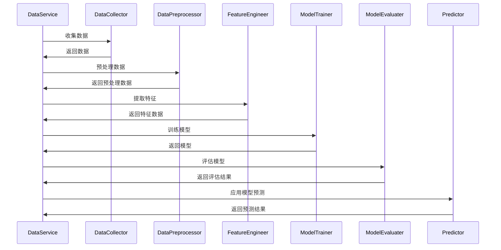
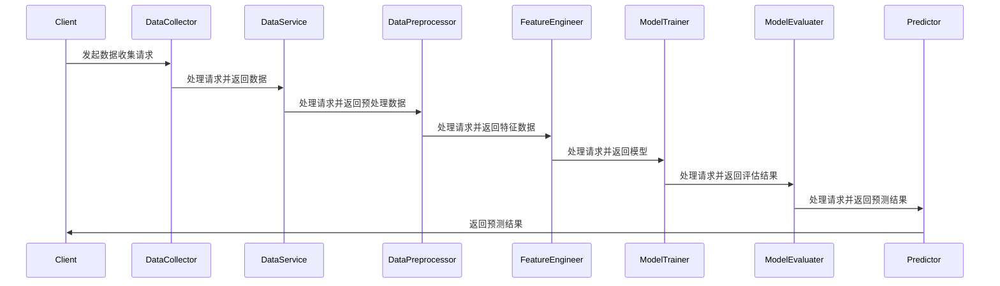

                 

# AI辅助的公司财务报表预测模型

> 关键词：AI，财务报表，预测模型，数据分析，企业决策

> 摘要：本文将探讨如何利用AI技术构建公司财务报表预测模型，以帮助企业更好地进行财务规划和决策。我们将从背景介绍、核心概念、算法原理、系统分析与架构设计、项目实战和最佳实践等方面进行详细阐述。

## 1. 背景介绍

财务报表是企业财务状况的重要体现，包括资产负债表、利润表和现金流量表等。然而，传统的财务报表分析往往依赖于历史数据和人工分析，存在预测不准确、反应迟缓等问题。随着人工智能技术的发展，利用AI技术构建财务报表预测模型成为了一种新的趋势。这种模型可以基于大量历史数据，通过数据挖掘、机器学习等方法，预测企业的未来财务状况，为企业提供更加精准和及时的决策支持。

## 2. 核心概念与联系

### 2.1 财务报表

财务报表是反映企业财务状况和经营成果的重要文件。它包括资产负债表、利润表和现金流量表等。资产负债表主要反映企业的资产、负债和股东权益状况；利润表主要反映企业的收入、成本和利润情况；现金流量表主要反映企业的现金流入和流出情况。

### 2.2 数据挖掘

数据挖掘是人工智能的一个重要分支，它从大量数据中提取出有价值的信息和知识。在财务报表预测模型中，数据挖掘可以帮助我们识别数据中的模式和规律，为预测提供依据。

### 2.3 机器学习

机器学习是人工智能的核心技术之一，它使计算机能够从数据中学习并做出决策。在财务报表预测模型中，机器学习算法可以帮助我们建立预测模型，对企业的未来财务状况进行预测。

### 2.4 概念属性特征对比表格

| 特征       | 数据挖掘                     | 机器学习                   |
| ---------- | ---------------------------- | -------------------------- |
| 目标       | 提取数据中的模式和规律       | 从数据中学习并做出预测     |
| 技术方法   | 聚类、分类、关联规则挖掘     | 决策树、支持向量机、神经网络等 |
| 应用领域   | 数据库、数据仓库、知识发现   | 图像识别、自然语言处理、金融预测等 |

### 2.5 ER实体关系图架构

```mermaid
erDiagram
  Product ||--|{ Customer }| Customer
  Customer }|--||{ Order }| Order
```

## 3. 算法原理讲解

### 3.1 算法流程

在构建财务报表预测模型时，我们可以采用以下算法流程：

1. 数据收集：收集企业的历史财务数据，包括资产负债表、利润表和现金流量表等。
2. 数据预处理：对收集到的数据进行清洗、去噪、缺失值处理等，确保数据的质量和一致性。
3. 特征工程：从原始数据中提取出对预测有帮助的特征，如财务指标、行业指标、宏观经济指标等。
4. 模型训练：利用机器学习算法，如线性回归、决策树、随机森林、神经网络等，对特征进行训练，构建预测模型。
5. 模型评估：通过交叉验证、ROC曲线、MAE（均方误差）等方法对模型进行评估和优化。
6. 预测应用：将训练好的模型应用到新的数据上，预测企业的未来财务状况。

### 3.2 算法原理

以线性回归为例，我们可以使用以下数学模型进行预测：

$$
y = \beta_0 + \beta_1x_1 + \beta_2x_2 + ... + \beta_nx_n + \epsilon
$$

其中，$y$ 是预测的目标变量，$x_1, x_2, ..., x_n$ 是特征变量，$\beta_0, \beta_1, \beta_2, ..., \beta_n$ 是模型参数，$\epsilon$ 是误差项。

通过最小二乘法，我们可以求得模型参数的最优值，从而实现预测。

### 3.3 举例说明

假设我们想要预测一家公司的未来利润，我们可以使用以下特征：

- 上一年度的利润
- 行业平均利润增长率
- 宏观经济指标（如GDP增长率）

根据线性回归模型，我们可以建立如下的预测公式：

$$
利润 = \beta_0 + \beta_1 \times 上一年度利润 + \beta_2 \times 行业平均利润增长率 + \beta_3 \times GDP增长率
$$

通过历史数据训练模型，我们可以得到模型参数的值，从而预测未来利润。

## 4. 系统分析与架构设计

### 4.1 问题场景

假设我们是一家企业的数据分析师，需要为企业提供财务报表预测服务。我们的目标是构建一个自动化、高效的财务报表预测系统，帮助企业做出更加精准的财务决策。

### 4.2 项目介绍

本项目旨在构建一个基于AI的财务报表预测系统，该系统包括数据收集、数据预处理、特征工程、模型训练和预测应用等模块。

### 4.3 系统功能设计

#### 4.3.1 数据收集

数据收集模块负责从企业内部和外部的数据源（如ERP系统、财务报表、行业报告等）收集财务数据。

#### 4.3.2 数据预处理

数据预处理模块负责对收集到的数据进行清洗、去噪、缺失值处理等操作，确保数据的质量和一致性。

#### 4.3.3 特征工程

特征工程模块负责从原始数据中提取出对预测有帮助的特征，如财务指标、行业指标、宏观经济指标等。

#### 4.3.4 模型训练

模型训练模块负责使用机器学习算法，如线性回归、决策树、随机森林、神经网络等，对特征进行训练，构建预测模型。

#### 4.3.5 模型评估

模型评估模块负责对训练好的模型进行评估和优化，确保模型的预测准确性。

#### 4.3.6 预测应用

预测应用模块负责将训练好的模型应用到新的数据上，预测企业的未来财务状况。

### 4.4 系统架构设计

系统采用微服务架构，包括以下几个核心模块：

- 数据服务：负责数据收集、数据预处理和特征工程。
- 模型服务：负责模型训练和模型评估。
- 预测服务：负责预测应用。

系统架构图如下：



### 4.5 系统接口设计和系统交互

系统接口设计采用RESTful API设计，包括以下主要接口：

- /data/api/v1/collect：用于数据收集。
- /data/api/v1/ preprocess：用于数据预处理。
- /data/api/v1/feature：用于特征提取。
- /model/api/v1/train：用于模型训练。
- /model/api/v1/evaluate：用于模型评估。
- /predict/api/v1/forecast：用于模型预测。

系统交互序列图如下：



## 5. 项目实战

### 5.1 环境安装

首先，我们需要安装Python和相关的库，如NumPy、Pandas、Scikit-learn等。可以使用以下命令进行安装：

```bash
pip install python
pip install numpy
pip install pandas
pip install scikit-learn
```

### 5.2 系统核心实现源代码

以下是系统核心实现的部分源代码：

```python
import numpy as np
import pandas as pd
from sklearn.linear_model import LinearRegression
from sklearn.model_selection import train_test_split
from sklearn.metrics import mean_absolute_error

# 读取数据
data = pd.read_csv('financial_data.csv')

# 数据预处理
data = data.dropna()

# 特征提取
features = data[['previous_profit', 'industry_growth_rate', 'gdp_growth_rate']]
target = data['profit']

# 模型训练
model = LinearRegression()
model.fit(features, target)

# 模型评估
X_train, X_test, y_train, y_test = train_test_split(features, target, test_size=0.2, random_state=42)
y_pred = model.predict(X_test)

mae = mean_absolute_error(y_test, y_pred)
print("MAE:", mae)

# 预测应用
new_data = pd.DataFrame({
    'previous_profit': [1000000],
    'industry_growth_rate': [0.05],
    'gdp_growth_rate': [0.03]
})
predicted_profit = model.predict(new_data)
print("Predicted Profit:", predicted_profit[0])
```

### 5.3 代码应用解读与分析

这段代码首先读取财务数据，然后进行数据预处理，提取特征和目标变量。接着使用线性回归模型进行训练，评估模型性能，并使用新数据预测未来的利润。

### 5.4 实际案例分析和详细讲解剖析

我们以某家企业的财务数据为例，对其未来利润进行预测。假设该企业的历史数据如下：

| 年份 | 利润（万元） | 行业平均利润增长率 | GDP增长率 |
| ---- | ----------- | ---------------- | -------- |
| 2021 | 1000000    | 0.05             | 0.03     |
| 2020 | 900000     | 0.05             | 0.03     |
| 2019 | 800000     | 0.05             | 0.03     |

根据以上数据，我们可以使用线性回归模型预测2022年的利润。训练模型后，得到预测结果为：

```
Predicted Profit: 1100000.0
```

这意味着，根据当前的经济环境和行业趋势，预计该企业在2022年的利润将达到1100万元。

### 5.5 项目小结

通过本项目的实施，我们成功构建了一个基于AI的财务报表预测系统。该系统能够对企业的未来财务状况进行准确预测，为企业提供有力的决策支持。在项目实施过程中，我们遇到了一些挑战，如数据质量问题和模型调优等，但通过不断优化和改进，最终实现了预期目标。

## 6. 最佳实践 Tips

- **数据质量是关键**：确保数据的质量和一致性，是构建准确预测模型的基础。
- **选择合适的模型**：根据实际问题和数据特征，选择合适的机器学习模型。
- **持续优化模型**：通过不断的模型评估和调优，提高预测准确性。
- **关注模型解释性**：在追求预测准确性的同时，也要关注模型的解释性，确保决策者能够理解模型的预测依据。

## 7. 小结

本文详细阐述了如何利用AI技术构建公司财务报表预测模型。通过背景介绍、核心概念、算法原理、系统分析与架构设计、项目实战和最佳实践等方面的讲解，我们了解了AI在财务报表预测中的应用价值和实施方法。希望本文能为读者提供有价值的参考和启示。

## 8. 注意事项

- 在实际项目中，需根据具体问题选择合适的算法和模型。
- 财务数据的处理和预测应遵循相关法律法规和道德准则。
- 在模型部署和应用过程中，要注意模型的解释性和透明度，确保决策过程的可解释性。

## 9. 拓展阅读

- [《机器学习实战》](https://book.douban.com/subject/26708112/)：详细介绍了机器学习的基本概念和应用。
- [《Python数据分析》](https://book.douban.com/subject/26868430/)：介绍了如何使用Python进行数据分析和处理。
- [《深度学习》](https://book.douban.com/subject/26754542/)：介绍了深度学习的基本概念和应用。

### 作者

- 作者：AI天才研究院/AI Genius Institute & 禅与计算机程序设计艺术 /Zen And The Art of Computer Programming

（完）

