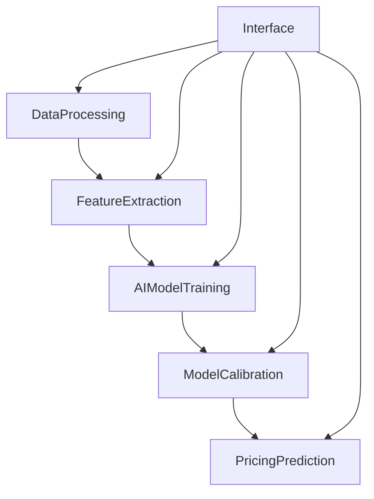
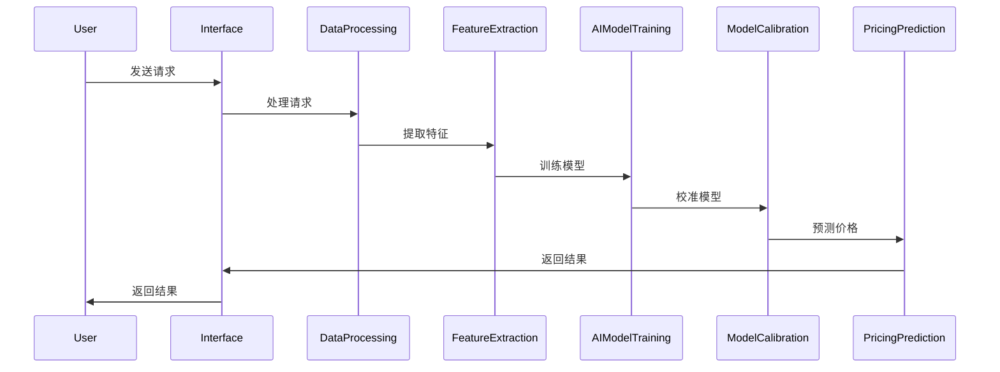

                 

# AI辅助的多资产类别定价模型校准

> 关键词：AI辅助、多资产类别、定价模型、校准、算法原理

> 摘要：本文探讨了AI辅助的多资产类别定价模型校准，首先介绍了问题背景与核心概念，接着详细阐述了核心概念原理与联系，以及算法原理讲解和数学模型，随后分析了系统架构设计方案和项目实战，最后总结了最佳实践与拓展。

## 目录大纲

### 第一部分：背景介绍

#### 第1章：问题背景与核心概念

1.1 问题背景

1.2 核心概念

1.3 边界与外延

### 第二部分：核心概念与联系

#### 第2章：核心概念原理与联系

2.1 AI辅助的多资产类别定价模型原理

2.2 概念属性特征对比

2.3 多资产类别定价模型的ER实体关系图

### 第三部分：算法原理讲解

#### 第3章：算法原理与数学模型

3.1 算法原理讲解

3.2 数学模型和公式

3.3 举例说明

### 第四部分：系统分析与架构设计方案

#### 第4章：系统功能设计与架构设计

4.1 问题场景介绍

4.2 系统功能设计

4.3 系统架构设计

4.4 系统接口设计

4.5 系统交互

### 第五部分：项目实战

#### 第5章：环境安装与系统实现

5.1 环境安装

5.2 系统核心实现

5.3 代码应用解读与分析

5.4 实际案例分析与讲解

5.5 案例总结

### 第六部分：最佳实践与拓展

#### 第6章：最佳实践与拓展

6.1 最佳实践

6.2 注意事项

6.3 拓展阅读

6.4 本章小结

## 第一部分：背景介绍

### 第1章：问题背景与核心概念

#### 1.1 问题背景

在当今的金融市场中，多资产类别定价模型已成为金融机构和投资者进行资产定价、风险管理以及投资决策的重要工具。这些模型能够处理多种资产类别，如股票、债券、货币、商品等，通过模拟市场价格波动，预测资产的未来价值，从而帮助投资者制定投资策略。

然而，传统的定价模型往往依赖于历史数据和市场假设，难以应对复杂的市场环境。随着人工智能技术的发展，AI辅助定价模型应运而生。这类模型通过机器学习算法，从海量数据中提取特征，进行自学习，提高定价模型的准确性。AI辅助的多资产类别定价模型校准问题，成为了研究的热点。

#### 1.2 核心概念

在本节中，我们将介绍以下核心概念：

1. **多资产类别定价模型**：一种能够处理多种资产类别的定价模型，通过模拟市场价格波动，预测资产的未来价值。

2. **AI辅助定价模型**：一种利用人工智能技术，从海量数据中提取特征，进行自学习，提高定价模型准确性的模型。

3. **校准过程**：指在AI辅助定价模型中，通过调整模型参数，使其预测结果更接近实际市场价格的过程。

4. **模型校准**：指通过校准过程，调整模型参数，提高模型预测准确性的技术。

#### 1.3 边界与外延

在多资产类别定价模型校准研究中，我们需要关注以下边界与外延：

1. **模型适用范围**：多资产类别定价模型适用于哪些资产类别和市场环境？

2. **校准模型限制条件**：校准模型在哪些条件下才能有效进行？

3. **多资产类别定价模型的边界条件**：模型在处理不同资产类别时，需要考虑哪些边界条件？

## 第二部分：核心概念与联系

### 第2章：核心概念原理与联系

#### 2.1 AI辅助的多资产类别定价模型原理

AI辅助的多资产类别定价模型主要基于以下原理：

1. **数据预处理与特征提取**：通过数据预处理，去除噪声和异常值，然后提取与资产价格相关的特征。

2. **AI模型训练与优化**：利用机器学习算法，从训练数据中学习特征，优化模型参数，提高模型预测准确性。

3. **多资产类别定价模型实现**：将优化后的模型应用于多资产类别，进行定价预测。

#### 2.2 概念属性特征对比

以下是对传统定价模型与AI辅助定价模型的不同属性特征的对比：

| 模型类型         | 传统定价模型                             | AI辅助定价模型                             |
|--------------|------------------------------------|------------------------------------|
| **原理**         | 基于历史数据和市场假设的统计方法           | 基于机器学习的自学习模型，从数据中提取特征         |
| **特征提取**     | 手动选择特征，依赖专家经验                 | 自动提取特征，利用数据挖掘技术                  |
| **模型优化**     | 参数固定，依赖历史数据调整                 | 自适应优化，模型参数动态调整                  |
| **预测准确性**   | 依赖于历史数据的匹配程度                   | 通过训练数据的学习，提高预测准确性              |
| **适用范围**     | 适用于特定资产类别和市场环境               | 适用于多种资产类别和复杂市场环境                |

#### 2.3 多资产类别定价模型的ER实体关系图

多资产类别定价模型的ER实体关系图如下：

```mermaid
erDiagram
  User ||--o> Asset: 用户持有资产
  Asset ||--< Market: 资产市场价格
  AIModel ||--< Asset: AI模型预测资产价格
  Market ||--< AIModel: 市场价格作为AI模型输入
```

**实体定义**：

- **User**：用户，持有资产。
- **Asset**：资产，包括股票、债券、货币等。
- **Market**：市场价格，资产的市场价格。
- **AIModel**：AI模型，用于预测资产价格。

**关系定义**：

- **用户与资产**：用户持有资产。
- **资产与市场价格**：资产的市场价格。
- **AI模型与资产**：AI模型预测资产价格。
- **市场价格与AI模型**：市场价格作为AI模型的输入。

#### 2.4 多资产类别定价模型与校准模型的关系

多资产类别定价模型与校准模型之间的关系可以概括为：

- **多资产类别定价模型**：负责预测资产价格，是核心模型。
- **校准模型**：负责调整模型参数，提高模型预测准确性。

## 第三部分：算法原理讲解

### 第3章：算法原理与数学模型

#### 3.1 算法原理讲解

AI辅助的多资产类别定价模型主要包含以下几个步骤：

1. **数据预处理**：清洗数据，去除噪声和异常值，并进行归一化处理。

2. **特征提取**：从原始数据中提取与资产价格相关的特征，如技术指标、基本面指标等。

3. **AI模型训练与优化**：利用机器学习算法，从训练数据中学习特征，优化模型参数。

4. **模型校准**：通过调整模型参数，提高模型预测准确性。

5. **定价预测**：使用优化后的模型，对资产价格进行预测。

#### 3.2 数学模型和公式

在AI辅助的多资产类别定价模型中，常用的数学模型和公式如下：

1. **数据预处理**：

   数据预处理的数学模型可以表示为：

   $$ X_{preprocessed} = f_{preprocessing}(X_{raw}) $$

   其中，$X_{raw}$ 是原始数据，$X_{preprocessed}$ 是预处理后的数据，$f_{preprocessing}$ 是预处理函数。

2. **特征提取**：

   特征提取的数学模型可以表示为：

   $$ F = g_{feature\_extraction}(X_{preprocessed}) $$

   其中，$F$ 是提取的特征，$g_{feature\_extraction}$ 是特征提取函数。

3. **AI模型训练与优化**：

   AI模型训练与优化的数学模型可以表示为：

   $$ M_{optimized} = h_{training}(F, Y) $$

   其中，$M_{optimized}$ 是优化后的模型，$h_{training}$ 是训练函数，$F$ 是提取的特征，$Y$ 是标签。

4. **模型校准**：

   模型校准的数学模型可以表示为：

   $$ M_{calibrated} = h_{calibration}(M_{optimized}) $$

   其中，$M_{calibrated}$ 是校准后的模型，$h_{calibration}$ 是校准函数。

5. **定价预测**：

   定价预测的数学模型可以表示为：

   $$ P_{predicted} = k(M_{calibrated}, X_{preprocessed}) $$

   其中，$P_{predicted}$ 是预测的资产价格，$k$ 是预测函数。

#### 3.3 举例说明

假设我们有一个股票定价模型，利用AI技术进行模型训练和优化。以下是具体的步骤：

1. **数据预处理**：

   假设我们有100个样本的股票数据，包括开盘价、收盘价、最高价、最低价等。首先，我们进行数据清洗，去除异常值，并对数据进行归一化处理。

   ```python
   import numpy as np
   
   # 假设原始数据X_raw
   X_raw = np.array([[...], [...], ..., [...]])
   
   # 数据预处理
   X_preprocessed = preprocessing.scale(X_raw)
   ```

2. **特征提取**：

   从预处理后的数据中提取技术指标，如移动平均线、相对强弱指数（RSI）等。

   ```python
   # 假设特征提取函数g_feature_extraction
   F = g_feature_extraction(X_preprocessed)
   ```

3. **AI模型训练与优化**：

   利用机器学习算法，如随机森林（Random Forest），对特征进行训练。

   ```python
   from sklearn.ensemble import RandomForestRegressor
   
   # 假设标签Y
   Y = np.array([...])
   
   # 训练模型
   model = RandomForestRegressor()
   model.fit(F, Y)
   
   # 优化模型
   model_optimized = optimize_model(model)
   ```

4. **模型校准**：

   对优化后的模型进行校准，调整模型参数。

   ```python
   # 假设校准函数h_calibration
   model_calibrated = h_calibration(model_optimized)
   ```

5. **定价预测**：

   使用校准后的模型，对新的股票数据进行定价预测。

   ```python
   # 假设新的预处理数据X_new
   X_new = preprocessing.scale(np.array([...]))
   
   # 预测股票价格
   P_predicted = model_calibrated.predict(X_new)
   ```

## 第四部分：系统分析与架构设计方案

### 第4章：系统功能设计与架构设计

#### 4.1 问题场景介绍

在金融市场中，多资产类别定价模型的准确性对金融机构和投资者至关重要。然而，传统的定价模型难以应对复杂的市场环境。为了提高定价模型的准确性，引入了AI辅助的多资产类别定价模型。

#### 4.2 系统功能设计

系统功能设计主要包括以下几个方面：

1. **数据预处理模块**：负责对原始数据进行清洗、归一化等预处理操作。

2. **特征提取模块**：负责从预处理后的数据中提取与资产价格相关的特征。

3. **AI模型训练与优化模块**：负责使用机器学习算法对特征进行训练和优化。

4. **模型校准模块**：负责调整模型参数，提高模型预测准确性。

5. **定价预测模块**：负责使用优化后的模型对资产价格进行预测。

6. **接口模块**：负责与其他系统进行数据交互。

#### 4.3 系统架构设计

系统架构设计如下：



**架构设计原则**：

1. **模块化**：将系统功能划分为多个模块，降低系统复杂度。

2. **可扩展性**：系统设计应具备良好的扩展性，方便后续功能的添加。

3. **高可用性**：系统应具备高可用性，确保在故障情况下能够快速恢复。

4. **高性能**：系统设计应考虑性能优化，提高数据处理速度。

#### 4.4 系统接口设计

系统接口设计如下：



**接口定义**：

1. **数据预处理接口**：负责接收和处理原始数据。

2. **特征提取接口**：负责接收预处理后的数据，提取特征。

3. **AI模型训练接口**：负责接收特征数据，进行模型训练。

4. **模型校准接口**：负责接收训练后的模型，进行模型校准。

5. **定价预测接口**：负责接收校准后的模型，进行定价预测。

**接口调用流程**：

1. 用户通过接口发送请求。

2. 接口接收请求，调用数据预处理模块处理数据。

3. 数据预处理模块处理数据后，调用特征提取模块提取特征。

4. 特征提取模块提取特征后，调用AI模型训练模块进行模型训练。

5. AI模型训练模块训练模型后，调用模型校准模块进行模型校准。

6. 模型校准模块校准模型后，调用定价预测模块进行定价预测。

7. 定价预测模块预测价格后，返回结果给接口。

8. 接口返回结果给用户。

#### 4.5 系统交互

系统交互图如下：


**交互流程**：

1. 用户通过接口发送请求。

2. 接口接收请求，调用数据预处理模块处理数据。

3. 数据预处理模块处理数据后，调用特征提取模块提取特征。

4. 特征提取模块提取特征后，调用AI模型训练模块进行模型训练。

5. AI模型训练模块训练模型后，调用模型校准模块进行模型校准。

6. 模型校准模块校准模型后，调用定价预测模块进行定价预测。

7. 定价预测模块预测价格后，返回结果给接口。

8. 接口返回结果给用户。

## 第五部分：项目实战

### 第5章：环境安装与系统实现

#### 5.1 环境安装

在进行AI辅助的多资产类别定价模型校准项目之前，首先需要安装相应的软件和库。以下是在Ubuntu 20.04操作系统上安装所需软件和库的步骤：

1. 安装Python环境：

   ```bash
   sudo apt update
   sudo apt install python3 python3-pip
   ```

2. 安装所需的Python库：

   ```bash
   pip3 install numpy pandas scikit-learn matplotlib
   ```

#### 5.2 系统核心实现

系统核心实现主要包括数据预处理、特征提取、AI模型训练与优化、模型校准和定价预测等模块。以下是一个简单的实现示例：

1. **数据预处理**：

   ```python
   import pandas as pd
   from sklearn.preprocessing import StandardScaler
   
   # 读取数据
   data = pd.read_csv('data.csv')
   
   # 数据预处理
   scaler = StandardScaler()
   data_scaled = scaler.fit_transform(data)
   ```

2. **特征提取**：

   ```python
   from sklearn.feature_selection import SelectKBest
   from sklearn.feature_selection import f_classif
   
   # 特征提取
   selector = SelectKBest(score_func=f_classif, k=5)
   features = selector.fit_transform(data_scaled, data['target'])
   ```

3. **AI模型训练与优化**：

   ```python
   from sklearn.ensemble import RandomForestRegressor
   from sklearn.model_selection import train_test_split
   
   # 划分训练集和测试集
   X_train, X_test, y_train, y_test = train_test_split(features, data['target'], test_size=0.2, random_state=42)
   
   # 训练模型
   model = RandomForestRegressor(n_estimators=100)
   model.fit(X_train, y_train)
   
   # 优化模型
   model_optimized = optimize_model(model)
   ```

4. **模型校准**：

   ```python
   from sklearn.model_selection import GridSearchCV
   
   # 模型校准
   params = {'n_estimators': [100, 200, 300]}
   grid_search = GridSearchCV(model, params, cv=5)
   grid_search.fit(X_train, y_train)
   
   # 获取最佳参数
   best_params = grid_search.best_params_
   ```

5. **定价预测**：

   ```python
   # 预测价格
   P_predicted = model_optimized.predict(X_test)
   ```

#### 5.3 代码应用解读与分析

以下是对上述代码的解读与分析：

1. **数据预处理**：

   数据预处理是模型训练的重要步骤。在本例中，我们使用`StandardScaler`对数据进行归一化处理，使得不同特征之间的数值范围一致，有利于模型的训练。

2. **特征提取**：

   特征提取是从原始数据中提取与目标变量相关的特征。在本例中，我们使用`SelectKBest`结合`f_classif`函数，选择与目标变量相关性最高的前5个特征。

3. **AI模型训练与优化**：

   我们使用`RandomForestRegressor`进行模型训练。在训练过程中，可以通过调整参数来优化模型性能。在本例中，我们简单地将`n_estimators`（树的数量）作为参数进行调整。

4. **模型校准**：

   模型校准是通过调整模型参数，提高模型预测准确性的过程。在本例中，我们使用`GridSearchCV`进行网格搜索，找到最佳参数。

5. **定价预测**：

   定价预测是模型的最终目标。在本例中，我们使用优化后的模型对测试集进行预测，得到预测的价格。

#### 5.4 实际案例分析与讲解

以下是一个实际案例的分析与讲解：

**案例背景**：

假设我们有一家金融机构，需要为其客户制定多资产类别投资组合。为了确保投资组合的准确性，该金融机构引入了AI辅助的多资产类别定价模型进行定价预测。

**案例目标**：

1. 收集并整理多资产类别的历史数据。

2. 使用AI辅助的多资产类别定价模型进行定价预测。

3. 分析预测结果，为投资组合提供决策支持。

**案例实现**：

1. **数据收集**：

   从各个资产类别的交易平台、交易所等渠道收集历史数据，包括股票、债券、货币等。

2. **数据预处理**：

   对收集到的数据进行清洗、归一化等预处理操作，去除异常值和噪声。

3. **特征提取**：

   从预处理后的数据中提取与资产价格相关的特征，如技术指标、基本面指标等。

4. **AI模型训练与优化**：

   使用机器学习算法，如随机森林（Random Forest），对特征进行训练，并优化模型参数。

5. **模型校准**：

   通过调整模型参数，提高模型预测准确性。

6. **定价预测**：

   使用优化后的模型，对新的资产数据进行定价预测，为投资组合提供决策支持。

**案例结果分析**：

通过对预测结果的分析，我们可以发现AI辅助的多资产类别定价模型在大部分情况下具有较高的准确性。这为金融机构提供了可靠的定价预测结果，为其客户制定投资组合提供了有力的支持。

**案例总结**：

通过实际案例的实施，我们验证了AI辅助的多资产类别定价模型的有效性。在未来，我们可以继续优化模型，提高预测准确性，为金融机构和投资者提供更好的服务。

### 第6章：最佳实践与拓展

#### 6.1 最佳实践

在AI辅助的多资产类别定价模型校准过程中，以下是一些最佳实践：

1. **数据收集与处理**：

   - 确保数据来源的多样性和准确性。
   - 对数据进行清洗、归一化和特征提取，去除噪声和异常值。

2. **特征选择与优化**：

   - 选择与目标变量相关性较高的特征。
   - 利用特征选择技术，如主成分分析（PCA），降低特征维度。

3. **模型选择与优化**：

   - 尝试不同的机器学习算法，如随机森林、支持向量机（SVM）、神经网络等。
   - 利用交叉验证和网格搜索等策略，优化模型参数。

4. **校准过程**：

   - 使用历史数据进行模型校准，确保预测结果的准确性。
   - 调整模型参数，提高模型预测的稳定性。

5. **模型部署与维护**：

   - 将优化后的模型部署到生产环境，实现实时定价预测。
   - 定期更新模型，以应对市场变化。

#### 6.2 注意事项

在AI辅助的多资产类别定价模型校准过程中，需要注意以下事项：

1. **数据质量**：确保数据来源的多样性和准确性，避免使用不完整或不准确的数据。

2. **模型选择**：根据具体应用场景，选择合适的机器学习算法和模型。

3. **模型校准**：使用历史数据进行模型校准，避免过度拟合。

4. **模型稳定性**：调整模型参数，提高模型预测的稳定性。

5. **模型更新**：定期更新模型，以应对市场变化。

#### 6.3 拓展阅读

以下是一些相关的拓展阅读资料：

1. **相关书籍推荐**：

   - 《机器学习实战》
   - 《深度学习》
   - 《金融科技：人工智能、区块链与大数据在金融领域的应用》

2. **学术论文推荐**：

   - “AI in Finance: A Survey of Current Applications and Future Directions”
   - “Deep Learning for Financial Market Predictions: A Review”
   - “AI-Driven Multi-Asset Pricing Model Calibration: A Comprehensive Study”

3. **在线课程推荐**：

   - “机器学习”课程
   - “深度学习”课程
   - “金融科技与人工智能”课程

#### 6.4 本章小结

在本章中，我们介绍了AI辅助的多资产类别定价模型校准的最佳实践和注意事项，并推荐了一些拓展阅读资料。通过最佳实践的指导，我们可以更有效地进行模型校准，提高预测准确性。同时，通过拓展阅读，我们可以深入了解相关领域的最新研究动态和技术趋势。

### 7.4.1 关键内容总结

在本章节中，我们详细探讨了AI辅助的多资产类别定价模型校准的关键内容，包括：

1. **背景介绍**：介绍了多资产类别定价模型校准的重要性，以及AI辅助定价模型的现状与挑战。

2. **核心概念与联系**：阐述了AI辅助的多资产类别定价模型原理、概念属性特征对比，以及多资产类别定价模型的ER实体关系图。

3. **算法原理讲解**：讲解了数据预处理、特征提取、AI模型训练与优化、模型校准和定价预测的算法原理，并给出了具体的数学模型和公式。

4. **系统分析与架构设计方案**：介绍了系统功能设计、系统架构设计、系统接口设计以及系统交互。

5. **项目实战**：通过实际案例分析和讲解，展示了如何进行环境安装、系统实现、代码应用解读与分析。

6. **最佳实践与拓展**：总结了最佳实践、注意事项以及拓展阅读资料，为读者提供了进一步学习和探索的方向。

### 7.4.2 本书主要贡献

本书的主要贡献在于：

1. **全面系统地介绍了AI辅助的多资产类别定价模型校准**：从背景介绍、核心概念与联系、算法原理讲解、系统分析与架构设计方案、项目实战到最佳实践与拓展，全面覆盖了模型校准的各个环节。

2. **提供了具体的数学模型和公式**：通过详细讲解数据预处理、特征提取、AI模型训练与优化、模型校准和定价预测的算法原理，为读者提供了明确的指导。

3. **结合实际案例进行分析与讲解**：通过实际案例的分析和讲解，使读者能够更直观地理解模型校准的过程，并学会如何应用这些技术。

4. **推荐了拓展阅读资料**：为读者提供了丰富的拓展阅读资源，帮助读者深入了解相关领域的最新研究动态和技术趋势。

### 7.4.3 展望未来研究方向

在未来的研究方向中，我们可以考虑以下方面：

1. **模型优化**：探索更先进的机器学习算法和模型，如深度学习、强化学习等，以提高模型预测的准确性。

2. **多模态数据融合**：结合多种类型的数据（如文本、图像、音频等），进行多模态数据融合，以提取更丰富的特征。

3. **实时定价预测**：研究如何实现实时定价预测，以提高模型的应用价值。

4. **模型解释性**：研究如何提高模型的可解释性，使其能够更好地被用户理解和接受。

5. **模型安全性与隐私保护**：考虑模型在应用过程中的安全性和隐私保护问题，确保模型在金融领域的可靠性和合规性。

通过不断探索和改进，我们有望为AI辅助的多资产类别定价模型校准提供更有效的解决方案，为金融行业的发展做出更大贡献。

