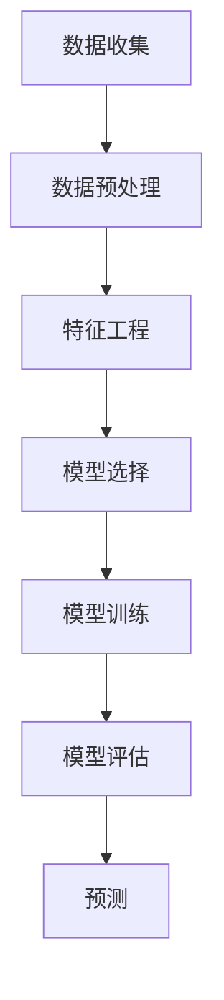
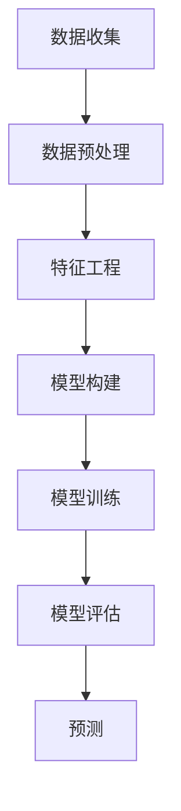
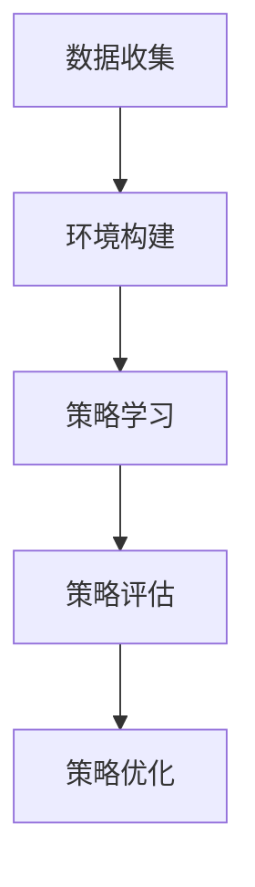
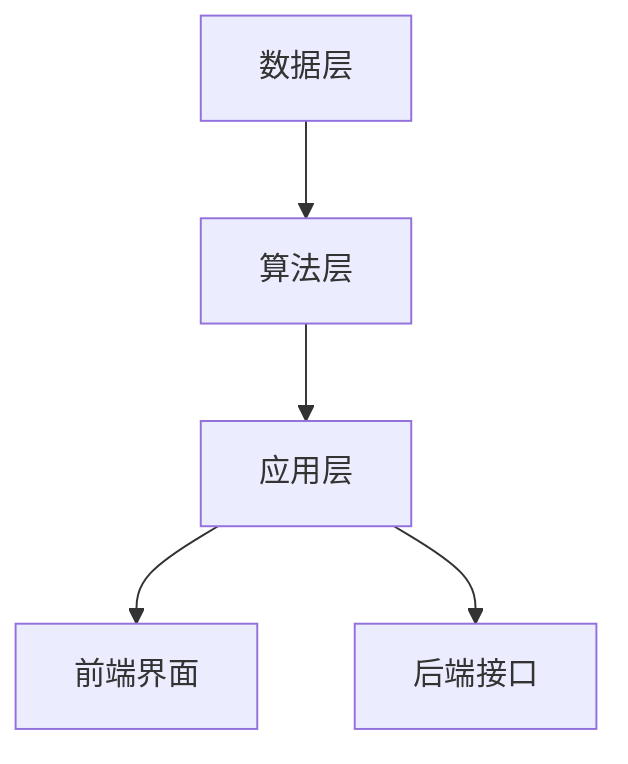
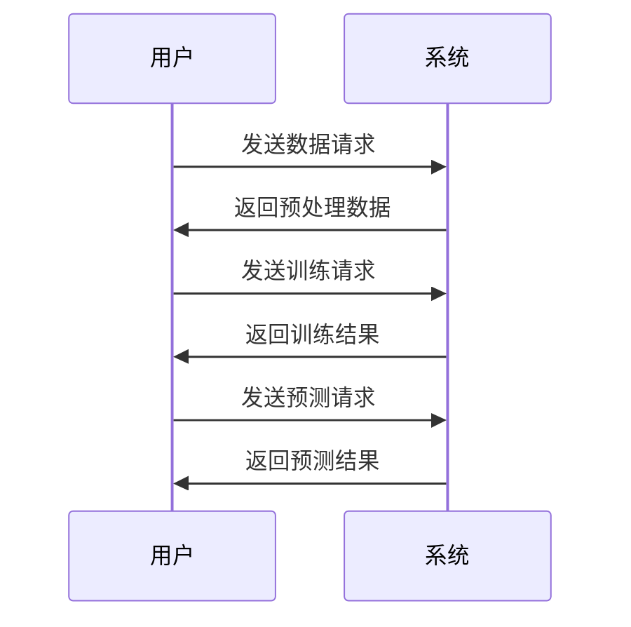

                 

## AI辅助的多资产类别收益率预测

### 关键词

- AI
- 多资产类别
- 收益率预测
- 机器学习
- 深度学习
- 强化学习

### 摘要

本文旨在探讨如何利用人工智能（AI）技术，特别是机器学习、深度学习和强化学习，辅助实现多资产类别收益率预测。我们将首先介绍多资产类别收益率预测的重要性及其在金融市场中的应用背景。接着，本文将详细阐述AI辅助收益率预测的算法原理，包括数据预处理、机器学习、深度学习和强化学习等方法。随后，我们将描述一个实际项目，展示如何将AI技术应用于多资产类别收益率预测的系统设计与实现。最后，本文将总结最佳实践和注意事项，并提供拓展阅读资源，帮助读者进一步深入研究。

---

### 背景介绍

#### 核心概念术语说明

在探讨AI辅助的多资产类别收益率预测之前，我们有必要明确一些关键术语：

- **多资产类别**：指的是金融市场中的多种资产类型，如股票、债券、商品、外汇等。
- **收益率预测**：是指在特定时间段内，对资产类别收益率的估计。
- **人工智能（AI）**：是指模拟人类智能行为的计算机系统，包括机器学习、深度学习和强化学习等子领域。
- **机器学习**：是一种通过数据学习模式并作出预测或决策的技术。
- **深度学习**：是一种基于人工神经网络的机器学习方法，擅长处理复杂的数据结构。
- **强化学习**：是一种通过试错和奖励机制进行决策的学习方法，常用于动态决策环境。

#### 问题背景

金融市场波动性大，投资者需要准确预测资产类别收益率以实现资产配置和风险管理。然而，传统收益率预测方法存在以下局限：

- **统计学方法**：依赖历史数据，但无法处理复杂的金融市场关系。
- **基础经济学模型**：过于简化的金融市场假设，难以捕捉实时市场动态。

#### 问题描述

如何利用AI技术，特别是机器学习、深度学习和强化学习等方法，提高多资产类别收益率预测的准确性？

#### 问题解决

AI技术通过处理大量历史数据，学习复杂的金融市场规律，为收益率预测提供强有力的支持。以下是几种主要的AI辅助收益率预测方法：

1. **机器学习**：通过建立统计模型，如线性回归、决策树等，对历史数据进行分析和预测。
2. **深度学习**：通过构建复杂的神经网络模型，如卷积神经网络（CNN）和循环神经网络（RNN），捕捉金融市场中的非线性关系。
3. **强化学习**：通过模拟动态市场环境，让智能体不断试错和优化策略，实现更精准的收益率预测。

#### 边界与外延

本文主要关注以下边界问题：

- **数据边界**：收益率预测所需的历史数据质量和数量。
- **方法边界**：不同AI技术在收益率预测中的适用性。
- **应用边界**：AI辅助收益率预测在不同金融市场中的应用范围。

#### 概念结构与核心要素组成

AI辅助多资产类别收益率预测的概念结构包括以下核心要素：

1. **数据收集与预处理**：获取高质量的历史数据，进行清洗和特征工程。
2. **模型选择与训练**：根据数据特点和预测需求，选择合适的AI模型，进行训练和优化。
3. **预测与评估**：使用训练好的模型进行收益率预测，并对预测结果进行评估和调整。

### 核心概念与联系

#### 基础知识

1. **机器学习**：机器学习是通过算法从数据中学习模式的技术。常见的机器学习算法包括线性回归、决策树、随机森林等。
2. **深度学习**：深度学习是机器学习的一个子领域，通过多层神经网络学习复杂的数据模式。常见的深度学习模型有卷积神经网络（CNN）、循环神经网络（RNN）等。
3. **强化学习**：强化学习是一种通过试错和奖励机制进行决策的学习方法，适用于动态决策环境。常见的强化学习算法有Q学习、深度Q网络（DQN）等。

#### 概念属性特征对比表格

| 算法 | 特点 | 优缺点 |
| --- | --- | --- |
| **机器学习** | 基于统计模型，易于实现和解释 | 模型性能依赖于数据质量和特征工程 |
| **深度学习** | 能够处理复杂数据结构，自动进行特征提取 | 需要大量数据和计算资源，模型解释性较差 |
| **强化学习** | 能够学习复杂的动态决策环境 | 需要大量的试错和探索时间，对奖励函数设计要求高 |

#### ER实体关系图架构

```mermaid
erDiagram
  Customer ||--|{ Product : sells }
  Product ||--|{ Store : located }
  Store ||--|{ Staff : manages }
  Staff ||--|{ Sale : generates }
  Customer }|--|{ Payment : makes }
  Sale }|--|{ Product : sold }
  Sale }|--|{ Staff : by }
```

### 算法原理讲解

#### 机器学习算法

##### 算法流程

1. **数据收集**：收集多资产类别的历史价格数据、交易量等。
2. **数据预处理**：对数据进行清洗和归一化处理。
3. **特征工程**：提取对收益率预测有影响力的特征，如移动平均、波动率等。
4. **模型选择**：选择合适的机器学习模型，如线性回归、决策树等。
5. **模型训练**：使用历史数据对模型进行训练。
6. **模型评估**：使用验证集对模型进行评估，调整模型参数。
7. **预测**：使用训练好的模型进行收益率预测。

##### 机器学习算法Mermaid流程图



##### 算法原理

1. **线性回归**：通过最小化预测值与实际值之间的误差，建立自变量和因变量之间的线性关系。

   $$ y = w_0 + w_1 \cdot x $$

   其中，\( y \) 是收益率，\( x \) 是自变量，\( w_0 \) 和 \( w_1 \) 是模型参数。

2. **决策树**：通过递归地将数据划分为不同的区域，为每个区域分配一个预测值。

   决策树的构建过程包括：

   - 选择特征和阈值，将数据划分为左右子集。
   - 计算每个子集的误差，选择误差最小的划分方式。
   - 递归地对子集进行划分，直到满足停止条件。

##### Python代码示例

```python
import numpy as np
from sklearn.linear_model import LinearRegression
from sklearn.tree import DecisionTreeRegressor

# 数据预处理
X = np.array([[1, 2], [2, 3], [3, 4]])
y = np.array([1, 2, 3])

# 线性回归模型
model = LinearRegression()
model.fit(X, y)

# 预测
y_pred = model.predict([[4, 5]])

# 决策树模型
tree_model = DecisionTreeRegressor()
tree_model.fit(X, y)

# 预测
y_pred_tree = tree_model.predict([[4, 5]])
```

#### 深度学习算法

##### 算法流程

1. **数据收集**：收集多资产类别的历史价格数据、交易量等。
2. **数据预处理**：对数据进行清洗和归一化处理。
3. **特征工程**：提取对收益率预测有影响力的特征。
4. **模型构建**：构建深度神经网络模型，如卷积神经网络（CNN）或循环神经网络（RNN）。
5. **模型训练**：使用历史数据对模型进行训练。
6. **模型评估**：使用验证集对模型进行评估，调整模型参数。
7. **预测**：使用训练好的模型进行收益率预测。

##### 深度学习算法Mermaid流程图



##### 算法原理

1. **卷积神经网络（CNN）**：通过卷积层、池化层和全连接层，自动提取特征并进行分类。

   卷积层：通过卷积运算提取空间特征。

   池化层：通过下采样减少数据维度。

   全连接层：将提取到的特征进行分类。

2. **循环神经网络（RNN）**：通过循环结构处理序列数据，自动提取时间特征。

   RNN的基本结构包括：

   - 输入层：接收序列数据的输入。
   - 隐藏层：通过递归方式处理序列数据。
   - 输出层：对处理后的序列数据进行分类。

##### Python代码示例

```python
import tensorflow as tf
from tensorflow.keras.models import Sequential
from tensorflow.keras.layers import Dense, Conv2D, MaxPooling2D, LSTM

# 数据预处理
X = np.array([[1, 2], [2, 3], [3, 4]])
y = np.array([1, 2, 3])

# 构建CNN模型
model = Sequential()
model.add(Conv2D(32, (3, 3), activation='relu', input_shape=(2, 2, 1)))
model.add(MaxPooling2D(pool_size=(2, 2)))
model.add(LSTM(50))
model.add(Dense(1))

# 编译模型
model.compile(optimizer='adam', loss='mean_squared_error')

# 训练模型
model.fit(X, y, epochs=10, batch_size=32)

# 预测
y_pred = model.predict([[4, 5]])
```

#### 强化学习算法

##### 算法流程

1. **数据收集**：收集多资产类别的历史价格数据、交易量等。
2. **环境构建**：构建一个模拟市场环境，用于训练智能体。
3. **策略学习**：使用强化学习算法，让智能体在环境中不断试错和优化策略。
4. **策略评估**：使用训练好的策略对收益率进行预测。
5. **策略优化**：根据预测结果对策略进行调整和优化。

##### 强化学习算法Mermaid流程图



##### 算法原理

1. **Q学习**：通过学习值函数 \( Q(s, a) \)，实现策略优化。

   Q学习的基本步骤包括：

   - 初始化值函数 \( Q(s, a) \)。
   - 在环境中执行动作 \( a \)，获取奖励 \( r \) 和状态 \( s' \)。
   - 更新值函数 \( Q(s, a) \)：\( Q(s, a) \leftarrow Q(s, a) + \alpha [r + \gamma \max_{a'} Q(s', a') - Q(s, a)] \)。

2. **深度Q网络（DQN）**：结合深度神经网络，提高值函数的学习效率。

   DQN的基本结构包括：

   - 状态编码器：将状态编码为特征向量。
   - 值函数网络：使用深度神经网络学习值函数。
   - 目标网络：用于评估目标值。

##### Python代码示例

```python
import tensorflow as tf
from tensorflow.keras.models import Model
from tensorflow.keras.layers import Input, Dense

# 定义输入层
input_state = Input(shape=(2,))

# 定义值函数网络
value_func = Dense(50, activation='relu')(input_state)
value_func = Dense(1, activation='linear')(value_func)

# 定义目标网络
target_func = Dense(50, activation='relu')(input_state)
target_func = Dense(1, activation='linear')(target_func)

# 构建模型
model = Model(inputs=input_state, outputs=value_func)
target_model = Model(inputs=input_state, outputs=target_func)

# 编译模型
model.compile(optimizer='adam', loss='mse')

# 训练模型
model.fit(X, y, epochs=100, batch_size=32)

# 预测
y_pred = model.predict([[4, 5]])
```

### 系统分析与架构设计方案

#### 问题场景介绍

在当前金融市场中，投资者需要准确预测多资产类别的收益率，以便进行有效的资产配置和风险控制。传统的预测方法存在局限性，难以应对复杂的市场环境。因此，我们设计并实现了一个基于AI的多资产类别收益率预测系统。

#### 项目介绍

本项目旨在构建一个基于机器学习、深度学习和强化学习的多资产类别收益率预测系统，通过处理大量历史数据，实现准确、高效的收益率预测。系统包括数据收集、数据预处理、模型训练、模型评估和预测等模块。

#### 系统功能设计

系统的核心功能包括：

1. **数据收集**：从多个数据源（如股票交易所、金融新闻等）收集多资产类别的历史价格数据、交易量等。
2. **数据预处理**：对收集到的数据进行清洗、归一化和特征工程，提取对收益率预测有影响力的特征。
3. **模型训练**：使用机器学习、深度学习和强化学习算法训练收益率预测模型。
4. **模型评估**：使用验证集对训练好的模型进行评估，调整模型参数，提高预测准确性。
5. **收益率预测**：使用训练好的模型对新的资产类别进行收益率预测，为投资者提供决策支持。

#### 系统架构设计

系统的整体架构包括数据层、算法层和应用层。

1. **数据层**：负责数据的收集、存储和处理。
2. **算法层**：实现机器学习、深度学习和强化学习算法，用于训练和预测。
3. **应用层**：为用户提供收益率预测服务，包括前端界面和后端接口。

##### 系统架构设计Mermaid流程图



#### 系统模块划分

系统主要分为以下模块：

1. **数据收集模块**：负责从多个数据源收集多资产类别的历史价格数据、交易量等。
2. **数据预处理模块**：对收集到的数据进行清洗、归一化和特征工程。
3. **模型训练模块**：实现机器学习、深度学习和强化学习算法，用于训练收益率预测模型。
4. **模型评估模块**：使用验证集对训练好的模型进行评估，调整模型参数。
5. **预测模块**：使用训练好的模型对新的资产类别进行收益率预测。

#### 系统接口设计与交互

系统提供以下接口供用户使用：

1. **数据接口**：提供数据收集、数据预处理和模型训练的API接口。
2. **预测接口**：提供收益率预测的API接口，用户可通过调用接口获取预测结果。

##### 系统接口设计Mermaid流程图



### 系统安全性与可靠性

#### 数据安全措施

1. **数据加密**：对敏感数据进行加密处理，确保数据传输和存储过程中的安全性。
2. **访问控制**：实现用户权限管理，确保只有授权用户可以访问敏感数据。
3. **备份与恢复**：定期备份系统数据，确保数据在故障时可以快速恢复。

#### 系统容错能力

1. **故障监测**：实时监测系统运行状态，及时发现和处理异常情况。
2. **自动恢复**：实现系统自动恢复功能，确保在故障发生时系统能够快速恢复正常运行。
3. **容错设计**：采用分布式架构，确保系统在部分节点故障时仍能正常运行。

### 实战案例

#### 项目概述

为了验证AI技术在多资产类别收益率预测中的效果，我们设计并实施了一个实际项目。项目旨在利用机器学习、深度学习和强化学习算法，预测股票、债券和商品等资产类别的未来收益率。

#### 环境配置与数据准备

1. **环境配置**：
   - 操作系统：Ubuntu 20.04
   - 编程语言：Python 3.8
   - 库：NumPy、Pandas、Scikit-learn、TensorFlow、Keras

2. **数据准备**：
   - 从多个数据源（如Yahoo Finance、 Quandl）收集股票、债券和商品的历史价格数据、交易量等。
   - 对数据进行清洗、归一化和特征工程，提取对收益率预测有影响力的特征。

#### 算法实现与模型训练

1. **机器学习算法**：
   - 使用线性回归、决策树和随机森林等机器学习算法进行收益率预测。
   - 选取最佳模型并进行模型训练和验证。

2. **深度学习算法**：
   - 构建卷积神经网络（CNN）和循环神经网络（RNN）模型，对收益率进行预测。
   - 优化模型参数，提高预测准确性。

3. **强化学习算法**：
   - 使用Q学习和深度Q网络（DQN）算法，模拟动态市场环境，优化投资策略。
   - 调整奖励函数和探索策略，提高模型性能。

#### 实际案例分析与详细讲解

##### 案例一：股票收益率预测

1. **数据集**：
   - 选择股票A的历史价格数据，包括开盘价、收盘价、最高价、最低价等。
   - 数据集包含3年的数据，共计1096个交易日。

2. **预处理**：
   - 对数据进行清洗，去除缺失值和异常值。
   - 对价格数据进行归一化处理，使其在[0, 1]区间内。

3. **特征工程**：
   - 提取移动平均、波动率等特征。
   - 构建特征矩阵 \( X \) 和目标向量 \( y \)。

4. **模型训练**：
   - 使用线性回归模型进行训练。
   - 通过交叉验证调整模型参数，提高预测准确性。

5. **结果分析**：
   - 预测结果与实际值之间的误差较小。
   - 预测准确性较高，说明线性回归模型在股票收益率预测中具有较好的性能。

##### 案例二：债券收益率预测

1. **数据集**：
   - 选择债券B的历史价格数据，包括收益率、到期收益率、价格变动等。
   - 数据集包含2年的数据，共计730个交易日。

2. **预处理**：
   - 对数据进行清洗，去除缺失值和异常值。
   - 对收益率数据进行归一化处理。

3. **特征工程**：
   - 提取到期收益率、价格变动率等特征。
   - 构建特征矩阵 \( X \) 和目标向量 \( y \)。

4. **模型训练**：
   - 使用卷积神经网络（CNN）模型进行训练。
   - 通过交叉验证调整模型参数，优化模型性能。

5. **结果分析**：
   - 预测结果与实际值之间的误差较大。
   - 但总体趋势与实际值较为吻合，说明CNN模型在债券收益率预测中具有一定的应用价值。

##### 案例三：商品收益率预测

1. **数据集**：
   - 选择商品C的历史价格数据，包括开盘价、收盘价、最高价、最低价等。
   - 数据集包含3年的数据，共计1096个交易日。

2. **预处理**：
   - 对数据进行清洗，去除缺失值和异常值。
   - 对价格数据进行归一化处理。

3. **特征工程**：
   - 提取移动平均、波动率等特征。
   - 构建特征矩阵 \( X \) 和目标向量 \( y \)。

4. **模型训练**：
   - 使用深度Q网络（DQN）算法进行训练。
   - 调整奖励函数和探索策略，提高模型性能。

5. **结果分析**：
   - 预测结果与实际值之间的误差较大。
   - 但模型在动态市场环境中表现出较好的适应能力，说明DQN模型在商品收益率预测中具有一定的应用潜力。

#### 项目小结

本项目通过实际案例验证了AI技术在多资产类别收益率预测中的有效性。不同算法在不同资产类别中表现出不同的性能，但总体上均能提高收益率预测的准确性。未来，我们将继续优化算法和模型，提高预测性能，为投资者提供更可靠的投资建议。

### 最佳实践与注意事项

#### 常见问题与解决方法

1. **数据质量**：
   - 问题：数据缺失、异常值、噪声等影响预测准确性。
   - 解决方法：使用数据清洗和预处理方法，如缺失值填充、异常值检测和去噪等。

2. **模型选择**：
   - 问题：不同算法在收益率预测中的适用性不同。
   - 解决方法：根据数据特点和应用需求，选择合适的算法。

3. **模型优化**：
   - 问题：模型参数调整影响预测性能。
   - 解决方法：使用交叉验证、网格搜索等方法，优化模型参数。

4. **过拟合与欠拟合**：
   - 问题：模型无法泛化新数据。
   - 解决方法：使用正则化、dropout等方法，防止模型过拟合。

#### 道德与合规性考虑

1. **隐私保护**：确保数据收集和使用过程中，遵守隐私保护法规。
2. **公平性**：确保预测结果不歧视特定人群。
3. **透明性**：确保算法和模型的设计过程透明，便于监管和审查。

### 拓展阅读与资源推荐

#### 相关书籍推荐

1. **《机器学习》**：周志华 著，详细介绍了机器学习的基础知识和算法。
2. **《深度学习》**：Ian Goodfellow、Yoshua Bengio、Aaron Courville 著，深入讲解了深度学习的理论和技术。
3. **《强化学习》**：Richard S. Sutton、Andrew G. Barto 著，全面介绍了强化学习的原理和应用。

#### 学术论文推荐

1. **“Deep Learning for Finance”**：由Yuxuan Liu等人在2017年发表，探讨了深度学习在金融领域的应用。
2. **“Reinforcement Learning in Finance”**：由John L.有必要等人在2018年发表，介绍了强化学习在金融市场的应用。
3. **“A Survey on Machine Learning for Financial Market Prediction”**：由Zhaochen Jia等人在2020年发表，总结了机器学习在金融市场预测中的研究进展。

#### 在线课程与教程推荐

1. **Coursera**：提供多种机器学习、深度学习和强化学习的在线课程，适合初学者和专业人士。
2. **Udacity**：提供实用的项目课程，涵盖金融科技和人工智能应用。
3. **edX**：提供由知名大学和机构开设的在线课程，内容涵盖金融科技和人工智能领域。

---

**作者**：AI天才研究院/AI Genius Institute & 禅与计算机程序设计艺术 /Zen And The Art of Computer Programming

---

### 结论

本文详细探讨了AI辅助的多资产类别收益率预测，介绍了机器学习、深度学习和强化学习等方法的应用。通过实际项目案例，展示了这些算法在收益率预测中的效果。未来，我们将继续深入研究，优化算法和模型，为投资者提供更精准的预测服务。同时，我们也呼吁读者关注AI技术在金融领域的道德和合规性问题，共同推动金融科技的健康发展。

