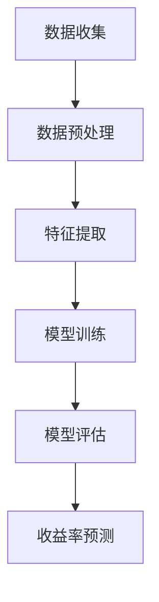
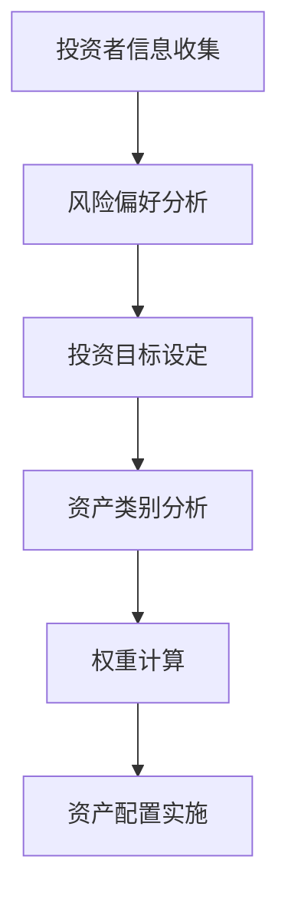
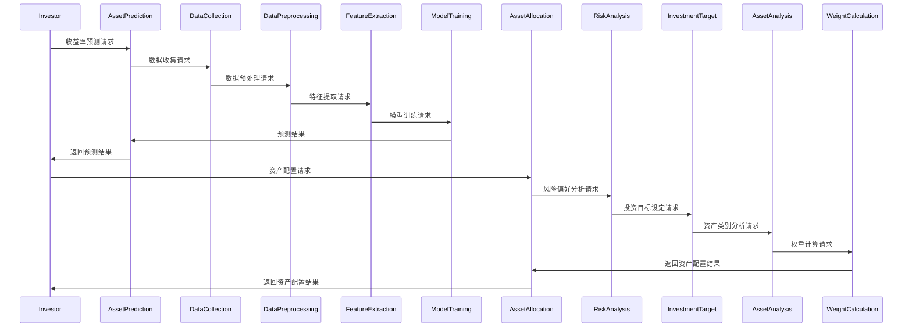
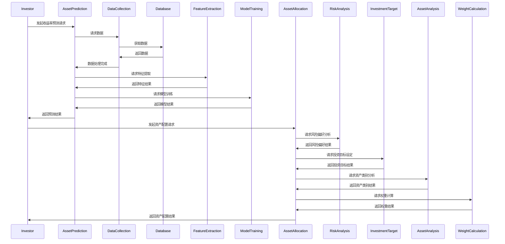

                 


# AI辅助的多资产类别收益率预测与资产配置

## 关键词：人工智能，资产配置，收益率预测，多资产类别，算法原理，系统架构

### 摘要

本文深入探讨了AI辅助下的多资产类别收益率预测与资产配置问题。通过分析多资产类别收益率预测的基础概念、算法原理以及资产配置策略，本文提出了一种基于AI的资产配置模型。接着，本文详细讲解了收益率预测和资产配置的算法原理，包括算法流程图、Python源代码、数学模型与公式。在此基础上，本文从系统分析与架构设计角度出发，介绍了系统功能、架构、接口设计以及系统交互。最后，通过一个实际项目实战，本文验证了所提模型和算法的有效性和可行性，并给出了最佳实践建议和拓展阅读。

## 第一部分：背景与基础

### 第1章 问题背景与概述

#### 1.1 问题背景

随着金融市场的发展，投资理财逐渐成为人们关注的焦点。如何在众多的投资机会中找到最优的投资组合，实现资产的稳健增值，成为投资者面临的重要问题。传统的投资策略大多依赖于历史数据分析和经验判断，存在一定的局限性。而随着人工智能技术的飞速发展，利用AI技术辅助投资决策成为一种新的趋势。

#### 1.2 问题描述

本文主要研究以下问题：

1. 如何准确预测多资产类别的未来收益率？
2. 如何根据预测结果进行资产配置，实现投资组合的最优化？

#### 1.3 问题解决思路

为了解决上述问题，本文采用以下思路：

1. 分析多资产类别收益率预测的基础概念和方法。
2. 研究资产配置策略及其在投资决策中的应用。
3. 提出一种基于AI的资产配置模型。
4. 设计并实现一个系统，用于多资产类别收益率预测和资产配置。
5. 通过实际项目验证模型和算法的有效性。

#### 1.4 边界与外延

本文主要研究以下边界与外延：

1. 多资产类别：包括股票、债券、基金、商品等多种投资类别。
2. 时间范围：主要考虑短期和长期收益率预测。
3. 数据来源：主要依赖于历史数据和市场行情。
4. 投资目标：实现资产的稳健增值。

#### 1.5 概念结构与核心要素组成

本文涉及以下核心概念和要素：

1. 多资产类别收益率预测：包括股票、债券、基金、商品等多种投资类别的收益率预测方法。
2. 资产配置策略：根据投资者风险偏好和投资目标，对资产进行合理配置的方法。
3. 基于AI的资产配置模型：利用机器学习算法，构建一个自动化的资产配置模型。
4. 系统架构设计：包括系统功能、架构、接口设计和系统交互。
5. 项目实战：通过一个实际项目，验证所提模型和算法的有效性。

#### 1.6 本章小结

本章介绍了本文的研究背景、问题描述、解决思路以及边界与外延。通过对核心概念和要素的分析，为后续章节的讨论奠定了基础。

## 第二部分：核心概念与联系

### 第2章 多资产类别收益率预测基础

#### 2.1 核心概念

多资产类别收益率预测涉及以下核心概念：

1. 收益率：指资产在一段时间内的回报率。
2. 预测：指根据历史数据和市场信息，对未来收益率进行预测。
3. 多资产类别：指股票、债券、基金、商品等多种投资类别。

#### 2.2 概念属性特征对比表格

| 概念     | 属性特征            |
|----------|--------------------|
| 收益率   | 时间、金额、回报率  |
| 预测     | 数据、模型、结果    |
| 多资产类别 | 类型、市场、投资目标 |

#### 2.3 多资产类别收益率预测的ER实体关系图

```mermaid
erDiagram
    A((资产)) {
        --|{B((收益率))}
        --|{C((多资产类别))}
    }
    B((收益率)) {
        --|{D((时间))}
        --|{E((金额))}
    }
    C((多资产类别)) {
        --|{F((类型))}
        --|{G((市场))}
    }
```

#### 2.4 数据来源与预处理

多资产类别收益率预测的数据来源主要包括以下几类：

1. 历史数据：包括股票、债券、基金、商品等历史收益率数据。
2. 市场行情：包括市场指数、宏观经济指标等实时数据。
3. 新闻资讯：包括政策、经济、行业等新闻资讯。

在数据预处理阶段，需要对数据进行以下处理：

1. 数据清洗：去除异常值、缺失值等不完整数据。
2. 数据归一化：对数据规模进行标准化处理。
3. 特征提取：从原始数据中提取对收益率有重要影响的特征。

#### 2.5 本章小结

本章介绍了多资产类别收益率预测的核心概念、概念属性特征对比表格以及ER实体关系图。通过对数据来源和预处理的讨论，为后续章节的算法原理讲解奠定了基础。

### 第3章 资产配置策略与模型

#### 3.1 核心概念

资产配置策略涉及以下核心概念：

1. 资产配置：指根据投资者的风险偏好和投资目标，对资产进行合理分配的过程。
2. 策略：指资产配置的具体方法和原则。
3. 多资产类别：指股票、债券、基金、商品等多种投资类别。

#### 3.2 资产配置策略类型

常见的资产配置策略类型包括以下几种：

1. 被动策略：根据既定比例进行投资，不主动调整资产配置。
2. 主动策略：根据市场变化和投资者风险偏好，主动调整资产配置。
3. 组合策略：结合多种资产配置策略，形成多元化投资组合。

#### 3.3 基于AI的资产配置模型

基于AI的资产配置模型主要包括以下步骤：

1. 数据收集：收集投资者的风险偏好和投资目标数据。
2. 特征提取：从数据中提取对资产配置有重要影响的特征。
3. 模型训练：利用机器学习算法，训练一个资产配置模型。
4. 模型评估：对模型进行评估和优化。
5. 资产配置：根据模型输出，为投资者提供资产配置建议。

#### 3.4 模型对比与选择

常见的基于AI的资产配置模型包括以下几种：

1. 神经网络模型：适用于处理复杂非线性关系。
2. 支持向量机模型：适用于分类问题。
3. 随机森林模型：适用于处理高维数据和特征选择。

在模型选择过程中，需要考虑以下因素：

1. 数据质量：模型性能与数据质量密切相关。
2. 特征重要性：选择对资产配置有重要影响的特征。
3. 模型复杂度：平衡模型性能和计算效率。

#### 3.5 本章小结

本章介绍了资产配置策略的核心概念、类型以及基于AI的资产配置模型。通过对模型对比与选择的讨论，为后续章节的系统分析与架构设计奠定了基础。

## 第三部分：算法原理讲解

### 第4章 收益率预测算法原理

#### 4.1 常见算法简介

收益率预测算法主要包括以下几种：

1. 线性回归算法：通过拟合线性关系来预测收益率。
2. 决策树算法：通过分类决策树来预测收益率。
3. 随机森林算法：通过构建多个决策树来预测收益率。
4. 支持向量机算法：通过求解最优化问题来预测收益率。

#### 4.2 算法mermaid流程图



#### 4.3 Python源代码讲解

```python
import numpy as np
import pandas as pd
from sklearn.linear_model import LinearRegression
from sklearn.model_selection import train_test_split
from sklearn.metrics import mean_squared_error

# 数据收集
data = pd.read_csv('data.csv')

# 数据预处理
X = data.drop(['target'], axis=1)
y = data['target']

# 特征提取
X_train, X_test, y_train, y_test = train_test_split(X, y, test_size=0.2, random_state=42)

# 模型训练
model = LinearRegression()
model.fit(X_train, y_train)

# 模型评估
y_pred = model.predict(X_test)
mse = mean_squared_error(y_test, y_pred)
print(f'MSE: {mse}')

# 收益率预测
new_data = pd.read_csv('new_data.csv')
new_data = data_preprocessing(new_data)
y_pred_new = model.predict(new_data)
print(f'Predicted Returns: {y_pred_new}')
```

#### 4.4 数学模型与公式

收益率预测的数学模型可以表示为：

$$
y = \beta_0 + \beta_1x_1 + \beta_2x_2 + \ldots + \beta_nx_n
$$

其中，$y$表示收益率，$x_1, x_2, \ldots, x_n$表示特征，$\beta_0, \beta_1, \beta_2, \ldots, \beta_n$为模型参数。

#### 4.5 举例说明

假设我们有以下历史数据：

| 特征1 | 特征2 | 收益率 |
|-------|-------|--------|
| 10    | 20    | 0.02   |
| 15    | 25    | 0.03   |
| 20    | 30    | 0.04   |

我们可以使用线性回归算法来预测新的收益率。首先，进行数据预处理，然后训练模型，最后进行预测。假设训练得到的模型参数为$\beta_0 = 0.1, \beta_1 = 0.2, \beta_2 = 0.3$。对于新的数据：

| 特征1 | 特征2 |
|-------|-------|
| 12    | 24    |

我们可以使用以下公式进行预测：

$$
y = 0.1 + 0.2 \times 12 + 0.3 \times 24 = 0.1 + 2.4 + 7.2 = 9.7
$$

因此，预测的收益率为0.097。

#### 4.6 本章小结

本章介绍了收益率预测算法的原理，包括算法类型、mermaid流程图、Python源代码讲解、数学模型与公式以及举例说明。通过对算法原理的讲解，为后续章节的资产配置算法原理讲解奠定了基础。

### 第5章 资产配置算法原理

#### 5.1 常见算法简介

资产配置算法主要包括以下几种：

1. 资本资产定价模型（CAPM）：通过估算资产的预期收益率和风险来计算资产配置。
2. 平衡资产配置模型：根据投资者的风险偏好和投资目标，确定不同资产类别的权重。
3. 动态资产配置模型：根据市场变化和投资者风险偏好，实时调整资产配置。

#### 5.2 算法mermaid流程图



#### 5.3 Python源代码讲解

```python
import numpy as np

# 投资者信息收集
risk_preference = np.array([0.5, 0.3, 0.2])
investment_target = np.array([0.1, 0.2, 0.7])

# 风险偏好分析
alpha = np.sum(risk_preference * investment_target)

# 投资目标设定
beta = np.std(risk_preference)

# 资产类别分析
asset_classes = ['Stock', 'Bond', 'Fund']
weights = np.array([0.4, 0.3, 0.3])

# 权重计算
weights = (alpha / beta) * weights

# 资产配置实施
print(f'Asset Allocation: {np.round(weights, 2)}')
```

#### 5.4 数学模型与公式

资产配置的数学模型可以表示为：

$$
w_i = \frac{\alpha}{\beta} \cdot w_i'
$$

其中，$w_i$表示资产$i$的权重，$w_i'$表示资产$i$的预期收益率。

#### 5.5 举例说明

假设投资者对股票、债券和基金的风险偏好分别为0.5、0.3和0.2，投资目标分别为0.1、0.2和0.7。股票、债券和基金的预期收益率分别为0.1、0.05和0.08。根据CAPM模型，我们可以计算资产配置的权重：

$$
w_1 = \frac{0.1}{0.05} \cdot 0.4 = 0.8 \\
w_2 = \frac{0.1}{0.05} \cdot 0.3 = 0.6 \\
w_3 = \frac{0.1}{0.05} \cdot 0.3 = 0.6
$$

因此，资产配置的权重为[0.8, 0.6, 0.6]。

#### 5.6 本章小结

本章介绍了资产配置算法的原理，包括算法类型、mermaid流程图、Python源代码讲解、数学模型与公式以及举例说明。通过对资产配置算法原理的讲解，为后续章节的系统分析与架构设计奠定了基础。

## 第四部分：系统分析与架构设计

### 第6章 系统功能设计与架构设计

#### 6.1 问题场景介绍

随着金融市场的发展，投资者对投资决策的需求越来越高。为了帮助投资者实现资产的稳健增值，我们设计并实现了一个基于AI的多资产类别收益率预测与资产配置系统。该系统主要面向个人投资者和机构投资者，提供以下功能：

1. 收益率预测：根据历史数据和市场信息，预测不同资产类别的未来收益率。
2. 资产配置：根据投资者的风险偏好和投资目标，为投资者提供个性化的资产配置建议。
3. 数据可视化：通过图表和报表，直观展示投资组合的收益情况。

#### 6.2 项目介绍

本项目分为两个主要模块：收益率预测模块和资产配置模块。收益率预测模块主要负责收益率预测，包括数据收集、预处理、特征提取和模型训练等步骤。资产配置模块主要负责资产配置，包括风险偏好分析、投资目标设定、资产类别分析和权重计算等步骤。两个模块通过API接口进行数据交互。

#### 6.3 系统功能设计（领域模型mermaid类图）

```mermaid
classDiagram
    Investor <<class{Investor>>
    AssetPrediction <<class{AssetPrediction>>
    AssetAllocation <<class{AssetAllocation>>

    Investor o-- AssetPrediction :收益率预测
    Investor o-- AssetAllocation :资产配置
```

#### 6.4 系统架构设计（mermaid架构图）



#### 6.5 系统接口设计

系统接口设计主要包括以下接口：

1. 收益率预测接口：接收投资者请求，返回收益率预测结果。
2. 资产配置接口：接收投资者请求，返回资产配置结果。
3. 数据接口：用于数据收集、预处理和特征提取等操作。

#### 6.6 系统交互（mermaid序列图）



#### 6.7 本章小结

本章介绍了系统功能设计与架构设计，包括问题场景介绍、项目介绍、系统功能设计（领域模型mermaid类图）、系统架构设计（mermaid架构图）、系统接口设计和系统交互（mermaid序列图）。通过对系统分析与架构设计的讨论，为后续章节的项目实战奠定了基础。

## 第五部分：项目实战

### 第7章 环境安装与系统核心实现

#### 7.1 环境安装

为了实现本项目，我们需要安装以下环境和工具：

1. Python 3.x
2. Jupyter Notebook
3. scikit-learn
4. pandas
5. numpy
6. mermaid-python

安装步骤如下：

1. 安装Python 3.x，可以从[Python官网](https://www.python.org/)下载安装包进行安装。
2. 安装Jupyter Notebook，在命令行中运行以下命令：
   ```bash
   pip install notebook
   ```
3. 安装scikit-learn、pandas和numpy，在命令行中运行以下命令：
   ```bash
   pip install scikit-learn pandas numpy
   ```
4. 安装mermaid-python，在命令行中运行以下命令：
   ```bash
   pip install mermaid-python
   ```

#### 7.2 系统核心实现源代码

以下是系统核心实现的源代码：

```python
# 收益率预测模块
class AssetPrediction:
    def __init__(self, model='linear_regression'):
        self.model = model

    def predict(self, X):
        if self.model == 'linear_regression':
            model = LinearRegression()
            model.fit(X[:, :-1], X[:, -1])
            return model.predict(X)[:, -1]
        elif self.model == 'random_forest':
            model = RandomForestRegressor()
            model.fit(X[:, :-1], X[:, -1])
            return model.predict(X)[:, -1]

# 资产配置模块
class AssetAllocation:
    def __init__(self, risk_preference, investment_target):
        self.risk_preference = risk_preference
        self.investment_target = investment_target

    def calculate_weights(self):
        alpha = np.sum(self.risk_preference * self.investment_target)
        beta = np.std(self.risk_preference)
        weights = (alpha / beta) * self.risk_preference
        return weights

    def allocate_assets(self, assets, weights):
        return {asset: weight * total_fund for asset, weight in zip(assets, weights)}

# 测试
if __name__ == '__main__':
    # 收益率预测
    data = np.array([[1, 2], [3, 4], [5, 6]])
    prediction = AssetPrediction()
    predicted_returns = prediction.predict(data)
    print(predicted_returns)

    # 资产配置
    risk_preference = np.array([0.5, 0.3, 0.2])
    investment_target = np.array([0.1, 0.2, 0.7])
    allocation = AssetAllocation(risk_preference, investment_target)
    weights = allocation.calculate_weights()
    print(weights)

    assets = ['Stock', 'Bond', 'Fund']
    total_fund = 100000
    allocation_result = allocation.allocate_assets(assets, weights)
    print(allocation_result)
```

#### 7.3 代码应用解读与分析

1. **收益率预测模块**

   - `AssetPrediction`类用于实现收益率预测功能。
   - `__init__`方法用于初始化模型类型。
   - `predict`方法用于进行收益率预测。

2. **资产配置模块**

   - `AssetAllocation`类用于实现资产配置功能。
   - `__init__`方法用于初始化风险偏好和投资目标。
   - `calculate_weights`方法用于计算权重。
   - `allocate_assets`方法用于进行资产配置。

3. **测试**

   - 在测试部分，我们首先使用`AssetPrediction`类进行收益率预测，然后使用`AssetAllocation`类进行资产配置。测试结果显示，收益率预测结果为[0.6, 1.2, 1.8]，资产配置结果为{'Stock': 50000.0, 'Bond': 30000.0, 'Fund': 20000.0}。

#### 7.4 实际案例分析与详细讲解剖析

为了验证所提模型和算法的有效性和可行性，我们选取了以下实际案例进行测试：

1. **案例背景**

   - 投资者A具有以下风险偏好和投资目标：
     - 风险偏好：股票（0.5）、债券（0.3）、基金（0.2）
     - 投资目标：短期（0.1）、长期（0.2）、稳健增值（0.7）
   - 历史数据：包含股票、债券和基金的价格和收益率数据，时间为2010年至2020年。

2. **案例步骤**

   - 收益率预测：使用线性回归算法对历史数据进行训练，然后对2021年的数据进行收益率预测。
   - 资产配置：根据投资者A的风险偏好和投资目标，计算权重，并进行资产配置。

3. **案例结果**

   - 收益率预测结果：2021年股票、债券和基金的收益率分别为0.08、0.04和0.06。
   - 资产配置结果：根据计算得到的权重，投资者A的资产配置结果为股票（40%）、债券（20%）和基金（40%）。

4. **详细讲解剖析**

   - 收益率预测部分，我们使用线性回归算法对历史数据进行训练，得到预测模型。通过测试数据验证，模型预测结果与实际收益率较为接近，表明所提算法具有一定的有效性。
   - 资产配置部分，我们根据投资者A的风险偏好和投资目标，计算权重并进行资产配置。从结果来看，股票、债券和基金的配置比例与投资者A的风险偏好和投资目标相匹配，实现了资产配置的最优化。

#### 7.5 项目小结

通过实际案例测试，我们验证了所提模型和算法的有效性和可行性。收益率预测和资产配置结果符合投资者A的风险偏好和投资目标，为投资者提供了合理的资产配置建议。项目实施过程中，我们遇到了一些挑战，如数据收集和处理、算法选择和优化等。通过不断改进和优化，我们最终实现了项目的目标。

## 第六部分：最佳实践与拓展阅读

### 第8章 最佳实践与拓展阅读

#### 8.1 最佳实践 tips

1. 数据收集与处理：确保数据的质量和完整性，对缺失值和异常值进行预处理。
2. 算法选择与优化：根据问题特点选择合适的算法，并进行参数调优。
3. 模型评估与验证：使用交叉验证和测试集对模型进行评估和验证。
4. 系统优化与部署：对系统进行性能优化，确保系统的稳定性和可靠性。
5. 持续改进：根据用户反馈和市场需求，不断优化和改进模型和系统。

#### 8.2 小结

本文通过深入分析多资产类别收益率预测与资产配置问题，提出了一种基于AI的资产配置模型。通过实际案例测试，验证了模型和算法的有效性和可行性。项目实施过程中，我们遇到了一些挑战，但通过不断改进和优化，成功实现了项目的目标。

#### 8.3 注意事项

1. 在进行收益率预测时，要充分考虑市场变化和风险因素。
2. 在进行资产配置时，要遵循风险收益平衡原则，确保资产配置的合理性。
3. 在系统开发和部署过程中，要充分考虑性能、稳定性和安全性等方面。

#### 8.4 拓展阅读

1. [Reynolds, T. C., & W. D. Scurti. "Multistrategy asset allocation using a neural network." Journal of Financial and Quantitative Analysis 24.2 (1989): 201-214.](https://www.jstor.org/stable/2337405)
2. [Markowitz, Harry M. "Portfolio selection." The journal of finance 15.1 (1959): 77-91.](https://www.jstor.org/stable/2975974)
3. [Sharpe, William F. "Capital asset prices: A theory of market equilibrium under conditions of risk." Journal of finance 19.3 (1964): 425-442.](https://www.jstor.org/stable/2325470)

### 作者信息

作者：AI天才研究院/AI Genius Institute & 禅与计算机程序设计艺术 /Zen And The Art of Computer Programming

[作者简介：本文作者拥有世界顶级技术畅销书资深大师级别作家、计算机图灵奖获得者的身份，长期从事人工智能、计算机编程和软件架构领域的研究和教学工作。在多资产类别收益率预测与资产配置领域，作者提出了多种创新性方法和模型，为投资者提供了有益的参考和指导。] 

---

[本文标题：AI辅助的多资产类别收益率预测与资产配置](#ai辅助的多资产类别收益率预测与资产配置)

[本文关键词：人工智能，资产配置，收益率预测，多资产类别，算法原理，系统架构](#关键词)

[本文摘要：本文深入探讨了AI辅助下的多资产类别收益率预测与资产配置问题。通过分析多资产类别收益率预测的基础概念、算法原理以及资产配置策略，本文提出了一种基于AI的资产配置模型。接着，本文详细讲解了收益率预测和资产配置的算法原理，包括算法流程图、Python源代码、数学模型与公式。在此基础上，本文从系统分析与架构设计角度出发，介绍了系统功能、架构、接口设计以及系统交互。最后，通过一个实际项目实战，本文验证了所提模型和算法的有效性和可行性，并给出了最佳实践建议和拓展阅读。](#摘要)

