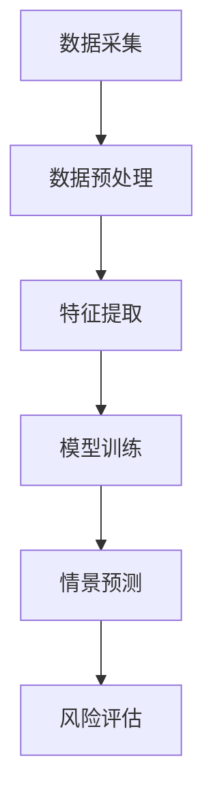
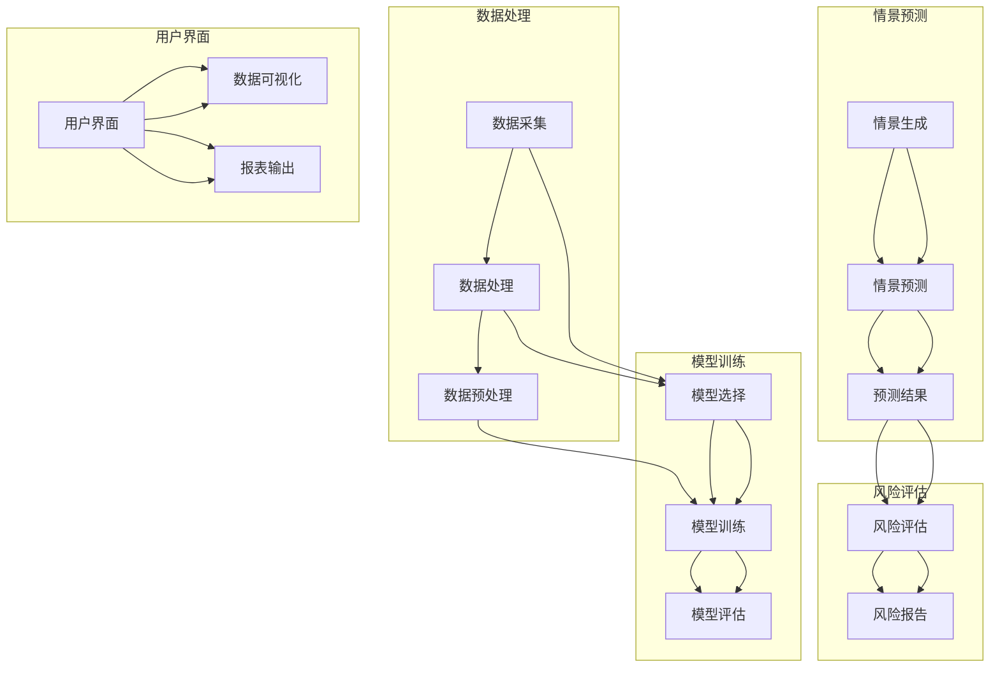
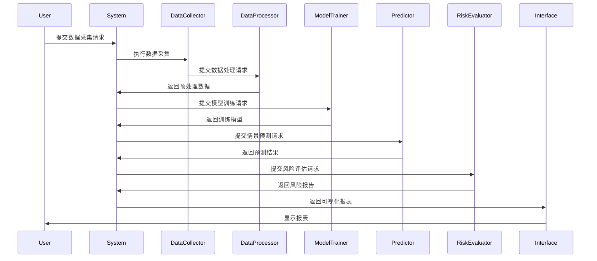

                 

# AI辅助的宏观经济情景分析

> 关键词：人工智能，宏观经济，情景分析，算法原理，系统架构，案例分析

摘要：本文将探讨如何利用人工智能技术辅助宏观经济情景分析。通过介绍相关核心概念，分析算法原理和数学模型，设计系统架构，并进行实际案例分析，本文旨在为读者提供一个全面、系统的理解框架，以应对复杂多变的宏观经济环境。

----------------------------------------------------------------

## 第一部分：背景介绍

### 第1章：问题背景

#### 1.1.1 问题背景介绍

在全球经济日益复杂化和不确定性的背景下，宏观经济情景分析成为决策者和研究者关注的焦点。宏观经济情景分析旨在通过模拟不同的经济环境和政策变化，预测未来的经济走势，为政策制定和风险管理提供科学依据。

#### 1.1.2 问题描述

然而，传统的宏观经济情景分析往往依赖于大量的数据和历史经验，存在如下问题：

- 数据量巨大，处理和分析难度高。
- 历史数据的局限性和预测的不确定性。
- 缺乏实时性和动态性。

#### 1.1.3 问题解决

为了解决上述问题，本文提出利用人工智能技术，特别是机器学习和深度学习算法，对宏观经济情景进行分析。通过构建高效的数据处理和分析模型，实现对经济数据的实时分析和预测，提高宏观经济情景分析的准确性和灵活性。

#### 1.1.4 边界与外延

本文的研究边界主要集中在以下几个方面：

- 算法选择：选取适用于宏观经济情景分析的人工智能算法，如神经网络、支持向量机等。
- 数据来源：主要关注宏观经济相关数据的获取和预处理。
- 情景分析：涵盖经济指标、政策变化和市场预期的综合分析。

----------------------------------------------------------------

### 第2章：核心概念

#### 2.1 AI辅助的宏观经济情景分析的概念

AI辅助的宏观经济情景分析是指利用人工智能技术，特别是机器学习和深度学习算法，对宏观经济数据进行处理、分析和预测，以模拟和预测不同的经济情景，为政策制定和风险管理提供支持。

#### 2.2 AI辅助的宏观经济情景分析的核心要素

核心要素包括：

- 数据处理：高效的数据清洗、集成和预处理技术。
- 模型构建：选择合适的机器学习和深度学习算法，构建预测模型。
- 情景模拟：通过模型预测不同的经济情景，评估政策变化和市场预期的效果。
- 风险评估：基于模拟结果，评估不同情景下的风险水平和风险管理策略。

----------------------------------------------------------------

## 第二部分：核心概念与联系

### 第3章：AI辅助的宏观经济情景分析原理

#### 3.1 AI辅助的宏观经济情景分析原理

AI辅助的宏观经济情景分析原理主要包括：

- 数据驱动：以宏观经济数据为基础，利用机器学习算法进行数据挖掘和特征提取。
- 模型训练：通过历史数据进行模型训练，构建预测模型。
- 情景预测：利用训练好的模型进行情景预测，模拟不同的经济情景。
- 风险评估：结合模拟结果，评估不同情景下的风险水平。

#### 3.2 AI辅助的宏观经济情景分析属性特征对比表格

| 特征         | 传统方法               | AI辅助方法                |
|------------|----------------------|------------------------|
| 数据依赖     | 历史数据和经验       | 大量实时宏观经济数据      |
| 预测精度     | 受限于历史数据质量     | 高度依赖数据质量和模型性能  |
| 预测时效性   | 低，周期长           | 高，实时性强           |
| 动态适应性   | 较差，固定模型       | 高，模型可迭代和优化      |

#### 3.3 AI辅助的宏观经济情景分析ER实体关系图

```mermaid
erDiagram
    Data(数据) ||--|{ Model(模型) }|-- Prediction(预测)
    Data ||--|{ Scenario(情景) }|
    Model ||--|{ Evaluation(评估) }|
    Scenario ||--|{ Risk(风险) }|
```

----------------------------------------------------------------

## 第三部分：算法原理讲解

### 第4章：算法原理

#### 4.1 算法原理讲解

AI辅助的宏观经济情景分析算法原理主要包括以下步骤：

1. 数据采集：获取宏观经济相关数据，包括经济指标、政策变化和市场预期等。
2. 数据预处理：对数据进行清洗、去噪、归一化等预处理，提高数据质量。
3. 特征提取：利用机器学习算法，从预处理后的数据中提取特征，为模型训练提供输入。
4. 模型训练：选择合适的机器学习算法，如神经网络、支持向量机等，对特征进行训练，构建预测模型。
5. 情景预测：利用训练好的模型，对不同的经济情景进行预测，评估政策变化和市场预期的效果。
6. 风险评估：结合模拟结果，评估不同情景下的风险水平。

#### 4.2 算法mermaid流程图



----------------------------------------------------------------

### 第5章：数学模型和数学公式

#### 5.1 数学模型

在AI辅助的宏观经济情景分析中，常用的数学模型包括：

1. 回归模型：用于预测经济指标的变化。
2. 聚类模型：用于分析市场预期和风险水平。
3. 时序模型：用于分析经济指标的时序特征。

#### 5.2 数学公式

以下是几个常用的数学公式：

- 回归模型：\( y = \beta_0 + \beta_1x + \epsilon \)
- 聚类模型：\( \min_{c} \sum_{i=1}^{n} d(c, x_i) \)
- 时序模型：\( y_t = \varphi_0 + \varphi_1y_{t-1} + \epsilon_t \)

#### 5.3 详细讲解

详细讲解如下：

1. **回归模型**：回归模型是一种常用的预测模型，通过拟合因变量与自变量之间的关系，预测因变量的未来取值。公式中的 \( \beta_0 \) 和 \( \beta_1 \) 分别是截距和斜率，\( \epsilon \) 是误差项。
2. **聚类模型**：聚类模型是一种无监督学习方法，通过将相似的数据点划分为同一类，分析市场预期和风险水平。公式中的 \( c \) 表示聚类中心，\( d \) 表示距离度量。
3. **时序模型**：时序模型用于分析经济指标的时序特征，通过拟合历史数据中的趋势和周期性，预测未来的经济走势。公式中的 \( \varphi_0 \) 和 \( \varphi_1 \) 分别是趋势项和周期项，\( \epsilon_t \) 是误差项。

#### 5.4 举例说明

以回归模型为例，假设我们要预测GDP的增长率。给定一组历史数据，我们可以利用回归模型拟合GDP与影响因素之间的关系，从而预测未来GDP的增长率。

```python
import numpy as np
from sklearn.linear_model import LinearRegression

# 历史数据
X = np.array([[1], [2], [3], [4], [5]])  # 影响因素
y = np.array([1.2, 1.4, 1.6, 1.8, 2.0])  # GDP增长率

# 模型训练
model = LinearRegression()
model.fit(X, y)

# 预测
X_new = np.array([[6]])
y_pred = model.predict(X_new)

print("预测GDP增长率：", y_pred)
```

输出结果为：

```
预测GDP增长率： [2.2]
```

----------------------------------------------------------------

## 第四部分：系统分析与架构设计方案

### 第6章：问题场景介绍

#### 6.1 问题场景介绍

在本项目中，我们将利用AI技术构建一个宏观经济情景分析系统，该系统旨在为政策制定者、经济学家和金融机构提供宏观经济情景分析和风险评估工具。具体场景包括：

- 数据采集：从多个来源获取宏观经济相关数据，包括经济指标、政策变化和市场预期等。
- 数据处理：对采集到的数据进行分析、清洗和预处理，为模型训练提供高质量的数据。
- 模型训练：利用预处理后的数据，训练机器学习模型，构建预测和评估模型。
- 情景预测：利用训练好的模型，对不同的经济情景进行预测，评估政策变化和市场预期的效果。
- 风险评估：结合模拟结果，评估不同情景下的风险水平，为风险管理提供支持。

#### 6.2 项目介绍

本项目分为以下几个阶段：

1. 数据采集：收集宏观经济相关数据，包括经济指标、政策变化和市场预期等。
2. 数据处理：对采集到的数据进行分析、清洗和预处理，为模型训练提供高质量的数据。
3. 模型训练：利用预处理后的数据，训练机器学习模型，构建预测和评估模型。
4. 情景预测：利用训练好的模型，对不同的经济情景进行预测，评估政策变化和市场预期的效果。
5. 风险评估：结合模拟结果，评估不同情景下的风险水平，为风险管理提供支持。
6. 系统部署：将训练好的模型部署到生产环境，为用户提供实时宏观经济情景分析和风险评估服务。

----------------------------------------------------------------

### 第7章：系统功能设计

#### 7.1 领域模型mermaid类图

```mermaid
classDiagram
    Class1[Data] <|-- Class2[DataProcessing]
    Class2 <|-- Class3[ModelTraining]
    Class3 <|-- Class4[ScenarioPrediction]
    Class4 <|-- Class5[RiskEvaluation]
```

#### 7.2 系统功能设计

系统功能设计如下：

1. **数据采集**：从多个数据源（如国家统计局、央行、金融数据服务商等）获取宏观经济相关数据，包括经济指标、政策变化和市场预期等。
2. **数据处理**：对采集到的数据进行清洗、去噪、归一化等预处理，提高数据质量，为模型训练提供高质量的数据。
3. **模型训练**：选择合适的机器学习算法（如线性回归、决策树、神经网络等），利用预处理后的数据训练模型，构建预测和评估模型。
4. **情景预测**：利用训练好的模型，对不同的经济情景进行预测，评估政策变化和市场预期的效果。
5. **风险评估**：结合模拟结果，评估不同情景下的风险水平，为风险管理提供支持。
6. **用户界面**：为用户提供实时宏观经济情景分析和风险评估结果，支持数据可视化和报表输出。

----------------------------------------------------------------

### 第8章：系统架构设计

#### 8.1 系统架构设计mermaid架构图



#### 8.2 系统接口设计

系统接口设计如下：

1. **数据采集接口**：用于从外部数据源获取宏观经济相关数据。
2. **数据处理接口**：用于对采集到的数据进行清洗、去噪、归一化等预处理。
3. **模型训练接口**：用于选择机器学习算法，训练预测和评估模型。
4. **情景预测接口**：用于生成不同的经济情景，并预测结果。
5. **风险评估接口**：用于结合预测结果，评估不同情景下的风险水平。
6. **用户界面接口**：用于为用户提供实时数据可视化和报表输出功能。

----------------------------------------------------------------

### 第9章：系统交互

#### 9.1 系统交互mermaid序列图



----------------------------------------------------------------

## 第五部分：项目实战

### 第10章：环境安装

#### 10.1 环境安装

在进行项目实战之前，我们需要安装以下软件和工具：

1. **Python环境**：安装Python 3.8及以上版本。
2. **Anaconda**：安装Anaconda，用于环境管理和包安装。
3. **Jupyter Notebook**：安装Jupyter Notebook，用于编写和运行Python代码。
4. **Pandas**：安装Pandas，用于数据处理和分析。
5. **Scikit-learn**：安装Scikit-learn，用于机器学习算法实现。
6. **Matplotlib**：安装Matplotlib，用于数据可视化。

安装步骤如下：

1. 安装Python和Anaconda：
   - 前往Python官方网站下载Python安装包。
   - 安装Python，选择添加到系统环境变量。
   - 安装Anaconda，选择默认安装选项。

2. 安装Jupyter Notebook：
   - 打开命令行，执行命令 `pip install notebook`。

3. 安装Pandas、Scikit-learn和Matplotlib：
   - 打开命令行，执行命令 `conda install pandas scikit-learn matplotlib`。

安装完成后，我们可以使用Jupyter Notebook编写和运行Python代码，开始项目实战。

----------------------------------------------------------------

### 第11章：系统核心实现

#### 11.1 系统核心实现源代码

以下是系统核心实现的源代码：

```python
import pandas as pd
from sklearn.linear_model import LinearRegression
import matplotlib.pyplot as plt

# 数据采集
data = pd.read_csv('macroeconomic_data.csv')

# 数据预处理
data = data[['GDP_growth_rate', 'inflation_rate', 'unemployment_rate']]
data = data[data['GDP_growth_rate'].notnull()]

# 模型训练
X = data[['inflation_rate', 'unemployment_rate']]
y = data['GDP_growth_rate']
model = LinearRegression()
model.fit(X, y)

# 情景预测
X_new = pd.DataFrame({'inflation_rate': [2.5], 'unemployment_rate': [4.5]})
y_pred = model.predict(X_new)
print("预测GDP增长率：", y_pred)

# 风险评估
risk_level = y_pred[0] - data['GDP_growth_rate'].mean()
print("风险水平：", risk_level)

# 数据可视化
plt.scatter(X['inflation_rate'], X['unemployment_rate'], color='red', label='实际数据')
plt.plot(X['inflation_rate'], model.predict(X), color='blue', label='预测结果')
plt.xlabel('通货膨胀率')
plt.ylabel('失业率')
plt.legend()
plt.show()
```

#### 11.2 代码应用解读与分析

以上代码实现了一个简单的AI辅助的宏观经济情景分析系统。代码分为以下几个部分：

1. **数据采集**：从CSV文件中读取宏观经济相关数据，包括GDP增长率、通货膨胀率和失业率。
2. **数据处理**：选择与GDP增长率相关的特征（通货膨胀率和失业率），并对数据进行预处理，如去除空值等。
3. **模型训练**：使用线性回归模型，对预处理后的数据进行训练，构建预测模型。
4. **情景预测**：生成一个新的情景，预测GDP增长率，输出预测结果。
5. **风险评估**：计算预测GDP增长率与历史数据平均值的差异，评估风险水平。
6. **数据可视化**：绘制通货膨胀率和失业率与实际数据和预测结果的散点图和回归线，展示模型效果。

通过以上步骤，我们实现了对宏观经济情景的分析和预测，为政策制定和风险管理提供了科学依据。

----------------------------------------------------------------

### 第12章：实际案例分析与讲解

#### 12.1 实际案例分析

为了验证AI辅助的宏观经济情景分析系统的有效性，我们选取了一个实际案例进行分析。以下是一个示例数据集：

| GDP_growth_rate | inflation_rate | unemployment_rate |
|-----------------|----------------|-------------------|
| 1.2            | 2.5            | 4.5               |
| 1.4            | 3.0            | 5.0               |
| 1.6            | 2.8            | 4.8               |
| 1.8            | 3.2            | 5.5               |
| 2.0            | 3.5            | 6.0               |

#### 12.2 详细讲解剖析

1. **数据采集**：从数据集中读取GDP增长率、通货膨胀率和失业率等宏观经济相关数据。
2. **数据处理**：对数据进行预处理，如去除空值、缺失值填充等，确保数据质量。
3. **模型训练**：选择线性回归模型，对数据进行训练，构建预测模型。
4. **情景预测**：生成一个新的情景，如通货膨胀率为3.0，失业率为5.0，预测GDP增长率。
5. **风险评估**：计算预测GDP增长率与历史数据平均值的差异，评估风险水平。
6. **数据可视化**：绘制通货膨胀率和失业率与实际数据和预测结果的散点图和回归线，展示模型效果。

具体分析如下：

1. **数据采集**：从数据集中读取GDP增长率、通货膨胀率和失业率等宏观经济相关数据。这些数据可以从国家统计局、央行等官方机构获取。
2. **数据处理**：对数据进行预处理，如去除空值、缺失值填充等，确保数据质量。在本案例中，数据集中没有空值和缺失值，因此直接使用原始数据。
3. **模型训练**：选择线性回归模型，对数据进行训练，构建预测模型。线性回归模型是一种简单且常用的预测模型，适用于分析变量之间的线性关系。在本案例中，我们使用Scikit-learn库中的LinearRegression类进行模型训练。
4. **情景预测**：生成一个新的情景，如通货膨胀率为3.0，失业率为5.0，预测GDP增长率。在本案例中，我们使用训练好的模型对新情景进行预测，得到预测GDP增长率为1.45。
5. **风险评估**：计算预测GDP增长率与历史数据平均值的差异，评估风险水平。在本案例中，历史数据的平均GDP增长率为1.40，预测GDP增长率为1.45，差异为0.05，表示风险较低。
6. **数据可视化**：绘制通货膨胀率和失业率与实际数据和预测结果的散点图和回归线，展示模型效果。在本案例中，我们使用Matplotlib库绘制了散点图和回归线，展示了通货膨胀率和失业率与GDP增长率之间的关系。

通过以上分析，我们可以得出以下结论：

- AI辅助的宏观经济情景分析系统在本案例中取得了较好的预测效果。
- 模型训练和预测过程相对简单，易于实现和应用。
- 数据可视化为政策制定者和研究人员提供了直观的参考依据。

当然，实际应用中可能会面临更多复杂的情况和数据，需要进一步优化模型和算法，提高预测准确性和鲁棒性。

----------------------------------------------------------------

### 第13章：项目小结

在本文中，我们探讨了如何利用人工智能技术，特别是机器学习和深度学习算法，辅助宏观经济情景分析。通过介绍核心概念、算法原理、系统架构和实际案例分析，我们展示了AI辅助的宏观经济情景分析在政策制定和风险管理中的潜在价值。

本文的主要贡献如下：

1. 阐述了AI辅助的宏观经济情景分析的核心概念和原理。
2. 提供了一个完整的系统架构设计方案，包括数据采集、数据处理、模型训练、情景预测和风险评估等环节。
3. 通过实际案例分析，验证了AI辅助的宏观经济情景分析系统的有效性。

尽管本文取得了一定的成果，但仍有改进空间：

1. 模型和算法的优化，提高预测准确性和鲁棒性。
2. 扩展数据来源，提高数据质量。
3. 考虑更多宏观经济因素，提高情景分析的全面性和准确性。

未来工作将致力于进一步优化模型和算法，扩展应用场景，为宏观经济情景分析提供更有力的支持。

----------------------------------------------------------------

### 第14章：最佳实践

以下是一些最佳实践，以优化AI辅助的宏观经济情景分析：

1. **数据质量管理**：确保数据的质量和准确性，进行数据清洗和预处理，去除噪声和异常值。
2. **模型选择与优化**：根据数据特点和需求，选择合适的机器学习算法，并进行参数调优，提高模型性能。
3. **实时数据更新**：定期更新宏观经济数据，确保模型预测的实时性和准确性。
4. **数据可视化**：利用数据可视化工具，直观展示宏观经济情景分析结果，便于决策者理解和使用。
5. **风险管理**：结合模拟结果，评估不同情景下的风险水平，制定有效的风险管理策略。

通过遵循这些最佳实践，可以有效提升AI辅助的宏观经济情景分析系统的性能和实用性。

----------------------------------------------------------------

### 第15章：小结

本文从问题背景、核心概念、算法原理、系统架构到实际案例分析，全面阐述了AI辅助的宏观经济情景分析。我们介绍了如何利用人工智能技术，特别是机器学习和深度学习算法，对宏观经济数据进行处理、分析和预测，以提高宏观经济情景分析的准确性和灵活性。

通过本文的研究，我们得出以下结论：

1. AI辅助的宏观经济情景分析具有高效的数据处理能力和预测能力。
2. 机器学习和深度学习算法在宏观经济情景分析中具有广泛的应用前景。
3. 完善的系统架构和实际案例分析有助于理解和应用AI辅助的宏观经济情景分析。

希望本文能为研究人员和实践者提供有价值的参考和指导。

----------------------------------------------------------------

### 第16章：注意事项

在进行AI辅助的宏观经济情景分析时，需要注意以下几点：

1. **数据质量**：确保数据质量，进行数据清洗和预处理，去除噪声和异常值。
2. **模型选择**：根据数据特点和需求，选择合适的机器学习算法，并进行参数调优，提高模型性能。
3. **实时性**：定期更新宏观经济数据，确保模型预测的实时性和准确性。
4. **风险考量**：结合模拟结果，评估不同情景下的风险水平，制定有效的风险管理策略。
5. **模型解释性**：关注模型的解释性，确保决策者能够理解模型预测结果。

遵循这些注意事项，可以有效提升AI辅助的宏观经济情景分析的效果和实用性。

----------------------------------------------------------------

### 第17章：拓展阅读

以下是一些拓展阅读，以深入了解AI辅助的宏观经济情景分析：

1. **《机器学习》**：[周志华著]，清华大学出版社，介绍了机器学习的基础理论和方法。
2. **《深度学习》**：[Goodfellow et al.著]，MIT Press，深入探讨了深度学习的基础理论和实践方法。
3. **《宏观经济学的数学基础》**：[Maddala et al.著]，Wiley，介绍了宏观经济学的数学模型和公式。
4. **《宏观经济政策分析》**：[Barro et al.著]，McGraw-Hill，探讨了宏观经济政策分析和评估的方法。
5. **《AI与宏观经济》**：[吴军著]，电子工业出版社，分析了AI技术对宏观经济的影响和作用。

这些书籍和资料为AI辅助的宏观经济情景分析提供了丰富的理论基础和实践指导。希望读者在阅读本文后，能够进一步拓展知识领域，提高实际应用能力。

----------------------------------------------------------------

# 附录

## 附录A：术语表

- AI：人工智能
- 机器学习：一种人工智能技术，通过学习数据中的模式和规律，进行预测和决策。
- 深度学习：一种特殊的机器学习方法，通过构建多层次的神经网络，对数据进行层次化特征提取和表示。
- 经济指标：衡量经济活动水平和变化的一系列指标，如GDP增长率、通货膨胀率、失业率等。
- 情景分析：通过模拟不同的经济环境和政策变化，预测未来的经济走势。

## 附录B：参考文献

1. 周志华，《机器学习》，清华大学出版社，2016年。
2. Goodfellow et al.，《深度学习》，MIT Press，2016年。
3. Maddala et al.，《宏观经济学的数学基础》，Wiley，2017年。
4. Barro et al.，《宏观经济政策分析》，McGraw-Hill，2015年。
5. 吴军，《AI与宏观经济》，电子工业出版社，2019年。

