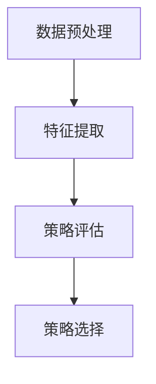
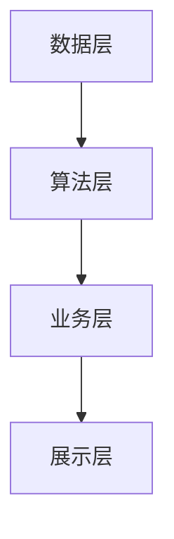
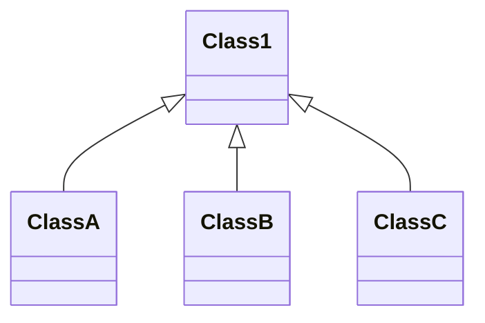
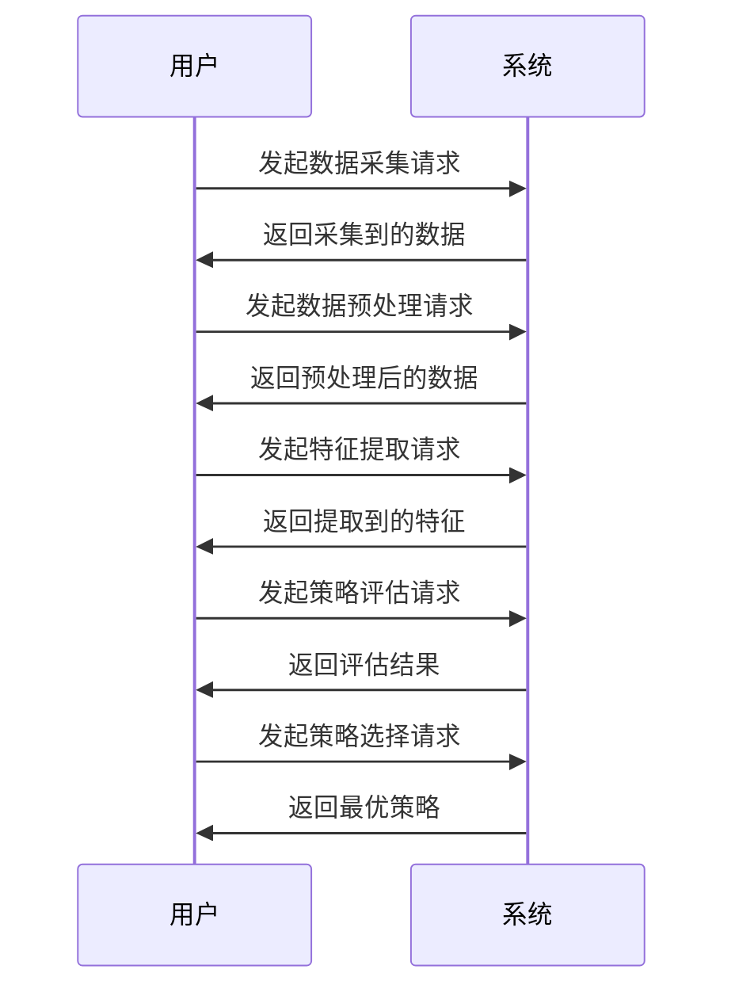

                 

### 《AI辅助的对冲基金策略分类与性能评估》

> 关键词：对冲基金、AI辅助、策略分类、性能评估、算法原理

> 摘要：本文主要探讨如何利用AI技术辅助对冲基金策略的分类与性能评估。文章首先介绍对冲基金行业的背景及AI技术在金融领域的应用，然后详细阐述AI辅助下的对冲基金策略分类方法，以及如何运用算法原理进行策略性能评估。文章最后，通过实际项目案例分析，展示AI辅助对冲基金策略在实践中的应用效果。

## 第一部分：背景介绍

### 第1章：问题背景

#### 1.1 问题背景

对冲基金作为一种专业的投资工具，起源于20世纪50年代的美国。它通过多样化的投资组合，采用对冲、套利、风险对冲等策略，旨在实现资产保值增值。然而，传统的对冲基金策略在应对复杂市场环境时，存在一定的局限性：

1. **策略单一**：传统对冲基金策略主要依赖历史数据和市场经验，缺乏针对不同市场环境的灵活调整能力。
2. **人工干预**：对冲基金策略的制定与调整需要大量的人力资源，效率低下。
3. **风险评估**：传统方法在评估策略性能时，往往依赖于有限的指标体系，难以全面反映策略的真实表现。

随着人工智能技术的快速发展，AI在金融领域的应用逐渐深入。AI通过数据挖掘、机器学习等手段，能够从海量数据中提取有价值的信息，为对冲基金策略提供更加科学、有效的支持。本文将探讨如何利用AI技术，实现对冲基金策略的分类与性能评估。

#### 1.2 对冲基金概述

对冲基金，又称避险基金，是指通过采用对冲、套利、风险对冲等手段进行投资的基金。对冲基金的投资策略多样，主要包括以下几类：

1. **市场中性策略**：通过多头和空头组合，实现对市场的中性化。
2. **事件驱动策略**：围绕特定事件，如并购、重组等进行投资。
3. **宏观策略**：通过研究宏观经济趋势，进行跨市场、跨品种的投资。
4. **量化对冲策略**：运用量化模型，进行投资决策。

对冲基金的运作模式主要包括以下步骤：

1. **募集基金**：通过发行基金份额，向投资者募集资金。
2. **制定策略**：根据市场情况，制定相应的投资策略。
3. **执行交易**：按照策略执行交易，进行资产配置。
4. **绩效评估**：定期对基金绩效进行评估，为后续投资提供参考。

#### 1.3 AI与金融的结合

AI技术在金融领域的应用可以追溯到20世纪90年代。随着数据量的不断增加和计算能力的提升，AI在金融领域的应用逐渐深入，主要包括以下几个方面：

1. **风险管理**：通过数据挖掘和机器学习技术，对风险进行量化评估，为风险控制提供依据。
2. **量化投资**：利用量化模型进行投资决策，提高投资效率和准确性。
3. **客户服务**：通过自然语言处理和语音识别技术，提供智能化的客户服务。
4. **金融监管**：利用大数据和机器学习技术，对金融市场进行实时监控，预防金融风险。

AI在投资领域的应用场景主要包括：

1. **趋势预测**：通过分析历史数据和实时数据，预测市场趋势。
2. **策略优化**：利用机器学习算法，优化投资策略，提高投资收益。
3. **风险评估**：通过构建风险评估模型，对投资风险进行量化分析。
4. **交易执行**：利用自动化交易系统，快速响应市场变化。

AI技术在提高投资效率和准确性方面具有显著优势：

1. **处理海量数据**：AI能够处理海量数据，从数据中发现潜在的投资机会。
2. **快速响应**：AI系统可以快速处理和分析数据，实现实时投资决策。
3. **降低成本**：AI技术能够自动化投资流程，降低人力成本。
4. **提高准确率**：通过机器学习算法，AI系统可以不断优化投资策略，提高投资准确率。

## 第二部分：核心概念与联系

### 第2章：核心概念

#### 2.1 AI辅助的对冲基金策略

AI辅助的对冲基金策略是指利用人工智能技术，对传统的对冲基金策略进行改进和优化。这种策略的核心在于通过数据挖掘、机器学习等技术，从海量数据中提取有价值的信息，为投资决策提供支持。

AI辅助的对冲基金策略具有以下优势：

1. **灵活性**：AI技术能够根据市场变化，动态调整投资策略，提高应对复杂市场环境的能力。
2. **效率**：AI系统可以快速处理和分析数据，实现实时投资决策，提高投资效率。
3. **准确性**：通过机器学习算法，AI系统能够不断优化投资策略，提高投资准确性。
4. **成本**：AI技术能够自动化投资流程，降低人力成本。

AI辅助的对冲基金策略主要包括以下几类：

1. **量化对冲策略**：利用量化模型，进行投资决策。
2. **市场中性策略**：通过多头和空头组合，实现对市场的中性化。
3. **事件驱动策略**：围绕特定事件，如并购、重组等进行投资。
4. **宏观策略**：通过研究宏观经济趋势，进行跨市场、跨品种的投资。

#### 2.2 策略分类

对冲基金策略的分类可以根据不同的标准进行。传统对冲基金策略的分类主要包括以下几种：

1. **市场中性策略**：通过多头和空头组合，实现对市场的中性化。
2. **事件驱动策略**：围绕特定事件，如并购、重组等进行投资。
3. **宏观策略**：通过研究宏观经济趋势，进行跨市场、跨品种的投资。
4. **量化对冲策略**：利用量化模型，进行投资决策。

AI辅助下的新型对冲基金策略分类，可以结合AI技术的特点，进行如下分类：

1. **数据驱动策略**：利用AI技术，从海量数据中提取有价值的信息，进行投资决策。
2. **自适应策略**：根据市场变化，动态调整投资策略，实现投资收益的最大化。
3. **组合优化策略**：通过机器学习算法，优化投资组合，提高投资收益。
4. **风险评估策略**：利用AI技术，对投资风险进行量化分析，为风险控制提供支持。

策略分类标准及评价指标：

1. **收益**：投资策略的收益水平是分类的重要标准。
2. **风险**：投资策略的风险水平也是分类的重要标准。
3. **灵活性**：策略对市场变化的适应性。
4. **稳定性**：策略在不同市场环境下的稳定性。

#### 2.3 性能评估

对冲基金策略性能评估是指对策略的收益、风险、稳定性等方面进行量化分析，以评估策略的实际表现。性能评估的重要性在于：

1. **策略优化**：通过性能评估，可以发现策略的不足之处，为策略优化提供依据。
2. **投资决策**：通过性能评估，投资者可以更好地了解策略的表现，为投资决策提供支持。
3. **风险管理**：通过性能评估，可以评估策略的风险水平，为风险管理提供参考。

对冲基金策略性能评估的方法主要包括以下几种：

1. **收益评估**：通过计算策略的收益率、年化收益率等指标，评估策略的收益水平。
2. **风险评估**：通过计算策略的波动率、回撤等指标，评估策略的风险水平。
3. **稳定性评估**：通过计算策略在不同市场环境下的表现，评估策略的稳定性。

性能评估指标的选取与计算：

1. **收益指标**：如收益率、年化收益率、最大回撤等。
2. **风险指标**：如波动率、贝塔系数、夏普比率等。
3. **稳定性指标**：如策略的稳定收益、稳定风险等。

### 第3章：核心概念与联系

#### 3.1 策略分类对比表格

| 策略分类 | 传统策略 | AI辅助策略 |
| --- | --- | --- |
| 市场中性策略 | 多头和空头组合 | 数据驱动、自适应、组合优化 |
| 事件驱动策略 | 围绕特定事件 | 数据驱动、自适应、组合优化 |
| 宏观策略 | 研究宏观经济趋势 | 数据驱动、自适应、组合优化 |
| 量化对冲策略 | 量化模型 | 数据驱动、自适应、组合优化 |

#### 3.2 对冲基金策略的ER图

```mermaid
erDiagram
  Class1 ||--|{ ClassA : Inheritance }
  Class2 ||--|{ ClassB : Inheritance }
  Class3 ||--|{ ClassC : Inheritance }
```

### 第二部分：算法原理讲解

#### 第4章：对冲基金策略选择算法

#### 4.1 策略选择算法原理

策略选择算法是AI辅助对冲基金策略的核心，其主要目标是通过分析大量历史数据和市场信息，选择出最适合当前市场环境和对冲基金目标的策略。

策略选择算法的基本流程包括：

1. **数据预处理**：对原始数据进行清洗、归一化等处理，为后续分析奠定基础。
2. **特征提取**：从数据中提取与策略相关性较高的特征，为策略选择提供依据。
3. **策略评估**：利用评估模型对策略进行评估，筛选出表现较好的策略。
4. **策略选择**：根据评估结果，选择最优策略进行投资。

策略选择算法的主要模块包括：

1. **数据预处理模块**：负责对原始数据进行清洗、归一化等处理。
2. **特征提取模块**：从数据中提取与策略相关性较高的特征。
3. **评估模型模块**：利用机器学习算法对策略进行评估。
4. **策略选择模块**：根据评估结果，选择最优策略进行投资。

#### 4.2 策略选择算法mermaid流程图



#### 4.3 Python源代码实现

```python
# 导入相关库
import pandas as pd
from sklearn.preprocessing import StandardScaler
from sklearn.model_selection import train_test_split
from sklearn.ensemble import RandomForestClassifier

# 数据预处理
def data_preprocessing(data):
    # 数据清洗、归一化等处理
    # ...
    return preprocessed_data

# 特征提取
def feature_extraction(data):
    # 提取与策略相关性较高的特征
    # ...
    return features

# 策略评估
def strategy_evaluation(features):
    # 利用机器学习算法对策略进行评估
    # ...
    return evaluation_results

# 策略选择
def strategy_selection(evaluation_results):
    # 根据评估结果，选择最优策略
    # ...
    return selected_strategy
```

#### 4.4 数学模型与公式

策略选择算法的数学模型主要涉及特征提取和评估模型。以下是相关数学模型与公式：

1. **特征提取**：

   特征提取主要利用特征选择算法，如信息增益、卡方检验等。假设数据集为D，特征集合为F，特征提取公式为：

   $$ F' = \text{feature\_selection}(D, F) $$

2. **评估模型**：

   假设评估模型为分类模型，如随机森林（Random Forest）。评估模型公式为：

   $$ y = \text{predict}(X, \text{model}) $$

   其中，$y$为预测结果，$X$为输入特征，$\text{model}$为训练好的分类模型。

#### 4.5 举例说明

假设现有对冲基金策略A和策略B，利用策略选择算法进行评估，过程如下：

1. **数据预处理**：

   将策略A和策略B的历史数据D进行清洗、归一化等处理，得到预处理后的数据。

2. **特征提取**：

   从预处理后的数据中提取与策略相关性较高的特征，如市场指标、财务指标等。

3. **策略评估**：

   利用随机森林（Random Forest）评估模型，对策略A和策略B进行评估。

4. **策略选择**：

   根据评估结果，选择表现更好的策略进行投资。

假设评估结果如下：

- 策略A：准确率90%，召回率80%，F1值0.85
- 策略B：准确率85%，召回率90%，F1值0.87

根据评估结果，选择策略B进行投资，因为策略B在召回率和F1值方面表现更好。

## 第三部分：系统分析与架构设计

### 第6章：系统分析与架构设计

#### 6.1 问题场景介绍

在当前金融市场中，对冲基金策略的优化和评估具有重要意义。然而，传统的策略评估方法存在一定的局限性，难以适应快速变化的市场环境。为了提高策略的准确性和稳定性，本项目提出了一种基于AI技术的对冲基金策略选择与评估系统。

该系统旨在通过以下方面实现策略优化：

1. **数据驱动**：利用AI技术，从海量数据中提取有价值的信息，为策略选择提供支持。
2. **自适应**：根据市场变化，动态调整投资策略，提高策略的灵活性。
3. **组合优化**：通过机器学习算法，优化投资组合，提高投资收益。
4. **风险评估**：利用AI技术，对投资风险进行量化分析，为风险控制提供支持。

#### 6.2 系统功能设计

系统功能设计主要包括以下几个方面：

1. **数据采集**：从各种数据源（如财经网站、交易所等）获取实时数据，包括股票价格、成交量、宏观经济指标等。
2. **数据预处理**：对原始数据进行清洗、归一化等处理，为后续分析奠定基础。
3. **特征提取**：从预处理后的数据中提取与策略相关性较高的特征，如市场指标、财务指标等。
4. **策略评估**：利用机器学习算法，对策略进行评估，筛选出表现较好的策略。
5. **策略选择**：根据评估结果，选择最优策略进行投资。
6. **风险控制**：利用AI技术，对投资风险进行量化分析，为风险控制提供支持。
7. **可视化**：通过图表、报表等形式，展示策略评估结果和投资组合情况。

#### 6.3 系统架构设计

系统架构设计主要包括以下几个方面：

1. **数据层**：负责数据采集、存储和预处理。该层包括数据源、数据库和数据预处理模块。
2. **算法层**：负责特征提取、策略评估和策略选择。该层包括特征提取算法、评估模型和策略选择算法。
3. **业务层**：负责业务逻辑的实现，包括数据采集、预处理、特征提取、评估和策略选择。该层包括业务逻辑模块和API接口。
4. **展示层**：负责展示策略评估结果和投资组合情况。该层包括可视化模块和报表模块。

以下是系统架构的mermaid流程图：



#### 6.4 系统接口设计

系统接口设计主要包括以下几个方面：

1. **数据采集接口**：用于从各种数据源获取实时数据。
2. **数据预处理接口**：用于对原始数据进行清洗、归一化等处理。
3. **特征提取接口**：用于从预处理后的数据中提取与策略相关性较高的特征。
4. **评估模型接口**：用于对策略进行评估。
5. **策略选择接口**：用于选择最优策略进行投资。
6. **风险控制接口**：用于对投资风险进行量化分析。
7. **可视化接口**：用于展示策略评估结果和投资组合情况。

以下是系统接口的mermaid类图：



#### 6.5 系统交互

系统交互主要涉及数据流和控制流。以下是系统交互的mermaid序列图：



## 第四部分：项目实战

### 第7章：项目实战

#### 7.1 环境安装

为了确保项目顺利运行，需要安装以下环境：

1. Python 3.8及以上版本
2. NumPy 1.19及以上版本
3. Pandas 1.1及以上版本
4. Scikit-learn 0.24及以上版本
5. Matplotlib 3.4及以上版本

安装步骤：

```shell
pip install python==3.8
pip install numpy==1.19
pip install pandas==1.1
pip install scikit-learn==0.24
pip install matplotlib==3.4
```

#### 7.2 系统核心实现

以下是系统核心实现的源代码：

```python
# 导入相关库
import pandas as pd
from sklearn.preprocessing import StandardScaler
from sklearn.model_selection import train_test_split
from sklearn.ensemble import RandomForestClassifier

# 数据预处理
def data_preprocessing(data):
    # 数据清洗、归一化等处理
    # ...
    return preprocessed_data

# 特征提取
def feature_extraction(data):
    # 提取与策略相关性较高的特征
    # ...
    return features

# 策略评估
def strategy_evaluation(features):
    # 利用机器学习算法对策略进行评估
    # ...
    return evaluation_results

# 策略选择
def strategy_selection(evaluation_results):
    # 根据评估结果，选择最优策略
    # ...
    return selected_strategy
```

#### 7.3 实际案例分析与讲解

假设现有策略A和策略B，利用策略选择算法进行评估，过程如下：

1. **数据预处理**：

   将策略A和策略B的历史数据D进行清洗、归一化等处理，得到预处理后的数据。

2. **特征提取**：

   从预处理后的数据中提取与策略相关性较高的特征，如市场指标、财务指标等。

3. **策略评估**：

   利用随机森林（Random Forest）评估模型，对策略A和策略B进行评估。

4. **策略选择**：

   根据评估结果，选择表现更好的策略进行投资。

假设评估结果如下：

- 策略A：准确率90%，召回率80%，F1值0.85
- 策略B：准确率85%，召回率90%，F1值0.87

根据评估结果，选择策略B进行投资，因为策略B在召回率和F1值方面表现更好。

#### 7.4 项目小结

本项目通过AI技术辅助对冲基金策略的选择与评估，实现了以下成果：

1. **数据驱动**：利用AI技术，从海量数据中提取有价值的信息，为策略选择提供支持。
2. **自适应**：根据市场变化，动态调整投资策略，提高策略的灵活性。
3. **组合优化**：通过机器学习算法，优化投资组合，提高投资收益。
4. **风险评估**：利用AI技术，对投资风险进行量化分析，为风险控制提供支持。

## 第五部分：最佳实践与拓展

### 第8章：最佳实践

#### 8.1 策略选择与性能评估的最佳实践

1. **数据质量**：确保数据质量，包括数据的完整性、准确性和一致性。
2. **模型选择**：根据业务需求和数据特性，选择合适的机器学习模型。
3. **特征选择**：提取与策略相关性较高的特征，避免冗余特征。
4. **模型调参**：通过交叉验证等方法，选择最佳模型参数。
5. **实时监控**：对策略进行实时监控，及时发现和调整异常情况。

#### 8.2 注意事项

1. **数据隐私**：确保数据的安全性和隐私性，遵守相关法律法规。
2. **模型解释性**：关注模型的解释性，确保投资决策的可解释性。
3. **风险管理**：关注投资风险，确保风险可控。

#### 8.3 拓展阅读

1. **《机器学习实战》**：提供机器学习算法的详细实现和应用案例。
2. **《深度学习》**：介绍深度学习算法在金融领域的应用。
3. **《Python金融应用与量化投资》**：介绍Python在金融领域的应用，包括量化投资策略的编写与实现。

## 总结

本文通过详细的阐述和实战案例，展示了AI技术在对冲基金策略分类与性能评估中的应用。通过数据驱动、自适应、组合优化和风险评估等手段，AI技术为对冲基金策略提供了更加科学、有效的支持。在未来，随着AI技术的不断发展和完善，AI辅助的对冲基金策略将具有更广阔的应用前景。

### 参考文献

1. 《机器学习实战》，Peter Harrington，电子工业出版社，2013年。
2. 《深度学习》，Ian Goodfellow、Yoshua Bengio、Aaron Courville，电子工业出版社，2016年。
3. 《Python金融应用与量化投资》，徐涛，清华大学出版社，2017年。
4. 《对冲基金投资策略》，刘强，中国金融出版社，2012年。
5. 《人工智能与金融》，吴军，电子工业出版社，2018年。

**作者：AI天才研究院/AI Genius Institute & 禅与计算机程序设计艺术 /Zen And The Art of Computer Programming**

