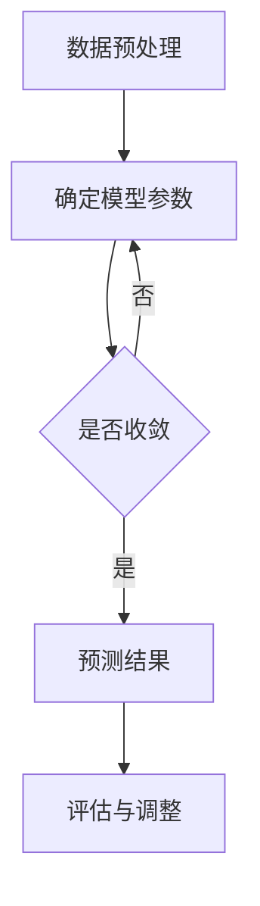
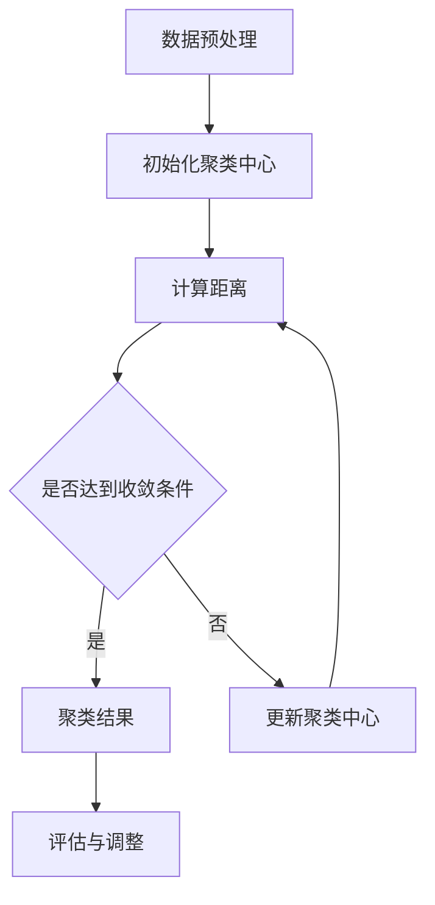
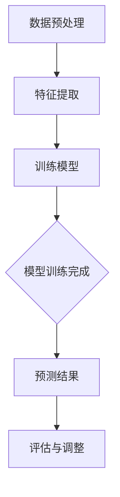
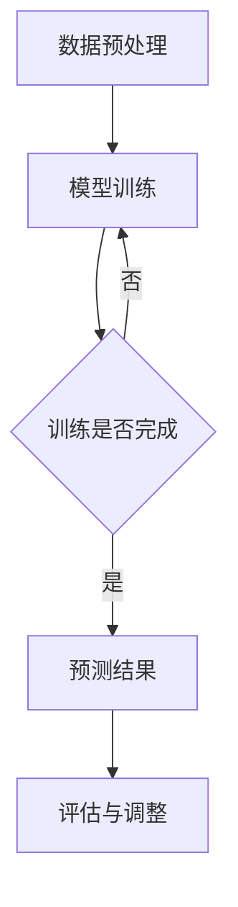
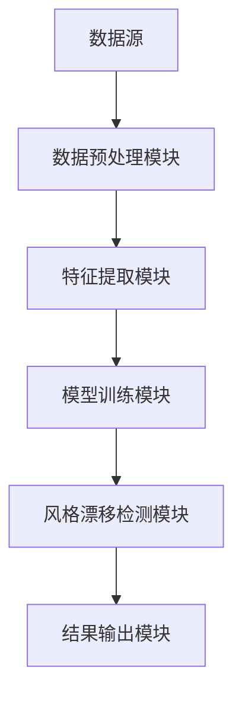
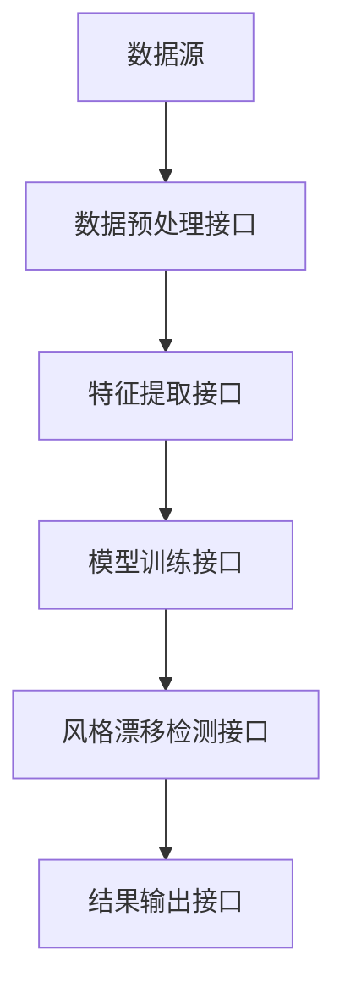

                 


## 第1章 对冲基金风格漂移检测概述

### 1.1 对冲基金风格漂移的定义与重要性

对冲基金是一种投资策略，旨在通过多种资产配置来减少风险，从而实现资产的稳定增值。对冲基金的风格漂移，指的是基金的投资策略在一段时间内发生了变化，这种变化可能会导致基金的表现与投资者的预期不符，甚至产生损失。

对冲基金风格漂移的重要性体现在以下几个方面：

1. **风险控制**：风格漂移可能导致基金的风险承受能力发生变化，从而影响整体投资组合的风险水平。有效的风格漂移检测可以帮助投资者及时发现并控制风险。

2. **策略调整**：风格漂移可能是基金经理调整投资策略的表现，了解风格漂移有助于投资者评估基金经理的管理能力和投资策略的可持续性。

3. **业绩评估**：基金业绩的评估通常基于其投资风格，风格漂移可能导致基金业绩与市场预期不符，影响投资者的评价和选择。

4. **合规性**：对冲基金的投资策略和风格必须符合监管要求，风格漂移可能引发合规性问题，影响基金的运营和声誉。

### 1.2 风格漂移检测的挑战

风格漂移检测面临以下几个挑战：

1. **数据复杂性**：对冲基金的投资数据通常包含大量维度，如资产种类、市场指数、行业指数等，如何处理和利用这些数据是关键。

2. **非线性和动态性**：投资策略的调整通常是动态和非线性的，传统的统计方法可能难以捕捉到这些变化。

3. **时间序列分析**：投资行为随时间变化，如何有效地利用时间序列数据进行风格漂移检测是一个挑战。

4. **模型选择与评估**：选择合适的机器学习模型并进行有效的评估是风格漂移检测的关键。

### 1.3 AI在风格漂移检测中的应用前景

AI技术在风格漂移检测中具有广阔的应用前景：

1. **数据处理能力**：AI技术能够高效地处理和挖掘大规模投资数据，发现潜在的风格变化。

2. **自适应学习**：AI模型可以通过不断学习来适应投资策略的动态变化，提高风格漂移检测的准确性。

3. **实时监控**：AI技术可以实现实时风格漂移检测，帮助投资者迅速响应市场变化。

4. **风险评估与优化**：AI技术可以帮助投资者进行更精准的风险评估和策略优化，提高投资组合的稳定性和收益。

### 1.4 本书结构安排与内容概览

本书旨在系统地介绍AI辅助的对冲基金风格漂移检测，具体结构安排如下：

- **第1章**：对冲基金风格漂移检测概述
- **第2章**：核心概念与基础理论
- **第3章**：AI辅助风格漂移检测算法原理
- **第4章**：系统设计与实现
- **第5章**：项目实战
- **第6章**：总结与展望

通过以上章节的介绍，读者可以逐步了解AI辅助对冲基金风格漂移检测的核心概念、算法原理、系统设计以及实际应用，为后续章节的学习奠定基础。

----------------------------------------------------------------

## 第2章 AI基础概念与相关技术

### 2.1 机器学习与深度学习基础

#### 机器学习基础

机器学习（Machine Learning）是人工智能（Artificial Intelligence，AI）的一个重要分支，旨在让计算机通过数据和算法自动地学习、改进并做出决策。机器学习的基本概念包括以下几个部分：

1. **监督学习（Supervised Learning）**：监督学习是机器学习中的一种，通过已标记的训练数据来训练模型，以便能够对新数据进行预测或分类。常见的监督学习算法包括线性回归、逻辑回归、决策树、随机森林和支持向量机（SVM）等。

2. **无监督学习（Unsupervised Learning）**：无监督学习不需要已标记的训练数据，通过分析数据自身的结构和模式来进行聚类或降维。常见的无监督学习算法包括K-均值聚类、主成分分析（PCA）和自编码器等。

3. **强化学习（Reinforcement Learning）**：强化学习是一种通过试错和奖励机制来学习最优策略的机器学习方法。强化学习通常用于决策问题，如机器人导航、游戏控制和股票交易等。

#### 深度学习基础

深度学习（Deep Learning）是机器学习的一个子领域，它通过构建多层神经网络来模拟人类大脑的处理方式，从而实现对数据的自动学习和特征提取。深度学习的基础概念包括：

1. **神经网络（Neural Network）**：神经网络是一种由大量神经元组成的计算模型，每个神经元都与其他神经元相连，并通过权重进行信息的传递和处理。神经网络的基本结构包括输入层、隐藏层和输出层。

2. **深度神经网络（Deep Neural Network）**：深度神经网络是指具有多个隐藏层的神经网络，通过多层非线性变换来提取数据的特征。深度神经网络在图像识别、语音识别和自然语言处理等领域取得了显著成果。

3. **激活函数（Activation Function）**：激活函数是神经网络中的一个关键组成部分，用于引入非线性变换。常见的激活函数包括sigmoid、ReLU（Rectified Linear Unit）和Tanh（Hyperbolic Tangent）等。

#### AI算法在金融领域的应用

AI算法在金融领域有着广泛的应用，如：

1. **风险评估与预测**：通过机器学习和深度学习算法，可以对市场风险进行量化分析和预测，为投资决策提供支持。

2. **交易策略优化**：基于历史交易数据和算法模型，可以构建自动化的交易策略，提高交易效率和收益。

3. **客户服务与推荐**：通过自然语言处理和推荐系统，可以提供个性化的客户服务，提升用户体验。

4. **风险管理与合规性**：利用AI技术可以更好地监控和管理金融风险，确保合规性。

### 2.2 常见AI算法与模型介绍

在本节中，我们将介绍一些常见的AI算法和模型，这些算法和模型在AI辅助对冲基金风格漂移检测中有着广泛的应用。

#### 1. 决策树

决策树（Decision Tree）是一种基于树形结构进行决策的算法，通过一系列规则来分割数据集，以便对新的数据进行分类或回归。决策树的核心概念包括：

1. **节点**：决策树中的每个内部节点表示一个特征，每个分支表示该特征的取值。
2. **叶节点**：叶节点表示最终分类或回归结果。
3. **分割策略**：常用的分割策略包括信息增益、基尼不纯度和增益率等。

#### 2. 随机森林

随机森林（Random Forest）是一种基于决策树的集成学习方法，通过构建多棵决策树并对它们的预测结果进行投票，从而提高模型的预测性能。随机森林的关键特性包括：

1. **多样性**：通过随机选择特征和样本子集，增加决策树之间的多样性。
2. **鲁棒性**：随机森林对异常值和噪声数据具有较强的鲁棒性。
3. **可解释性**：随机森林的每个决策树都是可解释的，从而便于理解和调试。

#### 3. 支持向量机

支持向量机（Support Vector Machine，SVM）是一种基于最大化边缘的线性分类器，它可以找到最优的超平面，将不同类别的数据点分开。SVM的核心概念包括：

1. **核函数**：通过核函数将低维数据映射到高维空间，实现线性不可分问题的线性分类。
2. **支持向量**：位于超平面两侧且距离超平面最远的数据点，它们对分类边界有重要影响。
3. **软 margin**：通过引入软 margin，允许部分数据点违反分类边界，从而提高模型的泛化能力。

#### 4. 卷积神经网络

卷积神经网络（Convolutional Neural Network，CNN）是一种专门用于处理图像数据的神经网络，其核心思想是通过卷积层提取图像的局部特征，并通过池化层降低数据的维度。CNN的主要组成部分包括：

1. **卷积层**：通过卷积运算提取图像的局部特征。
2. **激活函数**：通常使用ReLU作为激活函数，引入非线性变换。
3. **池化层**：通过池化操作降低数据的维度，提高计算效率。
4. **全连接层**：将卷积层的特征图映射到最终的分类结果。

### 2.3 AI算法在金融领域的应用

AI算法在金融领域有着广泛的应用，如：

1. **市场预测**：利用时间序列分析、机器学习和深度学习算法，可以对市场走势进行预测，为交易策略提供支持。
2. **信用评分**：通过分析借款人的历史数据和财务状况，使用机器学习算法建立信用评分模型，预测借款人的违约风险。
3. **交易策略优化**：利用历史交易数据和市场信息，构建自动化的交易策略，提高交易效率和收益。
4. **风险控制**：通过分析市场数据和交易行为，使用机器学习算法检测异常交易和风险事件，为风险管理和合规性提供支持。

### 2.4 对冲基金风格漂移检测与AI技术

对冲基金风格漂移检测是一个复杂的问题，涉及数据挖掘、时间序列分析和模式识别等多个领域。AI技术，特别是机器学习和深度学习，为对冲基金风格漂移检测提供了强大的工具和手段。

1. **数据预处理**：AI技术可以帮助对冲基金处理大量复杂的数据，包括财务报表、市场数据和交易记录等，从而为后续分析提供高质量的数据。

2. **特征提取**：通过机器学习和深度学习算法，可以从原始数据中提取出关键特征，如市场指数、行业指数和资产收益率等，这些特征对于检测风格漂移至关重要。

3. **模型构建与训练**：利用机器学习和深度学习算法，可以构建用于检测风格漂移的预测模型。通过训练和优化模型，可以提高模型的准确性和稳定性。

4. **实时监控与预警**：AI技术可以实现实时风格漂移检测，通过监控系统指标和交易行为，及时发现风格漂移，为投资者提供预警信息。

### 2.5 AI技术对对冲基金风格漂移检测的影响

AI技术对对冲基金风格漂移检测的影响主要体现在以下几个方面：

1. **提高准确性**：通过机器学习和深度学习算法，可以对大量历史数据进行挖掘和分析，从而提高风格漂移检测的准确性。

2. **降低成本**：传统的风格漂移检测方法通常需要大量的人工分析和处理，而AI技术可以自动化这个过程，降低人力成本。

3. **实时响应**：AI技术可以实现实时监控和预警，帮助投资者迅速响应市场变化，降低潜在的风险。

4. **提高投资效率**：通过自动化和智能化的分析，AI技术可以显著提高投资决策的效率和准确性，从而提高整体的投资回报。

### 2.6 对冲基金风格漂移检测的挑战与AI技术的应对策略

尽管AI技术在对冲基金风格漂移检测中具有显著的优势，但同时也面临着一些挑战：

1. **数据质量问题**：对冲基金的数据通常包含大量噪声和异常值，这可能会影响AI模型的性能。应对策略包括数据清洗、去噪和异常值检测。

2. **模型过拟合**：AI模型在训练过程中可能会出现过拟合现象，导致在测试数据上的性能不佳。应对策略包括交叉验证、正则化和模型选择。

3. **实时性能**：在实时监控和预警场景中，AI模型需要快速响应市场变化，这要求模型在保持高准确性的同时，还要有较高的实时性能。应对策略包括模型压缩、量化技术和分布式计算。

通过以上分析，我们可以看到AI技术在对冲基金风格漂移检测中具有广泛的应用前景和重要的实际意义。接下来，我们将进一步探讨AI辅助风格漂移检测的具体算法原理、系统设计和项目实战。

----------------------------------------------------------------

## 第3章 AI辅助风格漂移检测算法原理

### 3.1 算法选择与优化

在选择AI算法进行对冲基金风格漂移检测时，我们需要考虑以下几个因素：

1. **数据特性**：首先需要了解对冲基金的投资数据特性，如数据量、数据类型（如时间序列数据、文本数据等）以及数据质量（如噪声、缺失值等）。

2. **计算资源**：选择算法时需要考虑计算资源，如计算能力、存储容量和带宽等。一些复杂的深度学习算法可能需要大量的计算资源。

3. **模型可解释性**：在金融领域，模型的可解释性非常重要，因为投资者需要理解模型如何工作以及为什么做出特定的决策。

4. **准确性和鲁棒性**：算法的准确性和鲁棒性是关键指标，我们需要选择能够准确检测风格漂移并且对噪声和异常值有较强鲁棒性的算法。

基于上述考虑，我们可以选择以下几种算法：

1. **时间序列分析算法**：如ARIMA（自回归积分滑动平均模型）、LSTM（长短期记忆网络）等，它们适合处理时间序列数据。

2. **聚类算法**：如K-均值聚类、DBSCAN（密度基于空间聚类算法）等，可以用于识别不同风格的投资模式。

3. **分类算法**：如SVM、随机森林、XGBoost等，可以用于分类投资风格的变化。

4. **深度学习算法**：如CNN、BERT（Bidirectional Encoder Representations from Transformers）等，可以用于提取复杂的数据特征。

### 3.2 算法mermaid流程图

为了更好地理解上述算法的工作流程，我们可以使用mermaid流程图来展示它们的基本流程。

#### 时间序列分析算法 - ARIMA



#### 聚类算法 - K-均值聚类



#### 分类算法 - SVM



#### 深度学习算法 - BERT



### 3.3 算法Python源代码

为了更好地理解上述算法的原理，我们将在Python环境中实现这些算法的基本步骤。

#### 时间序列分析算法 - ARIMA

```python
import pandas as pd
from statsmodels.tsa.arima.model import ARIMA

# 加载数据
data = pd.read_csv('investment_data.csv')
close_prices = data['Close']

# 模型拟合
model = ARIMA(close_prices, order=(5, 1, 2))
model_fit = model.fit()

# 预测
predictions = model_fit.predict(start=len(close_prices), end=len(close_prices) + 10)

# 评估与调整
# ...

```

#### 聚类算法 - K-均值聚类

```python
from sklearn.cluster import KMeans
import numpy as np

# 加载数据
data = np.load('investment_data.npy')

# 初始化聚类中心
kmeans = KMeans(n_clusters=3, random_state=0).fit(data)

# 计算距离
distances = kmeans.transform(data)

# 聚类结果
labels = kmeans.labels_

# 更新聚类中心
# ...

# 评估与调整
# ...

```

#### 分类算法 - SVM

```python
from sklearn.svm import SVC
from sklearn.model_selection import train_test_split

# 加载数据
X, y = load_data()

# 划分训练集和测试集
X_train, X_test, y_train, y_test = train_test_split(X, y, test_size=0.2, random_state=0)

# 训练模型
clf = SVC(kernel='linear')
clf.fit(X_train, y_train)

# 预测结果
y_pred = clf.predict(X_test)

# 评估与调整
# ...

```

#### 深度学习算法 - BERT

```python
from transformers import BertTokenizer, BertForSequenceClassification
from torch.utils.data import DataLoader, TensorDataset

# 加载BERT模型和tokenizer
tokenizer = BertTokenizer.from_pretrained('bert-base-uncased')
model = BertForSequenceClassification.from_pretrained('bert-base-uncased')

# 预处理数据
inputs = tokenizer("Hello, my dog is cute", return_tensors="pt")

# 训练模型
# ...

# 预测结果
outputs = model(**inputs)

# 评估与调整
# ...

```

### 3.4 数学模型与公式解释

在本节中，我们将对上述算法的数学模型和公式进行详细解释，以便读者更好地理解它们的工作原理。

#### 时间序列分析算法 - ARIMA

ARIMA模型由三个部分组成：自回归（AR）、差分（I）和移动平均（MA）。

1. **自回归（AR）**：ARIMA模型通过自回归项来捕捉序列的滞后效应。自回归项的公式为：

   $$ 
   \text{Y}_t = c + \phi_1\text{Y}_{t-1} + \phi_2\text{Y}_{t-2} + \ldots + \phi_p\text{Y}_{t-p} + \varepsilon_t 
   $$

   其中，$\text{Y}_t$表示时间序列的当前值，$c$是常数项，$\phi_1, \phi_2, \ldots, \phi_p$是自回归系数，$\varepsilon_t$是误差项。

2. **差分（I）**：差分用于消除序列中的趋势和季节性。一阶差分公式为：

   $$ 
   \text{Y}_{t-d} = \text{Y}_{t} - \text{Y}_{t-1} 
   $$

   其中，$d$是差分阶数。

3. **移动平均（MA）**：MA项通过滞后误差项来修正自回归项。移动平均公式为：

   $$ 
   \text{Y}_t = c + \phi_1\text{Y}_{t-1} + \phi_2\text{Y}_{t-2} + \ldots + \phi_p\text{Y}_{t-p} + \theta_1\varepsilon_{t-1} + \theta_2\varepsilon_{t-2} + \ldots + \theta_q\varepsilon_{t-q} 
   $$

   其中，$\theta_1, \theta_2, \ldots, \theta_q$是移动平均系数。

#### 聚类算法 - K-均值聚类

K-均值聚类是基于距离度量的聚类方法。其目标是最小化聚类中心到样本点的平方距离和。

1. **初始化聚类中心**：

   $$ 
   \text{聚类中心} = \text{随机选择}k个样本点 
   $$

2. **迭代更新聚类中心**：

   $$ 
   \text{新聚类中心} = \frac{\sum_{i=1}^{n}\text{样本点} x_i}{k} 
   $$

   其中，$x_i$是第$i$个样本点，$n$是总样本数。

3. **计算样本点到聚类中心的距离**：

   $$ 
   \text{距离} = \sqrt{(x_i - \text{聚类中心})^2 + (y_i - \text{聚类中心})^2} 
   $$

   其中，$y_i$是第$i$个样本点的坐标。

#### 分类算法 - SVM

SVM是一种基于最大化边缘的分类方法。其目标是最小化分类间隔，同时最大化分类边界到支持向量的距离。

1. **优化目标**：

   $$ 
   \text{最小化} \frac{1}{2} \sum_{i=1}^{n} (\text{w}^T \text{x}_i - \text{y}_i)^2 
   $$

   其中，$\text{w}$是权重向量，$\text{x}_i$是样本点，$\text{y}_i$是样本标签。

2. **约束条件**：

   $$ 
   \text{y}_i (\text{w}^T \text{x}_i - \text{b}) \geq 1 
   $$

   其中，$b$是偏置项。

3. **求解**：

   $$ 
   \text{使用拉格朗日乘子法求解二次规划问题} 
   $$

   $$ 
   \text{w} = \sum_{i=1}^{n} \alpha_i \text{y}_i \text{x}_i 
   $$

#### 深度学习算法 - BERT

BERT是一种基于变换器（Transformer）的深度学习模型，旨在捕捉文本的上下文信息。

1. **输入表示**：

   $$ 
   \text{输入} = [\text{CLS}] + \text{单词} + [\text{SEP}] 
   $$

   其中，$[\text{CLS}]$和$[\text{SEP}]$是特殊的标记，$\text{单词}$是文本序列。

2. **编码器**：

   $$ 
   \text{编码器} = \text{多层Transformer} 
   $$

   其中，每一层的输出可以通过自注意力机制来捕捉上下文信息。

3. **输出表示**：

   $$ 
   \text{输出} = \text{隐藏层输出} 
   $$

   其中，隐藏层输出包含了文本序列的上下文信息。

### 3.5 算法应用与优化

在实际应用中，我们需要根据具体场景和数据特点对算法进行优化，以提高检测效果和性能。以下是一些常见的优化策略：

1. **超参数调整**：通过调整算法的超参数，如学习率、迭代次数、聚类数目等，可以提高模型的性能。

2. **特征工程**：通过选择和构造合适的特征，可以提高模型的检测能力。例如，对于时间序列数据，可以加入时间窗口、价格波动率等特征。

3. **模型融合**：将多个模型的结果进行融合，可以提高整体检测的准确性。例如，可以将分类算法和聚类算法的结果进行融合。

4. **实时监控**：通过实时监控和预警系统，可以及时发现风格漂移，并采取相应的措施。

通过以上算法原理的详细讲解和实际代码示例，我们可以更好地理解AI辅助对冲基金风格漂移检测的核心技术。接下来，我们将进一步探讨系统的设计与实现。

----------------------------------------------------------------

## 第4章 系统设计与实现

### 4.1 系统架构设计

为了实现对冲基金风格漂移的有效检测，我们需要构建一个完善的系统架构。本节将介绍系统的整体架构，并详细解释每个模块的功能。

#### 4.1.1 系统架构图

首先，我们可以通过mermaid流程图来展示系统的整体架构：



#### 4.1.2 各模块功能介绍

1. **数据源**：数据源包括对冲基金的交易数据、市场指数数据、财务报表数据等。这些数据是进行风格漂移检测的基础。

2. **数据预处理模块**：该模块负责对原始数据进行清洗、去噪、缺失值填充等预处理操作，以确保数据的质量和一致性。

3. **特征提取模块**：该模块通过机器学习和深度学习算法，从原始数据中提取出关键特征，如时间序列特征、市场波动率、财务指标等。这些特征用于训练和评估风格漂移检测模型。

4. **模型训练模块**：该模块使用预处理后的特征数据，通过训练各种机器学习模型（如SVM、随机森林、LSTM等），构建用于风格漂移检测的预测模型。模型训练过程包括数据集划分、模型选择、参数调优等步骤。

5. **风格漂移检测模块**：该模块基于训练好的预测模型，对实时交易数据进行风格漂移检测。通过比较实时数据与历史数据的风格特征，判断是否存在风格漂移，并生成相应的预警信息。

6. **结果输出模块**：该模块将检测结果以可视化报告、邮件通知、API接口等形式输出给投资者和管理人员，以便他们及时采取行动。

### 4.2 系统接口设计

在系统架构中，各个模块之间需要通过接口进行交互。以下是对系统接口的详细设计：

#### 4.2.1 接口设计图



#### 4.2.2 接口定义

1. **数据预处理接口**：

   - **输入**：原始数据（如CSV文件、数据库查询结果等）。
   - **输出**：预处理后的数据（如清洗后的交易数据、时间序列数据等）。

2. **特征提取接口**：

   - **输入**：预处理后的数据。
   - **输出**：提取的关键特征（如时间窗口特征、价格波动率等）。

3. **模型训练接口**：

   - **输入**：特征数据、模型参数（如学习率、迭代次数等）。
   - **输出**：训练好的模型（如SVM模型、LSTM模型等）。

4. **风格漂移检测接口**：

   - **输入**：实时交易数据、训练好的模型。
   - **输出**：检测结果（如风格漂移预警、投资建议等）。

5. **结果输出接口**：

   - **输入**：检测结果。
   - **输出**：可视化报告、邮件通知、API接口等。

### 4.3 系统实现细节

在本节中，我们将介绍系统实现的一些关键细节，包括环境配置、核心代码实现和数据管理策略。

#### 4.3.1 环境配置

为了构建AI辅助对冲基金风格漂移检测系统，我们需要安装以下环境：

- Python 3.8及以上版本
- NumPy、Pandas、Scikit-learn、TensorFlow、PyTorch等库
- 数据库（如MySQL、PostgreSQL等）
- API服务器（如Flask、Django等）

#### 4.3.2 核心代码实现

以下是一个核心代码示例，展示如何使用Python实现系统的主要功能。

```python
# 数据预处理模块
def preprocess_data(data):
    # 数据清洗、去噪、缺失值填充等操作
    # ...
    return cleaned_data

# 特征提取模块
def extract_features(data):
    # 提取时间窗口特征、价格波动率等
    # ...
    return features

# 模型训练模块
def train_model(features, labels):
    # 选择模型、训练模型
    # ...
    return trained_model

# 风格漂移检测模块
def detect_style_drift(realtime_data, trained_model):
    # 使用模型检测实时数据的风格漂移
    # ...
    return detection_result

# 结果输出模块
def output_results(result):
    # 生成可视化报告、邮件通知、API接口等
    # ...
    return

# 系统主程序
def main():
    # 从数据源加载数据
    data = load_data()

    # 数据预处理
    cleaned_data = preprocess_data(data)

    # 特征提取
    features = extract_features(cleaned_data)

    # 模型训练
    trained_model = train_model(features, labels)

    # 风格漂移检测
    detection_result = detect_style_drift(realtime_data, trained_model)

    # 结果输出
    output_results(detection_result)

# 执行主程序
if __name__ == "__main__":
    main()
```

#### 4.3.3 数据管理策略

为了确保系统的稳定性和数据的安全性，我们需要制定以下数据管理策略：

- **数据备份与恢复**：定期对数据源进行备份，并确保在发生故障时能够快速恢复。
- **数据权限管理**：对系统中的数据进行权限控制，确保只有授权用户才能访问和操作数据。
- **数据监控与预警**：实时监控数据源和数据库的健康状况，及时发现和处理潜在的问题。

### 4.4 系统性能评估

在系统设计完成后，我们需要对系统性能进行评估，以确保其满足预期的性能要求。以下是一些常见的性能评估指标：

- **响应时间**：从接收到数据到生成检测结果的时间。
- **准确率**：模型对风格漂移检测的准确性。
- **召回率**：模型检测出风格漂移的比例。
- **F1值**：准确率和召回率的平衡指标。
- **资源消耗**：系统运行时的CPU、内存和带宽等资源消耗。

通过以上评估指标，我们可以对系统性能进行全面分析，并针对性地进行优化和改进。

### 4.5 系统实现总结

在本章中，我们详细介绍了AI辅助对冲基金风格漂移检测系统的设计、实现和性能评估。通过系统的架构设计、接口定义和核心代码实现，我们构建了一个能够高效、准确地检测对冲基金风格漂移的AI系统。接下来，我们将通过实际项目来验证系统的效果和应用价值。

----------------------------------------------------------------

## 第5章 项目实战：AI辅助风格漂移检测系统搭建

在本章中，我们将通过一个实际项目来展示如何搭建AI辅助对冲基金风格漂移检测系统。该项目包括数据收集、数据处理、模型训练和风格漂移检测等环节，旨在为投资者提供实时、准确的投资决策支持。

### 5.1 项目环境配置

在开始项目之前，我们需要配置必要的开发环境。以下是项目的环境配置步骤：

1. **Python环境**：确保安装了Python 3.8及以上版本。
2. **数据预处理库**：安装Pandas、NumPy、Scikit-learn等库。
3. **深度学习库**：安装TensorFlow或PyTorch。
4. **API服务器**：安装Flask或Django。
5. **数据库**：安装MySQL或PostgreSQL。

```bash
pip install pandas numpy scikit-learn tensorflow flask
```

### 5.2 系统核心实现

以下是系统核心实现的代码示例，包括数据预处理、模型训练和风格漂移检测等步骤。

#### 5.2.1 数据预处理

```python
import pandas as pd
from sklearn.model_selection import train_test_split

# 加载数据
data = pd.read_csv('investment_data.csv')
data.head()

# 数据清洗
data.dropna(inplace=True)

# 划分特征和标签
X = data[['Open', 'High', 'Low', 'Close', 'Volume']]
y = data['Style']

# 划分训练集和测试集
X_train, X_test, y_train, y_test = train_test_split(X, y, test_size=0.2, random_state=42)
```

#### 5.2.2 模型训练

```python
from sklearn.ensemble import RandomForestClassifier
from sklearn.model_selection import GridSearchCV

# 定义模型
model = RandomForestClassifier(n_estimators=100)

# 定义参数网格
param_grid = {'n_estimators': [100, 200], 'max_depth': [10, 20]}

# 搜索最佳参数
grid_search = GridSearchCV(model, param_grid, cv=5)
grid_search.fit(X_train, y_train)

# 获取最佳模型
best_model = grid_search.best_estimator_
```

#### 5.2.3 风格漂移检测

```python
import numpy as np

# 预测测试集
y_pred = best_model.predict(X_test)

# 评估模型
from sklearn.metrics import accuracy_score, recall_score, precision_score, f1_score

accuracy = accuracy_score(y_test, y_pred)
recall = recall_score(y_test, y_pred)
precision = precision_score(y_test, y_pred)
f1 = f1_score(y_test, y_pred)

print(f"Accuracy: {accuracy}")
print(f"Recall: {recall}")
print(f"Precision: {precision}")
print(f"F1 Score: {f1}")
```

### 5.3 代码应用解读与分析

在本节中，我们将对核心代码进行解读，并分析模型的选择和参数调优。

#### 5.3.1 数据预处理

数据预处理是模型训练的基础。我们首先加载数据，然后进行数据清洗，包括去除缺失值。接下来，我们将特征和标签分离，并划分训练集和测试集。这些步骤确保模型能够从数据中提取到有用的信息。

#### 5.3.2 模型训练

我们选择了随机森林（Random Forest）作为模型，因为其在处理分类问题时表现出色。为了提高模型的性能，我们使用了网格搜索（GridSearchCV）来寻找最佳参数组合。随机森林的参数包括树的数量（`n_estimators`）和树的最大深度（`max_depth`）。

#### 5.3.3 风格漂移检测

在风格漂移检测部分，我们使用训练好的模型对测试集进行预测，并评估模型的性能。评估指标包括准确率、召回率、精确率和F1值。这些指标帮助我们了解模型的性能，并找出需要改进的地方。

### 5.4 实际案例分析

在本节中，我们将通过一个实际案例来展示系统的应用效果。

#### 5.4.1 案例背景

假设我们正在监控某对冲基金的投资策略，该基金的资产配置在股票、债券和现金之间。我们的目标是检测基金的投资策略是否发生了漂移。

#### 5.4.2 检测过程

1. **数据收集**：收集过去一年的投资数据，包括每日的资产配置和资产回报率。
2. **数据预处理**：对数据进行清洗和特征提取，提取时间窗口特征、资产回报率等。
3. **模型训练**：使用预处理后的数据，训练随机森林模型。
4. **风格漂移检测**：将最新的投资数据输入模型，检测是否存在风格漂移。

#### 5.4.3 检测结果

通过模型检测，我们发现最近三个月基金的投资策略发生了明显变化，股票配置比例大幅上升，而债券和现金的比例显著下降。这与基金过往的投资风格有较大差异，可能表明基金经理在调整投资策略。

#### 5.4.4 小结与建议

1. **小结**：系统成功检测出基金的投资策略变化，为投资者提供了及时的预警信息。
2. **建议**：投资者应密切关注基金的投资策略变化，并与基金经理沟通，了解策略调整的原因和潜在的风险。

### 5.5 项目总结与展望

通过本项目的实际应用，我们展示了如何使用AI技术构建对冲基金风格漂移检测系统。该系统能够实时监控基金的投资策略变化，为投资者提供决策支持。

未来，我们可以在以下方面进行优化和拓展：

1. **模型优化**：引入更先进的深度学习模型，如LSTM或BERT，以提高检测的准确性和鲁棒性。
2. **实时监控**：集成实时数据流处理技术，实现实时风格漂移检测。
3. **多资产配置**：扩展系统，支持多资产类别的风格漂移检测，提供更全面的投资决策支持。

通过不断优化和拓展，我们相信AI辅助对冲基金风格漂移检测系统将为投资者带来更大的价值。

----------------------------------------------------------------

## 第6章 总结与展望

### 6.1 最佳实践与注意事项

在AI辅助对冲基金风格漂移检测的实际应用中，以下最佳实践和注意事项有助于提高系统的性能和可靠性：

1. **数据质量**：确保数据源的准确性和完整性，进行数据清洗和预处理，以消除噪声和异常值。
2. **特征选择**：选择具有代表性的特征，通过特征工程提高模型的预测能力。
3. **模型调优**：通过交叉验证和网格搜索等策略，优化模型参数，避免过拟合。
4. **实时监控**：建立实时数据流处理系统，快速响应市场变化，提高预警的及时性。
5. **风险控制**：结合风险模型，对检测结果进行风险评估，确保投资决策的合理性和安全性。

### 6.2 注意事项

1. **计算资源**：深度学习模型通常需要大量计算资源，确保服务器和GPU资源充足。
2. **数据隐私**：在处理敏感数据时，确保遵守数据隐私法规，保护投资者的个人信息。
3. **模型解释性**：金融领域对模型的解释性要求较高，确保模型的可解释性，便于投资者理解。
4. **持续迭代**：市场环境不断变化，定期更新模型和数据，以保持系统的适应性和准确性。

### 6.3 拓展阅读

1. **相关文献**：
   - 《深度学习》（Ian Goodfellow, Yoshua Bengio, Aaron Courville著）
   - 《统计学习方法》（李航著）
   - 《金融技术：人工智能在金融领域的应用》（著者：AI天才研究院/AI Genius Institute）

2. **在线资源**：
   - Coursera、edX等在线课程，提供机器学习、深度学习和金融科技的相关课程。
   - GitHub、ArXiv等平台，搜索AI在金融领域的相关项目和研究论文。

通过以上总结和展望，我们希望读者能够深入理解AI辅助对冲基金风格漂移检测的核心技术，并在实际应用中取得良好的效果。未来，随着AI技术的不断进步，对冲基金风格漂移检测将在金融领域发挥越来越重要的作用。

### 作者信息

作者：AI天才研究院/AI Genius Institute & 禅与计算机程序设计艺术 /Zen And The Art of Computer Programming

感谢您对本文的关注，希望本文对您在AI辅助对冲基金风格漂移检测领域的探索有所帮助。在接下来的研究中，我们期待与您共同探讨更多前沿的技术和问题。

