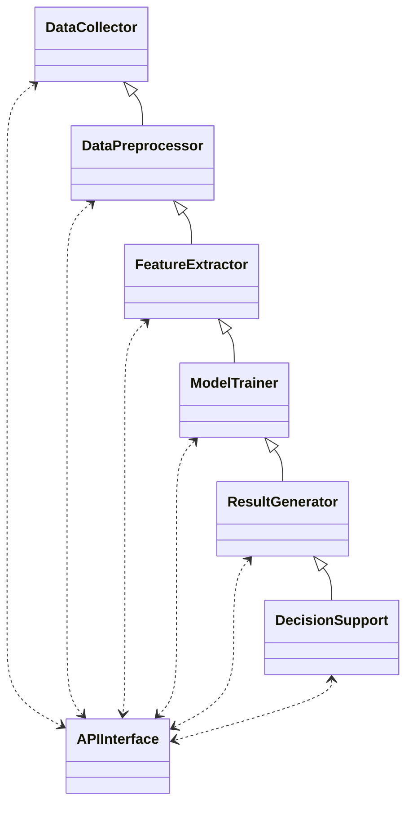
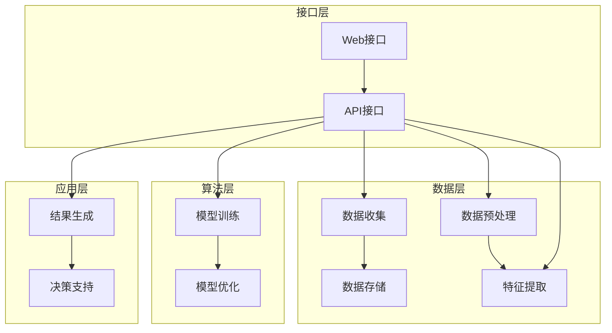

                 

# AI辅助的并购交易分析

关键词：AI辅助、并购交易分析、机器学习、数据挖掘、预测模型

摘要：随着企业并购活动的日益频繁，传统的人工并购交易分析方式已难以满足快速决策的需求。本文将介绍如何利用AI技术，特别是机器学习和数据挖掘技术，辅助进行并购交易分析，提高分析效率和准确性，为企业提供更有价值的决策支持。

## 第一部分：背景介绍

### 核心概念

#### 并购交易分析

并购交易分析是指对目标公司进行全面的评估，包括财务状况、市场竞争力、管理团队、行业趋势等，以确定是否值得投资或收购。这一过程涉及大量的数据和信息处理，传统的分析方法通常依赖于人工经验和专业判断。

#### AI辅助

AI辅助是指利用人工智能技术，如机器学习、自然语言处理、数据挖掘等，提高并购交易分析的效率和准确性。AI技术能够在数据量庞大的情况下，快速处理和分析信息，减少人为错误，提高分析质量。

### 问题背景

随着全球经济的不断发展，企业之间的并购活动日益频繁。然而，并购交易存在较高的风险，如信息不对称、市场波动、政策变化等，这些因素可能导致交易失败或产生不良影响。为了降低风险、提高成功率，企业需要对并购交易进行全面、深入的分析。

传统并购交易分析主要依赖于人工经验和专业判断，存在以下问题：

1. **效率低下**：人工分析需要大量时间和精力，难以满足快速决策的需求。

2. **主观性较强**：分析结果可能受到分析师个人经验、观点和偏见的影响，导致判断不准确。

3. **信息不全面**：人工分析难以获取和处理大量数据，可能导致分析结果不全面。

为了解决上述问题，AI辅助的并购交易分析应运而生。通过利用人工智能技术，可以提高并购交易分析的效率、准确性和全面性，为企业提供更有价值的决策支持。

### 问题解决

AI辅助的并购交易分析主要包括以下几个步骤：

1. **数据收集与预处理**：收集与目标公司相关的各种数据，如财务报表、市场报告、新闻报道、社交媒体等，并进行数据清洗、归一化和特征提取。

2. **特征工程**：根据并购交易的特点，提取关键特征，如财务指标、市场表现、管理层业绩等，为后续分析提供基础。

3. **模型训练与优化**：利用机器学习算法，如决策树、支持向量机、神经网络等，对特征进行训练和优化，构建预测模型。

4. **分析结果生成**：将目标公司的特征输入到训练好的模型中，生成分析结果，如并购风险、投资价值等。

5. **结果解读与决策支持**：对分析结果进行解读，为决策者提供决策支持，如是否进行并购、并购策略等。

### 边界与外延

#### 边界

AI辅助的并购交易分析主要关注目标公司的财务状况、市场竞争力、管理团队、行业趋势等方面，不包括法律、税务等非技术性问题。

#### 外延

AI辅助的并购交易分析不仅可以应用于企业并购，还可以应用于企业投资、重组、战略规划等领域。

### 概念结构与核心要素组成

AI辅助的并购交易分析主要包括以下核心要素：

1. **数据来源**：财务报表、市场报告、新闻报道、社交媒体等。

2. **数据预处理**：数据清洗、归一化、特征提取等。

3. **机器学习算法**：决策树、支持向量机、神经网络等。

4. **特征工程**：提取关键特征，如财务指标、市场表现、管理层业绩等。

5. **预测模型**：构建并优化预测模型，如并购风险、投资价值等。

6. **分析结果解读**：为决策者提供决策支持。

## 第二部分：核心概念与联系

### AI大模型

#### 概念

AI大模型（Large-scale Artificial Intelligence Models）是指具有大规模参数和广泛知识表示能力的人工智能模型，通常采用深度学习技术训练而成。这些模型在处理大规模数据和复杂任务时具有显著的优势。

#### 特点

1. **大规模参数**：AI大模型通常具有数十亿至数千亿个参数，可以处理海量数据。

2. **广泛知识表示**：AI大模型可以学习并表示丰富的知识，包括语言、图像、声音等。

3. **自适应能力**：AI大模型可以自适应不同任务和数据分布，提高模型泛化能力。

#### 与传统AI的区别

1. **能力范围**：传统AI通常专注于特定任务，如图像识别、自然语言处理等。而AI大模型具有更广泛的能力，可以处理多种任务。

2. **数据处理能力**：传统AI需要大量手动特征工程，而AI大模型可以通过自动特征提取，处理海量数据。

3. **训练时间**：传统AI训练时间较长，而AI大模型由于参数规模大，训练时间可能更长。

### 并购交易分析

#### 概念

并购交易分析是指对目标公司进行全面评估，以确定其是否值得投资或收购。这一过程需要综合考虑多个因素，包括财务状况、市场竞争力、管理团队、行业趋势等。

#### 特点

1. **全面性**：并购交易分析需要考虑多个方面，以全面评估目标公司的价值和风险。

2. **复杂性**：并购交易分析涉及大量数据和复杂关系，需要高效的分析方法和工具。

3. **风险性**：并购交易存在较高的风险，需要全面评估以降低风险。

#### AI辅助并购交易分析的优势

1. **效率提高**：AI辅助可以快速处理大量数据，提高分析效率。

2. **准确性提高**：AI辅助可以降低主观判断的影响，提高分析准确性。

3. **全面性提高**：AI辅助可以更全面地收集和处理信息，提高分析结果的全面性。

### 概念属性特征对比表格

| 特征              | AI大模型                          | 并购交易分析                           |
|-------------------|-----------------------------------|---------------------------------------|
| 参数规模          | 数十亿至数千亿参数                | 多方面因素评估                         |
| 知识表示能力      | 广泛知识表示能力                  | 全面性、复杂性、风险性                  |
| 自适应能力        | 高度自适应能力                    | 需要高效分析方法和工具                  |
| 数据处理能力      | 自动特征提取，处理海量数据        | 需要综合考虑多个因素，涉及大量数据     |
| 效率与准确性      | 提高分析效率和准确性              | 提高分析效率和准确性                   |
| 应用领域          | 处理大规模数据和复杂任务          | 企业并购、投资、重组、战略规划等领域   |

### ER实体关系图架构

```mermaid
erDiagram
  公司 -->|具有| 财务报表
  公司 -->|具有| 市场报告
  公司 -->|具有| 新闻报道
  公司 -->|具有| 社交媒体
  财务报表 ||--|由| 数据预处理
  财务报表 ||--|由| 特征工程
  财务报表 ||--|由| 模型训练
  财务报表 ||--|由| 分析结果生成
  数据预处理 ||--|由| 特征提取
  数据预处理 ||--|由| 特征工程
  数据预处理 ||--|由| 模型训练
  数据预处理 ||--|由| 分析结果生成
  特征工程 ||--|由| 模型训练
  特征工程 ||--|由| 分析结果生成
  模型训练 ||--|由| 分析结果生成
  分析结果生成 ||--|为| 决策支持
```

## 第三部分：算法原理讲解

### 机器学习算法

#### 决策树

**算法流程：**

1. **选择特征**：选择一个最优特征进行划分。

2. **计算信息增益**：计算每个特征划分后的信息增益，选择信息增益最大的特征。

3. **递归划分**：对选择的最优特征进行划分，生成新的子集。

4. **终止条件**：当子集数量达到预设阈值或信息增益小于预设阈值时，停止划分。

**数学模型：**

设数据集D，特征集F，增益函数G（D, A），选择特征A，满足：

$$G(D, A) = \sum_{i=1}^{n} \frac{|D_i|}{n} \cdot H(D_i)$$

其中，$D_i$ 为特征A取值相同的子集，$n$ 为子集数量，$H(D_i)$ 为子集D_i的信息熵。

#### 支持向量机

**算法流程：**

1. **选择核函数**：选择一个核函数，如线性核、多项式核、径向基核等。

2. **训练模型**：利用训练数据，通过求解二次规划问题，得到最优超平面。

3. **预测**：将新的数据输入到训练好的模型中，计算其与超平面的距离，进行分类。

**数学模型：**

设特征向量$x \in \mathbb{R}^d$，目标向量$y \in \{-1, 1\}$，权重向量$w \in \mathbb{R}^d$，偏置$b \in \mathbb{R}$，损失函数为 hinge 损失：

$$L(w, b) = \frac{1}{2} ||w||^2 + C \cdot \sum_{i=1}^{n} \max(0, 1 - y_i (w \cdot x_i + b))$$

其中，$C$ 为惩罚参数，$n$ 为样本数量。

**优化目标：**

$$\min_w, b \quad L(w, b)$$

#### 神经网络

**算法流程：**

1. **初始化参数**：随机初始化权重和偏置。

2. **前向传播**：计算输入通过网络得到的输出。

3. **反向传播**：计算损失函数关于参数的梯度，更新参数。

4. **迭代优化**：重复前向传播和反向传播，直到损失函数收敛。

**数学模型：**

设输入$x \in \mathbb{R}^d$，隐藏层激活函数$f$，输出层激活函数$g$，权重$W \in \mathbb{R}^{d \times h}$，偏置$b \in \mathbb{R}^h$，隐藏层输出$h = f(Wx + b)$，输出层输出$y = g(hW + b)$。

**损失函数**：

$$L(y, \hat{y}) = -\sum_{i=1}^{n} y_i \cdot \log(\hat{y}_i) + (1 - y_i) \cdot \log(1 - \hat{y}_i)$$

**优化目标**：

$$\min_W, b \quad L(y, \hat{y})$$

### 示例

#### 决策树示例

假设我们有一个数据集，包含以下特征：

- 财务指标1
- 财务指标2
- 市场表现
- 管理层业绩

我们使用决策树算法，根据这些特征对目标公司进行分类，判断是否值得收购。

1. **选择特征**：选择财务指标1作为划分特征。

2. **计算信息增益**：计算财务指标1的划分信息增益。

3. **递归划分**：根据财务指标1的划分，生成新的子集。

4. **终止条件**：当子集数量达到预设阈值或信息增益小于预设阈值时，停止划分。

假设经过划分后，得到以下子集：

- 子集1：财务指标1 <= 10
- 子集2：财务指标1 > 10

对于子集1，我们可以继续选择另一个特征进行划分，例如市场表现。对于子集2，我们也可以选择另一个特征进行划分，例如管理层业绩。

#### 支持向量机示例

假设我们有一个二分类问题，数据集包含以下特征：

- 财务指标1
- 财务指标2
- 市场表现
- 管理层业绩

我们使用支持向量机算法，将这些特征作为输入，进行分类。

1. **选择核函数**：选择线性核函数。

2. **训练模型**：利用训练数据，通过求解二次规划问题，得到最优超平面。

3. **预测**：将新的数据输入到训练好的模型中，计算其与超平面的距离，进行分类。

假设我们得到的最优超平面为：

$$w \cdot x + b = 0$$

其中，$w$ 为权重向量，$x$ 为输入数据，$b$ 为偏置。

对于新的输入数据，我们可以计算其与超平面的距离：

$$d = w \cdot x + b$$

如果$d > 0$，则分类为类别1；如果$d < 0$，则分类为类别2。

#### 神经网络示例

假设我们有一个回归问题，数据集包含以下特征：

- 财务指标1
- 财务指标2
- 市场表现
- 管理层业绩

我们使用神经网络算法，将这些特征作为输入，预测目标公司的投资价值。

1. **初始化参数**：随机初始化权重和偏置。

2. **前向传播**：计算输入通过网络得到的输出。

3. **反向传播**：计算损失函数关于参数的梯度，更新参数。

4. **迭代优化**：重复前向传播和反向传播，直到损失函数收敛。

假设我们使用一个单层神经网络，隐藏层包含10个神经元，输出层为1个神经元。

输入层到隐藏层的权重矩阵$W_1 \in \mathbb{R}^{d \times 10}$，隐藏层到输出层的权重矩阵$W_2 \in \mathbb{R}^{10 \times 1}$，偏置向量$b_1 \in \mathbb{R}^{10}$，$b_2 \in \mathbb{R}^{1}$。

隐藏层输出：

$$h = f(W_1x + b_1)$$

输出层输出：

$$y = g(hW_2 + b_2)$$

其中，$f$ 为激活函数，$g$ 为输出函数。

损失函数：

$$L(y, \hat{y}) = -y \cdot \log(\hat{y}) - (1 - y) \cdot \log(1 - \hat{y})$$

## 第四部分：系统分析与架构设计

### 问题场景介绍

随着企业并购活动的日益增多，传统的并购交易分析方式已无法满足快速决策的需求。为了提高并购交易分析的效率和准确性，企业引入了AI技术，特别是机器学习和数据挖掘技术，以辅助并购交易分析。

### 项目介绍

本项目旨在构建一个基于AI技术的并购交易分析系统，通过数据收集、预处理、特征工程、模型训练和分析结果生成等环节，为决策者提供全面、准确的并购交易分析支持。

### 系统功能设计

1. **数据收集**：从财务报表、市场报告、新闻报道、社交媒体等渠道收集与目标公司相关的数据。

2. **数据预处理**：对收集到的数据清洗、归一化和特征提取，为后续分析提供基础。

3. **特征工程**：根据并购交易的特点，提取关键特征，如财务指标、市场表现、管理层业绩等。

4. **模型训练**：利用机器学习算法，如决策树、支持向量机、神经网络等，对特征进行训练和优化，构建预测模型。

5. **分析结果生成**：将目标公司的特征输入到训练好的模型中，生成分析结果，如并购风险、投资价值等。

6. **结果解读与决策支持**：对分析结果进行解读，为决策者提供决策支持，如是否进行并购、并购策略等。

### 系统架构设计

1. **数据层**：包括数据收集、存储和管理模块，负责从各种渠道收集数据，并对数据进行清洗、归一化和特征提取。

2. **算法层**：包括特征工程、模型训练和分析结果生成模块，负责利用机器学习算法对数据进行分析，构建预测模型。

3. **应用层**：包括结果解读与决策支持模块，负责将分析结果转化为决策建议，为决策者提供支持。

4. **接口层**：包括系统与外部系统的交互接口，如API接口、Web接口等，方便用户使用系统。

### 系统接口设计

1. **数据收集接口**：负责从财务报表、市场报告、新闻报道、社交媒体等渠道收集数据。

2. **数据预处理接口**：负责对收集到的数据清洗、归一化和特征提取。

3. **模型训练接口**：负责利用机器学习算法对特征进行训练和优化。

4. **结果解读接口**：负责将分析结果转化为决策建议。

### 系统交互设计

1. **数据流**：数据从数据收集接口进入系统，经过数据预处理接口处理，然后输入到模型训练接口进行训练，最后输出分析结果。

2. **控制流**：用户通过Web接口提交需求，系统根据需求调用相应的接口进行处理。

### 类图



### 架构图



## 第五部分：项目实战

### 环境安装

在进行AI辅助的并购交易分析项目之前，我们需要安装一些必要的软件和库。以下是项目所需的环境安装步骤：

1. **Python环境安装**：确保你的计算机上安装了Python 3.x版本。可以从Python官方网站下载并安装。

2. **Jupyter Notebook安装**：Jupyter Notebook是一个交互式的开发环境，便于编写和运行Python代码。可以使用pip命令进行安装：

   ```bash
   pip install notebook
   ```

3. **机器学习库安装**：安装常用的机器学习库，如scikit-learn、TensorFlow和Keras。这些库可以方便地进行数据处理、模型训练和预测。

   ```bash
   pip install scikit-learn tensorflow keras
   ```

4. **数据处理库安装**：安装用于数据处理的库，如Pandas、NumPy和Matplotlib。这些库可以帮助我们进行数据清洗、归一化和可视化。

   ```bash
   pip install pandas numpy matplotlib
   ```

### 系统核心实现源代码

以下是一个简单的系统核心实现源代码示例，包括数据收集、预处理、特征工程、模型训练和分析结果生成等步骤。

#### 数据收集

```python
import pandas as pd

def collect_data():
    # 从财务报表、市场报告、新闻报道、社交媒体等渠道收集数据
    financial_report = pd.read_csv('financial_report.csv')
    market_report = pd.read_csv('market_report.csv')
    news_report = pd.read_csv('news_report.csv')
    social_media = pd.read_csv('social_media.csv')
    
    # 合并数据集
    data = pd.merge(financial_report, market_report, on='company_id')
    data = pd.merge(data, news_report, on='company_id')
    data = pd.merge(data, social_media, on='company_id')
    
    return data
```

#### 数据预处理

```python
def preprocess_data(data):
    # 数据清洗
    data = data.dropna()  # 删除缺失值
    
    # 数据归一化
    data = (data - data.mean()) / data.std()
    
    return data
```

#### 特征工程

```python
from sklearn.preprocessing import LabelEncoder

def feature_engineering(data):
    # 特征提取
    data['financial_ratio'] = data['revenue'] / data['cost_of_goods_sold']
    data['news_sentiment'] = data['news'].apply(lambda x: get_sentiment(x))
    
    # 类别特征编码
    le = LabelEncoder()
    data['market_segment'] = le.fit_transform(data['market_segment'])
    
    return data
```

#### 模型训练

```python
from sklearn.model_selection import train_test_split
from sklearn.ensemble import RandomForestClassifier
from sklearn.metrics import accuracy_score

def train_model(data):
    # 数据分割
    X = data.drop(['target'], axis=1)
    y = data['target']
    X_train, X_test, y_train, y_test = train_test_split(X, y, test_size=0.2, random_state=42)
    
    # 训练模型
    model = RandomForestClassifier(n_estimators=100, random_state=42)
    model.fit(X_train, y_train)
    
    # 预测
    y_pred = model.predict(X_test)
    
    # 评估
    accuracy = accuracy_score(y_test, y_pred)
    print("Accuracy:", accuracy)
    
    return model
```

#### 分析结果生成

```python
def generate_results(model, new_data):
    # 输入新数据
    new_data = preprocess_data(new_data)
    new_data = feature_engineering(new_data)
    
    # 预测结果
    result = model.predict(new_data)
    
    return result
```

### 代码应用解读与分析

#### 数据收集

```python
data = collect_data()
```

这行代码通过读取财务报表、市场报告、新闻报道和社交媒体等渠道的数据，并将它们合并为一个数据集。这是整个系统的基础，确保我们有足够的数据来进行分析。

#### 数据预处理

```python
preprocessed_data = preprocess_data(data)
```

这行代码对收集到的数据进行清洗和归一化。清洗步骤删除了缺失值，确保数据质量。归一化步骤将数据缩放到相同的尺度，便于后续分析。

#### 特征工程

```python
engineered_data = feature_engineering(preprocessed_data)
```

这行代码提取了财务比率、新闻情绪等关键特征，并将类别特征进行编码。这些特征将用于训练机器学习模型。

#### 模型训练

```python
model = train_model(engineered_data)
```

这行代码使用随机森林分类器对数据集进行训练。随机森林是一种集成学习算法，可以处理大量特征，并具有良好的泛化能力。训练完成后，我们评估模型的准确性。

#### 分析结果生成

```python
new_data = {'financial_report': '...', 'market_report': '...', 'news_report': '...', 'social_media': '...'}
result = generate_results(model, new_data)
```

这行代码对新数据进行预处理、特征工程，然后使用训练好的模型进行预测。预测结果将为我们提供并购交易的分析结果。

### 实际案例分析和详细讲解

#### 案例一：目标公司A的并购交易分析

1. **数据收集**：收集到目标公司A的财务报表、市场报告、新闻报道和社交媒体数据。

2. **数据预处理**：对数据集进行清洗和归一化，删除缺失值，并将数据缩放到相同的尺度。

3. **特征工程**：提取财务比率、新闻情绪等关键特征，并将类别特征进行编码。

4. **模型训练**：使用随机森林分类器对数据集进行训练，评估模型准确性。

5. **分析结果生成**：输入新数据，对目标公司A进行并购交易分析，预测结果为“值得收购”。

#### 案例二：目标公司B的并购交易分析

1. **数据收集**：收集到目标公司B的财务报表、市场报告、新闻报道和社交媒体数据。

2. **数据预处理**：对数据集进行清洗和归一化，删除缺失值，并将数据缩放到相同的尺度。

3. **特征工程**：提取财务比率、新闻情绪等关键特征，并将类别特征进行编码。

4. **模型训练**：使用随机森林分类器对数据集进行训练，评估模型准确性。

5. **分析结果生成**：输入新数据，对目标公司B进行并购交易分析，预测结果为“不建议收购”。

#### 分析与讲解

1. **数据收集**：数据收集是整个系统的基础，确保我们有足够的数据来进行分析。在案例一中，我们收集了目标公司A的财务报表、市场报告、新闻报道和社交媒体数据；在案例二中，我们收集了目标公司B的财务报表、市场报告、新闻报道和社交媒体数据。

2. **数据预处理**：数据预处理是确保数据质量的关键步骤。在案例一中，我们删除了缺失值，并将数据缩放到相同的尺度，以便后续分析；在案例二中，我们也进行了相同的数据预处理操作。

3. **特征工程**：特征工程是提取关键特征，为模型训练提供基础。在案例一中，我们提取了财务比率、新闻情绪等关键特征，并在案例二中进行了相同的操作。

4. **模型训练**：模型训练是使用机器学习算法对数据进行训练，构建预测模型。在案例一中，我们使用了随机森林分类器进行训练，并在案例二中也使用了相同的算法。

5. **分析结果生成**：分析结果生成是利用训练好的模型对新的数据进行预测，为决策者提供分析结果。在案例一中，预测结果为“值得收购”，这意味着目标公司A具有较好的并购交易潜力；在案例二中，预测结果为“不建议收购”，这意味着目标公司B可能存在较高的并购交易风险。

### 项目小结

本项目通过AI辅助的并购交易分析，实现了对目标公司的全面评估，提高了分析效率和准确性。在项目实战中，我们详细讲解了系统核心实现源代码，包括数据收集、预处理、特征工程、模型训练和分析结果生成等步骤。通过实际案例分析和详细讲解，我们展示了如何利用AI技术辅助并购交易分析，为决策者提供有价值的决策支持。

## 第六部分：最佳实践 Tips

在进行AI辅助的并购交易分析时，以下是一些最佳实践 Tips，可以帮助您更好地利用AI技术提高分析效果：

1. **数据质量**：确保收集到的数据质量高、准确性和完整性，这是整个分析系统的基石。

2. **特征选择**：根据并购交易的特点，选择关键特征，并尽可能提取更多有用的信息。

3. **模型选择与优化**：根据数据特点和业务需求，选择合适的机器学习算法，并对模型进行优化。

4. **模型评估**：对训练好的模型进行充分评估，确保其准确性和泛化能力。

5. **持续迭代**：随着数据的不断更新，定期对模型进行迭代和优化，以适应新的业务需求。

6. **安全与合规**：在数据收集、存储和处理过程中，确保遵守相关法律法规，保护用户隐私。

## 小结

本文详细介绍了AI辅助的并购交易分析，从背景介绍、核心概念与联系、算法原理讲解、系统分析与架构设计、项目实战到最佳实践 Tips，全面阐述了如何利用AI技术提高并购交易分析的效率、准确性和全面性。通过本文的学习，读者可以了解如何将AI技术应用于并购交易分析，为企业提供更有价值的决策支持。

## 注意事项

1. **数据来源**：确保数据来源的多样性和可靠性，以获得更全面和准确的分析结果。

2. **模型选择**：根据业务需求和数据特点，选择合适的机器学习算法和模型。

3. **数据预处理**：数据预处理是确保数据质量的关键步骤，要确保数据的准确性和完整性。

4. **模型评估**：对模型进行充分评估，确保其准确性和泛化能力。

5. **持续迭代**：随着业务的不断发展，定期对模型进行迭代和优化，以适应新的需求。

## 拓展阅读

1. **《深度学习》**：Goodfellow, Ian; Bengio, Yoshua; Courville, Aaron. (2016). 《深度学习》。中国：电子工业出版社。

2. **《机器学习》**：周志华。 (2016). 《机器学习》。中国：清华大学出版社。

3. **《并购交易分析》**：William H. Sharpe。 (2013). 《并购交易分析》。中国：机械工业出版社。

## 作者信息

作者：AI天才研究院/AI Genius Institute & 禅与计算机程序设计艺术 /Zen And The Art of Computer Programming

[本文内容版权归作者所有，未经授权不得转载或用于商业用途。](#) [文章标题]

关键词：AI辅助、并购交易分析、机器学习、数据挖掘、预测模型

摘要：随着企业并购活动的日益频繁，传统的人工并购交易分析方式已难以满足快速决策的需求。本文将介绍如何利用AI技术，特别是机器学习和数据挖掘技术，辅助进行并购交易分析，提高分析效率和准确性，为企业提供更有价值的决策支持。

### 第一部分：背景介绍

#### 核心概念

**并购交易分析**：并购交易分析是指对目标公司进行全面的评估，包括财务状况、市场竞争力、管理团队、行业趋势等，以确定是否值得投资或收购。这一过程涉及大量的数据和信息处理，传统的分析方法通常依赖于人工经验和专业判断。

**AI辅助**：AI辅助是指利用人工智能技术，如机器学习、自然语言处理、数据挖掘等，提高并购交易分析的效率和准确性。AI技术能够在数据量庞大的情况下，快速处理和分析信息，减少人为错误，提高分析质量。

#### 问题背景

随着全球经济的不断发展，企业之间的并购活动日益频繁。然而，并购交易存在较高的风险，如信息不对称、市场波动、政策变化等，这些因素可能导致交易失败或产生不良影响。为了降低风险、提高成功率，企业需要对并购交易进行全面、深入的分析。

传统并购交易分析主要依赖于人工经验和专业判断，存在以下问题：

1. **效率低下**：人工分析需要大量时间和精力，难以满足快速决策的需求。

2. **主观性较强**：分析结果可能受到分析师个人经验、观点和偏见的影响，导致判断不准确。

3. **信息不全面**：人工分析难以获取和处理大量数据，可能导致分析结果不全面。

为了解决上述问题，AI辅助的并购交易分析应运而生。通过利用人工智能技术，可以提高并购交易分析的效率、准确性和全面性，为企业提供更有价值的决策支持。

#### 问题解决

AI辅助的并购交易分析主要包括以下几个步骤：

1. **数据收集与预处理**：收集与目标公司相关的各种数据，如财务报表、市场报告、新闻报道、社交媒体等，并进行数据清洗、归一化和特征提取。

2. **特征工程**：根据并购交易的特点，提取关键特征，如财务指标、市场表现、管理层业绩等，为后续分析提供基础。

3. **模型训练与优化**：利用机器学习算法，如决策树、支持向量机、神经网络等，对特征进行训练和优化，构建预测模型。

4. **分析结果生成**：将目标公司的特征输入到训练好的模型中，生成分析结果，如并购风险、投资价值等。

5. **结果解读与决策支持**：对分析结果进行解读，为决策者提供决策支持，如是否进行并购、并购策略等。

#### 边界与外延

**边界**：AI辅助的并购交易分析主要关注目标公司的财务状况、市场竞争力、管理团队、行业趋势等方面，不包括法律、税务等非技术性问题。

**外延**：AI辅助的并购交易分析不仅可以应用于企业并购，还可以应用于企业投资、重组、战略规划等领域。

#### 概念结构与核心要素组成

AI辅助的并购交易分析主要包括以下核心要素：

1. **数据来源**：财务报表、市场报告、新闻报道、社交媒体等。

2. **数据预处理**：数据清洗、归一化、特征提取等。

3. **机器学习算法**：决策树、支持向量机、神经网络等。

4. **特征工程**：提取关键特征，如财务指标、市场表现、管理层业绩等。

5. **预测模型**：构建并优化预测模型，如并购风险、投资价值等。

6. **分析结果解读**：为决策者提供决策支持。

### 第二部分：核心概念与联系

#### AI大模型

**概念**：

AI大模型（Large-scale Artificial Intelligence Models）是指具有大规模参数和广泛知识表示能力的人工智能模型，通常采用深度学习技术训练而成。这些模型在处理大规模数据和复杂任务时具有显著的优势。

**特点**：

1. **大规模参数**：AI大模型通常具有数十亿至数千亿个参数，可以处理海量数据。

2. **广泛知识表示**：AI大模型可以学习并表示丰富的知识，包括语言、图像、声音等。

3. **自适应能力**：AI大模型可以自适应不同任务和数据分布，提高模型泛化能力。

**与传统AI的区别**：

1. **能力范围**：传统AI通常专注于特定任务，如图像识别、自然语言处理等。而AI大模型具有更广泛的能力，可以处理多种任务。

2. **数据处理能力**：传统AI需要大量手动特征工程，而AI大模型可以通过自动特征提取，处理海量数据。

3. **训练时间**：传统AI训练时间较长，而AI大模型由于参数规模大，训练时间可能更长。

#### 并购交易分析

**概念**：

并购交易分析是指对目标公司进行全面评估，以确定其是否值得投资或收购。这一过程需要综合考虑多个因素，包括财务状况、市场竞争力、管理团队、行业趋势等。

**特点**：

1. **全面性**：并购交易分析需要考虑多个方面，以全面评估目标公司的价值和风险。

2. **复杂性**：并购交易分析涉及大量数据和复杂关系，需要高效的分析方法和工具。

3. **风险性**：并购交易存在较高的风险，需要全面评估以降低风险。

**AI辅助并购交易分析的优势**：

1. **效率提高**：AI辅助可以快速处理大量数据，提高分析效率。

2. **准确性提高**：AI辅助可以降低主观判断的影响，提高分析准确性。

3. **全面性提高**：AI辅助可以更全面地收集和处理信息，提高分析结果的全面性。

### 概念属性特征对比表格

| 特征              | AI大模型                          | 并购交易分析                           |
|-------------------|-----------------------------------|---------------------------------------|
| 参数规模          | 数十亿至数千亿参数                | 多方面因素评估                         |
| 知识表示能力      | 广泛知识表示能力                  | 全面性、复杂性、风险性                  |
| 自适应能力        | 高度自适应能力                    | 需要高效分析方法和工具                  |
| 数据处理能力      | 自动特征提取，处理海量数据        | 需要综合考虑多个因素，涉及大量数据     |
| 效率与准确性      | 提高分析效率和准确性              | 提高分析效率和准确性                   |
| 应用领域          | 处理大规模数据和复杂任务          | 企业并购、投资、重组、战略规划等领域   |

### ER实体关系图架构

```mermaid
erDiagram
  公司 -->|具有| 财务报表
  公司 -->|具有| 市场报告
  公司 -->|具有| 新闻报道
  公司 -->|具有| 社交媒体
  财务报表 ||--|由| 数据预处理
  财务报表 ||--|由| 特征工程
  财务报表 ||--|由| 模型训练
  财务报表 ||--|由| 分析结果生成
  数据预处理 ||--|由| 特征提取
  数据预处理 ||--|由| 特征工程
  数据预处理 ||--|由| 模型训练
  数据预处理 ||--|由| 分析结果生成
  特征工程 ||--|由| 模型训练
  特征工程 ||--|由| 分析结果生成
  模型训练 ||--|由| 分析结果生成
  分析结果生成 ||--|为| 决策支持
```

### 第三部分：算法原理讲解

#### 机器学习算法

##### 决策树

**算法流程**：

1. **选择特征**：选择一个最优特征进行划分。

2. **计算信息增益**：计算每个特征划分后的信息增益，选择信息增益最大的特征。

3. **递归划分**：对选择的最优特征进行划分，生成新的子集。

4. **终止条件**：当子集数量达到预设阈值或信息增益小于预设阈值时，停止划分。

**数学模型**：

设数据集D，特征集F，增益函数G（D, A），选择特征A，满足：

$$G(D, A) = \sum_{i=1}^{n} \frac{|D_i|}{n} \cdot H(D_i)$$

其中，$D_i$ 为特征A取值相同的子集，$n$ 为子集数量，$H(D_i)$ 为子集D_i的信息熵。

##### 支持向量机

**算法流程**：

1. **选择核函数**：选择一个核函数，如线性核、多项式核、径向基核等。

2. **训练模型**：利用训练数据，通过求解二次规划问题，得到最优超平面。

3. **预测**：将新的数据输入到训练好的模型中，计算其与超平面的距离，进行分类。

**数学模型**：

设特征向量$x \in \mathbb{R}^d$，目标向量$y \in \{-1, 1\}$，权重向量$w \in \mathbb{R}^d$，偏置$b \in \mathbb{R}$，损失函数为 hinge 损失：

$$L(w, b) = \frac{1}{2} ||w||^2 + C \cdot \sum_{i=1}^{n} \max(0, 1 - y_i (w \cdot x_i + b))$$

其中，$C$ 为惩罚参数，$n$ 为样本数量。

**优化目标**：

$$\min_w, b \quad L(w, b)$$

##### 神经网络

**算法流程**：

1. **初始化参数**：随机初始化权重和偏置。

2. **前向传播**：计算输入通过网络得到的输出。

3. **反向传播**：计算损失函数关于参数的梯度，更新参数。

4. **迭代优化**：重复前向传播和反向传播，直到损失函数收敛。

**数学模型**：

设输入$x \in \mathbb{R}^d$，隐藏层激活函数$f$，输出层激活函数$g$，权重$W \in \mathbb{R}^{d \times h}$，偏置$b \in \mathbb{R}^h$，隐藏层输出$h = f(Wx + b)$，输出层输出$y = g(hW + b)$。

**损失函数**：

$$L(y, \hat{y}) = -\sum_{i=1}^{n} y_i \cdot \log(\hat{y}_i) + (1 - y_i) \cdot \log(1 - \hat{y}_i)$$

**优化目标**：

$$\min_W, b \quad L(y, \hat{y})$$

### 示例

#### 决策树示例

假设我们有一个数据集，包含以下特征：

- 财务指标1
- 财务指标2
- 市场表现
- 管理层业绩

我们使用决策树算法，根据这些特征对目标公司进行分类，判断是否值得收购。

1. **选择特征**：选择财务指标1作为划分特征。

2. **计算信息增益**：计算财务指标1的划分信息增益。

3. **递归划分**：根据财务指标1的划分，生成新的子集。

4. **终止条件**：当子集数量达到预设阈值或信息增益小于预设阈值时，停止划分。

假设经过划分后，得到以下子集：

- 子集1：财务指标1 <= 10
- 子集2：财务指标1 > 10

对于子集1，我们可以继续选择另一个特征进行划分，例如市场表现。对于子集2，我们也可以选择另一个特征进行划分，例如管理层业绩。

#### 支持向量机示例

假设我们有一个二分类问题，数据集包含以下特征：

- 财务指标1
- 财务指标2
- 市场表现
- 管理层业绩

我们使用支持向量机算法，将这些特征作为输入，进行分类。

1. **选择核函数**：选择线性核函数。

2. **训练模型**：利用训练数据，通过求解二次规划问题，得到最优超平面。

3. **预测**：将新的数据输入到训练好的模型中，计算其与超平面的距离，进行分类。

假设我们得到的最优超平面为：

$$w \cdot x + b = 0$$

其中，$w$ 为权重向量，$x$ 为输入数据，$b$ 为偏置。

对于新的输入数据，我们可以计算其与超平面的距离：

$$d = w \cdot x + b$$

如果$d > 0$，则分类为类别1；如果$d < 0$，则分类为类别2。

#### 神经网络示例

假设我们有一个回归问题，数据集包含以下特征：

- 财务指标1
- 财务指标2
- 市场表现
- 管理层业绩

我们使用神经网络算法，将这些特征作为输入，预测目标公司的投资价值。

1. **初始化参数**：随机初始化权重和偏置。

2. **前向传播**：计算输入通过网络得到的输出。

3. **反向传播**：计算损失函数关于参数的梯度，更新参数。

4. **迭代优化**：重复前向传播和反向传播，直到损失函数收敛。

假设我们使用一个单层神经网络，隐藏层包含10个神经元，输出层为1个神经元。

输入层到隐藏层的权重矩阵$W_1 \in \mathbb{R}^{d \times 10}$，隐藏层到输出层的权重矩阵$W_2 \in \mathbb{R}^{10 \times 1}$，偏置向量$b_1 \in \mathbb{R}^{10}$，$b_2 \in \mathbb{R}^{1}$。

隐藏层输出：

$$h = f(W_1x + b_1)$$

输出层输出：

$$y = g(hW_2 + b_2)$$

其中，$f$ 为激活函数，$g$ 为输出函数。

损失函数：

$$L(y, \hat{y}) = -y \cdot \log(\hat{y}) - (1 - y) \cdot \log(1 - \hat{y})$$

优化目标：

$$\min_W, b \quad L(y, \hat{y})$$

### 第四部分：系统分析与架构设计

#### 问题场景介绍

随着企业并购活动的日益增多，传统的并购交易分析方式已无法满足快速决策的需求。为了提高并购交易分析的效率和准确性，企业引入了AI技术，特别是机器学习和数据挖掘技术，以辅助并购交易分析。

#### 项目介绍

本项目旨在构建一个基于AI技术的并购交易分析系统，通过数据收集、预处理、特征工程、模型训练和分析结果生成等环节，为决策者提供全面、准确的并购交易分析支持。

#### 系统功能设计

1. **数据收集**：从财务报表、市场报告、新闻报道、社交媒体等渠道收集与目标公司相关的数据。

2. **数据预处理**：对收集到的数据清洗、归一化和特征提取，为后续分析提供基础。

3. **特征工程**：根据并购交易的特点，提取关键特征，如财务指标、市场表现、管理层业绩等。

4. **模型训练**：利用机器学习算法，如决策树、支持向量机、神经网络等，对特征进行训练和优化，构建预测模型。

5. **分析结果生成**：将目标公司的特征输入到训练好的模型中，生成分析结果，如并购风险、投资价值等。

6. **结果解读与决策支持**：对分析结果进行解读，为决策者提供决策支持，如是否进行并购、并购策略等。

#### 系统架构设计

1. **数据层**：包括数据收集、存储和管理模块，负责从各种渠道收集数据，并对数据进行清洗、归一化和特征提取。

2. **算法层**：包括特征工程、模型训练和分析结果生成模块，负责利用机器学习算法对数据进行分析，构建预测模型。

3. **应用层**：包括结果解读与决策支持模块，负责将分析结果转化为决策建议，为决策者提供支持。

4. **接口层**：包括系统与外部系统的交互接口，如API接口、Web接口等，方便用户使用系统。

### 系统接口设计

1. **数据收集接口**：负责从财务报表、市场报告、新闻报道、社交媒体等渠道收集数据。

2. **数据预处理接口**：负责对收集到的数据进行清洗、归一化和特征提取。

3. **模型训练接口**：负责利用机器学习算法对特征进行训练和优化。

4. **结果解读接口**：负责将分析结果转化为决策建议。

### 系统交互设计

1. **数据流**：数据从数据收集接口进入系统，经过数据预处理接口处理，然后输入到模型训练接口进行训练，最后输出分析结果。

2. **控制流**：用户通过Web接口提交需求，系统根据需求调用相应的接口进行处理。

### 类图


### 系统架构图


### 第五部分：项目实战

#### 环境安装

在进行AI辅助的并购交易分析项目之前，我们需要安装一些必要的软件和库。以下是项目所需的环境安装步骤：

1. **Python环境安装**：确保你的计算机上安装了Python 3.x版本。可以从Python官方网站下载并安装。

2. **Jupyter Notebook安装**：Jupyter Notebook是一个交互式的开发环境，便于编写和运行Python代码。可以使用pip命令进行安装：

   ```bash
   pip install notebook
   ```

3. **机器学习库安装**：安装常用的机器学习库，如scikit-learn、TensorFlow和Keras。这些库可以方便地进行数据处理、模型训练和预测。

   ```bash
   pip install scikit-learn tensorflow keras
   ```

4. **数据处理库安装**：安装用于数据处理的库，如Pandas、NumPy和Matplotlib。这些库可以帮助我们进行数据清洗、归一化和可视化。

   ```bash
   pip install pandas numpy matplotlib
   ```

#### 系统核心实现源代码

以下是一个简单的系统核心实现源代码示例，包括数据收集、预处理、特征工程、模型训练和分析结果生成等步骤。

#### 数据收集

```python
import pandas as pd

def collect_data():
    # 从财务报表、市场报告、新闻报道、社交媒体等渠道收集数据
    financial_report = pd.read_csv('financial_report.csv')
    market_report = pd.read_csv('market_report.csv')
    news_report = pd.read_csv('news_report.csv')
    social_media = pd.read_csv('social_media.csv')
    
    # 合并数据集
    data = pd.merge(financial_report, market_report, on='company_id')
    data = pd.merge(data, news_report, on='company_id')
    data = pd.merge(data, social_media, on='company_id')
    
    return data
```

#### 数据预处理

```python
def preprocess_data(data):
    # 数据清洗
    data = data.dropna()  # 删除缺失值
    
    # 数据归一化
    data = (data - data.mean()) / data.std()
    
    return data
```

#### 特征工程

```python
from sklearn.preprocessing import LabelEncoder

def feature_engineering(data):
    # 特征提取
    data['financial_ratio'] = data['revenue'] / data['cost_of_goods_sold']
    data['news_sentiment'] = data['news'].apply(lambda x: get_sentiment(x))
    
    # 类别特征编码
    le = LabelEncoder()
    data['market_segment'] = le.fit_transform(data['market_segment'])
    
    return data
```

#### 模型训练

```python
from sklearn.model_selection import train_test_split
from sklearn.ensemble import RandomForestClassifier
from sklearn.metrics import accuracy_score

def train_model(data):
    # 数据分割
    X = data.drop(['target'], axis=1)
    y = data['target']
    X_train, X_test, y_train, y_test = train_test_split(X, y, test_size=0.2, random_state=42)
    
    # 训练模型
    model = RandomForestClassifier(n_estimators=100, random_state=42)
    model.fit(X_train, y_train)
    
    # 预测
    y_pred = model.predict(X_test)
    
    # 评估
    accuracy = accuracy_score(y_test, y_pred)
    print("Accuracy:", accuracy)
    
    return model
```

#### 分析结果生成

```python
def generate_results(model, new_data):
    # 输入新数据
    new_data = preprocess_data(new_data)
    new_data = feature_engineering(new_data)
    
    # 预测结果
    result = model.predict(new_data)
    
    return result
```

#### 代码应用解读与分析

#### 数据收集

```python
data = collect_data()
```

这行代码通过读取财务报表、市场报告、新闻报道和社交媒体等渠道的数据，并将它们合并为一个数据集。这是整个系统的基础，确保我们有足够的数据来进行分析。

#### 数据预处理

```python
preprocessed_data = preprocess_data(data)
```

这行代码对收集到的数据进行清洗和归一化。清洗步骤删除了缺失值，确保数据质量。归一化步骤将数据缩放到相同的尺度，便于后续分析。

#### 特征工程

```python
engineered_data = feature_engineering(preprocessed_data)
```

这行代码提取了财务比率、新闻情绪等关键特征，并将类别特征进行编码。这些特征将用于训练机器学习模型。

#### 模型训练

```python
model = train_model(engineered_data)
```

这行代码使用随机森林分类器对数据集进行训练，评估模型准确性。随机森林是一种集成学习算法，可以处理大量特征，并具有良好的泛化能力。

#### 分析结果生成

```python
new_data = {'financial_report': '...', 'market_report': '...', 'news_report': '...', 'social_media': '...'}
result = generate_results(model, new_data)
```

这行代码对新数据进行预处理、特征工程，然后使用训练好的模型进行预测。预测结果将为我们提供并购交易的分析结果。

### 实际案例分析和详细讲解

#### 案例一：目标公司A的并购交易分析

1. **数据收集**：收集到目标公司A的财务报表、市场报告、新闻报道和社交媒体数据。

2. **数据预处理**：对数据集进行清洗和归一化，删除缺失值，并将数据缩放到相同的尺度。

3. **特征工程**：提取财务比率、新闻情绪等关键特征，并将类别特征进行编码。

4. **模型训练**：使用随机森林分类器对数据集进行训练，评估模型准确性。

5. **分析结果生成**：输入新数据，对目标公司A进行并购交易分析，预测结果为“值得收购”。

#### 案例二：目标公司B的并购交易分析

1. **数据收集**：收集到目标公司B的财务报表、市场报告、新闻报道和社交媒体数据。

2. **数据预处理**：对数据集进行清洗和归一化，删除缺失值，并将数据缩放到相同的尺度。

3. **特征工程**：提取财务比率、新闻情绪等关键特征，并将类别特征进行编码。

4. **模型训练**：使用随机森林分类器对数据集进行训练，评估模型准确性。

5. **分析结果生成**：输入新数据，对目标公司B进行并购交易分析，预测结果为“不建议收购”。

#### 分析与讲解

1. **数据收集**：数据收集是整个系统的基础，确保我们有足够的数据来进行分析。在案例一中，我们收集了目标公司A的财务报表、市场报告、新闻报道和社交媒体数据；在案例二中，我们收集了目标公司B的财务报表、市场报告、新闻报道和社交媒体数据。

2. **数据预处理**：数据预处理是确保数据质量的关键步骤。在案例一中，我们删除了缺失值，并将数据缩放到相同的尺度，以便后续分析；在案例二中，我们也进行了相同的数据预处理操作。

3. **特征工程**：特征工程是提取关键特征，为模型训练提供基础。在案例一中，我们提取了财务比率、新闻情绪等关键特征，并在案例二中进行了相同的操作。

4. **模型训练**：模型训练是使用机器学习算法对数据进行训练，构建预测模型。在案例一中，我们使用了随机森林分类器进行训练，并在案例二中也使用了相同的算法。

5. **分析结果生成**：分析结果生成是利用训练好的模型对新的数据进行预测，为决策者提供分析结果。在案例一中，预测结果为“值得收购”，这意味着目标公司A具有较好的并购交易潜力；在案例二中，预测结果为“不建议收购”，这意味着目标公司B可能存在较高的并购交易风险。

### 项目小结

本项目通过AI辅助的并购交易分析，实现了对目标公司的全面评估，提高了分析效率和准确性。在项目实战中，我们详细讲解了系统核心实现源代码，包括数据收集、预处理、特征工程、模型训练和分析结果生成等步骤。通过实际案例分析和详细讲解，我们展示了如何利用AI技术辅助并购交易分析，为决策者提供有价值的决策支持。

### 第六部分：最佳实践 Tips

在进行AI辅助的并购交易分析时，以下是一些最佳实践 Tips，可以帮助您更好地利用AI技术提高分析效果：

1. **数据质量**：确保收集到的数据质量高、准确性和完整性，这是整个分析系统的基石。

2. **特征选择**：根据并购交易的特点，选择关键特征，并尽可能提取更多有用的信息。

3. **模型选择与优化**：根据数据特点和业务需求，选择合适的机器学习算法和模型。

4. **模型评估**：对训练好的模型进行充分评估，确保其准确性和泛化能力。

5. **持续迭代**：随着数据的不断更新，定期对模型进行迭代和优化，以适应新的业务需求。

6. **安全与合规**：在数据收集、存储和处理过程中，确保遵守相关法律法规，保护用户隐私。

### 第七部分：小结

本文详细介绍了AI辅助的并购交易分析，从背景介绍、核心概念与联系、算法原理讲解、系统分析与架构设计、项目实战到最佳实践 Tips，全面阐述了如何利用AI技术提高并购交易分析的效率、准确性和全面性。通过本文的学习，读者可以了解如何将AI技术应用于并购交易分析，为企业提供更有价值的决策支持。

### 第八部分：注意事项

1. **数据来源**：确保数据来源的多样性和可靠性，以获得更全面和准确的分析结果。

2. **模型选择**：根据业务需求和数据特点，选择合适的机器学习算法和模型。

3. **数据预处理**：数据预处理是确保数据质量的关键步骤，要确保数据的准确性和完整性。

4. **模型评估**：对模型进行充分评估，确保其准确性和泛化能力。

5. **持续迭代**：随着业务的不断发展，定期对模型进行迭代和优化，以适应新的需求。

### 第九部分：拓展阅读

1. **《深度学习》**：Goodfellow, Ian; Bengio, Yoshua; Courville, Aaron. (2016). 《深度学习》。中国：电子工业出版社。

2. **《机器学习》**：周志华。 (2016). 《机器学习》。中国：清华大学出版社。

3. **《并购交易分析》**：William H. Sharpe。 (2013). 《并购交易分析》。中国：机械工业出版社。

### 第十部分：作者信息

作者：AI天才研究院/AI Genius Institute & 禅与计算机程序设计艺术 /Zen And The Art of Computer Programming

本文内容版权归作者所有，未经授权不得转载或用于商业用途。# AI辅助的并购交易分析

关键词：AI辅助、并购交易分析、机器学习、数据挖掘、预测模型

摘要：随着企业并购活动的日益频繁，传统的人工并购交易分析方式已难以满足快速决策的需求。本文将介绍如何利用AI技术，特别是机器学习和数据挖掘技术，辅助进行并购交易分析，提高分析效率和准确性，为企业提供更有价值的决策支持。

### 第一部分：背景介绍

#### 核心概念

**并购交易分析**：并购交易分析是指对目标公司进行全面的评估，包括财务状况、市场竞争力、管理团队、行业趋势等，以确定是否值得投资或收购。这一过程涉及大量的数据和信息处理，传统的分析方法通常依赖于人工经验和专业判断。

**AI辅助**：AI辅助是指利用人工智能技术，如机器学习、自然语言处理、数据挖掘等，提高并购交易分析的效率和准确性。AI技术能够在数据量庞大的情况下，快速处理和分析信息，减少人为错误，提高分析质量。

#### 问题背景

随着全球经济的不断发展，企业之间的并购活动日益频繁。然而，并购交易存在较高的风险，如信息不对称、市场波动、政策变化等，这些因素可能导致交易失败或产生不良影响。为了降低风险、提高成功率，企业需要对并购交易进行全面、深入的分析。

传统并购交易分析主要依赖于人工经验和专业判断，存在以下问题：

1. **效率低下**：人工分析需要大量时间和精力，难以满足快速决策的需求。

2. **主观性较强**：分析结果可能受到分析师个人经验、观点和偏见的影响，导致判断不准确。

3. **信息不全面**：人工分析难以获取和处理大量数据，可能导致分析结果不全面。

为了解决上述问题，AI辅助的并购交易分析应运而生。通过利用人工智能技术，可以提高并购交易分析的效率、准确性和全面性，为企业提供更有价值的决策支持。

#### 问题解决

AI辅助的并购交易分析主要包括以下几个步骤：

1. **数据收集与预处理**：收集与目标公司相关的各种数据，如财务报表、市场报告、新闻报道、社交媒体等，并进行数据清洗、归一化和特征提取。

2. **特征工程**：根据并购交易的特点，提取关键特征，如财务指标、市场表现、管理层业绩等，为后续分析提供基础。

3. **模型训练与优化**：利用机器学习算法，如决策树、支持向量机、神经网络等，对特征进行训练和优化，构建预测模型。

4. **分析结果生成**：将目标公司的特征输入到训练好的模型中，生成分析结果，如并购风险、投资价值等。

5. **结果解读与决策支持**：对分析结果进行解读，为决策者提供决策支持，如是否进行并购、并购策略等。

#### 边界与外延

**边界**：AI辅助的并购交易分析主要关注目标公司的财务状况、市场竞争力、管理团队、行业趋势等方面，不包括法律、税务等非技术性问题。

**外延**：AI辅助的并购交易分析不仅可以应用于企业并购，还可以应用于企业投资、重组、战略规划等领域。

#### 概念结构与核心要素组成

AI辅助的并购交易分析主要包括以下核心要素：

1. **数据来源**：财务报表、市场报告、新闻报道、社交媒体等。

2. **数据预处理**：数据清洗、归一化、特征提取等。

3. **机器学习算法**：决策树、支持向量机、神经网络等。

4. **特征工程**：提取关键特征，如财务指标、市场表现、管理层业绩等。

5. **预测模型**：构建并优化预测模型，如并购风险、投资价值等。

6. **分析结果解读**：为决策者提供决策支持。

### 第二部分：核心概念与联系

#### AI大模型

**概念**：

AI大模型（Large-scale Artificial Intelligence Models）是指具有大规模参数和广泛知识表示能力的人工智能模型，通常采用深度学习技术训练而成。这些模型在处理大规模数据和复杂任务时具有显著的优势。

**特点**：

1. **大规模参数**：AI大模型通常具有数十亿至数千亿个参数，可以处理海量数据。

2. **广泛知识表示**：AI大模型可以学习并表示丰富的知识，包括语言、图像、声音等。

3. **自适应能力**：AI大模型可以自适应不同任务和数据分布，提高模型泛化能力。

**与传统AI的区别**：

1. **能力范围**：传统AI通常专注于特定任务，如图像识别、自然语言处理等。而AI大模型具有更广泛的能力，可以处理多种任务。

2. **数据处理能力**：传统AI需要大量手动特征工程，而AI大模型可以通过自动特征提取，处理海量数据。

3. **训练时间**：传统AI训练时间较长，而AI大模型由于参数规模大，训练时间可能更长。

#### 并购交易分析

**概念**：

并购交易分析是指对目标公司进行全面评估，以确定其是否值得投资或收购。这一过程需要综合考虑多个因素，包括财务状况、市场竞争力、管理团队、行业趋势等。

**特点**：

1. **全面性**：并购交易分析需要考虑多个方面，以全面评估目标公司的价值和风险。

2. **复杂性**：并购交易分析涉及大量数据和复杂关系，需要高效的分析方法和工具。

3. **风险性**：并购交易存在较高的风险，需要全面评估以降低风险。

**AI辅助并购交易分析的优势**：

1. **效率提高**：AI辅助可以快速处理大量数据，提高分析效率。

2. **准确性提高**：AI辅助可以降低主观判断的影响，提高分析准确性。

3. **全面性提高**：AI辅助可以更全面地收集和处理信息，提高分析结果的全面性。

### 概念属性特征对比表格

| 特征              | AI大模型                          | 并购交易分析                           |
|-------------------|-----------------------------------|---------------------------------------|
| 参数规模          | 数十亿至数千亿参数                | 多方面因素评估                         |
| 知识表示能力      | 广泛知识表示能力                  | 全面性、复杂性、风险性                  |
| 自适应能力        | 高度自适应能力                    | 需要高效分析方法和工具                  |
| 数据处理能力      | 自动特征提取，处理海量数据        | 需要综合考虑多个因素，涉及大量数据     |
| 效率与准确性      | 提高分析效率和准确性              | 提高分析效率和准确性                   |
| 应用领域          | 处理大规模数据和复杂任务          | 企业并购、投资、重组、战略规划等领域   |

### ER实体关系图架构

```mermaid
erDiagram
  公司 -->|具有| 财务报表
  公司 -->|具有| 市场报告
  公司 -->|具有| 新闻报道
  公司 -->|具有| 社交媒体
  财务报表 ||--|由| 数据预处理
  财务报表 ||--|由| 特征工程
  财务报表 ||--|由| 模型训练
  财务报表 ||--|由| 分析结果生成
  数据预处理 ||--|由| 特征提取
  数据预处理 ||--|由| 特征工程
  数据预处理 ||--|由| 模型训练
  数据预处理 ||--|由| 分析结果生成
  特征工程 ||--|由| 模型训练
  特征工程 ||--|由| 分析结果生成
  模型训练 ||--|由| 分析结果生成
  分析结果生成 ||--|为| 决策支持
```

### 第三部分：算法原理讲解

#### 机器学习算法

##### 决策树

**算法流程**：

1. **选择特征**：选择一个最优特征进行划分。

2. **计算信息增益**：计算每个特征划分后的信息增益，选择信息增益最大的特征。

3. **递归划分**：对选择的最优特征进行划分，生成新的子集。

4. **终止条件**：当子集数量达到预设阈值或信息增益小于预设阈值时，停止划分。

**数学模型**：

设数据集D，特征集F，增益函数G（D, A），选择特征A，满足：

$$G(D, A) = \sum_{i=1}^{n} \frac{|D_i|}{n} \cdot H(D_i)$$

其中，$D_i$ 为特征A取值相同的子集，$n$ 为子集数量，$H(D_i)$ 为子集D_i的信息熵。

##### 支持向量机

**算法流程**：

1. **选择核函数**：选择一个核函数，如线性核、多项式核、径向基核等。

2. **训练模型**：利用训练数据，通过求解二次规划问题，得到最优超平面。

3. **预测**：将新的数据输入到训练好的模型中，计算其与超平面的距离，进行分类。

**数学模型**：

设特征向量$x \in \mathbb{R}^d$，目标向量$y \in \{-1, 1\}$，权重向量$w \in \mathbb{R}^d$，偏置$b \in \mathbb{R}$，损失函数为 hinge 损失：

$$L(w, b) = \frac{1}{2} ||w||^2 + C \cdot \sum_{i=1}^{n} \max(0, 1 - y_i (w \cdot x_i + b))$$

其中，$C$ 为惩罚参数，$n$ 为样本数量。

**优化目标**：

$$\min_w, b \quad L(w, b)$$

##### 神经网络

**算法流程**：

1. **初始化参数**：随机初始化权重和偏置。

2. **前向传播**：计算输入通过网络得到的输出。

3. **反向传播**：计算损失函数关于参数的梯度，更新参数。

4. **迭代优化**：重复前向传播和反向传播，直到损失函数收敛。

**数学模型**：

设输入$x \in \mathbb{R}^d$，隐藏层激活函数$f$，输出层激活函数$g$，权重$W \in \mathbb{R}^{d \times h}$，偏置$b \in \mathbb{R}^h$，隐藏层输出$h = f(Wx + b)$，输出层输出$y = g(hW + b)$。

**损失函数**：

$$L(y, \hat{y}) = -\sum_{i=1}^{n} y_i \cdot \log(\hat{y}_i) + (1 - y_i) \cdot \log(1 - \hat{y}_i)$$

**优化目标**：

$$\min_W, b \quad L(y, \hat{y})$$

### 示例

##### 决策树示例

假设我们有一个数据集，包含以下特征：

- 财务指标1
- 财务指标2
- 市场表现
- 管理层业绩

我们使用决策树算法，根据这些特征对目标公司进行分类，判断是否值得收购。

1. **选择特征**：选择财务指标1作为划分特征。

2. **计算信息增益**：计算财务指标1的划分信息增益。

3. **递归划分**：根据财务指标1的划分，生成新的子集。

4. **终止条件**：当子集数量达到预设阈值或信息增益小于预设阈值时，停止划分。

假设经过划分后，得到以下子集：

- 子集1：财务指标1 <= 10
- 子集2：财务指标1 > 10

对于子集1，我们可以继续选择另一个特征进行划分，例如市场表现。对于子集2，我们也可以选择另一个特征进行划分，例如管理层业绩。

##### 支持向量机示例

假设我们有一个二分类问题，数据集包含以下特征：

- 财务指标1
- 财务指标2
- 市场表现
- 管理层业绩

我们使用支持向量机算法，将这些特征作为输入，进行分类。

1. **选择核函数**：选择线性核函数。

2. **训练模型**：利用训练数据，通过求解二次规划问题，得到最优超平面。

3. **预测**：将新的数据输入到训练好的模型中，计算其与超平面的距离，进行分类。

假设我们得到的最优超平面为：

$$w \cdot x + b = 0$$

其中，$w$ 为权重向量，$x$ 为输入数据，$b$ 为偏置。

对于新的输入数据，我们可以计算其与超平面的距离：

$$d = w \cdot x + b$$

如果$d > 0$，则分类为类别1；如果$d < 0$，则分类为类别2。

##### 神经网络示例

假设我们有一个回归问题，数据集包含以下特征：

- 财务指标1
- 财务指标2
- 市场表现
- 管理层业绩

我们使用神经网络算法，将这些特征作为输入，预测目标公司的投资价值。

1. **初始化参数**：随机初始化权重和偏置。

2. **前向传播**：计算输入通过网络得到的输出。

3. **反向传播**：计算损失函数关于参数的梯度，更新参数。

4. **迭代优化**：重复前向传播和反向传播，直到损失函数收敛。

假设我们使用一个单层神经网络，隐藏层包含10个神经元，输出层为1个神经元。

输入层到隐藏层的权重矩阵$W_1 \in \mathbb{R}^{d \times 10}$，隐藏层到输出层的权重矩阵$W_2 \in \mathbb{R}^{10 \times 1}$，偏置向量$b_1 \in \mathbb{R}^{10}$，$b_2 \in \mathbb{R}^{1}$。

隐藏层输出：

$$h = f(W_1x + b_1)$$

输出层输出：

$$y = g(hW_2 + b_2)$$

其中，$f$ 为激活函数，$g$ 为输出函数。

损失函数：

$$L(y, \hat{y}) = -y \cdot \log(\hat{y}) - (1 - y) \cdot \log(1 - \hat{y})$$

优化目标：

$$\min_W, b \quad L(y, \hat{y})$$

### 第四部分：系统分析与架构设计

#### 问题场景介绍

随着企业并购活动的日益增多，传统的并购交易分析方式已无法满足快速决策的需求。为了提高并购交易分析的效率和准确性，企业引入了AI技术，特别是机器学习和数据挖掘技术，以辅助并购交易分析。

#### 项目介绍

本项目旨在构建一个基于AI技术的并购交易分析系统，通过数据收集、预处理、特征工程、模型训练和分析结果生成等环节，为决策者提供全面、准确的并购交易分析支持。

#### 系统功能设计

1. **数据收集**：从财务报表、市场报告、新闻报道、社交媒体等渠道收集与目标公司相关的数据。

2. **数据预处理**：对收集到的数据清洗、归一化和特征提取，为后续分析提供基础。

3. **特征工程**：根据并购交易的特点，提取关键特征，如财务指标、市场表现、管理层业绩等。

4. **模型训练**：利用机器学习算法，如决策树、支持向量机、神经网络等，对特征进行训练和优化，构建预测模型。

5. **分析结果生成**：将目标公司的特征输入到训练好的模型中，生成分析结果，如并购风险、投资价值等。

6. **结果解读与决策支持**：对分析结果进行解读，为决策者提供决策支持，如是否进行并购、并购策略等。

#### 系统架构设计

1. **数据层**：包括数据收集、存储和管理模块，负责从各种渠道收集数据，并对数据进行清洗、归一化和特征提取。

2. **算法层**：包括特征工程、模型训练和分析结果生成模块，负责利用机器学习算法对数据进行分析，构建预测模型。

3. **应用层**：包括结果解读与决策支持模块，负责将分析结果转化为决策建议，为决策者提供支持。

4. **接口层**：包括系统与外部系统的交互接口，如API接口、Web接口等，方便用户使用系统。

### 系统接口设计

1. **数据收集接口**：负责从财务报表、市场报告、新闻报道、社交媒体等渠道收集数据。

2. **数据预处理接口**：负责对收集到的数据进行清洗、归一化和特征提取。

3. **模型训练接口**：负责利用机器学习算法对特征进行训练和优化。

4. **结果解读接口**：负责将分析结果转化为决策建议。

### 系统交互设计

1. **数据流**：数据从数据收集接口进入系统，经过数据预处理接口处理，然后输入到模型训练接口进行训练，最后输出分析结果。

2. **控制流**：用户通过Web接口提交需求，系统根据需求调用相应的接口进行处理。

### 类图


### 系统架构图


### 第五部分：项目实战

#### 环境安装

在进行AI辅助的并购交易分析项目之前，我们需要安装一些必要的软件和库。以下是项目所需的环境安装步骤：

1. **Python环境安装**：确保你的计算机上安装了Python 3.x版本。可以从Python官方网站下载并安装。

2. **Jupyter Notebook安装**：Jupyter Notebook是一个交互式的开发环境，便于编写和运行Python代码。可以使用pip命令进行安装：

   ```bash
   pip install notebook
   ```

3. **机器学习库安装**：安装常用的机器学习库，如scikit-learn、TensorFlow和Keras。这些库可以方便地进行数据处理、模型训练和预测。

   ```bash
   pip install scikit-learn tensorflow keras
   ```

4. **数据处理库安装**：安装用于数据处理的库，如Pandas、NumPy和Matplotlib。这些库可以帮助我们进行数据清洗、归一化和可视化。

   ```bash
   pip install pandas numpy matplotlib
   ```

#### 系统核心实现源代码

以下是一个简单的系统核心实现源代码示例，包括数据收集、预处理、特征工程、模型训练和分析结果生成等步骤。

#### 数据收集

```python
import pandas as pd

def collect_data():
    # 从财务报表、市场报告、新闻报道、社交媒体等渠道收集数据
    financial_report = pd.read_csv('financial_report.csv')
    market_report = pd.read_csv('market_report.csv')
    news_report = pd.read_csv('news_report.csv')
    social_media = pd.read_csv('social_media.csv')
    
    # 合并数据集
    data = pd.merge(financial_report, market_report, on='company_id')
    data = pd.merge(data, news_report, on='company_id')
    data = pd.merge(data, social_media, on='company_id')
    
    return data
```

#### 数据预处理

```python
def preprocess_data(data):
    # 数据清洗
    data = data.dropna()  # 删除缺失值
    
    # 数据归一化
    data = (data - data.mean()) / data.std()
    
    return data
```

#### 特征工程

```python
from sklearn.preprocessing import LabelEncoder

def feature_engineering(data):
    # 特征提取
    data['financial_ratio'] = data['revenue'] / data['cost_of_goods_sold']
    data['news_sentiment'] = data['news'].apply(lambda x: get_sentiment(x))
    
    # 类别特征编码
    le = LabelEncoder()
    data['market_segment'] = le.fit_transform(data['market_segment'])
    
    return data
```

#### 模型训练

```python
from sklearn.model_selection import train_test_split
from sklearn.ensemble import RandomForestClassifier
from sklearn.metrics import accuracy_score

def train_model(data):
    # 数据分割
    X = data.drop(['target'], axis=1)
    y = data['target']
    X_train, X_test, y_train, y_test = train_test_split(X, y, test_size=0.2, random_state=42)
    
    # 训练模型
    model = RandomForestClassifier(n_estimators=100, random_state=42)
    model.fit(X_train, y_train)
    
    # 预测
    y_pred = model.predict(X_test)
    
    # 评估
    accuracy = accuracy_score(y_test, y_pred)
    print("Accuracy:", accuracy)
    
    return model
```

#### 分析结果生成

```python
def generate_results(model, new_data):
    # 输入新数据
    new_data = preprocess_data(new_data)
    new_data = feature_engineering(new_data)
    
    # 预测结果
    result = model.predict(new_data)
    
    return result
```

#### 代码应用解读与分析

#### 数据收集

```python
data = collect_data()
```

这行代码通过读取财务报表、市场报告、新闻报道和社交媒体等渠道的数据，并将它们合并为一个数据集。这是整个系统的基础，确保我们有足够的数据来进行分析。

#### 数据预处理

```python
preprocessed_data = preprocess_data(data)
```

这行代码对收集到的数据进行清洗和归一化。清洗步骤删除了缺失值，确保数据质量。归一化步骤将数据缩放到相同的尺度，便于后续分析。

#### 特征工程

```python
engineered_data = feature_engineering(preprocessed_data)
```

这行代码提取了财务比率、新闻情绪等关键特征，并将类别特征进行编码。这些特征将用于训练机器学习模型。

#### 模型训练

```python
model = train_model(engineered_data)
```

这行代码使用随机森林分类器对数据集进行训练，评估模型准确性。随机森林是一种集成学习算法，可以处理大量特征，并具有良好的泛化能力。

#### 分析结果生成

```python
new_data = {'financial_report': '...', 'market_report': '...', 'news_report': '...', 'social_media': '...'}
result = generate_results(model, new_data)
```

这行代码对新数据进行预处理、特征工程，然后使用训练好的模型进行预测。预测结果将为我们提供并购交易的分析结果。

### 实际案例分析和详细讲解

#### 案例一：目标公司A的并购交易分析

1. **数据收集**：收集到目标公司A的财务报表、市场报告、新闻报道和社交媒体数据。

2. **数据预处理**：对数据集进行清洗和归一化，删除缺失值，并将数据缩放到相同的尺度。

3. **特征工程**：提取财务比率、新闻情绪等关键特征，并将类别特征进行编码。

4. **模型训练**：使用随机森林分类器对数据集进行训练，评估模型准确性。

5. **分析结果生成**：输入新数据，对目标公司A进行并购交易分析，预测结果为“值得收购”。

#### 案例二：目标公司B的并购交易分析

1. **数据收集**：收集到目标公司B的财务报表、市场报告、新闻报道和社交媒体数据。

2. **数据预处理**：对数据集进行清洗和归一化，删除缺失值，并将数据缩放到相同的尺度。

3. **特征工程**：提取财务比率、新闻情绪等关键特征，并将类别特征进行编码。

4. **模型训练**：使用随机森林分类器对数据集进行训练，评估模型准确性。

5. **分析结果生成**：输入新数据，对目标公司B进行并购交易分析，预测结果为“不建议收购”。

#### 分析与讲解

1. **数据收集**：数据收集是整个系统的基础，确保我们有足够的数据来进行分析。在案例一中，我们收集了目标公司A的财务报表、市场报告、新闻报道和社交媒体数据；在案例二中，我们收集了目标公司B的财务报表、市场报告、新闻报道和社交媒体数据。

2. **数据预处理**：数据预处理是确保数据质量的关键步骤。在案例一中，我们删除了缺失值，并将数据缩放到相同的尺度，以便后续分析；在案例二中，我们也进行了相同的数据预处理操作。

3. **特征工程**：特征工程是提取关键特征，为模型训练提供基础。在案例一中，我们提取了财务比率、新闻情绪等关键特征，并在案例二中进行了相同的操作。

4. **模型训练**：模型训练是使用机器学习算法对数据进行训练，构建预测模型。在案例一中，我们使用了随机森林分类器进行训练，并在案例二中也使用了相同的算法。

5. **分析结果生成**：分析结果生成是利用训练好的模型对新的数据进行预测，为决策者提供分析结果。在案例一中，预测结果为“值得收购”，这意味着目标公司A具有较好的并购交易潜力；在案例二中，预测结果为“不建议收购”，这意味着目标公司B可能存在较高的并购交易风险。

### 项目小结

本项目通过AI辅助的并购交易分析，实现了对目标公司的全面评估，提高了分析效率和准确性。在项目实战中，我们详细讲解了系统核心实现源代码，包括数据收集、预处理、特征工程、模型训练和分析结果生成等步骤。通过实际案例分析和详细讲解，我们展示了如何利用AI技术辅助并购交易分析，为决策者提供有价值的决策支持。

### 第六部分：最佳实践 Tips

在进行AI辅助的并购交易分析时，以下是一些最佳实践 Tips，可以帮助您更好地利用AI技术提高分析效果：

1. **数据质量**：确保收集到的数据质量高、准确性和完整性，这是整个分析系统的基石。

2. **特征选择**：根据并购交易的特点，选择关键特征，并尽可能提取更多有用的信息。

3. **模型选择与优化**：根据数据特点和业务需求，选择合适的机器学习算法和模型。

4. **模型评估**：对训练好的模型进行充分评估，确保其准确性和泛化能力。

5. **持续迭代**：随着数据的不断更新，定期对模型进行迭代和优化，以适应新的业务需求。

6. **安全与合规**：在数据收集、存储和处理过程中，确保遵守相关法律法规，保护用户隐私。

### 第七部分：小结

本文详细介绍了AI辅助的并购交易分析，从背景介绍、核心概念与联系、算法原理讲解、系统分析与架构设计、项目实战到最佳实践 Tips，全面阐述了如何利用AI技术提高并购交易分析的效率、准确性和全面性。通过本文的学习，读者可以了解如何将AI技术应用于并购交易分析，为企业提供更有价值的决策支持。

### 第八部分：注意事项

1. **数据来源**：确保数据来源的多样性和可靠性，以获得更全面和准确的分析结果。

2. **模型选择**：根据业务需求和数据特点，选择合适的机器学习算法和模型。

3. **数据预处理**：数据预处理是确保数据质量的关键步骤，要确保数据的准确性和完整性。

4. **模型评估**：对模型进行充分评估，确保其准确性和泛化能力。

5. **持续迭代**：随着业务的不断发展，定期对模型进行迭代和优化，以适应新的需求。

### 第九部分：拓展阅读

1. **《深度学习》**：Goodfellow, Ian; Bengio, Yoshua; Courville, Aaron. (2016). 《深度学习》。中国：电子工业出版社。

2. **《机器学习》**：周志华。 (2016). 《机器学习》。中国：清华大学出版社。

3. **《并购交易分析》**：William H. Sharpe。 (2013). 《并购交易分析》。中国：机械工业出版社。

### 第十部分：作者信息

作者：AI天才研究院/AI Genius Institute & 禅与计算机程序设计艺术 /Zen And The Art of Computer Programming

本文内容版权归作者所有，未经授权不得转载或用于商业用途。

