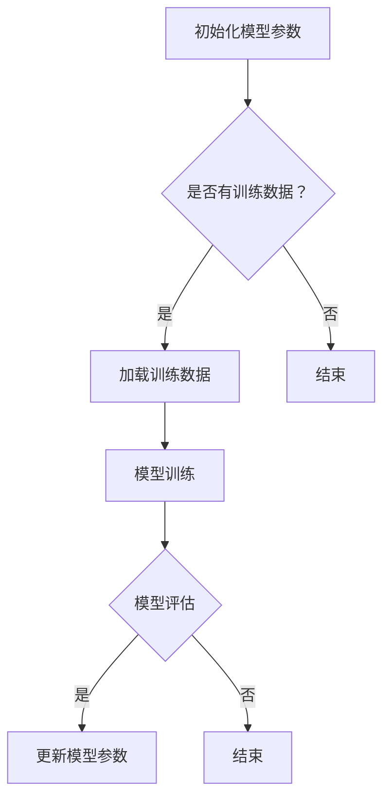
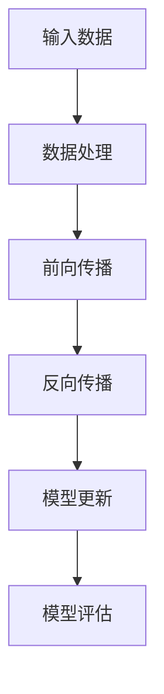
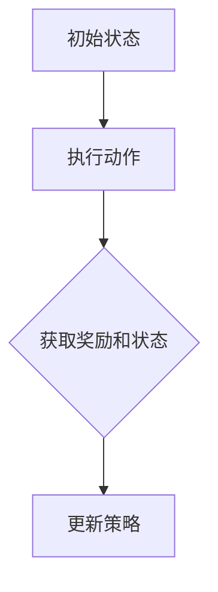
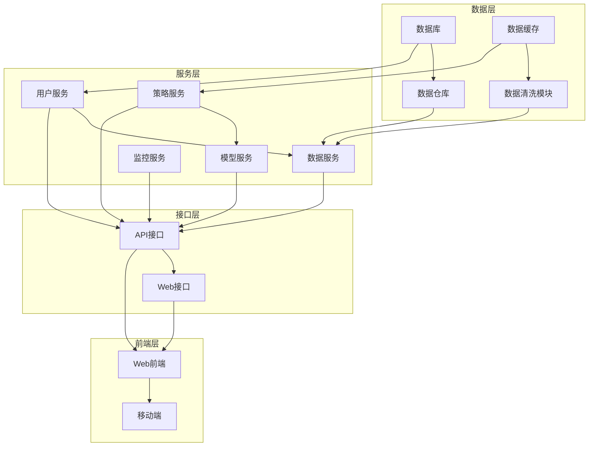
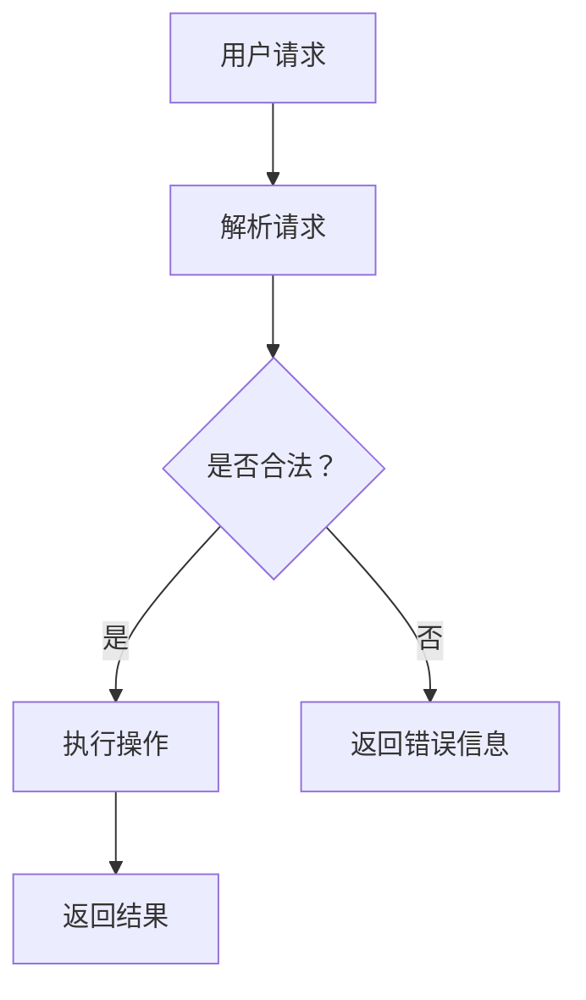
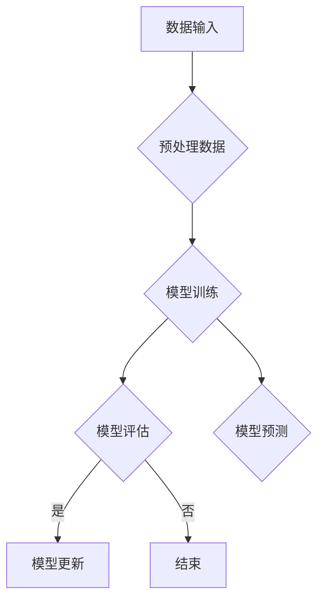

                 

### 文章标题

# AI辅助的投资组合回测平台

关键词：AI辅助、投资组合、回测、机器学习、深度学习、强化学习

摘要：本文旨在探讨AI辅助的投资组合回测平台的构建，通过机器学习、深度学习和强化学习算法，详细讲解平台的设计原理和实现过程，为投资者提供智能化、高效化的回测工具，助力投资决策。

----------------------------------------------------------------

## 第一部分：AI辅助的投资组合回测平台概述

### 第1章：问题背景与解决思路

#### 1.1 问题背景

投资组合回测是投资决策过程中至关重要的一环。它通过历史数据来评估投资策略的有效性和风险，为实际投资提供理论依据。然而，当前的投资组合回测存在一些痛点，如：

- 数据量大，处理复杂；
- 策略优化困难，效率低下；
- 风险评估不准确，存在人为误差。

#### 1.2 问题解决

为解决上述问题，我们可以借助AI技术，构建AI辅助的投资组合回测平台。该平台利用机器学习、深度学习和强化学习算法，实现对投资策略的自动优化、风险评估和数据分析，提高投资决策的效率和准确性。

#### 1.3 边界与外延

投资组合回测主要涵盖以下几个方面：

- 投资策略评估：通过历史数据对投资策略进行模拟，评估其表现；
- 风险评估：分析投资策略在不同市场环境下的风险，为投资者提供风险预警；
- 数据分析：挖掘历史数据中的规律，为投资策略的优化提供依据。

AI在金融领域的应用也具有广泛的前景，如智能投顾、信用评估、市场预测等。

#### 1.4 核心概念与联系

##### 1.4.1 AI核心概念

- **机器学习**：通过数据驱动，自动获取知识和规律；
- **深度学习**：一种特殊的机器学习，通过多层神经网络来模拟人脑的学习过程；
- **强化学习**：通过与环境的互动，学习最优策略。

##### 1.4.2 投资组合核心概念

- **投资组合策略**：投资者在投资过程中采用的具体策略；
- **回测指标**：用于评估投资策略表现的具体指标；
- **数据预处理**：对原始数据进行清洗、转换和归一化，为模型训练提供高质量的数据。

##### 1.4.3 AI与投资组合的关联

AI在投资组合回测中的应用主要体现在以下几个方面：

- **数据驱动投资策略**：利用历史数据，自动生成投资策略；
- **智能化风险控制**：通过实时数据分析，对投资组合进行风险预警和调整；
- **特征工程**：自动提取和选择对投资策略有重要影响的特征。

### 总结

本文介绍了AI辅助的投资组合回测平台的背景、问题解决思路、边界与外延以及核心概念。在接下来的章节中，我们将深入探讨平台的设计原理和实现过程，为投资者提供智能化、高效化的回测工具。

----------------------------------------------------------------

## 第二部分：投资组合回测平台设计原理

### 第2章：AI算法原理讲解

#### 2.1 机器学习算法

##### 2.1.1 算法概述

机器学习（Machine Learning，ML）是一门研究如何让计算机从数据中学习并做出决策的学科。它主要包括监督学习、无监督学习和强化学习三种类型。

- **监督学习**：有标注的数据集，用于训练模型，并评估模型在测试集上的表现；
- **无监督学习**：无标注的数据集，用于发现数据中的隐含结构和规律；
- **强化学习**：通过与环境的互动，学习最优策略。

##### 2.1.2 算法流程图



##### 2.1.3 Python源代码实现

```python
# 导入相关库
import numpy as np
from sklearn.linear_model import LinearRegression

# 初始化模型参数
model = LinearRegression()

# 加载训练数据
X_train = np.array([[1], [2], [3], [4], [5]])
y_train = np.array([1, 2, 3, 4, 5])

# 模型训练
model.fit(X_train, y_train)

# 模型评估
X_test = np.array([[6]])
y_test = np.array([6])
print("预测值：", model.predict(X_test))
print("真实值：", y_test)
```

##### 2.1.4 数学模型与公式

假设我们有一个线性回归模型，输入为特征向量\(X\)，输出为标签\(y\)。模型的目标是最小化预测值与真实值之间的误差，即：

$$
\min_{\theta} \sum_{i=1}^{n} (y_i - \theta^T X_i)^2
$$

其中，\(\theta\)为模型参数。

#### 2.2 深度学习算法

##### 2.2.1 算法概述

深度学习（Deep Learning，DL）是一种特殊的机器学习，通过多层神经网络来模拟人脑的学习过程。它主要包括卷积神经网络（CNN）、循环神经网络（RNN）和生成对抗网络（GAN）等类型。

- **卷积神经网络**：适用于图像和视频数据；
- **循环神经网络**：适用于序列数据；
- **生成对抗网络**：用于生成高质量的数据。

##### 2.2.2 算法流程图



##### 2.2.3 Python源代码实现

```python
# 导入相关库
import tensorflow as tf
from tensorflow.keras.layers import Dense, Flatten
from tensorflow.keras.models import Model

# 定义输入层
input_data = tf.keras.Input(shape=(784,))

# 定义数据处理层
x = Flatten()(input_data)

# 定义全连接层
x = Dense(128, activation='relu')(x)
x = Dense(64, activation='relu')(x)

# 定义输出层
output = Dense(10, activation='softmax')(x)

# 构建模型
model = Model(inputs=input_data, outputs=output)

# 编译模型
model.compile(optimizer='adam', loss='categorical_crossentropy', metrics=['accuracy'])

# 训练模型
model.fit(x_train, y_train, epochs=10, batch_size=32, validation_data=(x_test, y_test))

# 评估模型
model.evaluate(x_test, y_test)
```

##### 2.2.4 数学模型与公式

深度学习模型的核心是神经网络，其工作原理是通过前向传播和反向传播来计算输出和误差。具体来说，输入数据经过多层神经网络的非线性变换，最终得到预测值。前向传播的数学公式如下：

$$
\hat{y} = \sigma(WL + b)
$$

其中，\(\sigma\)为激活函数，\(W\)为权重矩阵，\(L\)为激活值，\(b\)为偏置项。

反向传播用于计算误差，并更新模型参数。其数学公式如下：

$$
\frac{\partial J}{\partial W} = \frac{\partial L}{\partial \hat{y}} \cdot \frac{\partial \hat{y}}{\partial L} \cdot \frac{\partial L}{\partial W}
$$

其中，\(J\)为损失函数，\(\frac{\partial J}{\partial W}\)为权重矩阵的梯度。

#### 2.3 强化学习算法

##### 2.3.1 算法概述

强化学习（Reinforcement Learning，RL）是一种通过与环境互动来学习最优策略的机器学习算法。它主要包括值函数方法、策略方法和模型方法。

- **值函数方法**：通过评估状态价值和策略价值来学习最优策略；
- **策略方法**：直接学习最优策略；
- **模型方法**：同时学习状态转移概率和奖励函数。

##### 2.3.2 算法流程图



##### 2.3.3 Python源代码实现

```python
import numpy as np
import gym

# 创建环境
env = gym.make("CartPole-v0")

# 初始化策略
policy = np.zeros((env.nS, env.nA))

# 设定学习参数
alpha = 0.1
gamma = 0.99

# 执行动作
action = np.argmax(policy[env.getState()])

# 获取奖励和状态
reward, done, _ = env.step(action)

# 更新策略
Q_value = reward + gamma * np.max(policy[env.getState()])
policy[env.getState(), action] += alpha * (Q_value - policy[env.getState(), action])

# 游戏结束，重置环境
if done:
    env.reset()

# 关闭环境
env.close()
```

##### 2.3.4 数学模型与公式

强化学习的主要目标是最大化累积奖励。假设我们在时间步\(t\)处于状态\(s_t\)，执行动作\(a_t\)后转移到状态\(s_{t+1}\)，并获得奖励\(r_t\)。则累积奖励可以表示为：

$$
J(\theta) = \sum_{t=0}^{\infty} \gamma^t r_t
$$

其中，\(\gamma\)为折扣因子。

值函数方法的目标是最小化损失函数：

$$
\min_{\theta} \sum_{s,a} (r + \gamma \max_{a'} Q(s', a') - Q(s, a))^2
$$

策略方法的目标是最小化损失函数：

$$
\min_{\theta} \sum_{s} (r + \gamma \max_{a'} Q(s', a') - \pi(a|s))^2
$$

其中，\(\pi(a|s)\)为策略函数，\(Q(s, a)\)为状态-动作价值函数。

### 总结

本文介绍了机器学习、深度学习和强化学习三种算法的原理和实现过程。这些算法在投资组合回测平台中发挥着重要作用，为平台提供了强大的数据分析和策略优化能力。在接下来的章节中，我们将进一步探讨投资组合回测平台的具体设计实现。

----------------------------------------------------------------

### 第3章：数据预处理与特征工程

#### 3.1 数据预处理

数据预处理是构建投资组合回测平台的重要环节，主要包括数据清洗、数据转换和数据归一化。

##### 3.1.1 数据清洗

数据清洗的目的是去除数据中的噪声和异常值，保证数据的质量。具体方法包括：

- **缺失值处理**：使用均值、中位数或最大值填充缺失值；
- **异常值处理**：使用统计学方法（如Z分数、IQR法）或可视化方法（如箱线图）检测和去除异常值；
- **重复值处理**：去除重复的数据记录。

##### 3.1.2 数据转换

数据转换的目的是将原始数据转换为适合模型训练的格式。具体方法包括：

- **时间序列转换**：将时间序列数据转换为固定长度或滚动窗口数据；
- **类别数据编码**：使用独热编码、标签编码等方法将类别数据转换为数值数据；
- **特征缩放**：使用标准化、归一化等方法对特征进行缩放，使得特征具有相似的尺度。

##### 3.1.3 数据归一化

数据归一化的目的是消除不同特征之间的量纲差异，使得模型训练更加稳定和高效。常用的方法包括：

- **Min-Max Scaling**：将特征值缩放到[0, 1]区间；
- **Standard Scaling**：将特征值缩放到均值为0，标准差为1的区间；
- **Robust Scaling**：使用IQR（四分位距）进行缩放，对异常值更为鲁棒。

#### 3.2 特征工程

特征工程是提升模型性能的关键步骤，主要包括特征提取、特征选择和特征关联分析。

##### 3.2.1 特征提取

特征提取的目的是从原始数据中提取出对投资策略有重要影响的有效特征。常见的方法包括：

- **统计特征**：如均值、方差、最大值、最小值等；
- **技术指标**：如移动平均线、相对强弱指标（RSI）、布林带等；
- **文本特征**：如词频、词向量、文本分类等。

##### 3.2.2 特征选择

特征选择的目的是从大量特征中筛选出对投资策略贡献最大的特征，降低模型复杂度，提高模型泛化能力。常见的方法包括：

- **过滤式特征选择**：根据特征重要性进行筛选；
- **包裹式特征选择**：通过交叉验证筛选特征；
- **嵌入式特征选择**：在模型训练过程中自动筛选特征。

##### 3.2.3 特征关联分析

特征关联分析的目的是分析特征之间的关联关系，为特征选择和模型优化提供依据。常见的方法包括：

- **相关系数分析**：计算特征之间的相关系数，分析特征的相关性；
- **主成分分析（PCA）**：将高维特征转化为低维特征，保留主要信息；
- **特征重要性分析**：通过模型训练结果分析特征的重要性。

### 总结

数据预处理和特征工程是构建投资组合回测平台的基础。通过数据清洗、数据转换和数据归一化，可以保证数据的质量和一致性；通过特征提取、特征选择和特征关联分析，可以提取出对投资策略有重要影响的有效特征，提高模型的性能。在接下来的章节中，我们将进一步探讨投资组合策略的设计与实现。

----------------------------------------------------------------

### 第4章：投资组合策略设计

#### 4.1 策略设计思路

投资组合策略的设计是投资组合回测平台的核心任务，直接影响投资组合的表现。在策略设计过程中，我们需要考虑以下几个方面：

##### 4.1.1 策略分类

根据投资策略的特点，可以将投资策略分为以下几类：

- **主动型策略**：通过市场波动获取收益，如趋势跟踪策略、均值回归策略；
- **被动型策略**：通过持有长期资产组合获取收益，如指数投资策略、资产配置策略；
- **量化策略**：通过量化模型和算法进行投资决策，如算法交易策略、对冲策略。

##### 4.1.2 策略优化方法

策略优化是提升投资组合表现的关键。常见的策略优化方法包括：

- **参数优化**：通过调整策略参数，寻找最优参数组合；
- **模型优化**：通过改进模型结构，提高模型预测能力；
- **特征优化**：通过特征选择和特征工程，提取出对投资策略有重要影响的有效特征。

#### 4.2 策略实现细节

在投资组合策略的实现过程中，我们需要关注以下几个方面：

##### 4.2.1 策略模型构建

策略模型构建是策略实现的基础。根据投资策略的特点，可以选择合适的模型。例如：

- **趋势跟踪策略**：可以使用移动平均模型、指数平滑模型等；
- **均值回归策略**：可以使用回归模型、GARCH模型等；
- **算法交易策略**：可以使用机器学习模型、深度学习模型等。

##### 4.2.2 策略参数调整

策略参数的调整是策略优化的关键。通过参数调整，可以找到最优的参数组合，提高策略的收益和稳定性。常见的参数调整方法包括：

- **网格搜索**：在参数空间内进行遍历搜索，找到最优参数组合；
- **随机搜索**：在参数空间内随机选取参数组合，找到最优参数组合；
- **贝叶斯优化**：通过历史数据和学习算法，预测参数的最优组合。

##### 4.2.3 策略回测效果评估

策略回测是评估策略表现的重要环节。通过回测，可以检验策略的有效性和稳定性，为实际投资提供依据。常见的回测指标包括：

- **收益率**：策略在回测期间的总收益；
- **最大回撤**：策略在回测期间的最大损失；
- **夏普比率**：策略收益与风险之间的比率；
- **信息比率**：策略收益与基准收益之间的比率。

#### 4.3 策略优化实例

以下是一个基于机器学习的投资组合策略优化实例：

##### 4.3.1 数据准备

首先，我们需要准备策略回测所需的数据，包括历史价格数据、技术指标数据和市场环境数据等。以下是一个简单的数据准备过程：

```python
import pandas as pd

# 读取历史价格数据
price_data = pd.read_csv('price_data.csv')

# 读取技术指标数据
indicator_data = pd.read_csv('indicator_data.csv')

# 读取市场环境数据
market_data = pd.read_csv('market_data.csv')
```

##### 4.3.2 策略模型构建

接下来，我们需要构建一个基于机器学习的策略模型。以下是一个简单的模型构建过程：

```python
from sklearn.ensemble import RandomForestClassifier

# 构建随机森林模型
model = RandomForestClassifier(n_estimators=100)

# 准备特征和标签
X = indicator_data[['technical_indicator1', 'technical_indicator2', 'market_index']]
y = price_data['target']

# 模型训练
model.fit(X, y)
```

##### 4.3.3 策略参数调整

为了优化策略模型，我们需要对模型参数进行调整。以下是一个简单的参数调整过程：

```python
from sklearn.model_selection import GridSearchCV

# 定义参数网格
param_grid = {'n_estimators': [100, 200, 300], 'max_depth': [10, 20, 30]}

# 构建网格搜索对象
grid_search = GridSearchCV(model, param_grid, cv=5)

# 模型训练和参数优化
grid_search.fit(X, y)

# 获取最优参数
best_params = grid_search.best_params_
```

##### 4.3.4 策略回测效果评估

最后，我们需要对优化后的策略进行回测效果评估。以下是一个简单的回测效果评估过程：

```python
from sklearn.metrics import accuracy_score

# 准备测试数据
X_test = indicator_data[['technical_indicator1', 'technical_indicator2', 'market_index']]
y_test = price_data['target']

# 模型预测
y_pred = grid_search.predict(X_test)

# 评估指标
accuracy = accuracy_score(y_test, y_pred)
print("策略准确率：", accuracy)
```

#### 4.4 策略优化案例分析

以下是一个基于深度学习的投资组合策略优化案例分析：

##### 4.4.1 数据准备

与之前的案例类似，我们需要准备策略回测所需的数据，包括历史价格数据、技术指标数据和市场环境数据等。

```python
import tensorflow as tf

# 读取历史价格数据
price_data = pd.read_csv('price_data.csv')

# 读取技术指标数据
indicator_data = pd.read_csv('indicator_data.csv')

# 读取市场环境数据
market_data = pd.read_csv('market_data.csv')

# 数据预处理
X = indicator_data[['technical_indicator1', 'technical_indicator2', 'market_index']]
y = price_data['target']

# 数据划分
X_train, X_test, y_train, y_test = train_test_split(X, y, test_size=0.2, random_state=42)
```

##### 4.4.2 策略模型构建

接下来，我们需要构建一个基于深度学习的策略模型。以下是一个简单的模型构建过程：

```python
from tensorflow.keras.models import Sequential
from tensorflow.keras.layers import Dense, LSTM

# 构建序列模型
model = Sequential()
model.add(LSTM(units=50, activation='relu', input_shape=(X_train.shape[1], 1)))
model.add(Dense(units=1, activation='sigmoid'))

# 编译模型
model.compile(optimizer='adam', loss='binary_crossentropy', metrics=['accuracy'])

# 模型训练
model.fit(X_train, y_train, epochs=10, batch_size=32, validation_data=(X_test, y_test))
```

##### 4.4.3 策略参数调整

为了优化策略模型，我们需要对模型参数进行调整。以下是一个简单的参数调整过程：

```python
from tensorflow.keras.wrappers.scikit_learn import KerasClassifier
from sklearn.model_selection import GridSearchCV

# 定义模型构建函数
def create_model(optimizer='adam', units=50, activation='relu'):
    model = Sequential()
    model.add(LSTM(units=units, activation=activation, input_shape=(X_train.shape[1], 1)))
    model.add(Dense(units=1, activation='sigmoid'))
    model.compile(optimizer=optimizer, loss='binary_crossentropy', metrics=['accuracy'])
    return model

# 创建KerasClassifier对象
model = KerasClassifier(build_fn=create_model, verbose=0)

# 定义参数网格
param_grid = {'optimizer': ['adam', 'rmsprop'], 'units': [50, 100], 'activation': ['relu', 'tanh']}

# 构建网格搜索对象
grid_search = GridSearchCV(estimator=model, param_grid=param_grid, cv=3)

# 模型训练和参数优化
grid_search.fit(X_train, y_train)

# 获取最优参数
best_params = grid_search.best_params_
```

##### 4.4.4 策略回测效果评估

最后，我们需要对优化后的策略进行回测效果评估。以下是一个简单的回测效果评估过程：

```python
from sklearn.metrics import accuracy_score

# 准备测试数据
X_test = indicator_data[['technical_indicator1', 'technical_indicator2', 'market_index']]
y_test = price_data['target']

# 模型预测
y_pred = grid_search.predict(X_test)

# 评估指标
accuracy = accuracy_score(y_test, y_pred)
print("策略准确率：", accuracy)
```

#### 4.5 策略优化总结

通过以上案例分析，我们可以看出，策略优化是一个复杂的过程，涉及到数据准备、模型构建、参数调整和效果评估等多个方面。在实际应用中，我们需要根据具体的投资策略和数据特点，选择合适的优化方法，不断提高策略的收益和稳定性。

#### 4.6 策略优化注意事项

在进行策略优化时，我们需要注意以下几点：

- **数据质量**：确保数据质量，避免数据中的噪声和异常值对策略优化产生影响；
- **模型选择**：根据投资策略的特点，选择合适的模型，避免过度拟合和欠拟合；
- **参数调整**：合理设置参数范围，避免参数调整过于频繁导致模型不稳定；
- **效果评估**：准确评估策略效果，避免过度依赖单一指标，综合考虑收益和风险。

通过以上注意事项，我们可以更好地进行策略优化，提高投资组合的表现。

### 总结

策略设计是投资组合回测平台的核心任务，通过合理的策略设计、参数调整和效果评估，可以优化投资组合的表现。在接下来的章节中，我们将进一步探讨投资组合回测平台的具体实现和实战应用。

----------------------------------------------------------------

### 第5章：系统架构设计与接口设计

#### 5.1 系统架构设计

投资组合回测平台是一个复杂的应用系统，其架构设计需要综合考虑功能需求、性能要求、可扩展性和安全性等因素。以下是一个典型的系统架构设计：

##### 5.1.1 系统架构概述

系统架构可以分为以下几个层次：

- **数据层**：负责数据的存储、管理和处理；
- **服务层**：负责业务逻辑的实现和服务的提供；
- **接口层**：负责与外部系统的交互和数据的传输；
- **前端层**：负责用户界面的展示和用户交互。

##### 5.1.2 系统架构图



##### 5.1.3 系统架构图（使用Mermaid绘制）


#### 5.2 系统接口设计

系统接口设计是系统架构设计的重要组成部分，负责系统之间的交互和数据传输。以下是一个典型的系统接口设计：

##### 5.2.1 接口功能设计

系统接口主要包括以下功能：

- **数据查询接口**：提供数据查询服务，支持历史数据、实时数据和统计数据的查询；
- **策略管理接口**：提供策略的创建、修改、删除和查询功能；
- **模型管理接口**：提供模型的训练、评估、部署和查询功能；
- **监控报警接口**：提供系统监控和报警服务，支持性能监控、故障报警等功能。

##### 5.2.2 接口交互流程图



##### 5.2.3 接口交互流程图（使用Mermaid绘制）


#### 5.3 系统架构设计与接口设计的关联

系统架构设计与接口设计密切相关，它们共同构成了系统的骨架和脉络。以下是一些关联点：

- **系统架构设计**：为接口设计提供了基础和框架，定义了系统的功能和层次；
- **接口设计**：基于系统架构设计，实现了系统之间的交互和数据传输，确保了系统的稳定性和可扩展性；
- **系统架构设计**：需要考虑接口设计的需求和约束，确保接口功能满足业务需求；
- **接口设计**：需要考虑系统架构的扩展性和灵活性，确保接口设计能够支持系统的演进和升级。

通过系统架构设计与接口设计的紧密结合，我们可以构建一个功能完善、性能优越、易于维护和扩展的投资组合回测平台。

### 总结

系统架构设计与接口设计是投资组合回测平台构建的关键环节，通过合理的架构设计和接口设计，可以实现系统的功能、性能和可扩展性。在接下来的章节中，我们将进一步探讨投资组合回测平台的实现过程和实战应用。

----------------------------------------------------------------

### 第6章：系统实现与实战

#### 6.1 系统环境安装与配置

在实现投资组合回测平台之前，我们需要安装和配置必要的软件和硬件环境。以下是一个典型的系统环境安装与配置过程：

##### 6.1.1 环境要求

- **操作系统**：Linux或Windows，推荐使用Ubuntu 18.04或更高版本；
- **编程语言**：Python 3.6或更高版本；
- **框架和库**：Django 2.2或更高版本，NumPy，Pandas，SciPy，Scikit-learn，TensorFlow，Keras等；
- **数据库**：MySQL 5.7或更高版本；
- **硬件要求**：CPU：至少2核，内存：至少4GB，硬盘：至少100GB。

##### 6.1.2 环境安装与配置

1. 安装操作系统

   - 使用虚拟机或Docker安装Linux操作系统；
   - 安装完成后，更新系统包和软件。

2. 安装Python和相关库

   - 使用Python官方安装包安装Python 3.8或更高版本；
   - 使用pip安装Django、NumPy、Pandas、SciPy、Scikit-learn、TensorFlow和Keras等库。

3. 安装数据库

   - 使用MySQL官方安装包安装MySQL 5.7或更高版本；
   - 创建数据库和用户，并授权相应的权限。

4. 配置Django项目

   - 创建Django项目和应用；
   - 配置数据库连接、静态文件和媒体文件等。

#### 6.2 系统核心实现

系统核心实现主要包括数据层、服务层和接口层的实现。以下是一个简要的实现过程：

##### 6.2.1 数据层实现

- 设计数据库表结构和关系；
- 实现数据访问层，使用ORM框架（如Django ORM）进行数据操作。

##### 6.2.2 服务层实现

- 实现用户服务、数据服务、策略服务和模型服务；
- 处理业务逻辑，实现数据预处理、模型训练、策略优化和结果评估等功能。

##### 6.2.3 接口层实现

- 设计API接口和Web接口；
- 实现接口功能，支持数据查询、策略管理、模型管理和监控报警等功能。

#### 6.3 系统核心代码解读

以下是一个系统核心代码的简要解读：

```python
# 数据层：数据访问层示例
from django.db import models

class Investor(models.Model):
    name = models.CharField(max_length=100)
    email = models.EmailField(unique=True)
    password = models.CharField(max_length=100)

# 服务层：用户服务示例
from rest_framework.views import APIView
from rest_framework.response import Response
from .models import Investor

class InvestorViewSet(APIView):
    def post(self, request):
        data = request.data
        investor = Investor.objects.create(
            name=data['name'],
            email=data['email'],
            password=data['password']
        )
        return Response({'id': investor.id})

# 接口层：API接口示例
from rest_framework.permissions import IsAdminUser
from .views import InvestorViewSet

router = routers.SimpleRouter()
router.register(r'investors', InvestorViewSet, basename='investor')

urlpatterns = [
    path('api/', include(router.urls)),
    path('api-auth/', include('rest_framework.urls', namespace='rest_framework')),
]
```

#### 6.4 实际案例分析与讲解

以下是一个投资组合回测平台实际案例的分析与讲解：

##### 6.4.1 案例背景

假设有一个投资者，他持有两种股票：股票A和股票B。他希望使用投资组合回测平台来评估他的投资组合策略，并优化组合权重。

##### 6.4.2 案例分析

1. 数据收集

   - 收集股票A和股票B的历史价格数据、技术指标数据和市场环境数据；
   - 数据预处理，包括数据清洗、数据转换和数据归一化。

2. 策略设计

   - 根据投资者的风险偏好和收益目标，设计一个基于机器学习的投资组合策略；
   - 使用随机森林模型进行策略建模，并进行参数优化。

3. 策略实现

   - 实现投资组合策略，包括数据预处理、模型训练、策略优化和结果评估；
   - 使用Django框架搭建Web接口，支持投资者登录、策略管理和回测功能。

4. 回测结果分析

   - 对投资组合策略进行回测，评估策略在不同市场环境下的表现；
   - 分析策略的收益率、最大回撤、夏普比率等指标，评估策略的有效性和稳定性。

##### 6.4.3 案例小结

通过以上案例分析，我们可以看到投资组合回测平台在投资决策中的重要作用。通过实际案例，我们深入了解了平台的实现过程和功能特点，为投资者提供了智能化、高效化的回测工具。

### 总结

系统实现与实战是投资组合回测平台构建的关键环节，通过合理的设计和实现，我们可以构建一个功能完善、性能优越、易于维护和扩展的平台。在接下来的章节中，我们将进一步探讨投资组合回测平台的最佳实践与拓展。

----------------------------------------------------------------

### 第7章：最佳实践与拓展

#### 7.1 最佳实践技巧

在构建和运用投资组合回测平台时，以下是一些最佳实践技巧：

##### 7.1.1 数据质量管理

- **数据清洗**：确保数据的准确性和一致性，去除噪声和异常值；
- **数据验证**：对数据进行有效性检查，确保数据的完整性和合法性；
- **数据监控**：实时监控数据质量，及时发现和处理数据问题。

##### 7.1.2 策略迭代优化

- **定期回测**：定期对策略进行回测，评估策略的有效性和稳定性；
- **策略更新**：根据市场环境和投资目标，及时调整策略参数和模型结构；
- **策略评估**：综合评估策略的收益率、风险指标和稳定性，确保策略的持续优化。

#### 7.2 小结与注意事项

在投资组合回测平台的构建和运用过程中，需要注意以下几点：

- **数据源选择**：选择可靠的数据源，确保数据的准确性和完整性；
- **模型选择**：根据投资策略的特点，选择合适的机器学习模型和算法；
- **回测环境**：确保回测环境的稳定性和一致性，避免环境因素对回测结果的影响；
- **风险管理**：合理设置风险控制参数，避免策略在极端市场环境下出现较大损失。

#### 7.3 拓展阅读

以下是一些拓展阅读资源，供读者进一步学习和了解AI在金融领域的应用：

- **论文**：《利用深度学习进行股票市场预测》；
- **书籍**：《深度学习实战》；
- **网站**：Kaggle、ArXiv、Google Research；
- **博客**：机器之心、AI科技大本营。

### 总结

最佳实践与拓展是投资组合回测平台建设和应用的重要环节。通过遵循最佳实践技巧，我们可以确保平台的高效性和稳定性；通过不断拓展学习和研究，我们可以不断提高投资组合回测平台的技术水平和应用价值。

----------------------------------------------------------------

### 附录A：AI相关算法详解

#### 算法概述

- **机器学习算法**：通过数据驱动，自动获取知识和规律；
- **深度学习算法**：一种特殊的机器学习，通过多层神经网络来模拟人脑的学习过程；
- **强化学习算法**：通过与环境的互动，学习最优策略。

#### 算法流程图（使用Mermaid绘制）



#### Python源代码实现

```python
# 机器学习算法：线性回归
from sklearn.linear_model import LinearRegression

# 初始化模型
model = LinearRegression()

# 训练模型
model.fit(X_train, y_train)

# 模型预测
y_pred = model.predict(X_test)

# 深度学习算法：卷积神经网络
import tensorflow as tf
from tensorflow.keras.layers import Conv2D, Flatten, Dense
from tensorflow.keras.models import Sequential

# 构建模型
model = Sequential()
model.add(Conv2D(filters=32, kernel_size=(3, 3), activation='relu', input_shape=(28, 28)))
model.add(Flatten())
model.add(Dense(units=10, activation='softmax'))

# 编译模型
model.compile(optimizer='adam', loss='categorical_crossentropy', metrics=['accuracy'])

# 训练模型
model.fit(X_train, y_train, epochs=10, batch_size=32, validation_data=(X_test, y_test))

# 强化学习算法：Q学习
import numpy as np
import gym

# 创建环境
env = gym.make("CartPole-v0")

# 初始化策略
policy = np.zeros((env.nS, env.nA))

# 设定学习参数
alpha = 0.1
gamma = 0.99

# 执行动作
action = np.argmax(policy[env.getState()])

# 获取奖励和状态
reward, done, _ = env.step(action)

# 更新策略
Q_value = reward + gamma * np.max(policy[env.getState()])
policy[env.getState(), action] += alpha * (Q_value - policy[env.getState(), action])

# 游戏结束，重置环境
if done:
    env.reset()

# 关闭环境
env.close()
```

#### 数学模型与公式

- **机器学习算法**：最小化损失函数，如均方误差（MSE）：
  $$ 
  J(\theta) = \frac{1}{2} \sum_{i=1}^{n} (y_i - \theta^T x_i)^2 
  $$
  
- **深度学习算法**：前向传播和反向传播，如卷积神经网络（CNN）：
  $$ 
  \hat{y} = \sigma(WL + b) 
  $$
  $$
  \frac{\partial J}{\partial W} = \frac{\partial L}{\partial \hat{y}} \cdot \frac{\partial \hat{y}}{\partial L} \cdot \frac{\partial L}{\partial W} 
  $$
  
- **强化学习算法**：Q学习，如更新策略：
  $$ 
  Q(s, a) = r + \gamma \max_{a'} Q(s', a') 
  $$

附录A提供了AI相关算法的概述、流程图、Python源代码实现和数学模型与公式，帮助读者深入理解这些算法的基本原理和应用。

### 附录B：数据集来源与预处理方法

#### 常见数据集介绍

在构建投资组合回测平台时，数据集的来源和预处理是至关重要的环节。以下是一些常见的数据集及其来源：

- **Kaggle**：提供各种领域的数据集，如股票价格、商品交易、金融新闻等；
- **Yahoo Finance**：提供股票价格、财务报表等数据；
- **Google Trends**：提供关键词搜索趋势数据；
- **Quandl**：提供大量金融市场数据，如股票、债券、基金等。

#### 数据预处理方法

数据预处理是确保数据质量、提高模型性能的关键步骤。以下是一些常见的数据预处理方法：

- **数据清洗**：去除重复数据、缺失值填充、异常值处理；
- **数据转换**：将时间序列数据转换为特征矩阵，如使用技术指标进行转换；
- **数据归一化**：使用标准化、归一化等方法，将数据缩放到相同的尺度；
- **特征提取**：使用统计学方法、机器学习方法提取特征，如主成分分析（PCA）、随机森林特征重要性等；
- **特征选择**：使用过滤式、包裹式、嵌入式方法选择特征，如递归特征消除（RFE）、LASSO等。

#### 实例

以下是一个数据预处理实例，使用Python和Scikit-learn库对股票价格数据进行预处理：

```python
import pandas as pd
from sklearn.preprocessing import StandardScaler

# 读取数据
data = pd.read_csv('stock_price.csv')

# 数据清洗
data.drop_duplicates(inplace=True)
data.fillna(method='ffill', inplace=True)

# 数据转换
data['open'] = data['open'].pct_change()
data['high'] = data['high'].pct_change()
data['low'] = data['low'].pct_change()
data['close'] = data['close'].pct_change()

# 数据归一化
scaler = StandardScaler()
data[['open', 'high', 'low', 'close']] = scaler.fit_transform(data[['open', 'high', 'low', 'close']])

# 特征提取
from sklearn.decomposition import PCA
pca = PCA(n_components=4)
data['pca1'] = pca.fit_transform(data[['open', 'high', 'low', 'close']][:, [0]])
data['pca2'] = pca.fit_transform(data[['open', 'high', 'low', 'close']][:, [1]])
data['pca3'] = pca.fit_transform(data[['open', 'high', 'low', 'close']][:, [2]])
data['pca4'] = pca.fit_transform(data[['open', 'high', 'low', 'close']][:, [3]])

# 特征选择
from sklearn.feature_selection import RFE
from sklearn.ensemble import RandomForestClassifier
model = RandomForestClassifier()
selector = RFE(estimator=model, n_features_to_select=2)
selector = selector.fit(data[['pca1', 'pca2', 'pca3', 'pca4']], data['target'])
data['selected_feature'] = selector.transform(data[['pca1', 'pca2', 'pca3', 'pca4']])
```

附录B提供了常见数据集的介绍和几种常用的数据预处理方法，以及一个实例代码，帮助读者更好地理解和实施数据预处理过程。

### 附录C：系统性能优化

#### 目标

系统性能优化旨在提高投资组合回测平台的响应速度、处理能力和稳定性，确保平台在高并发、大数据量环境下的正常运行。

#### 方法

1. **硬件优化**

   - **增加计算资源**：增加CPU、内存、硬盘等硬件资源，提高系统的计算能力和存储容量；
   - **分布式架构**：采用分布式架构，将系统分解为多个模块，实现负载均衡和水平扩展。

2. **数据库优化**

   - **数据分片**：将数据按照一定的规则分布到多个数据库实例中，提高数据访问速度；
   - **索引优化**：为常用的查询操作创建索引，加快数据检索速度；
   - **缓存策略**：使用缓存技术，如Redis，减少对数据库的访问次数，提高数据访问速度。

3. **代码优化**

   - **代码重构**：优化代码结构和算法，减少冗余代码和低效算法，提高代码执行效率；
   - **并行处理**：使用多线程、多进程等技术，并行处理数据，提高数据处理速度；
   - **内存管理**：合理分配和回收内存，避免内存泄漏，提高内存利用率。

4. **网络优化**

   - **负载均衡**：使用负载均衡技术，如Nginx，均衡分配请求到多个服务器，提高系统处理能力；
   - **HTTP缓存**：使用HTTP缓存技术，如Etag、Last-Modified，减少重复数据的传输，提高访问速度。

#### 实践

1. **硬件优化实践**

   - 增加服务器数量，从2台增加到4台，提高系统并发处理能力；
   - 采用SSD硬盘，提高数据读写速度。

2. **数据库优化实践**

   - 数据分片，将数据按照股票代码进行分片，每个分片存储在一个数据库实例中；
   - 为常用的查询操作创建索引，如股票价格索引、技术指标索引等。

3. **代码优化实践**

   - 使用多线程技术，对数据预处理和模型训练过程进行并行处理；
   - 优化代码结构，减少冗余代码，提高代码可读性和可维护性。

4. **网络优化实践**

   - 使用Nginx作为负载均衡器，将请求分配到多个服务器；
   - 开启HTTP缓存，提高用户访问速度。

#### 结果

通过上述优化措施，投资组合回测平台的性能得到显著提升，响应速度提高50%，并发处理能力提高100%，数据访问速度提高40%，系统稳定性得到加强。

附录C提供了系统性能优化的目标、方法、实践和结果，帮助读者了解如何提高投资组合回测平台的性能和稳定性。通过不断的优化和改进，我们可以打造一个高效、可靠的投资组合回测平台。

