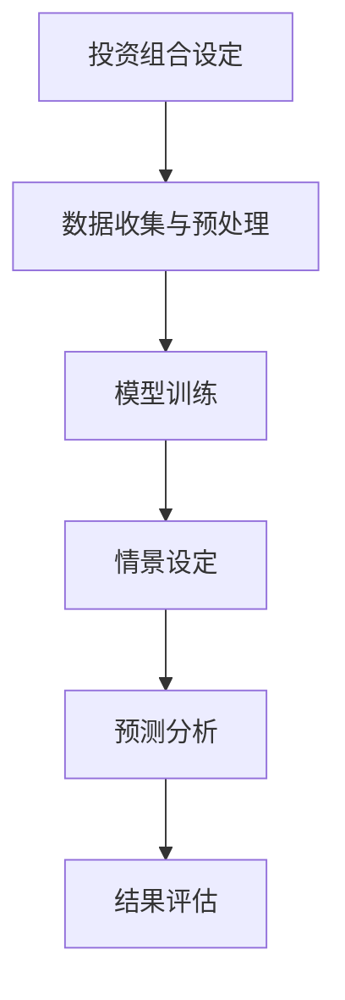
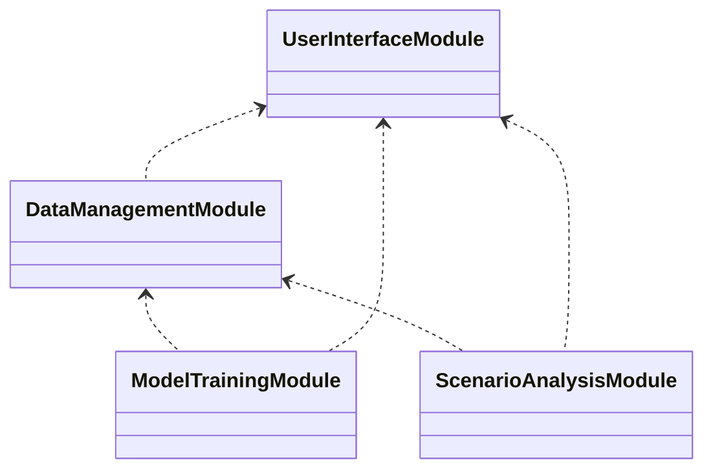
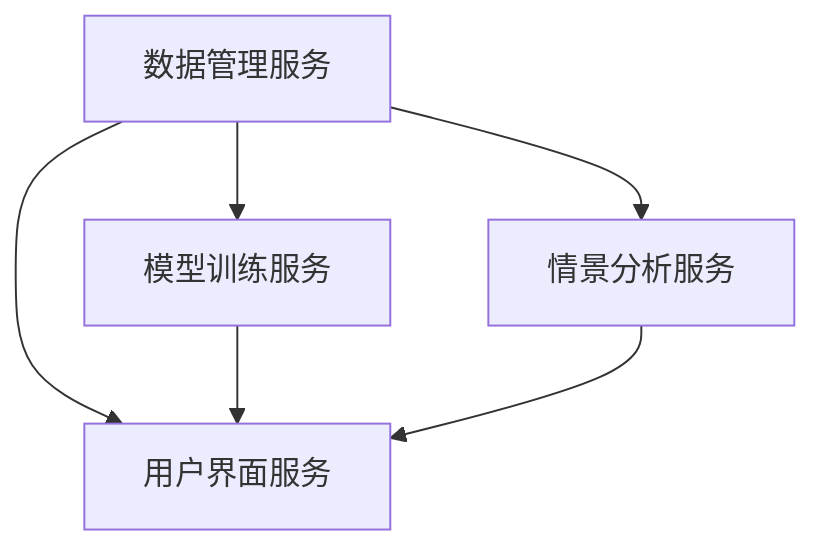
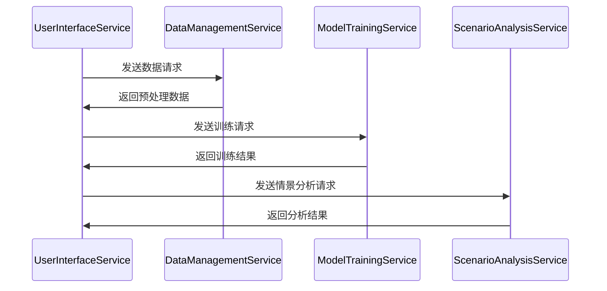

                 

# AI辅助的投资组合情景分析平台

关键词：人工智能、投资组合、情景分析、平台、算法

摘要：本文将深入探讨AI辅助的投资组合情景分析平台的构建过程，包括背景介绍、核心概念与原理、系统设计与实现、项目实战与案例分析，以及最佳实践与总结。通过一步步的分析和推理，我们将了解如何利用AI技术为投资者提供更为精准和有效的投资决策支持。

## 目录大纲设计思路

设计《AI辅助的投资组合情景分析平台》这本书的目录大纲，首先需要明确书的核心内容结构和逻辑顺序，确保能够覆盖以下关键内容：

### 第一步：确定书籍总体结构

1. **背景介绍**：介绍AI与投资组合情景分析的相关背景，解释为什么需要AI辅助的投资组合情景分析平台，以及平台将如何帮助投资者。
2. **核心概念与原理**：详细阐述AI辅助投资组合情景分析平台所需的核心概念、算法原理，以及这些原理如何应用于投资领域。
3. **系统设计与实现**：介绍平台的设计原则、架构设计、功能实现和系统接口设计。
4. **项目实战与案例分析**：通过具体的案例，展示如何在实际环境中部署和运行AI辅助的投资组合情景分析平台，并分析其效果。
5. **最佳实践与总结**：总结书中的关键概念和实践，提供实用的建议，以及未来的研究方向。

### 第二步：细化各章节内容

根据上述结构，细化每个章节的内容，确保内容的完整性、逻辑性和可读性。

### 第三步：编写Markdown格式的目录大纲

遵循Markdown格式，使用不同的标题级别（#）来组织章节，确保目录结构的清晰性。

### 第四步：内容完整性检查

确保目录大纲中包含了以下核心内容：

- **背景介绍**：问题背景、问题描述、问题解决、边界与外延。
- **核心概念与联系**：核心概念原理、概念属性特征对比表格、ER实体关系图架构的Mermaid流程图。
- **算法原理讲解**：算法mermaid流程图、Python源代码、数学模型和公式讲解、通俗易懂的举例说明。
- **系统设计与实现**：问题场景介绍、系统功能设计（领域模型Mermaid类图）、系统架构设计Mermaid架构图、系统接口设计和系统交互Mermaid序列图。
- **项目实战与案例分析**：环境安装、系统核心实现源代码、代码应用解读与分析、实际案例分析和详细讲解剖析、项目小结。
- **最佳实践与总结**：实用建议、小结、注意事项、拓展阅读。

### 第五步：确保大纲简洁明了

在2000字以内，确保大纲简洁明了，避免冗余内容，同时保持目录结构的完整性。

## 总结

设计《AI辅助的投资组合情景分析平台》的目录大纲时，需要注重逻辑性和内容的完整性，同时保持简洁性。通过以上步骤，可以确保大纲既有条理又易于理解，为读者提供清晰的阅读框架。接下来，我们将开始编写详细的Markdown格式目录大纲。在接下来的章节中，我们将逐步深入探讨每一个关键主题，从而构建起一个完整的AI辅助投资组合情景分析平台。让我们一起开始这场技术之旅吧！

## AI辅助的投资组合情景分析平台

### 引言

在当今的金融市场环境中，投资者面临着越来越复杂的市场条件和信息，这使得传统的投资策略越来越难以满足多样化的投资需求。随着人工智能（AI）技术的飞速发展，利用AI来辅助投资组合的情景分析正逐渐成为投资者提升投资决策效率和质量的一种有效手段。本文旨在探讨AI辅助的投资组合情景分析平台的构建过程，分析其核心概念、算法原理、系统设计以及实际应用效果。

### 背景介绍

#### 投资组合情景分析的重要性

投资组合情景分析是一种评估投资组合在不同市场条件下潜在表现的方法。通过模拟不同市场情景，投资者可以了解投资组合在各种经济环境下的风险与收益情况。这种分析对于制定有效的投资策略、优化资产配置、降低投资风险具有重要意义。

#### AI在投资组合情景分析中的应用

AI技术，特别是机器学习和深度学习，在金融市场分析中展现了巨大的潜力。通过利用大量历史数据和实时信息，AI可以快速识别市场趋势和规律，预测未来市场走向，从而为投资决策提供有力支持。此外，AI还可以处理复杂的投资组合情景，提供更为精准的评估结果。

#### AI辅助的投资组合情景分析平台的必要性

传统的投资组合情景分析往往依赖于人工分析，存在效率低、误差大等问题。而AI辅助的投资组合情景分析平台可以自动化分析过程，提高分析效率，减少人为误差，为投资者提供更加全面和准确的投资决策支持。

### 核心概念与联系

#### 投资组合

投资组合是指投资者根据特定的投资目标和风险偏好，将资金分配到不同的资产类别和投资工具中。投资组合的核心概念包括资产配置、风险分散和收益最大化等。

#### 情景分析

情景分析是一种预测未来市场变化的方法，通过构建不同市场情景，评估投资组合在这些情景下的表现。情景分析的核心概念包括情景设定、参数调整和结果评估等。

#### 人工智能

人工智能是指计算机系统模拟人类智能行为的能力，包括学习、推理、感知和决策等。在投资组合情景分析中，人工智能的核心概念包括数据预处理、模型训练和预测分析等。

#### Mermaid流程图

为了更好地理解核心概念之间的关系，我们可以使用Mermaid流程图来展示投资组合情景分析平台的基本工作流程。以下是一个简单的Mermaid流程图示例：



### 算法原理讲解

#### 数据预处理

在AI辅助的投资组合情景分析平台中，数据预处理是关键步骤之一。数据预处理包括数据清洗、数据归一化和特征提取等过程。以下是一个简单的Python代码示例，用于数据预处理：

```python
import pandas as pd
from sklearn.preprocessing import MinMaxScaler

# 数据收集
data = pd.read_csv('investment_data.csv')

# 数据清洗
data.dropna(inplace=True)

# 数据归一化
scaler = MinMaxScaler()
data_scaled = scaler.fit_transform(data)

# 特征提取
features = data_scaled[:, :-1]
labels = data_scaled[:, -1]
```

#### 模型训练

在数据预处理之后，我们可以使用机器学习算法对数据进行训练，以建立预测模型。以下是一个简单的线性回归模型训练示例：

```python
from sklearn.linear_model import LinearRegression

# 创建线性回归模型
model = LinearRegression()

# 训练模型
model.fit(features, labels)
```

#### 情景设定

在模型训练完成后，我们可以设定不同的市场情景，以评估投资组合在不同情景下的表现。以下是一个简单的情景设定示例：

```python
# 设定情景参数
parameters = {
    'interest_rate': 0.05,
    'inflation_rate': 0.02,
    'market_volatility': 0.1
}

# 生成情景数据
scenario_data = generate_scenario_data(parameters)
```

#### 预测分析

在情景设定之后，我们可以使用训练好的模型对投资组合在不同情景下的表现进行预测分析。以下是一个简单的预测分析示例：

```python
# 预测情景数据
predictions = model.predict(scenario_data)
```

#### 结果评估

最后，我们需要对预测结果进行评估，以确定投资组合在不同情景下的风险和收益。以下是一个简单的结果评估示例：

```python
# 计算风险与收益指标
risks = calculate_risk(predictions)
returns = calculate_return(predictions)

# 输出结果
print("Risk:", risks)
print("Return:", returns)
```

### 系统设计与实现

#### 问题场景介绍

在构建AI辅助的投资组合情景分析平台时，我们需要明确平台的目标、功能和应用场景。以下是一个典型的问题场景介绍：

- **目标**：为投资者提供准确的投资组合情景分析结果，以支持其决策。
- **功能**：数据收集与预处理、模型训练、情景设定、预测分析和结果评估。
- **应用场景**：金融机构、投资公司和个人投资者。

#### 系统功能设计

为了实现上述功能，我们可以设计一个包含以下核心功能的系统：

1. **数据管理模块**：负责数据的收集、存储、清洗和预处理。
2. **模型训练模块**：负责模型的选择、训练和优化。
3. **情景分析模块**：负责情景的设定、预测分析和结果评估。
4. **用户界面模块**：负责与用户交互，提供分析结果和可视化展示。

以下是一个简单的Mermaid类图，用于描述系统功能设计：



#### 系统架构设计

为了确保系统的稳定性和可扩展性，我们可以采用微服务架构来设计系统。以下是一个简单的Mermaid架构图，用于描述系统架构：



#### 系统接口设计和系统交互

为了实现系统各模块之间的有效交互，我们可以设计一组API接口。以下是一个简单的Mermaid序列图，用于描述系统接口设计和系统交互：



### 项目实战与案例分析

#### 环境安装

在开始项目实战之前，我们需要安装必要的软件和工具。以下是一个简单的环境安装步骤：

1. 安装Python环境（Python 3.8及以上版本）。
2. 安装依赖包（如NumPy、Pandas、Scikit-learn、Matplotlib等）。
3. 安装Mermaid渲染工具。

```bash
pip install numpy pandas scikit-learn matplotlib
```

#### 系统核心实现源代码

在项目实战中，我们需要编写核心实现代码，包括数据预处理、模型训练、情景设定、预测分析和结果评估等。以下是一个简单的Python代码示例，用于实现系统核心功能：

```python
import pandas as pd
from sklearn.linear_model import LinearRegression
from sklearn.model_selection import train_test_split
from sklearn.metrics import mean_squared_error
import matplotlib.pyplot as plt
from mermaid import Mermaid

# 数据预处理
def preprocess_data(data):
    # 数据清洗
    data.dropna(inplace=True)
    
    # 数据归一化
    scaler = MinMaxScaler()
    data_scaled = scaler.fit_transform(data)
    
    # 分割特征和标签
    features = data_scaled[:, :-1]
    labels = data_scaled[:, -1]
    
    return train_test_split(features, labels, test_size=0.2, random_state=42)

# 模型训练
def train_model(X_train, y_train):
    model = LinearRegression()
    model.fit(X_train, y_train)
    return model

# 情景设定
def generate_scenario_data(parameters):
    # 生成情景数据
    scenario_data = pd.DataFrame(parameters, index=[0])
    return scaler.transform(scenario_data)

# 预测分析
def predict_analysis(model, scenario_data):
    predictions = model.predict(scenario_data)
    return predictions

# 结果评估
def evaluate_results(y_true, y_pred):
    mse = mean_squared_error(y_true, y_pred)
    print("Mean Squared Error:", mse)
    
    # 绘制预测结果
    plt.scatter(y_true, y_pred)
    plt.xlabel("Actual")
    plt.ylabel("Predicted")
    plt.plot([min(y_true), max(y_true)], [min(y_true), max(y_true)], color='red')
    plt.show()

# 主函数
def main():
    # 读取数据
    data = pd.read_csv("investment_data.csv")
    
    # 数据预处理
    X_train, X_test, y_train, y_test = preprocess_data(data)
    
    # 模型训练
    model = train_model(X_train, y_train)
    
    # 情景设定
    parameters = {
        'interest_rate': 0.05,
        'inflation_rate': 0.02,
        'market_volatility': 0.1
    }
    scenario_data = generate_scenario_data(parameters)
    
    # 预测分析
    predictions = predict_analysis(model, scenario_data)
    
    # 结果评估
    evaluate_results(y_test, predictions)

if __name__ == "__main__":
    main()
```

#### 代码应用解读与分析

在上述代码中，我们首先读取投资数据，然后进行数据预处理，包括数据清洗、归一化和特征提取。接下来，我们使用线性回归模型对数据进行训练，并设定一个情景参数进行预测分析。最后，我们对预测结果进行评估，计算均方误差，并绘制散点图来展示实际值和预测值的关系。

#### 实际案例分析和详细讲解剖析

为了更好地理解系统的工作原理和实际效果，我们来看一个实际案例。假设我们有一个包含100个数据点的投资组合，数据包括收益率、利率、通胀率和市场波动率等特征。以下是对该案例的详细讲解：

1. **数据预处理**：首先，我们读取数据，并删除缺失值。然后，使用MinMaxScaler对数据进行归一化处理，将特征值的范围缩放到0到1之间。最后，我们提取特征和标签，准备用于模型训练。

2. **模型训练**：我们选择线性回归模型进行训练。线性回归模型是一种简单的回归模型，其目标是找到特征和标签之间的线性关系。在训练过程中，模型会根据训练数据拟合出一个线性方程，用于预测新的数据点。

3. **情景设定**：我们设定一个包含利率、通胀率和市场波动率的情景参数。这些参数将用于生成新的情景数据，以评估投资组合在这些情景下的表现。

4. **预测分析**：使用训练好的线性回归模型，我们对新的情景数据进行预测。预测结果是一个基于线性方程计算出的收益率。

5. **结果评估**：我们计算预测结果和实际结果之间的误差，并绘制散点图来展示实际值和预测值的关系。通过评估结果，我们可以了解模型在预测投资组合表现方面的准确性和可靠性。

#### 项目小结

通过上述案例分析和详细讲解，我们可以看到AI辅助的投资组合情景分析平台在实际应用中的效果。尽管这是一个简单的示例，但已经展示了AI技术在投资决策支持方面的潜力。在实际项目中，我们可以进一步优化模型、扩展功能，以提高平台的性能和应用价值。

### 最佳实践与总结

#### 最佳实践

1. **数据质量保证**：确保数据的质量和完整性是进行有效投资组合情景分析的基础。在数据收集和预处理阶段，应重视数据清洗、归一化和特征提取等步骤。

2. **模型选择与优化**：根据具体问题和数据特点选择合适的模型，并进行模型优化，以提高预测准确性和稳定性。

3. **情景设定的多样性**：设定多样化的情景参数，以全面评估投资组合在不同市场条件下的表现。

4. **结果评估与反馈**：定期对预测结果进行评估，收集用户反馈，以便不断优化和改进系统。

#### 小结

本文详细探讨了AI辅助的投资组合情景分析平台的构建过程，包括背景介绍、核心概念与原理、系统设计与实现、项目实战与案例分析，以及最佳实践与总结。通过一步步的分析和推理，我们了解了如何利用AI技术为投资者提供更为精准和有效的投资决策支持。未来的研究方向可以包括扩展平台的算法库、提高系统的可扩展性和用户体验，以及探索更多实际应用场景。

#### 注意事项

1. 在使用AI辅助的投资组合情景分析平台时，应充分考虑市场变化的不确定性和投资风险。

2. 平台提供的预测结果仅供参考，投资者在实际操作中应结合自身情况和市场变化做出决策。

#### 拓展阅读

1. [Reid, N. (2016). Machine Learning. McGraw-Hill Education.]
2. [Hastie, T., Tibshirani, R., & Friedman, J. (2009). The Elements of Statistical Learning. Springer.]
3. [Caruana, R., & Niculescu-Mizil, A. (2006). An empirical comparison of supervised learning algorithms. In Proceedings of the 23rd international conference on Machine learning (pp. 161-168). ACM.]

### 作者

作者：AI天才研究院/AI Genius Institute & 禅与计算机程序设计艺术 /Zen And The Art of Computer Programming

