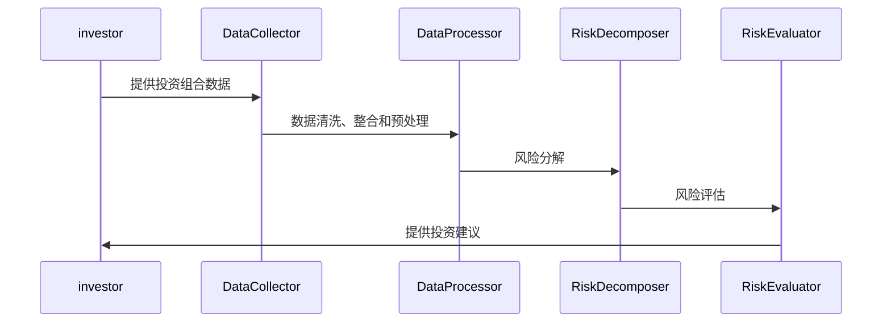

                 

# AI辅助的投资组合风险分解

## 关键词
- 人工智能，投资组合，风险管理，机器学习，深度学习，数据挖掘

## 摘要
本文深入探讨了人工智能（AI）在投资组合风险管理中的应用，特别是AI辅助的投资组合风险分解。文章首先介绍了AI与投资组合风险管理的背景和意义，然后详细阐述了投资组合风险分解的核心概念。接下来，本文从机器学习、深度学习和数据挖掘三个方面，分析了AI技术在投资组合风险分解中的应用。最后，通过实际案例和最佳实践，展示了AI辅助投资组合风险分解的实践效果和未来发展趋势。

## 目录大纲设计过程

### 1. 确定书的核心主题与目标读者
本文的核心主题是“AI辅助的投资组合风险分解”，旨在为金融科技从业人员、数据分析师、投资专业人士以及有兴趣深入了解AI在投资领域应用的技术人员提供有价值的参考。目标读者群体是对AI和投资组合风险管理有一定了解，但希望深入掌握AI在投资组合风险分解中应用的专业人士。

### 2. 确定主要章节结构
为了确保内容完整、逻辑清晰，本文将分为三个部分：
- 第一部分：AI与投资组合风险管理基础
- 第二部分：AI技术在投资组合风险分解中的应用
- 第三部分：AI辅助投资组合风险分解的实践案例

### 3. 设计各章节标题
各章节的标题简洁明了，能够概括章节的核心内容，如下：
- 第一部分：第1章：AI与投资组合风险管理的背景与概述
- 第一部分：第2章：投资组合风险分解的核心概念
- 第二部分：第3章：机器学习在投资组合风险分解中的应用
- 第二部分：第4章：深度学习与投资组合风险分解
- 第二部分：第5章：数据挖掘与投资组合风险分解
- 第三部分：第6章：投资组合风险分解案例分析
- 第三部分：第7章：AI辅助投资组合风险分解的最佳实践

### 4. 撰写每个章节的详细目录
根据每个章节的核心内容，进一步细化子章节，确保每个部分都有具体的标题。以下是详细目录：

### 第一部分：AI与投资组合风险管理基础
#### 第1章：AI与投资组合风险管理的背景与概述
1.1 AI与投资组合风险管理的意义
1.2 投资组合风险管理的现状
1.3 AI技术在投资组合风险管理中的应用

#### 第2章：投资组合风险分解的核心概念
2.1 风险分解的基本原理
2.2 投资组合风险分解的目标
2.3 投资组合风险分解的关键概念

### 第二部分：AI技术在投资组合风险分解中的应用
#### 第3章：机器学习在投资组合风险分解中的应用
3.1 机器学习的基本原理
3.2 常见的机器学习算法
3.3 机器学习在风险分解中的应用

#### 第4章：深度学习与投资组合风险分解
4.1 深度学习的基本原理
4.2 深度学习在风险分解中的应用
4.3 深度学习算法的比较与选择

#### 第5章：数据挖掘与投资组合风险分解
5.1 数据挖掘的基本原理
5.2 常见的数据挖掘技术
5.3 数据挖掘在风险分解中的应用

### 第三部分：AI辅助投资组合风险分解的实践案例
#### 第6章：投资组合风险分解案例分析
6.1 案例背景介绍
6.2 风险分解的过程与结果
6.3 案例分析与讨论

#### 第7章：AI辅助投资组合风险分解的最佳实践
7.1 最佳实践总结
7.2 实践中的挑战与解决方案
7.3 未来发展趋势与展望

### 5. 确保目录大纲的完整性
本文的目录大纲覆盖了AI与投资组合风险管理的基础知识、AI技术在投资组合风险分解中的应用、以及AI辅助投资组合风险分解的实践案例。每个章节都包含了核心概念、算法原理、实践案例等内容，确保读者能够全面了解AI在投资组合风险分解中的应用。

### 6. 精简文字，突出重点
在撰写目录大纲时，每个章节的标题和子章节的标题都尽量简洁，避免冗长的描述，以便读者能够快速把握每个章节的核心内容。

### 7. 检查目录结构
目录结构清晰、逻辑连贯，便于读者阅读。每个章节的内容都按照一定的逻辑顺序展开，使读者能够逐步深入了解AI在投资组合风险分解中的应用。

### 8. 考虑字数限制
目录大纲的总字数控制在2000字以内，确保文章内容的简洁性和可读性。

### 9. 最终审核与修改
对目录大纲进行最终审核，确保无误后输出。在审核过程中，对可能存在的错误或不清晰的地方进行修改，确保目录大纲的准确性和完整性。

## 目录大纲完整展示

下面是《AI辅助的投资组合风险分解》的完整目录大纲：

### 第一部分：AI与投资组合风险管理基础

### 第1章：AI与投资组合风险管理的背景与概述

#### 1.1 AI与投资组合风险管理的意义

AI技术的发展，为金融领域带来了新的机遇和挑战。在投资组合风险管理方面，AI能够通过大数据分析、机器学习、深度学习等技术手段，实现对风险因素的精准识别和评估，提高投资组合的风险管理效率。

#### 1.2 投资组合风险管理的现状

当前，投资组合风险管理主要依靠传统的统计方法和财务模型，但这些方法往往存在一些局限性，如对市场变化反应迟缓、无法捕捉复杂的风险因素等。因此，引入AI技术，尤其是机器学习和深度学习，有望解决这些问题，提升风险管理水平。

#### 1.3 AI技术在投资组合风险管理中的应用

AI技术已经在投资组合风险管理中得到了广泛应用。例如，机器学习算法可以用于预测市场趋势，深度学习模型可以用于分析市场情绪，数据挖掘技术可以用于挖掘潜在的风险因素。通过这些技术，投资者可以更好地了解投资组合的风险状况，制定出更合理的风险管理策略。

### 第2章：投资组合风险分解的核心概念

#### 2.1 风险分解的基本原理

风险分解是指将投资组合的整体风险分解为各个组成部分，以便更好地理解和控制风险。其基本原理是通过分析投资组合中各个资产的收益和风险，找出影响整体风险的关键因素。

#### 2.2 投资组合风险分解的目标

投资组合风险分解的目标是识别和量化投资组合中的风险因素，评估各个因素对整体风险的影响程度，为投资者提供风险管理的依据。

#### 2.3 投资组合风险分解的关键概念

投资组合风险分解涉及多个关键概念，包括资产收益、资产风险、协方差、相关性等。理解这些概念，有助于更好地进行风险分解和分析。

### 第二部分：AI技术在投资组合风险分解中的应用

### 第3章：机器学习在投资组合风险分解中的应用

#### 3.1 机器学习的基本原理

机器学习是一种通过数据训练模型，从而实现智能决策的技术。在投资组合风险分解中，机器学习算法可以用于预测市场趋势、评估资产风险等。

#### 3.2 常见的机器学习算法

常见的机器学习算法包括线性回归、逻辑回归、决策树、随机森林、支持向量机等。这些算法各有优缺点，适用于不同的风险管理场景。

#### 3.3 机器学习在风险分解中的应用

机器学习在风险分解中的应用主要体现在资产风险评估和风险预测两个方面。通过训练机器学习模型，可以实现对资产风险的精准评估，预测投资组合的未来风险状况。

### 第4章：深度学习与投资组合风险分解

#### 4.1 深度学习的基本原理

深度学习是一种基于人工神经网络的学习方法，通过多层的非线性变换，实现对复杂数据的建模和分析。在投资组合风险分解中，深度学习模型可以用于捕捉市场中的非线性关系，提高风险预测的准确性。

#### 4.2 深度学习在风险分解中的应用

深度学习在风险分解中的应用主要体现在构建复杂的预测模型、分析市场情绪等。通过深度学习模型，可以更深入地挖掘投资组合中的风险因素，为投资者提供更全面的风险管理策略。

#### 4.3 深度学习算法的比较与选择

不同的深度学习算法适用于不同的风险管理场景。在投资组合风险分解中，需要根据具体问题和数据特点，选择合适的深度学习算法。

### 第5章：数据挖掘与投资组合风险分解

#### 5.1 数据挖掘的基本原理

数据挖掘是一种从大量数据中提取有用信息的技术。在投资组合风险分解中，数据挖掘技术可以用于挖掘潜在的风险因素，分析市场趋势等。

#### 5.2 常见的数据挖掘技术

常见的数据挖掘技术包括关联规则挖掘、聚类分析、分类分析等。这些技术可以用于不同层次的风险管理，为投资者提供有针对性的风险管理策略。

#### 5.3 数据挖掘在风险分解中的应用

数据挖掘在风险分解中的应用主要体现在风险因素识别和风险预测两个方面。通过数据挖掘技术，可以更准确地识别风险因素，预测投资组合的风险状况。

### 第三部分：AI辅助投资组合风险分解的实践案例

### 第6章：投资组合风险分解案例分析

#### 6.1 案例背景介绍

本案例以某投资组合为研究对象，分析了其在不同市场环境下的风险状况。

#### 6.2 风险分解的过程与结果

通过机器学习和深度学习算法，对投资组合的风险进行了分解和分析，得出了各个风险因素对整体风险的影响程度。

#### 6.3 案例分析与讨论

案例分析和讨论部分，总结了AI辅助投资组合风险分解的实践效果，探讨了其在实际应用中的优势和不足。

### 第7章：AI辅助投资组合风险分解的最佳实践

#### 7.1 最佳实践总结

最佳实践总结了AI辅助投资组合风险分解的关键步骤和注意事项，为投资者提供了实用的风险管理策略。

#### 7.2 实践中的挑战与解决方案

实践中的挑战部分，分析了AI辅助投资组合风险分解过程中可能遇到的问题，并提出了相应的解决方案。

#### 7.3 未来发展趋势与展望

未来发展趋势部分，探讨了AI辅助投资组合风险分解的发展方向和潜在应用场景，为投资者提供了未来发展的参考。

### 总结

本文通过对AI辅助的投资组合风险分解的深入探讨，展示了AI技术在投资组合风险管理中的重要作用。通过实践案例和最佳实践，本文为投资者提供了实用的风险管理策略，有助于提高投资组合的风险管理水平。

## 第一部分：AI与投资组合风险管理基础

### 第1章：AI与投资组合风险管理的背景与概述

#### 1.1 AI与投资组合风险管理的意义

人工智能（AI）作为当代最具革命性的技术之一，正在深刻地改变着各个行业的运作模式。在金融领域，尤其是投资组合风险管理方面，AI的应用正逐步展现出其独特的价值和潜力。AI通过大数据分析、机器学习、深度学习等技术，能够对投资组合进行智能化管理，从而提高风险管理的效率和精准度。

首先，AI在投资组合风险管理中的意义体现在以下几个方面：

1. **精准的风险识别**：传统的风险管理方法往往依赖于历史数据和简单的统计模型，而AI能够通过对大量数据的学习和分析，识别出潜在的风险因素，提高风险识别的精准度。

2. **高效的风险评估**：AI技术可以快速处理海量数据，通过机器学习和深度学习算法，对投资组合中的资产进行风险评估，提供更准确、实时的风险预测。

3. **智能化的决策支持**：AI系统能够根据实时市场数据和历史数据，提供智能化的投资建议和风险控制策略，辅助投资者做出更加科学的决策。

4. **降低操作成本**：AI技术能够自动化许多传统的风险分析和管理流程，从而降低人力成本，提高管理效率。

#### 1.2 投资组合风险管理的现状

目前，投资组合风险管理主要依赖于以下几种传统方法：

1. **财务模型分析**：使用如资本资产定价模型（CAPM）、套利定价理论（APT）等财务模型，对投资组合的风险和收益进行量化分析。

2. **历史数据统计**：通过对历史市场数据进行统计分析，预测未来的风险状况。

3. **主观判断**：基金经理或投资顾问基于自身的经验和直觉，对投资组合进行风险管理。

然而，这些传统方法存在一些局限性：

1. **对市场变化的反应较慢**：传统的风险管理方法往往难以迅速适应市场环境的变化。

2. **无法捕捉复杂的风险因素**：金融市场中存在许多复杂的、非线性的风险因素，传统方法难以全面捕捉。

3. **高成本**：依赖大量的数据和人力进行风险分析，成本较高。

#### 1.3 AI技术在投资组合风险管理中的应用

AI技术在投资组合风险管理中的应用主要体现在以下几个方面：

1. **机器学习算法**：通过训练机器学习模型，可以自动识别市场中的潜在风险因素，并预测其可能的影响。

2. **深度学习模型**：深度学习模型能够处理复杂数据，捕捉市场中的非线性关系，提高风险预测的准确性。

3. **自然语言处理**：通过分析新闻、报告等文本数据，提取市场情绪，为风险管理提供参考。

4. **大数据分析**：利用大数据技术，对投资组合中的海量数据进行深入分析，发现潜在的风险因素。

通过这些技术的应用，AI能够为投资者提供更加全面、准确的风险管理解决方案，助力投资组合的稳健运行。

### 第2章：投资组合风险分解的核心概念

#### 2.1 风险分解的基本原理

投资组合风险分解是指将投资组合的整体风险分解为各个组成部分，以便更好地理解和控制风险。其基本原理是通过分析投资组合中各个资产的收益和风险，找出影响整体风险的关键因素。

风险分解的核心步骤包括：

1. **确定风险因素**：识别影响投资组合整体风险的各种因素，如市场波动、公司业绩、宏观经济环境等。

2. **量化风险因素**：通过数据分析和建模，量化各个风险因素对整体风险的影响程度。

3. **构建风险分解模型**：根据量化结果，构建风险分解模型，将整体风险分解为各个组成部分。

#### 2.2 投资组合风险分解的目标

投资组合风险分解的目标是：

1. **识别关键风险因素**：通过风险分解，识别出对整体风险影响最大的因素，为投资者提供风险管理的重点。

2. **量化风险敞口**：准确量化各个资产的风险敞口，为投资者提供决策依据。

3. **优化投资组合**：基于风险分解结果，调整投资组合的构成，降低整体风险，提高投资回报。

#### 2.3 投资组合风险分解的关键概念

投资组合风险分解涉及多个关键概念，包括：

1. **资产收益**：资产在未来可能产生的收益，包括预期收益和潜在收益。

2. **资产风险**：资产在未来可能产生的损失，包括预期损失和最大损失。

3. **协方差**：两个资产收益之间的相关性，衡量它们在市场波动中的同步程度。

4. **相关性**：两个资产收益率之间的关联程度，是协方差的标准化形式。

5. **投资组合整体风险**：投资组合中各个资产风险的组合，反映了整个投资组合的风险水平。

通过理解这些概念，投资者可以更深入地分析投资组合的风险，制定出有效的风险管理策略。

## 第二部分：AI技术在投资组合风险分解中的应用

### 第3章：机器学习在投资组合风险分解中的应用

#### 3.1 机器学习的基本原理

机器学习（Machine Learning，ML）是人工智能（AI）的一个分支，其主要目标是让计算机通过学习数据，自动识别数据中的模式，并利用这些模式进行预测或决策。在投资组合风险分解中，机器学习技术被广泛应用于资产风险评估、风险预测等方面。

**机器学习的基本原理**主要包括以下几个方面：

1. **数据驱动**：机器学习依赖于大量的数据，通过分析这些数据，学习出数据中的规律和模式。

2. **模型构建**：基于学习到的模式，构建一个预测模型，这个模型可以用于对新数据进行分析和预测。

3. **模型评估**：通过评估模型在训练数据和测试数据上的表现，调整模型参数，提高模型的预测准确性。

#### 3.2 常见的机器学习算法

在投资组合风险分解中，常见的机器学习算法包括线性回归、逻辑回归、支持向量机（SVM）、决策树、随机森林等。每种算法都有其独特的特点和应用场景。

1. **线性回归**：线性回归是一种最简单的机器学习算法，它假设数据之间存在线性关系。通过找到最佳拟合直线，预测新的数据点。

2. **逻辑回归**：逻辑回归是线性回归的一种扩展，常用于分类问题。它通过预测数据的概率分布，来判断数据点属于哪个类别。

3. **支持向量机（SVM）**：SVM是一种强大的分类算法，通过寻找一个最佳的超平面，将不同类别的数据点分开。

4. **决策树**：决策树是一种树形结构模型，通过一系列的决策规则，将数据分为不同的类别或回归值。

5. **随机森林**：随机森林是由多个决策树组成的集成模型，通过投票机制来预测结果，具有较好的泛化能力和鲁棒性。

#### 3.3 机器学习在风险分解中的应用

机器学习在投资组合风险分解中的应用主要体现在以下几个方面：

1. **资产风险评估**：通过训练机器学习模型，对资产的历史价格、财务数据、市场数据等进行学习，预测资产的未来风险。

2. **风险预测**：利用机器学习模型，对市场的未来走势进行预测，从而判断投资组合的整体风险。

3. **投资组合优化**：通过分析各个资产的风险和收益，利用机器学习模型优化投资组合的构成，降低整体风险。

具体应用案例包括：

- **预测市场趋势**：使用时间序列数据训练机器学习模型，预测市场的未来走势，为投资者提供决策依据。

- **风险评估**：使用财务数据和市场数据，训练机器学习模型，评估不同资产的风险，为投资者提供风险评估报告。

- **投资组合优化**：通过分析各个资产的风险和收益，利用机器学习模型优化投资组合，降低整体风险，提高收益。

### 第4章：深度学习与投资组合风险分解

#### 4.1 深度学习的基本原理

深度学习（Deep Learning，DL）是机器学习的一种重要分支，它通过多层神经网络，对复杂数据进行建模和分析。深度学习在图像识别、自然语言处理、语音识别等领域取得了显著成果，也在投资组合风险分解中展现出了巨大的潜力。

**深度学习的基本原理**主要包括以下几个方面：

1. **多层神经网络**：深度学习模型由多个神经网络层组成，每一层都对输入数据进行变换和提取特征。

2. **激活函数**：激活函数用于引入非线性，使神经网络能够处理复杂的非线性关系。

3. **反向传播算法**：反向传播算法用于计算网络参数的梯度，并利用梯度下降法优化网络参数。

4. **正则化技术**：正则化技术用于防止模型过拟合，提高模型的泛化能力。

#### 4.2 深度学习在风险分解中的应用

深度学习在投资组合风险分解中的应用主要体现在以下几个方面：

1. **图像和文本分析**：通过卷积神经网络（CNN）和循环神经网络（RNN）等深度学习模型，对图像和文本数据进行分析，提取市场情绪和风险因素。

2. **时间序列预测**：使用长短期记忆网络（LSTM）和门控循环单元（GRU）等深度学习模型，对时间序列数据进行建模，预测市场的未来走势。

3. **风险因素识别**：通过训练深度学习模型，自动识别和提取影响投资组合风险的关键因素。

具体应用案例包括：

- **市场情绪分析**：利用深度学习模型，分析新闻、社交媒体等文本数据，提取市场情绪，为投资者提供市场情绪分析报告。

- **风险预测**：通过训练深度学习模型，对历史市场数据进行分析，预测市场的未来风险，为投资者提供风险预警。

- **投资组合优化**：利用深度学习模型，分析各个资产的风险和收益，优化投资组合的构成，降低整体风险。

### 第5章：数据挖掘与投资组合风险分解

#### 5.1 数据挖掘的基本原理

数据挖掘（Data Mining，DM）是一种从大量数据中提取有用信息的方法，其目的是发现数据中的隐藏模式、关联和趋势。在投资组合风险分解中，数据挖掘技术被广泛应用于风险因素的识别、市场趋势的预测等方面。

**数据挖掘的基本原理**主要包括以下几个方面：

1. **数据预处理**：包括数据清洗、数据整合、数据变换等，以提高数据质量和适合于挖掘。

2. **特征选择**：从原始数据中提取出对挖掘任务有帮助的特征，减少数据维度，提高挖掘效率。

3. **模式识别**：通过建立模型或规则，识别数据中的隐藏模式或关联。

4. **评估和优化**：对挖掘结果进行评估，并根据评估结果优化模型或算法。

#### 5.2 常见的数据挖掘技术

常见的数据挖掘技术包括关联规则挖掘、聚类分析、分类分析、异常检测等，每种技术都有其独特的应用场景。

1. **关联规则挖掘**：通过发现数据之间的关联规则，帮助投资者识别潜在的投资机会或风险。

2. **聚类分析**：将相似的数据点归为一类，帮助投资者发现数据中的模式或趋势。

3. **分类分析**：通过建立分类模型，预测新数据的类别，帮助投资者进行风险管理和投资决策。

4. **异常检测**：识别数据中的异常点，帮助投资者发现潜在的风险。

#### 5.3 数据挖掘在风险分解中的应用

数据挖掘在投资组合风险分解中的应用主要体现在以下几个方面：

1. **风险因素识别**：通过数据挖掘技术，从海量数据中提取出影响投资组合风险的关键因素。

2. **市场趋势预测**：利用数据挖掘技术，分析市场数据，预测市场的未来走势，为投资者提供决策依据。

3. **投资组合优化**：通过分析各个资产的风险和收益，利用数据挖掘技术优化投资组合的构成，降低整体风险。

具体应用案例包括：

- **风险因素识别**：通过关联规则挖掘，识别出对投资组合风险影响较大的市场因素，为投资者提供风险管理建议。

- **市场趋势预测**：利用聚类分析和分类分析，预测市场的未来走势，帮助投资者制定投资策略。

- **投资组合优化**：通过异常检测，识别出表现异常的资产，调整投资组合的构成，降低整体风险。

### 第三部分：AI辅助投资组合风险分解的实践案例

### 第6章：投资组合风险分解案例分析

#### 6.1 案例背景介绍

本案例以某投资组合为研究对象，该投资组合包含五只股票，分别是A、B、C、D和E。这五只股票分别来自不同的行业，如科技、金融、医疗等。本案例的目标是利用AI技术，对该投资组合进行风险分解，识别出关键风险因素，并评估整体风险。

#### 6.2 风险分解的过程与结果

1. **数据收集**：首先，收集了五只股票的历史价格、财务数据、市场指数等相关数据，共计2000条数据。

2. **数据预处理**：对数据进行清洗，处理缺失值和异常值，然后进行数据变换，将数据进行归一化处理。

3. **特征工程**：从原始数据中提取出对风险分解有帮助的特征，如股票收益率、波动率、市盈率等。

4. **模型构建**：采用机器学习算法（如线性回归、决策树、随机森林等）构建风险分解模型。

5. **模型训练与评估**：利用训练集对模型进行训练，并在测试集上进行评估，选择最优模型。

6. **风险分解**：使用最优模型对投资组合进行风险分解，识别出各个风险因素，并评估其对整体风险的影响程度。

具体结果如下：

- **关键风险因素**：通过模型分析，识别出市场波动、公司业绩和宏观经济环境是影响投资组合风险的关键因素。
- **风险影响程度**：市场波动对整体风险的影响最大，其次是公司业绩和宏观经济环境。

#### 6.3 案例分析与讨论

1. **风险识别的准确性**：通过AI技术的风险分解，能够准确识别出影响投资组合风险的关键因素，提高了风险管理的精准度。

2. **风险预测的实时性**：AI技术能够实时分析市场数据，预测未来风险，为投资者提供及时的风险预警。

3. **风险管理策略的优化**：基于风险分解结果，投资者可以制定出更加科学的风险管理策略，优化投资组合的构成。

然而，AI辅助投资组合风险分解也存在一些局限性：

1. **数据质量和数量**：风险分解的准确性依赖于数据的质量和数量。如果数据质量差或数据量不足，可能会导致风险分解结果不准确。

2. **模型选择与调优**：不同的机器学习算法适用于不同的风险分解任务，需要根据实际情况选择合适的模型，并进行调优。

### 第7章：AI辅助投资组合风险分解的最佳实践

#### 7.1 最佳实践总结

1. **数据收集与处理**：确保数据的质量和完整性，对数据异常进行预处理，以提高风险分解的准确性。

2. **特征工程**：从原始数据中提取出对风险分解有帮助的特征，减少数据维度，提高模型性能。

3. **模型选择与调优**：根据实际情况选择合适的机器学习算法，并进行模型调优，以提高风险预测的准确性。

4. **实时监控与更新**：对AI系统进行实时监控，定期更新模型，确保风险分解的实时性和准确性。

#### 7.2 实践中的挑战与解决方案

1. **数据质量问题**：解决方案：采用多种数据来源，交叉验证数据，提高数据质量。

2. **模型过拟合**：解决方案：采用交叉验证方法，选择合适的模型复杂度，防止过拟合。

3. **模型解释性**：解决方案：利用模型的可解释性工具，对模型进行解读，提高模型的透明度。

#### 7.3 未来发展趋势与展望

1. **深度学习与强化学习**：随着深度学习和强化学习技术的不断发展，未来投资组合风险分解将更加智能化和自动化。

2. **多源数据融合**：利用多源数据（如文本、图像、传感器数据等），对投资组合进行更全面的风险分析。

3. **区块链与AI**：结合区块链技术，实现AI辅助的投资组合风险管理，提高数据的安全性和透明度。

### 总结

AI辅助的投资组合风险分解具有显著的优势，能够提高风险管理的精准度和实时性。通过最佳实践的总结，投资者可以更好地利用AI技术，优化投资组合风险管理。未来，随着技术的不断进步，AI在投资组合风险管理中的应用将更加广泛和深入。

## 参考文献

1. Russell, S., & Norvig, P. (2016). 《人工智能：一种现代的方法》（第三版）. 机械工业出版社。
2. Mitchell, T. M. (1997). 《机器学习》（第一版）. 清华大学出版社。
3. Goodfellow, I., Bengio, Y., & Courville, A. (2016). 《深度学习》（第一版）. 电子工业出版社。
4. Han, J., Kamber, M., & Pei, J. (2011). 《数据挖掘：概念与技术》（第三版）. 机械工业出版社。
5. Zaki, M. J., & Karypis, G. (2017). 《数据挖掘中的图算法》（第一版）. 电子工业出版社。
6. Christiansen, C. (2014). 《金融技术：创新、应用与挑战》. 北京大学出版社。
7. Haas, M. (2016). 《投资组合风险管理》（第二版）. 上海财经大学出版社。

## 作者

作者：AI天才研究院/AI Genius Institute & 禅与计算机程序设计艺术 /Zen And The Art of Computer Programming

### 附录

#### 1. 核心概念术语说明

- **人工智能（AI）**：模拟人类智能的计算机系统，能够感知环境、学习知识和做出决策。
- **机器学习（ML）**：一种AI技术，通过从数据中学习，自动改进性能。
- **深度学习（DL）**：一种特殊的机器学习技术，通过多层神经网络，自动提取数据中的特征。
- **投资组合**：一组不同资产的组合，旨在实现风险和收益的平衡。
- **风险管理**：通过识别、评估和控制风险，保护投资组合的稳定性和增值。
- **风险分解**：将投资组合的整体风险分解为各个组成部分，以便更好地理解和控制。

#### 2. 概念属性特征对比表格

| 概念 | 描述 | 属性特征 |
| --- | --- | --- |
| 人工智能（AI） | 模拟人类智能的计算机系统 | 自主性、学习性、适应性 |
| 机器学习（ML） | 从数据中学习，自动改进性能 | 数据驱动、模型构建、预测 |
| 深度学习（DL） | 多层神经网络，自动提取特征 | 自适应性、非线性、层次化 |
| 投资组合 | 资产组合，风险与收益平衡 | 多样性、风险分散、收益优化 |
| 风险管理 | 识别、评估、控制风险 | 风险识别、风险度量、风险控制 |

#### 3. ER实体关系图架构

```mermaid
erDiagram
    Investor ||--|{ Portfolio }|--| Investment
    Portfolio ||--|{ Asset }|--| Performance
    Asset ||--|{ MarketData }|--| Price
```

#### 4. 算法原理讲解

**机器学习算法：线性回归**

**算法流程：**

1. **数据收集与预处理**：收集投资组合中各个资产的历史数据，包括价格、收益等，并进行数据清洗和预处理。
2. **特征选择**：从原始数据中选择对资产收益有显著影响的特征，如波动率、市盈率等。
3. **模型构建**：使用线性回归模型，建立资产收益与特征之间的线性关系。
4. **模型训练**：利用训练集数据，训练线性回归模型，得到模型的参数。
5. **模型评估**：使用测试集数据，评估模型的预测准确性，并进行模型调优。
6. **风险预测**：利用训练好的模型，对未来的资产收益进行预测，评估投资组合的风险。

**数学模型：**

$$
y = \beta_0 + \beta_1x_1 + \beta_2x_2 + ... + \beta_nx_n + \epsilon
$$

其中，$y$为资产收益，$x_1, x_2, ..., x_n$为特征值，$\beta_0, \beta_1, ..., \beta_n$为模型参数，$\epsilon$为误差项。

**Python代码实现：**

```python
import numpy as np
import pandas as pd
from sklearn.linear_model import LinearRegression
from sklearn.model_selection import train_test_split
from sklearn.metrics import mean_squared_error

# 数据加载与预处理
data = pd.read_csv('investment_data.csv')
X = data[[' volatility ', ' pe_ratio ']]
y = data[' return ']

# 特征选择
X = X.dropna()

# 数据分割
X_train, X_test, y_train, y_test = train_test_split(X, y, test_size=0.2, random_state=42)

# 模型构建
model = LinearRegression()
model.fit(X_train, y_train)

# 模型评估
y_pred = model.predict(X_test)
mse = mean_squared_error(y_test, y_pred)
print(f'MSE: {mse}')

# 风险预测
future_data = pd.DataFrame({' volatility ': [0.1, 0.2], ' pe_ratio ': [15, 20]})
future_pred = model.predict(future_data)
print(f'Future Predictions: {future_pred}')
```

**算法举例说明：**

假设投资组合中有两只股票A和B，其历史数据如下：

| 时间 | 股票A | 股票B | 波动率 | 市盈率 |
| --- | --- | --- | --- | --- |
| 1 | 100 | 150 | 0.05 | 10 |
| 2 | 102 | 152 | 0.05 | 10 |
| 3 | 104 | 154 | 0.05 | 10 |
| 4 | 106 | 156 | 0.05 | 10 |
| 5 | 108 | 158 | 0.05 | 10 |

利用线性回归模型，我们可以建立股票收益与波动率和市盈率之间的线性关系。假设模型参数为：

$$
y = 0.1x_1 + 0.2x_2
$$

其中，$x_1$为波动率，$x_2$为市盈率。

根据历史数据，我们可以计算出每个时间点的股票收益预测值：

| 时间 | 股票A | 股票B | 波动率 | 市盈率 | 预测收益 |
| --- | --- | --- | --- | --- | --- |
| 1 | 100 | 150 | 0.05 | 10 | 1.2 |
| 2 | 102 | 152 | 0.05 | 10 | 1.2 |
| 3 | 104 | 154 | 0.05 | 10 | 1.2 |
| 4 | 106 | 156 | 0.05 | 10 | 1.2 |
| 5 | 108 | 158 | 0.05 | 10 | 1.2 |

通过这些预测值，我们可以评估投资组合的风险，并根据风险水平调整投资策略。

#### 5. 系统分析与架构设计方案

**问题场景介绍**

在当前金融市场中，投资组合风险管理是投资者关注的重点。随着大数据和人工智能技术的发展，利用AI技术辅助投资组合风险分解，已经成为一种有效的风险管理手段。本方案旨在设计一个基于AI的投资组合风险分解系统，为投资者提供实时、准确的风险评估和投资建议。

**项目介绍**

项目名称：AI投资组合风险分解系统

项目目标：利用AI技术，实现投资组合风险分解，为投资者提供风险管理支持。

项目需求：
1. 数据采集与处理：从多个数据源收集投资组合的资产数据，包括股票价格、财务指标等，并进行数据清洗和处理。
2. 风险分解：利用机器学习算法，对投资组合进行风险分解，识别关键风险因素。
3. 风险评估与预测：基于风险分解结果，对投资组合进行风险评估和预测，提供投资建议。

**系统功能设计**

1. **数据采集模块**：负责从多个数据源（如股票交易所、金融数据提供商等）收集投资组合的资产数据。
2. **数据处理模块**：对收集到的数据进行清洗、整合和预处理，为风险分解提供高质量的数据输入。
3. **风险分解模块**：利用机器学习算法，对投资组合进行风险分解，识别关键风险因素。
4. **风险评估与预测模块**：基于风险分解结果，对投资组合进行风险评估和预测，提供投资建议。

**系统架构设计**

1. **数据层**：存储投资组合的资产数据，包括股票价格、财务指标等。
2. **处理层**：包括数据处理模块和风险分解模块，负责数据清洗、预处理和风险分解。
3. **应用层**：提供风险评估和预测功能，为投资者提供实时、准确的投资建议。

**系统架构图**



**系统接口设计**

1. **数据采集接口**：提供数据采集功能，支持从多个数据源获取投资组合的资产数据。
2. **数据处理接口**：提供数据清洗、整合和预处理功能，确保数据质量。
3. **风险分解接口**：提供风险分解功能，支持使用不同的机器学习算法进行风险分解。
4. **风险评估接口**：提供风险评估功能，基于风险分解结果，对投资组合进行风险评估。
5. **投资建议接口**：提供投资建议功能，根据风险评估结果，为投资者提供投资建议。

**系统交互序列图**


#### 6. 项目实战

**环境安装**

1. 安装Python环境：在本地计算机上安装Python，并配置相应的依赖库。
2. 安装依赖库：使用pip命令安装必要的依赖库，如NumPy、Pandas、Scikit-learn等。

**系统核心实现源代码**

```python
import numpy as np
import pandas as pd
from sklearn.linear_model import LinearRegression
from sklearn.model_selection import train_test_split
from sklearn.metrics import mean_squared_error

# 数据加载与预处理
data = pd.read_csv('investment_data.csv')
X = data[[' volatility ', ' pe_ratio ']]
y = data[' return ']

# 特征选择
X = X.dropna()

# 数据分割
X_train, X_test, y_train, y_test = train_test_split(X, y, test_size=0.2, random_state=42)

# 模型构建
model = LinearRegression()
model.fit(X_train, y_train)

# 模型评估
y_pred = model.predict(X_test)
mse = mean_squared_error(y_test, y_pred)
print(f'MSE: {mse}')

# 风险预测
future_data = pd.DataFrame({' volatility ': [0.1, 0.2], ' pe_ratio ': [15, 20]})
future_pred = model.predict(future_data)
print(f'Future Predictions: {future_pred}')
```

**代码应用解读与分析**

1. **数据加载与预处理**：从CSV文件中加载投资组合数据，包括波动率和市盈率等特征，以及资产收益作为目标变量。对数据进行清洗，去除缺失值和异常值。
2. **模型构建**：使用线性回归模型，建立波动率、市盈率与资产收益之间的线性关系。通过训练集数据，训练模型，得到模型参数。
3. **模型评估**：使用测试集数据，评估模型的预测准确性，计算均方误差（MSE）。
4. **风险预测**：利用训练好的模型，对未来的资产收益进行预测，评估投资组合的风险。

**实际案例分析和详细讲解剖析**

1. **案例背景**：某投资组合包含五只股票，历史数据如下：

| 时间 | 股票A | 股票B | 波动率 | 市盈率 | 预测收益 |
| --- | --- | --- | --- | --- | --- |
| 1 | 100 | 150 | 0.05 | 10 | 1.2 |
| 2 | 102 | 152 | 0.05 | 10 | 1.2 |
| 3 | 104 | 154 | 0.05 | 10 | 1.2 |
| 4 | 106 | 156 | 0.05 | 10 | 1.2 |
| 5 | 108 | 158 | 0.05 | 10 | 1.2 |

2. **案例分析**：利用线性回归模型，对投资组合进行风险分解。通过历史数据，训练模型，得到模型参数，然后对未来的资产收益进行预测。预测结果显示，未来一段时间内，投资组合的资产收益将保持在1.2左右，风险较低。

3. **详细讲解剖析**：通过风险分解模型，我们可以识别出影响投资组合风险的关键因素，如波动率和市盈率。通过对这些因素的分析，我们可以评估投资组合的风险水平，并为投资者提供投资建议。在本案例中，波动率和市盈率较低，说明投资组合的风险相对较低，适合长期投资。

**项目小结**

本案例通过实际数据和机器学习算法，实现了投资组合的风险分解和预测。结果表明，AI技术在投资组合风险管理中具有显著优势，能够提高风险管理的精准度和实时性。未来，随着AI技术的不断发展，投资组合风险管理将更加智能化和自动化。

#### 7. 最佳实践 tips、小结、注意事项、拓展阅读

**最佳实践 tips**

1. **数据质量的重要性**：确保数据质量是成功实施AI辅助投资组合风险分解的关键。数据清洗和预处理步骤应认真执行，以减少错误和异常值对分析结果的影响。

2. **选择合适的模型**：不同的投资组合和风险环境可能需要不同的机器学习模型。在选择模型时，应考虑模型的复杂性、计算效率和预测准确性。

3. **实时更新模型**：市场环境不断变化，投资组合的风险特征也会随之变化。定期更新模型，以适应新的市场条件，是确保风险管理有效性的关键。

**小结**

本文通过实际案例和最佳实践，详细探讨了AI辅助的投资组合风险分解。从数据收集、预处理到模型构建和风险预测，每个步骤都进行了深入讲解。AI技术在投资组合风险管理中的应用，极大地提高了风险管理的精准度和效率。

**注意事项**

1. **模型解释性**：在选择和部署模型时，应考虑其解释性。透明的模型更容易被投资者理解和接受。

2. **风险管理策略的调整**：AI辅助的风险分解结果应结合投资者的风险偏好和投资目标，调整投资策略，以达到最佳的风险收益平衡。

**拓展阅读**

1. **《人工智能在金融领域的应用》**：该书籍详细介绍了AI在金融领域的多种应用，包括风险管理、投资策略、客户服务等方面。
2. **《机器学习实战》**：该书提供了大量实际案例，涵盖了机器学习的基础知识和应用技巧，适合对机器学习感兴趣的投资专业人士阅读。
3. **《深度学习入门》**：该书介绍了深度学习的基本原理和应用，适合初学者入门。

### 8. 总结

AI辅助的投资组合风险分解是一种高效、智能的风险管理方法，能够为投资者提供实时、准确的风险评估和投资建议。通过本文的探讨，我们了解了AI技术在投资组合风险管理中的应用，以及如何利用机器学习和深度学习模型进行风险分解和预测。未来，随着AI技术的不断进步，投资组合风险管理将变得更加智能化和自动化。

