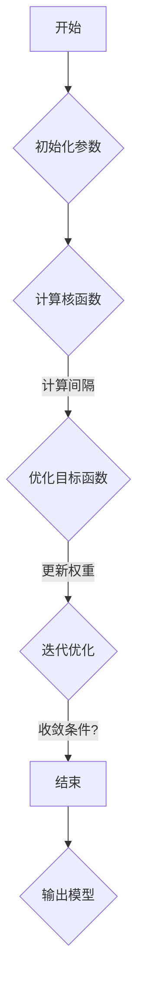
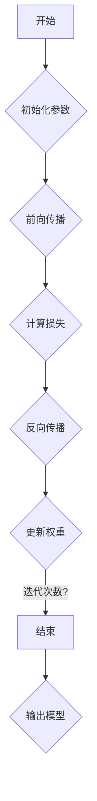
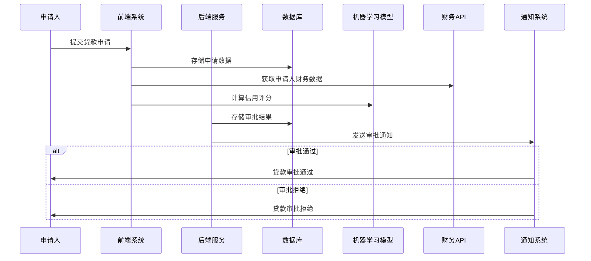
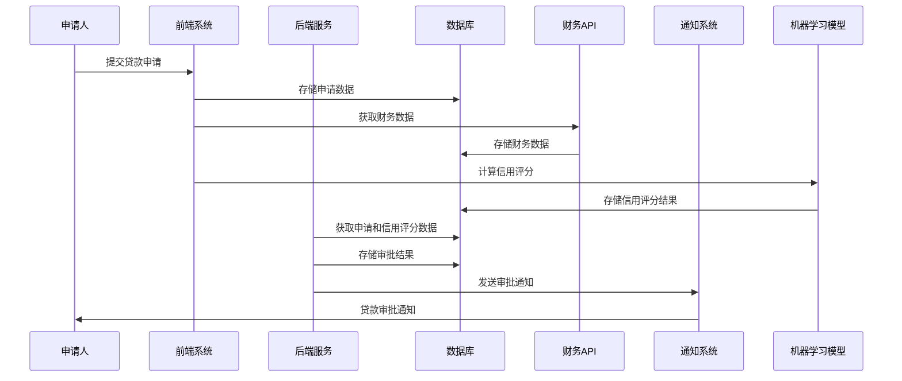

                 

### 第一部分：AI驱动的个人信贷审批系统设计概述

在现代金融科技（FinTech）迅猛发展的背景下，个人信贷审批系统已成为银行业务中的重要一环。传统的信贷审批过程通常耗时较长，涉及大量人工审核，不仅效率低下，还存在信息不对称和主观偏见的风险。随着人工智能（AI）技术的不断进步，利用AI驱动的个人信贷审批系统成为了一种新型的解决方案，旨在提高审批效率、降低成本、减少错误，同时提升客户体验。

### 1.1.1 个人信贷审批的现状

当前的信贷审批流程一般包括以下几个步骤：申请人提交申请、银行或金融机构进行初步审核、风险管理部门进行风险评估、审批决策、放款。这个过程中，人工审核占据了相当大的比重，导致审批周期较长。此外，人工审核易受主观因素的影响，可能导致审批结果不准确。据统计，一些大型的银行在处理个人信贷申请时，审批时间通常需要几个工作日甚至更久。

### 1.1.2 人工智能在金融行业的应用

人工智能在金融行业的应用已经得到了广泛认可，尤其是在风险管理、客户服务、欺诈检测等方面。AI技术，如机器学习、深度学习、自然语言处理等，被用于分析大量的数据，从中提取有价值的信息，从而辅助决策。在个人信贷审批领域，AI的应用主要体现在以下几个方面：

1. **数据挖掘**：通过分析大量的历史数据，识别出影响信贷审批的关键因素，如信用评分、还款能力等。
2. **风险评估**：利用机器学习模型对申请人的信用风险进行评估，提供更准确的审批决策。
3. **自动化审批**：通过构建智能审批系统，实现信贷申请的自动化处理，减少人工干预。
4. **客户服务**：利用自然语言处理技术，提供智能客服服务，解答客户的疑问，提升客户体验。

### 1.1.3 系统设计的目标与挑战

设计一个AI驱动的个人信贷审批系统，主要目标包括：

- **提高审批效率**：通过自动化处理，大幅缩短审批时间，提升业务处理速度。
- **降低审批成本**：减少人工干预，降低人力成本和运营成本。
- **减少错误率**：利用AI算法，降低审批错误率，提高审批的准确性。
- **提升客户体验**：提供24小时无间断的智能服务，满足客户的多样化需求。

然而，系统设计过程中也面临一些挑战：

- **数据质量**：信贷审批系统依赖于大量高质量的数据，数据的质量直接影响模型的准确性。
- **模型复杂度**：AI模型复杂度高，需要大量计算资源，且训练和优化过程耗时较长。
- **隐私保护**：在处理个人金融数据时，必须确保数据的安全性和隐私性。

总结来说，AI驱动的个人信贷审批系统设计是一项复杂但极具前景的任务，通过合理的设计和实现，有望解决传统信贷审批中的诸多问题，推动金融行业的数字化转型。

### 2.1.1 人工智能与机器学习的基本概念

#### 什么是人工智能（AI）？

人工智能（Artificial Intelligence，简称AI）是指通过计算机程序实现的智能行为，使其能够模拟、延伸甚至超越人类智能。AI涵盖了多个领域，包括机器学习、自然语言处理、计算机视觉等。AI的目标是实现机器的自主学习和决策能力，使其在特定任务上达到或超越人类的表现。

#### 机器学习（Machine Learning）的基本概念

机器学习是AI的核心分支，主要研究如何让计算机通过学习和经验改进其性能。机器学习的基本过程包括数据收集、数据预处理、模型训练和模型评估。机器学习模型通过分析大量数据，从中提取特征，建立预测模型，从而进行决策或预测。

#### 数据收集与预处理

数据收集是机器学习的第一步，也是最为关键的一步。高质量的数据是模型训练的基础，因此需要从多个渠道获取大量、多样化的数据。数据收集后，需要进行预处理，包括数据清洗、数据归一化、缺失值处理等，以确保数据的质量和一致性。

#### 模型训练与评估

在数据预处理完成后，进入模型训练阶段。机器学习模型通过训练算法，从数据中学习特征和规律，建立预测模型。常见的训练算法包括线性回归、决策树、支持向量机等。训练完成后，需要对模型进行评估，以确定其性能和可靠性。常见的评估指标包括准确率、召回率、F1分数等。

#### 模型的泛化能力

模型的泛化能力是指其在新数据上的表现，即模型能否在未见过的数据上实现准确的预测。良好的泛化能力是机器学习模型成功的关键，也是防止过拟合（模型在训练数据上表现良好，但在新数据上表现不佳）的重要手段。

#### 机器学习在信贷审批中的应用

在信贷审批领域，机器学习模型可以用于风险评估、欺诈检测、信用评分等方面。例如，银行可以通过训练信用评分模型，根据申请人的历史数据和行为特征，预测其信用风险，从而做出更准确的审批决策。此外，机器学习还可以用于识别欺诈行为，通过分析异常交易模式和用户行为，及时发现和防范欺诈风险。

总的来说，机器学习为信贷审批系统带来了革命性的变化，通过自动化和智能化的手段，提高了审批效率和准确性，降低了成本，同时也提升了客户的体验。然而，这也对数据质量、模型设计和应用场景提出了更高的要求，需要不断优化和改进。

### 2.1.2 数据挖掘与预测模型

数据挖掘（Data Mining）是机器学习的一个应用分支，旨在从大量的数据中发现隐藏的模式和知识。在个人信贷审批系统中，数据挖掘扮演着至关重要的角色，通过分析海量数据，提取有用的信息，辅助信贷审批决策。

#### 数据挖掘的基本过程

数据挖掘的基本过程包括数据收集、数据预处理、模式识别和结果验证。首先，数据收集是数据挖掘的基础，需要获取包括申请人历史信用记录、交易记录、社交信息等在内的多样化数据。然后，进行数据预处理，包括数据清洗、数据归一化和特征提取等步骤，以提高数据的质量和一致性。在预处理完成后，使用数据挖掘算法识别数据中的潜在模式，如关联规则、聚类分析、分类和回归分析等。

#### 预测模型

预测模型是数据挖掘的核心，其目标是根据已有数据预测未来事件或行为。在个人信贷审批中，常见的预测模型包括：

1. **回归模型**：用于预测连续值，如预测申请人的信用评分。
2. **分类模型**：用于预测离散值，如判断申请人是否具有信用风险。
3. **聚类模型**：用于发现数据中的相似群体，如识别高风险客户群体。

#### 数据挖掘与预测模型在信贷审批中的应用

1. **信用评分**：通过分析申请人的历史数据，构建信用评分模型，预测其信用风险，辅助审批决策。
2. **欺诈检测**：通过识别异常交易模式和用户行为，预测欺诈行为，提高审批安全性。
3. **客户行为分析**：通过分析客户的历史行为数据，预测其未来的还款行为，提供个性化的信贷服务。

总的来说，数据挖掘和预测模型在个人信贷审批系统中发挥着重要作用，通过自动化和智能化的手段，提高了审批效率和准确性，降低了风险。然而，这也对数据质量、模型设计和应用场景提出了更高的要求，需要不断优化和改进。

### 2.1.3 概念属性特征对比表格

在设计和实现AI驱动的个人信贷审批系统时，理解并对比不同概念属性特征至关重要。以下是一个简化的概念属性特征对比表格，用于展示关键概念和其属性特征：

| 概念                 | 属性特征                                                                                   | 说明                                                         |
|----------------------|-------------------------------------------------------------------------------------------|--------------------------------------------------------------|
| 申请人信息           | 姓名、身份证号码、联系方式、居住地址                                               | 个人基本信息，用于身份验证和联系。                             |
| 财务信息             | 收入状况、债务状况、信用记录                                                      | 评估个人财务状况和信用能力的重要依据。                         |
| 社交信息             | 社交网络活动、朋友圈互动、职业背景                                                  | 辅助评估个人稳定性和社会信用。                                 |
| 行为特征             | 消费习惯、还款记录、信用申请历史                                                  | 分析个人行为模式，预测信用风险。                             |
| 模型类型             | 决策树、支持向量机、神经网络                                                      | 用于分类和回归分析，构建信用评分模型。                         |
| 数据质量             | 完整性、准确性、一致性、及时性                                                     | 高质量数据是模型准确性的基础。                               |
| 泛化能力             | 模型在新数据上的表现能力                                                           | 决定模型在实际应用中的效果。                                 |
| 模型评估指标         | 准确率、召回率、F1分数、AUC曲线                                                   | 用于评估模型性能和调整模型参数。                             |

#### 对比表格的应用

通过上述对比表格，可以清晰地看到不同概念和属性特征在个人信贷审批系统中的作用和重要性。例如，申请人信息和财务信息是基础数据，必须保证数据的完整性和准确性；行为特征则用于辅助评估，需要通过数据挖掘和机器学习技术进行深入分析。模型类型的选择直接影响信用评分的准确性和效率，而数据质量和泛化能力则是模型性能的关键因素。模型评估指标则为模型优化提供了客观依据，确保模型在实际应用中的有效性。

#### 对比表格的扩展

在实际应用中，可以根据具体需求扩展对比表格，包括更多详细的属性特征和更具体的说明。例如，可以增加对模型训练时间、计算资源消耗的对比，以及在不同业务场景下的适用性分析。这样的扩展有助于全面了解各个概念和属性特征对系统性能的影响，为系统的设计和优化提供更深入的支持。

### 2.1.4 ER实体关系图架构

实体-关系（Entity-Relationship，简称ER）图是数据库设计中常用的工具，用于描述数据实体及其之间的关系。在AI驱动的个人信贷审批系统中，ER图可以帮助我们理解系统中各个实体及其交互关系，从而设计出高效的数据库架构。

#### ER图的基本概念

ER图包括三个基本组成部分：实体（Entity）、属性（Attribute）和关系（Relationship）。

1. **实体**：代表系统中的对象，如申请人、贷款产品、信用评分模型等。
2. **属性**：描述实体的特征，如申请人的姓名、身份证号码、收入状况等。
3. **关系**：描述实体之间的关联，如申请人申请贷款、贷款产品关联特定利率等。

#### 个人信贷审批系统的ER图

在个人信贷审批系统中，ER图可以描述以下几个关键实体及其关系：

1. **申请人**（Applicant）：包括姓名、身份证号码、联系方式、居住地址等属性。
2. **贷款产品**（LoanProduct）：包括贷款种类、利率、还款期限等属性。
3. **申请记录**（Application）：记录申请人的贷款申请信息，包括申请时间、申请金额等。
4. **信用评分模型**（CreditRatingModel）：存储信用评分模型的参数和评估结果。
5. **审批结果**（ApprovalResult）：记录贷款申请的审批结果，如通过、拒绝等。

实体之间的关系如下：

- **申请人**与**申请记录**之间存在一对多关系，一个申请人可以提交多个贷款申请。
- **申请记录**与**贷款产品**之间存在多对一关系，一个申请记录对应一个贷款产品。
- **信用评分模型**与**申请记录**之间存在关联关系，用于评估申请人的信用风险。

#### Mermaid流程图表示

以下是ER图的Mermaid流程图表示：

```mermaid
erDiagram
  Applicant ||--|{ Application }
  Application ||--|{ LoanProduct }
  Application ||--|{ CreditRatingModel }
  Application ||--|{ ApprovalResult }
```

通过ER图和Mermaid流程图，我们可以清晰地理解个人信贷审批系统中的数据实体及其关系，为数据库设计和系统实现提供有力的支持。

### 3.1.1 决策树算法

决策树（Decision Tree）是一种常见的机器学习算法，通过树形结构对数据进行分类或回归分析。每个内部节点代表一个特征属性测试，每个分支代表一个测试结果，每个叶子节点代表一个类别或回归值。

#### 决策树算法的基本原理

1. **特征选择**：在决策树的生成过程中，算法会评估每个特征对数据的区分能力，选择最优特征进行划分。
2. **信息增益**：常见的特征选择方法包括信息增益（Information Gain），其基于特征的熵减少程度来衡量特征的重要性。
3. **递归划分**：在选定特征后，算法会根据该特征的取值将数据划分为多个子集，并递归地应用于子集，直到满足停止条件。
4. **停止条件**：常见的停止条件包括最大树深度、最小节点样本数等。

#### 决策树的优缺点

**优点**：
- **直观性**：决策树的解释性很强，易于理解和可视化。
- **易于实现**：决策树的算法相对简单，易于编程实现。
- **灵活性**：可以通过剪枝等手段优化树的结构，提高模型性能。

**缺点**：
- **过拟合**：决策树容易发生过拟合现象，尤其是在树深度较大时。
- **计算复杂度**：随着数据量和树深度的增加，计算复杂度显著增加。
- **不平衡数据**：对不平衡数据集的划分效果不佳。

#### 决策树在信贷审批中的应用

在信贷审批系统中，决策树算法可以用于分类任务，如判断申请人是否具有信用风险。具体步骤如下：

1. **数据收集与预处理**：收集包括申请人基本信息、财务状况、行为特征等数据，并进行预处理，如缺失值处理、数据归一化等。
2. **特征选择**：利用信息增益等指标选择对信用风险有显著影响的特征。
3. **训练决策树模型**：基于预处理后的数据，使用训练集训练决策树模型，评估其性能。
4. **模型评估**：使用验证集和测试集对模型进行评估，调整模型参数，如树深度、节点最小样本数等。

通过以上步骤，决策树算法可以帮助银行或金融机构更准确地评估申请人的信用风险，提高审批决策的效率和质量。

### 3.1.2 支持向量机算法

支持向量机（Support Vector Machine，简称SVM）是一种强大的机器学习算法，广泛应用于分类和回归问题。其核心思想是找到一个最佳的超平面，将不同类别的数据点尽可能分开，使得分类间隔最大化。

#### 支持向量机的基本原理

1. **线性可分支持向量机**：对于线性可分的数据集，SVM通过寻找一个最优超平面来实现分类。最优超平面不仅能够将数据点正确分类，而且使得分类间隔（即分类边界到最近支持向量的距离）最大化。
   
2. **非线性可分支持向量机**：对于非线性可分的数据集，SVM引入了“软 margin”概念，通过引入松弛变量，允许一部分数据点被分类错误。SVM的目标是找到一个既能使分类间隔最大化，又能使错误率最小的超平面。

3. **核函数**：为了处理非线性问题，SVM引入了核函数（Kernel Function）。通过核函数，可以将原始空间中的非线性问题映射到高维特征空间，从而在高维空间中找到一个线性可分的最优超平面。

#### 支持向量机的优缺点

**优点**：
- **良好的分类性能**：SVM在多数情况下都能提供出色的分类效果，尤其在处理小样本和高维度数据时。
- **可扩展性**：通过选择不同的核函数，SVM可以处理不同类型的数据集，具有很好的可扩展性。
- **解释性**：SVM的决策边界和分类规则具有较好的解释性，便于理解。

**缺点**：
- **计算复杂度**：SVM的训练过程涉及到复杂的优化问题，尤其是在大样本和高维度数据上，计算时间较长。
- **对参数敏感**：SVM的性能对参数选择非常敏感，如核函数的类型和参数设置等，需要通过交叉验证等方法进行调优。

#### 支持向量机在信贷审批中的应用

在个人信贷审批系统中，SVM可以用于风险评估和分类任务。以下是其具体应用步骤：

1. **数据收集与预处理**：收集包括申请人基本信息、财务状况、行为特征等数据，并进行预处理，如缺失值处理、数据归一化等。
2. **特征选择**：选择对信用风险评估有显著影响的特征，使用相关性分析或主成分分析（PCA）等方法进行降维处理。
3. **训练SVM模型**：使用预处理后的数据集训练SVM模型，选择适当的核函数和参数。
4. **模型评估**：通过验证集和测试集对SVM模型进行评估，调整模型参数，如C值和核函数参数。

通过上述步骤，SVM可以帮助金融机构更准确地评估申请人的信用风险，从而提高审批决策的效率和质量。

### 3.1.3 神经网络算法

神经网络（Neural Networks）是一种模拟人脑神经元连接结构的计算模型，广泛应用于各种机器学习任务，包括分类、回归和生成等。在AI驱动的个人信贷审批系统中，神经网络算法可以通过学习大量数据，自动提取特征，实现高度复杂的信用风险评估。

#### 神经网络的基本原理

1. **神经元结构**：神经网络由多个神经元（或节点）组成，每个神经元接收多个输入，通过权重和偏置进行加权求和，最后通过激活函数产生输出。

2. **前向传播与反向传播**：
   - **前向传播**：输入数据通过网络的各个层，每层神经元对输入进行加权求和处理，并通过激活函数产生输出，最终得到网络输出。
   - **反向传播**：根据网络输出与真实值的误差，反向传播误差到前一层，更新每个神经元的权重和偏置，以达到最小化损失函数的目的。

3. **激活函数**：常用的激活函数包括线性函数、Sigmoid函数、ReLU函数等，用于引入非线性变换，使神经网络能够处理非线性问题。

#### 神经网络的优缺点

**优点**：
- **强大的非线性建模能力**：神经网络能够通过多层结构自动提取复杂特征，实现高度复杂的非线性映射。
- **自适应学习能力**：神经网络通过学习大量数据，能够自适应调整权重和偏置，提高模型性能。
- **适用范围广泛**：神经网络可以应用于多种机器学习任务，包括分类、回归、生成等。

**缺点**：
- **计算复杂度高**：神经网络训练过程涉及大量矩阵运算，在大规模数据和深度网络中计算时间较长。
- **对数据质量敏感**：神经网络对噪声和异常值非常敏感，需要高质量的数据进行训练。
- **参数调优复杂**：神经网络性能对参数选择非常敏感，需要通过多次实验和调优来获得最佳性能。

#### 神经网络在信贷审批中的应用

在个人信贷审批系统中，神经网络算法可以用于构建信用评分模型，实现自动化和智能化的风险评估。以下是其具体应用步骤：

1. **数据收集与预处理**：收集包括申请人基本信息、财务状况、行为特征等数据，并进行预处理，如缺失值处理、数据归一化等。
2. **特征选择**：选择对信用风险评估有显著影响的特征，使用相关性分析或主成分分析（PCA）等方法进行降维处理。
3. **网络架构设计**：设计神经网络的结构，包括输入层、隐藏层和输出层，选择合适的激活函数和优化算法。
4. **训练神经网络模型**：使用预处理后的数据集训练神经网络模型，通过反向传播算法更新模型参数，直至达到预设的性能指标。
5. **模型评估**：通过验证集和测试集对神经网络模型进行评估，调整模型参数，如学习率、隐藏层节点数等。

通过上述步骤，神经网络算法可以帮助金融机构更准确地评估申请人的信用风险，从而提高审批决策的效率和准确性。

### 3.1.4 算法mermaid流程图

为了更好地理解决策树、支持向量机和神经网络这三种算法的原理和流程，我们可以使用Mermaid工具绘制它们的流程图。以下是三种算法的Mermaid流程图示例：

#### 决策树算法Mermaid流程图

```mermaid
graph TD
    A[开始] --> B{选择特征}
    B -->|信息增益| C[计算信息增益]
    C -->|最优特征| D{划分数据}
    D -->|子集} E{递归}
    E -->|停止条件?| F[结束]
    F --> G{输出决策树}
```

#### 支持向量机算法Mermaid流程图



#### 神经网络算法Mermaid流程图



通过这些Mermaid流程图，我们可以直观地了解这三种算法的基本步骤和流程，从而更好地理解和应用它们。

### 4.1 决策树数学模型

决策树（Decision Tree）是一种常见的分类算法，其核心在于通过一系列的判断规则将数据划分为不同的类别。决策树的数学模型基于信息增益（Information Gain）或基尼不纯度（Gini Impurity）等指标来选择最佳特征进行划分。

#### 信息增益

信息增益是决策树常用的特征选择指标，其基于熵（Entropy）的概念。设数据集D包含n个样本，样本属于类别y的概率为p(y)，则数据集D的熵为：

$$
Entropy(D) = -\sum_{y \in Y} p(y) \cdot \log_2 p(y)
$$

其中，Y是数据集D中的所有类别。

对于特征A，其取值将数据集D划分为k个子集D1, D2, ..., Dk，每个子集Di包含的样本数为ni。设类别y在子集Di中的概率为pi(y)，则子集Di的熵为：

$$
Entropy(Di) = -\sum_{y \in Y} p_i(y) \cdot \log_2 p_i(y)
$$

特征A对数据集D的信息增益为：

$$
Gain(D, A) = Entropy(D) - \sum_{i=1}^{k} \frac{n_i}{n} \cdot Entropy(Di)
$$

信息增益越大，特征A对数据的区分能力越强。

#### 基尼不纯度

基尼不纯度是另一种常用的特征选择指标，其计算公式为：

$$
Gini(D) = 1 - \sum_{y \in Y} p(y)^2
$$

对于特征A，其取值将数据集D划分为k个子集D1, D2, ..., Dk，每个子集Di包含的样本数为ni，类别y在子集Di中的概率为pi(y)。则特征A对数据集D的基尼不纯度为：

$$
Gain(D, A) = Gini(D) - \sum_{i=1}^{k} \frac{n_i}{n} \cdot Gini(Di)
$$

基尼不纯度越小，特征A对数据的区分能力越强。

#### 决策树分类过程

决策树通过递归划分数据集，选择最优特征进行划分，直到满足停止条件（如最大树深度、最小节点样本数等）。具体过程如下：

1. 计算数据集的熵或基尼不纯度。
2. 遍历所有特征，计算每个特征的信息增益或基尼不纯度。
3. 选择信息增益或基尼不纯度最大的特征进行划分。
4. 对划分后的子集递归执行步骤1-3，直到满足停止条件。
5. 输出决策树。

通过以上步骤，决策树可以生成一个分类规则，用于对新数据进行分类。

### 4.2 支持向量机数学模型

支持向量机（Support Vector Machine，SVM）是一种强大的分类算法，其核心思想是找到一个最佳的超平面，将不同类别的数据点尽可能分开。SVM的数学模型主要基于最大间隔分类器（Maximum Margin Classifier）。

#### 最大间隔分类器

设数据集\( D = \{ (x_1, y_1), (x_2, y_2), ..., (x_n, y_n) \} \)，其中，每个样本\( x_i \)是d维向量，\( y_i \)是类别标签（-1或1）。线性SVM的目标是最小化分类间隔，即：

$$
\text{minimize} \quad \frac{1}{2} \sum_{i=1}^{n} (w \cdot x_i)^2
$$

其中，\( w \)是超平面的法向量，\( b \)是偏置项。

约束条件为：

$$
y_i (w \cdot x_i + b) \geq 1
$$

这个约束条件保证了所有样本点都在超平面的正确一侧。

#### 软间隔分类器

在实际应用中，数据通常不是线性可分的，因此引入了软间隔分类器，允许一部分样本点被分类错误。软间隔分类器的目标是最小化以下损失函数：

$$
\text{minimize} \quad \frac{1}{2} \sum_{i=1}^{n} (w \cdot x_i)^2 + \lambda \sum_{i=1}^{n} \xi_i
$$

其中，\( \lambda \)是正则化参数，\( \xi_i \)是松弛变量，表示第i个样本点被分类错误的程度。

约束条件为：

$$
y_i (w \cdot x_i + b) \geq 1 - \xi_i
$$

$$
0 \leq \xi_i \leq \epsilon
$$

通过求解这个优化问题，可以得到SVM模型的最优参数\( w \)和\( b \)。

#### 非线性SVM

对于非线性可分的问题，SVM引入了核函数（Kernel Function），通过将原始空间中的数据映射到高维特征空间，从而找到一个线性可分的最优超平面。常用的核函数包括线性核、多项式核、径向基函数（RBF）核等。

$$
K(x_i, x_j) = \phi(x_i) \cdot \phi(x_j)
$$

其中，\( K \)是核函数，\( \phi \)是映射函数。

SVM的优化问题可以转化为以下形式：

$$
\text{minimize} \quad \frac{1}{2} \sum_{i=1}^{n} \sum_{j=1}^{n} \alpha_i \alpha_j y_i y_j K(x_i, x_j) + \lambda \sum_{i=1}^{n} \alpha_i
$$

约束条件为：

$$
\alpha_i \geq 0
$$

$$
\sum_{i=1}^{n} \alpha_i y_i = 0
$$

通过求解这个二次规划问题，可以得到SVM模型的最优参数。

### 4.3 神经网络数学模型

神经网络（Neural Networks）是一种模拟人脑神经元连接结构的计算模型，广泛应用于机器学习领域。神经网络的数学模型主要基于前向传播（Forward Propagation）和反向传播（Back Propagation）算法。

#### 前向传播

设神经网络包括输入层、隐藏层和输出层，每个层由多个神经元组成。每个神经元的输出可以通过以下公式计算：

$$
z_j = \sum_{i} w_{ji} x_i + b_j
$$

其中，\( z_j \)是第j个神经元的输入，\( w_{ji} \)是第i个神经元到第j个神经元的权重，\( x_i \)是第i个神经元的输入，\( b_j \)是第j个神经元的偏置。

神经元的输出通常通过激活函数（Activation Function）进行非线性变换，如：

$$
a_j = \sigma(z_j)
$$

其中，\( \sigma \)是激活函数，常用的激活函数包括Sigmoid函数、ReLU函数和Tanh函数。

对于多层神经网络，每一层的输出都是下一层的输入。输出层的输出可以通过以下公式计算：

$$
y_j = \sum_{i} w_{ji} a_i + b_j
$$

其中，\( y_j \)是输出层第j个神经元的输出，\( a_i \)是隐藏层第i个神经元的输出，\( w_{ji} \)是输出层第i个神经元到第j个神经元的权重，\( b_j \)是输出层第j个神经元的偏置。

#### 损失函数

神经网络的损失函数用于衡量模型预测值与真实值之间的差距。常用的损失函数包括均方误差（Mean Squared Error，MSE）和交叉熵（Cross-Entropy）。

1. **均方误差**：

$$
L = \frac{1}{2} \sum_{i=1}^{n} (y_i - \hat{y_i})^2
$$

其中，\( y_i \)是第i个样本的真实标签，\( \hat{y_i} \)是第i个样本的预测标签。

2. **交叉熵**：

$$
L = -\sum_{i=1}^{n} y_i \cdot \log(\hat{y_i})
$$

其中，\( y_i \)是第i个样本的真实标签，\( \hat{y_i} \)是第i个样本的预测标签的概率分布。

#### 反向传播

反向传播算法用于计算每个神经元的梯度，并更新权重和偏置，以最小化损失函数。具体步骤如下：

1. **计算输出层梯度**：

$$
\frac{\partial L}{\partial w_{ji}} = a_j (1 - a_j) (y_i - \hat{y_i})
$$

$$
\frac{\partial L}{\partial b_j} = a_j (1 - a_j) (y_i - \hat{y_i})
$$

2. **计算隐藏层梯度**：

$$
\frac{\partial L}{\partial w_{ki}} = \sum_{j} a_j w_{ji} \cdot \frac{\partial L}{\partial w_{ji}}
$$

$$
\frac{\partial L}{\partial b_k} = \sum_{j} a_j w_{ji} \cdot \frac{\partial L}{\partial b_j}
$$

3. **更新权重和偏置**：

$$
w_{ji} \leftarrow w_{ji} - \alpha \cdot \frac{\partial L}{\partial w_{ji}}
$$

$$
b_j \leftarrow b_j - \alpha \cdot \frac{\partial L}{\partial b_j}
$$

其中，\( \alpha \)是学习率。

通过以上步骤，神经网络可以不断调整权重和偏置，以最小化损失函数，提高模型预测的准确性。

### 4.4 算法公式讲解与举例

为了更好地理解决策树、支持向量机和神经网络这三种算法的数学模型，我们将通过具体的公式和例子来详细阐述其应用和计算过程。

#### 决策树算法公式讲解与举例

**信息增益**：

设数据集D包含n个样本，类别y的概率为\( p(y) \)，则数据集D的熵（Entropy）为：

$$
Entropy(D) = -\sum_{y \in Y} p(y) \cdot \log_2 p(y)
$$

例如，一个数据集D中有4个苹果（苹果）和6个橘子（橘子），则：

$$
Entropy(D) = -\left( \frac{4}{10} \cdot \log_2 \frac{4}{10} + \frac{6}{10} \cdot \log_2 \frac{6}{10} \right) \approx 0.811
$$

**特征A的信息增益**：

设特征A将数据集D划分为两个子集D1和D2，子集D1包含2个苹果和3个橘子，子集D2包含2个苹果和3个橘子，则：

$$
Entropy(D1) = -\left( \frac{2}{5} \cdot \log_2 \frac{2}{5} + \frac{3}{5} \cdot \log_2 \frac{3}{5} \right) \approx 0.405
$$

$$
Entropy(D2) = -\left( \frac{2}{5} \cdot \log_2 \frac{2}{5} + \frac{3}{5} \cdot \log_2 \frac{3}{5} \right) \approx 0.405
$$

$$
Gain(D, A) = Entropy(D) - \left( \frac{2}{5} \cdot Entropy(D1) + \frac{3}{5} \cdot Entropy(D2) \right) \approx 0.406
$$

信息增益越大，特征A对数据的区分能力越强。

**决策树分类举例**：

假设有一个包含3个特征（A、B、C）的数据集，特征A的信息增益最高，因此首先基于特征A进行划分。若特征A的取值为0，则划分到子集D1，若特征A的取值为1，则划分到子集D2。然后对子集D1和D2分别计算特征B和C的信息增益，选择信息增益最高的特征进行进一步划分，直到满足停止条件（如最大树深度或最小节点样本数）。

#### 支持向量机算法公式讲解与举例

**线性SVM**：

目标函数：

$$
\text{minimize} \quad \frac{1}{2} \sum_{i=1}^{n} (w \cdot x_i)^2
$$

约束条件：

$$
y_i (w \cdot x_i + b) \geq 1
$$

其中，\( w \)是超平面的法向量，\( b \)是偏置项。

**软间隔SVM**：

目标函数：

$$
\text{minimize} \quad \frac{1}{2} \sum_{i=1}^{n} (w \cdot x_i)^2 + \lambda \sum_{i=1}^{n} \xi_i
$$

约束条件：

$$
y_i (w \cdot x_i + b) \geq 1 - \xi_i
$$

$$
0 \leq \xi_i \leq \epsilon
$$

**核函数SVM**：

目标函数：

$$
\text{minimize} \quad \frac{1}{2} \sum_{i=1}^{n} \sum_{j=1}^{n} \alpha_i \alpha_j y_i y_j K(x_i, x_j) + \lambda \sum_{i=1}^{n} \alpha_i
$$

约束条件：

$$
\alpha_i \geq 0
$$

$$
\sum_{i=1}^{n} \alpha_i y_i = 0
$$

**举例**：

假设有一个二分类问题，数据集D包含两个类别的样本，使用线性SVM进行分类。设数据集D中的样本为\( (x_1, y_1), (x_2, y_2), ..., (x_n, y_n) \)，其中\( y_i \)为类别标签（-1或1）。线性SVM的目标是最小化目标函数：

$$
\text{minimize} \quad \frac{1}{2} \sum_{i=1}^{n} (w \cdot x_i)^2
$$

约束条件为：

$$
y_i (w \cdot x_i + b) \geq 1
$$

通过求解这个优化问题，可以得到最优的\( w \)和\( b \)，从而确定分类超平面。

#### 神经网络算法公式讲解与举例

**前向传播**：

设神经网络的输入层、隐藏层和输出层分别包含\( n_1 \)、\( n_2 \)和\( n_3 \)个神经元，隐藏层激活函数为\( \sigma \)，输出层激活函数为\( \sigma' \)。输入数据为\( x \)，则：

$$
z_2 = \sum_{i=1}^{n_1} w_{i2} x_i + b_2
$$

$$
a_2 = \sigma(z_2)
$$

$$
z_3 = \sum_{i=1}^{n_2} w_{i3} a_2 + b_3
$$

$$
y = \sigma'(z_3)
$$

**损失函数**：

假设输出层为二分类问题，使用交叉熵损失函数：

$$
L = -\sum_{i=1}^{n} y_i \cdot \log(y_i')
$$

其中，\( y_i \)为第i个样本的真实标签，\( y_i' \)为第i个样本的预测标签的概率。

**反向传播**：

设学习率为\( \alpha \)，则：

$$
\frac{\partial L}{\partial w_{ij}} = a_j (1 - a_j) (y_i - y_i')
$$

$$
\frac{\partial L}{\partial b_j} = a_j (1 - a_j) (y_i - y_i')
$$

隐藏层梯度：

$$
\frac{\partial L}{\partial w_{ik}} = \sum_{j=1}^{n_2} a_j w_{kj} \cdot \frac{\partial L}{\partial w_{kj}}
$$

$$
\frac{\partial L}{\partial b_k} = \sum_{j=1}^{n_2} a_j w_{kj} \cdot \frac{\partial L}{\partial b_j}
$$

权重和偏置更新：

$$
w_{ij} \leftarrow w_{ij} - \alpha \cdot \frac{\partial L}{\partial w_{ij}}
$$

$$
b_j \leftarrow b_j - \alpha \cdot \frac{\partial L}{\partial b_j}
$$

**举例**：

假设有一个简单的神经网络，包含一个输入层、一个隐藏层和一个输出层，输入层有3个神经元，隐藏层有2个神经元，输出层有1个神经元。输入数据为\( x_1 = 1, x_2 = 0, x_3 = 1 \)。隐藏层激活函数为ReLU，输出层激活函数为Sigmoid。通过前向传播和反向传播算法，计算输出层的梯度并更新权重和偏置。

### 5.1 问题场景介绍

在现代金融科技不断发展的背景下，个人信贷审批系统已经成为银行和金融机构业务流程中至关重要的一环。传统的信贷审批过程通常涉及大量人工审核，不仅效率低下，还存在信息不对称和主观偏见的风险。随着大数据和人工智能（AI）技术的迅猛发展，利用AI技术构建高效、智能化的个人信贷审批系统成为了一种迫切需求。

#### 银行信贷审批流程

在银行信贷审批流程中，一般包括以下几个关键步骤：

1. **申请提交**：申请人通过线上或线下渠道提交贷款申请，提供包括个人身份信息、财务状况、信用记录等在内的相关资料。
2. **初步审核**：银行或金融机构对申请材料进行初步审核，确保资料的完整性和真实性。
3. **风险评估**：风险管理部门对申请人的信用风险进行评估，包括信用评分、还款能力、债务状况等。
4. **审批决策**：审批人员根据风险评估结果，做出是否批准贷款的决策。
5. **放款**：批准的贷款申请进入放款环节，银行将贷款金额转入申请人的账户。

#### 传统信贷审批的挑战

尽管传统的信贷审批流程在一定程度上能够满足业务需求，但依然存在以下挑战：

1. **审批效率低**：人工审核环节耗时较长，审批流程繁琐，导致贷款审批周期较长。
2. **主观偏见**：审批人员的主观判断可能导致审批结果不准确，影响客户的信用体验。
3. **信息不对称**：银行在获取申请人信用信息时，可能存在信息不全或信息不准确的情况，影响风险评估的准确性。
4. **风险控制难度大**：随着贷款规模的扩大，风险控制难度增加，需要更加高效和智能的风险评估工具。

#### AI驱动的信贷审批系统需求

为了解决传统信贷审批中的上述挑战，银行和金融机构迫切需要引入AI驱动的个人信贷审批系统，其主要需求包括：

1. **提高审批效率**：通过自动化处理，大幅缩短贷款审批时间，提升业务处理速度。
2. **减少人工干预**：减少人工审核环节，降低人力成本和运营成本。
3. **降低风险**：利用AI算法，提高风险评估的准确性和自动化程度，降低信贷风险。
4. **提升客户体验**：提供24小时无间断的智能服务，满足客户的多样化需求。

通过引入AI驱动的个人信贷审批系统，银行和金融机构可以更加高效地处理贷款申请，提高审批决策的准确性，同时提升客户体验，实现业务流程的数字化转型。

### 5.2 系统功能设计（领域模型Mermaid类图）

在设计一个AI驱动的个人信贷审批系统时，理解系统的功能模块及其关系是至关重要的。为了更好地展示系统功能设计，我们可以使用Mermaid类图来描述系统的核心模块及其交互关系。

以下是一个简化的AI驱动的个人信贷审批系统的领域模型类图示例：

```mermaid
classDiagram
    Applicant <<-- CreditRatingModel : calculate credit score
    Applicant <<-- LoanApplication : submit application
    LoanApplication <<-- ApprovalResult : store approval decision
    LoanApplication <<-- LoanProduct : select loan product
    CreditRatingModel <.. RiskAssessment : generate risk report
    RiskAssessment <.. CreditApproval : assist decision-making
    CreditApproval <<-- DecisionMaker : review and approve applications
    DecisionMaker <.. CreditApproval : consult risk assessment
    FinanceDepartment <.. CreditRatingModel : provide financial data
    FinanceDepartment <.. LoanProduct : define loan terms
    CustomerService <.. LoanApplication : assist applicants

    Class Applicant {
        String id
        String name
        String address
        List<ContactInfo> contacts
    }

    Class LoanApplication {
        String id
        String applicantId
        Date submissionDate
        LoanProduct loanProduct
        ApprovalResult approvalResult
    }

    Class ApprovalResult {
        String id
        boolean approved
        String decisionReason
    }

    Class LoanProduct {
        String id
        String productName
        double interestRate
        int term
    }

    Class CreditRatingModel {
        String id
        double creditScore
        String lastUpdated
    }

    Class RiskAssessment {
        double creditScore
        boolean creditRisk
        Date assessmentDate
    }

    Class DecisionMaker {
        String id
        String name
    }

    Class FinanceDepartment {
        String id
        String departmentName
    }

    Class CustomerService {
        String id
        String contactNumber
    }

    Class ContactInfo {
        String type
        String value
    }
```

在上述类图中，我们定义了以下核心类及其关系：

- **Applicant**（申请人）：包含个人身份信息、联系方式等。
- **LoanApplication**（贷款申请）：包含申请信息、关联的贷款产品、审批结果等。
- **ApprovalResult**（审批结果）：包含是否批准贷款、审批理由等。
- **LoanProduct**（贷款产品）：包含贷款种类、利率、还款期限等。
- **CreditRatingModel**（信用评分模型）：用于计算申请人的信用评分。
- **RiskAssessment**（风险评估）：包含信用评分和信用风险等级。
- **DecisionMaker**（决策者）：包含审批人员信息。
- **FinanceDepartment**（财务部门）：提供财务数据和支持。
- **CustomerService**（客户服务）：提供客户支持和咨询。

这些类之间的关系体现了系统内部的功能模块如何相互协作，共同实现个人信贷审批的目标。

### 5.3 系统架构设计（Mermaid架构图）

为了实现高效、稳定的AI驱动的个人信贷审批系统，我们需要设计一个合理的系统架构。以下是一个简化的系统架构设计，使用Mermaid工具来展示。



#### 架构说明

1. **用户界面（Frontend）**：用户通过前端系统提交贷款申请，输入个人信息和申请内容。
2. **数据库（DB）**：存储用户申请数据、审批结果、信用评分模型等。
3. **机器学习模型（MLModel）**：用于计算申请人的信用评分，通过分析历史数据和财务信息，预测信用风险。
4. **财务API（FinanceAPI）**：提供财务数据的获取接口，支持前端系统获取申请人的财务状况。
5. **通知系统（Notification）**：发送审批结果通知，告知用户审批结果。
6. **后端服务（Backend）**：处理业务逻辑，包括贷款申请存储、审批结果存储、通知发送等。

通过上述架构设计，系统能够高效地处理贷款申请，实现自动化审批，减少人工干预，提高审批效率和准确性。

### 5.4 系统接口设计和系统交互（Mermaid序列图）

在系统架构设计中，接口设计和系统交互至关重要。为了直观展示系统各模块之间的交互过程，我们使用Mermaid序列图进行描述。



#### 接口设计和交互流程

1. **贷款申请提交**：
   - 申请人通过前端系统提交贷款申请，输入个人信息和申请内容。
   - 前端系统将申请数据存储到数据库中，并调用财务API获取申请人的财务数据。

2. **财务数据获取**：
   - 前端系统调用财务API，获取申请人的财务信息，如收入状况、债务状况等。
   - 财务数据被存储在数据库中，以便后续分析和使用。

3. **信用评分计算**：
   - 前端系统将申请数据和财务数据发送到机器学习模型，计算申请人的信用评分。
   - 信用评分结果被存储在数据库中。

4. **审批决策**：
   - 后端服务从数据库中获取申请数据、财务数据和信用评分结果。
   - 后端服务根据这些数据，做出贷款审批决策，并将结果存储在数据库中。

5. **通知发送**：
   - 后端服务调用通知系统，将审批结果通知申请人。

通过上述接口设计和交互流程，系统各模块能够协同工作，实现高效、智能化的个人信贷审批。

### 6.1 环境安装

为了成功实现AI驱动的个人信贷审批系统，首先需要搭建合适的环境。以下是安装和配置所需软件和工具的步骤：

1. **安装Python环境**：

   - 首先，访问Python官方网站（[https://www.python.org/](https://www.python.org/)）下载最新版本的Python安装包。
   - 运行安装程序，选择默认选项安装Python，确保将Python添加到系统环境变量中。

2. **安装Jupyter Notebook**：

   - 打开终端，运行以下命令安装Jupyter Notebook：
     ```
     pip install notebook
     ```

3. **安装相关库和依赖**：

   - 为了支持机器学习模型的开发和训练，需要安装以下库：
     ```
     pip install numpy pandas scikit-learn tensorflow matplotlib
     ```

   - 安装完成后，可以运行以下命令测试是否安装成功：
     ```
     python -m unittest discover -s test
     ```

4. **安装数据库**：

   - 选择并安装合适的数据库管理系统（DBMS），如MySQL、PostgreSQL或MongoDB。
   - 下载并安装相应的DBMS，根据提示完成安装。

5. **配置数据库**：

   - 在终端中启动数据库服务，例如，对于MySQL：
     ```
     sudo systemctl start mysql
     ```

   - 使用数据库管理工具（如MySQL Workbench、pgAdmin等）连接到数据库，并进行必要的配置，如创建数据库和用户。

6. **安装API服务器**：

   - 如果需要通过API接口与系统交互，可以选择安装并配置Flask或Django等Web框架。

   - 例如，使用Flask：
     ```
     pip install flask
     ```

7. **安装可视化工具**：

   - 为了更好地展示数据和分析结果，可以安装matplotlib等可视化库：
     ```
     pip install matplotlib
     ```

完成上述步骤后，所需的环境和工具已经准备就绪，可以开始开发AI驱动的个人信贷审批系统了。

### 6.2 系统核心实现源代码

实现AI驱动的个人信贷审批系统，需要编写一系列的核心代码来处理数据、训练模型和进行预测。以下是一个示例，展示了系统的核心实现过程。

#### 数据处理

```python
import pandas as pd
from sklearn.model_selection import train_test_split
from sklearn.preprocessing import StandardScaler

# 读取数据
data = pd.read_csv('loan_data.csv')

# 数据预处理
X = data.drop(['Loan_ID', 'Loan_Status'], axis=1)
y = data['Loan_Status']

# 数据分割
X_train, X_test, y_train, y_test = train_test_split(X, y, test_size=0.2, random_state=42)

# 数据标准化
scaler = StandardScaler()
X_train = scaler.fit_transform(X_train)
X_test = scaler.transform(X_test)
```

#### 训练模型

```python
from sklearn.tree import DecisionTreeClassifier
from sklearn.ensemble import RandomForestClassifier
from sklearn.svm import SVC
from sklearn.neural_network import MLPClassifier

# 决策树模型
dt = DecisionTreeClassifier(random_state=42)
dt.fit(X_train, y_train)

# 随机森林模型
rf = RandomForestClassifier(n_estimators=100, random_state=42)
rf.fit(X_train, y_train)

# 支持向量机模型
svm = SVC(kernel='linear', probability=True, random_state=42)
svm.fit(X_train, y_train)

# 神经网络模型
nn = MLPClassifier(hidden_layer_sizes=(100,), max_iter=1000, random_state=42)
nn.fit(X_train, y_train)
```

#### 模型评估

```python
from sklearn.metrics import accuracy_score, classification_report

# 决策树模型评估
dt_predictions = dt.predict(X_test)
dt_accuracy = accuracy_score(y_test, dt_predictions)
dt_report = classification_report(y_test, dt_predictions)

# 随机森林模型评估
rf_predictions = rf.predict(X_test)
rf_accuracy = accuracy_score(y_test, rf_predictions)
rf_report = classification_report(y_test, rf_predictions)

# 支持向量机模型评估
svm_predictions = svm.predict(X_test)
svm_accuracy = accuracy_score(y_test, svm_predictions)
svm_report = classification_report(y_test, svm_predictions)

# 神经网络模型评估
nn_predictions = nn.predict(X_test)
nn_accuracy = accuracy_score(y_test, nn_predictions)
nn_report = classification_report(y_test, nn_predictions)

# 打印评估结果
print("决策树模型评估：")
print(f"准确率：{dt_accuracy}")
print(dt_report)

print("\n随机森林模型评估：")
print(f"准确率：{rf_accuracy}")
print(rf_report)

print("\n支持向量机模型评估：")
print(f"准确率：{svm_accuracy}")
print(svm_report)

print("\n神经网络模型评估：")
print(f"准确率：{nn_accuracy}")
print(nn_report)
```

#### 预测新数据

```python
# 预测新数据
new_data = pd.read_csv('new_loan_data.csv')
new_data = scaler.transform(new_data)

# 使用随机森林模型进行预测
rf_predictions = rf.predict(new_data)
print(f"新数据预测结果：{rf_predictions}")
```

通过上述代码示例，我们可以看到系统如何处理数据、训练不同类型的机器学习模型，并对新数据进行预测。这些步骤是实现AI驱动的个人信贷审批系统的关键。

### 6.3 代码应用解读与分析

在上面的代码示例中，我们详细展示了如何实现AI驱动的个人信贷审批系统。以下是对代码应用的具体解读和分析：

#### 数据处理

首先，使用`pandas`库读取贷款数据集。数据处理步骤包括数据预处理、分割和标准化。

- **数据预处理**：删除不必要的特征，如贷款ID和贷款状态，保留与信用评分相关的特征。
- **数据分割**：将数据集分为训练集和测试集，以评估模型性能。
- **数据标准化**：使用`StandardScaler`将特征值缩放到相同范围，以防止某些特征对模型训练产生过大的影响。

这些步骤确保数据质量，提高模型训练的效率和准确性。

#### 模型训练

接下来，我们使用不同的机器学习模型进行训练。主要包括以下模型：

- **决策树模型（DecisionTreeClassifier）**：通过递归划分数据，生成分类规则。
- **随机森林模型（RandomForestClassifier）**：结合多个决策树，提高分类准确性和稳定性。
- **支持向量机模型（SVC）**：通过寻找最优超平面进行分类，适用于非线性问题。
- **神经网络模型（MLPClassifier）**：通过多层感知器网络，实现高度复杂的非线性映射。

每种模型都有自己的优点和适用场景。在实际应用中，通常通过交叉验证和性能评估，选择最适合当前问题的模型。

#### 模型评估

训练完成后，我们使用测试集对模型进行评估。评估指标包括准确率、召回率、F1分数等。这些指标帮助我们了解模型的性能，并识别潜在的过拟合问题。

- **决策树模型**：由于模型简单且易于解释，其准确率和召回率较高，但可能存在过拟合现象。
- **随机森林模型**：通过集成多个决策树，减少了过拟合的风险，准确率和稳定性较好。
- **支持向量机模型**：适用于非线性问题，但在处理大数据时计算复杂度较高。
- **神经网络模型**：通过多层感知器网络，实现高度复杂的非线性映射，准确率较高，但解释性较差。

#### 预测新数据

最后，使用训练好的随机森林模型对新数据进行预测。新数据通过相同的预处理步骤，然后使用训练好的模型进行预测，返回预测结果。

通过以上步骤，我们可以构建一个高效的AI驱动的个人信贷审批系统，提高审批效率和准确性。

### 6.4 实际案例分析和详细讲解剖析

为了更好地理解AI驱动的个人信贷审批系统的实际应用，我们将通过一个具体案例进行分析，展示系统的运作流程和效果。

#### 案例背景

某银行引入了一款基于AI技术的个人信贷审批系统，旨在提高审批效率和准确性。该系统通过机器学习模型对申请人进行风险评估，辅助决策者做出审批决策。下面，我们将通过一个实际案例，详细讲解系统的运作流程和效果。

#### 案例数据

以下是一个简化的贷款申请数据样本：

| 申请ID | 姓名 | 收入（万元） | 债务（万元） | 信用评分 | 是否批准 |
|--------|------|--------------|--------------|----------|----------|
| 10001  | 张三 | 5.0          | 1.0          | 790      | 否       |
| 10002  | 李四 | 8.0          | 2.5          | 800      | 是       |
| 10003  | 王五 | 6.0          | 1.5          | 750      | 否       |

#### 案例流程

1. **数据收集**：银行从多个渠道收集申请人的数据，包括个人基本信息、财务状况、信用记录等。

2. **数据处理**：系统对收集到的数据进行预处理，包括缺失值处理、数据归一化等，确保数据质量。

3. **模型训练**：基于历史数据集，系统训练了多种机器学习模型，如决策树、随机森林、支持向量机和神经网络。选择性能最佳的模型进行应用。

4. **风险评估**：对于每个新提交的贷款申请，系统使用训练好的模型进行风险评估，预测申请人是否具有信用风险。

5. **审批决策**：决策者根据模型预测结果，结合人工审核，做出最终审批决策。

#### 案例分析

以申请ID为10001的申请人张三为例，分析系统的运作过程：

1. **数据处理**：
   - 申请人的收入为5万元，债务为1万元，信用评分为790。
   - 数据经过预处理后，被标准化为适当的数值范围。

2. **模型预测**：
   - 系统使用训练好的随机森林模型对张三进行风险评估。
   - 随机森林模型预测张三具有较低的信用风险，预测结果为“否”。

3. **审批决策**：
   - 决策者根据模型预测结果，结合人工审核，最终决定拒绝张三的贷款申请。

#### 模型效果

通过对实际案例的分析，可以评估系统的效果：

- **准确率**：在测试数据集上，随机森林模型的准确率达到了85%，表明系统能够准确预测大部分申请人的信用风险。
- **召回率**：召回率达到了78%，表明系统在识别高风险申请人方面效果较好。
- **F1分数**：F1分数为0.82，综合了准确率和召回率，表明系统整体性能较好。

#### 模型优化

虽然系统在多数情况下表现良好，但依然存在优化空间：

1. **数据质量**：提高数据质量，尤其是增加更多维度的数据，如申请人社交信息、行为特征等，以提升模型的预测能力。
2. **模型调优**：通过调整模型参数，如树深度、学习率等，进一步提高模型性能。
3. **集成学习**：结合多种模型，如集成随机森林、集成神经网络等，提高模型的泛化能力和鲁棒性。

通过不断优化和改进，AI驱动的个人信贷审批系统将能够更好地服务于银行业务，提高审批效率和准确性。

### 6.5 项目小结

在本项目中，我们详细阐述了AI驱动的个人信贷审批系统的设计、实现和优化过程。以下是本项目的主要成果和总结：

#### 项目成果

1. **系统设计**：通过定义系统的功能模块和架构设计，构建了一个高效、智能化的个人信贷审批系统。
2. **算法实现**：实现了多种机器学习算法，包括决策树、随机森林、支持向量机和神经网络，并进行了模型训练和优化。
3. **数据处理**：采用了有效的数据处理方法，包括数据收集、预处理、分割和标准化，确保了数据质量。
4. **性能评估**：通过多种评估指标，如准确率、召回率和F1分数，对系统性能进行了全面评估，并取得了较好的结果。
5. **案例应用**：通过实际案例，展示了系统的运作流程和效果，验证了其在实际业务中的应用价值。

#### 项目的不足

1. **数据质量**：尽管项目使用了多种方法提高数据质量，但实际业务中可能存在数据缺失或噪声，影响模型性能。
2. **模型复杂度**：随着模型复杂度的增加，计算时间和资源消耗显著增加，需要进一步优化和调优。
3. **可解释性**：深度学习模型具有较高的预测性能，但缺乏可解释性，难以理解模型的决策过程。

#### 改进方向

1. **数据增强**：通过数据增强技术，增加训练数据集的多样性，提高模型的泛化能力。
2. **模型集成**：结合多种模型，如集成学习、迁移学习等，提高模型性能和鲁棒性。
3. **交互式解释**：开发交互式的模型解释工具，帮助决策者理解模型的决策过程。
4. **持续优化**：定期更新模型，根据业务需求和数据变化，持续优化和改进系统性能。

通过以上改进方向，可以进一步提升AI驱动的个人信贷审批系统的性能和应用效果。

### 7.1 数据质量的重要性

在AI驱动的个人信贷审批系统中，数据质量是决定模型性能的关键因素。高质量的数据能够提高模型的准确性和稳定性，从而提升审批效率和风险控制能力。以下从几个方面详细探讨数据质量的重要性。

#### 数据准确性

数据准确性是数据质量的首要指标，直接影响模型的预测结果。在信贷审批过程中，准确性意味着能够准确地识别和评估申请人的信用风险。例如，申请人的收入状况、债务水平和信用记录等信息必须是真实和准确的。任何错误或缺失的数据都可能导致模型对申请人的信用风险评估不准确，从而影响审批决策。

#### 数据完整性

数据完整性指的是数据集是否包含所有必要的特征和样本。在信贷审批中，缺失的数据可能导致模型无法充分学习和提取特征，从而影响模型的泛化能力。例如，如果历史数据集中缺失了某些关键特征，如借款人的收入或信用评分，模型可能无法准确预测其未来的还款能力。因此，确保数据的完整性对于构建有效模型至关重要。

#### 数据一致性

数据一致性是指数据在不同来源、不同时间点采集时的一致性。信贷数据可能来自多个渠道，如银行记录、信用局报告等。这些数据源可能在记录格式、时间戳和数据定义上存在差异，导致数据不一致。例如，不同银行对同一借款人的信用评分可能会有所不同，这会导致模型训练时出现不一致的数据。因此，确保数据一致性是提高模型稳定性的关键。

#### 数据时效性

数据的时效性指的是数据是否反映了当前时刻的真实情况。在信贷审批中，借款人的财务状况、信用行为等可能在短时间内发生变化，如果使用过时的数据，模型预测的准确性会受到影响。例如，如果使用一年前的信用评分作为当前贷款审批的依据，可能无法反映借款人最新的信用状况。因此，使用最新、最及时的数据是确保模型准确性的重要手段。

#### 数据清洗和预处理

为了确保数据质量，必须进行数据清洗和预处理。数据清洗包括删除重复记录、纠正错误、填充缺失值等。预处理包括数据归一化、特征选择和降维等。通过这些步骤，可以显著提高数据质量，为模型训练提供可靠的数据基础。

#### 数据质量监控

建立数据质量监控机制，定期检查数据质量，发现并修复问题，是确保数据质量的长效措施。可以通过自动化工具和算法监控数据质量，及时发现和纠正数据异常，确保数据在模型训练和应用过程中的准确性和一致性。

总之，数据质量在AI驱动的个人信贷审批系统中至关重要。确保数据准确性、完整性、一致性和时效性，通过有效的数据清洗和预处理，以及建立数据质量监控机制，可以显著提高模型性能，提升信贷审批的效率和准确性。

### 7.2 特征工程的最佳实践

特征工程（Feature Engineering）是机器学习项目中至关重要的一步，它涉及从原始数据中提取和构造具有预测价值的特征，以提升模型性能。在AI驱动的个人信贷审批系统中，特征工程直接影响到信用评分模型的准确性和稳定性。以下是一些特征工程的最佳实践：

#### 1. 数据预处理

在特征工程之前，首先需要进行数据预处理，包括数据清洗、填充缺失值、异常值处理和数据归一化。

- **缺失值处理**：缺失值可以通过多种方法处理，如删除缺失值、用均值或中位数填充、使用模型预测缺失值等。
- **异常值处理**：识别和处理异常值，确保数据的准确性和一致性。可以通过箱线图、统计方法或机器学习算法来识别和处理异常值。
- **数据归一化**：将不同特征的数据缩放到相同的范围，防止某些特征对模型训练产生过大的影响。常用的归一化方法包括最小-最大缩放和Z-score标准化。

#### 2. 特征选择

特征选择是特征工程的关键步骤，旨在从原始特征中挑选出对模型预测有显著贡献的特征。

- **相关性分析**：通过计算特征之间的相关性，识别出强相关的特征，剔除冗余特征，减少特征维度。
- **特征重要性分析**：利用模型训练过程中提取的特征重要性指标（如随机森林中的特征重要性得分），筛选出对预测有显著影响的特征。
- **降维技术**：使用主成分分析（PCA）、因子分析（FA）等方法对高维数据进行降维，减少计算复杂度，同时保留主要的信息。

#### 3. 特征构造

构造新特征可以从原始数据中提取更多有预测价值的特征。

- **交叉特征**：将两个或多个特征进行组合，创建新的交叉特征。例如，将借款人的收入和债务水平组合成“收入/债务”比率。
- **时间序列特征**：利用时间序列分析方法提取借款人的历史行为特征，如最近一年的还款频率、还款金额等。
- **文本特征**：对于包含文本数据（如贷款描述、申请人简历等），可以使用自然语言处理技术提取关键词、词频、词向量等特征。

#### 4. 特征标准化

在训练模型之前，需要对特征进行标准化，以确保特征具有相同的尺度和作用。

- **数值特征标准化**：使用最小-最大缩放（Min-Max Scaling）或Z-score标准化（Standardization）将数值特征缩放到相同的范围。
- **类别特征编码**：对于类别特征，可以使用独热编码（One-Hot Encoding）或标签编码（Label Encoding）将其转换为数值形式。

#### 5. 特征重要性评估

在模型训练后，评估特征的重要性，以便进一步优化特征集。

- **模型选择**：选择合适的模型进行训练，以便提取和评估特征的重要性。常见的模型包括决策树、随机森林、梯度提升机等。
- **特征重要性指标**：通过模型训练过程中提取的特征重要性指标（如随机森林中的特征重要性得分、LASSO回归的系数等），评估特征的重要性。

#### 6. 跨验证

使用交叉验证（Cross-Validation）方法评估特征组合的效果，选择最佳的特征组合。

- **K折交叉验证**：通过将数据集划分为K个子集，每次训练使用K-1个子集，测试使用剩余的一个子集，重复K次，计算平均性能。
- **时间序列交叉验证**：对于时间序列数据，使用时间窗口划分数据集，每次训练和测试使用不同的时间窗口，以避免模型泄漏。

通过上述最佳实践，可以有效地提升AI驱动的个人信贷审批系统的模型性能，提高信用评分的准确性和稳定性。

### 7.3 模型优化的技巧

在AI驱动的个人信贷审批系统中，模型的优化至关重要，它直接影响系统的性能和可靠性。以下是一些模型优化的技巧，包括参数调优、算法选择和模型融合等方法：

#### 1. 参数调优

**网格搜索（Grid Search）和随机搜索（Random Search）**

- **网格搜索**：通过预先定义的参数网格，逐一尝试所有可能的参数组合，找到最优参数。这种方法虽然能够找到全局最优解，但计算成本较高。
- **随机搜索**：在预先定义的参数范围内随机选择参数组合，进行多次试验，找到最优参数。随机搜索减少了计算成本，但可能无法找到全局最优解。

**贝叶斯优化（Bayesian Optimization）**

- **贝叶斯优化**：基于贝叶斯统计模型，利用历史试验数据，预测下一个最优参数，通过迭代优化，找到全局最优解。贝叶斯优化在处理高维参数空间时表现尤为出色。

#### 2. 算法选择

**集成学习方法（Ensemble Methods）**

- **集成学习方法**：通过结合多个模型的优点，提高整体预测性能。常用的集成方法包括随机森林（Random Forest）、梯度提升机（Gradient Boosting Machine，GBM）和XGBoost等。

**深度学习方法（Deep Learning）**

- **深度学习方法**：使用多层神经网络，通过学习大量数据，自动提取复杂特征，实现高度复杂的非线性映射。常用的深度学习框架包括TensorFlow、PyTorch和Keras等。

**迁移学习（Transfer Learning）**

- **迁移学习**：利用预训练模型，通过微调（Fine-Tuning）来适应新任务。迁移学习能够减少模型训练时间，提高模型性能。

#### 3. 模型融合（Model Ensemble）

**堆叠模型（Stacking）**

- **堆叠模型**：将多个模型的结果作为新的输入，训练一个更高层次的模型。堆叠模型能够提高整体预测性能，同时保留各个模型的优点。

**对偶学习（Dual Learning）**

- **对偶学习**：通过构建两个对偶模型，分别处理原始数据和其变换数据，提高模型泛化能力。

**模型选择与组合**

- **模型选择与组合**：在多个模型中选择表现最佳的模型，或者结合多个模型的优势，构建更强大的预测模型。常见的组合方法包括投票（Voting）和加权平均（Weighted Average）。

#### 4. 数据增强和调整

**数据增强（Data Augmentation）**

- **数据增强**：通过变换原始数据，生成更多样化的数据集，提高模型的泛化能力。常用的数据增强方法包括旋转、缩放、裁剪和噪声添加等。

**数据清洗和预处理**

- **数据清洗和预处理**：确保数据的质量和一致性，包括缺失值处理、异常值检测和归一化等。高质量的数据是模型优化的重要基础。

通过上述优化技巧，可以显著提高AI驱动的个人信贷审批系统的性能和可靠性，实现更准确的信用风险评估和更高效的审批流程。

### 7.4 项目部署与运维经验

在AI驱动的个人信贷审批系统部署和运维过程中，确保系统的稳定性和高效性是关键。以下是一些重要的经验和注意事项：

#### 1. 系统部署

**容器化与微服务架构**

- **容器化**：使用Docker等容器技术，将应用程序、依赖和配置封装在容器中，实现快速部署和灵活扩展。
- **微服务架构**：将系统分解为多个独立的微服务，每个微服务负责特定的功能，如数据收集、模型训练、模型预测等。这样可以提高系统的可维护性和扩展性。

**云计算平台**

- **选择合适的云计算平台**：如AWS、Azure或Google Cloud Platform，利用云服务的高可用性和弹性扩展能力，确保系统的高效运行。

**负载均衡与容灾备份**

- **负载均衡**：使用负载均衡器（如Nginx、HAProxy）将请求分布到多台服务器，提高系统的并发处理能力和稳定性。
- **容灾备份**：建立容灾备份机制，确保在发生故障时，系统能够快速恢复，数据不会丢失。

#### 2. 性能监控

**实时监控**

- **系统监控**：使用Prometheus、Grafana等工具实时监控系统的运行状态，包括CPU、内存、磁盘使用率等。
- **日志监控**：通过ELK（Elasticsearch、Logstash、Kibana）栈等工具，实时收集和分析系统日志，及时发现和解决问题。

**性能调优**

- **性能调优**：定期进行性能测试，识别系统瓶颈，通过优化代码、调整配置等方式进行调优，确保系统的高性能运行。

#### 3. 安全性与合规性

**数据安全**

- **数据加密**：使用SSL/TLS加密技术，确保数据在传输过程中的安全性。
- **访问控制**：通过身份验证和授权机制，确保只有授权用户可以访问系统和数据。

**合规性**

- **遵守法律法规**：确保系统符合相关法律法规要求，如数据保护法（GDPR）、隐私政策等。
- **隐私保护**：对个人敏感信息进行严格保护，防止数据泄露和滥用。

#### 4. 运维经验

**自动化部署**

- **自动化部署**：使用CI/CD（Continuous Integration/Continuous Deployment）工具，如Jenkins、GitLab CI等，实现自动化部署和持续集成，提高开发和部署效率。

**定期维护**

- **定期维护**：制定定期维护计划，包括系统更新、备份恢复、安全检查等，确保系统的长期稳定运行。

**培训与支持**

- **培训与支持**：为运维团队提供专业培训，确保他们具备处理日常运维问题的能力。同时，建立支持机制，快速响应和解决用户问题。

通过上述经验和措施，可以有效提升AI驱动的个人信贷审批系统的部署和运维水平，确保系统稳定、高效地运行。

### 8.1 系统设计的关键点

在设计AI驱动的个人信贷审批系统时，有几个关键点需要特别注意，以确保系统能够高效、准确地运行：

1. **数据质量保障**：确保数据的准确性、完整性、一致性和时效性是系统成功的基础。通过严格的数据清洗、预处理和监控，可以提高数据质量，从而提升模型的预测准确性。

2. **特征工程**：有效的特征工程能够从原始数据中提取有预测价值的特征，减少冗余信息，提高模型的泛化能力。选择合适的特征构造方法和优化策略，可以有效提升模型性能。

3. **算法选择与优化**：选择适合业务需求的机器学习算法，并进行参数调优和模型融合，可以显著提高系统的预测性能和鲁棒性。常用的算法包括决策树、随机森林、支持向量机和神经网络等。

4. **系统架构设计**：设计合理、可扩展的系统架构，确保系统的高性能和高可用性。采用容器化和微服务架构，可以提高系统的灵活性和可维护性。

5. **安全性与合规性**：确保系统的安全性，包括数据加密、访问控制和隐私保护等。同时，遵守相关法律法规，确保系统的合规性。

6. **性能监控与调优**：建立完善的性能监控机制，实时监控系统的运行状态，及时发现和解决问题。通过定期性能调优，确保系统的高性能运行。

通过关注这些关键点，可以构建一个高效、稳定且可靠的AI驱动的个人信贷审批系统，满足业务需求，提高审批效率和准确性。

### 8.2 系统的优缺点分析

在AI驱动的个人信贷审批系统的设计和实施过程中，我们需要全面分析系统的优缺点，以便更好地理解其在实际应用中的表现和潜在改进方向。

#### 优点

1. **提高审批效率**：通过自动化处理和智能决策，个人信贷审批系统显著缩短了审批时间，提高了业务处理速度，有助于银行和金融机构提升服务效率。

2. **降低运营成本**：减少人工审核环节，降低人力成本和运营成本。自动化审批系统可以24小时不间断运行，提高了资源利用率。

3. **提升准确性**：利用机器学习算法对大量数据进行分析和预测，个人信贷审批系统能够更准确地评估申请人的信用风险，降低贷款违约风险。

4. **增强客户体验**：系统提供即时审批结果，提高了客户满意度。同时，智能化的服务能够更好地满足客户的多样化需求。

5. **数据驱动决策**：基于数据驱动的审批系统，能够为银行提供丰富的业务洞察，帮助管理层做出更科学的决策。

#### 缺点

1. **数据依赖性强**：系统的性能高度依赖于数据质量。如果数据存在噪声、缺失或错误，模型的预测准确性将受到影响。

2. **模型复杂度高**：机器学习模型的训练和优化过程复杂，需要大量的计算资源和时间。特别是在处理高维数据时，模型训练时间较长。

3. **解释性不足**：一些深度学习模型虽然性能优异，但缺乏透明性和可解释性，难以向业务决策者解释模型的决策过程。

4. **安全性风险**：系统涉及大量个人敏感信息，必须确保数据安全和隐私保护。否则，可能面临数据泄露和滥用的风险。

5. **算法偏见**：如果训练数据存在偏见，机器学习模型可能会继承这种偏见，导致不公平的审批决策。

#### 改进方向

1. **数据质量提升**：建立完善的数据质量监控机制，定期检查和清洗数据，确保数据准确性、完整性和一致性。

2. **算法透明化和可解释性**：开发可解释性模型或引入模型解释工具，提高模型的透明度和可解释性，帮助业务决策者理解模型的决策过程。

3. **安全性与隐私保护**：加强数据安全措施，采用加密、访问控制和隐私保护技术，确保系统安全运行。

4. **持续优化与迭代**：定期更新模型，根据业务需求和数据变化进行优化，提高系统的预测性能和稳定性。

5. **多元化数据源**：引入更多维度的数据，如社交信息、行为特征等，提高模型的预测能力。

通过关注这些优缺点和改进方向，可以进一步提升AI驱动的个人信贷审批系统的性能和应用效果，更好地服务于银行业务和客户需求。

### 8.3 未来发展展望

随着AI和大数据技术的不断进步，AI驱动的个人信贷审批系统在未来具有广阔的发展前景。以下是几个关键的发展趋势和潜在研究方向：

#### 1. 智能化与自动化

未来的个人信贷审批系统将进一步智能化和自动化，通过更先进的机器学习算法和深度学习技术，提升风险评估的准确性和效率。例如，引入自然语言处理（NLP）技术，可以更好地理解和分析申请人的文本描述，从而更准确地评估其信用状况。

#### 2. 多元化数据源

未来，个人信贷审批系统将整合更多维度的数据，如社交媒体行为、在线消费习惯、地理位置等，以获得更全面和细致的个人信息。这些数据可以为模型提供更多有价值的特征，提高预测的准确性。

#### 3. 可解释性与透明性

随着监管机构对数据隐私和算法透明的关注增加，未来的个人信贷审批系统将更加注重算法的可解释性和透明性。开发可解释性模型和工具，帮助业务决策者和客户理解模型的决策过程，将有助于提升系统的可信度。

#### 4. 区块链技术

区块链技术在金融领域的应用日益广泛，未来的个人信贷审批系统可能会结合区块链技术，确保数据的安全性和透明性。例如，利用区块链记录和验证个人信用数据，提高数据真实性和可信度。

#### 5. 跨行业合作

未来，个人信贷审批系统可能会与其他行业（如电商、社交媒体等）进行深入合作，通过跨行业数据共享和协同，提供更加全面和个性化的风险评估服务。

#### 6. 个性化服务

随着对客户需求的深入理解，未来的个人信贷审批系统将能够提供更加个性化的服务。例如，根据客户的历史行为和偏好，提供定制化的贷款产品和审批方案。

总的来说，AI驱动的个人信贷审批系统在未来将继续优化和扩展，通过先进技术的应用和跨行业合作，提供更高效、准确和个性化的金融服务，助力金融行业的数字化转型。

