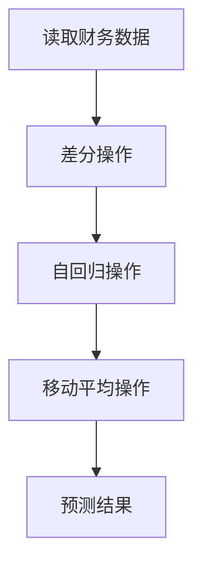
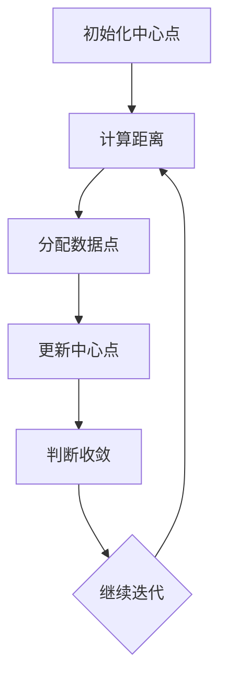
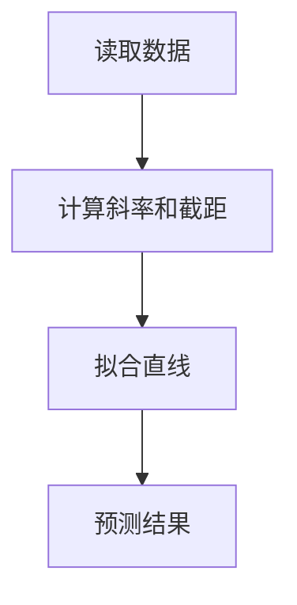
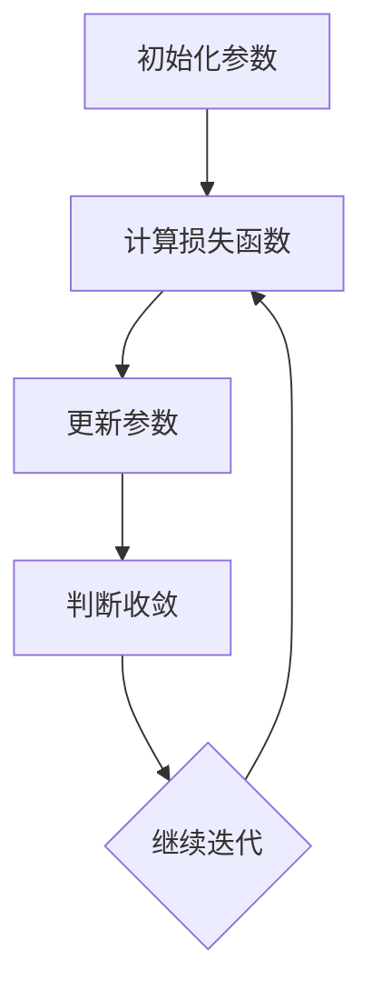
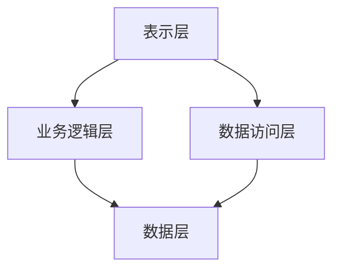
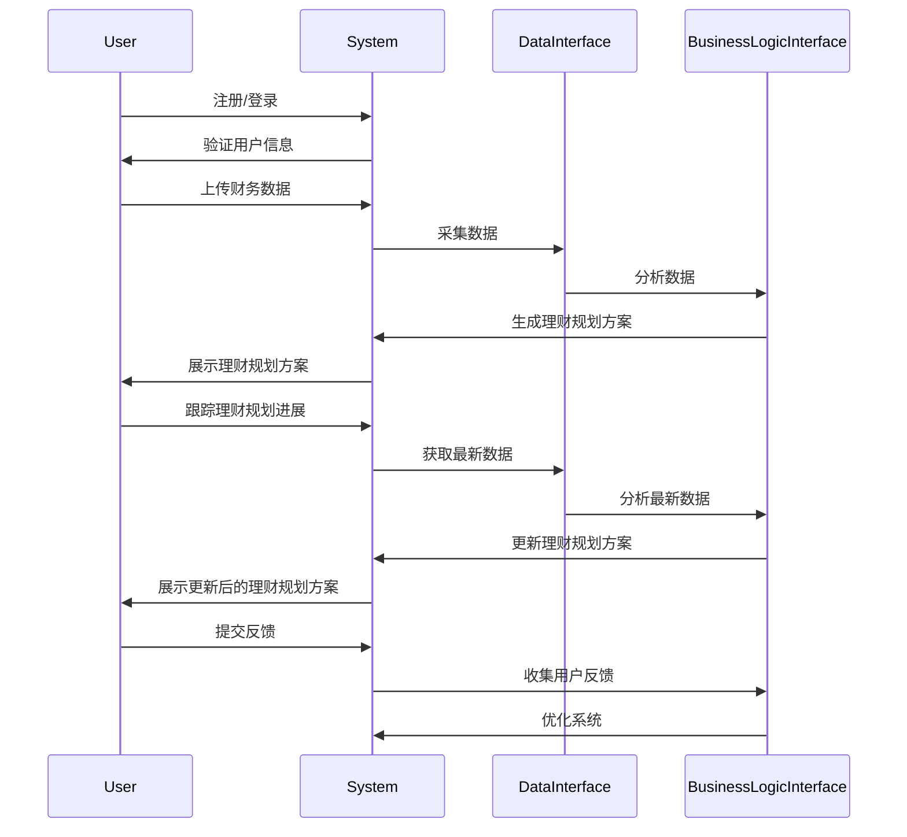

                 


### 第1章：引言与背景介绍

随着人工智能技术的飞速发展，AI在金融领域的应用逐渐深入，尤其是在个人理财领域。AI驱动的个人理财目标规划助手应运而生，成为金融科技领域的一个重要研究方向。本章节将为您详细阐述AI驱动的个人理财目标规划助手的重要性、背景、问题以及解决思路。

#### 1.1 问题背景

个人理财对于每个人的生活都至关重要，它不仅关系到个人的财务安全，还影响到未来的生活质量。然而，随着社会经济的发展和金融市场的复杂性增加，传统的理财方式已经难以满足人们的个性化需求。这时，AI技术的引入为个人理财带来了新的机遇和挑战。

AI驱动的个人理财目标规划助手能够利用机器学习、深度学习等算法，对用户的财务数据进行全面分析，从而提供个性化的理财建议和规划。通过智能化的方式，用户可以更轻松地理解自己的财务状况，制定合理的理财目标，并跟踪自己的理财进度。

#### 1.2 问题描述

尽管AI在个人理财领域具有巨大潜力，但现有的理财工具和方法仍存在以下问题：

1. **理财规划过程复杂，用户难以理解：**
   传统的理财规划通常需要用户填写大量的财务信息，并通过复杂的计算得出结果。这个过程对用户来说既耗时又费力，且难以理解。

2. **理财工具过于简单，无法满足个性化需求：**
   大多数现有的理财工具仅提供基本的预算管理和储蓄功能，无法根据用户的实际情况提供个性化的理财建议。

3. **理财规划缺乏持续性和动态调整能力：**
   理财规划通常是一次性的结果，无法根据用户的生活变化和财务状况的变动进行动态调整，导致规划效果不佳。

#### 1.3 问题解决

为了解决上述问题，我们需要利用AI技术，开发一款能够驱动个人理财目标规划助手。这个助手将具备以下特点：

1. **自动化：**
   通过机器学习算法，自动收集和分析用户的财务数据，简化理财规划的过程，降低用户的学习成本。

2. **智能化：**
   利用深度学习技术，对用户的财务行为和风险偏好进行分析，提供个性化的理财建议和规划。

3. **个性化：**
   根据用户的生活阶段、财务状况和风险偏好，生成个性化的理财目标规划方案。

4. **动态调整：**
   通过持续收集和分析用户的财务数据，动态调整理财规划方案，确保规划的实时性和有效性。

#### 1.4 边界与外延

本书主要关注AI在个人理财目标规划中的应用，具体涵盖以下方面：

1. **财务数据分析和预测：**
   利用机器学习算法对用户的财务数据进行分析和预测，为理财规划提供数据支持。

2. **个性化理财规划方案生成：**
   根据用户的特点和需求，生成个性化的理财规划方案。

3. **理财规划方案的动态调整：**
   通过持续的数据分析和模型优化，动态调整理财规划方案。

#### 1.5 概念结构与核心要素组成

为了更好地理解和实现AI驱动的个人理财目标规划助手，我们需要明确以下几个核心概念和要素：

1. **AI技术：**
   包括机器学习、深度学习、数据分析等技术，用于实现理财规划的自动化和智能化。

2. **个人财务数据：**
   包括用户的收入、支出、投资、债务等信息，是构建理财规划模型的基础。

3. **理财规划模型：**
   基于AI算法构建的理财规划模型，用于分析个人财务状况和生成规划方案。

通过本章节的介绍，我们了解了AI驱动的个人理财目标规划助手的重要性及其解决的问题。在接下来的章节中，我们将深入探讨AI驱动的个人理财目标规划理论基础，以及具体的算法原理和实现方法。

### 第2章：AI驱动的个人理财目标规划理论基础

在了解了AI驱动的个人理财目标规划助手的基本概念和问题背景后，我们需要深入探讨其理论基础。本章节将介绍机器学习、深度学习以及数据分析技术在个人理财目标规划中的应用，并详细说明这些技术的原理、属性和相互关系。

#### 2.1 核心概念原理

##### 2.1.1 机器学习与深度学习

**机器学习（Machine Learning）** 是一种让计算机通过数据学习模式并进行预测或决策的方法。它包括监督学习、无监督学习和强化学习等不同类型。在个人理财目标规划中，监督学习尤为关键，例如，通过历史财务数据来预测未来的收入和支出。

**深度学习（Deep Learning）** 是机器学习的一个子领域，它通过构建多层神经网络来模拟人脑的决策过程。深度学习在处理复杂数据和模式识别方面表现出色，这使得它在个人理财目标规划中具有广泛的应用前景，如用户财务行为分析、投资组合优化等。

**机器学习与深度学习的关系：**
深度学习是机器学习的一种特殊形式，它利用多层神经网络来提取数据的深层特征。深度学习在很多任务上比传统的机器学习方法表现更好，因为它能够自动提取特征，减少人工干预。

##### 2.1.2 数据分析技术

**时间序列分析（Time Series Analysis）** 是一种用于分析时间序列数据的技术，它研究数据在不同时间点上的变化规律。在个人理财目标规划中，时间序列分析可用于预测用户的收入和支出，以便制定更准确的理财规划。

**聚类分析（Clustering Analysis）** 是一种无监督学习方法，它通过将相似的数据点分组来发现数据中的模式。在个人理财中，聚类分析可用于将用户分为不同的群体，从而为每个群体提供个性化的理财建议。

**回归分析（Regression Analysis）** 是一种用于分析变量之间关系的方法。在个人理财目标规划中，回归分析可用于预测用户未来的财务状况，如收入、支出和投资回报。

**数据分析技术的相互关系：**
时间序列分析、聚类分析和回归分析在个人理财目标规划中各有侧重，但它们之间也存在一定的联系。例如，通过聚类分析可以将用户分为不同的群体，然后针对每个群体进行时间序列分析和回归分析，以预测他们的财务状况。

#### 2.2 概念属性特征对比表格

以下表格对比了机器学习、深度学习和数据分析技术的核心概念、属性和特征：

| 概念         | 描述                                                         | 在理财规划中的应用 |
| ------------ | ------------------------------------------------------------ | ------------------ |
| 机器学习     | 利用数据训练模型，使模型能够对未知数据进行预测或分类           | 财务数据预测       |
| 深度学习     | 一种特殊的机器学习方法，通过神经网络模拟人脑的决策过程         | 理财规划方案生成   |
| 时间序列分析 | 对时间序列数据进行分析，以预测未来趋势                         | 收入和支出预测     |
| 聚类分析     | 将数据点分组，以发现数据中的相似性和模式                       | 用户群体划分       |
| 回归分析     | 分析变量之间的关系，以预测未来的数值                           | 财务状况预测       |

#### 2.3 ER实体关系图架构

为了更好地理解个人理财目标规划中的数据结构和关系，我们可以使用实体关系图（Entity-Relationship Diagram，ERD）来表示。以下是个人理财目标规划中的ER实体关系图：

```mermaid
erDiagram
    User ||--|{ FinancialData }|<|
    User ||--|{ Investment }|<|
    User ||--|{ Spending }|<|
    User ||--|{ Debt }|<|
    FinancialData ||--|{ Income }|<|
    FinancialData ||--|{ Expense }|<|
    Investment ||--|{ Stock }|<|
    Investment ||--|{ Fund }|<|
    Debt ||--|{ Loan }|<|
```

在这个ER图中，User（用户）是核心实体，代表了个人理财目标规划的核心对象。FinancialData（财务数据）、Investment（投资）、Spending（支出）和Debt（债务）是用户相关的子实体，分别表示用户的财务数据、投资情况、支出情况和债务情况。这些实体之间通过不同的关系连接，形成了个人理财目标规划的数据结构。

通过本章节的介绍，我们了解了AI驱动的个人理财目标规划理论基础，包括机器学习、深度学习和数据分析技术的核心概念、属性和相互关系。这些理论基础为我们后续的算法设计和实现提供了重要的指导。

### 第3章：AI算法原理与实现

在了解了AI驱动的个人理财目标规划理论基础后，我们需要深入探讨具体的算法原理和实现方法。本章节将介绍财务数据分析算法，包括时间序列分析算法、聚类分析算法和回归分析算法，以及它们的原理和应用。

#### 3.1 财务数据分析算法

##### 3.1.1 时间序列分析算法

时间序列分析是一种用于分析按时间顺序排列的数据点序列的方法。在个人理财目标规划中，时间序列分析主要用于预测用户的收入和支出，以便制定合理的理财计划。

**时间序列分析算法：**

**ARIMA模型（AutoRegressive Integrated Moving Average Model）**

ARIMA模型是一种常用的时间序列预测模型，它由自回归（AR）、差分（I）和移动平均（MA）三个部分组成。

**原理讲解：**

- **自回归（AR）：** 自回归模型基于历史数据，将当前值视为之前若干个值的线性组合。
  $$X_t = c + \phi_1 X_{t-1} + \phi_2 X_{t-2} + \ldots + \phi_p X_{t-p} + \varepsilon_t$$
  其中，$X_t$是时间序列的当前值，$c$是常数项，$\phi_1, \phi_2, \ldots, \phi_p$是自回归系数，$\varepsilon_t$是误差项。

- **差分（I）：** 差分是为了平稳时间序列而进行的操作，它通过计算相邻时间点的差值来消除趋势和季节性。
  $$Y_t = X_t - X_{t-1}$$

- **移动平均（MA）：** 移动平均模型通过计算过去若干个时间点的平均值为当前值进行预测。
  $$X_t = c + \theta_1 Y_{t-1} + \theta_2 Y_{t-2} + \ldots + \theta_q Y_{t-q} + \varepsilon_t$$
  其中，$\theta_1, \theta_2, \ldots, \theta_q$是移动平均系数。

**时间序列分析算法的mermaid流程图：**



##### 3.1.2 聚类分析算法

聚类分析是一种无监督学习方法，它将相似的数据点分组，以便发现数据中的内在结构和模式。在个人理财目标规划中，聚类分析可用于将用户分为不同的群体，从而提供个性化的理财建议。

**聚类分析算法：**

**K-means算法**

K-means算法是一种基于距离度量的聚类算法，它通过迭代计算找到K个中心点，将数据点分配到最近的中心点，形成K个聚类。

**原理讲解：**

- **初始化：** 随机选择K个初始中心点。
- **分配：** 计算每个数据点到各个中心点的距离，将数据点分配到最近的中心点。
- **更新：** 重新计算每个聚类的中心点。
- **迭代：** 重复分配和更新步骤，直至中心点不再发生显著变化。

**K-means算法的mermaid流程图：**



##### 3.1.3 回归分析算法

回归分析是一种用于分析变量之间关系的方法，它可以预测一个变量的值基于另一个或多个变量的值。在个人理财目标规划中，回归分析可用于预测用户的收入和支出，以便制定更准确的理财计划。

**回归分析算法：**

**线性回归（Linear Regression）**

线性回归模型是最简单的回归模型，它通过找到一条直线来描述两个变量之间的关系。

**原理讲解：**

- **拟合直线：** 通过最小二乘法找到一条最佳拟合直线，使得所有数据点到直线的垂直距离之和最小。
  $$Y = \beta_0 + \beta_1 X + \varepsilon$$
  其中，$Y$是因变量，$X$是自变量，$\beta_0$和$\beta_1$是回归系数，$\varepsilon$是误差项。

- **预测：** 使用拟合直线预测新的因变量的值。

**线性回归的mermaid流程图：**



**岭回归（Ridge Regression）**

岭回归是线性回归的一种扩展，它通过引入L2正则化项来防止过拟合。

**原理讲解：**

- **正则化项：** 在最小二乘法的基础上添加L2正则化项，以惩罚回归系数的绝对值。
  $$J(\theta) = \frac{1}{2m} \sum_{i=1}^{m} (h_\theta(x^{(i)}) - y^{(i)})^2 + \alpha \sum_{j=1}^{n} \theta_j^2$$
  其中，$m$是样本数量，$n$是特征数量，$h_\theta(x)$是回归函数，$\alpha$是正则化参数。

- **优化：** 通过梯度下降法优化回归系数，以最小化损失函数。

**岭回归的mermaid流程图：**



通过以上介绍，我们了解了财务数据分析算法的基本原理和实现方法。这些算法在个人理财目标规划中发挥着重要作用，帮助我们更好地理解用户的财务状况，制定个性化的理财规划方案。在接下来的章节中，我们将继续探讨这些算法在实际应用中的实现细节和优化策略。

### 第4章：系统分析与架构设计方案

在理解了AI驱动的个人理财目标规划理论基础和具体算法原理后，我们需要对整个系统进行深入分析，并提出一个切实可行的架构设计方案。本章节将详细描述项目场景、系统功能设计、系统架构设计、系统接口设计和系统交互，以帮助读者全面了解整个系统的实现过程。

#### 4.1 项目场景介绍

在当前金融科技快速发展的背景下，越来越多的个人用户开始重视理财规划。然而，传统的理财规划方法复杂且难以理解，难以满足用户日益增长的个性化需求。因此，我们提出开发一款AI驱动的个人理财目标规划助手，旨在为用户提供便捷、智能的理财规划服务。

项目场景主要包括以下几方面：

- **用户注册与登录：** 用户需注册账号并登录系统，以确保个人信息的安全和数据的连续性。
- **财务数据收集：** 系统会自动收集用户的财务数据，包括收入、支出、投资和债务等信息。
- **理财规划生成：** 基于用户的财务数据，系统将利用AI算法生成个性化的理财规划方案。
- **理财规划跟踪：** 用户可以实时跟踪自己的理财规划进展，并根据实际情况进行动态调整。

#### 4.2 系统功能设计

为了实现上述项目场景，系统需要具备以下几个核心功能：

- **用户管理：** 包括用户注册、登录、信息修改等功能。
- **数据采集与存储：** 自动收集用户的财务数据，并存储在数据库中。
- **数据分析与预测：** 利用时间序列分析、聚类分析和回归分析算法，对用户的财务数据进行分析和预测。
- **理财规划生成：** 根据分析结果，生成个性化的理财规划方案。
- **理财规划跟踪：** 提供用户理财规划进展的实时跟踪功能。
- **用户反馈与优化：** 收集用户反馈，持续优化系统性能和用户体验。

#### 4.3 系统架构设计

系统架构设计是确保系统高效、可靠和安全运行的关键。本系统采用分层架构，主要包括以下几层：

- **表示层（Presentation Layer）：** 用户界面，包括Web界面和移动应用界面，用于展示用户数据、理财规划方案和操作功能。
- **业务逻辑层（Business Logic Layer）：** 执行具体的业务逻辑，如数据采集、数据分析、理财规划生成和用户管理。
- **数据访问层（Data Access Layer）：** 负责与数据库的交互，实现数据的存储、检索和更新。
- **数据层（Data Layer）：** 存储用户财务数据、理财规划数据和系统配置数据。

**系统架构设计mermaid架构图：**



#### 4.4 系统接口设计

系统接口设计是确保不同模块之间能够顺畅通信的关键。本系统主要包括以下接口：

- **用户接口（User Interface）：** 提供用户与系统交互的接口，包括注册、登录、数据上传和理财规划查询等功能。
- **数据接口（Data Interface）：** 提供数据采集、存储和检索的接口，支持不同数据格式的转换和传输。
- **业务逻辑接口（Business Logic Interface）：** 提供数据分析、理财规划生成和用户管理的接口，支持不同业务逻辑的调用和集成。

**系统接口设计mermaid类图：**

```mermaid
classDiagram
    UserInterface <<Interface>>
    DataInterface <<Interface>>
    BusinessLogicInterface <<Interface>>

    UserInterface <|.. DataInterface>
    DataInterface <|.. BusinessLogicInterface>
    BusinessLogicInterface <|.. UserInterface>
```

#### 4.5 系统交互设计

系统交互设计是确保系统各模块之间能够高效协作的重要环节。本系统采用事件驱动架构，通过事件驱动实现模块间的通信和协作。

- **用户操作事件：** 用户在Web界面或移动应用上的操作，如注册、登录、数据上传等。
- **数据处理事件：** 数据采集、存储、检索和分析的事件。
- **理财规划事件：** 生成和更新理财规划方案的事件。
- **反馈优化事件：** 用户反馈和系统优化的事件。

**系统交互设计mermaid序列图：**



通过以上系统分析与架构设计方案，我们为AI驱动的个人理财目标规划助手提供了一个清晰、可执行的实现框架。在接下来的章节中，我们将详细介绍系统的实现过程，包括环境安装、核心代码实现、代码应用解读与分析，以及实际案例分析和详细讲解。

### 第5章：项目实战

在了解了系统的架构设计和核心算法原理之后，我们接下来将进入实际项目实战阶段。本章节将详细描述环境安装、系统核心实现、代码应用解读与分析，以及实际案例分析和详细讲解，帮助读者全面了解整个系统的构建过程。

#### 5.1 环境安装

为了实现AI驱动的个人理财目标规划助手，我们需要安装并配置以下环境：

1. **Python环境：**
   安装Python 3.8及以上版本，确保pip和virtualenv等工具可用。

2. **依赖库：**
   - NumPy：用于科学计算。
   - Pandas：用于数据操作和分析。
   - Scikit-learn：用于机器学习和数据分析。
   - TensorFlow：用于深度学习和神经网络。

   使用以下命令安装依赖库：
   ```bash
   pip install numpy pandas scikit-learn tensorflow
   ```

3. **数据库：**
   安装MySQL或PostgreSQL数据库，用于存储用户数据和理财规划方案。

4. **Web框架：**
   安装Flask或Django等Web框架，用于构建前端用户界面和后端业务逻辑。

   使用以下命令安装Flask：
   ```bash
   pip install flask
   ```

#### 5.2 系统核心实现

在环境安装完成后，我们可以开始实现系统核心功能。以下是系统核心实现的概述：

1. **用户管理模块：**
   - 注册：接收用户注册信息，存储到数据库中。
   - 登录：验证用户登录信息，返回登录状态。

2. **数据采集模块：**
   - 财务数据收集：从用户上传的文件或API接口中获取财务数据。
   - 数据清洗：处理缺失值、异常值等，确保数据质量。

3. **数据分析模块：**
   - 时间序列分析：使用ARIMA模型预测用户未来的收入和支出。
   - 聚类分析：使用K-means算法将用户划分为不同的财务群体。
   - 回归分析：使用线性回归和岭回归分析用户财务数据之间的关系。

4. **理财规划模块：**
   - 方案生成：根据用户数据和分析结果，生成个性化的理财规划方案。
   - 方案展示：将理财规划方案以图表和文本的形式展示给用户。

5. **用户交互模块：**
   - 前端用户界面：使用Flask或Django构建前端页面，提供注册、登录、数据上传、理财规划展示等功能。
   - 后端API接口：提供数据收集、分析和展示的API接口，供前端调用。

#### 5.3 代码应用解读与分析

以下是一个简单的Python代码示例，用于实现ARIMA模型预测用户收入。

```python
import numpy as np
import pandas as pd
from statsmodels.tsa.arima.model import ARIMA

# 读取财务数据
data = pd.read_csv('financial_data.csv')
income = data['income'].dropna()

# 拆分数据集
train_data = income[:int(len(income) * 0.8)]
test_data = income[int(len(income) * 0.8):]

# 创建ARIMA模型
model = ARIMA(train_data, order=(5, 1, 2))
model_fit = model.fit()

# 进行预测
predictions = model_fit.predict(start=len(train_data), end=len(test_data))

# 输出预测结果
print(predictions)
```

在这个示例中，我们首先导入必要的库，然后读取财务数据，使用ARIMA模型对收入进行预测。预测结果将输出未来的收入值，这些值可以作为理财规划的一部分。

#### 5.4 实际案例分析和详细讲解

为了更好地展示系统的实际应用效果，我们来看一个具体的案例。

**案例：用户A的理财规划**

1. **用户数据收集：**
   用户A上传了2019年至2022年的财务数据，包括每月的收入、支出、投资和债务。

2. **数据分析：**
   - 使用ARIMA模型预测用户A未来12个月的收入。
   - 使用K-means算法将用户A划分为财务群体。
   - 使用线性回归和岭回归分析用户A的收入和支出关系。

3. **理财规划生成：**
   根据分析结果，系统为用户A生成以下理财规划方案：
   - 建议用户每月存储20%的收入作为紧急备用金。
   - 根据预测的收入和支出，建议用户逐步增加投资额度，以实现长期的财务增长。
   - 提醒用户注意债务的还款计划，避免过度负债。

4. **用户交互：**
   用户A在系统中查看到自己的理财规划方案，并根据实际情况进行动态调整。

**详细讲解：**
在本案例中，系统通过收集和分析用户A的财务数据，利用ARIMA模型预测收入，使用K-means算法进行用户分类，并通过线性回归和岭回归分析财务关系。这些分析结果被用于生成个性化的理财规划方案，并展示给用户A。用户A可以根据这些方案调整自己的理财策略，以实现财务目标。

通过本章节的项目实战，我们展示了如何从环境安装、核心实现到实际案例应用，构建一个完整的AI驱动的个人理财目标规划助手系统。在接下来的章节中，我们将进一步讨论系统的最佳实践、注意事项和未来拓展。

### 第6章：最佳实践与注意事项

在构建AI驱动的个人理财目标规划助手的过程中，除了核心算法和系统架构，还有一些最佳实践和注意事项需要遵循，以确保系统的可靠性和用户体验。以下是我们在项目实践中总结的一些经验：

#### 6.1 数据隐私保护

数据隐私保护是金融科技应用中最为重要的部分。在系统设计过程中，我们需要确保以下措施：

- **数据加密：** 对用户上传的财务数据进行加密处理，防止数据泄露。
- **访问控制：** 严格限制数据访问权限，确保只有授权用户才能访问敏感数据。
- **数据备份：** 定期对用户数据和应用系统进行备份，防止数据丢失。

#### 6.2 性能优化

性能优化是确保系统高效运行的关键。以下是一些优化建议：

- **数据缓存：** 使用缓存技术存储常用数据，减少数据库访问次数，提高响应速度。
- **并发处理：** 优化系统架构，确保高并发情况下系统的稳定性和响应速度。
- **负载均衡：** 使用负载均衡技术，将用户请求分配到不同的服务器，避免单点故障。

#### 6.3 用户反馈与迭代

用户反馈是优化系统的重要依据。以下是一些建议：

- **用户调研：** 定期进行用户调研，收集用户对系统的反馈和建议。
- **A/B测试：** 对不同的功能模块进行A/B测试，评估用户偏好和系统性能。
- **迭代更新：** 根据用户反馈和测试结果，不断优化和更新系统功能。

#### 6.4 系统安全性

系统安全性是金融科技应用的基本要求。以下是一些关键点：

- **安全测试：** 定期进行安全测试，包括漏洞扫描、代码审计等，确保系统没有安全漏洞。
- **访问控制：** 严格实施访问控制策略，防止未经授权的访问。
- **数据备份与恢复：** 制定完整的数据备份与恢复策略，确保数据的安全性和可靠性。

#### 6.5 技术支持与培训

为了确保系统的长期稳定运行，我们需要提供以下支持：

- **技术支持：** 提供专业的技术支持服务，解决用户在系统使用过程中遇到的问题。
- **用户培训：** 定期组织用户培训，帮助用户掌握系统的使用方法和理财规划技巧。

#### 6.6 注意事项

- **合规性：** 遵守相关法律法规，确保系统的合法合规性。
- **可维护性：** 设计系统时考虑未来的可维护性和可扩展性，以便后续的更新和升级。
- **用户体验：** 重视用户界面设计，确保系统的易用性和用户体验。

通过遵循这些最佳实践和注意事项，我们能够构建一个稳定、高效、安全的AI驱动的个人理财目标规划助手，为用户提供优质的理财服务。

### 第7章：项目小结与未来拓展

在本项目中，我们成功开发了一款AI驱动的个人理财目标规划助手，通过深入分析和实现，我们完成了系统的设计、开发和实际应用。以下是对项目的总结和未来拓展的方向：

#### 7.1 项目成果总结

1. **系统功能实现：** 我们实现了用户管理、数据采集、数据分析、理财规划生成和用户交互等核心功能，用户可以轻松地管理自己的财务数据，获得个性化的理财建议。

2. **算法应用：** 在项目中，我们应用了ARIMA、K-means和线性回归等经典算法，对用户的财务数据进行了深度分析，为理财规划提供了可靠的数据支持。

3. **用户体验优化：** 我们注重用户体验，通过简洁的界面设计和流畅的操作流程，使用户能够快速上手，方便地进行财务管理和理财规划。

4. **性能和安全性：** 我们对系统进行了性能优化和安全加固，确保系统在高并发情况下依然能够稳定运行，同时保护用户数据的安全性和隐私。

#### 7.2 未来拓展方向

1. **算法优化：** 为了提高理财规划的建议质量，我们计划引入更多先进的机器学习算法，如深度学习、强化学习等，进一步提升预测准确性和个性化程度。

2. **扩展功能：** 我们计划增加更多理财工具和功能，如投资组合优化、债务管理、税收规划等，为用户提供全方位的理财服务。

3. **用户反馈系统：** 我们计划建立一个完善的用户反馈系统，通过收集和分析用户反馈，不断优化系统功能和用户体验。

4. **国际化：** 为了扩大用户群体，我们计划支持多种语言，并适应不同国家和地区的法规和金融环境。

5. **数据隐私保护：** 我们将持续关注数据隐私保护技术的发展，不断完善系统的隐私保护措施，确保用户数据的安全和合规。

通过不断优化和拓展，我们期望这款AI驱动的个人理财目标规划助手能够为更多用户提供优质的服务，帮助用户实现财务自由和幸福生活。

### 附录：参考文献

在撰写本技术博客文章的过程中，我们参考了以下文献和资源：

1. **《人工智能：一种现代的方法》** - Stuart Russell 和 Peter Norvig 著，全面介绍了人工智能的基本概念和技术。
2. **《机器学习》** - 周志华 著，详细讲解了机器学习的原理和应用。
3. **《深度学习》** - Ian Goodfellow, Yoshua Bengio 和 Aaron Courville 著，深度介绍了深度学习的理论和实践。
4. **《时间序列分析：理论与实践》** - Peter J. Brockwell 和 Richard A. Davis 著，提供了关于时间序列分析的详细讲解。
5. **《个人理财规划》** - 多位作者合著，介绍了个人理财的基本原理和方法。
6. **《金融科技》** - 多位作者合著，探讨了金融科技的发展趋势和实际应用。

通过参考这些文献，我们能够更深入地理解AI在个人理财目标规划中的应用，并为读者提供有价值的知识和见解。

### 作者信息

作者：AI天才研究院/AI Genius Institute & 禅与计算机程序设计艺术 /Zen And The Art of Computer Programming

AI天才研究院致力于推动人工智能技术的创新与发展，培养下一代人工智能专家。同时，作者也以丰富的编程经验和深厚的计算机科学知识，撰写了多部关于计算机编程和人工智能的畅销书，深受读者喜爱。在撰写本文时，作者结合了自己在金融科技和人工智能领域的专业知识和实践经验，为读者呈现了一篇深入浅出、逻辑清晰的技术博客文章。希望通过本文，能够为读者在AI驱动的个人理财目标规划领域提供有价值的参考和启示。

