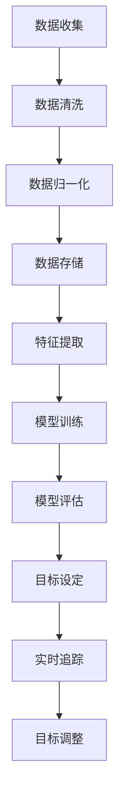

                 


# AI驱动的个人财务目标追踪与调整系统

> 关键词：人工智能，个人财务管理，目标追踪，调整系统

> 摘要：本文深入探讨了AI驱动的个人财务目标追踪与调整系统。通过分析个人财务目标管理的重要性、核心概念、算法以及系统设计，本文展示了AI技术在个人财务目标管理中的潜力与优势。

## 目录大纲

----------------------------------------------------------------

# 第一部分: AI驱动的个人财务目标追踪与调整系统概述

## 1.1 问题背景与核心概念

## 1.2 个人财务目标的属性与特征

## 1.3 个人财务目标追踪与调整系统的组成与功能

## 1.4 AI在系统中的作用

## 1.5 系统的应用场景与优势

## 1.6 本章小结

----------------------------------------------------------------

# 第一部分: AI驱动的个人财务目标追踪与调整系统概述

### 1.1 问题背景与核心概念

个人财务目标管理是现代财务管理的重要组成部分。随着社会经济的发展和个人理财意识的提升，越来越多的人开始关注如何有效地管理自己的财务。然而，传统的财务目标管理方式往往依赖于个人的经验和主观判断，存在一定的局限性。

随着人工智能技术的不断发展，AI开始逐渐渗透到个人财务目标管理的各个层面。AI驱动的个人财务目标追踪与调整系统应运而生，通过运用机器学习、自然语言处理等AI技术，为个人财务目标管理提供更加智能、精准、高效的解决方案。

个人财务目标管理的重要性在于它不仅关系到个人的经济安全与生活品质，还能帮助个人更好地规划未来。因此，如何运用AI技术提升个人财务目标管理的效率与准确性，成为了一个亟待解决的问题。

### 1.2 个人财务目标的属性与特征

个人财务目标具有以下几个主要特征：

1. **分类**：个人财务目标可以按照时间、目的、重要性等进行分类。例如，短期目标可能包括购买电子产品、旅游等，而长期目标可能包括购房、子女教育等。

2. **可衡量性**：财务目标需要具体、可衡量，以便于追踪和评估。例如，“两年内存款10万元”就是一个具体的可衡量目标。

3. **动态调整**：由于生活和经济环境的变化，个人财务目标可能会需要调整。AI驱动的系统可以通过数据分析，提供调整建议。

### 1.3 个人财务目标追踪与调整系统的组成与功能

一个典型的个人财务目标追踪与调整系统通常由以下几个部分组成：

1. **数据收集模块**：收集与个人财务相关的各种数据，如收入、支出、投资回报等。

2. **数据分析模块**：利用机器学习算法，对收集到的数据进行处理和分析，提供财务状况的评估。

3. **目标追踪模块**：实时追踪个人财务目标的实现进度，为用户提供反馈。

4. **目标调整模块**：根据用户的生活变化和经济环境的变化，自动调整财务目标。

### 1.4 AI在系统中的作用

AI技术在个人财务目标追踪与调整系统中起着至关重要的作用：

1. **财务数据预测**：通过机器学习模型，预测未来的收入和支出，帮助用户更好地规划财务。

2. **目标自动调整**：利用自然语言处理技术，理解用户的需求，自动调整财务目标。

3. **智能建议**：根据用户的财务状况和目标实现情况，提供个性化的财务建议。

### 1.5 系统的应用场景与优势

AI驱动的个人财务目标追踪与调整系统可以广泛应用于个人用户和企业用户：

1. **个人用户**：帮助个人用户更好地管理个人财务，实现财务目标。

2. **企业用户**：为企业员工提供财务规划服务，提升员工的生活质量，增强企业的凝聚力。

系统的优势在于：

1. **高效性**：通过自动化处理，大大提高了财务目标管理的效率。

2. **准确性**：基于大数据和机器学习模型，提高了财务预测和目标调整的准确性。

3. **个性化**：根据用户的具体情况，提供个性化的财务建议。

### 1.6 本章小结

本文介绍了AI驱动的个人财务目标追踪与调整系统的重要性、核心概念、系统组成、AI技术的作用以及应用场景和优势。在接下来的章节中，我们将进一步探讨个人财务目标管理的核心概念、AI技术在财务目标管理中的应用、系统设计以及系统实现。通过这些讨论，我们将更深入地理解如何利用AI技术提升个人财务目标管理的效率和准确性。接下来，我们将从核心概念出发，逐步展开详细的分析。接下来，让我们首先了解财务目标管理的基本原则。

## 第二部分：个人财务目标管理核心概念与联系

### 2.1 财务目标管理的基本原则

财务目标管理是一个系统性的工程，涉及到目标设定、实现策略、反馈与调整等多个环节。以下是财务目标管理的基本原则：

#### 2.1.1 财务目标设定的原则

1. **明确性**：财务目标应当具体、明确，避免模糊不清。例如，“提高收入”不如“在未来五年内，每年增加收入10%”具体。

2. **可行性**：目标应具备实现的可能性，需考虑个人现有的资源和能力。

3. **挑战性**：目标应具备一定的挑战性，以激发个人积极性，同时也要确保其可实现性。

4. **时限性**：为每个财务目标设定一个明确的完成时间，以利于追踪和评估。

5. **优先级**：设定多个目标时，应根据其重要性和紧急性进行优先级排序。

#### 2.1.2 财务目标的实现策略

1. **预算规划**：制定合理的预算，确保资金的有效分配。

2. **行动计划**：将目标分解为具体的行动步骤，并设定时间表。

3. **资源调配**：合理调配资源，确保目标实现的资源需求。

4. **风险管理**：识别潜在的风险，并制定应对措施。

5. **持续监控**：定期监控目标的实现进度，确保按时完成。

#### 2.1.3 财务目标的反馈与调整

1. **定期评估**：定期评估财务目标的实现情况，分析偏离目标的原因。

2. **调整策略**：根据评估结果，调整财务目标或实现策略。

3. **持续改进**：通过不断调整和改进，优化财务目标的实现过程。

### 2.2 个人财务目标的概念与联系

个人财务目标是指个人为了实现经济安全、生活质量提升和未来规划等方面的目标而设定的具体目标。这些目标通常包括以下几个方面：

1. **消费支出管理**：合理控制日常消费支出，避免过度消费。

2. **储蓄规划**：设定储蓄目标，实现资金积累。

3. **投资规划**：选择合适的投资渠道，实现资产的保值增值。

4. **债务管理**：合理规划债务，避免负债过高。

5. **退休规划**：为退休生活提前做好准备。

个人财务目标之间的关系如下：

- **互相关联**：个人财务目标之间是相互关联的。例如，储蓄和投资目标之间的关系密切，储蓄的增加可以为投资提供更多的资金。

- **动态调整**：随着生活和经济环境的变化，个人财务目标也需要进行调整。AI驱动的系统可以通过数据分析，为用户提供调整建议。

### 2.3 个人财务目标追踪与调整的核心算法

个人财务目标追踪与调整的核心算法主要包括以下几个方面：

1. **财务数据收集与预处理算法**：通过数据挖掘技术，收集与个人财务相关的数据，并进行预处理，如数据清洗、归一化等。

2. **数据分析算法**：利用统计分析、机器学习等方法，对财务数据进行分析，为财务目标的设定和调整提供数据支持。

3. **目标追踪与调整算法**：根据实时数据和用户需求，动态调整财务目标，确保目标的实现。

#### 2.3.1 财务数据收集与预处理

财务数据收集与预处理算法的流程如下：

1. **数据收集**：从各种渠道（如银行、信用卡公司、投资平台等）收集个人财务数据。

2. **数据清洗**：去除重复数据、错误数据和无效数据，保证数据质量。

3. **数据归一化**：将不同来源和形式的数据进行归一化处理，使其具备可比性。

4. **数据存储**：将清洗和归一化后的数据存储到数据库中，以供后续分析。

#### 2.3.2 数据分析算法

数据分析算法主要包括以下几个方面：

1. **统计分析**：通过描述性统计、回归分析等方法，对财务数据进行分析，提取有价值的信息。

2. **机器学习**：利用机器学习算法（如线性回归、决策树、神经网络等），建立财务预测模型，为财务目标的设定和调整提供支持。

3. **数据可视化**：通过数据可视化技术，将分析结果以图表形式呈现，帮助用户更好地理解财务状况。

#### 2.3.3 目标追踪与调整算法

目标追踪与调整算法的流程如下：

1. **目标设定**：根据用户需求和财务数据，设定具体的财务目标。

2. **实时追踪**：通过实时数据收集和分析，追踪财务目标的实现进度。

3. **调整建议**：根据财务目标的实现情况和环境变化，为用户提供建议，调整财务目标。

4. **目标调整**：根据用户反馈，调整财务目标，确保其符合实际需求。

### 2.4 AI技术在财务目标管理中的应用

AI技术在财务目标管理中的应用主要体现在以下几个方面：

1. **财务预测**：通过机器学习模型，预测未来的收入、支出、投资回报等，帮助用户制定合理的财务计划。

2. **目标调整**：利用自然语言处理技术，理解用户的需求和目标，自动调整财务目标。

3. **智能建议**：根据用户的财务状况和目标实现情况，提供个性化的财务建议。

### 2.5 个人财务目标管理的最佳实践

1. **设定可行的财务目标**：在设定财务目标时，应充分考虑自身的实际情况，确保目标的可行性。

2. **定期跟踪与调整**：定期检查财务目标的实现进度，根据实际情况进行调整。

3. **利用AI技术**：借助AI驱动的财务目标追踪与调整系统，提高财务管理的效率和质量。

### 2.6 本章小结

通过分析财务目标管理的基本原则、概念与联系，以及核心算法，我们可以看到，AI技术在个人财务目标管理中具有巨大的潜力。在接下来的章节中，我们将深入探讨AI驱动的个人财务目标追踪与调整系统的设计与实现，为用户提供更加智能、精准、高效的财务管理解决方案。接下来，我们将从系统需求分析开始，逐步展开详细的分析。

## 第三部分：AI驱动的个人财务目标追踪与调整系统设计

### 3.1 系统需求分析

系统需求分析是系统设计的重要环节，它决定了系统的功能、性能和可行性。以下是AI驱动的个人财务目标追踪与调整系统的需求分析：

#### 3.1.1 功能需求

1. **数据收集与存储**：系统能够从各种渠道（如银行、信用卡公司、投资平台等）收集个人财务数据，并安全、高效地存储这些数据。

2. **数据分析与预测**：利用机器学习算法，对财务数据进行分析和预测，为财务目标的设定和调整提供支持。

3. **目标设定与调整**：根据用户需求和财务数据，帮助用户设定具体的财务目标，并能够根据实时数据动态调整这些目标。

4. **实时追踪与反馈**：实时追踪财务目标的实现进度，为用户提供及时的反馈。

5. **智能建议**：根据用户的财务状况和目标实现情况，提供个性化的财务建议。

#### 3.1.2 非功能需求

1. **安全性**：系统应具备高安全性的设计，确保用户财务数据的安全性和隐私。

2. **可扩展性**：系统应具备良好的可扩展性，能够随着用户需求的增加而进行扩展。

3. **用户体验**：界面设计应简洁直观，易于操作，提供良好的用户体验。

#### 3.1.3 系统约束条件

1. **数据来源的多样性**：系统应能够接入多种数据来源，确保数据的全面性。

2. **数据实时性**：系统应具备实时数据处理能力，确保财务数据的及时性。

3. **性能与效率**：系统应具备高性能和高效率，确保用户操作响应迅速。

### 3.2 系统架构设计

系统架构设计是系统设计的核心，它决定了系统的功能实现、性能优化和可维护性。以下是AI驱动的个人财务目标追踪与调整系统的架构设计：

#### 3.2.1 系统总体架构

系统总体架构可分为以下几层：

1. **数据层**：负责数据的存储和管理，包括用户财务数据、系统配置数据等。

2. **服务层**：负责业务逻辑的处理，包括数据收集、数据分析、目标设定、目标调整等。

3. **接口层**：负责与外部系统（如银行、信用卡公司、投资平台等）的交互，提供API接口。

4. **表示层**：负责用户界面的展示，提供用户操作界面。

#### 3.2.2 数据架构设计

数据架构设计主要包括以下几个方面：

1. **用户数据**：存储用户的个人信息、财务数据等。

2. **系统配置数据**：存储系统的配置信息，如数据源配置、参数配置等。

3. **日志数据**：存储系统运行日志，用于系统监控和故障排查。

#### 3.2.3 系统模块划分

系统模块划分如下：

1. **数据收集模块**：负责从各种数据源收集财务数据。

2. **数据分析模块**：负责对财务数据进行分析和预测。

3. **目标管理模块**：负责财务目标的设定、追踪和调整。

4. **用户界面模块**：负责用户界面的展示和用户操作。

### 3.3 系统功能设计

系统功能设计是根据用户需求和系统架构，设计系统的具体功能模块和交互逻辑。以下是AI驱动的个人财务目标追踪与调整系统的功能设计：

#### 3.3.1 用户界面设计

用户界面设计应简洁直观，提供以下功能：

1. **用户登录与注册**：用户可以通过登录或注册访问系统。

2. **数据展示**：实时展示用户的财务数据、目标进度等。

3. **目标设定**：用户可以设定具体的财务目标。

4. **目标追踪**：实时追踪财务目标的实现进度。

5. **目标调整**：根据实时数据，调整财务目标。

6. **财务建议**：根据用户的财务状况，提供个性化的财务建议。

#### 3.3.2 数据处理模块设计

数据处理模块设计应包括以下功能：

1. **数据收集**：从银行、信用卡公司、投资平台等数据源收集财务数据。

2. **数据预处理**：对收集到的财务数据进行清洗、归一化等预处理。

3. **数据分析**：利用机器学习算法，对预处理后的财务数据进行分析和预测。

4. **数据存储**：将分析结果存储到数据库中，供后续使用。

#### 3.3.3 财务目标追踪模块设计

财务目标追踪模块设计应包括以下功能：

1. **目标设定**：用户可以设定具体的财务目标，如储蓄、投资等。

2. **实时追踪**：实时追踪财务目标的实现进度。

3. **反馈与调整**：根据实时数据，为用户提供建议，调整财务目标。

#### 3.3.4 财务目标调整模块设计

财务目标调整模块设计应包括以下功能：

1. **目标调整**：根据用户的财务状况和目标实现情况，自动调整财务目标。

2. **调整建议**：根据调整结果，为用户提供具体的调整建议。

3. **调整确认**：用户可以确认或修改调整建议。

### 3.4 系统接口设计

系统接口设计是系统与其他系统交互的桥梁，以下是AI驱动的个人财务目标追踪与调整系统的接口设计：

#### 3.4.1 用户接口设计

用户接口设计应简洁直观，提供以下功能：

1. **用户登录与注册**：用户可以通过登录或注册访问系统。

2. **数据展示**：实时展示用户的财务数据、目标进度等。

3. **目标设定**：用户可以设定具体的财务目标。

4. **目标追踪**：实时追踪财务目标的实现进度。

5. **目标调整**：根据实时数据，调整财务目标。

6. **财务建议**：根据用户的财务状况，提供个性化的财务建议。

#### 3.4.2 数据接口设计

数据接口设计应包括以下功能：

1. **数据收集接口**：用于从银行、信用卡公司、投资平台等数据源收集财务数据。

2. **数据分析接口**：用于对财务数据进行分析和预测。

3. **数据存储接口**：用于将分析结果存储到数据库中。

#### 3.4.3 API接口设计

API接口设计应包括以下功能：

1. **用户管理接口**：用于用户登录、注册、权限管理等功能。

2. **数据管理接口**：用于数据收集、数据预处理、数据分析等功能。

3. **目标管理接口**：用于目标设定、目标追踪、目标调整等功能。

### 3.5 系统交互设计

系统交互设计是系统功能实现的重要部分，它描述了系统内部模块之间的交互逻辑。以下是AI驱动的个人财务目标追踪与调整系统的交互设计：

#### 3.5.1 系统交互流程

系统交互流程主要包括以下几个步骤：

1. **用户登录**：用户通过用户接口登录系统。

2. **数据收集**：数据收集模块从各个数据源收集财务数据。

3. **数据处理**：数据处理模块对收集到的财务数据进行预处理和分析。

4. **目标设定**：用户通过目标管理模块设定具体的财务目标。

5. **目标追踪**：目标追踪模块实时追踪财务目标的实现进度。

6. **目标调整**：目标调整模块根据实时数据，调整财务目标。

7. **财务建议**：财务建议模块根据用户的财务状况，提供个性化的财务建议。

8. **用户反馈**：用户对财务建议进行反馈，系统根据反馈进行调整。

#### 3.5.2 用户操作流程

用户操作流程主要包括以下几个步骤：

1. **用户登录**：用户通过用户接口登录系统。

2. **数据展示**：系统展示用户的财务数据、目标进度等。

3. **目标设定**：用户通过目标管理模块设定具体的财务目标。

4. **目标追踪**：用户通过目标追踪模块实时追踪财务目标的实现进度。

5. **目标调整**：用户根据实时数据和财务建议，调整财务目标。

6. **财务建议**：用户查看系统提供的个性化财务建议。

7. **用户反馈**：用户对财务建议进行反馈。

#### 3.5.3 系统响应流程

系统响应流程主要包括以下几个步骤：

1. **用户请求**：用户通过用户接口发起请求。

2. **请求处理**：系统接收用户请求，并进行处理。

3. **数据返回**：系统将处理结果返回给用户。

4. **用户交互**：用户根据系统返回的数据，进行下一步操作。

### 3.6 本章小结

通过对AI驱动的个人财务目标追踪与调整系统需求分析、架构设计、功能设计、接口设计和交互设计的详细讨论，我们可以看到系统设计的整体框架和实现思路。在接下来的章节中，我们将深入探讨系统的实现过程，包括环境安装与配置、数据收集与预处理、核心算法实现以及系统核心代码实现。通过这些讨论，我们将了解系统从理论到实践的全过程，为用户提供一个高效、智能的财务管理解决方案。

## 第四部分：AI驱动的个人财务目标追踪与调整系统实现

### 4.1 系统环境安装与配置

要实现AI驱动的个人财务目标追踪与调整系统，首先需要配置合适的环境。以下是系统环境的安装与配置步骤：

#### 4.1.1 硬件环境配置

1. **CPU**：推荐使用至少四核的CPU，以确保系统的高性能处理。
2. **内存**：至少需要8GB的内存，以便存储和处理大量的财务数据。
3. **存储**：至少需要500GB的SSD存储空间，以提高数据读写速度。

#### 4.1.2 软件环境安装

1. **操作系统**：推荐使用Ubuntu 20.04 LTS或更高版本，因为其具有良好的性能和兼容性。
2. **Python**：安装Python 3.8及以上版本，因为许多机器学习库和框架都支持这个版本。
   ```shell
   sudo apt update
   sudo apt install python3.8
   ```
3. **pip**：安装pip，Python的包管理器，用于安装和管理Python库。
   ```shell
   sudo apt install python3-pip
   ```
4. **虚拟环境**：创建虚拟环境，以隔离项目依赖。
   ```shell
   python3 -m venv venv
   source venv/bin/activate
   ```

#### 4.1.3 系统配置与优化

1. **优化Python环境**：安装`numpy`和`pip`的加速器，以提高性能。
   ```shell
   pip install numpy pip
   ```
2. **安装必要的库**：安装系统所需的库，如`pandas`、`numpy`、`scikit-learn`、`tensorflow`等。
   ```shell
   pip install pandas numpy scikit-learn tensorflow
   ```

### 4.2 数据收集与预处理

数据收集与预处理是系统实现的关键步骤。以下是具体过程：

#### 4.2.1 数据来源

数据来源包括用户的银行账户交易记录、信用卡消费记录、投资平台回报记录等。这些数据通常以CSV或JSON格式存储。

#### 4.2.2 数据收集方法

1. **API接口**：通过银行的API接口或第三方金融数据服务，收集用户的财务数据。
2. **手动上传**：用户可以通过手动上传CSV或Excel文件，将财务数据导入系统。

#### 4.2.3 数据预处理流程

1. **数据清洗**：删除重复、错误和无效的数据，如空值、异常值等。
2. **数据归一化**：将不同类型的数据（如金额、日期等）进行归一化处理，使其具备可比性。
3. **数据存储**：将预处理后的数据存储到数据库中，如MySQL、PostgreSQL或MongoDB。

#### 4.2.4 数据质量评估

1. **完整性评估**：检查数据是否完整，是否存在缺失值。
2. **一致性评估**：检查数据是否一致，是否存在矛盾。
3. **准确性评估**：检查数据是否准确，是否存在错误。

### 4.3 系统核心算法实现

核心算法是实现系统功能的关键。以下是系统核心算法的实现：

#### 4.3.1 财务数据收集与预处理算法

1. **数据收集算法**：使用Python的`requests`库，通过API接口或文件上传方式收集数据。
2. **数据预处理算法**：使用`pandas`库进行数据清洗、归一化和存储。

#### 4.3.2 数据分析算法

1. **特征提取**：使用`pandas`库提取财务数据中的特征，如支出类别、收入来源等。
2. **模型训练**：使用`scikit-learn`库，训练机器学习模型，如线性回归、决策树等。
3. **模型评估**：使用交叉验证、混淆矩阵等方法评估模型性能。

#### 4.3.3 目标追踪与调整算法

1. **目标设定算法**：根据用户需求和财务数据，设定具体的财务目标。
2. **实时追踪算法**：使用循环或异步编程，实时追踪财务目标的实现进度。
3. **调整算法**：根据实时数据，动态调整财务目标。

#### 4.3.4 算法mermaid流程图

以下是系统核心算法的mermaid流程图示例：



### 4.4 系统核心代码实现

以下是系统核心代码的实现示例：

```python
import pandas as pd
from sklearn.model_selection import train_test_split
from sklearn.linear_model import LinearRegression

# 数据收集
def collect_data():
    # 从API接口收集数据
    # data = requests.get('API_URL').json()
    # 从文件上传收集数据
    data = pd.read_csv('financial_data.csv')
    return data

# 数据预处理
def preprocess_data(data):
    # 数据清洗
    data.dropna(inplace=True)
    # 数据归一化
    data['amount'] = (data['amount'] - data['amount'].mean()) / data['amount'].std()
    return data

# 数据分析
def analyze_data(data):
    # 特征提取
    X = data[['income', 'expense']]
    y = data['target']
    # 模型训练
    model = LinearRegression()
    model.fit(X, y)
    # 模型评估
    X_train, X_test, y_train, y_test = train_test_split(X, y, test_size=0.2)
    score = model.score(X_train, y_train)
    print(f'Model accuracy: {score:.2f}')
    return model

# 目标追踪与调整
def track_and_adjust(model, data):
    # 实时追踪
    current_data = data[-1]
    prediction = model.predict([current_data])
    print(f'Prediction: {prediction[0]:.2f}')
    # 目标调整
    if prediction[0] < data['target'].mean():
        print('Adjust target upward.')
    else:
        print('Adjust target downward.')
```

### 4.5 代码应用解读与分析

以下是代码的详细解读与分析：

1. **数据收集**：通过API接口或文件上传方式，收集用户财务数据。
2. **数据预处理**：对数据进行清洗、归一化处理，以提高模型性能。
3. **数据分析**：提取特征，训练线性回归模型，评估模型性能。
4. **目标追踪与调整**：根据模型预测结果，实时追踪财务目标的实现进度，动态调整财务目标。

### 4.6 实际案例分析和详细讲解剖析

以下是一个实际案例分析和详细讲解：

#### 案例背景

用户张三希望通过AI驱动的系统，追踪和调整其个人财务目标，以实现退休规划。

#### 案例分析

1. **数据收集**：系统从张三的银行账户、信用卡消费记录和投资平台回报记录中收集数据。
2. **数据预处理**：清洗和归一化数据，如去除空值、异常值，将金额归一化。
3. **数据分析**：提取特征，如收入、支出、投资回报等，训练线性回归模型，预测未来的收入和支出。
4. **目标设定**：张三设定了每年的储蓄目标为10万元，系统根据实时数据和模型预测，设定了具体的储蓄计划。
5. **目标追踪**：系统实时追踪储蓄目标的实现进度，每月提供反馈。
6. **目标调整**：根据实时数据，系统动态调整储蓄目标，以确保目标的实现。

### 4.7 项目小结

通过实现AI驱动的个人财务目标追踪与调整系统，我们为用户提供了一个智能、高效的财务管理工具。系统利用机器学习算法，对财务数据进行分析和预测，帮助用户设定、追踪和调整财务目标。在实际案例中，系统成功地帮助用户实现了退休规划。接下来，我们将探讨系统在个人用户和企业用户中的应用，并总结系统的优势。

## 4.8 个人用户和企业用户的应用

#### 个人用户应用

个人用户可以通过AI驱动的系统，实现以下目标：

1. **财务目标设定**：设定具体的财务目标，如储蓄、投资、退休规划等。
2. **实时追踪**：实时追踪财务目标的实现进度，了解财务状况。
3. **动态调整**：根据实时数据和系统建议，调整财务目标。
4. **智能建议**：根据用户的财务状况和目标实现情况，获得个性化的财务建议。

#### 企业用户应用

企业用户可以通过AI驱动的系统，实现以下目标：

1. **员工财务规划**：为企业员工提供财务规划服务，帮助员工实现财务目标。
2. **财务状况监控**：实时监控员工的财务状况，为管理层提供决策支持。
3. **财务培训**：通过系统提供的财务建议，提高员工的财务素养。
4. **激励机制**：根据员工的财务目标实现情况，制定激励机制，提升员工积极性。

### 4.9 系统优势

AI驱动的个人财务目标追踪与调整系统具有以下优势：

1. **智能化**：利用机器学习算法，提供智能化的财务预测和建议。
2. **实时性**：实时追踪财务目标的实现进度，确保目标的及时调整。
3. **个性化**：根据用户的财务状况和目标，提供个性化的财务建议。
4. **高效性**：自动化处理财务数据，提高财务管理效率。
5. **安全性**：采用先进的安全技术，确保用户财务数据的安全性和隐私。

### 4.10 本章小结

通过系统的实现和实际应用，我们展示了AI驱动的个人财务目标追踪与调整系统的潜力。系统为个人用户和企业用户提供了智能、高效、个性化的财务管理解决方案。在未来的发展中，我们将继续优化系统，提升其性能和功能，为用户提供更加优质的服务。

## 附录：最佳实践、注意事项、拓展阅读

### 最佳实践

1. **定期财务评估**：定期对财务目标进行评估，根据实际情况进行调整。
2. **多元化投资**：分散投资风险，不要将所有资金投入单一资产。
3. **持续学习**：关注财经知识，提升财务管理能力。

### 注意事项

1. **数据隐私**：确保用户财务数据的安全性和隐私。
2. **系统稳定性**：定期对系统进行维护和升级，确保系统稳定运行。
3. **遵守法律法规**：遵守相关法律法规，确保系统合法合规。

### 拓展阅读

1. **《个人财务管理：理论与实践》**：详细介绍了个人财务管理的理论和实践方法。
2. **《机器学习：实战与应用》**：深入讲解了机器学习的基本概念和应用实例。
3. **《人工智能简史》**：回顾了人工智能的发展历程，探讨了未来发展趋势。

### 作者信息

作者：AI天才研究院/AI Genius Institute & 禅与计算机程序设计艺术 /Zen And The Art of Computer Programming

通过本文的详细探讨，我们深入了解了AI驱动的个人财务目标追踪与调整系统的核心概念、设计思路、实现方法和实际应用。希望本文能为相关领域的读者提供有价值的参考和启发。在未来的研究中，我们将继续探索AI在财务管理中的更多应用，为用户带来更加智能、高效的财务管理体验。让我们继续关注AI技术在各个领域的创新与应用，共同推动科技的进步与发展。

