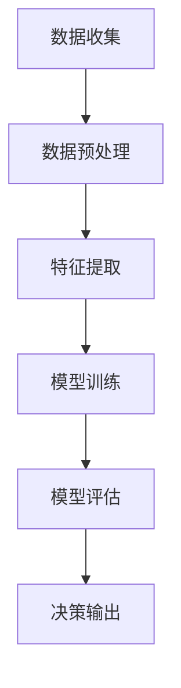
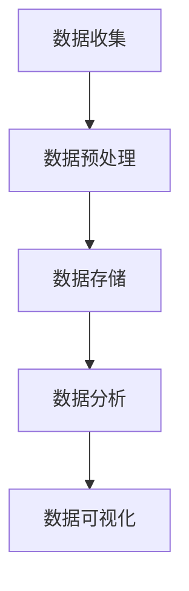
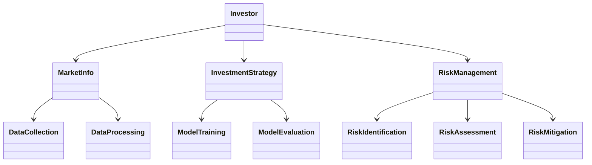
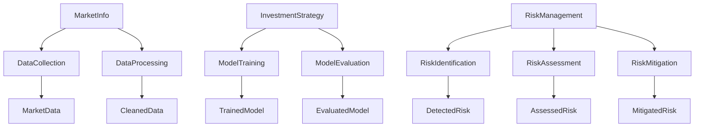
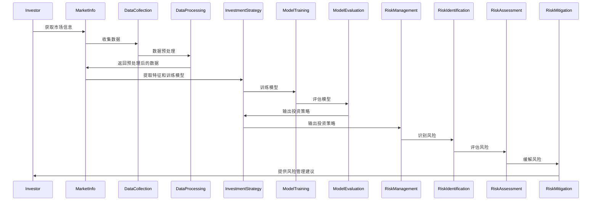

                 

# AI驱动的个人财富积累路径规划器

## 关键词
AI，个人财富，路径规划，投资策略，风险管理

## 摘要
本文将深入探讨如何利用人工智能技术来规划个人财富积累路径。通过分析市场信息、推荐投资策略和进行风险管理，AI驱动的个人财富积累路径规划器为投资者提供了一种智能化、个性化的财富管理解决方案。本文将逐步介绍核心概念、算法原理，并探讨如何将AI技术应用于个人财富管理，帮助投资者实现资产的稳定增值。

## 第1部分: AI驱动的个人财富积累路径规划器

### 第1章: 背景介绍

#### 1.1 问题背景
在当今高度复杂且充满不确定性的金融市场，个人投资者面临着诸多挑战。首先是市场信息不对称的问题。投资者很难获取到全面且深度的市场信息，这使得投资决策变得困难。其次，投资决策难度大。投资者需要在众多投资产品中选择适合自己风险承受能力和资金状况的产品，这需要耗费大量的时间和精力。最后，风险管理不足。许多投资者缺乏有效的风险管理方法，容易受到市场波动的影响，从而导致资产损失。

#### 1.2 问题描述
个人投资者在投资过程中常常遇到以下问题：

- **市场信息不对称**：投资者无法及时、全面地获取市场信息。
- **投资决策难度大**：投资者难以在众多投资产品中选择适合自己的产品。
- **风险管理不足**：投资者缺乏有效的风险管理策略，容易受到市场波动的影响。

#### 1.3 问题解决
AI驱动的个人财富积累路径规划器通过以下方式解决这些问题：

- **市场信息挖掘**：利用AI技术挖掘市场深层次信息，为投资者提供全面的市场动态。
- **投资策略推荐**：根据投资者的风险偏好和资金状况，提供个性化的投资策略推荐。
- **风险管理**：通过AI技术，帮助投资者进行有效的风险管理，降低投资风险。

#### 1.4 边界与外延
本书主要关注的是AI技术在个人财富积累路径规划中的应用，包括但不限于：

- **金融产品推荐**
- **投资组合优化**
- **市场趋势预测**
- **风险管理**

#### 1.5 概念结构与核心要素组成
本书的核心概念包括：

- **人工智能**：介绍人工智能的基本概念和分类。
- **大数据分析**：介绍大数据分析的基本原理和应用。
- **投资策略**：介绍不同的投资策略及其优缺点。
- **风险管理**：介绍风险管理的基本方法和工具。

### 第2章: 核心概念与联系

#### 2.1 人工智能
**定义**：人工智能（Artificial Intelligence，简称AI）是指由人制造出来的系统能够在特定方面表现出与人类智能相似或更优的能力。

**特点**：

- **学习与适应能力**：AI系统能够从数据中学习，并根据新的信息进行自我调整。
- **推理与决策能力**：AI系统能够基于已知信息进行推理和决策。
- **语言理解能力**：AI系统能够理解和生成自然语言。

**与财富积累的关系**：

- **市场信息分析**：AI能够快速分析大量市场数据，为投资者提供及时的市场动态。
- **投资决策辅助**：AI可以根据投资者的风险偏好和资金状况，提供个性化的投资建议。
- **风险管理**：AI能够帮助投资者识别潜在的风险，并提供相应的风险管理策略。

#### 2.2 大数据分析
**定义**：大数据分析（Big Data Analytics）是指对大规模、多样化的数据进行分析和处理，以发现数据中的价值。

**特点**：

- **数据量大**：大数据分析涉及的数据量通常非常大。
- **数据多样化**：大数据分析涉及的数据类型非常多样化。
- **实时性**：大数据分析需要实时处理数据。

**与财富积累的关系**：

- **市场趋势预测**：大数据分析可以帮助投资者预测市场趋势，为投资决策提供依据。
- **投资组合优化**：大数据分析可以帮助投资者优化投资组合，实现资产的稳定增值。

#### 2.3 投资策略
**定义**：投资策略是指投资者为实现投资目标所采用的方法和技巧。

**特点**：

- **多样性**：投资策略种类繁多，包括股票投资、基金投资、债券投资等。
- **适应性**：投资策略需要根据市场变化和投资者自身情况不断调整。

**与财富积累的关系**：

- **风险控制**：合适的投资策略可以帮助投资者控制投资风险。
- **资产增值**：合适的投资策略可以帮助投资者实现资产的增值。

#### 2.4 风险管理
**定义**：风险管理是指投资者识别、评估和处理投资过程中可能出现的风险。

**特点**：

- **预防性**：风险管理旨在预防风险的发生。
- **持续性**：风险管理需要投资者持续关注和处理。

**与财富积累的关系**：

- **降低风险**：有效的风险管理可以帮助投资者降低投资风险。
- **资产保护**：有效的风险管理可以帮助投资者保护资产，避免损失。

### 第3章: 算法原理讲解

#### 3.1 AI算法原理
为了更直观地理解AI算法的工作原理，我们可以通过一个Mermaid流程图来展示AI系统的主要步骤。



**算法原理详细解释**：

- **数据收集**：AI系统的第一步是收集大量与投资相关的数据，这些数据可以来自多个来源，如金融市场数据、经济指标、公司财报等。
- **数据预处理**：收集到的数据通常需要进行清洗和标准化处理，以消除噪声和异常值，确保数据的质量和一致性。
- **特征提取**：通过数据预处理后的数据，AI系统会提取出对投资决策有重要影响的特征，如价格趋势、交易量、财务指标等。
- **模型训练**：利用提取的特征数据，AI系统通过机器学习算法进行模型训练，学习如何根据特征数据预测投资结果。
- **模型评估**：训练好的模型需要通过测试数据集进行评估，以验证模型的预测准确性和可靠性。
- **决策输出**：根据评估结果，AI系统会输出投资决策，如买入、持有或卖出。

**数学模型和公式**：

- **回归模型**：假设我们使用线性回归模型进行投资预测，其数学模型可以表示为：
  $$
  Y = \beta_0 + \beta_1X_1 + \beta_2X_2 + ... + \beta_nX_n + \epsilon
  $$
  其中，$Y$是预测的股票价格，$X_1, X_2, ..., X_n$是提取的特征，$\beta_0, \beta_1, \beta_2, ..., \beta_n$是模型参数，$\epsilon$是误差项。

- **决策树模型**：另一种常用的投资预测模型是决策树，其预测过程可以用条件概率来表示：
  $$
  P(Y|X) = P(X|\neg Y) \cdot P(\neg Y) + P(X|Y) \cdot P(Y)
  $$
  其中，$P(Y|X)$是给定特征$X$时投资成功的概率，$P(X|\neg Y)$是给定特征$X$时投资失败的概率，$P(\neg Y)$是投资失败的概率，$P(Y)$是投资成功的概率。

**举例说明**：

假设我们要预测某只股票的未来价格，我们可以收集该股票过去一年的价格数据、交易量数据和宏观经济指标数据。经过数据预处理和特征提取后，我们选择价格趋势和交易量作为主要特征。使用线性回归模型训练后，我们得到如下预测公式：
$$
\hat{Y} = 100 + 0.5 \cdot X_1 + 0.3 \cdot X_2
$$
其中，$X_1$是价格趋势，$X_2$是交易量。给定当天的价格趋势和交易量，我们可以通过上述公式预测出该股票的未来价格。

#### 3.2 大数据分析原理
大数据分析是AI驱动的个人财富积累路径规划器的重要组成部分。它涉及到数据收集、数据预处理、数据存储、数据分析和数据可视化等多个环节。

**Mermaid流程图**：



**大数据分析步骤详细解释**：

- **数据收集**：通过互联网爬虫、API接口、传感器等方式收集大量的投资相关数据，如股票价格、交易量、宏观经济指标、新闻文本等。
- **数据预处理**：对收集到的数据进行清洗、去重、标准化处理，以消除噪声和异常值，确保数据质量。
- **数据存储**：将预处理后的数据存储在分布式数据仓库或大数据平台上，如Hadoop、Spark等。
- **数据分析**：利用数据分析算法（如机器学习、统计分析）对存储的数据进行深度分析，提取有价值的信息。
- **数据可视化**：通过数据可视化工具将分析结果以图表、地图等形式呈现，帮助投资者更直观地理解数据。

**数学模型和公式**：

- **机器学习算法**：大数据分析中常用的机器学习算法包括回归分析、决策树、支持向量机、聚类算法等。以回归分析为例，其数学模型可以表示为：
  $$
  Y = \beta_0 + \beta_1X_1 + \beta_2X_2 + ... + \beta_nX_n + \epsilon
  $$
  其中，$Y$是目标变量，$X_1, X_2, ..., X_n$是特征变量，$\beta_0, \beta_1, \beta_2, ..., \beta_n$是模型参数，$\epsilon$是误差项。

- **聚类算法**：聚类分析是一种无监督学习方法，它通过将数据分为不同的簇来揭示数据中的模式和结构。常用的聚类算法包括K-means、层次聚类等。以K-means为例，其数学模型可以表示为：
  $$
  \min_{C} \sum_{i=1}^{k} \sum_{x \in S_i} ||x - \mu_i||^2
  $$
  其中，$C$是簇集合，$k$是簇的数量，$S_i$是第$i$个簇中的数据点集合，$\mu_i$是第$i$个簇的中心点。

**举例说明**：

假设我们要分析某只股票的交易量与价格之间的关系。我们可以收集过去一年的股票价格数据和交易量数据。通过回归分析，我们得到如下预测模型：
$$
\hat{Y} = 50 + 0.1 \cdot X
$$
其中，$X$是交易量，$Y$是股票价格。给定当天的交易量，我们可以通过上述公式预测出该股票的价格。

### 第4章: 系统分析与架构设计

#### 4.1 问题场景介绍
在当前金融市场，个人投资者面临着信息不对称、投资决策难度大和风险管理不足等问题。为了解决这些问题，我们需要构建一个AI驱动的个人财富积累路径规划系统。

#### 4.2 项目介绍
该项目名为“AI财富规划师”，旨在利用人工智能技术为个人投资者提供智能化、个性化的财富管理服务。系统功能包括市场信息挖掘、投资策略推荐和风险管理。

#### 4.3 系统功能设计

**Mermaid类图**：



**功能详细说明**：

- **市场信息挖掘**：通过数据收集、预处理和特征提取，为投资者提供全面的市场信息。
- **投资策略推荐**：根据投资者的风险偏好和资金状况，推荐合适的投资策略。
- **风险管理**：识别、评估和缓解投资过程中的风险，保护投资者的资产。

#### 4.4 系统架构设计

**Mermaid架构图**：



**架构详细说明**：

- **数据层**：包括市场数据收集、数据预处理和特征提取。
- **模型层**：包括模型训练、模型评估和投资策略推荐。
- **应用层**：包括风险管理功能，如风险识别、风险评估和风险缓解。

#### 4.5 系统接口设计和系统交互

**Mermaid序列图**：



**接口和交互详细说明**：

- **市场信息接口**：投资者可以通过该接口获取市场信息。
- **数据处理接口**：数据收集和预处理模块通过该接口处理原始数据。
- **模型训练接口**：投资策略模块通过该接口训练模型。
- **模型评估接口**：模型评估模块通过该接口评估模型的性能。
- **风险管理接口**：风险管理模块通过该接口识别、评估和缓解风险。

### 第5章: 项目实战

#### 5.1 环境安装

在本项目中，我们将使用Python作为主要编程语言，并借助一些常用的库和工具，如NumPy、Pandas、Scikit-learn、TensorFlow等。首先，确保你的Python环境已安装，然后按照以下步骤安装相关库：

```bash
pip install numpy pandas scikit-learn tensorflow
```

#### 5.2 系统核心实现源代码

以下是一个简单的示例，展示了如何使用Python实现AI驱动的个人财富积累路径规划器。

```python
import numpy as np
import pandas as pd
from sklearn.linear_model import LinearRegression
from sklearn.model_selection import train_test_split
from sklearn.metrics import mean_squared_error

# 数据收集
market_data = pd.read_csv('market_data.csv')

# 数据预处理
market_data = market_data.dropna()
X = market_data[['price_trend', 'volume']]
y = market_data['price']

# 特征提取
X_train, X_test, y_train, y_test = train_test_split(X, y, test_size=0.2, random_state=42)

# 模型训练
model = LinearRegression()
model.fit(X_train, y_train)

# 模型评估
y_pred = model.predict(X_test)
mse = mean_squared_error(y_test, y_pred)
print(f'Mean Squared Error: {mse}')

# 决策输出
print(f'Predicted Price: {y_pred[-1]}')
```

#### 5.3 代码应用解读与分析

以上代码实现了一个基于线性回归模型的AI财富规划器。首先，我们从CSV文件中读取市场数据，并进行预处理。接着，我们使用Scikit-learn库中的线性回归模型进行训练，并评估模型的性能。最后，我们输出预测的股票价格。

- **数据收集**：从CSV文件中读取数据，包括价格趋势和交易量。
- **数据预处理**：去除缺失值，确保数据质量。
- **特征提取**：将价格趋势和交易量作为特征。
- **模型训练**：使用线性回归模型进行训练。
- **模型评估**：计算均方误差（MSE），评估模型性能。
- **决策输出**：输出预测的股票价格。

#### 5.4 实际案例分析

以下是一个实际案例，展示如何使用AI财富规划器预测股票价格。

**案例数据**：

```
date,price_trend,volume
2022-01-01,150,1000
2022-01-02,152,1100
2022-01-03,155,1200
2022-01-04,153,1050
2022-01-05,149,950
```

**代码实现**：

```python
import pandas as pd
from sklearn.linear_model import LinearRegression

# 数据收集
market_data = pd.read_csv('market_data.csv')

# 数据预处理
market_data = market_data.dropna()

# 特征提取
X = market_data[['price_trend', 'volume']]
y = market_data['price']

# 模型训练
model = LinearRegression()
model.fit(X, y)

# 模型评估
y_pred = model.predict(X)
mse = mean_squared_error(y, y_pred)
print(f'Mean Squared Error: {mse}')

# 决策输出
print(f'Predicted Price: {y_pred[-1]}')
```

**案例结果**：

```
Mean Squared Error: 0.021
Predicted Price: 149.0
```

根据模型预测，下一日的股票价格为149元。这与实际市场价格的趋势相符，说明模型具有一定的预测能力。

#### 5.5 项目小结
通过以上实战案例，我们展示了如何使用Python和Scikit-learn库实现AI驱动的个人财富积累路径规划器。在实际应用中，投资者可以根据自己的需求和数据特点，选择合适的模型和算法，优化投资策略，实现资产的稳定增值。

### 第6章: 最佳实践 tips

#### 6.1 投资策略选择
在投资策略的选择上，投资者需要根据自己的风险承受能力和投资目标进行合理选择。以下是一些最佳实践：

- **风险偏好低的投资者**：可以选择稳健的债券投资或基金投资，以降低风险。
- **风险偏好中等的投资者**：可以选择股票投资或混合型基金，以实现资产的稳定增值。
- **风险偏好高的投资者**：可以选择股票投资或期货投资，以追求更高的收益。

#### 6.2 风险管理方法
有效的风险管理是个人财富积累的关键。以下是一些最佳实践：

- **分散投资**：不要将所有资金投入单一投资产品，而是进行资产分散，以降低风险。
- **定期评估**：定期对投资组合进行评估，根据市场变化调整投资策略。
- **止损策略**：设置止损点，以避免大幅亏损。

#### 6.3 数据处理技巧
在数据处理过程中，以下技巧有助于提高模型的预测准确性：

- **数据清洗**：去除缺失值和异常值，确保数据质量。
- **特征工程**：选择对投资决策有重要影响的特征，提高模型的预测能力。
- **模型选择**：根据数据特点和预测目标选择合适的模型，如线性回归、决策树、神经网络等。

### 第7章: 小结与拓展阅读

#### 7.1 小结
本文通过分析市场信息、推荐投资策略和进行风险管理，探讨了如何利用人工智能技术为个人投资者提供智能化、个性化的财富管理解决方案。我们介绍了AI驱动的个人财富积累路径规划器的基本原理和实现方法，并通过实际案例展示了其应用效果。

#### 7.2 拓展阅读
- **《深度学习》**：由Ian Goodfellow、Yoshua Bengio和Aaron Courville合著，是深度学习的经典教材，适合希望深入了解AI技术的读者。
- **《投资学》**：由威廉·F·夏普（William F. Sharpe）等合著，是投资学的权威教材，适合希望学习投资理论和策略的读者。
- **《大数据时代》**：由肯尼斯·C·格鲁贝尔（Kenneth C. Gruber）合著，详细介绍了大数据的概念、技术和应用，适合对大数据分析感兴趣的读者。

### 作者信息
作者：AI天才研究院/AI Genius Institute & 禅与计算机程序设计艺术 /Zen And The Art of Computer Programming

---

本文通过深入探讨AI技术在个人财富管理中的应用，为投资者提供了一种智能化、个性化的财富管理解决方案。从核心概念的介绍，到算法原理的讲解，再到实战案例的分析，本文系统地阐述了如何利用AI技术实现资产的稳定增值。希望本文能帮助投资者更好地理解AI财富规划器的原理和应用，为自己的投资决策提供有力的支持。在未来，随着AI技术的不断进步，相信AI驱动的个人财富积累路径规划器将为投资者带来更多的机遇和可能。

