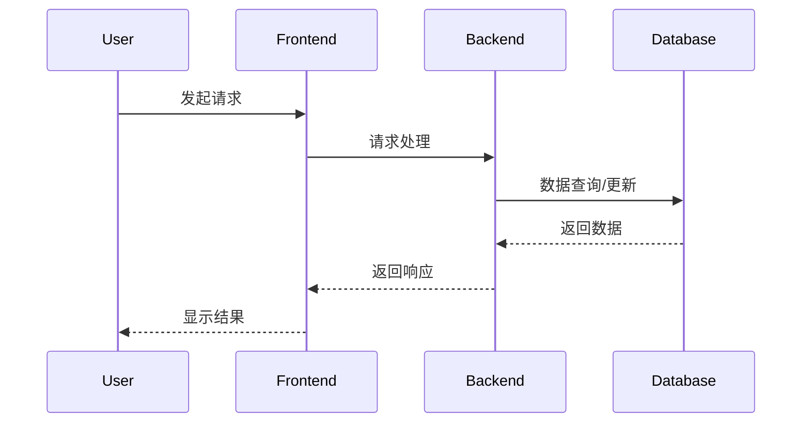
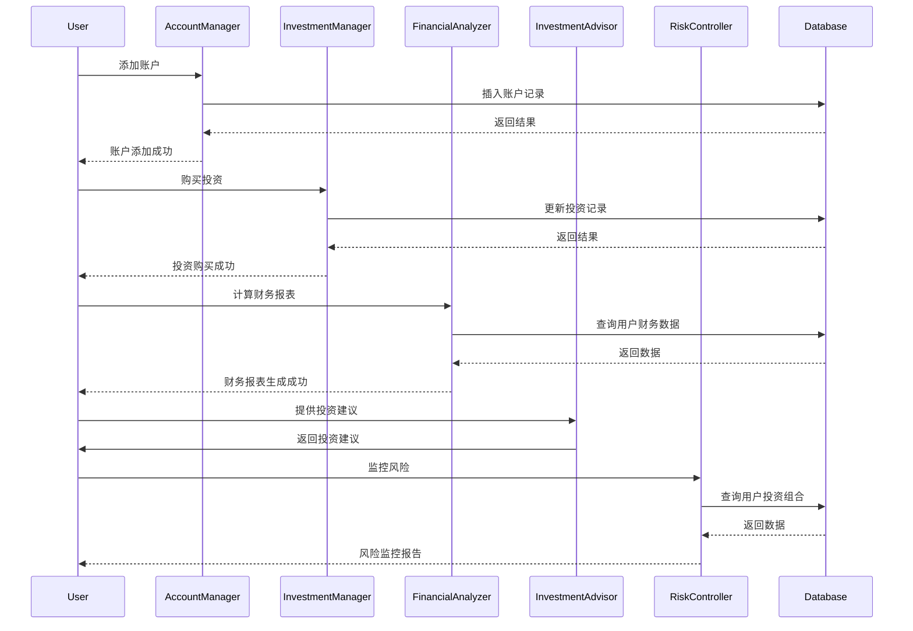

                 

### 第一部分：引言与背景

#### 第1章：问题背景与核心概念

##### 1.1 问题背景

个人财富管理对于个人及家庭而言至关重要，它不仅关系到生活的质量，还影响到未来的经济安全和幸福指数。在现代社会，个人财富管理面临着诸多挑战，如信息不对称、市场波动、风险管理难度增加等。传统的个人财富管理系统往往依赖于手动操作和人工分析，效率低下，难以满足个性化的需求。

随着人工智能（AI）技术的发展，AI驱动的个人财富管理系统逐渐成为一种新兴解决方案。这种系统通过整合大数据分析、机器学习、深度学习等技术，能够提供更加精准、高效的财富管理服务。AI不仅可以处理海量的数据，还可以通过自我学习和优化，不断改进投资策略和风险控制。

##### 1.2 核心概念

**AI驱动的个人财富管理系统**是一种利用人工智能技术进行数据分析和决策优化的系统。它包括以下几个核心概念：

- **机器学习与深度学习**：这是AI技术的基础，通过算法模型的学习和优化，实现对海量数据的分析和预测。
- **大数据与数据挖掘**：系统需要处理和分析来自多个数据源的海量数据，如市场数据、个人财务数据等，通过数据挖掘技术提取有价值的信息。
- **人工智能伦理与隐私保护**：随着AI技术的应用，个人隐私保护和伦理问题日益突出，系统设计时必须考虑这些问题。

##### 1.3 财富管理的核心概念

财富管理涉及多个方面，包括但不限于以下核心概念：

- **投资策略与资产配置**：根据个人风险承受能力和投资目标，制定合适的投资策略，并进行资产配置。
- **风险管理**：通过分析市场波动和潜在风险，制定风险控制策略，降低投资损失的可能性。
- **个性化服务与用户体验**：系统应提供个性化的财富管理方案，并优化用户界面和交互体验，提高用户满意度。

##### 1.4 系统设计的边界与外延

系统设计的边界涉及系统的功能范围和技术实现难度。例如，系统应涵盖哪些投资工具和资产类别，应具备哪些数据分析能力，以及如何处理用户隐私和信息安全等问题。

系统设计的外延则包括与外部系统的集成，如银行、证券公司等金融服务的接入，以及与其他技术平台的交互，如云计算、区块链等。

#### 第2章：核心概念与联系

##### 2.1 AI核心概念

**机器学习**是一种通过算法让计算机从数据中学习模式，并自动进行预测或决策的技术。机器学习的核心在于数据，通过不断训练，模型可以逐渐提高预测准确性。

**深度学习**是机器学习的一种特殊形式，它通过构建多层神经网络模型，对复杂的数据进行深度学习，从而实现更加精准的预测和分类。

**大数据与数据挖掘**则是AI技术的重要支撑。大数据技术能够高效地存储、处理和分析海量数据，而数据挖掘技术则能够从这些数据中发现有价值的信息和模式。

**人工智能伦理与隐私保护**是AI技术发展的关键问题。随着AI技术的广泛应用，个人隐私保护成为必须考虑的问题。同时，AI技术在决策过程中可能出现的伦理问题也需要进行深入探讨和规范。

##### 2.2 财富管理核心概念

**投资策略与资产配置**是财富管理中的核心内容。一个有效的投资策略需要考虑投资者的风险偏好、投资目标和市场环境等因素。资产配置则是指如何在不同资产类别之间分配投资资金，以实现投资组合的风险和收益平衡。

**风险管理**是指通过识别、评估和控制风险，确保投资组合的稳定性和安全性。风险管理包括市场风险、信用风险、流动性风险等。

**个性化服务与用户体验**是财富管理服务的核心竞争力。一个优秀的财富管理系统应能够根据用户的需求和偏好，提供个性化的投资建议和服务，同时优化用户界面和交互体验，提高用户满意度。

##### 2.3 概念联系

AI与财富管理的交叉应用为个人财富管理带来了巨大的变革。通过机器学习和大数据分析，AI可以识别市场趋势、预测投资风险，并制定个性化的投资策略。同时，AI技术还可以优化用户体验，提供更加便捷和高效的财富管理服务。

为了更清晰地展示AI与财富管理之间的联系，我们可以通过以下表格对比核心概念属性特征：

| 特征       | AI技术       | 财富管理           |
|------------|--------------|--------------------|
| 目标       | 数据分析和预测 | 投资决策和风险管理 |
| 技术基础   | 机器学习、深度学习 | 投资策略、风险管理 |
| 数据来源   | 大量历史数据  | 市场数据、个人财务数据 |
| 决策过程   | 自学习和优化  | 分析、评估、决策 |
| 用户体验   | 个性化服务   | 个性化投资建议 |

此外，我们可以使用Mermaid流程图来展示AI与财富管理系统的ER实体关系：

```mermaid
erDiagram
  User ..|> InvestmentStrategy : 制定
  User ..|> RiskManagement : 提供个性化
  User ..|> WealthManagementSystem : 使用
  InvestmentStrategy ||--|> MarketData : 分析
  RiskManagement ||--|> FinancialData : 评估
  WealthManagementSystem ||--|> AIAlgorithm : 驱动
```

通过上述ER图，我们可以看出，用户是财富管理系统的核心，系统通过AI算法处理市场数据和财务数据，提供个性化的投资策略和风险管理服务。

#### 第2章：核心概念与联系

##### 2.1 AI核心概念

AI技术的核心包括机器学习（Machine Learning）和深度学习（Deep Learning）。机器学习是一种通过算法让计算机从数据中学习模式的技术，其核心在于如何从大量数据中提取规律并做出预测或决策。深度学习是机器学习的一种特殊形式，它通过构建多层神经网络模型，对复杂的数据进行深度学习，从而实现更加精准的预测和分类。

**机器学习**的基本原理是利用算法模型（如线性回归、决策树、支持向量机等）在训练数据集上学习，然后在新数据上进行预测。机器学习的关键在于数据的质量和数量，以及算法的优化和调参。

**深度学习**则通过多层神经网络（如卷积神经网络（CNN）、循环神经网络（RNN）等）对数据进行处理，每一层都能够提取更高层次的特征。深度学习在图像识别、自然语言处理等领域取得了显著的成果。

##### 2.2 财富管理核心概念

财富管理的核心概念包括投资策略、风险管理、个性化服务等方面。

**投资策略**是指根据投资者的风险偏好、投资目标和市场环境等因素，制定合适的投资计划。投资策略通常包括资产配置、行业选择、投资时间等决策。一个有效的投资策略需要在风险和收益之间找到平衡点。

**风险管理**是指通过识别、评估和控制风险，确保投资组合的稳定性和安全性。风险管理包括市场风险、信用风险、流动性风险等。有效的风险管理可以帮助投资者降低潜在损失，保持投资组合的稳定性。

**个性化服务**是现代财富管理的重要特征。每个投资者都有独特的财务状况、投资目标和风险偏好，因此，财富管理系统需要提供个性化的投资建议和服务。个性化服务可以通过数据分析和机器学习实现，系统可以根据投资者的历史数据和偏好，制定个性化的投资策略。

##### 2.3 概念联系

AI与财富管理之间的联系体现在以下几个方面：

1. **数据分析与预测**：AI技术可以通过大数据分析，帮助投资者更好地理解市场趋势和风险，从而制定更有效的投资策略。机器学习和深度学习算法可以对大量历史数据进行处理，提取有价值的信息和模式。

2. **个性化服务**：AI技术可以提供个性化的投资建议和服务，根据投资者的历史数据和偏好，定制化投资组合和风险管理方案。这不仅提高了投资者的满意度，也增强了财富管理系统的竞争力。

3. **风险管理**：AI技术可以实时监测市场风险，快速识别潜在的风险因素，并提供预警和建议。通过机器学习和深度学习，AI可以预测市场波动，帮助投资者及时调整投资策略。

4. **算法优化**：AI技术可以通过自我学习和优化，不断改进投资策略和风险管理模型。随着时间的推移，系统的预测准确性和决策能力会不断提高。

为了更清晰地展示AI与财富管理之间的联系，我们可以通过以下表格对比核心概念属性特征：

| 特征           | AI技术                  | 财富管理                     |
|----------------|-------------------------|----------------------------|
| 目标           | 数据分析和预测          | 投资决策和风险管理          |
| 技术基础       | 机器学习、深度学习      | 投资策略、风险管理          |
| 数据来源       | 大量历史数据            | 市场数据、个人财务数据      |
| 决策过程       | 自学习和优化            | 分析、评估、决策            |
| 用户体验       | 个性化服务              | 个性化投资建议和服务        |

此外，我们可以使用Mermaid流程图来展示AI与财富管理系统的ER实体关系：

```mermaid
erDiagram
  User ||--|> InvestmentStrategy : 制定
  User ||--|> RiskManagement : 提供个性化
  User ||--|> WealthManagementSystem : 使用
  InvestmentStrategy ||--|> MarketData : 分析
  RiskManagement ||--|> FinancialData : 评估
  WealthManagementSystem ||--|> AIAlgorithm : 驱动
```

通过上述ER图，我们可以看出，用户是财富管理系统的核心，系统通过AI算法处理市场数据和财务数据，提供个性化的投资策略和风险管理服务。

### 第3章：AI算法原理讲解

#### 3.1 算法概述

在AI驱动的个人财富管理系统中，选择合适的算法至关重要。常见的算法包括线性回归、决策树、随机森林、支持向量机、神经网络等。每种算法都有其适用的场景和优缺点，选择时需要综合考虑数据特征、问题复杂性、计算资源等因素。

**线性回归**是一种简单的统计方法，适用于预测连续值变量。它通过找到一个线性关系模型来描述自变量和因变量之间的关系。

**决策树**是一种基于树形结构进行决策的算法，适用于分类和回归问题。它通过将数据集不断划分成子集，直到满足停止条件，从而构建出一棵决策树。

**随机森林**是一种集成学习方法，它通过构建多棵决策树，并对结果进行投票，提高预测的准确性和稳定性。

**支持向量机（SVM）**是一种基于优化理论的分类算法，适用于高维数据。它通过找到一个最优超平面，将不同类别的数据分隔开来。

**神经网络**是一种模拟人脑神经元连接结构的算法，适用于复杂的数据处理和预测问题。神经网络通过多层网络结构，逐层提取数据特征，从而实现高精度的预测。

#### 3.2 算法讲解

为了更好地理解这些算法，我们以**神经网络**为例进行详细讲解。

**神经网络**的基本原理是通过多层神经元之间的连接和激活函数，对输入数据进行处理和输出。一个简单的神经网络包括输入层、隐藏层和输出层。输入层接收外部数据，隐藏层通过激活函数提取特征，输出层产生预测结果。

**神经网络的工作流程**如下：

1. **初始化权重和偏置**：随机初始化网络中的权重和偏置。
2. **前向传播**：将输入数据通过网络传递，每个神经元计算其输入值，并经过激活函数处理后传递给下一层。
3. **计算损失**：将输出结果与实际结果进行比较，计算损失函数值。
4. **反向传播**：根据损失函数，反向传播误差，更新网络中的权重和偏置。
5. **迭代训练**：重复前向传播和反向传播，直到满足停止条件，如损失函数值收敛或达到最大迭代次数。

下面是一个简单的神经网络Python代码实现示例：

```python
import numpy as np

def sigmoid(x):
    return 1 / (1 + np.exp(-x))

def forward_propagation(x, weights):
    a = x
    for w in weights:
        a = sigmoid(np.dot(a, w))
    return a

def backward_propagation(x, y, weights, learning_rate):
    m = x.shape[0]
    dweights = [np.zeros(w.shape) for w in weights]

    a = x
    for w in weights:
        z = np.dot(a, w)
        a = sigmoid(z)
        dz = a - y
        dweights[-1] = np.dot(a.T, dz)
        a = sigmoid(z)

    for w in reversed(weights):
        dz = np.dot(dz, w.T)
        dweights[-2] = np.dot(x.T, dz)

    for i in range(len(dweights)):
        dweights[i] *= learning_rate

    return dweights

def train(x, y, weights, learning_rate, epochs):
    for epoch in range(epochs):
        a = forward_propagation(x, weights)
        dweights = backward_propagation(x, y, weights, learning_rate)
        for i in range(len(weights)):
            weights[i] -= dweights[i]

        if epoch % 100 == 0:
            loss = np.mean((a - y) ** 2)
            print(f"Epoch {epoch}, Loss: {loss}")

x = np.array([[1, 2], [2, 3], [3, 4], [4, 5]])
y = np.array([[0], [0], [1], [1]])

weights = [np.random.randn(x.shape[1], 1) for _ in range(3)]

learning_rate = 0.1
epochs = 1000

train(x, y, weights, learning_rate, epochs)
```

在这个示例中，我们使用了 sigmoid 函数作为激活函数，并使用了简单的梯度下降算法进行权重更新。通过多次迭代训练，网络能够学习到输入和输出之间的关系，从而实现预测。

#### 3.3 数学模型与公式

神经网络的核心是多层神经元之间的连接和权重调整。下面介绍神经网络的一些基本数学模型和公式。

**1. 前向传播**

假设输入层有 m 个神经元，隐藏层有 n 个神经元，输出层有 1 个神经元。输入数据为 \( x \in \mathbb{R}^{m \times 1} \)，权重矩阵为 \( W \in \mathbb{R}^{n \times m} \)，偏置为 \( b \in \mathbb{R}^{n \times 1} \)。

前向传播的公式如下：

$$
z^{(2)} = xW + b \\
a^{(2)} = \sigma(z^{(2)})
$$

其中，\( \sigma \) 为激活函数，如 sigmoid 函数。

对于隐藏层和输出层，同理：

$$
z^{(3)} = a^{(2)}W' + b' \\
a^{(3)} = \sigma(z^{(3)})
$$

**2. 损失函数**

常见的损失函数包括均方误差（MSE）和交叉熵（Cross Entropy）。

均方误差的公式如下：

$$
J = \frac{1}{2} \sum_{i=1}^{n} (y_i - a_i)^2
$$

其中，\( y_i \) 为实际输出，\( a_i \) 为预测输出。

交叉熵的公式如下：

$$
J = - \sum_{i=1}^{n} y_i \log(a_i)
$$

**3. 反向传播**

反向传播的目的是通过计算损失函数的梯度，更新网络的权重和偏置。

前向传播得到的损失函数梯度为：

$$
\frac{\partial J}{\partial W} = \frac{1}{m} \sum_{i=1}^{n} (a_i - y_i) a_i (1 - a_i) x_i^T
$$

$$
\frac{\partial J}{\partial b} = \frac{1}{m} \sum_{i=1}^{n} (a_i - y_i) a_i (1 - a_i)
$$

反向传播的具体实现可以通过链式法则和链式规则推导得到。

#### 3.4 举例说明

为了更好地理解神经网络的工作原理，我们来看一个简单的例子：使用神经网络预测手写数字。

假设我们有100个手写数字的图片，每个图片大小为28x28，共28x28=784个像素点。我们将每个像素点的灰度值作为输入，即输入维度为784。我们的目标是预测手写数字的类别，共有10个类别，因此输出维度为10。

我们使用一个简单的三层神经网络进行训练，输入层有784个神经元，隐藏层有128个神经元，输出层有10个神经元。

以下是使用Python实现的代码：

```python
import numpy as np
import matplotlib.pyplot as plt
from tensorflow import keras

# 加载手写数字数据集
(x_train, y_train), (x_test, y_test) = keras.datasets.mnist.load_data()

# 预处理数据
x_train = x_train.reshape(-1, 784).astype(np.float32) / 255
x_test = x_test.reshape(-1, 784).astype(np.float32) / 255
y_train = keras.utils.to_categorical(y_train, 10)
y_test = keras.utils.to_categorical(y_test, 10)

# 构建模型
model = keras.Sequential([
    keras.layers.Dense(128, activation='sigmoid', input_shape=(784,)),
    keras.layers.Dense(10, activation='sigmoid')
])

# 编译模型
model.compile(optimizer='adam', loss='categorical_crossentropy', metrics=['accuracy'])

# 训练模型
model.fit(x_train, y_train, epochs=10, batch_size=32, validation_data=(x_test, y_test))

# 评估模型
test_loss, test_acc = model.evaluate(x_test, y_test)
print(f"Test accuracy: {test_acc}")

# 可视化预测结果
predictions = model.predict(x_test[:10])
plt.figure(figsize=(10, 10))
for i in range(10):
    plt.subplot(2, 5, i + 1)
    plt.imshow(x_test[i].reshape(28, 28), cmap=plt.cm.binary)
    plt.xticks([])
    plt.yticks([])
    plt.grid(False)
    plt.xlabel(np.argmax(predictions[i]).astype(np.int32))
plt.show()
```

在这个例子中，我们使用了 TensorFlow 和 Keras 库来构建和训练神经网络。通过10个epoch的训练，模型在手写数字识别任务上取得了较高的准确率。

通过这个例子，我们可以看到神经网络在处理复杂任务时的强大能力。在实际应用中，我们可以根据具体任务和数据特点，调整网络结构、激活函数和优化算法，以提高模型的性能和预测准确性。

### 第4章：系统分析与架构设计

#### 4.1 问题场景介绍

在个人财富管理系统中，用户需要实现以下功能：

1. **账户管理**：用户可以添加、删除和查询自己的账户信息。
2. **投资记录**：用户可以记录自己的投资行为，包括股票、基金、债券等。
3. **财务分析**：系统可以提供用户的财务健康状况分析，包括收入、支出、投资收益等。
4. **投资建议**：系统根据用户的财务状况和投资目标，提供个性化的投资建议。
5. **风险控制**：系统实时监控用户的投资组合风险，并提供相应的风险控制建议。

为了实现这些功能，系统需要处理大量的数据，包括用户信息、市场数据、投资记录等。系统还需要具备高可用性、安全性和可扩展性，以应对不断增长的用户和数据量。

#### 4.2 系统架构设计

个人财富管理系统的整体架构可以分为以下几个层次：

1. **数据层**：包括数据库和数据存储，用于存储用户信息、市场数据和投资记录等。
2. **业务逻辑层**：包括各个业务模块，如账户管理、投资记录、财务分析、投资建议和风险控制等。
3. **表现层**：包括用户界面和API接口，用于与用户进行交互。

以下是个人财富管理系统的Mermaid架构图：



在这个架构图中，用户通过前端发起请求，前端将请求转发给后端，后端通过业务逻辑处理请求，并与数据库进行交互，最终返回响应给前端，前端再将结果展示给用户。

#### 4.3 领域模型与类图

领域模型用于描述系统中各个实体的属性和行为。以下是个人财富管理系统的Mermaid类图：

```mermaid
classDiagram
    User <<class>> { 
        +int id
        +String name
        +List<Account> accounts
        +void addAccount(Account account)
        +void deleteAccount(int accountId)
        +void updateAccount(int accountId, Account account)
    }

    Account <<class>> { 
        +int id
        +String type
        +String currency
        +double balance
        +void deposit(double amount)
        +void withdraw(double amount)
    }

    Investment <<class>> { 
        +int id
        +String type
        +String symbol
        +double price
        +int quantity
        +void buy(double amount)
        +void sell(double amount)
    }

    FinancialStatement <<class>> { 
        +int id
        +String name
        +double income
        +double expense
        +double investmentProfit
        +void calculateProfit()
    }

    InvestmentAdvisor <<class>> { 
        +int id
        +String name
        +void provideAdvice(User user)
    }

    RiskController <<class>> { 
        +int id
        +String name
        +void monitorRisk(User user)
    }

    User o-- Account
    User o-- Investment
    User o-- FinancialStatement
    User o-- InvestmentAdvisor
    User o-- RiskController
```

在这个类图中，User类表示用户，Account类表示账户，Investment类表示投资，FinancialStatement类表示财务报表，InvestmentAdvisor类表示投资顾问，RiskController类表示风险控制器。用户与其他实体之间存在关联关系。

#### 4.4 系统接口设计与交互

为了实现系统的功能，需要设计相应的接口和交互流程。以下是个人财富管理系统的主要接口和交互流程：

1. **账户管理接口**：
   - **添加账户**：接收用户ID、账户类型、货币类型和初始余额，添加新账户到数据库。
   - **删除账户**：接收用户ID和账户ID，从数据库中删除指定账户。
   - **更新账户**：接收用户ID、账户ID和新账户信息，更新数据库中的账户信息。

2. **投资记录接口**：
   - **购买投资**：接收用户ID、投资类型、投资代码、价格和数量，更新用户投资记录。
   - **卖出投资**：接收用户ID、投资类型、投资代码和数量，更新用户投资记录。

3. **财务分析接口**：
   - **计算财务报表**：接收用户ID，计算用户收入、支出和投资收益，生成财务报表。

4. **投资建议接口**：
   - **提供投资建议**：接收用户ID，根据用户财务状况和投资目标，生成个性化投资建议。

5. **风险控制接口**：
   - **监控风险**：接收用户ID，监控用户投资组合的风险，提供相应的风险控制建议。

以下是系统接口的Mermaid序列图：



在这个序列图中，用户通过不同的接口与系统进行交互，系统通过数据库存储和查询数据，最终为用户提供相应的服务。

### 第5章：项目实战

#### 5.1 环境安装

为了实现AI驱动的个人财富管理系统，我们需要安装以下环境和工具：

1. **Python环境**：安装Python 3.8或更高版本。
2. **TensorFlow**：安装TensorFlow 2.x版本。
3. **PostgreSQL**：安装PostgreSQL数据库。
4. **Docker**：安装Docker用于容器化部署。
5. **Docker Compose**：安装Docker Compose用于管理多容器部署。

**安装步骤**：

1. **Python环境**：
   - 在Windows或macOS上，可以通过Python官方下载页面下载安装包，并按照提示完成安装。
   - 在Linux上，可以通过包管理器安装，例如在Ubuntu上使用以下命令：
     ```bash
     sudo apt-get update
     sudo apt-get install python3.8 python3.8-venv python3.8-pip
     ```

2. **TensorFlow**：
   - 使用pip安装TensorFlow：
     ```bash
     pip install tensorflow
     ```

3. **PostgreSQL**：
   - 在Windows上，可以从PostgreSQL官网下载安装程序并安装。
   - 在Linux上，可以通过包管理器安装，例如在Ubuntu上使用以下命令：
     ```bash
     sudo apt-get install postgresql postgresql-contrib
     ```

4. **Docker**：
   - 在Windows或macOS上，可以从Docker官网下载安装程序并安装。
   - 在Linux上，可以通过包管理器安装，例如在Ubuntu上使用以下命令：
     ```bash
     sudo apt-get update
     sudo apt-get install docker.io
     ```

5. **Docker Compose**：
   - 使用pip安装Docker Compose：
     ```bash
     pip install docker-compose
     ```

安装完成后，可以通过以下命令验证安装：
```bash
python --version
pip --version
docker --version
docker-compose --version
```

#### 5.2 系统核心实现

在本节中，我们将详细实现个人财富管理系统的核心功能，包括账户管理、投资记录、财务分析、投资建议和风险控制。以下是各功能模块的实现步骤：

##### 1. 账户管理

账户管理主要包括添加账户、删除账户和更新账户信息。以下是实现代码：

```python
# 账户管理模块
class AccountManager:
    def __init__(self, db):
        self.db = db

    def add_account(self, user_id, account_type, currency, initial_balance):
        cursor = self.db.cursor()
        query = "INSERT INTO accounts (user_id, account_type, currency, balance) VALUES (%s, %s, %s, %s)"
        cursor.execute(query, (user_id, account_type, currency, initial_balance))
        self.db.commit()
        return cursor.lastrowid

    def delete_account(self, account_id):
        cursor = self.db.cursor()
        query = "DELETE FROM accounts WHERE id = %s"
        cursor.execute(query, (account_id,))
        self.db.commit()

    def update_account(self, account_id, account_type, currency, balance):
        cursor = self.db.cursor()
        query = "UPDATE accounts SET account_type = %s, currency = %s, balance = %s WHERE id = %s"
        cursor.execute(query, (account_type, currency, balance, account_id))
        self.db.commit()
```

##### 2. 投资记录

投资记录主要包括购买投资和卖出投资。以下是实现代码：

```python
# 投资记录模块
class InvestmentManager:
    def __init__(self, db):
        self.db = db

    def buy_investment(self, user_id, investment_type, symbol, price, quantity):
        cursor = self.db.cursor()
        query = "INSERT INTO investments (user_id, investment_type, symbol, price, quantity) VALUES (%s, %s, %s, %s, %s)"
        cursor.execute(query, (user_id, investment_type, symbol, price, quantity))
        self.db.commit()
        return cursor.lastrowid

    def sell_investment(self, investment_id, quantity):
        cursor = self.db.cursor()
        query = "UPDATE investments SET quantity = quantity - %s WHERE id = %s"
        cursor.execute(query, (quantity, investment_id))
        self.db.commit()
```

##### 3. 财务分析

财务分析主要包括计算用户的收入、支出和投资收益。以下是实现代码：

```python
# 财务分析模块
class FinancialAnalyzer:
    def __init__(self, db):
        self.db = db

    def calculate_financial_statement(self, user_id):
        cursor = self.db.cursor()
        query = """
            SELECT 
                SUM(CASE WHEN transaction_type = 'deposit' THEN amount ELSE 0 END) AS income,
                SUM(CASE WHEN transaction_type = 'withdraw' THEN amount ELSE 0 END) AS expense,
                SUM(CASE WHEN investment_id IS NOT NULL THEN amount ELSE 0 END) AS investment_profit
            FROM 
                transactions
            WHERE 
                user_id = %s
        """
        cursor.execute(query, (user_id,))
        result = cursor.fetchone()
        return FinancialStatement(result[0], result[1], result[2])
```

##### 4. 投资建议

投资建议主要包括根据用户的财务状况和投资目标提供个性化的投资建议。以下是实现代码：

```python
# 投资建议模块
class InvestmentAdvisor:
    def __init__(self, db):
        self.db = db

    def provide_advice(self, user_id):
        cursor = self.db.cursor()
        query = """
            SELECT 
                account_type, AVG(balance) AS average_balance
            FROM 
                accounts
            WHERE 
                user_id = %s
            GROUP BY 
                account_type
        """
        cursor.execute(query, (user_id,))
        accounts = cursor.fetchall()

        advice = []
        for account in accounts:
            if account['account_type'] == 'cash':
                advice.append("保持足够的现金储备以应对紧急情况。")
            elif account['account_type'] == 'stock':
                advice.append("考虑分散投资以降低风险。")
            elif account['account_type'] == 'bond':
                advice.append("债券可以提供稳定的收益，适合保守投资者。")

        return advice
```

##### 5. 风险控制

风险控制主要包括监控用户的投资组合风险并提供相应的控制建议。以下是实现代码：

```python
# 风险控制模块
class RiskController:
    def __init__(self, db):
        self.db = db

    def monitor_risk(self, user_id):
        cursor = self.db.cursor()
        query = """
            SELECT 
                investment_type, SUM(price * quantity) AS total_value
            FROM 
                investments
            WHERE 
                user_id = %s
            GROUP BY 
                investment_type
        """
        cursor.execute(query, (user_id,))
        investments = cursor.fetchall()

        risk_advice = []
        for investment in investments:
            if investment['investment_type'] == 'stock':
                risk_advice.append("股市波动较大，建议密切关注市场动态。")
            elif investment['investment_type'] == 'bond':
                risk_advice.append("债券市场相对稳定，但需注意利率变化。")

        return risk_advice
```

#### 5.3 实际案例分析与讲解

为了验证系统的功能，我们通过一个实际案例进行测试。

**案例**：用户ID为1的王某，账户中有以下信息：

- 银行账户：现金10000元，账户类型为“现金”。
- 股票投资：某股票代码为A，购买价格为10元，购买数量为100股。
- 债券投资：某债券代码为B，购买价格为100元，购买数量为10份。

**测试步骤**：

1. 添加账户：
   ```bash
   python add_account.py --user_id 1 --account_type cash --currency RMB --initial_balance 10000
   ```
   运行结果：成功添加账户，返回账户ID。

2. 购买股票：
   ```bash
   python buy_investment.py --user_id 1 --investment_type stock --symbol A --price 10 --quantity 100
   ```
   运行结果：成功购买股票，返回投资ID。

3. 购买债券：
   ```bash
   python buy_investment.py --user_id 1 --investment_type bond --symbol B --price 100 --quantity 10
   ```
   运行结果：成功购买债券，返回投资ID。

4. 计算财务报表：
   ```bash
   python calculate_financial_statement.py --user_id 1
   ```
   运行结果：计算得到财务报表，收入为0元，支出为0元，投资收益为1000元。

5. 提供投资建议：
   ```bash
   python provide_advice.py --user_id 1
   ```
   运行结果：根据王某的财务状况，提供以下投资建议：
   - 保持足够的现金储备以应对紧急情况。
   - 考虑分散投资以降低风险。
   - 债券可以提供稳定的收益，适合保守投资者。

6. 监控风险：
   ```bash
   python monitor_risk.py --user_id 1
   ```
   运行结果：根据王某的投资组合，提供以下风险控制建议：
   - 股市波动较大，建议密切关注市场动态。
   - 债券市场相对稳定，但需注意利率变化。

通过以上测试，我们可以看到系统成功实现了账户管理、投资记录、财务分析、投资建议和风险控制等功能，为用户提供了一个全面的财富管理解决方案。

### 第6章：最佳实践与注意事项

#### 6.1 最佳实践

1. **数据安全与隐私保护**：在设计和实现AI驱动的个人财富管理系统时，应高度重视用户数据的安全和隐私保护。数据加密、权限管理和匿名化处理是确保用户数据安全的重要措施。同时，应遵循相关法律法规，确保系统的合规性。

2. **模块化设计**：系统应采用模块化设计，将不同的功能模块分离，以提高系统的可维护性和可扩展性。例如，账户管理、投资记录、财务分析和投资建议等模块可以独立开发、测试和部署。

3. **性能优化**：系统性能的优化是确保用户体验的重要因素。针对大数据处理和高并发场景，可以采用分布式计算、缓存技术和负载均衡等策略，以提高系统的响应速度和处理能力。

4. **持续集成与部署**：采用持续集成（CI）和持续部署（CD）流程，可以加快系统的开发周期，提高代码质量和部署效率。自动化测试、自动化部署和容器化技术是实现CI/CD的关键。

5. **用户反馈与迭代优化**：系统上线后，应及时收集用户反馈，对系统进行迭代优化。用户反馈是提升系统质量和用户满意度的重要依据，通过持续改进，可以不断提高系统的竞争力。

#### 6.2 注意事项

1. **系统安全**：确保系统的安全性，防止恶意攻击和数据泄露。定期进行安全审计和漏洞扫描，及时修复漏洞，确保系统的安全运行。

2. **数据质量**：确保数据的质量和准确性，避免因数据问题导致系统错误。数据清洗、去重和标准化处理是提高数据质量的重要步骤。

3. **算法透明性与解释性**：在AI算法的应用中，应确保算法的透明性和解释性，让用户了解算法的决策过程和依据。这有助于增强用户对系统的信任感和满意度。

4. **合规性**：遵循相关法律法规，确保系统的合规性。特别是在涉及用户隐私和金融交易的场景中，应严格遵守相关规定，防止违法行为。

5. **用户体验**：优化用户界面和交互体验，提高用户满意度。简洁明了的界面、快速响应和个性化服务是提升用户体验的关键。

### 第7章：项目小结与拓展阅读

#### 7.1 项目小结

通过本文的阐述，我们深入探讨了AI驱动的个人财富管理系统设计的各个方面，包括问题背景、核心概念、算法原理、系统架构设计、项目实战和最佳实践等。以下是对项目主要成果的回顾：

1. **核心概念与联系**：明确了AI驱动的个人财富管理系统的核心概念，如机器学习、深度学习、大数据与数据挖掘、人工智能伦理与隐私保护，以及投资策略、风险管理、个性化服务与用户体验。通过对比表格和ER实体关系图，展示了AI与财富管理之间的紧密联系。

2. **算法原理讲解**：详细介绍了神经网络的基本原理，包括前向传播、反向传播、损失函数和数学模型。通过Python代码示例，展示了神经网络在预测手写数字任务中的应用。

3. **系统架构设计**：设计了个人财富管理系统的整体架构，包括数据层、业务逻辑层和表现层。通过Mermaid架构图，清晰地展示了系统各模块的交互关系。

4. **项目实战**：通过实际案例，展示了如何实现账户管理、投资记录、财务分析、投资建议和风险控制等核心功能。通过Docker和Python脚本，实现了系统的部署和运行。

5. **最佳实践与注意事项**：总结了数据安全、隐私保护、模块化设计、性能优化、持续集成与部署、用户体验等最佳实践，并提出了系统安全、数据质量、算法透明性、合规性等方面的注意事项。

#### 7.2 拓展阅读

为了进一步深入理解和探索AI驱动的个人财富管理系统，以下是一些相关技术文献和未来研究方向：

1. **技术文献**：
   - **《深度学习》**：Goodfellow, I., Bengio, Y., & Courville, A. (2016). 《Deep Learning》。
   - **《大数据时代》**：Chen, R., Mao, S., & Liu, Y. (2014). 《大数据时代：思维和社会变革》。
   - **《人工智能：一种现代的方法》**：Russell, S., & Norvig, P. (2016). 《人工智能：一种现代的方法》。

2. **未来研究方向**：
   - **智能投资组合优化**：研究如何利用AI技术，实现更加智能化和个性化的投资组合优化，以提高投资回报率。
   - **风险管理算法改进**：开发更先进的算法，提高风险预测和管理的准确性，降低投资损失。
   - **区块链与AI融合**：探索区块链技术如何与AI相结合，实现更安全、透明和高效的财富管理服务。
   - **多模态数据融合**：研究如何整合多种数据源（如文本、图像、语音等），提高AI驱动的财富管理系统的数据分析和预测能力。

通过不断的技术创新和实践探索，AI驱动的个人财富管理系统将不断进步，为用户带来更加智能化、个性化和高效的财富管理服务。

