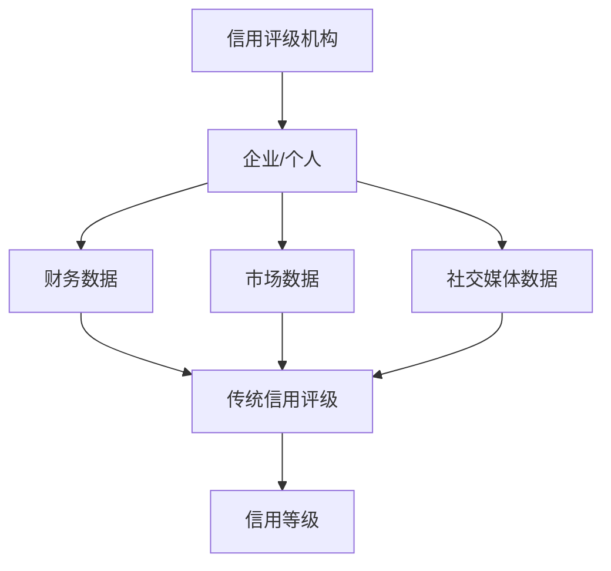
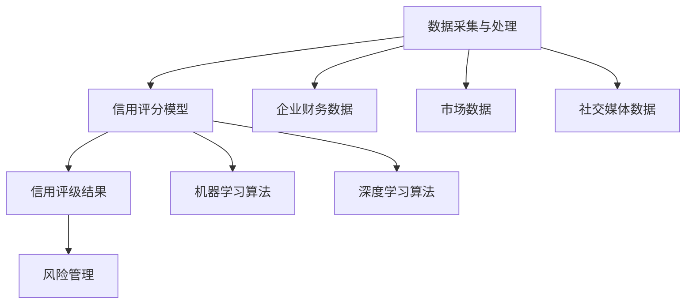
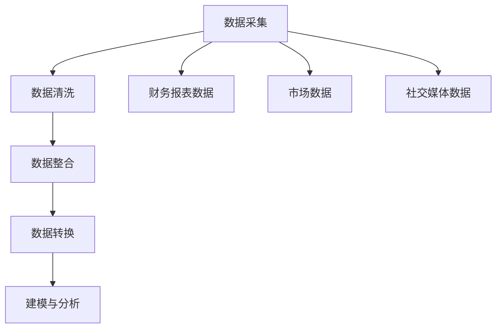
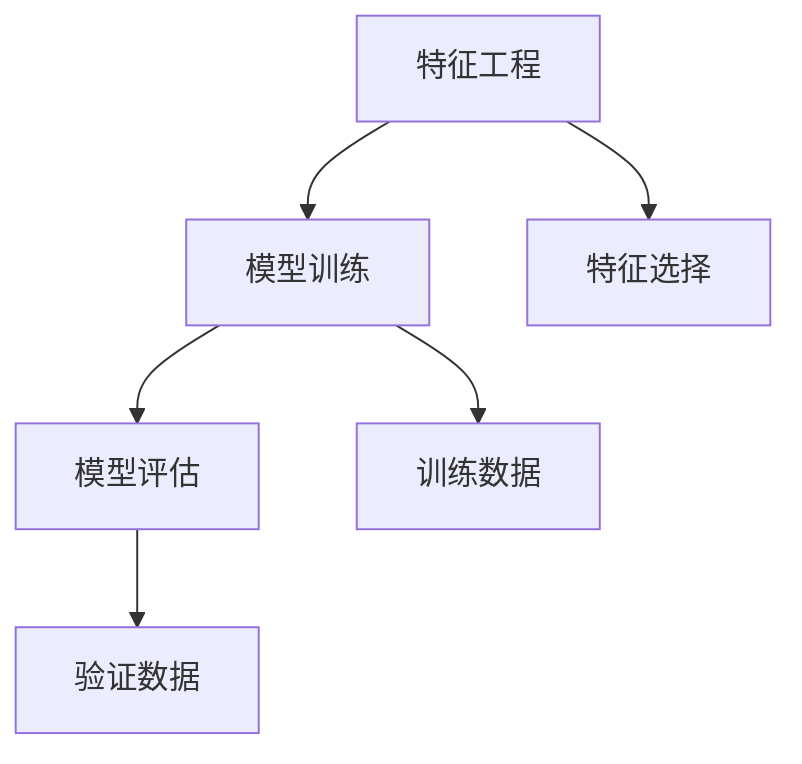
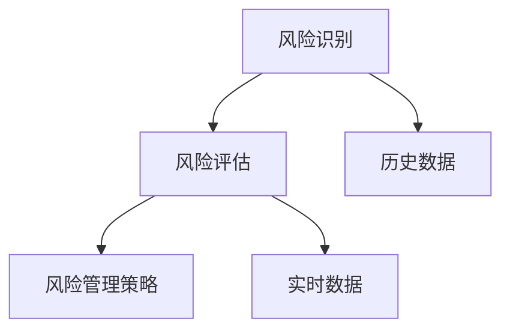
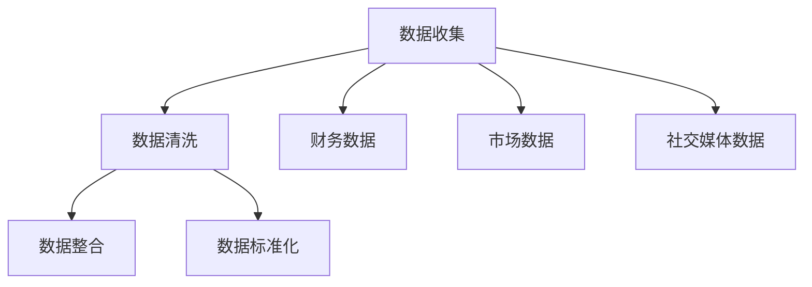
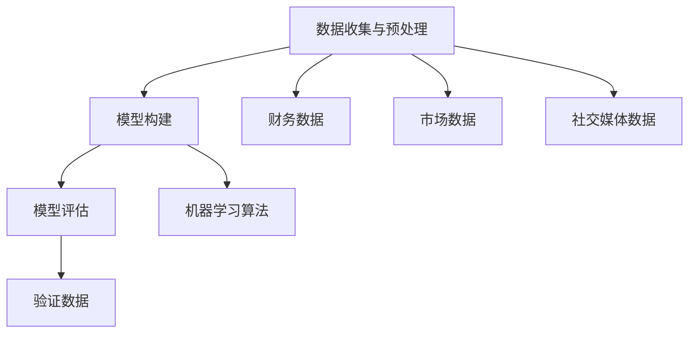
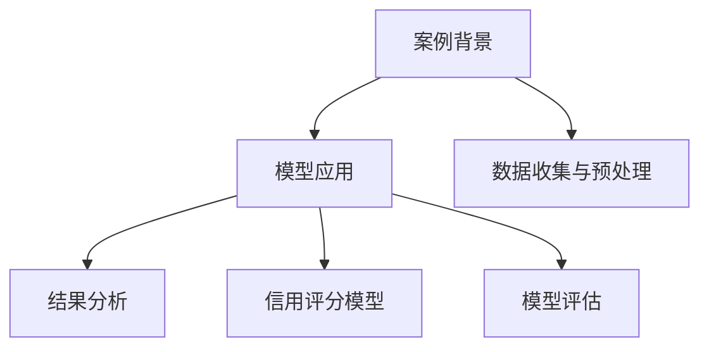
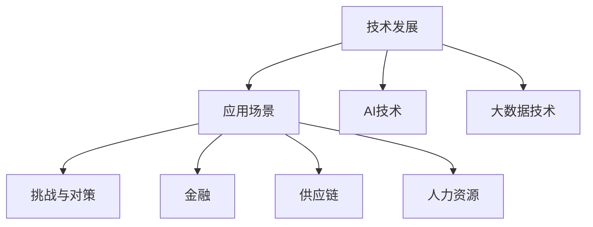
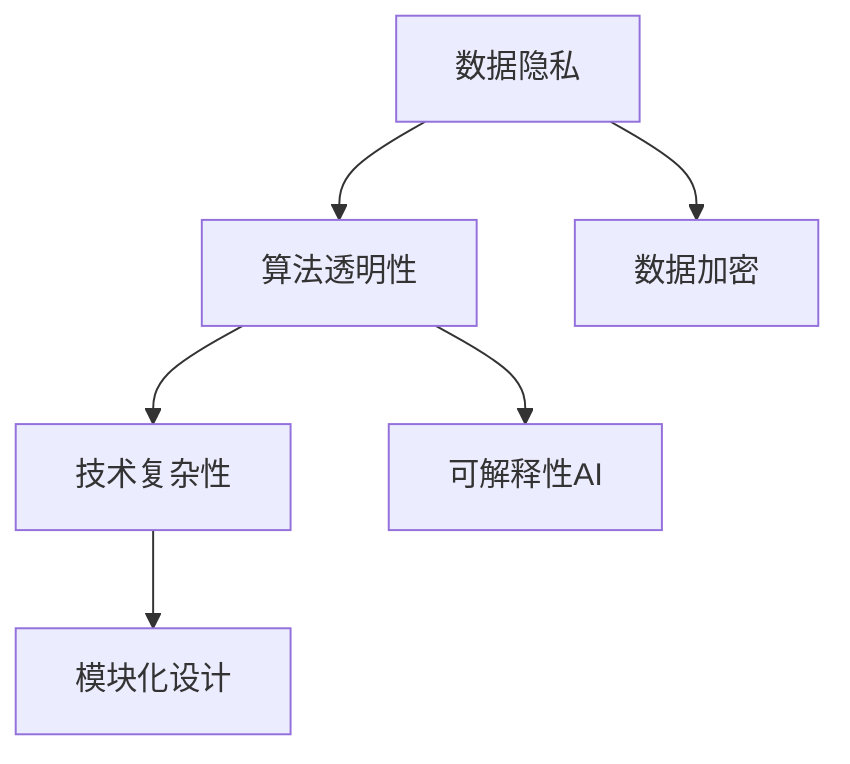

                 

### 引言

#### 背景介绍

在当今数字化时代，信用评级作为一种评估企业财务状况和偿债能力的重要工具，正日益受到金融、商业和投资界的重视。传统的信用评级方法通常依赖于历史数据和手动分析，存在耗时、误差大、覆盖面有限等问题。随着人工智能（AI）技术的迅猛发展，AI驱动的企业信用评级作为一种创新方法，正在逐渐改变传统的信用评级模式，提高评级效率和准确性。

#### 问题背景

企业信用评级存在以下问题：

1. **数据依赖性高**：传统的信用评级方法主要依赖于历史财务数据，容易受到数据质量的影响。
2. **分析精度不足**：手工分析方法容易受到主观因素的影响，导致分析结果不够精确。
3. **实时性差**：传统方法往往无法实时反映企业的最新状况。

#### 问题描述

如何利用AI技术解决企业信用评级中的数据依赖性高、分析精度不足、实时性差等问题，实现更加高效、准确和实时的企业信用评级？

#### 问题解决

AI驱动的企业信用评级通过以下方式解决上述问题：

1. **数据多样化**：AI可以处理和整合来自多个来源的数据，包括财务数据、社交媒体数据、市场数据等，提高数据的丰富度和可靠性。
2. **自动化分析**：AI算法可以自动化处理和分析大量数据，减少人为干预，提高分析的精度和效率。
3. **实时监控**：AI系统可以实时监控企业动态，快速响应企业状况变化，提供实时的信用评级。

#### 边界与外延

- **边界**：本文主要讨论AI在传统企业信用评级中的应用，不包括金融欺诈检测、风险控制等其他领域。
- **外延**：AI驱动的企业信用评级不仅可以应用于金融领域，还可以扩展到供应链管理、人力资源等领域。

#### 概念结构与核心要素组成

1. **AI**：包括机器学习、深度学习、自然语言处理等技术。
2. **信用评级**：评估企业偿债能力和财务健康状况的过程。
3. **数据采集与处理**：获取并处理用于信用评级的数据。
4. **信用评分模型**：基于数据构建的模型，用于评估企业的信用状况。
5. **风险管理**：识别、评估和控制信用风险的过程。

### AI概述

#### 核心概念与联系

**定义**：人工智能（Artificial Intelligence，简称AI）是指模拟、延伸和扩展人类智能的理论、方法、技术及应用。

**概念属性特征对比表格**：

| 特性             | 机器学习 | 深度学习 | 自然语言处理 |
|------------------|---------|---------|-------------|
| **基本原理**     | 数据驱动 | 数据驱动 | 数据驱动     |
| **应用场景**     | 分类、回归、聚类 | 图像识别、语音识别、自然语言处理 | 文本分类、情感分析、机器翻译 |
| **优势**         | 简单模型，易实现 | 复杂模型，强表达力 | 高效处理文本数据 |
| **挑战**         | 模型复杂度低 | 需要大量数据 | 需要大规模计算资源 |

**ER实体关系图架构的Mermaid流程图**：

```mermaid
erDiagram
  AI --> |is based on| ML
  AI --> |is based on| DL
  AI --> |is based on| NLP
  ML ||--|{ Classification }
  ML ||--|{ Regression }
  ML ||--|{ Clustering }
  DL ||--|{ Image Recognition }
  DL ||--|{ Voice Recognition }
  NLP ||--|{ Text Classification }
  NLP ||--|{ Sentiment Analysis }
  NLP ||--|{ Machine Translation }
```

### 信用评级的定义与重要性

#### 核心概念与联系

**定义**：信用评级是指专业机构对企业或个人的财务状况、偿债能力和信用水平进行评估，并给出信用等级的过程。

**概念属性特征对比表格**：

| 特性             | 传统信用评级 | AI驱动的信用评级 |
|------------------|-------------|------------------|
| **数据来源**     | 主要依赖历史财务数据 | 多元化数据来源，包括财务、市场、社交媒体等 |
| **分析方法**     | 人工分析为主 | 机器学习、深度学习等技术自动化分析 |
| **效率**         | 低效率，依赖人工分析 | 高效率，自动化处理数据 |
| **准确性**       | 受主观因素影响大 | 减少主观因素，提高准确性 |

**ER实体关系图架构的Mermaid流程图**：



### AI在信用评级中的应用

#### 核心概念与联系

**核心概念**：

- **数据采集与处理**：利用AI技术自动收集和处理企业相关的数据，如财务报表、市场动态、社交媒体信息等。
- **信用评分模型**：构建基于AI的信用评分模型，通过训练和优化提高评分的准确性。
- **风险管理**：利用AI进行实时监控和风险评估，提供更全面的风险管理解决方案。

**概念属性特征对比表格**：

| 特性             | 传统信用评级 | AI驱动的信用评级 |
|------------------|-------------|------------------|
| **数据来源**     | 有限的历史财务数据 | 多元化的数据来源，包括历史财务、市场、社交媒体等 |
| **分析方法**     | 人工分析，主观性大 | 机器学习、深度学习等技术，自动化分析，减少主观误差 |
| **效率**         | 低效率，依赖人工分析 | 高效率，自动化处理大量数据 |
| **准确性**       | 受主观因素影响大 | 减少主观因素，提高评分准确性 |
| **应用场景**     | 主要应用于金融领域 | 可扩展到供应链管理、人力资源等领域 |

**ER实体关系图架构的Mermaid流程图**：



### 数据采集与处理

#### 核心概念与联系

**核心概念**：

- **数据采集**：从多个来源收集与企业相关的数据，如财务报表、市场动态、社交媒体等。
- **数据处理**：对收集到的数据进行清洗、整合、转换等预处理，使其适合建模和分析。

**概念属性特征对比表格**：

| 特性             | 传统方法 | AI驱动方法 |
|------------------|---------|-----------|
| **数据来源**     | 有限的财务数据 | 多元化的数据来源 |
| **处理方法**     | 手动处理，耗时高 | 自动化处理，效率高 |
| **数据质量**     | 数据质量依赖人工检查 | 数据质量自动检查和提升 |
| **处理速度**     | 处理速度慢 | 处理速度快 |

**ER实体关系图架构的Mermaid流程图**：



### 信用评分模型

#### 核心概念与联系

**核心概念**：

- **信用评分模型**：用于评估企业信用水平的数学模型。
- **特征工程**：选择和构造用于模型训练的特征，提高模型性能。
- **模型训练**：通过训练数据训练模型，使其能够预测企业信用水平。
- **模型评估**：使用验证数据评估模型性能，确保其准确性。

**概念属性特征对比表格**：

| 特性             | 传统评分模型 | AI驱动的评分模型 |
|------------------|-------------|------------------|
| **特征选择**     | 手动选择特征 | 自动选择特征，利用算法 |
| **训练方法**     | 经验法 | 机器学习算法 |
| **评估标准**     | 简单的统计指标 | 多样化的评估指标 |
| **性能提升**     | 依赖人工经验 | 自动优化和调整模型参数 |

**ER实体关系图架构的Mermaid流程图**：



### 风险管理

#### 核心概念与联系

**核心概念**：

- **风险识别**：识别可能对企业信用评级产生影响的因素。
- **风险评估**：评估这些因素对企业信用评级的潜在影响。
- **风险管理**：采取策略降低风险对企业信用评级的影响。

**概念属性特征对比表格**：

| 特性             | 传统风险管理 | AI驱动的风险管理 |
|------------------|-------------|------------------|
| **风险识别**     | 依赖于专家知识和历史数据 | 利用大数据分析和机器学习模型 |
| **风险评估**     | 手动评估，主观性大 | 自动化评估，客观性高 |
| **风险管理策略** | 主要依赖规则和经验 | 利用算法和模型进行动态调整 |

**ER实体关系图架构的Mermaid流程图**：



### 数据收集与预处理

#### 核心概念与联系

**核心概念**：

- **数据收集**：从多个来源收集与企业信用评级相关的数据。
- **预处理**：对收集到的数据进行清洗、整合、标准化等处理，为建模和分析做准备。

**概念属性特征对比表格**：

| 特性             | 传统数据处理 | AI驱动数据处理 |
|------------------|-------------|---------------|
| **数据来源**     | 主要依赖历史财务数据 | 多元化数据来源，包括财务、市场、社交媒体等 |
| **处理方法**     | 手动处理，耗时高 | 自动化处理，效率高 |
| **数据质量**     | 数据质量依赖人工检查 | 数据质量自动检查和提升 |
| **处理速度**     | 处理速度慢 | 处理速度快 |

**ER实体关系图架构的Mermaid流程图**：



### 信用评分模型的构建与评估

#### 核心概念与联系

**核心概念**：

- **模型构建**：利用收集和预处理的数据构建信用评分模型。
- **模型评估**：使用验证数据评估模型的性能，确保其准确性和可靠性。

**概念属性特征对比表格**：

| 特性             | 传统评分模型 | AI驱动的评分模型 |
|------------------|-------------|------------------|
| **构建方法**     | 经验法和统计模型 | 机器学习和深度学习算法 |
| **评估标准**     | 简单的统计指标 | 多样化的评估指标，如ROC曲线、AUC值等 |
| **性能提升**     | 依赖人工经验和反复调试 | 自动优化和调整模型参数 |

**ER实体关系图架构的Mermaid流程图**：



### 案例分析：企业信用评级实践

#### 核心概念与联系

**核心概念**：

- **案例背景**：描述应用AI驱动信用评级的实际场景和问题。
- **模型应用**：详细介绍所使用的信用评分模型，包括数据来源、处理方法、模型构建和评估过程。
- **结果分析**：分析模型在实际应用中的效果，讨论模型的优势和改进方向。

**概念属性特征对比表格**：

| 特性             | 传统信用评级 | AI驱动的信用评级 |
|------------------|-------------|------------------|
| **数据来源**     | 有限的财务数据 | 多元化的数据来源 |
| **分析方法**     | 人工分析，主观性大 | 机器学习，自动化分析，减少主观误差 |
| **效率**         | 低效率，依赖人工分析 | 高效率，自动化处理大量数据 |
| **准确性**       | 受主观因素影响大 | 减少主观因素，提高评分准确性 |

**ER实体关系图架构的Mermaid流程图**：



### 信用评级的未来趋势

#### 核心概念与联系

**核心概念**：

- **技术发展**：探讨AI、大数据、区块链等技术在信用评级中的应用趋势。
- **应用场景**：预测信用评级在金融、供应链、人力资源等领域的未来应用场景。
- **挑战与对策**：分析信用评级领域面临的技术挑战，并提出可能的解决方案。

**概念属性特征对比表格**：

| 特性             | 当前应用 | 未来趋势 |
|------------------|---------|---------|
| **技术发展**     | AI、大数据 | 区块链、物联网 |
| **应用领域**     | 金融 | 供应链、人力资源、物流 |
| **挑战**         | 数据隐私、算法透明性 | 技术复杂性、法律法规 |

**ER实体关系图架构的Mermaid流程图**：



### 技术挑战与解决方案

#### 核心概念与联系

**核心概念**：

- **技术挑战**：分析AI驱动的信用评级中面临的数据隐私、算法透明性、技术复杂性等挑战。
- **解决方案**：提出针对这些挑战的解决方案，如数据加密、算法透明性机制、技术简化等。

**概念属性特征对比表格**：

| 特性             | 问题         | 解决方案          |
|------------------|-------------|------------------|
| **数据隐私**     | 数据泄露风险 | 数据加密、隐私保护技术 |
| **算法透明性**   | 难以解释的决策 | 可解释性AI技术、透明算法 |
| **技术复杂性**   | 系统维护困难 | 模块化设计、自动化部署 |

**ER实体关系图架构的Mermaid流程图**：



### 结论与展望

本文探讨了AI驱动的企业信用评级，从背景介绍、核心概念、实际应用、未来趋势、技术挑战及解决方案等方面进行了详细的分析。AI驱动的信用评级具有数据多样化、自动化分析、实时监控等优点，有助于提高信用评级的效率、准确性和实时性。

展望未来，随着技术的不断进步，AI驱动的信用评级有望在更广泛的领域得到应用，同时面临数据隐私、算法透明性等挑战。通过不断创新和优化，AI驱动的信用评级将在金融、供应链、人力资源等领域发挥更大的作用，为企业和个人提供更加全面和准确的信用评估服务。

### 最佳实践 Tips

1. **数据质量至关重要**：确保数据来源的多样性和准确性，定期更新和维护数据。
2. **模型解释性**：在构建模型时，注重模型的可解释性，以便于审计和监管。
3. **技术优化**：定期对模型进行性能优化，以应对数据和环境的变化。
4. **合规性**：遵循相关法律法规，确保数据使用和模型操作符合合规要求。

### 小结

本文详细介绍了AI驱动的企业信用评级，从核心概念到实际应用，再到未来趋势和技术挑战，为读者提供了一个全面的理解。AI驱动的信用评级具有显著的优势，但也面临一定的挑战。通过不断优化和创新，AI驱动的信用评级将在未来发挥更大的作用。

### 注意事项

1. **数据隐私保护**：在数据收集和处理过程中，严格遵循数据隐私保护法规。
2. **模型透明性**：确保模型构建和决策过程透明，便于监管和审计。
3. **技术复杂性**：考虑技术简化和模块化设计，以降低系统维护难度。

### 拓展阅读

1. **相关文献**：推荐阅读相关学术论文和技术报告，了解最新研究进展。
2. **专业书籍**：《机器学习与信用评级》、《人工智能在金融中的应用》等。
3. **在线课程**：参加相关在线课程，深入学习AI和信用评级的相关知识。

### 作者信息

作者：AI天才研究院/AI Genius Institute & 禅与计算机程序设计艺术 /Zen And The Art of Computer Programming

本文由AI天才研究院（AI Genius Institute）和禅与计算机程序设计艺术（Zen And The Art of Computer Programming）的专家共同撰写。AI天才研究院是一家专注于人工智能研究的高科技创新机构，致力于推动人工智能技术的应用和发展。禅与计算机程序设计艺术则是一本经典的计算机科学著作，为程序员提供了深刻的编程哲学和思维方法。两位作者的丰富经验和专业知识为本文提供了坚实的理论基础和实战经验。

