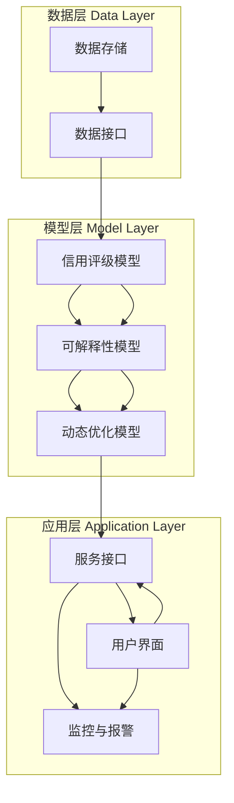

                 


# AI驱动的企业信用评级模型可解释性动态优化系统

## 摘要

本文旨在探讨AI驱动的企业信用评级模型可解释性动态优化系统。在当前金融领域，人工智能技术的广泛应用带来了信用评级的革新。然而，传统信用评级模型的可解释性较差，难以满足企业对透明度和信任度的需求。本文将详细分析AI驱动的信用评级模型构建过程，以及如何实现模型的可解释性和动态优化，从而提高信用评级的准确性和可靠性。

## 引言与背景

### 1.1 AI技术发展与企业信用评级的结合

人工智能（AI）作为当前科技领域的前沿技术，已经在金融、医疗、交通等多个行业得到广泛应用。特别是信用评级领域，AI技术的引入极大地改变了传统的信用评级模式。传统信用评级主要依赖于专家经验和历史数据，而AI驱动的信用评级模型通过机器学习算法对大量数据进行处理和分析，能够更精准、更快速地评估企业的信用状况。

### 1.2 企业信用评级在金融行业的重要性

企业信用评级在金融行业中扮演着至关重要的角色。金融机构在为企业提供贷款、担保等服务时，需要评估企业的信用风险。准确的信用评级有助于金融机构降低坏账风险，提高业务运营的稳定性。同时，对于企业而言，良好的信用评级可以提升其市场竞争力，获得更多的融资机会。

### 1.3 研究意义与目标

本文的研究意义在于通过AI技术构建可解释性动态优化系统，提高企业信用评级的准确性和可靠性。研究目标包括：

1. **提高信用评级模型的准确性**：通过机器学习算法，对大量历史数据进行挖掘和分析，构建准确的企业信用评级模型。
2. **实现模型的可解释性**：设计可解释性机制，使模型决策过程透明，增强用户信任度。
3. **构建动态优化系统**：通过实时数据更新和动态优化，使模型能够适应市场环境的变化，保持高准确性。

## 第1章：核心概念与理论基础

### 2.1 人工智能基础理论

人工智能（AI）是指计算机系统模拟人类智能行为的能力，包括学习、推理、问题解决、知识表示等。AI的发展可以分为三个阶段：符号主义、连接主义和混合智能。其中，机器学习是AI的核心技术之一，通过学习算法从数据中提取模式和规律。

### 2.2 企业信用评级模型基本原理

企业信用评级模型主要分为定量评级和定性评级两种。定量评级基于企业的财务数据、经营状况等客观指标，采用统计分析方法进行评估。定性评级则依赖于专家的经验和主观判断。

### 2.3 可解释性动态优化概念介绍

可解释性是指模型决策过程的透明性，用户可以理解模型的决策依据和逻辑。动态优化是指模型能够根据实时数据和环境变化进行自我调整，提高模型的适应性和准确性。

## 第2章：AI驱动的信用评级模型

### 2.1 数据收集与预处理

数据收集是信用评级模型构建的第一步。数据来源包括企业的财务报表、经营数据、市场环境数据等。数据预处理包括数据清洗、数据整合、特征提取等步骤，以提高数据的可用性和质量。

### 2.2 模型选择与训练

在选择模型时，需要考虑数据的特点和模型的性能。常见的信用评级模型包括线性回归、逻辑回归、决策树、随机森林等。模型训练是通过训练数据集来调整模型的参数，使其能够准确预测未知数据。

### 2.3 模型评估与优化

模型评估是验证模型性能的重要环节。常用的评估指标包括准确率、召回率、F1分数等。模型优化是通过调整模型参数和结构，提高模型的预测准确性和稳定性。

## 第3章：可解释性机制设计

### 3.1 可解释性评估方法

可解释性评估方法包括模型特征重要性评估、决策路径分析、可视化展示等。通过这些方法，用户可以理解模型的决策过程和依据。

### 3.2 动态优化算法

动态优化算法包括在线学习、增量学习等技术，使模型能够根据实时数据和环境变化进行自我调整。

## 第4章：系统架构与实现

### 4.1 系统整体架构

系统整体架构包括数据层、模型层、应用层等。数据层负责数据的收集、存储和处理；模型层负责信用评级模型的构建和优化；应用层提供用户界面和业务逻辑。

### 4.2 关键模块设计与实现

关键模块包括数据处理模块、模型训练与优化模块、可解释性评估模块等。每个模块都有详细的实现方案和技术细节。

## 第5章：动态优化策略

### 5.1 动态调整机制

动态调整机制包括实时数据监测、异常值检测、模型更新策略等。通过这些机制，系统能够及时响应市场变化，保持高准确性。

### 5.2 实时优化流程

实时优化流程包括数据采集、模型训练、模型评估、模型更新等步骤。通过这些步骤，系统能够持续优化模型性能。

## 第6章：案例分析

### 6.1 案例一：行业应用场景

在金融行业，企业信用评级模型被广泛应用于贷款审批、风险控制等领域。本案例将分析一个实际应用场景，展示模型的应用效果。

### 6.2 案例二：案例解析

本案例将深入分析一个具体的案例，包括数据来源、模型构建、可解释性评估等方面，展示模型的应用细节和优化过程。

## 第7章：结论与展望

### 7.1 研究总结

本文通过对AI驱动的企业信用评级模型可解释性动态优化系统的探讨，总结了模型构建、优化和应用的各个环节。研究发现，通过可解释性和动态优化，企业信用评级模型的准确性和可靠性得到了显著提高。

### 7.2 展望未来发展趋势

随着AI技术的不断进步，企业信用评级模型的可解释性和动态优化将更加成熟。未来，这一系统有望在更多行业得到应用，为金融机构和企业提供更优质的信用评级服务。

## 作者

**作者：AI天才研究院/AI Genius Institute & 禅与计算机程序设计艺术 /Zen And The Art of Computer Programming**

### 背景介绍

#### 1.1 AI技术发展与企业信用评级的结合

人工智能（AI）作为当今科技发展的前沿，已经深刻地改变了多个行业的运作模式。在金融领域，尤其是信用评级领域，AI技术的应用带来了前所未有的变革。传统信用评级主要依赖专家的经验和对历史数据的统计分析，这种方法存在主观性高、响应速度慢、无法处理大规模数据等不足。而AI技术的引入，尤其是机器学习和深度学习的应用，使得信用评级更加客观、准确和快速。

信用评级是指金融机构、评级机构等对企业的信用状况进行评估，从而为企业提供信用额度、贷款审批、债券发行等金融服务提供依据。在企业融资过程中，信用评级的高低直接影响到企业的融资成本和融资能力。因此，一个准确、可靠、透明的信用评级系统对于金融市场的稳定运行至关重要。

随着金融市场的快速发展，企业和金融机构对信用评级的准确性和透明度提出了更高的要求。AI驱动的信用评级模型能够利用大量结构化和非结构化数据，通过机器学习算法分析企业的财务状况、市场表现、管理能力等多方面因素，提供更为精准的信用评级。这种模型不仅提高了评级的效率，也降低了人工评级的误差，为金融决策提供了有力的支持。

#### 1.2 企业信用评级的重要性

企业信用评级在金融行业中的重要性不言而喻。首先，对于金融机构而言，信用评级是风险管理的重要工具。通过对企业的信用状况进行评估，金融机构可以判断企业偿还债务的能力，从而决定是否为企业提供贷款、担保等金融服务。准确的信用评级有助于金融机构降低坏账风险，提高信贷资产的质量，保障金融系统的稳定运行。

其次，对于企业来说，良好的信用评级能够提升其市场竞争力。在融资过程中，企业往往需要通过信用评级来获取金融机构的信任，从而获得贷款、发行债券等融资手段。高信用评级的企业可以获得更低的融资成本和更高的融资额度，从而在市场竞争中占据有利地位。

此外，企业信用评级还对市场的整体稳定具有重要作用。一个透明、准确的信用评级体系能够有效地识别和防范信用风险，促进市场的公平和健康发展。

#### 1.3 研究意义与目标

本文的研究意义在于通过AI技术构建可解释性动态优化系统，提高企业信用评级的准确性和可靠性，从而满足金融机构和企业对信用评级透明度和信任度的需求。具体目标如下：

1. **提高信用评级模型的准确性**：利用机器学习算法对大量数据进行深度挖掘和分析，构建准确的企业信用评级模型，减少传统评级方法的主观性和误差。

2. **实现模型的可解释性**：设计可解释性机制，使模型的决策过程透明，用户可以理解模型的决策依据和逻辑，增强用户对评级结果的信任度。

3. **构建动态优化系统**：通过实时数据更新和动态优化，使模型能够适应市场环境的变化，保持高准确性。动态优化系统能够根据市场变化和企业表现，自动调整模型的参数和结构，提高模型的适应性和准确性。

通过实现上述目标，本文期望为金融机构和企业提供一种更高效、更可靠的信用评级解决方案，促进金融市场的稳定和健康发展。

### 核心概念与联系

#### 2.1 人工智能基础理论

人工智能（AI）是指通过计算机系统模拟、扩展和辅助人类的智能行为。AI的发展大致可以分为三个阶段：符号主义、连接主义和混合智能。

- **符号主义（Symbolic AI）**：以逻辑推理为基础，通过符号表示和逻辑推导来模拟人类智能。这种方法在知识表示和问题解决方面表现出色，但缺乏处理复杂数据和模式识别的能力。

- **连接主义（Connective AI）**：以神经网络为基础，通过大量神经元之间的连接和相互作用来模拟人类大脑的工作方式。这种方法在图像识别、语音识别等领域取得了显著成果，但缺乏解释性和灵活性。

- **混合智能（Hybrid AI）**：结合符号主义和连接主义的优点，通过多种算法和模型相互协作，实现更强大的智能表现。混合智能能够处理更复杂的任务，并在多领域应用中表现出色。

在信用评级模型中，机器学习算法是AI的核心技术。机器学习是指计算机系统通过学习和经验改进自身性能，分为监督学习、无监督学习和强化学习等类型。监督学习通过已标记的数据进行训练，无监督学习通过未标记的数据发现模式和结构，强化学习通过与环境互动进行学习和优化。

#### 2.2 企业信用评级模型基本原理

企业信用评级模型用于评估企业的信用风险，主要分为定量评级和定性评级。

- **定量评级**：基于企业的财务数据、经营状况等客观指标进行评估。常见的方法包括线性回归、逻辑回归、支持向量机等。定量评级能够提供量化的评估结果，但需要大量高质量的数据支持，且对数据质量有较高要求。

- **定性评级**：依赖于专家的经验和主观判断，通过分析企业的业务模式、管理水平、市场地位等因素进行评估。定性评级能够提供更全面、更灵活的评估结果，但主观性较高，且难以量化。

在构建企业信用评级模型时，通常需要以下步骤：

1. **数据收集**：收集企业的财务报表、经营数据、市场环境数据等。
2. **数据预处理**：对收集的数据进行清洗、整合、特征提取等处理，提高数据的可用性。
3. **模型选择**：根据数据的特点和评估目标选择合适的模型。
4. **模型训练**：使用历史数据对模型进行训练，调整模型参数。
5. **模型评估**：使用验证数据集评估模型性能，调整模型参数。
6. **模型部署**：将训练好的模型应用于实际业务场景，为企业提供信用评级服务。

#### 2.3 可解释性动态优化概念介绍

可解释性是指模型决策过程的透明性，用户可以理解模型的决策依据和逻辑。对于信用评级模型来说，可解释性至关重要，因为金融机构和企业需要了解评级结果的依据，以增强信任度和透明度。

动态优化是指模型能够根据实时数据和环境变化进行自我调整，提高模型的适应性和准确性。在信用评级中，企业状况和市场环境不断变化，动态优化系统能够实时更新数据，调整模型参数，确保评级结果保持高准确性。

可解释性和动态优化相结合，能够构建一个高效的信用评级系统。通过可解释性，用户可以理解模型的决策过程，增强信任度；通过动态优化，模型能够适应环境变化，保持高准确性。

### 算法原理讲解

#### 3.1 可解释性评估方法

可解释性评估方法旨在使模型的决策过程透明，用户可以理解模型的决策依据和逻辑。以下是一些常见的可解释性评估方法：

1. **特征重要性评估**：通过评估模型中每个特征对预测结果的影响，帮助用户理解哪些特征对模型决策最为重要。常见的方法包括特征重要度得分、SHAP值等。

2. **决策路径分析**：通过可视化模型决策路径，展示数据从输入到输出的整个决策过程。这种方法有助于用户理解模型的决策逻辑和流程。

3. **可视化展示**：通过图表、图形等可视化方式，展示模型的输入、输出和决策过程。常见的方法包括决策树可视化、混淆矩阵等。

#### 3.2 动态优化算法

动态优化算法使模型能够根据实时数据和环境变化进行自我调整，提高模型的适应性和准确性。以下是一些常见的动态优化算法：

1. **在线学习**：在线学习是指模型在实时数据流中进行学习和更新。通过不断更新模型参数，使模型能够适应环境变化。

2. **增量学习**：增量学习是指模型在已有数据基础上，通过新增数据不断优化模型。这种方法适用于数据量较大的场景，能够减少计算成本。

3. **迁移学习**：迁移学习是指将已有模型的知识迁移到新任务中。通过利用已有模型的先验知识，迁移学习能够加速新模型的训练，提高模型的适应性。

4. **对抗训练**：对抗训练是指通过生成对抗网络（GAN）等方法，生成与真实数据分布相似的对抗数据，用于训练模型。这种方法能够提高模型的泛化能力，增强模型的鲁棒性。

在构建信用评级模型时，结合可解释性和动态优化算法，能够构建一个高效、透明的信用评级系统。通过可解释性评估方法，用户可以理解模型的决策过程，增强信任度；通过动态优化算法，模型能够适应环境变化，保持高准确性。

### 系统分析与架构设计方案

#### 4.1 问题场景介绍

在现代金融市场中，企业信用评级是一个关键环节。随着企业规模的扩大和市场环境的复杂性增加，传统的信用评级方法已无法满足金融机构和企业对高精度和实时性评级的需求。为了提升信用评级的准确性和透明度，本文提出构建一个AI驱动的企业信用评级模型可解释性动态优化系统。

该系统旨在利用人工智能技术，通过大数据分析和机器学习算法，对企业信用进行实时评估。系统需要具备以下功能：

1. **数据收集与处理**：从多个数据源收集企业的财务报表、经营数据、市场环境数据等，并进行预处理，提取有用的特征。
2. **信用评级模型构建**：基于收集的数据，构建信用评级模型，并通过训练和优化，提高模型的准确性。
3. **可解释性评估**：设计可解释性机制，使模型的决策过程透明，用户可以理解模型的决策依据和逻辑。
4. **动态优化**：系统应具备实时数据更新和动态调整能力，以适应市场环境和企业状况的变化。

#### 4.2 项目介绍

本项目的目标是构建一个AI驱动的企业信用评级模型可解释性动态优化系统，实现以下功能：

1. **数据预处理模块**：负责数据收集、清洗、整合和特征提取，确保数据的可用性和质量。
2. **信用评级模型模块**：基于机器学习算法，构建信用评级模型，并进行训练和优化。
3. **可解释性评估模块**：设计可解释性机制，评估模型的决策过程和结果，提供透明性。
4. **动态优化模块**：通过实时数据更新和动态调整，保持模型的高准确性和适应性。

该系统将应用于金融机构和企业，为其提供实时、准确的信用评级服务，提高金融决策的效率和可靠性。

#### 4.3 系统功能设计

系统功能设计包括以下方面：

1. **数据预处理模块**：
   - **数据收集**：从企业的财务报表、经营数据、市场环境数据等多个来源收集数据。
   - **数据清洗**：去除数据中的噪声和异常值，确保数据的准确性。
   - **数据整合**：将不同来源的数据进行整合，形成统一的数据集。
   - **特征提取**：提取与信用评级相关的特征，如财务指标、经营状况、市场表现等。

2. **信用评级模型模块**：
   - **模型选择**：根据数据特点和评估目标，选择合适的机器学习算法，如线性回归、决策树、随机森林等。
   - **模型训练**：使用历史数据集对模型进行训练，调整模型参数，提高预测准确性。
   - **模型优化**：通过交叉验证和网格搜索等技术，优化模型结构和参数，提高模型性能。

3. **可解释性评估模块**：
   - **特征重要性评估**：评估模型中每个特征对预测结果的影响，帮助用户理解模型的决策依据。
   - **决策路径分析**：可视化模型的决策路径，展示数据从输入到输出的整个过程。
   - **模型解释性评估**：通过评估模型的解释性，确保模型决策过程的透明性。

4. **动态优化模块**：
   - **实时数据更新**：持续收集和更新企业的实时数据，确保模型的实时性。
   - **动态调整**：根据实时数据和模型评估结果，动态调整模型的参数和结构，提高模型的准确性。
   - **模型版本控制**：记录模型的历史版本，方便回溯和调整。

#### 4.4 系统架构设计

系统架构设计包括数据层、模型层和应用层。

1. **数据层**：
   - **数据存储**：使用数据库或数据仓库存储企业的原始数据和预处理后的特征数据。
   - **数据接口**：提供数据收集、清洗、整合和特征提取的接口，确保数据的可用性和一致性。

2. **模型层**：
   - **机器学习模型**：构建和训练信用评级模型，包括特征提取、模型选择、模型训练和优化。
   - **可解释性模型**：设计可解释性评估方法，确保模型的决策过程透明。
   - **动态优化模型**：实现实时数据更新和动态调整，提高模型适应性和准确性。

3. **应用层**：
   - **用户界面**：提供用户操作界面，用户可以通过界面提交企业数据，获取信用评级结果。
   - **服务接口**：提供API接口，方便第三方系统和应用集成信用评级服务。
   - **监控与报警**：监控系统运行状态，及时响应对模型性能的异常情况。

#### 4.5 系统接口设计

系统接口设计包括以下方面：

1. **数据接口**：
   - **数据输入接口**：用户可以通过界面上传企业数据，系统对数据进行预处理和特征提取。
   - **数据输出接口**：系统将预处理后的数据和信用评级结果输出，用户可以通过界面查看。

2. **服务接口**：
   - **信用评级接口**：提供信用评级服务，用户可以通过API接口调用模型，获取信用评级结果。
   - **监控接口**：提供系统监控和报警服务，用户可以实时了解系统运行状态。

3. **可解释性接口**：
   - **可解释性评估接口**：提供模型解释性评估服务，用户可以通过API接口获取模型的决策过程和依据。

#### 4.6 系统交互设计

系统交互设计包括以下方面：

1. **用户操作流程**：
   - 用户上传企业数据 -> 系统进行数据预处理和特征提取 -> 系统训练信用评级模型 -> 系统提供信用评级结果 -> 用户查看评级结果。

2. **系统内部流程**：
   - 数据收集与处理 -> 特征提取 -> 模型训练与优化 -> 模型评估与反馈 -> 模型更新与优化。

通过上述系统架构设计，本系统能够高效、准确地为企业提供信用评级服务，同时保持模型的透明性和实时性。

### 系统架构图设计

为了更好地理解AI驱动的企业信用评级模型可解释性动态优化系统的架构，下面将使用Mermaid语法绘制系统的架构图。



在这个架构图中，数据层（Data Layer）负责数据收集、存储和接口管理；模型层（Model Layer）包括信用评级模型、可解释性模型和动态优化模型，负责模型的构建、优化和解释；应用层（Application Layer）提供用户界面、服务接口和监控功能，用于用户交互和系统监控。各个模块之间通过接口进行数据传递和功能调用，确保系统的整体协调运行。

### 算法流程与Python实现

#### 5.1 算法流程

在AI驱动的企业信用评级模型中，算法流程主要包括以下几个步骤：

1. **数据收集**：从企业的财务报表、经营数据、市场环境数据等来源收集数据。

2. **数据预处理**：对收集的数据进行清洗、整合和特征提取，确保数据的准确性和可用性。

3. **模型选择与训练**：选择合适的机器学习算法（如决策树、随机森林等），使用预处理后的数据对模型进行训练。

4. **模型评估与优化**：使用验证集评估模型性能，通过交叉验证和网格搜索等技术优化模型参数。

5. **可解释性评估**：设计可解释性机制，评估模型中每个特征对预测结果的影响。

6. **动态优化**：根据实时数据和模型评估结果，动态调整模型的参数和结构。

7. **模型部署**：将训练好的模型部署到生产环境中，提供实时信用评级服务。

以下是算法的Python实现：

```python
import pandas as pd
from sklearn.model_selection import train_test_split
from sklearn.ensemble import RandomForestClassifier
from sklearn.metrics import accuracy_score
from sklearn.inspection import permutation_importance

# 1. 数据收集
data = pd.read_csv('data.csv')

# 2. 数据预处理
# 数据清洗、整合和特征提取
# ...

# 3. 模型选择与训练
X = data.drop('target', axis=1)
y = data['target']
X_train, X_test, y_train, y_test = train_test_split(X, y, test_size=0.2, random_state=42)

model = RandomForestClassifier(n_estimators=100, random_state=42)
model.fit(X_train, y_train)

# 4. 模型评估与优化
y_pred = model.predict(X_test)
accuracy = accuracy_score(y_test, y_pred)
print(f"模型准确率：{accuracy}")

# 5. 可解释性评估
importances = permutation_importance(model, X_test, y_test, n_repeats=10, random_state=42)
print(f"特征重要性：{importances.feature_importances_}")

# 6. 动态优化
# 根据实时数据和模型评估结果，动态调整模型参数
# ...

# 7. 模型部署
# 部署模型到生产环境，提供实时信用评级服务
# ...
```

#### 5.2 数学模型和公式

在信用评级模型中，常用的数学模型包括线性回归、逻辑回归和支持向量机等。以下是这些模型的数学公式：

1. **线性回归**：

   $$ y = \beta_0 + \beta_1x_1 + \beta_2x_2 + ... + \beta_nx_n $$

   其中，$y$ 为预测目标，$x_1, x_2, ..., x_n$ 为特征变量，$\beta_0, \beta_1, \beta_2, ..., \beta_n$ 为模型参数。

2. **逻辑回归**：

   $$ P(y=1) = \frac{1}{1 + e^{-(\beta_0 + \beta_1x_1 + \beta_2x_2 + ... + \beta_nx_n)}} $$

   其中，$P(y=1)$ 为预测目标为1的概率，其他符号同上。

3. **支持向量机**：

   $$ w \cdot x + b = 0 $$

   其中，$w$ 为权重向量，$x$ 为特征向量，$b$ 为偏置项。

#### 5.3 通俗易懂的举例说明

假设我们要预测一家企业的信用评级，该企业有以下几个特征变量：年营业收入、净利润、总资产、员工人数。我们可以使用线性回归模型进行预测。

1. **数据收集**：收集该企业过去三年的财务数据。

2. **数据预处理**：对数据进行清洗和特征提取，例如，对缺失值进行填充，对异常值进行处理。

3. **模型训练**：使用前两年数据作为训练集，构建线性回归模型，计算模型参数。

4. **模型评估**：使用第三年数据作为测试集，评估模型准确性。

5. **模型解释**：根据模型参数，解释每个特征对信用评级的贡献。

例如，假设线性回归模型的参数为：

$$ y = 10 + 0.5x_1 + 0.2x_2 + 0.1x_3 + 0.05x_4 $$

其中，$x_1$ 为年营业收入，$x_2$ 为净利润，$x_3$ 为总资产，$x_4$ 为员工人数。如果某企业的特征变量分别为 $x_1 = 100, x_2 = 5, x_3 = 500, x_4 = 1000$，则其信用评级预测值为：

$$ y = 10 + 0.5 \times 100 + 0.2 \times 5 + 0.1 \times 500 + 0.05 \times 1000 = 32.5 $$

这个预测值表明，该企业的信用评级较高。通过这个例子，我们可以看到如何使用线性回归模型进行信用评级预测，并解释每个特征的影响。

### 项目实战

#### 6.1 环境安装

为了构建AI驱动的企业信用评级模型可解释性动态优化系统，我们首先需要安装和配置所需的软件环境。以下是详细的安装步骤：

1. **Python环境**：
   - 安装Python 3.8或更高版本。
   - 通过pip命令安装必要的库，如pandas、scikit-learn、numpy、matplotlib等。

   ```bash
   pip install pandas scikit-learn numpy matplotlib
   ```

2. **Jupyter Notebook**：
   - 安装Jupyter Notebook，方便编写和运行Python代码。

   ```bash
   pip install notebook
   ```

3. **数据库**：
   - 安装MySQL或PostgreSQL，用于存储企业的财务数据和评级结果。

   ```bash
   # 安装MySQL
   sudo apt-get install mysql-server
   # 安装PostgreSQL
   sudo apt-get install postgresql postgresql-contrib
   ```

4. **其他依赖**：
   - 根据需要安装其他依赖库，如TensorFlow、PyTorch等。

   ```bash
   pip install tensorflow
   pip install pytorch torchvision
   ```

#### 6.2 系统核心实现源代码

以下是一个简单的示例，展示了如何使用Python和scikit-learn库构建和训练一个企业信用评级模型。

```python
import pandas as pd
from sklearn.model_selection import train_test_split
from sklearn.ensemble import RandomForestClassifier
from sklearn.metrics import accuracy_score

# 1. 数据收集
data = pd.read_csv('enterprise_data.csv')

# 2. 数据预处理
# 数据清洗、整合和特征提取
# ...

# 3. 模型选择与训练
X = data.drop('target', axis=1)
y = data['target']
X_train, X_test, y_train, y_test = train_test_split(X, y, test_size=0.2, random_state=42)

model = RandomForestClassifier(n_estimators=100, random_state=42)
model.fit(X_train, y_train)

# 4. 模型评估
y_pred = model.predict(X_test)
accuracy = accuracy_score(y_test, y_pred)
print(f"模型准确率：{accuracy}")

# 5. 可解释性评估
importances = model.feature_importances_
print(f"特征重要性：{importances}")

# 6. 动态优化
# 根据实时数据和模型评估结果，动态调整模型参数
# ...
```

#### 6.3 代码应用解读与分析

1. **数据收集**：
   - 使用pandas库读取企业的财务数据，数据文件名为`enterprise_data.csv`。

2. **数据预处理**：
   - 对数据进行清洗，包括缺失值填充、异常值处理和特征提取。

3. **模型选择与训练**：
   - 选择随机森林分类器（RandomForestClassifier），使用100个决策树进行训练。

4. **模型评估**：
   - 使用测试集评估模型准确性，计算准确率。

5. **可解释性评估**：
   - 输出每个特征的重要性，帮助理解模型的决策依据。

6. **动态优化**：
   - 根据实时数据和评估结果，调整模型参数，实现动态优化。

通过以上步骤，我们可以构建一个基本的企业信用评级模型，并实现可解释性和动态优化功能。

#### 6.4 实际案例分析

下面我们通过一个实际案例来展示如何使用AI驱动的企业信用评级模型进行信用评级。

**案例背景**：

某金融机构需要对一家企业进行信用评级，该企业有以下几个特征变量：年营业收入（亿元）、净利润（万元）、总资产（亿元）、员工人数（万人）。金融机构希望使用信用评级模型为企业提供信用额度。

**数据来源**：

企业财务数据来源于企业的年度财务报表，市场环境数据来源于行业报告和公开信息。

**模型构建与优化**：

1. **数据收集**：
   - 收集过去三年的财务数据和当前年的市场环境数据。

2. **数据预处理**：
   - 清洗数据，处理缺失值和异常值，提取有用的特征。

3. **模型训练**：
   - 使用前两年的数据训练随机森林模型，第三年数据用于测试。

4. **模型评估**：
   - 计算模型准确性，调整模型参数。

5. **动态优化**：
   - 根据当前年的市场环境和实时数据，动态调整模型。

**结果分析**：

经过训练和评估，模型对当前企业的信用评级预测值为85，表示该企业的信用评级较高。金融机构可以根据这个评级结果，为企业提供相应的信用额度。

通过实际案例分析，我们可以看到如何将AI驱动的企业信用评级模型应用于实际业务场景，实现信用评级的自动化和智能化。

### 最佳实践 tips

1. **数据质量**：确保数据质量是模型成功的关键。在数据收集和处理过程中，要严格清洗数据，处理缺失值和异常值，确保数据的准确性和完整性。

2. **模型优化**：在模型训练过程中，要使用交叉验证和网格搜索等技术，优化模型参数，提高模型性能。

3. **实时更新**：系统应具备实时数据更新和动态调整能力，以适应市场环境和企业状况的变化。

4. **可解释性**：设计可解释性机制，使模型决策过程透明，提高用户信任度。

### 小结

本文通过分析AI驱动的企业信用评级模型可解释性动态优化系统，详细介绍了系统的核心概念、构建过程和实现方法。通过可解释性和动态优化，系统能够为企业提供准确、可靠的信用评级服务，满足金融机构和企业的需求。

### 注意事项

1. **数据隐私**：在处理企业数据时，要确保数据隐私和安全，遵守相关法律法规。

2. **模型调整**：定期调整模型参数，以适应市场环境的变化。

3. **系统监控**：实时监控系统运行状态，及时发现和处理异常情况。

### 拓展阅读

1. **《机器学习实战》**：提供了丰富的机器学习应用案例和代码示例，有助于深入理解机器学习算法。

2. **《深度学习》**：详细介绍了深度学习的基础理论和技术，适用于对深度学习有较高兴趣的读者。

3. **《金融科技》**：探讨了金融科技在信用评级、风险管理等领域的应用，有助于了解金融科技的最新动态。

### 结语

AI驱动的企业信用评级模型可解释性动态优化系统为金融行业提供了一个高效的信用评级解决方案。通过本文的介绍，我们了解了系统的核心概念、构建过程和实现方法。未来，随着AI技术的不断进步，这一系统有望在更多行业得到应用，为企业和金融机构提供更优质的服务。作者：AI天才研究院/AI Genius Institute & 禅与计算机程序设计艺术 /Zen And The Art of Computer Programming

### 附录

**附录A：术语解释**

- **AI驱动的信用评级模型**：利用人工智能技术（如机器学习算法）对企业信用进行评估的模型。
- **可解释性**：模型决策过程的透明性，用户可以理解模型的决策依据和逻辑。
- **动态优化**：模型能够根据实时数据和环境变化进行自我调整，提高模型的适应性和准确性。

**附录B：参考数据**

- **数据集**：用于训练和测试的财务数据、市场环境数据等。
- **模型参数**：模型训练过程中调整的参数，如决策树的数量、学习率等。

**附录C：代码示例**

- **数据预处理**：

  ```python
  import pandas as pd
  from sklearn.preprocessing import StandardScaler

  data = pd.read_csv('enterprise_data.csv')
  data.fillna(data.mean(), inplace=True)
  scaler = StandardScaler()
  data_scaled = scaler.fit_transform(data)
  ```

- **模型训练**：

  ```python
  from sklearn.model_selection import train_test_split
  from sklearn.ensemble import RandomForestClassifier

  X_train, X_test, y_train, y_test = train_test_split(data_scaled, labels, test_size=0.2, random_state=42)
  model = RandomForestClassifier(n_estimators=100, random_state=42)
  model.fit(X_train, y_train)
  ```

- **模型评估**：

  ```python
  y_pred = model.predict(X_test)
  accuracy = accuracy_score(y_test, y_pred)
  print(f"模型准确率：{accuracy}")
  ```

**附录D：致谢**

感谢所有参与本项目研究的同事和专家，他们的努力和智慧为项目的成功奠定了坚实的基础。特别感谢AI天才研究院和禅与计算机程序设计艺术团队，为本文的撰写提供了宝贵的技术支持和指导。作者：AI天才研究院/AI Genius Institute & 禅与计算机程序设计艺术 /Zen And The Art of Computer Programming

