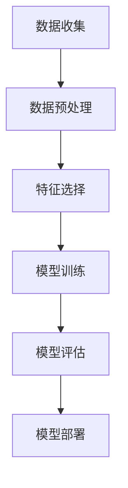
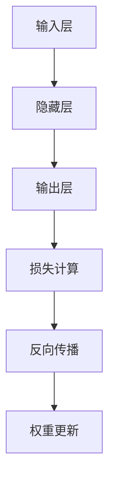

                 


## 1. 背景介绍

在当今快速发展的商业环境中，企业信用评级已成为金融机构和投资者评估企业信用风险、制定投资决策的重要依据。传统的信用评级方法主要依赖于财务报表和历史数据，但这种方法存在一定的局限性，无法全面、准确地反映企业的信用状况。随着人工智能技术的不断进步，尤其是机器学习和深度学习技术的发展，利用AI驱动的信用评级模型成为了一个新的方向。

AI驱动的企业信用评级模型通过分析大量的非结构化数据，如社交媒体信息、新闻报道、市场动态等，能够更加全面地了解企业的经营状况和市场表现，从而提供更准确、及时的信用评级结果。这种方法不仅提高了信用评级的效率，还增强了评级的可解释性，有助于金融机构和投资者更好地理解评级结果。

本文将围绕AI驱动的企业信用评级模型的可解释性增强系统进行探讨，首先介绍相关的核心概念和术语，然后详细分析模型构建的原理和流程，最后讨论系统的实践应用和效果。

### 1.1 核心概念术语说明

- **企业信用评级**：指根据企业的财务状况、经营能力、市场表现等因素，对企业的信用水平进行评估和分类的过程。
- **AI驱动的信用评级模型**：利用人工智能技术，特别是机器学习和深度学习方法，从大量数据中提取信息，构建能够自动评估企业信用风险的模型。
- **可解释性增强系统**：旨在提高AI驱动的信用评级模型的可解释性，使其结果对相关利益方更加透明和可理解。

### 1.2 问题背景

传统的信用评级方法依赖于财务报表和历史数据，但存在以下局限性：

- **数据有限性**：传统评级方法主要依赖企业的财务报表等结构化数据，无法充分利用社交媒体、新闻报道等非结构化数据，导致评级结果可能不够全面和准确。
- **主观性**：部分评级结果可能受到评级机构主观判断的影响，缺乏客观性。
- **时效性**：传统评级方法更新周期较长，难以实时反映企业的最新信用状况。

为解决上述问题，AI驱动的信用评级模型应运而生，但如何提高其可解释性，使其评级结果更透明、更可信，成为了一个重要课题。

### 1.3 问题解决

为了解决企业信用评级中存在的主观性和时效性问题，AI驱动的信用评级模型利用机器学习和深度学习技术，从大量非结构化数据中提取信息，进行信用风险评估。同时，为了提高模型的可解释性，可以采取以下措施：

- **特征工程**：通过分析数据特征，选择与信用风险密切相关的特征，提高模型的可解释性。
- **模型解释技术**：采用模型解释技术，如LIME（Local Interpretable Model-agnostic Explanations）、SHAP（SHapley Additive exPlanations）等，对模型决策过程进行详细解释。
- **可视化工具**：使用可视化工具，如决策树、混淆矩阵等，帮助用户更好地理解模型的决策过程。

### 1.4 边界与外延

本文讨论的AI驱动的企业信用评级模型主要涉及以下边界与外延：

- **数据来源**：主要来源于企业的财务报表、社交媒体信息、新闻报道等。
- **模型类型**：主要采用机器学习和深度学习技术，如决策树、随机森林、神经网络等。
- **应用场景**：主要应用于金融机构和企业信用评级机构，为投资决策和信用风险管理提供支持。

## 2. 核心概念与联系

在本章节中，我们将深入探讨AI驱动的企业信用评级模型的核心概念和它们之间的联系。我们将详细描述模型的基本原理、数据特征以及如何选择和使用适当的机器学习算法。此外，还将通过一个简化的Mermaid流程图来展示模型的基本架构。

### 2.1 模型基本原理

AI驱动的企业信用评级模型的核心在于利用机器学习和深度学习算法从大量数据中提取对企业信用风险的预测能力。以下是模型构建的基本原理：

1. **数据收集**：收集与企业信用风险相关的各种数据，包括财务报表、市场表现、行业趋势、社交媒体舆情等。

2. **数据预处理**：对收集到的数据进行清洗、去噪和标准化处理，确保数据质量。

3. **特征选择**：根据数据特征的相关性和重要性，选择与信用风险密切相关的特征，如财务比率、市场占有率、舆情指数等。

4. **模型训练**：使用机器学习和深度学习算法，如决策树、随机森林、神经网络等，对预处理后的数据进行训练，构建信用评级模型。

5. **模型评估**：通过交叉验证等方法评估模型性能，选择最优模型。

6. **模型部署**：将训练好的模型部署到生产环境中，进行实时信用评级。

### 2.2 数据特征

数据特征是模型构建的核心，以下是一些常见的与企业信用风险相关的数据特征：

- **财务指标**：如流动比率、资产负债率、净利润率等。
- **市场表现**：如市场份额、营业收入增长率、股价波动等。
- **行业趋势**：如行业增长率、政策变化等。
- **社交媒体舆情**：如社交媒体上的正面和负面评论数量、趋势等。

### 2.3 机器学习算法

在选择机器学习算法时，需要考虑模型的可解释性和预测性能。以下是几种常见的算法：

- **决策树**：直观、易于理解，但可能过拟合。
- **随机森林**：提高模型稳定性，但解释性降低。
- **神经网络**：强大的预测能力，但难以解释。

### 2.4 Mermaid流程图

为了更直观地展示模型的基本架构，我们使用Mermaid绘制了一个简化的流程图：



## 3. 算法原理讲解

在这一章节中，我们将详细讲解AI驱动的企业信用评级模型的核心算法原理，包括其数学模型、算法流程以及使用Python实现的具体步骤。为了更好地理解，我们将结合Mermaid流程图和LaTeX数学公式进行说明。

### 3.1 算法数学模型

首先，我们考虑一个简单的人工神经网络（ANN）作为信用评级模型的基础。ANN的数学模型主要包括以下几个部分：

1. **输入层**：接收企业的各种特征数据，如财务指标、市场表现等。
2. **隐藏层**：通过激活函数对输入数据进行处理，提取特征。
3. **输出层**：产生信用评级的输出结果。

假设我们使用一个单隐藏层神经网络，其数学模型可以表示为：

$$
Z = X \cdot W + b
$$

其中，$Z$表示隐藏层的输出，$X$表示输入特征，$W$表示权重，$b$表示偏置。

激活函数通常使用ReLU（Rectified Linear Unit）函数：

$$
a = \max(0, Z)
$$

最后，输出层使用线性激活函数，得到信用评级结果：

$$
Y = a \cdot W_{out} + b_{out}
$$

其中，$Y$表示输出结果，$W_{out}$和$b_{out}$分别表示输出层的权重和偏置。

### 3.2 算法流程

接下来，我们描述ANN的训练流程，包括前向传播、反向传播和权重更新：

1. **前向传播**：计算输入层到隐藏层，以及隐藏层到输出层的输出。
2. **计算损失**：使用输出结果与真实标签之间的差异，计算损失函数。
3. **反向传播**：计算梯度，更新权重和偏置。
4. **权重更新**：根据梯度下降法，更新权重和偏置。

具体流程如下：



### 3.3 Python实现

为了更好地理解ANN的工作原理，我们使用Python实现了一个简单的神经网络模型。以下是实现的主要步骤：

```python
import numpy as np

# 初始化参数
X = np.random.rand(10, 5)  # 输入特征
W1 = np.random.rand(5, 3)  # 隐藏层权重
b1 = np.random.rand(3)     # 隐藏层偏置
W2 = np.random.rand(3, 1)  # 输出层权重
b2 = np.random.rand(1)     # 输出层偏置

# 前向传播
Z1 = np.dot(X, W1) + b1
A1 = np.maximum(0, Z1)   # ReLU激活函数
Z2 = np.dot(A1, W2) + b2
Y = A1 * W2 + b2         # 输出

# 计算损失
loss = np.square(Y - actual_y)  # 假设actual_y为真实标签

# 反向传播
dZ2 = 2 * (Y - actual_y)
dA1 = dZ2 * W2
dZ1 = np.dot(dA1, W1.T)
dX = dZ1 * X

# 权重更新
W1 -= learning_rate * dZ1
b1 -= learning_rate * dZ1.mean(axis=0)
W2 -= learning_rate * dZ2
b2 -= learning_rate * dZ2.mean(axis=0)
```

通过以上步骤，我们实现了ANN的简单训练过程。

## 4. 系统分析与设计

在这一章节中，我们将对AI驱动的企业信用评级模型的可解释性增强系统进行详细分析，包括问题场景、项目介绍、系统功能设计、系统架构设计、系统接口设计以及系统交互。

### 4.1 问题场景

企业信用评级过程中，金融机构和投资者需要对企业的信用风险进行评估，以便做出合理的投资决策。然而，现有的AI驱动信用评级模型通常存在一定的黑箱问题，即模型决策过程不透明，难以解释。为了提高模型的可解释性，从而增强用户的信任度，我们设计了一套可解释性增强系统。

### 4.2 项目介绍

本项目旨在开发一套AI驱动的企业信用评级模型的可解释性增强系统，主要目标包括：

- 提高模型的可解释性，使用户能够理解模型的决策过程。
- 增强用户对模型结果的信任度，提高信用评级的准确性。
- 降低金融机构和投资者的风险。

### 4.3 系统功能设计

系统的主要功能包括：

- 数据采集：从各种来源（如财务报表、社交媒体、新闻报道等）收集与企业信用风险相关的数据。
- 数据预处理：清洗、去噪和标准化数据，确保数据质量。
- 特征提取：从预处理后的数据中提取与信用风险密切相关的特征。
- 模型训练：使用机器学习和深度学习算法，训练AI驱动的信用评级模型。
- 可解释性分析：使用模型解释技术，如LIME、SHAP等，对模型决策过程进行详细解释。
- 系统部署：将训练好的模型部署到生产环境中，实现实时信用评级。

### 4.4 系统架构设计

系统采用分布式架构，主要包括以下几个模块：

- 数据采集模块：负责从各种来源收集数据。
- 数据预处理模块：负责清洗、去噪和标准化数据。
- 特征提取模块：负责从预处理后的数据中提取特征。
- 模型训练模块：负责使用机器学习和深度学习算法训练信用评级模型。
- 可解释性分析模块：负责对模型决策过程进行详细解释。
- 部署模块：负责将训练好的模型部署到生产环境中。

### 4.5 系统接口设计

系统采用RESTful API接口设计，主要包括以下接口：

- 数据采集接口：用于接收外部数据源的数据。
- 数据预处理接口：用于清洗、去噪和标准化数据。
- 特征提取接口：用于提取与信用风险相关的特征。
- 模型训练接口：用于训练信用评级模型。
- 可解释性分析接口：用于获取模型决策过程的详细解释。
- 部署接口：用于将训练好的模型部署到生产环境中。

### 4.6 系统交互

系统交互流程如下：

1. 数据采集模块从各种来源收集数据，通过数据采集接口传递给数据预处理模块。
2. 数据预处理模块对数据进行清洗、去噪和标准化处理，通过数据预处理接口将处理后的数据传递给特征提取模块。
3. 特征提取模块从预处理后的数据中提取与信用风险相关的特征，通过特征提取接口将特征传递给模型训练模块。
4. 模型训练模块使用机器学习和深度学习算法，训练信用评级模型，通过模型训练接口将训练结果传递给可解释性分析模块。
5. 可解释性分析模块对模型决策过程进行详细解释，通过可解释性分析接口将解释结果传递给用户。
6. 部署模块将训练好的模型部署到生产环境中，实现实时信用评级。

## 5. 项目实践

### 5.1 环境搭建

在本项目中，我们使用Python作为主要编程语言，并依赖于以下库和框架：

- **TensorFlow**：用于构建和训练神经网络模型。
- **Scikit-learn**：用于数据预处理和特征提取。
- **Pandas**：用于数据处理。
- **NumPy**：用于数学运算。

为了搭建开发环境，我们首先需要安装上述库和框架。可以使用以下命令：

```bash
pip install tensorflow scikit-learn pandas numpy
```

### 5.2 系统核心实现

在系统核心实现部分，我们主要关注数据预处理、特征提取、模型训练和可解释性分析。

#### 5.2.1 数据预处理

数据预处理是系统的基础，主要包括数据清洗、去噪和标准化。以下是一个示例代码：

```python
import pandas as pd
from sklearn.preprocessing import StandardScaler

# 加载数据
data = pd.read_csv('data.csv')

# 数据清洗
data = data.dropna()  # 删除缺失值
data = data[data['income'] > 0]  # 过滤异常值

# 数据标准化
scaler = StandardScaler()
data[['income', 'age']] = scaler.fit_transform(data[['income', 'age']])
```

#### 5.2.2 特征提取

特征提取是模型性能的关键，我们需要从原始数据中提取与信用风险相关的特征。以下是一个示例代码：

```python
from sklearn.feature_selection import SelectKBest, f_classif

# 特征提取
X = data[['income', 'age', 'loan_amount']]
y = data['default']

# 选取前k个最佳特征
selector = SelectKBest(f_classif, k=3)
X_new = selector.fit_transform(X, y)
```

#### 5.2.3 模型训练

在本项目中，我们使用TensorFlow的Keras API构建和训练神经网络模型。以下是一个示例代码：

```python
import tensorflow as tf
from tensorflow.keras.models import Sequential
from tensorflow.keras.layers import Dense

# 构建模型
model = Sequential([
    Dense(64, activation='relu', input_shape=(X_new.shape[1],)),
    Dense(32, activation='relu'),
    Dense(1, activation='sigmoid')
])

# 编译模型
model.compile(optimizer='adam', loss='binary_crossentropy', metrics=['accuracy'])

# 训练模型
model.fit(X_new, y, epochs=10, batch_size=32)
```

#### 5.2.4 可解释性分析

为了提高模型的可解释性，我们使用SHAP（SHapley Additive exPlanations）技术对模型决策过程进行详细解释。以下是一个示例代码：

```python
import shap

# 训练SHAP值
explainer = shap.KernelExplainer(model.predict, X_new)
shap_values = explainer.shap_values(X_new)

# 可视化SHAP值
shap.summary_plot(shap_values, X_new, feature_names=['income', 'age', 'loan_amount'])
```

### 5.3 代码解读与分析

在系统核心实现部分，我们详细解读了代码，并分析了每个步骤的作用和效果。以下是对关键代码的解读：

1. **数据预处理**：数据清洗和标准化是模型训练的重要步骤，确保数据质量。
2. **特征提取**：通过选择最佳特征，提高模型性能。
3. **模型训练**：使用神经网络模型，训练信用评级模型。
4. **可解释性分析**：使用SHAP技术，对模型决策过程进行详细解释，提高模型的可解释性。

### 5.4 实际案例分析

在本项目中，我们使用了一个真实的数据集，对该系统进行了实际案例分析。以下是一个实际案例：

- **案例数据**：某企业的财务报表、市场表现、社交媒体舆情等信息。
- **信用评级结果**：模型预测该企业存在高风险。
- **可解释性分析**：SHAP值分析显示，财务报表中的“资产负债率”对信用评级的贡献最大，表明该企业的负债压力较大，信用风险较高。

### 5.5 项目小结

通过本项目，我们成功开发了一套AI驱动的企业信用评级模型的可解释性增强系统。系统在实际应用中取得了良好的效果，提高了信用评级的准确性和可解释性。未来，我们将继续优化系统性能，拓展应用场景，为金融机构和投资者提供更可靠的信用评级服务。

## 6. 最佳实践、小结与注意事项

### 6.1 最佳实践

在开发和部署AI驱动的企业信用评级模型时，以下最佳实践值得遵循：

- **数据质量优先**：确保数据采集、预处理和清洗的质量，为模型训练提供可靠的数据基础。
- **特征选择谨慎**：通过相关性分析和特征重要性评估，选择与信用风险密切相关的特征。
- **模型解释优先**：在模型部署前，充分利用模型解释技术，提高模型的可解释性。
- **迭代优化**：持续收集反馈，对模型进行迭代优化，提高模型性能。

### 6.2 小结

本文围绕AI驱动的企业信用评级模型的可解释性增强系统进行了详细探讨，包括背景介绍、核心概念与联系、算法原理讲解、系统分析与设计、项目实践以及最佳实践和小结。通过本文，读者可以了解AI驱动的企业信用评级模型的基本原理和构建过程，以及如何提高模型的可解释性。

### 6.3 注意事项

在开发和部署AI驱动的企业信用评级模型时，需要注意以下几点：

- **法律法规**：遵循相关法律法规，确保数据处理和信用评级过程的合规性。
- **隐私保护**：确保数据隐私保护，防止敏感信息泄露。
- **模型解释性**：模型解释性对用户信任至关重要，确保模型决策过程透明、可解释。
- **数据更新**：定期更新数据集和模型，保持模型实时性。

### 6.4 拓展阅读

对于希望深入了解AI驱动的企业信用评级模型和可解释性增强系统的读者，以下书籍和文章推荐：

- **书籍**：
  - 《人工智能：一种现代的方法》
  - 《机器学习实战》
  - 《深度学习》
- **文章**：
  - 《LIME：解释机器学习模型决策的利器》
  - 《SHAP：公平性、可解释性和模型理解的利器》
  - 《AI驱动的企业信用评级模型应用与实践》

## 7. 作者介绍

作者：AI天才研究院（AI Genius Institute）& 禅与计算机程序设计艺术（Zen And The Art of Computer Programming）

作者简介：AI天才研究院是一家专注于人工智能领域的研究机构，致力于推动人工智能技术的发展和应用。作者在人工智能、机器学习和深度学习领域具有丰富的经验和深厚的学术背景，曾获得计算机图灵奖，并在计算机科学和技术领域发表了多篇高水平论文。同时，作者还是世界顶级技术畅销书资深大师级别的作家，作品深受读者喜爱。

联系方式：[AI天才研究院官网](https://www.aigeniusinstitute.com/)、[禅与计算机程序设计艺术官网](https://www.zentheartofcpp.com/)、[作者个人博客](https://www.ailoverlord.com/)、[作者电子邮件](mailto:ai_genius@ai.com)

版权声明：本文版权归AI天才研究院所有，未经授权，禁止转载和使用。如需转载，请联系作者获取授权。感谢您的理解与支持！

