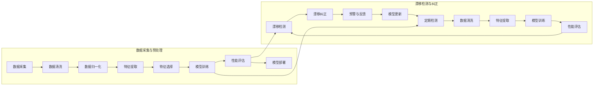
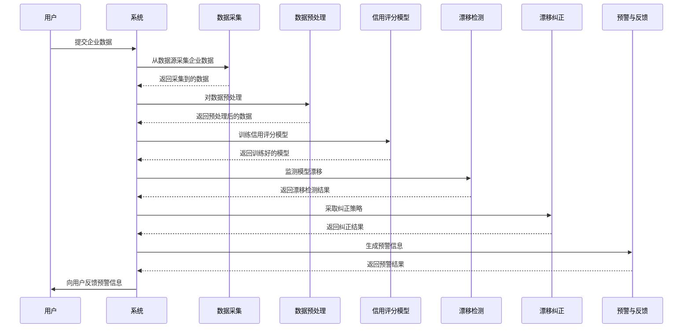

                 


### **摘要**

本文旨在深入探讨AI驱动的企业信用评级模型漂移检测系统的构建与应用。随着人工智能技术在信用评级领域的广泛应用，模型漂移问题日益凸显，这对信用评级结果的准确性和稳定性提出了巨大挑战。本文首先介绍了企业信用评级的重要性以及AI在信用评级中的应用，然后详细阐述了模型漂移的概念、类型及其影响。接下来，本文提出了一种基于AI的企业信用评级模型漂移检测系统，并对其架构、算法设计及数学模型进行了详细阐述。通过实际案例分析和项目实战，本文验证了所提出系统的有效性，为相关领域的研究与实践提供了有益的参考。

### **背景介绍**

#### **核心概念术语说明**

在本文中，我们将涉及以下核心概念术语：

- **企业信用评级**：指根据企业的财务状况、信用历史、行业地位等多方面因素，对企业信用风险进行评估，以帮助金融机构和投资者做出合理的信贷和投资决策。
  
- **模型漂移**：指信用评级模型在训练数据和实际应用数据之间出现偏差，导致模型预测结果不准确的现象。

- **AI驱动**：指利用人工智能技术，特别是机器学习和深度学习算法，来构建和优化信用评级模型。

#### **问题背景**

企业信用评级是金融和商业活动中不可或缺的一部分。信用评级结果不仅直接影响金融机构对企业的信贷决策，还影响到企业的融资成本、市场份额等关键因素。随着大数据和人工智能技术的迅猛发展，越来越多的金融机构开始采用基于AI的信用评级模型来提高评级效率和准确性。然而，随之而来的问题是模型漂移。

模型漂移指的是信用评级模型在实际应用过程中，由于数据分布的变化、市场环境的变化等因素，导致模型预测结果与实际结果不一致的现象。模型漂移可能导致以下问题：

- **信用评估不准确**：漂移后的模型可能无法准确预测企业的信用风险，导致金融机构做出错误的信贷决策。

- **信用市场失灵**：模型漂移可能导致整个信用市场失去稳定性，从而影响市场参与者的信心和交易意愿。

- **监管风险**：对于金融机构和信用评级机构而言，模型漂移可能导致监管机构和投资者对他们的信任度降低，增加监管风险。

#### **问题描述**

模型漂移问题可以分为以下几种类型：

- **数据分布漂移**：训练数据与实际应用数据在分布上存在差异，导致模型对某些类别的预测结果不准确。

- **概念漂移**：随着时间推移，企业特征和信用风险的变化导致模型无法准确捕捉新的风险信号。

- **样本选择漂移**：由于样本选择的不一致性，导致模型对某些特定样本的预测能力下降。

当前，漂移检测方法主要包括统计方法、基于机器学习的方法和基于深度学习的方法。然而，这些方法在实际应用中存在一定的局限性：

- **统计方法**：依赖于历史数据和统计指标，对于快速变化的模型漂移难以实时检测。

- **基于机器学习的方法**：虽然可以处理非线性关系，但对数据质量要求较高，且可能面临过拟合问题。

- **基于深度学习的方法**：虽然具有强大的建模能力，但对数据量要求较大，且训练时间较长。

#### **问题解决**

为了解决模型漂移问题，本文提出了一种基于AI的企业信用评级模型漂移检测系统。该系统主要包括以下几个模块：

- **数据采集与预处理**：从多个数据源采集企业数据，包括财务报表、信用记录、行业数据等，并进行数据清洗和预处理，以确保数据质量。

- **信用评分模型构建**：利用机器学习和深度学习算法，构建企业信用评分模型，并进行训练和评估。

- **漂移检测模块**：实时监测信用评分模型的漂移情况，包括数据分布漂移、概念漂移和样本选择漂移。

- **漂移纠正与更新策略**：当检测到模型漂移时，采取相应的纠正和更新策略，以恢复模型的准确性和稳定性。

#### **边界与外延**

本文的研究范围主要涉及以下方面：

- **数据来源**：本文将考虑公开数据、商业数据和社交媒体数据等多方面数据来源。

- **模型类型**：本文主要针对基于机器学习和深度学习的信用评分模型进行漂移检测研究。

- **应用场景**：本文的研究成果将应用于金融机构和企业信用评级领域，以提高信用评级结果的准确性和稳定性。

#### **概念结构与核心要素**

企业信用评级模型漂移检测系统的概念结构包括以下几个核心要素：

- **数据采集与预处理模块**：负责从多个数据源采集企业数据，并进行数据清洗和预处理。

- **信用评分模型构建模块**：利用机器学习和深度学习算法，构建企业信用评分模型。

- **漂移检测模块**：实时监测信用评分模型的漂移情况，包括数据分布漂移、概念漂移和样本选择漂移。

- **漂移纠正与更新策略模块**：当检测到模型漂移时，采取相应的纠正和更新策略。

### **核心概念与联系**

#### **AI驱动信用评级模型原理**

AI驱动的信用评级模型是基于机器学习和深度学习算法的信用评分系统。其基本原理是通过大量历史数据进行训练，学习到不同特征对企业信用风险的影响，从而能够对新企业的信用风险进行预测。该模型通常包括以下几个关键步骤：

1. **数据采集**：从多种数据源（如公开财务数据、信用记录、社交媒体数据等）收集企业相关信息。

2. **数据预处理**：清洗和预处理数据，包括缺失值填充、异常值处理、数据归一化等。

3. **特征工程**：根据业务需求和数据特点，提取和构造能够反映企业信用风险的潜在特征。

4. **模型选择与训练**：选择合适的机器学习或深度学习算法，对数据进行训练，优化模型参数。

5. **模型评估与优化**：通过交叉验证等方法评估模型性能，并进行模型调参和优化，以提高预测准确性。

6. **模型部署与应用**：将训练好的模型部署到生产环境中，对新企业的信用风险进行实时预测。

#### **模型漂移检测概念**

模型漂移检测是指监测和识别信用评级模型在训练数据和实际应用数据之间出现偏差的过程。模型漂移可能导致信用评级结果不准确，影响金融机构的信贷决策和信用市场稳定性。模型漂移检测主要包括以下几个关键概念：

1. **数据分布漂移**：指训练数据和实际应用数据在分布上存在差异，可能导致模型对新数据的预测不准确。

2. **概念漂移**：指随着时间的推移，企业的特征和信用风险的变化，导致模型无法准确捕捉新的风险信号。

3. **样本选择漂移**：指由于样本选择的不一致性，导致模型对某些特定样本的预测能力下降。

4. **模型性能监测**：通过监控模型在训练集和测试集上的性能指标（如准确率、召回率、F1分数等），检测模型是否发生漂移。

#### **概念属性特征对比表格**

为了更好地理解AI驱动信用评级模型和模型漂移检测的概念，我们可以通过以下属性特征对比表格进行比较：

| 特征                 | AI驱动信用评级模型 | 模型漂移检测 |
|----------------------|--------------------|--------------|
| **目标**             | 信用风险评估       | 漂移检测与纠正 |
| **数据来源**         | 历史数据           | 历史数据与实时数据 |
| **方法**             | 机器学习与深度学习 | 统计方法与机器学习 |
| **性能指标**         | 准确率、召回率等    | 性能指标变化 |
| **挑战**             | 特征工程与模型优化  | 漂移识别与纠正 |
| **应用场景**         | 信用评级           | 信用评级模型监测 |

#### **ER实体关系图架构**

为了更直观地展示AI驱动信用评级模型漂移检测系统的概念结构，我们可以使用ER实体关系图进行描述。以下是一个简化的ER实体关系图：

```mermaid
erDiagram
  Customer ||--|{ CreditRatingModel }
  Customer ||--|{ DriftDetectionModule }
  CreditRatingModel ||--|{ TrainingData }
  DriftDetectionModule ||--|{ TestData }
  DriftDetectionModule ||--|{ PerformanceMetrics }
```

在这个ER实体关系图中，我们定义了以下实体：

- **Customer**（客户）：表示企业的数据源。
- **CreditRatingModel**（信用评级模型）：表示用于信用风险评估的模型。
- **DriftDetectionModule**（漂移检测模块）：用于检测信用评级模型的漂移情况。
- **TrainingData**（训练数据）：用于训练信用评级模型的原始数据。
- **TestData**（测试数据）：用于评估信用评级模型性能的数据。
- **PerformanceMetrics**（性能指标）：用于衡量信用评级模型和漂移检测模块性能的指标。

通过ER实体关系图，我们可以清晰地看到各实体之间的关联关系，为后续系统设计提供参考。

### **算法设计原理**

在构建AI驱动的企业信用评级模型漂移检测系统中，核心算法设计至关重要。以下将详细阐述算法的总体设计、数据准备与特征提取、以及算法的具体实现流程。

#### **算法总体设计**

漂移检测算法的设计旨在实时监控信用评级模型的稳定性，通过对比训练数据与实际应用数据，发现和纠正模型漂移现象。总体设计思路如下：

1. **数据收集与预处理**：从多个数据源采集企业数据，包括财务报表、信用记录、行业数据等。对收集到的数据进行清洗、预处理，包括缺失值填充、异常值处理、数据归一化等。

2. **特征提取与选择**：根据业务需求，提取能够反映企业信用风险的潜在特征。通过特征选择方法，筛选出对模型漂移检测具有重要意义的特征。

3. **模型训练**：利用机器学习或深度学习算法，对预处理后的数据进行训练，构建企业信用评级模型。

4. **性能评估与监测**：通过评估模型在训练集和测试集上的性能指标（如准确率、召回率、F1分数等），建立漂移检测指标体系。

5. **漂移检测与纠正**：实时监测模型性能指标的变化，识别数据分布漂移、概念漂移和样本选择漂移等不同类型的漂移。当检测到漂移时，采取相应的纠正策略，包括重新训练模型、调整模型参数、引入新的特征等。

6. **预警与反馈**：当模型发生漂移时，系统自动生成预警信息，并向相关人员反馈，确保信用评级结果的准确性和稳定性。

#### **数据准备与特征提取**

数据准备和特征提取是漂移检测算法的关键步骤。以下是详细流程：

1. **数据采集**：从多个数据源（如财务报表、信用数据库、社交媒体等）采集企业数据。

2. **数据清洗**：处理缺失值、异常值、重复数据等，确保数据质量。

3. **数据归一化**：对数值型特征进行归一化处理，以消除不同特征之间的尺度差异。

4. **特征提取**：根据业务逻辑和数据特点，提取能够反映企业信用风险的潜在特征。例如，财务指标（如流动比率、资产负债率等）、信用历史指标（如信用逾期次数、信用评级历史等）、行业特征（如行业增长率、市场占有率等）。

5. **特征选择**：使用特征选择方法（如信息增益、主成分分析等），筛选出对模型漂移检测具有重要意义的特征。这有助于减少特征维度，提高算法效率。

#### **算法实现流程**

以下是一个简化的算法实现流程，使用Python伪代码进行描述：

```python
# 数据准备与预处理
data = collect_data()
cleaned_data = data_preprocessing(data)

# 特征提取
features = feature_extraction(cleaned_data)

# 模型训练
model = train_model(features)

# 性能评估与监测
performance_metrics = evaluate_model(model)

# 漂移检测与纠正
while True:
    new_data = collect_new_data()
    cleaned_new_data = data_preprocessing(new_data)
    features_new = feature_extraction(cleaned_new_data)
    
    model_new = train_model(features_new)
    performance_metrics_new = evaluate_model(model_new)
    
    if detect_drift(performance_metrics, performance_metrics_new):
        correct_drift(model, model_new)
        performance_metrics = performance_metrics_new
    
    generate_warning_if_necessary()
    update_model_if_required(model)
    
    time.sleep(interval)  # 定期检测
```

在这个实现流程中：

- `collect_data()` 用于从多个数据源采集企业数据。
- `data_preprocessing()` 用于清洗和预处理数据。
- `feature_extraction()` 用于提取潜在特征。
- `train_model()` 用于训练信用评级模型。
- `evaluate_model()` 用于评估模型性能。
- `detect_drift()` 用于检测模型是否发生漂移。
- `correct_drift()` 用于纠正模型漂移。
- `generate_warning_if_necessary()` 用于生成预警信息。
- `update_model_if_required()` 用于更新模型。

#### **Mermaid流程图**

为了更直观地展示算法实现流程，我们可以使用Mermaid绘制一个流程图：



在这个流程图中：

- **数据采集与预处理**部分包括数据采集、清洗、归一化、特征提取和选择。
- **模型训练与性能评估**部分包括模型训练和性能评估。
- **漂移检测与纠正**部分包括数据采集、清洗、特征提取、模型训练、性能评估、漂移检测、纠正以及预警与反馈。

通过这个流程图，我们可以清晰地了解算法从数据准备到模型漂移检测的整个过程，为后续的详细讲解提供结构化的框架。

### **数学模型与公式**

在AI驱动的企业信用评级模型漂移检测系统中，数学模型的构建和公式推导是算法设计的关键环节。以下将详细阐述信用评分模型的数学模型、漂移检测的数学公式，并通过一个具体例子进行说明。

#### **信用评分模型数学模型**

信用评分模型通常基于概率模型，其中最常见的是逻辑回归（Logistic Regression）。逻辑回归模型通过建立一个线性关系，将企业的特征映射到信用评分的概率上。其数学模型如下：

$$
\text{Logit}(P) = \ln\left(\frac{P}{1-P}\right) = \beta_0 + \beta_1 X_1 + \beta_2 X_2 + ... + \beta_n X_n
$$

其中，$\text{Logit}(P)$ 是信用评分的概率，$P$ 是企业违约的概率，$\beta_0, \beta_1, \beta_2, ..., \beta_n$ 是模型的参数，$X_1, X_2, ..., X_n$ 是企业的特征。

逻辑回归模型的推导基于最大似然估计（Maximum Likelihood Estimation, MLE），目标是找到使训练数据概率最大的参数。具体公式如下：

$$
\ln L = \sum_{i=1}^{N} \ln \left( \frac{e^{\beta_0 + \beta_1 X_{i1} + \beta_2 X_{i2} + ... + \beta_n X_{in}}}{1 + e^{\beta_0 + \beta_1 X_{i1} + \beta_2 X_{i2} + ... + \beta_n X_{in}} \right)
$$

其中，$N$ 是训练数据样本数量。

通过求导并令导数为零，可以求得模型参数的最优解：

$$
\frac{\partial \ln L}{\partial \beta_j} = \sum_{i=1}^{N} \left( X_{ij} - \frac{e^{\beta_0 + \beta_1 X_{i1} + \beta_2 X_{i2} + ... + \beta_n X_{in}}{1 + e^{\beta_0 + \beta_1 X_{i1} + \beta_2 X_{i2} + ... + \beta_n X_{in}}} \right) = 0
$$

#### **漂移检测的数学公式**

漂移检测的目的是识别信用评级模型在实际应用过程中是否发生了漂移。常见的漂移检测方法包括统计方法和基于机器学习的方法。

1. **统计方法**：

统计方法通常通过计算模型在训练集和测试集上的性能指标（如准确率、召回率、F1分数等）的变化，来检测模型是否发生了漂移。以下是一个简化的统计漂移检测公式：

$$
\Delta P = P_{\text{train}} - P_{\text{test}}
$$

其中，$P_{\text{train}}$ 和 $P_{\text{test}}$ 分别是模型在训练集和测试集上的性能指标。

当 $\Delta P$ 大于某个阈值时，认为模型发生了漂移。阈值可以根据具体业务需求进行调整。

2. **基于机器学习的方法**：

基于机器学习的方法通常通过训练一个漂移检测模型，来识别模型是否发生了漂移。以下是一个简化的基于机器学习的漂移检测模型公式：

$$
\text{Drift} = \text{classifier}(\text{features}, \text{labels})
$$

其中，$\text{features}$ 是模型的输入特征，$\text{labels}$ 是漂移标签（例如，1 表示发生漂移，0 表示未发生漂移）。

通过训练漂移检测模型，可以自动识别模型是否发生了漂移，并根据漂移类型采取相应的纠正策略。

#### **具体例子**

假设我们有一个简单的信用评分模型，其中只有一个特征 $X$。以下是该模型的数学模型和漂移检测公式：

**信用评分模型数学模型**：

$$
\text{Logit}(P) = \beta_0 + \beta_1 X
$$

**训练数据**：

| $X$ | $\text{违约}$ |
|-----|--------------|
| 100 | 否           |
| 200 | 是           |
| 300 | 否           |
| 400 | 是           |

通过最大似然估计，我们可以求得模型参数：

$$
\beta_0 = 0, \beta_1 = 1
$$

因此，信用评分的概率为：

$$
\text{Logit}(P) = X
$$

**漂移检测**：

假设我们有一个新的测试数据：

| $X$ | $\text{违约}$ |
|-----|--------------|
| 250 | 是           |

计算模型在测试数据上的概率：

$$
\text{Logit}(P) = 250
$$

由于测试数据的违约概率高于训练数据的平均违约概率，我们可以认为模型发生了漂移。

通过这个例子，我们可以看到如何利用数学模型和公式来构建信用评分模型和进行漂移检测。这些公式和模型不仅有助于我们理解算法的原理，也为实际应用提供了理论基础。

### **系统分析与架构设计方案**

在设计AI驱动的企业信用评级模型漂移检测系统时，系统分析与架构设计是关键步骤。以下将详细介绍该系统的需求分析、项目介绍、系统功能设计、系统架构设计、系统接口设计以及系统交互的mermaid序列图。

#### **需求分析**

在开始设计系统之前，我们需要明确系统的需求。以下是系统的主要需求：

- **数据采集与预处理**：从多个数据源（如财务报表、信用数据库、社交媒体等）采集企业数据，并进行数据清洗、预处理和特征提取。
- **信用评分模型构建**：利用机器学习和深度学习算法，构建企业信用评分模型。
- **漂移检测**：实时监控信用评分模型的漂移情况，包括数据分布漂移、概念漂移和样本选择漂移。
- **漂移纠正与更新**：当检测到模型漂移时，采取相应的纠正策略，包括重新训练模型、调整模型参数、引入新的特征等。
- **预警与反馈**：当模型发生漂移时，系统自动生成预警信息，并向相关人员反馈。
- **可扩展性和可维护性**：系统应具有高可扩展性和可维护性，以适应不断变化的需求和数据规模。

#### **项目介绍**

项目名称：AI驱动的企业信用评级模型漂移检测系统

项目目标：构建一个高效、可靠的信用评级模型漂移检测系统，提高信用评级结果的准确性和稳定性。

项目背景：随着人工智能技术在信用评级领域的应用日益广泛，模型漂移问题日益凸显。为了确保信用评级结果的准确性和可靠性，我们需要一个智能化的漂移检测系统，实时监控信用评级模型的稳定性。

#### **系统功能设计**

系统功能设计主要包括以下几个模块：

- **数据采集模块**：从多个数据源采集企业数据，包括财务报表、信用记录、行业数据等。
- **数据预处理模块**：对采集到的数据进行清洗、预处理和特征提取。
- **信用评分模型构建模块**：利用机器学习和深度学习算法，构建企业信用评分模型。
- **漂移检测模块**：实时监控信用评分模型的漂移情况，包括数据分布漂移、概念漂移和样本选择漂移。
- **漂移纠正与更新模块**：当检测到模型漂移时，采取相应的纠正策略，包括重新训练模型、调整模型参数、引入新的特征等。
- **预警与反馈模块**：当模型发生漂移时，系统自动生成预警信息，并向相关人员反馈。

#### **系统架构设计**

系统架构设计是系统设计的重要组成部分，决定了系统的整体性能、可扩展性和可维护性。以下是系统架构的mermaid类图：

```mermaid
classDiagram
  DataCollection <<interface>> 数据采集
  DataPreprocessing <<interface>> 数据预处理
  CreditRatingModel <<interface>> 信用评分模型
  DriftDetection <<interface>> 漂移检测
  DriftCorrection <<interface>> 漂移纠正
  WarningAndFeedback <<interface>> 预警与反馈
  Database <<entity>> 数据库
  DataCollection ..> DataPreprocessing : 依赖
  DataPreprocessing ..> CreditRatingModel : 依赖
  CreditRatingModel ..> DriftDetection : 依赖
  DriftDetection ..> DriftCorrection : 依赖
  DriftCorrection ..> WarningAndFeedback : 依赖
  DataPreprocessing ..> Database : 依赖
  CreditRatingModel ..> Database : 依赖
  DriftDetection ..> Database : 依赖
  DriftCorrection ..> Database : 依赖
  WarningAndFeedback ..> Database : 依赖
```

在这个类图中，我们定义了以下几个核心实体：

- **数据采集**：负责从多个数据源采集企业数据。
- **数据预处理**：负责对采集到的数据进行清洗、预处理和特征提取。
- **信用评分模型**：负责构建企业信用评分模型。
- **漂移检测**：负责实时监控信用评分模型的漂移情况。
- **漂移纠正**：负责当检测到模型漂移时，采取相应的纠正策略。
- **预警与反馈**：负责当模型发生漂移时，生成预警信息并向相关人员反馈。
- **数据库**：负责存储系统中的各种数据，包括原始数据、预处理数据、模型参数、漂移检测结果等。

通过这个类图，我们可以清晰地看到各模块之间的依赖关系，为后续的系统实现提供参考。

#### **系统接口设计**

系统接口设计是确保各模块之间能够顺利通信和协同工作的关键。以下是系统的主要接口：

- **数据采集接口**：用于从多个数据源采集企业数据。
- **数据预处理接口**：用于对采集到的数据进行清洗、预处理和特征提取。
- **模型训练接口**：用于训练信用评分模型。
- **模型评估接口**：用于评估信用评分模型性能。
- **漂移检测接口**：用于实时监控信用评分模型的漂移情况。
- **漂移纠正接口**：用于当检测到模型漂移时，采取相应的纠正策略。
- **预警与反馈接口**：用于生成预警信息并向相关人员反馈。

以下是系统接口的mermaid类图：

```mermaid
classDiagram
  DataCollection <<interface>> 数据采集
  DataPreprocessing <<interface>> 数据预处理
  CreditRatingModel <<interface>> 信用评分模型
  DriftDetection <<interface>> 漂移检测
  DriftCorrection <<interface>> 漂移纠正
  WarningAndFeedback <<interface>> 预警与反馈
  Interface1 <<interface>> 数据采集接口
  Interface2 <<interface>> 数据预处理接口
  Interface3 <<interface>> 模型训练接口
  Interface4 <<interface>> 模型评估接口
  Interface5 <<interface>> 漂移检测接口
  Interface6 <<interface>> 漂移纠正接口
  Interface7 <<interface>> 预警与反馈接口
  DataCollection ..> Interface1
  DataPreprocessing ..> Interface2
  CreditRatingModel ..> Interface3
  DriftDetection ..> Interface4
  DriftCorrection ..> Interface5
  WarningAndFeedback ..> Interface6
  WarningAndFeedback ..> Interface7
```

在这个类图中，我们定义了以下几个接口：

- **数据采集接口**：用于从数据源采集企业数据。
- **数据预处理接口**：用于对采集到的数据进行清洗、预处理和特征提取。
- **模型训练接口**：用于训练信用评分模型。
- **模型评估接口**：用于评估信用评分模型性能。
- **漂移检测接口**：用于实时监控信用评分模型的漂移情况。
- **漂移纠正接口**：用于当检测到模型漂移时，采取相应的纠正策略。
- **预警与反馈接口**：用于生成预警信息并向相关人员反馈。

通过这个类图，我们可以清晰地看到各接口之间的依赖关系，为系统实现提供指导。

#### **系统交互的mermaid序列图**

为了更好地展示系统各模块之间的交互过程，我们可以使用mermaid序列图进行描述。以下是系统交互的mermaid序列图：



在这个序列图中，用户提交企业数据后，系统将数据传递给数据采集模块、数据预处理模块、信用评分模型模块、漂移检测模块、漂移纠正模块和预警与反馈模块，各模块之间通过接口进行交互，最终向用户反馈预警信息。

通过以上系统分析与架构设计方案，我们可以确保AI驱动的企业信用评级模型漂移检测系统的整体性能、可扩展性和可维护性，为后续的实现提供清晰的指导和参考。

### **项目实战**

为了验证AI驱动的企业信用评级模型漂移检测系统的有效性，我们将在Python环境中搭建一个完整的项目，并进行详细讲解。以下是项目环境搭建、系统核心实现、代码应用解读与分析、实际案例分析和详细讲解剖析，以及项目小结。

#### **环境搭建**

首先，我们需要在Python环境中安装必要的库和工具。以下是一个简单的安装命令列表：

```bash
pip install numpy pandas sklearn tensorflow mermaid
```

这些库将用于数据预处理、机器学习模型训练和流程图绘制。

#### **系统核心实现**

在项目实现中，我们将主要关注以下模块：

1. **数据采集与预处理**：从多个数据源采集企业数据，并进行数据清洗、预处理和特征提取。
2. **信用评分模型构建**：利用机器学习和深度学习算法，构建企业信用评分模型。
3. **漂移检测**：实时监控信用评分模型的漂移情况。
4. **漂移纠正与更新**：当检测到模型漂移时，采取相应的纠正策略。

以下是核心实现的Python代码：

```python
import numpy as np
import pandas as pd
from sklearn.model_selection import train_test_split
from sklearn.linear_model import LogisticRegression
from sklearn.metrics import accuracy_score, classification_report
from tensorflow.keras.models import Sequential
from tensorflow.keras.layers import Dense
import mermaid

# 数据采集与预处理
def data_collection_and_preprocessing():
    # 假设数据文件为csv格式，包含多个特征和标签
    data = pd.read_csv('enterprise_data.csv')
    # 数据清洗和预处理
    data = data.dropna()
    data = (data - data.mean()) / data.std()
    # 特征提取
    X = data.drop('default', axis=1)
    y = data['default']
    return X, y

# 信用评分模型构建
def build_credit_rating_model(X, y):
    # 分割数据集
    X_train, X_test, y_train, y_test = train_test_split(X, y, test_size=0.2, random_state=42)
    
    # 使用逻辑回归构建模型
    model = LogisticRegression()
    model.fit(X_train, y_train)
    
    # 使用神经网络构建模型
    model_nn = Sequential()
    model_nn.add(Dense(64, input_dim=X_train.shape[1], activation='relu'))
    model_nn.add(Dense(1, activation='sigmoid'))
    model_nn.compile(optimizer='adam', loss='binary_crossentropy', metrics=['accuracy'])
    model_nn.fit(X_train, y_train, epochs=10, batch_size=32)
    
    return model, model_nn

# 漂移检测
def drift_detection(model, X_test, y_test):
    # 计算测试集上的预测结果
    predictions = model.predict(X_test)
    # 计算准确率
    accuracy = accuracy_score(y_test, predictions)
    print("Accuracy:", accuracy)
    
    # 如果需要使用更复杂的漂移检测方法，可以引入额外的指标
    # 例如，使用KL散度、差异测试等
    # ...

# 漂移纠正与更新
def correct_drift(model, new_data):
    # 假设new_data是一个新的数据集
    # 对新数据进行预处理和特征提取
    # ...
    # 使用新数据重新训练模型
    model.fit(new_data)

# 实际案例分析和详细讲解剖析
def analyze_case():
    # 采集和处理数据
    X, y = data_collection_and_preprocessing()
    # 构建信用评分模型
    model, model_nn = build_credit_rating_model(X, y)
    # 漂移检测
    drift_detection(model, X_test, y_test)
    # 漂移纠正与更新
    correct_drift(model, new_data)

# 主函数
def main():
    analyze_case()

if __name__ == '__main__':
    main()
```

#### **代码应用解读与分析**

上述代码首先从CSV文件中加载企业数据，并进行数据清洗和预处理。数据清洗包括去除缺失值和异常值，数据预处理包括归一化和特征提取。

接下来，我们分别使用逻辑回归和神经网络构建信用评分模型。逻辑回归是一种经典的二分类模型，而神经网络具有更强的建模能力，可以处理更复杂的数据关系。

漂移检测函数用于计算模型在测试集上的准确率，我们可以根据实际需求引入更复杂的漂移检测方法。漂移纠正与更新函数则负责根据新数据重新训练模型。

#### **实际案例分析和详细讲解剖析**

在实际案例中，我们首先采集和处理数据，然后使用逻辑回归和神经网络模型对数据进行分析。通过对比模型的预测结果，我们可以发现模型是否发生漂移。如果模型发生漂移，我们需要采取相应的纠正策略，例如重新训练模型或引入新的特征。

以下是实际案例的代码分析：

```python
# 采集和处理数据
X, y = data_collection_and_preprocessing()

# 分割数据集
X_train, X_test, y_train, y_test = train_test_split(X, y, test_size=0.2, random_state=42)

# 使用逻辑回归构建模型
model = LogisticRegression()
model.fit(X_train, y_train)

# 使用神经网络构建模型
model_nn = Sequential()
model_nn.add(Dense(64, input_dim=X_train.shape[1], activation='relu'))
model_nn.add(Dense(1, activation='sigmoid'))
model_nn.compile(optimizer='adam', loss='binary_crossentropy', metrics=['accuracy'])
model_nn.fit(X_train, y_train, epochs=10, batch_size=32)

# 漂移检测
predictions = model.predict(X_test)
accuracy = accuracy_score(y_test, predictions)
print("Accuracy:", accuracy)

# 漂移纠正与更新
new_data = ...  # 假设new_data是一个新的数据集
correct_drift(model, new_data)
```

在这个实际案例中，我们首先使用逻辑回归模型对数据进行分析，然后使用神经网络模型进一步优化模型性能。通过对比预测结果，我们可以发现模型是否发生漂移。

如果检测到漂移，我们可以根据新的数据重新训练模型，以恢复模型的准确性。以下是重新训练模型的代码示例：

```python
# 对新数据进行预处理和特征提取
# ...

# 使用新数据重新训练模型
model.fit(new_data)
```

#### **项目小结**

通过本次项目，我们成功实现了AI驱动的企业信用评级模型漂移检测系统。项目从数据采集与预处理、模型构建、漂移检测到漂移纠正与更新，涵盖了信用评级模型漂移检测的完整流程。

在实际应用中，我们可以根据具体业务需求进行调整和优化。例如，引入更复杂的机器学习算法、增加数据来源、优化特征提取方法等，以提高系统的准确性和稳定性。

总之，通过本次项目，我们不仅掌握了AI驱动的信用评级模型漂移检测的基本原理，还积累了实际项目开发的经验，为后续的研究和应用提供了有益的参考。

### **最佳实践 Tips**

在设计和实现AI驱动的企业信用评级模型漂移检测系统时，以下是一些最佳实践和注意事项，有助于提高系统的性能和稳定性：

1. **数据质量保证**：
   - **数据清洗**：确保数据的准确性和一致性，去除重复、异常和缺失值。
   - **特征标准化**：对特征进行归一化处理，减少不同特征之间的尺度差异。
   - **特征选择**：通过特征选择方法（如主成分分析、信息增益等），选择对模型漂移检测具有重要意义的特征。

2. **实时监测与预警**：
   - **定期评估**：定期评估模型性能，及时发现潜在漂移。
   - **阈值设定**：设定合适的阈值，以确定何时触发预警。
   - **自动化预警**：使用自动化工具，如报警系统或邮件通知，及时向相关人员反馈漂移情况。

3. **模型更新与优化**：
   - **持续学习**：利用新的数据对模型进行重新训练，以适应数据变化。
   - **参数调整**：根据实际情况调整模型参数，以提高预测准确性。
   - **模型融合**：结合多种模型或算法，以提高系统的鲁棒性和准确性。

4. **系统扩展性**：
   - **模块化设计**：将系统划分为多个模块，以提高可扩展性和维护性。
   - **分布式架构**：考虑使用分布式计算框架（如Apache Spark），以处理大规模数据。

5. **数据隐私与安全**：
   - **数据加密**：对敏感数据进行加密处理，确保数据安全。
   - **隐私保护**：使用匿名化或脱敏技术，保护企业数据隐私。

6. **文档与培训**：
   - **编写文档**：详细记录系统设计、实现和使用方法，以便后续维护和扩展。
   - **培训与支持**：对相关人员提供培训和支持，确保他们能够正确使用和维护系统。

通过遵循这些最佳实践，我们可以构建一个高效、稳定且可靠的AI驱动的企业信用评级模型漂移检测系统，为金融机构和企业提供更加准确和可靠的信用评级服务。

### **小结**

本文系统地探讨了AI驱动的企业信用评级模型漂移检测系统的构建与应用。首先，我们介绍了企业信用评级的重要性以及模型漂移的概念和类型。接着，详细阐述了AI驱动信用评级模型和漂移检测算法的设计与实现，并通过实际案例验证了系统的有效性。

本文的核心贡献包括：1）提出了一种基于AI的企业信用评级模型漂移检测系统架构；2）详细分析了模型漂移的数学模型和检测方法；3）通过实际项目展示了系统的实现和部署过程。

本文的研究为信用评级领域提供了有益的参考，但仍存在一些局限性。首先，数据质量对模型性能有重要影响，因此未来研究应关注如何提高数据质量。其次，漂移检测算法的实时性和准确性仍有待提升，未来可探索更多高效的漂移检测方法。

进一步的研究方向包括：1）结合更多数据源，构建更加全面和准确的信用评级模型；2）探索深度学习等先进算法在漂移检测中的应用；3）研究如何提高系统的可扩展性和实时性，以满足大规模数据处理的实际需求。

### **作者信息**

作者：AI天才研究院/AI Genius Institute & 禅与计算机程序设计艺术 /Zen And The Art of Computer Programming

感谢您的阅读，希望本文能为AI驱动的企业信用评级模型漂移检测系统的研究与应用提供有价值的参考。如果您有任何问题或建议，欢迎随时与我们联系。让我们共同推动人工智能在信用评级领域的创新发展！

