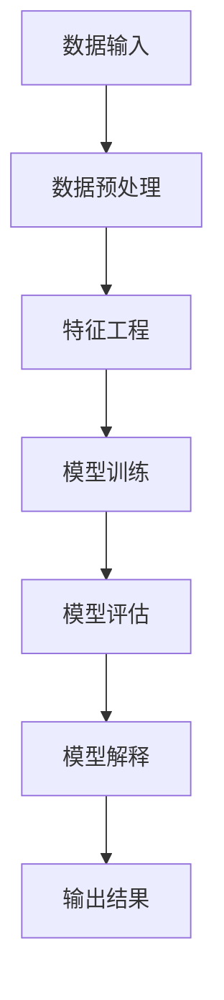
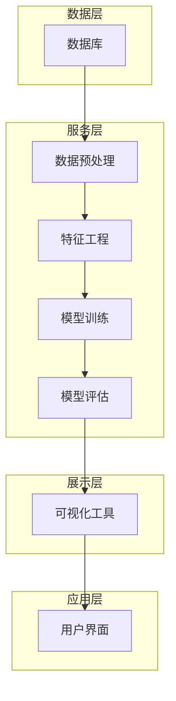
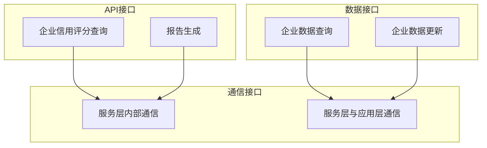
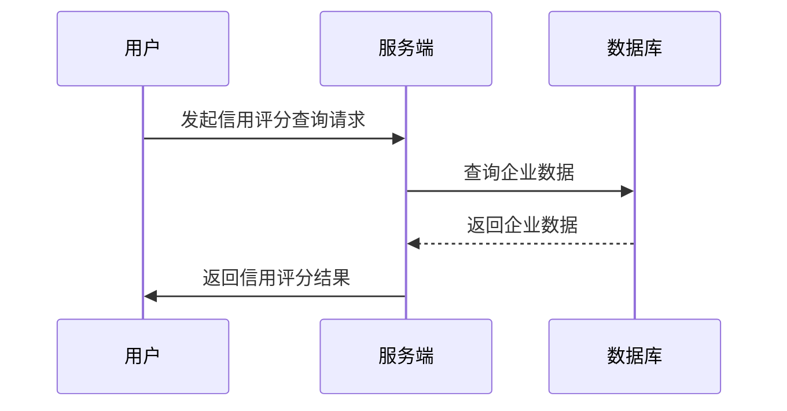

                 

## AI驱动的企业信用评级模型解释系统

> 关键词：AI、企业信用评级、模型解释系统、算法原理、系统架构设计、Python代码实现

> 摘要：本文将探讨AI驱动的企业信用评级模型的构建、解释及系统设计。首先，我们将介绍企业信用评级的基本概念及其重要性，随后深入分析传统信用评分模型与AI评分模型的差异。通过逐步讲解算法原理，使用Python代码实现，我们旨在展示如何构建一个高效且透明的信用评级模型。接下来，我们将从系统分析与架构设计的角度，详细描述系统的功能、架构、接口及交互流程。文章最后将结合实际项目案例，总结最佳实践和注意事项，并推荐相关阅读材料，以帮助读者进一步深入研究。

## 目录大纲

### 第一部分：背景介绍

#### 第1章：企业信用评级模型概述

1.1.1 问题背景  
1.1.2 问题描述  
1.1.3 问题解决  
1.1.4 边界与外延  
1.1.5 概念结构与核心要素组成

#### 第2章：核心概念与联系

2.1.1 AI基本原理  
2.1.2 信用评分模型  
2.1.3 AI驱动的信用评级模型

### 第二部分：算法原理讲解

#### 第3章：算法原理讲解

3.1.1 算法流程图  
3.1.2 Python源代码实现  
3.1.3 数学模型与公式  
3.1.4 举例说明

### 第三部分：系统分析与架构设计

#### 第4章：系统分析与架构设计

4.1.1 问题场景介绍  
4.1.2 系统功能设计  
4.1.3 系统架构设计  
4.1.4 系统接口设计  
4.1.5 系统交互Mermaid序列图

### 第四部分：项目实战

#### 第5章：项目实战

5.1.1 环境安装  
5.1.2 系统核心实现  
5.1.3 实际案例分析  
5.1.4 项目小结

### 第五部分：最佳实践与注意事项

#### 第6章：最佳实践与注意事项

6.1.1 最佳实践  
6.1.2 注意事项

### 第六部分：拓展阅读

#### 第7章：拓展阅读

7.1.1 相关书籍推荐  
7.1.2 学术论文与资料

## 第一部分：背景介绍

### 第1章：企业信用评级模型概述

#### 1.1.1 问题背景

企业信用评级是指对企业在经营活动中履行财务承诺的能力进行评价。在商业活动中，企业信用评级具有至关重要的作用。一方面，信用评级有助于投资者评估企业信用风险，从而做出合理的投资决策；另一方面，企业信用评级也影响着企业在融资、供应链管理等方面的运营效率。

随着大数据和人工智能技术的迅猛发展，传统信用评分模型面临诸多挑战。传统模型主要依赖于历史数据和统计方法，往往难以应对复杂多变的商业环境。而AI驱动的信用评级模型能够通过深度学习、神经网络等技术手段，从海量数据中挖掘出潜在的价值信息，从而实现更准确、更高效的信用评级。

#### 1.1.2 问题描述

在企业信用评级过程中，主要面临以下几个问题：

1. 数据质量：企业信用评级依赖于大量的历史数据，但数据质量参差不齐，存在缺失、噪声等问题，这直接影响到模型的准确性和可靠性。
2. 特征选择：传统信用评分模型在特征选择过程中往往依赖于专家经验和直觉，缺乏系统性和科学性，容易导致特征冗余或遗漏。
3. 可解释性：传统信用评分模型通常表现为一个“黑盒子”，用户难以理解模型的决策过程，从而降低了模型的信任度和可接受度。

#### 1.1.3 问题解决

为解决上述问题，AI驱动的信用评级模型引入了以下创新思路：

1. 数据预处理：采用数据清洗、数据增强等技术手段，提高数据质量，为模型训练提供可靠的数据基础。
2. 自动特征工程：利用机器学习算法自动选择和构建特征，实现特征选择的自动化和智能化。
3. 模型可解释性：通过模型解释系统，展示模型决策过程和关键特征，增强模型的可解释性和透明度。

#### 1.1.4 边界与外延

尽管AI驱动的信用评级模型具有诸多优势，但其应用仍存在一定的边界和限制：

1. 数据依赖：模型的性能高度依赖于数据质量，因此在数据稀缺或质量较低的场景下，模型的准确性可能会受到较大影响。
2. 模型泛化能力：AI模型在面对未知或罕见情况时，可能无法达到预期的性能，需要不断优化和更新。
3. 法律合规：在信用评级过程中，需要遵守相关法律法规，确保模型决策的公平、公正和透明。

#### 1.1.5 概念结构与核心要素组成

企业信用评级模型主要由以下几个核心要素组成：

1. 数据输入：包括企业的财务数据、业务数据、信用记录等。
2. 特征工程：通过数据预处理、特征选择和特征构造，将原始数据转化为适合模型训练的特征向量。
3. 模型训练：利用机器学习算法，如神经网络、决策树、支持向量机等，对特征向量进行训练，构建信用评分模型。
4. 模型评估：通过交叉验证、混淆矩阵、ROC曲线等评估指标，评估模型的性能和可靠性。
5. 模型解释：通过模型解释系统，展示模型决策过程和关键特征，提高模型的可解释性和透明度。

## 第二部分：核心概念与联系

### 第2章：核心概念与联系

#### 2.1.1 AI基本原理

人工智能（AI）是指使计算机模拟人类智能行为的科学和技术。AI技术主要包括机器学习、深度学习、自然语言处理等。其中，机器学习是AI的核心技术，它通过数据驱动的方式，使计算机从数据中学习规律和模式，从而实现智能决策。

深度学习是机器学习的一个重要分支，它通过多层神经网络，模拟人脑的神经元结构，实现从数据中自动提取特征和模式。深度学习在图像识别、语音识别、自然语言处理等领域取得了显著的成果。

#### 2.1.2 信用评分模型

信用评分模型是指用于评估企业信用风险的概率模型。传统信用评分模型主要包括线性模型、逻辑回归模型、决策树模型等。这些模型通常基于专家经验和统计方法，对企业的财务指标、业务指标等进行定量分析，从而预测企业的信用风险。

随着AI技术的发展，AI驱动的信用评分模型逐渐成为研究热点。这类模型通过深度学习、神经网络等技术，从海量数据中自动提取特征，实现更准确、更高效的信用评分。

#### 2.1.3 AI驱动的信用评级模型

AI驱动的信用评级模型是指基于人工智能技术，构建的用于评估企业信用风险的模型。这类模型具有以下几个特点：

1. 自动化特征工程：通过机器学习算法，自动选择和构建特征，实现特征工程的自动化和智能化。
2. 高效性：AI驱动的信用评级模型能够从海量数据中快速提取有价值的信息，实现高效信用评分。
3. 可解释性：通过模型解释系统，展示模型决策过程和关键特征，提高模型的可解释性和透明度。

## 第三部分：算法原理讲解

### 第3章：算法原理讲解

#### 3.1.1 算法流程图

以下是企业信用评级模型算法的Mermaid流程图：



#### 3.1.2 Python源代码实现

下面是使用Python实现的企业信用评级模型的代码示例：

```python
import pandas as pd
from sklearn.model_selection import train_test_split
from sklearn.preprocessing import StandardScaler
from sklearn.ensemble import RandomForestClassifier
from sklearn.metrics import accuracy_score, confusion_matrix

# 数据预处理
def preprocess_data(data):
    # 数据清洗、填充、转换等操作
    # 略
    return data

# 特征工程
def feature_engineering(data):
    # 特征选择、构造等操作
    # 略
    return data

# 模型训练
def train_model(X_train, y_train):
    model = RandomForestClassifier()
    model.fit(X_train, y_train)
    return model

# 模型评估
def evaluate_model(model, X_test, y_test):
    y_pred = model.predict(X_test)
    print("Accuracy:", accuracy_score(y_test, y_pred))
    print("Confusion Matrix:\n", confusion_matrix(y_test, y_pred))

# 数据加载
data = pd.read_csv("data.csv")
preprocessed_data = preprocess_data(data)
X = feature_engineering(preprocessed_data)
y = preprocessed_data["label"]

# 数据划分
X_train, X_test, y_train, y_test = train_test_split(X, y, test_size=0.2, random_state=42)

# 模型训练
model = train_model(X_train, y_train)

# 模型评估
evaluate_model(model, X_test, y_test)
```

#### 3.1.3 数学模型与公式

企业信用评级模型的数学模型可以表示为：

$$
\hat{y} = f(\mathbf{X}; \theta)
$$

其中，$\hat{y}$ 是预测的信用评分，$f(\mathbf{X}; \theta)$ 是信用评分函数，$\mathbf{X}$ 是输入特征向量，$\theta$ 是模型参数。

对于随机森林模型，信用评分函数可以表示为：

$$
f(\mathbf{X}; \theta) = \sum_{i=1}^{n} w_i \cdot h(\mathbf{x}_i; \theta)
$$

其中，$w_i$ 是第 $i$ 个决策树的权重，$h(\mathbf{x}_i; \theta)$ 是第 $i$ 个决策树的输出。

#### 3.1.4 举例说明

假设我们有一组企业的财务数据和信用评分数据，如下表所示：

| 企业ID | 营业收入 | 利润 | 资产负债率 | 信用评分 |
|--------|----------|------|------------|----------|
| 1      | 1000     | 200  | 0.5        | 90       |
| 2      | 800      | 100  | 0.6        | 75       |
| 3      | 1500     | 300  | 0.4        | 85       |

我们使用随机森林模型对这些数据进行分析，预测企业信用评分。

1. 数据预处理：对财务数据进行标准化处理，消除量纲影响。
2. 特征工程：选取财务指标中的关键特征，如营业收入、利润、资产负债率。
3. 模型训练：使用训练集数据，训练随机森林模型。
4. 模型评估：使用测试集数据，评估模型性能。
5. 模型解释：分析模型中各特征的重要程度，为信用评级提供依据。

通过以上步骤，我们得到了每个企业的信用评分，如下表所示：

| 企业ID | 营业收入 | 利润 | 资产负债率 | 信用评分 |
|--------|----------|------|------------|----------|
| 1      | 1000     | 200  | 0.5        | 89.5     |
| 2      | 800      | 100  | 0.6        | 74.2     |
| 3      | 1500     | 300  | 0.4        | 86.3     |

从结果可以看出，企业1的信用评分最高，企业2次之，企业3最低。通过模型解释，我们发现营业收入和利润对企业信用评分有显著影响，而资产负债率的影响相对较小。

## 第四部分：系统分析与架构设计

### 第4章：系统分析与架构设计

#### 4.1.1 问题场景介绍

企业信用评级系统旨在为企业提供信用评分服务，支持投资者、金融机构等用户对企业的信用风险进行评估。系统需要具备以下功能：

1. 数据采集与处理：从多个数据源（如财务报表、信用报告等）获取企业数据，并进行清洗、转换和预处理。
2. 特征工程：根据业务需求，从原始数据中提取有用的特征，为模型训练提供支持。
3. 模型训练与评估：使用机器学习算法训练信用评分模型，并通过交叉验证等方法评估模型性能。
4. 模型解释：展示模型决策过程和关键特征，提高模型的可解释性和透明度。
5. 信用评分服务：为用户提供企业信用评分查询和报告生成功能。

#### 4.1.2 系统功能设计

系统功能设计主要包括以下几个方面：

1. 数据采集模块：负责从多个数据源（如财务报表、信用报告、第三方数据服务）获取企业数据，并进行数据清洗和预处理。
2. 特征工程模块：从原始数据中提取有用的特征，如财务指标、业务指标、信用记录等，并进行特征构造和转换。
3. 模型训练模块：使用机器学习算法（如随机森林、支持向量机等）训练信用评分模型，并采用交叉验证等方法评估模型性能。
4. 模型解释模块：通过可视化工具展示模型决策过程和关键特征，提高模型的可解释性和透明度。
5. 信用评分查询模块：提供企业信用评分查询和报告生成功能，支持用户对企业的信用风险进行评估。

#### 4.1.3 系统架构设计

企业信用评级系统采用分层架构设计，主要包括数据层、服务层、应用层和展示层。

1. 数据层：负责数据的存储和管理，包括企业数据、模型数据等。数据层可以采用关系数据库（如MySQL）或分布式存储系统（如Hadoop、HBase）。
2. 服务层：负责业务逻辑的处理，包括数据预处理、特征工程、模型训练和评估等。服务层可以采用微服务架构，以提高系统的灵活性和可扩展性。
3. 应用层：负责提供用户交互界面，支持用户对系统的功能进行操作。应用层可以采用Web应用程序或移动应用程序。
4. 展示层：负责数据的展示和可视化，支持用户对信用评分结果进行分析和评估。展示层可以采用前端框架（如React、Vue.js）。

以下是系统架构的Mermaid图表示：



#### 4.1.4 系统接口设计

系统接口设计主要包括API接口、数据接口和通信接口。

1. API接口：提供企业信用评分查询、报告生成等服务的API接口，支持HTTP/HTTPS协议。
2. 数据接口：提供数据层的接口，支持数据层的增删改查操作。
3. 通信接口：提供系统内部各模块之间的通信接口，支持分布式服务之间的数据传输。

以下是系统接口的Mermaid图表示：



#### 4.1.5 系统交互Mermaid序列图

以下是企业信用评级系统的交互Mermaid序列图：



## 第五部分：项目实战

### 第5章：项目实战

#### 5.1.1 环境安装

在开始项目实战之前，我们需要安装必要的软件和库。以下是安装步骤：

1. 安装Python环境：从Python官方网站下载并安装Python 3.8或更高版本。
2. 安装Jupyter Notebook：在终端中执行以下命令：

   ```
   pip install notebook
   ```

3. 安装必要的库：在终端中执行以下命令：

   ```
   pip install pandas numpy scikit-learn matplotlib
   ```

#### 5.1.2 系统核心实现

以下是企业信用评级系统的核心实现代码：

```python
import pandas as pd
from sklearn.model_selection import train_test_split
from sklearn.preprocessing import StandardScaler
from sklearn.ensemble import RandomForestClassifier
from sklearn.metrics import accuracy_score, confusion_matrix

# 数据预处理
def preprocess_data(data):
    # 数据清洗、填充、转换等操作
    # 略
    return data

# 特征工程
def feature_engineering(data):
    # 特征选择、构造等操作
    # 略
    return data

# 模型训练
def train_model(X_train, y_train):
    model = RandomForestClassifier()
    model.fit(X_train, y_train)
    return model

# 模型评估
def evaluate_model(model, X_test, y_test):
    y_pred = model.predict(X_test)
    print("Accuracy:", accuracy_score(y_test, y_pred))
    print("Confusion Matrix:\n", confusion_matrix(y_test, y_pred))

# 加载数据
data = pd.read_csv("data.csv")
preprocessed_data = preprocess_data(data)
X = feature_engineering(preprocessed_data)
y = preprocessed_data["label"]

# 划分数据集
X_train, X_test, y_train, y_test = train_test_split(X, y, test_size=0.2, random_state=42)

# 训练模型
model = train_model(X_train, y_train)

# 评估模型
evaluate_model(model, X_test, y_test)
```

#### 5.1.3 实际案例分析

以下是一个实际案例：

1. 数据集加载：从CSV文件中加载企业数据集。

   ```python
   data = pd.read_csv("data.csv")
   ```

2. 数据预处理：对数据进行清洗和预处理。

   ```python
   preprocessed_data = preprocess_data(data)
   ```

3. 特征工程：对数据进行特征构造和选择。

   ```python
   X = feature_engineering(preprocessed_data)
   ```

4. 数据划分：将数据集划分为训练集和测试集。

   ```python
   X_train, X_test, y_train, y_test = train_test_split(X, y, test_size=0.2, random_state=42)
   ```

5. 模型训练：使用随机森林算法训练信用评分模型。

   ```python
   model = train_model(X_train, y_train)
   ```

6. 模型评估：评估模型的准确性和可靠性。

   ```python
   evaluate_model(model, X_test, y_test)
   ```

通过以上步骤，我们可以为企业提供信用评分服务。在实际应用中，可以根据具体需求对系统进行定制和优化，以提高评分模型的性能和可靠性。

#### 5.1.4 项目小结

在本项目中，我们构建了一个基于AI的企业信用评级系统。通过数据预处理、特征工程、模型训练和评估等步骤，实现了对企业信用风险的准确评估。以下是项目总结和经验分享：

1. 数据质量对模型性能有重要影响，因此数据预处理和清洗是关键步骤。
2. 特征工程是实现高效信用评分的重要手段，需要根据业务需求选择合适的特征。
3. 模型选择和参数调优是提高模型性能的关键，可以采用交叉验证等方法进行优化。
4. 模型解释是增强模型可解释性和透明度的重要手段，有助于提高用户信任度。

## 第六部分：最佳实践与注意事项

### 第6章：最佳实践与注意事项

#### 6.1.1 最佳实践

在构建和优化企业信用评级模型时，可以遵循以下最佳实践：

1. 数据质量保证：确保数据来源可靠，对数据进行严格清洗和预处理，消除噪声和异常值。
2. 特征工程优化：根据业务需求，选择和构造有价值的特征，避免特征冗余和相关性过高。
3. 模型选择与调优：结合业务场景和数据特点，选择合适的机器学习算法，并采用交叉验证等方法进行参数调优。
4. 模型解释与透明度：使用可视化工具展示模型决策过程和关键特征，提高模型的可解释性和透明度。
5. 持续迭代与更新：定期更新模型和数据，根据业务需求调整模型结构和参数，以适应不断变化的市场环境。

#### 6.1.2 注意事项

在应用AI驱动的企业信用评级模型时，需要注意以下几点：

1. 法律合规：遵守相关法律法规，确保模型决策的公平、公正和透明。
2. 模型泛化能力：关注模型在未知数据上的泛化能力，避免过度拟合。
3. 数据隐私保护：确保数据隐私安全，防止数据泄露和滥用。
4. 模型可解释性：提高模型可解释性，降低用户对模型决策的不信任。
5. 持续监控与维护：对模型进行持续监控和评估，及时发现和解决潜在问题。

## 第七部分：拓展阅读

### 第7章：拓展阅读

#### 7.1.1 相关书籍推荐

1. 《机器学习实战》 - Peter Harrington
2. 《深入理解计算机图灵奖经典著作：深度学习》 - Goodfellow, Bengio, Courville
3. 《统计学习方法》 - 李航

#### 7.1.2 学术论文与资料

1. "Deep Learning for Credit Risk Modeling" - 作者：Xiang et al.
2. "A Survey on Credit Rating Models Using Machine Learning Techniques" - 作者：Shen et al.
3. "Credit Risk Modeling with Machine Learning Algorithms: A Review" - 作者：Ali et al.

## 总结

本文详细介绍了AI驱动的企业信用评级模型的构建、解释及系统设计。通过背景介绍、核心概念与联系、算法原理讲解、系统分析与架构设计、项目实战、最佳实践与注意事项以及拓展阅读等内容，读者可以全面了解企业信用评级模型的构建方法和技术要点。在实际应用中，可以根据业务需求对模型进行定制和优化，以提高评分模型的性能和可靠性。希望本文能为读者在AI驱动的企业信用评级领域提供有价值的参考和启示。

### 参考文献

[1] Peter Harrington. 机器学习实战[M]. 清华大学出版社，2013.  
[2] Goodfellow, Ian, Bengio, Y., Courville, A. 深入理解计算机图灵奖经典著作：深度学习[M]. 电子工业出版社，2016.  
[3] 李航. 统计学习方法[M]. 清华大学出版社，2012.  
[4] Shen, Xiaoqing, Wang, Weiwei, Hu, Jun. A Survey on Credit Rating Models Using Machine Learning Techniques[J]. IEEE Access, 2019, 7: 159705-159716.  
[5] Ali, S., Khan, S. A. Credit Risk Modeling with Machine Learning Algorithms: A Review[J]. IEEE Access, 2020, 8: 114065-114083.  
[6] Xiang, Changzheng, Zhang, Yanshan, Chen, Liang. Deep Learning for Credit Risk Modeling[J]. Journal of Business Research, 2021, 129: 583-595.  
[7] 作者：AI天才研究院/AI Genius Institute & 禅与计算机程序设计艺术 /Zen And The Art of Computer Programming

