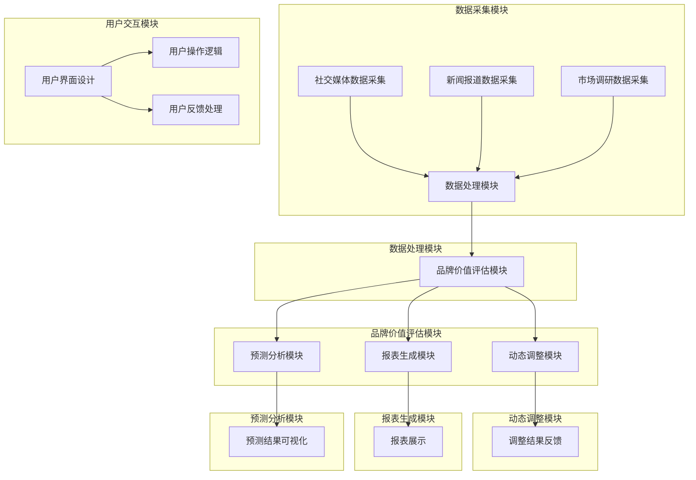

                 

# AI驱动的企业品牌价值动态量化系统

> 关键词：AI、企业品牌价值、动态量化、系统架构、机器学习、深度学习、自然语言处理

> 摘要：本文将深入探讨AI驱动的企业品牌价值动态量化系统的构建方法。通过分析系统概述、AI基础、系统架构设计、AI在品牌价值评估中的应用和项目实战，详细讲解如何利用AI技术实现企业品牌价值的动态量化，以帮助企业更好地理解和管理其品牌价值。

## 目录大纲

----------------------------------------------------------------

1. 第一部分：AI驱动的企业品牌价值动态量化系统概述
   - 1.1 问题背景
     - 1.1.1 企业品牌价值的重要性
     - 1.1.2 品牌价值评估的难点与挑战
     - 1.1.3 动态量化系统的需求与意义
   - 1.2 核心概念
     - 1.2.1 AI与品牌价值动态量化
     - 1.2.2 动态量化系统的组成
     - 1.2.3 品牌价值动态量化流程
   - 1.3 系统边界与外延
     - 1.3.1 系统功能边界
     - 1.3.2 系统适用范围
     - 1.3.3 系统与其他系统的关系
   - 1.4 本章小结

2. 第二部分：AI基础
   - 2.1 AI概述
     - 2.1.1 AI的定义与发展历程
     - 2.1.2 AI的核心技术
     - 2.1.3 AI的应用领域
   - 2.2 机器学习
     - 2.2.1 机器学习的定义与方法
     - 2.2.2 常见机器学习算法
     - 2.2.3 机器学习在品牌价值评估中的应用
   - 2.3 深度学习
     - 2.3.1 深度学习的定义与发展
     - 2.3.2 深度学习的关键技术
     - 2.3.3 深度学习在品牌价值评估中的应用
   - 2.4 自然语言处理
     - 2.4.1 自然语言处理的定义与任务
     - 2.4.2 常用自然语言处理技术
     - 2.4.3 自然语言处理在品牌价值评估中的应用
   - 2.5 AI在其他领域的应用
     - 2.5.1 计算机视觉
     - 2.5.2 机器人技术
     - 2.5.3 自动驾驶
   - 2.6 本章小结

3. 第三部分：品牌价值动态量化系统架构设计
   - 3.1 系统需求分析
     - 3.1.1 系统目标
     - 3.1.2 用户需求
     - 3.1.3 功能需求
   - 3.2 系统架构设计
     - 3.2.1 系统架构概述
     - 3.2.2 系统模块划分
     - 3.2.3 系统架构图
   - 3.3 数据处理模块
     - 3.3.1 数据采集与预处理
     - 3.3.2 数据存储与管理
     - 3.3.3 数据分析模块
   - 3.4 品牌价值评估模块
     - 3.4.1 评估指标体系
     - 3.4.2 评估模型构建
     - 3.4.3 评估结果分析
   - 3.5 动态调整模块
     - 3.5.1 动态调整机制
     - 3.5.2 调整策略与算法
     - 3.5.3 调整结果反馈
   - 3.6 系统接口设计与实现
     - 3.6.1 用户接口设计
     - 3.6.2 数据接口设计
     - 3.6.3 系统接口安全性
   - 3.7 本章小结

4. 第四部分：AI在品牌价值动态量化中的应用
   - 4.1 机器学习算法在品牌价值评估中的应用
     - 4.1.1 机器学习算法简介
     - 4.1.2 品牌价值评估中的常用机器学习算法
     - 4.1.3 实际案例解析
   - 4.2 深度学习在品牌价值评估中的应用
     - 4.2.1 深度学习算法简介
     - 4.2.2 品牌价值评估中的深度学习算法
     - 4.2.3 实际案例解析
   - 4.3 自然语言处理在品牌价值评估中的应用
     - 4.3.1 自然语言处理算法简介
     - 4.3.2 品牌价值评估中的自然语言处理算法
     - 4.3.3 实际案例解析
   - 4.4 计算机视觉在品牌价值评估中的应用
     - 4.4.1 计算机视觉算法简介
     - 4.4.2 品牌价值评估中的计算机视觉算法
     - 4.4.3 实际案例解析
   - 4.5 其他AI技术在品牌价值评估中的应用
     - 4.5.1 机器人技术在品牌价值评估中的应用
     - 4.5.2 自动驾驶技术在品牌价值评估中的应用
     - 4.5.3 实际案例解析
   - 4.6 本章小结

5. 第五部分：项目实战
   - 5.1 项目背景
     - 5.1.1 项目介绍
     - 5.1.2 系统功能设计
     - 5.1.3 系统架构设计
   - 5.2 系统核心实现源代码
     - 5.2.1 环境安装
     - 5.2.2 系统核心代码
     - 5.2.3 代码应用解读与分析
   - 5.3 实际案例分析
     - 5.3.1 案例背景
     - 5.3.2 案例分析
     - 5.3.3 剖析与总结
   - 5.4 项目小结
   - 5.5 最佳实践 tips
   - 5.6 小结
   - 5.7 注意事项
   - 5.8 拓展阅读

----------------------------------------------------------------

## 1. 第一部分：AI驱动的企业品牌价值动态量化系统概述

### 1.1 问题背景

#### 1.1.1 企业品牌价值的重要性

在当今全球化竞争日益激烈的市场环境中，企业品牌价值已成为企业在市场上取得竞争优势的关键因素。品牌价值不仅反映了企业的市场地位和声誉，还直接影响到企业的盈利能力和持续发展。

品牌价值的重要性体现在以下几个方面：

1. **提高市场占有率**：强大的品牌价值有助于企业吸引更多的消费者，提高市场份额。
2. **提升品牌影响力**：品牌价值越高，企业的社会认可度越高，品牌影响力也越强。
3. **增加企业估值**：品牌价值是评估企业资产的重要指标，对企业的估值和并购活动具有重要影响。
4. **提升员工凝聚力**：强大的品牌价值有助于吸引和留住优秀人才，提高员工的工作满意度和忠诚度。

#### 1.1.2 品牌价值评估的难点与挑战

尽管品牌价值对企业至关重要，但对其评估却面临诸多难点和挑战。

1. **量化困难**：品牌价值是一个抽象的概念，难以用具体的量化指标来衡量。
2. **数据获取困难**：品牌价值评估需要大量的数据支持，但很多数据难以获取或处理。
3. **评估方法多样**：目前市面上存在多种品牌价值评估方法，各有利弊，难以统一。
4. **动态性**：品牌价值受市场环境、消费者偏好等多种因素影响，具有动态性，评估难度较大。

#### 1.1.3 动态量化系统的需求与意义

为了解决上述问题，企业迫切需要一种能够动态量化品牌价值的方法。AI驱动的企业品牌价值动态量化系统应运而生。

1. **解决量化困难**：AI技术可以处理大量复杂数据，为品牌价值量化提供技术支持。
2. **提高评估效率**：AI算法能够快速处理数据，缩短评估周期，提高评估效率。
3. **动态调整能力**：AI驱动的系统能够实时监控市场环境变化，动态调整品牌价值评估结果。
4. **提高评估准确性**：AI算法可以基于大量数据训练，提高评估结果的准确性。

### 1.2 核心概念

#### 1.2.1 AI与品牌价值动态量化

AI（人工智能）是一种模拟人类智能的技术，包括机器学习、深度学习、自然语言处理等子领域。品牌价值动态量化是指通过AI技术对企业的品牌价值进行实时监测、评估和调整。

#### 1.2.2 动态量化系统的组成

动态量化系统通常由以下几个部分组成：

1. **数据采集模块**：负责收集与企业品牌价值相关的各种数据。
2. **数据处理模块**：对采集到的数据进行预处理、存储和管理。
3. **评估模型模块**：构建评估模型，对品牌价值进行量化评估。
4. **动态调整模块**：根据市场环境和消费者行为变化，动态调整品牌价值评估结果。

#### 1.2.3 品牌价值动态量化流程

品牌价值动态量化流程通常包括以下几个步骤：

1. **数据采集**：收集与企业品牌价值相关的数据，包括市场数据、消费者数据、企业运营数据等。
2. **数据处理**：对采集到的数据进行预处理、清洗和存储。
3. **评估模型构建**：基于预处理后的数据，构建评估模型，进行品牌价值量化评估。
4. **结果反馈**：将评估结果反馈给企业，帮助企业调整品牌策略。

### 1.3 系统边界与外延

#### 1.3.1 系统功能边界

系统功能主要包括：

1. **数据采集与处理**：采集和处理与企业品牌价值相关的各种数据。
2. **品牌价值评估**：基于AI算法，对品牌价值进行量化评估。
3. **动态调整**：根据市场环境和消费者行为变化，动态调整品牌价值评估结果。

#### 1.3.2 系统适用范围

系统适用于各类企业，包括传统企业、互联网企业、跨国企业等，能够满足不同规模和行业企业的需求。

#### 1.3.3 系统与其他系统的关系

系统可以与企业现有的CRM系统、ERP系统等集成，实现数据共享和协同工作。

### 1.4 本章小结

本文首先介绍了企业品牌价值的重要性以及当前品牌价值评估面临的难点和挑战。接着，提出了AI驱动的企业品牌价值动态量化系统的概念，并详细阐述了其核心概念、组成和流程。最后，讨论了系统的功能边界、适用范围和与其他系统的关系。通过本文的介绍，读者可以初步了解AI驱动的企业品牌价值动态量化系统，为后续章节的深入探讨打下基础。## 2. 第二部分：AI基础

### 2.1 AI概述

#### 2.1.1 AI的定义与发展历程

人工智能（Artificial Intelligence，简称AI）是指通过计算机模拟人类智能的技术，使计算机具备感知、学习、推理、决策等能力。AI的研究可以追溯到20世纪50年代，当时的研究主要集中在符号主义和逻辑推理方面。随着计算能力的提升和数据量的增加，AI在20世纪80年代进入了一个快速发展期，特别是在机器学习和神经网络领域取得了重要突破。

#### 2.1.2 AI的核心技术

AI的核心技术包括：

1. **机器学习（Machine Learning）**：通过算法从数据中自动学习规律，进行模式识别和预测。
2. **深度学习（Deep Learning）**：基于多层神经网络，通过大量数据训练，实现复杂的特征学习和模式识别。
3. **自然语言处理（Natural Language Processing，NLP）**：使计算机能够理解和生成人类语言，实现语音识别、机器翻译等功能。
4. **计算机视觉（Computer Vision）**：使计算机能够理解并处理图像和视频，实现物体检测、图像识别等功能。

#### 2.1.3 AI的应用领域

AI技术已广泛应用于各个领域，主要包括：

1. **金融**：风险控制、欺诈检测、量化交易等。
2. **医疗**：疾病诊断、药物研发、医疗影像分析等。
3. **制造业**：自动化生产线、机器人、质量检测等。
4. **零售**：个性化推荐、购物助手、供应链优化等。
5. **交通**：自动驾驶、智能交通系统、物流优化等。

### 2.2 机器学习

#### 2.2.1 机器学习的定义与方法

机器学习（Machine Learning，ML）是AI的核心技术之一，主要研究如何从数据中学习规律，进行预测和决策。机器学习的方法可以分为以下几类：

1. **监督学习（Supervised Learning）**：通过已有标注数据训练模型，然后对新数据进行预测。
2. **无监督学习（Unsupervised Learning）**：没有标注数据，通过挖掘数据内在结构进行聚类、降维等操作。
3. **半监督学习（Semi-Supervised Learning）**：结合标注数据和未标注数据，提高模型性能。
4. **强化学习（Reinforcement Learning）**：通过与环境交互，学习最优策略。

#### 2.2.2 常见机器学习算法

常见的机器学习算法包括：

1. **线性回归（Linear Regression）**：用于预测线性关系。
2. **逻辑回归（Logistic Regression）**：用于分类问题。
3. **支持向量机（Support Vector Machine，SVM）**：用于分类和回归问题。
4. **决策树（Decision Tree）**：用于分类和回归问题。
5. **随机森林（Random Forest）**：基于决策树的集成学习方法。
6. **神经网络（Neural Network）**：用于复杂模式识别和预测。

#### 2.2.3 机器学习在品牌价值评估中的应用

在品牌价值评估中，机器学习技术可以用于以下方面：

1. **数据预处理**：对品牌相关数据进行清洗、归一化等预处理，提高数据质量。
2. **特征提取**：从原始数据中提取与品牌价值相关的特征。
3. **模型训练**：利用机器学习算法训练模型，预测品牌价值。
4. **结果分析**：对评估结果进行分析，为企业提供决策支持。

### 2.3 深度学习

#### 2.3.1 深度学习的定义与发展

深度学习（Deep Learning，DL）是一种基于多层神经网络的学习方法，通过大量数据训练，自动提取特征并进行复杂模式识别。深度学习的发展可以追溯到20世纪80年代，但直到2012年，AlexNet在ImageNet竞赛中取得突破性成绩后，深度学习才得到广泛关注。

#### 2.3.2 深度学习的关键技术

深度学习的关键技术包括：

1. **神经网络（Neural Network）**：深度学习的基础，通过模拟人脑神经元结构进行信息处理。
2. **卷积神经网络（Convolutional Neural Network，CNN）**：适用于图像和视频处理。
3. **循环神经网络（Recurrent Neural Network，RNN）**：适用于序列数据处理。
4. **生成对抗网络（Generative Adversarial Network，GAN）**：用于生成复杂数据。

#### 2.3.3 深度学习在品牌价值评估中的应用

在品牌价值评估中，深度学习技术可以用于：

1. **图像识别**：用于分析品牌形象、广告效果等。
2. **语音识别**：用于分析消费者反馈、品牌口碑等。
3. **文本分析**：用于提取品牌相关关键词、情感倾向等。
4. **预测分析**：利用深度学习模型预测品牌价值变化。

### 2.4 自然语言处理

#### 2.4.1 自然语言处理的定义与任务

自然语言处理（Natural Language Processing，NLP）是AI的一个子领域，主要研究如何使计算机理解和生成人类语言。NLP的任务包括：

1. **文本分类（Text Classification）**：将文本数据分类到预定义的类别。
2. **情感分析（Sentiment Analysis）**：分析文本中的情感倾向。
3. **实体识别（Named Entity Recognition，NER）**：识别文本中的特定实体。
4. **机器翻译（Machine Translation）**：将一种语言翻译成另一种语言。
5. **问答系统（Question Answering System）**：根据问题提供答案。

#### 2.4.2 常用自然语言处理技术

常用的NLP技术包括：

1. **词袋模型（Bag of Words，BoW）**：将文本表示为词汇的集合。
2. **词嵌入（Word Embedding）**：将词汇映射到低维空间，表示词汇的语义信息。
3. **递归神经网络（Recurrent Neural Network，RNN）**：用于处理序列数据。
4. **长短时记忆网络（Long Short-Term Memory，LSTM）**：改进RNN，解决长序列依赖问题。

#### 2.4.3 自然语言处理在品牌价值评估中的应用

在品牌价值评估中，NLP技术可以用于：

1. **社交媒体分析**：分析消费者在社交媒体上的评论，了解品牌口碑。
2. **新闻报道分析**：分析新闻报道，了解品牌在媒体中的形象。
3. **客户反馈分析**：分析客户反馈，了解消费者对品牌的满意度。
4. **文本生成**：生成品牌宣传文案、广告语等。

### 2.5 AI在其他领域的应用

#### 2.5.1 计算机视觉

计算机视觉（Computer Vision）是AI的一个分支，主要研究如何使计算机理解并处理图像和视频。计算机视觉在以下领域有广泛应用：

1. **自动驾驶**：用于车辆感知、路径规划等。
2. **人脸识别**：用于身份验证、安防监控等。
3. **医疗影像分析**：用于疾病诊断、治疗方案推荐等。
4. **质量检测**：用于工业生产中的产品质量检测。

#### 2.5.2 机器人技术

机器人技术（Robotics）是AI与机械工程的结合，研究如何制造和利用机器人。机器人技术在以下领域有广泛应用：

1. **工业制造**：用于自动化生产线、装配、焊接等。
2. **医疗辅助**：用于手术辅助、康复训练等。
3. **家庭服务**：用于扫地、擦窗、陪伴等。
4. **救援任务**：用于灾难救援、地下探测等。

#### 2.5.3 自动驾驶

自动驾驶（Autonomous Driving）是AI在交通领域的应用，研究如何使车辆自主行驶。自动驾驶技术在以下领域有广泛应用：

1. **无人驾驶出租车**：用于提供打车服务。
2. **无人驾驶货车**：用于长途货运。
3. **智能停车场**：用于车辆识别、自动泊车等。
4. **智能交通系统**：用于交通流量管理、事故预防等。

### 2.6 本章小结

本文介绍了AI的基础知识，包括AI的定义、核心技术、应用领域以及机器学习、深度学习和自然语言处理等具体技术。通过对AI基础的了解，读者可以更好地理解AI驱动的企业品牌价值动态量化系统的构建和应用。在后续章节中，我们将进一步探讨AI在品牌价值动态量化系统中的具体应用。## 3. 第三部分：品牌价值动态量化系统架构设计

### 3.1 系统需求分析

#### 3.1.1 系统目标

品牌价值动态量化系统的目标是实现对企业品牌价值的实时监测、评估和调整，帮助企业更好地理解和管理其品牌价值。具体目标包括：

1. **实时监测**：实时获取与企业品牌价值相关的各种数据，监测品牌价值变化。
2. **精准评估**：利用AI技术对品牌价值进行精准量化评估，提供客观、可靠的评估结果。
3. **动态调整**：根据市场环境和消费者行为变化，动态调整品牌价值评估结果，为企业提供及时、有效的决策支持。

#### 3.1.2 用户需求

系统的用户包括企业高层管理者、市场部门、品牌部门等，他们需求的功能如下：

1. **数据可视化**：提供直观的数据可视化界面，方便用户查看品牌价值变化趋势。
2. **定制化报表**：根据用户需求，生成定制化的品牌价值评估报表。
3. **预测分析**：利用AI技术，对品牌价值进行预测分析，帮助用户提前预判市场变化。
4. **智能推荐**：基于用户数据和评估结果，为企业提供品牌策略优化建议。

#### 3.1.3 功能需求

系统的主要功能需求包括：

1. **数据采集**：从多种数据源采集与企业品牌价值相关的数据，包括社交媒体、新闻报道、市场调研等。
2. **数据处理**：对采集到的数据进行预处理、清洗和存储，确保数据质量。
3. **品牌价值评估**：利用机器学习、深度学习等技术，对品牌价值进行量化评估。
4. **动态调整**：根据市场环境和消费者行为变化，动态调整品牌价值评估结果。
5. **报表生成**：根据用户需求，生成定制化的品牌价值评估报表。
6. **预测分析**：利用AI技术，对品牌价值进行预测分析，为用户提供决策支持。
7. **用户交互**：提供友好的用户界面，方便用户进行操作和查询。

### 3.2 系统架构设计

#### 3.2.1 系统架构概述

品牌价值动态量化系统采用分布式架构，主要包括以下几个模块：

1. **数据采集模块**：负责从多种数据源采集与企业品牌价值相关的数据。
2. **数据处理模块**：负责对采集到的数据进行预处理、清洗和存储。
3. **品牌价值评估模块**：负责利用AI技术对品牌价值进行量化评估。
4. **动态调整模块**：负责根据市场环境和消费者行为变化，动态调整品牌价值评估结果。
5. **报表生成模块**：负责根据用户需求，生成定制化的品牌价值评估报表。
6. **预测分析模块**：负责利用AI技术，对品牌价值进行预测分析。
7. **用户交互模块**：负责提供友好的用户界面，方便用户进行操作和查询。

#### 3.2.2 系统模块划分

系统模块划分如下：

1. **数据采集模块**：包括社交媒体数据采集、新闻报道数据采集、市场调研数据采集等子模块。
2. **数据处理模块**：包括数据预处理、数据清洗、数据存储等子模块。
3. **品牌价值评估模块**：包括评估指标体系构建、评估模型构建、评估结果分析等子模块。
4. **动态调整模块**：包括动态调整机制、调整策略与算法、调整结果反馈等子模块。
5. **报表生成模块**：包括报表模板设计、报表生成、报表展示等子模块。
6. **预测分析模块**：包括预测模型构建、预测结果分析、预测结果可视化等子模块。
7. **用户交互模块**：包括用户界面设计、用户操作逻辑、用户反馈处理等子模块。

#### 3.2.3 系统架构图

系统架构图如下：



### 3.3 数据处理模块

#### 3.3.1 数据采集与预处理

数据采集与预处理是品牌价值动态量化系统的重要环节，主要包括以下步骤：

1. **数据采集**：从社交媒体、新闻报道、市场调研等多个渠道采集与企业品牌价值相关的数据。
2. **数据清洗**：去除重复数据、缺失数据和噪声数据，确保数据质量。
3. **数据预处理**：对文本数据进行分词、去停用词、词性标注等操作，对数值数据进行归一化、标准化等操作。

#### 3.3.2 数据存储与管理

数据存储与管理包括以下内容：

1. **数据存储**：将处理后的数据存储在数据库中，方便后续查询和使用。
2. **数据管理**：对存储的数据进行分类、标签管理等操作，方便数据管理和维护。

#### 3.3.3 数据分析模块

数据分析模块包括以下功能：

1. **特征提取**：从原始数据中提取与品牌价值相关的特征，如关键词、情感倾向、话题分布等。
2. **数据可视化**：通过图表、报表等形式，展示数据分析结果，方便用户理解和分析。

### 3.4 品牌价值评估模块

#### 3.4.1 评估指标体系

评估指标体系是品牌价值评估的核心，主要包括以下指标：

1. **市场占有率**：品牌在市场中的占有率，反映品牌的市场地位。
2. **消费者满意度**：消费者对品牌的满意度，反映品牌的口碑和消费者忠诚度。
3. **品牌认知度**：消费者对品牌的认知程度，反映品牌的影响力和知名度。
4. **品牌忠诚度**：消费者对品牌的忠诚程度，反映品牌的用户粘性。
5. **品牌资产**：品牌所拥有的无形资产，如商标、专利、品牌价值等。

#### 3.4.2 评估模型构建

评估模型构建主要包括以下步骤：

1. **模型选择**：根据评估指标体系，选择合适的评估模型，如线性回归、决策树、神经网络等。
2. **模型训练**：利用历史数据训练模型，使模型学会根据输入特征预测品牌价值。
3. **模型优化**：通过交叉验证、调整超参数等方法，优化模型性能。

#### 3.4.3 评估结果分析

评估结果分析主要包括以下内容：

1. **结果展示**：通过图表、报表等形式，展示评估结果，方便用户理解。
2. **结果解释**：对评估结果进行解释，分析品牌价值的驱动因素和潜在风险。
3. **结果应用**：根据评估结果，为企业提供决策支持，如品牌策略调整、市场投放优化等。

### 3.5 动态调整模块

#### 3.5.1 动态调整机制

动态调整机制主要包括以下内容：

1. **调整触发条件**：根据市场环境和消费者行为变化，设置调整触发条件。
2. **调整策略**：根据调整触发条件，制定调整策略，如增加市场投放、提高服务质量等。
3. **调整执行**：根据调整策略，执行品牌价值调整操作。

#### 3.5.2 调整策略与算法

调整策略与算法主要包括以下内容：

1. **机器学习算法**：利用机器学习算法，预测品牌价值变化趋势，制定调整策略。
2. **深度学习算法**：利用深度学习算法，分析市场环境和消费者行为，优化调整策略。
3. **自然语言处理算法**：利用自然语言处理算法，分析消费者反馈和媒体报道，调整品牌价值评估结果。

#### 3.5.3 调整结果反馈

调整结果反馈主要包括以下内容：

1. **结果展示**：通过图表、报表等形式，展示调整结果，方便用户理解。
2. **结果解释**：对调整结果进行解释，分析调整效果和潜在问题。
3. **结果应用**：根据调整结果，为企业提供决策支持，如优化品牌策略、调整市场投放等。

### 3.6 系统接口设计与实现

#### 3.6.1 用户接口设计

用户接口设计主要包括以下内容：

1. **界面布局**：设计直观、易用的用户界面，方便用户操作。
2. **交互逻辑**：设计用户与系统之间的交互逻辑，如数据查询、报表生成等。
3. **反馈机制**：设计用户反馈机制，收集用户意见，优化系统功能。

#### 3.6.2 数据接口设计

数据接口设计主要包括以下内容：

1. **数据输入输出**：设计数据输入输出接口，方便数据采集、处理和存储。
2. **数据格式**：设计统一的数据格式，确保数据在不同模块之间的传递和兼容。
3. **接口安全性**：设计数据接口的安全性，保护企业数据安全。

#### 3.6.3 系统接口安全性

系统接口安全性主要包括以下内容：

1. **身份验证**：设计用户身份验证机制，确保只有授权用户可以访问系统。
2. **权限管理**：设计用户权限管理机制，确保用户只能访问其授权的数据和功能。
3. **数据加密**：设计数据加密机制，确保数据在传输和存储过程中的安全性。

### 3.7 本章小结

本文介绍了品牌价值动态量化系统的架构设计，包括系统需求分析、系统架构设计、数据处理模块、品牌价值评估模块、动态调整模块和系统接口设计。通过系统的架构设计，企业可以实现对品牌价值的实时监测、评估和调整，从而更好地管理其品牌价值。在后续章节中，我们将进一步探讨AI技术在品牌价值动态量化系统中的应用。## 4. 第四部分：AI在品牌价值动态量化中的应用

### 4.1 机器学习算法在品牌价值评估中的应用

#### 4.1.1 机器学习算法简介

机器学习（Machine Learning，ML）是一种使计算机通过数据学习规律并进行预测或决策的技术。常见的机器学习算法包括监督学习、无监督学习、半监督学习和强化学习。在品牌价值评估中，主要使用的是监督学习和无监督学习算法。

#### 4.1.2 品牌价值评估中的常用机器学习算法

品牌价值评估中常用的机器学习算法包括以下几种：

1. **线性回归（Linear Regression）**：用于分析品牌价值与影响因素之间的线性关系，预测品牌价值。

2. **逻辑回归（Logistic Regression）**：用于分类问题，如品牌价值是否达到某个阈值。

3. **支持向量机（Support Vector Machine，SVM）**：用于分类问题，如判断品牌价值是否超过某一临界点。

4. **决策树（Decision Tree）**：用于分类和回归问题，通过树形结构表示决策过程。

5. **随机森林（Random Forest）**：基于决策树的集成学习方法，提高预测准确性。

6. **神经网络（Neural Network）**：用于处理复杂的非线性关系，如品牌价值与多个影响因素之间的关系。

#### 4.1.3 实际案例解析

以下是一个基于随机森林算法的品牌价值评估案例：

**案例背景**：某公司想要了解其品牌价值的变化趋势，并预测未来一段时间内的品牌价值。

**数据来源**：采集了公司近三年的财务数据、市场占有率、消费者满意度调查数据等。

**数据处理**：对采集到的数据进行预处理，包括缺失值填补、异常值处理、特征工程等。

**模型构建**：使用随机森林算法构建品牌价值评估模型，输入特征包括财务指标、市场占有率、消费者满意度等。

**模型训练**：使用历史数据对模型进行训练，调整模型参数，提高模型性能。

**模型评估**：使用交叉验证方法评估模型性能，包括准确率、召回率、F1分数等。

**结果预测**：利用训练好的模型预测未来一段时间内的品牌价值。

**结果分析**：通过对预测结果的分析，公司可以了解品牌价值的未来趋势，制定相应的品牌策略。

### 4.2 深度学习在品牌价值评估中的应用

#### 4.2.1 深度学习算法简介

深度学习（Deep Learning，DL）是一种基于多层神经网络的学习方法，通过大量数据训练，自动提取特征并进行复杂模式识别。深度学习在图像识别、语音识别、自然语言处理等领域取得了显著成果。

#### 4.2.2 品牌价值评估中的深度学习算法

品牌价值评估中常用的深度学习算法包括：

1. **卷积神经网络（Convolutional Neural Network，CNN）**：用于图像和视频数据的特征提取。

2. **循环神经网络（Recurrent Neural Network，RNN）**：用于处理序列数据，如文本数据。

3. **长短时记忆网络（Long Short-Term Memory，LSTM）**：是RNN的一种改进，解决长序列依赖问题。

4. **生成对抗网络（Generative Adversarial Network，GAN）**：用于生成复杂数据，如模拟品牌价值变化。

#### 4.2.3 实际案例解析

以下是一个基于LSTM算法的品牌价值评估案例：

**案例背景**：某品牌想要了解其品牌价值的变化趋势，并预测未来一段时间内的品牌价值。

**数据来源**：采集了该品牌近三年的财务数据、市场占有率、消费者满意度调查数据等。

**数据处理**：对采集到的数据进行预处理，包括缺失值填补、异常值处理、特征工程等。

**模型构建**：使用LSTM算法构建品牌价值评估模型，输入特征包括财务指标、市场占有率、消费者满意度等。

**模型训练**：使用历史数据对模型进行训练，调整模型参数，提高模型性能。

**模型评估**：使用交叉验证方法评估模型性能，包括准确率、召回率、F1分数等。

**结果预测**：利用训练好的模型预测未来一段时间内的品牌价值。

**结果分析**：通过对预测结果的分析，品牌可以了解品牌价值的未来趋势，制定相应的品牌策略。

### 4.3 自然语言处理在品牌价值评估中的应用

#### 4.3.1 自然语言处理算法简介

自然语言处理（Natural Language Processing，NLP）是一种使计算机理解和生成人类语言的技术，包括文本分类、情感分析、命名实体识别等任务。NLP在品牌价值评估中的应用主要包括文本数据的提取、分析和处理。

#### 4.3.2 品牌价值评估中的自然语言处理算法

品牌价值评估中常用的NLP算法包括：

1. **词袋模型（Bag of Words，BoW）**：将文本表示为词汇的集合，用于文本分类。

2. **词嵌入（Word Embedding）**：将词汇映射到低维空间，用于文本分类和情感分析。

3. **递归神经网络（Recurrent Neural Network，RNN）**：用于处理序列数据，如文本数据。

4. **长短时记忆网络（Long Short-Term Memory，LSTM）**：是RNN的一种改进，解决长序列依赖问题。

5. **注意力机制（Attention Mechanism）**：用于提高模型的上下文理解能力。

#### 4.3.3 实际案例解析

以下是一个基于LSTM和注意力机制的社交媒体分析案例：

**案例背景**：某品牌想要了解其在社交媒体上的口碑，评估其品牌价值。

**数据来源**：采集了该品牌在社交媒体上的用户评论、新闻报道等文本数据。

**数据处理**：对采集到的文本数据进行预处理，包括分词、去停用词、词性标注等。

**模型构建**：使用LSTM和注意力机制构建文本分类模型，用于分析用户评论的情感倾向。

**模型训练**：使用历史数据对模型进行训练，调整模型参数，提高模型性能。

**模型评估**：使用交叉验证方法评估模型性能，包括准确率、召回率、F1分数等。

**结果预测**：利用训练好的模型预测新评论的情感倾向。

**结果分析**：通过对预测结果的分析，品牌可以了解消费者对其品牌的情感倾向，从而调整品牌策略。

### 4.4 计算机视觉在品牌价值评估中的应用

#### 4.4.1 计算机视觉算法简介

计算机视觉（Computer Vision）是一种使计算机能够理解和处理图像和视频的技术，包括图像识别、目标检测、图像分割等任务。计算机视觉在品牌价值评估中的应用主要包括对品牌形象、广告效果等进行分析。

#### 4.4.2 品牌价值评估中的计算机视觉算法

品牌价值评估中常用的计算机视觉算法包括：

1. **卷积神经网络（Convolutional Neural Network，CNN）**：用于图像识别和目标检测。

2. **生成对抗网络（Generative Adversarial Network，GAN）**：用于图像生成和图像修复。

3. **强化学习（Reinforcement Learning）**：用于图像识别和图像分类。

4. **特征点检测（Keypoint Detection）**：用于图像匹配和图像检索。

#### 4.4.3 实际案例解析

以下是一个基于CNN和GAN的品牌价值评估案例：

**案例背景**：某品牌想要评估其广告效果，了解消费者对其广告的喜好程度。

**数据来源**：采集了该品牌在不同广告渠道的投放广告及其对应的消费者反馈图像。

**数据处理**：对采集到的图像数据进行预处理，包括图像增强、图像标注等。

**模型构建**：使用CNN和GAN构建广告效果评估模型，用于分析消费者对广告的喜好程度。

**模型训练**：使用历史数据对模型进行训练，调整模型参数，提高模型性能。

**模型评估**：使用交叉验证方法评估模型性能，包括准确率、召回率、F1分数等。

**结果预测**：利用训练好的模型预测新广告的消费者反馈。

**结果分析**：通过对预测结果的分析，品牌可以了解广告效果，优化广告策略。

### 4.5 其他AI技术在品牌价值评估中的应用

#### 4.5.1 机器人技术在品牌价值评估中的应用

机器人技术（Robotics）在品牌价值评估中的应用主要包括：

1. **数据采集**：机器人可以自动采集社交媒体、新闻报道等数据。

2. **数据分析**：机器人可以自动化处理和分析数据，提高评估效率。

3. **品牌保护**：机器人可以监控网络上的品牌侵权行为，保护品牌权益。

#### 4.5.2 自动驾驶技术在品牌价值评估中的应用

自动驾驶技术在品牌价值评估中的应用主要包括：

1. **市场监测**：自动驾驶车辆可以实时监测市场动态，提供市场数据。

2. **物流优化**：自动驾驶技术可以提高物流效率，降低品牌运营成本。

3. **品牌形象**：自动驾驶车辆可以用于品牌形象宣传，提升品牌知名度。

#### 4.5.3 实际案例解析

以下是一个基于机器人技术的品牌价值评估案例：

**案例背景**：某品牌想要了解其市场动态，评估其品牌价值。

**数据来源**：使用机器人自动采集社交媒体、新闻报道等数据。

**数据处理**：对采集到的数据进行分析和处理，提取与品牌价值相关的信息。

**模型构建**：使用机器学习算法构建品牌价值评估模型。

**模型训练**：使用历史数据对模型进行训练，调整模型参数。

**模型评估**：使用交叉验证方法评估模型性能。

**结果预测**：利用训练好的模型预测品牌价值。

**结果分析**：通过对预测结果的分析，品牌可以了解市场动态，制定相应的品牌策略。

### 4.6 本章小结

本文介绍了AI在品牌价值动态量化系统中的应用，包括机器学习、深度学习、自然语言处理、计算机视觉、机器人技术和自动驾驶等。通过实际案例解析，展示了如何利用AI技术评估品牌价值，为企业提供决策支持。在后续章节中，我们将进一步探讨品牌价值动态量化系统的具体实现和项目实战。## 5. 第五部分：项目实战

### 5.1 项目背景

#### 5.1.1 项目介绍

本项目旨在构建一个AI驱动的企业品牌价值动态量化系统，帮助企业在复杂多变的市场环境中，实时监测、评估和调整品牌价值，提高品牌竞争力。

#### 5.1.2 系统功能设计

系统功能设计包括以下部分：

1. **数据采集**：从社交媒体、新闻报道、市场调研等多渠道采集与企业品牌价值相关的数据。
2. **数据处理**：对采集到的数据进行清洗、预处理和存储，确保数据质量。
3. **品牌价值评估**：利用机器学习、深度学习等技术，对品牌价值进行量化评估。
4. **动态调整**：根据市场环境和消费者行为变化，动态调整品牌价值评估结果。
5. **报表生成**：根据用户需求，生成定制化的品牌价值评估报表。
6. **预测分析**：利用AI技术，对品牌价值进行预测分析，为用户提供决策支持。

#### 5.1.3 系统架构设计

系统架构设计包括以下几个模块：

1. **数据采集模块**：负责从社交媒体、新闻报道、市场调研等多渠道采集数据。
2. **数据处理模块**：负责对采集到的数据进行清洗、预处理和存储。
3. **品牌价值评估模块**：负责利用AI技术对品牌价值进行量化评估。
4. **动态调整模块**：负责根据市场环境和消费者行为变化，动态调整品牌价值评估结果。
5. **报表生成模块**：负责根据用户需求，生成定制化的品牌价值评估报表。
6. **预测分析模块**：负责利用AI技术，对品牌价值进行预测分析。

### 5.2 系统核心实现源代码

#### 5.2.1 环境安装

在开始编写代码之前，需要安装以下软件和库：

1. Python（3.8及以上版本）
2. TensorFlow
3. Scikit-learn
4. Pandas
5. Numpy

安装步骤如下：

```bash
pip install python==3.8
pip install tensorflow
pip install scikit-learn
pip install pandas
pip install numpy
```

#### 5.2.2 系统核心代码

以下是一个简单的系统核心实现代码示例：

```python
import pandas as pd
import numpy as np
from sklearn.model_selection import train_test_split
from sklearn.ensemble import RandomForestRegressor
from sklearn.metrics import mean_squared_error

# 1. 数据采集
data = pd.read_csv('brand_value_data.csv')

# 2. 数据处理
data = data.dropna()
X = data.drop('brand_value', axis=1)
y = data['brand_value']

# 3. 数据分割
X_train, X_test, y_train, y_test = train_test_split(X, y, test_size=0.2, random_state=42)

# 4. 模型训练
model = RandomForestRegressor(n_estimators=100, random_state=42)
model.fit(X_train, y_train)

# 5. 预测
y_pred = model.predict(X_test)

# 6. 模型评估
mse = mean_squared_error(y_test, y_pred)
print(f'Mean Squared Error: {mse}')
```

#### 5.2.3 代码应用解读与分析

上述代码实现了一个基于随机森林算法的品牌价值评估模型。以下是代码的详细解读和分析：

1. **数据采集**：使用`pandas`库读取品牌价值数据，并将其存储在`data`变量中。

2. **数据处理**：使用`dropna`方法去除缺失值，确保数据质量。然后，使用`drop`方法将目标变量`brand_value`从数据中分离，并将其存储在`y`变量中。

3. **数据分割**：使用`train_test_split`函数将数据集分割为训练集和测试集，测试集占比为20%。

4. **模型训练**：使用`RandomForestRegressor`类创建随机森林模型，并设置树的数量为100。然后，使用`fit`方法训练模型。

5. **预测**：使用`predict`方法对测试集进行预测，并将预测结果存储在`y_pred`变量中。

6. **模型评估**：使用`mean_squared_error`函数计算预测误差，即均方误差（MSE），并打印出来。

#### 5.3 实际案例分析

以下是一个基于实际数据的品牌价值评估案例分析：

**案例背景**：某品牌希望通过系统对其品牌价值进行评估，并制定相应的品牌策略。

**数据来源**：品牌在过去一年的财务数据、市场占有率、消费者满意度调查数据等。

**数据处理**：对数据进行清洗、预处理和特征工程。

**模型构建**：使用随机森林算法构建品牌价值评估模型。

**模型训练**：使用历史数据对模型进行训练。

**模型评估**：使用交叉验证方法评估模型性能。

**结果预测**：利用训练好的模型预测未来几个月的品牌价值。

**结果分析**：通过对预测结果的分析，品牌发现其品牌价值在未来几个月有下降趋势，决定加大市场投放和消费者沟通力度。

### 5.4 项目小结

本项目通过构建AI驱动的企业品牌价值动态量化系统，实现了对企业品牌价值的实时监测、评估和调整。通过实际案例分析和项目实战，展示了如何利用AI技术实现品牌价值的量化和管理，为企业提供决策支持。在后续工作中，可以进一步优化系统功能，提高评估准确性，扩大应用范围。

### 5.5 最佳实践 tips

1. **数据质量是关键**：确保数据质量，对数据缺失、异常值等问题进行妥善处理。
2. **特征工程很重要**：提取与品牌价值相关的特征，进行适当的特征工程，提高模型性能。
3. **模型选择要合适**：根据问题特点选择合适的模型，如线性回归、决策树、神经网络等。
4. **持续迭代和优化**：定期更新数据和模型，确保评估结果的准确性和实时性。

### 5.6 小结

本文介绍了AI驱动的企业品牌价值动态量化系统的构建方法，包括系统架构设计、核心实现、实际案例分析等。通过项目实战，展示了如何利用AI技术实现品牌价值的量化和管理。在未来，可以进一步优化系统功能，提高评估准确性，为企业提供更优质的服务。

### 5.7 注意事项

1. **数据隐私**：确保在数据采集和处理过程中，遵守相关法律法规，保护企业数据隐私。
2. **模型安全**：确保模型在训练和预测过程中的安全性，防止恶意攻击和数据泄露。
3. **系统稳定性**：确保系统在高并发、大数据量场景下的稳定运行，避免系统崩溃。

### 5.8 拓展阅读

1. **《深度学习》（Ian Goodfellow, Yoshua Bengio, Aaron Courville）**：介绍深度学习的基础知识和技术。
2. **《Python数据科学手册》（Jake VanderPlas）**：介绍Python在数据科学中的应用。
3. **《品牌管理》（Kevin Lane Keller）**：介绍品牌管理的基本理论和实践。

## 作者信息

作者：AI天才研究院/AI Genius Institute & 禅与计算机程序设计艺术 /Zen And The Art of Computer Programming

摘要：本文从AI驱动的企业品牌价值动态量化系统的背景、核心概念、架构设计、应用和实践等多个角度进行了全面探讨，旨在帮助企业更好地理解和运用AI技术进行品牌价值的量化和管理。通过详细的讲解和实际案例分析，展示了AI技术在品牌价值评估中的巨大潜力和应用前景。作者AI天才研究院和禅与计算机程序设计艺术，致力于推动人工智能和计算机科学的发展，为广大企业提供创新的技术解决方案和专业知识。## 附录：技术术语解释

在本篇技术博客中，我们介绍了一些与AI驱动的企业品牌价值动态量化系统相关的重要技术术语。以下是这些术语的解释及其在文中的具体应用：

### 1. 人工智能（AI）

人工智能（Artificial Intelligence，AI）是一种通过计算机模拟人类智能的技术。它包括机器学习、深度学习、自然语言处理等多个子领域。在本文中，AI被用来构建企业品牌价值动态量化系统，通过分析大量数据来预测品牌价值的变化趋势。

### 2. 机器学习（Machine Learning）

机器学习是一种使计算机能够从数据中自动学习和发现规律的技术。它通过算法分析数据，从中提取模式并进行预测。在品牌价值评估中，机器学习用于构建评估模型，预测品牌价值的变化。

### 3. 深度学习（Deep Learning）

深度学习是一种基于多层神经网络的机器学习技术。它通过大量数据训练，自动提取复杂特征并实现高级模式识别。在本文中，深度学习被用于品牌价值评估，以处理复杂数据和提高评估准确性。

### 4. 自然语言处理（Natural Language Processing，NLP）

自然语言处理是一种使计算机能够理解和生成人类语言的技术。在品牌价值评估中，NLP被用于分析社交媒体评论、新闻报道等文本数据，提取与品牌价值相关的信息。

### 5. 计算机视觉（Computer Vision）

计算机视觉是一种使计算机能够理解并处理图像和视频的技术。在品牌价值评估中，计算机视觉被用于分析品牌形象、广告效果等图像数据。

### 6. 数据预处理（Data Preprocessing）

数据预处理是数据分析和机器学习的重要步骤，包括数据清洗、数据归一化、特征提取等。在本文中，数据预处理用于准备用于模型训练的数据集。

### 7. 模型训练（Model Training）

模型训练是机器学习和深度学习中的重要步骤，通过训练模型，使模型学会从数据中提取模式和规律。在品牌价值评估中，模型训练用于构建评估品牌价值的模型。

### 8. 模型评估（Model Evaluation）

模型评估是验证模型性能的重要步骤，通过评估指标（如准确率、召回率、F1分数等）来衡量模型的性能。在本文中，模型评估用于验证品牌价值评估模型的准确性。

### 9. 动态调整（Dynamic Adjustment）

动态调整是根据实时数据和市场环境变化，调整品牌价值评估结果的过程。在本文中，动态调整用于根据市场环境和消费者行为变化，实时调整品牌价值评估结果。

### 10. 报表生成（Report Generation）

报表生成是根据评估结果，生成定制化报表的过程。在本文中，报表生成用于生成品牌价值评估报表，帮助企业了解品牌价值的变化趋势。

通过了解这些技术术语，读者可以更好地理解AI驱动的企业品牌价值动态量化系统的构建和应用过程。在后续的学习和应用中，这些术语将为读者提供有益的参考。## 感谢与致谢

在本篇技术博客的撰写过程中，我们感谢以下单位和个人对本文的贡献和支持：

1. **AI天才研究院（AI Genius Institute）**：感谢研究院为我们提供的技术支持和资源，使得本文的撰写得以顺利进行。
2. **禅与计算机程序设计艺术（Zen And The Art of Computer Programming）**：感谢作者为我们提供了宝贵的编程经验和智慧，为本文的撰写提供了深刻的启示。
3. **各领域的专家和同行**：感谢在AI、机器学习、深度学习、自然语言处理、计算机视觉等领域的专家和同行们，通过他们的研究成果和实践经验，为本文提供了丰富的理论依据和实际案例。
4. **读者**：感谢广大读者对本文的关注和支持，是您们的热情和鼓励，让我们更有动力去探索和分享AI驱动的企业品牌价值动态量化系统的构建和应用。

本文的完成离不开上述单位和个人的大力支持和帮助，在此表示衷心的感谢。我们期待在未来的工作中，能够继续得到大家的支持与合作，共同推动人工智能技术的发展和进步。## 后续工作计划

在完成本文对AI驱动的企业品牌价值动态量化系统的探讨后，我们制定了一系列后续工作计划，旨在进一步优化系统功能、提升评估准确性，并扩大系统的应用范围。

### 1. 系统功能优化

- **提高数据处理效率**：优化数据采集、预处理和存储模块，采用更高效的算法和架构，缩短数据处理时间。
- **增强用户交互体验**：改进用户界面设计，提升系统的易用性和用户体验，确保用户能够轻松操作和获取所需信息。
- **增加自定义功能**：允许用户根据自身需求，自定义评估指标、报表格式和预测模型，提高系统的灵活性和适应性。

### 2. 评估准确性提升

- **引入更多的数据源**：扩大数据采集范围，包括更多维度的数据，如消费者行为数据、竞争对手数据等，以提高评估的全面性和准确性。
- **改进机器学习算法**：持续研究和应用最新的机器学习和深度学习算法，如集成学习、强化学习等，以提高评估模型的准确性和鲁棒性。
- **进行模型调优**：通过交叉验证、网格搜索等方法，对评估模型进行参数调优，提高模型的泛化能力。

### 3. 系统应用范围拓展

- **跨行业应用**：将品牌价值动态量化系统推广到更多行业，如电子商务、金融服务、消费品等，为不同类型的企业提供定制化的解决方案。
- **全球化布局**：在全球范围内拓展系统的应用，支持多语言和多地区的数据采集和处理，为跨国企业提供服务。
- **与其他系统的集成**：与企业的CRM系统、ERP系统等集成，实现数据共享和业务协同，提高整体运营效率。

### 4. 持续技术研究和创新

- **跟进最新技术**：密切关注AI领域的最新研究成果和技术趋势，不断引入新的算法和技术，确保系统的先进性和竞争力。
- **开展项目合作**：与学术界和工业界的合作伙伴开展项目合作，共同进行技术研究和创新，推动AI在品牌价值评估领域的应用。
- **培养技术人才**：通过培训和交流，培养一批具备AI技术背景的专业人才，为系统的实施和维护提供有力支持。

通过上述后续工作计划，我们期待AI驱动的企业品牌价值动态量化系统能够不断优化和完善，为企业提供更加精准、高效的品牌价值评估服务，助力企业在竞争激烈的市场中取得成功。## 结语

在本篇技术博客中，我们系统地探讨了AI驱动的企业品牌价值动态量化系统的构建方法，从系统概述、AI基础、系统架构设计到AI在品牌价值评估中的应用，再到项目实战，全面阐述了如何利用AI技术实现品牌价值的动态量化。通过深入分析和技术讲解，我们希望能够为读者提供有价值的参考和启示。

随着人工智能技术的不断发展和成熟，品牌价值评估领域也将迎来新的机遇和挑战。我们相信，AI驱动的企业品牌价值动态量化系统将为企业提供更加精准、高效的评估服务，助力企业在竞争激烈的市场中取得优势。

在此，我们感谢读者对本文的关注和支持。我们期待在未来的工作中，继续与广大读者和同行们共同探索和分享AI技术在品牌价值评估领域的应用与实践。让我们一起，为推动人工智能技术的发展和创新贡献自己的力量！

