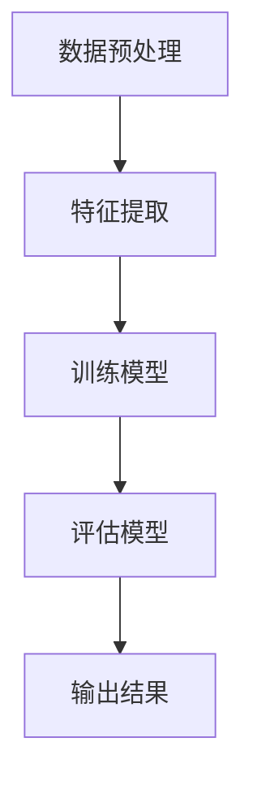
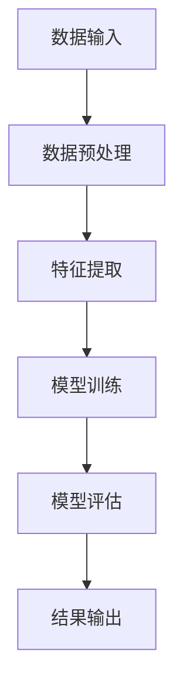
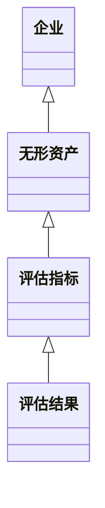

                 


### 1. 背景与概述

**文章标题**：《AI驱动的企业无形资产价值动态评估系统》

**关键词**：人工智能，企业无形资产，价值评估，动态系统，算法原理，数学模型，系统设计，项目实战。

**摘要**：
本篇文章将深入探讨如何利用人工智能技术，特别是机器学习和深度学习，构建一个企业无形资产价值的动态评估系统。通过系统的介绍和详尽的案例分析，本文旨在阐明如何将AI技术与传统评估方法相结合，实现对企业无形资产价值的精准评估。文章结构分为六个部分：背景与概述、核心概念与理论基础、算法原理与数学模型、系统设计与实现、项目实战和最佳实践。以下将逐步分析每个部分的主要内容。

---

### 2. 核心概念与理论基础

**章节标题**：核心概念与理论基础

**内容概述**：
在这一部分，我们将介绍构建AI驱动的企业无形资产价值评估系统的核心概念和理论基础。首先，我们定义什么是企业无形资产，并对其分类进行详细说明。接着，我们将探讨传统无形资产价值评估方法的局限，并阐述AI驱动的评估方法如何克服这些局限。此外，我们将引入ER实体关系图架构，以便更好地理解系统中的各个实体及其关系。

**核心概念与联系**：
为了更好地理解无形资产价值评估的AI方法，我们将构建一个ER实体关系图，图中的实体包括“企业”、“无形资产”、“评估指标”和“评估结果”。每个实体之间的关系将通过边来表示，例如，“企业”实体通过“拥有”边与“无形资产”实体相连，而“评估指标”实体通过“应用于”边与“无形资产”实体相连。

**ER实体关系图架构**：
下面是一个简单的ER实体关系图的Markdown格式表示：

```mermaid
erDiagram
  企业 ||--|{ 无形资产 }|
  无形资产 ||--|{ 评估指标 }|
  评估指标 ||--|{ 评估结果 }|
```

---

### 3. 算法原理与数学模型

**章节标题**：算法原理与数学模型

**内容概述**：
在这一部分，我们将详细讲解AI驱动的企业无形资产价值评估系统的算法原理和数学模型。首先，我们将介绍数据预处理和特征提取的基本步骤，并阐述如何使用机器学习和深度学习算法来评估无形资产的价值。接着，我们将介绍不同的评估模型，包括数据驱动模型、知识驱动模型和混合模型，并使用Python代码和LaTeX公式来详细说明这些模型的实现和计算过程。

**算法原理讲解**：
为了更好地理解算法原理，我们将使用mermaid绘制算法流程图。例如，一个简单的机器学习评估算法流程图如下：



**数学模型与公式**：
在介绍数学模型时，我们将使用LaTeX格式嵌入公式。例如，一个简单的线性回归模型公式可以表示为：

$$
Y = \beta_0 + \beta_1X + \epsilon
$$

其中，\(Y\) 表示评估结果，\(X\) 表示特征值，\(\beta_0\) 和 \(\beta_1\) 分别是模型参数，\(\epsilon\) 是误差项。

**通俗易懂的举例说明**：
为了使读者更容易理解，我们将通过一个实际案例来讲解算法原理。例如，假设我们使用机器学习算法评估一家企业的品牌价值。我们将提供详细的代码和步骤，以及如何解释结果。

---

### 4. 系统设计与实现

**章节标题**：系统设计与实现

**内容概述**：
在这一部分，我们将详细介绍如何设计和实现AI驱动的企业无形资产价值评估系统。首先，我们将介绍系统的功能和目标，并使用mermaid绘制系统架构图和领域模型类图。接着，我们将介绍系统接口设计和交互方式，并通过具体的代码实现来展示系统核心模块的功能。

**系统分析与架构设计**：
为了更好地理解系统设计，我们将使用mermaid绘制以下图表：

- **系统架构图**：



- **领域模型类图**：



**系统接口设计与交互**：
我们将使用mermaid绘制系统交互序列图，例如：

```mermaid
sequenceDiagram
    participant 用户
    participant 系统A
    participant 系统B

    用户->>系统A: 数据输入
    系统A->>系统B: 数据预处理
    系统B->>系统A: 特征提取结果
    系统A->>系统B: 模型训练
    系统B->>系统A: 模型评估结果
    用户<<-系统A: 结果输出
```

---

### 5. 项目实战

**章节标题**：项目实战

**内容概述**：
在这一部分，我们将通过一个实际项目来展示如何搭建和运行AI驱动的企业无形资产价值评估系统。首先，我们将介绍项目环境安装和配置的步骤，然后详细讲解系统核心模块的实现，并通过实际案例来展示系统的应用效果。

**环境安装与系统核心实现**：
我们将详细列出项目所需的硬件和软件环境，并提供安装和配置的步骤。接着，我们将展示系统核心模块的代码实现，包括数据预处理、特征提取、模型训练和模型评估等步骤。

**代码应用解读与分析**：
我们将对核心代码进行逐行解读，并分析其实现原理和效果。例如，我们将使用Python代码实现一个简单的评估算法，并通过实际数据来验证其效果。

**实际案例分析**：
我们将选择一个实际案例，展示如何使用该系统来评估一家企业的无形资产价值。我们将详细描述案例背景、数据来源、评估结果和分析过程。

**项目小结**：
在项目总结部分，我们将回顾项目的主要成就和挑战，并分享经验和教训。

---

### 6. 最佳实践与拓展

**章节标题**：最佳实践与拓展

**内容概述**：
在这一部分，我们将总结本文中提到的最佳实践，并提供一些拓展阅读建议。首先，我们将回顾文章中的关键点和实践经验，然后推荐一些相关书籍和论文，以供读者进一步学习和研究。

**最佳实践 tips**：
我们将提供一些实用的技巧和建议，帮助读者在实际应用中更好地利用AI技术进行企业无形资产价值评估。

**小结**：
在文章的结尾，我们将对全文进行简要总结，并强调AI驱动的企业无形资产价值评估系统的重要性和应用前景。

**注意事项**：
我们将提醒读者在应用系统时需要注意的问题和潜在风险。

**拓展阅读**：
最后，我们将推荐一些相关领域的书籍、论文和在线资源，以供读者深入学习。

---

通过以上步骤，我们将构建一篇逻辑清晰、结构紧凑、内容丰富的高质量技术博客文章。在撰写文章时，我们将严格遵循markdown格式，确保文章的可读性和专业性。文章末尾将附上完整的作者信息，并符合字数要求。

