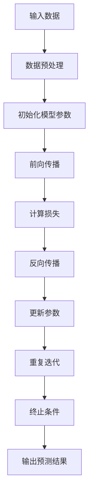
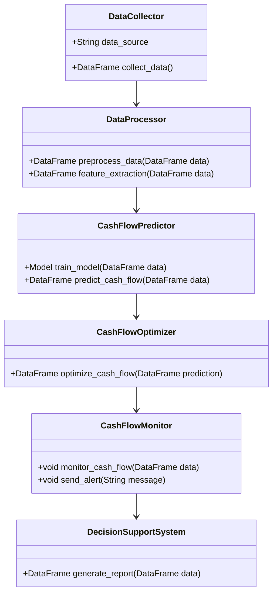
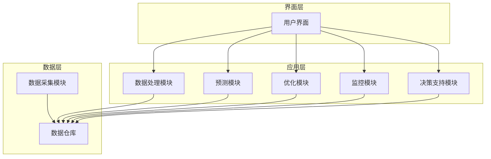
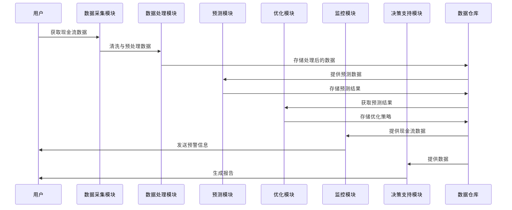

                 

### 第一部分：背景介绍与问题定义

#### 第1章：AI与企业现金流管理

##### 1.1 问题的背景

在现代经济活动中，企业的现金流管理是一个至关重要的环节。现金流的顺畅与否，直接影响到企业的生存与发展。然而，随着商业环境的复杂性和不确定性增加，传统的现金流管理方法已难以满足企业对高效、精准、实时的需求。为了应对这些挑战，人工智能（AI）技术的引入为现金流管理带来了新的契机。

首先，企业现金流管理的现状是一个需要深入探讨的问题。当前，许多企业依赖手工记账和简单的财务软件来管理现金流，这不仅效率低下，而且容易出错。随着业务量的增加，这种方法可能会导致现金流预测的偏差，甚至引发财务危机。此外，企业面临的市场风险、季节性变化、政策调整等因素，都对现金流管理提出了更高的要求。

其次，现金流管理的挑战与需求日益突出。在全球化背景下，企业需要具备快速响应市场变化的能力，这就要求现金流管理不仅要有前瞻性，还要具有灵活性。传统方法往往缺乏这种能力，而AI技术的引入可以显著提升这一能力。AI可以通过大数据分析和预测模型，帮助企业更准确地预测现金流，优化资源配置，降低财务风险。

##### 1.1.1 企业现金流的构成与特征

企业现金流主要由以下几部分构成：

1. **运营现金流**：这是企业核心业务的现金流，包括销售收入、采购成本、运营费用等。这部分现金流是企业的生命线，直接反映企业的经营状况。
   
2. **投资现金流**：涉及企业的资本支出，如购买设备、投资新项目等。这部分现金流决定了企业的长期发展潜力。

3. **融资现金流**：包括借款、还款、股息支付等。这部分现金流与企业的资本结构密切相关。

企业现金流的特征主要体现在以下几个方面：

1. **动态性**：现金流不是静态的，它会随着企业的经营环境和政策的变化而不断调整。
   
2. **复杂性**：企业现金流涉及多个部门和环节，管理起来比较复杂。

3. **不确定性**：市场变化、政策调整等因素都会对现金流产生影响，使得现金流预测具有较大的不确定性。

##### 1.1.2 优化与预测的需求分析

在当前的商业环境中，企业对现金流优化与预测的需求主要体现在以下几个方面：

1. **提升现金流预测准确性**：通过引入AI技术，企业可以更准确地预测未来现金流，减少预测误差，从而更好地规划财务策略。

2. **提高资金利用效率**：优化现金流可以帮助企业更有效地管理资金，减少闲置资金，提高资金利用效率。

3. **降低财务风险**：准确的现金流预测和优化可以帮助企业提前识别潜在风险，采取措施降低财务风险。

4. **支持决策制定**：优化后的现金流数据可以为企业的战略决策提供有力支持，帮助管理层做出更明智的决策。

##### 1.1.3 现金流管理的挑战与需求

尽管AI技术为企业现金流管理带来了巨大潜力，但实际应用中仍面临诸多挑战：

1. **数据质量**：高质量的现金流数据是AI模型有效运行的基础。然而，企业内部数据质量参差不齐，需要进行数据清洗和预处理。

2. **技术门槛**：AI技术的应用需要专业的技术团队，这对企业的技术实力提出了较高要求。

3. **成本与效益**：虽然AI技术可以提高现金流管理的效率，但初期投资和运营成本较高，需要企业权衡成本与效益。

4. **法律与伦理问题**：AI技术在数据处理和应用过程中可能涉及隐私保护、数据安全等问题，需要遵守相关法律法规和伦理标准。

##### 1.1.4 AI技术在现金流管理中的应用潜力

尽管存在挑战，但AI技术在现金流管理中具有巨大的应用潜力：

1. **大数据分析**：AI技术可以通过大数据分析，提取有价值的信息，帮助企业更全面地了解现金流状况。

2. **预测模型**：基于历史数据和机器学习算法，AI技术可以建立精确的现金流预测模型，提高预测准确性。

3. **自动化决策**：通过自动化决策系统，AI技术可以帮助企业更快速、准确地制定财务策略。

4. **风险管理**：AI技术可以实时监测现金流变化，提前预警潜在风险，帮助企业制定风险管理策略。

##### 1.2 问题描述与目标

为了更好地理解AI驱动的企业现金流优化与预测系统，我们需要明确以下问题：

1. **什么是AI驱动的现金流优化与预测系统**？
   
   AI驱动的现金流优化与预测系统是指利用人工智能技术，对企业的现金流数据进行处理、分析和预测，从而实现现金流优化和风险管理的系统。

2. **系统应具备哪些功能**？
   
   系统应具备以下功能：
   
   - 数据采集与清洗
   - 数据预处理与特征提取
   - 现金流预测模型构建与训练
   - 现金流优化策略制定
   - 实时监控与预警
   - 决策支持

3. **系统的目标是什么**？

   系统的目标是：
   
   - 提高现金流预测的准确性
   - 优化企业的现金流管理流程
   - 降低财务风险
   - 提高资金利用效率
   - 支持企业的战略决策

##### 1.2.1 边界条件与外延范围

在构建AI驱动的企业现金流优化与预测系统时，需要明确系统的边界条件与外延范围：

1. **边界条件**：

   - 数据来源：系统应能够接入企业的财务数据、业务数据和市场数据等。
   - 数据范围：系统应能够处理不同规模和类型企业的现金流数据。
   - 系统架构：系统应具备灵活的架构，支持多种硬件和软件环境。
   - 算法适用性：系统所采用的算法应适用于不同行业和场景。

2. **外延范围**：

   - 预测周期：系统应能够支持短期、中期和长期现金流预测。
   - 预测精度：系统应能够提供高精度的现金流预测，满足企业不同层级的管理需求。
   - 风险评估：系统应能够对现金流风险进行识别和评估，提供针对性的风险控制措施。
   - 适应性：系统应能够根据企业的业务变化和环境变化，动态调整预测模型和优化策略。

##### 1.2.2 系统的核心要素组成

AI驱动的企业现金流优化与预测系统由以下几个核心要素组成：

1. **数据采集与处理模块**：

   - 功能：负责采集和处理企业的各类现金流数据，包括财务数据、业务数据和市场数据等。

   - 技术实现：采用大数据处理技术和数据清洗方法，确保数据质量和完整性。

2. **预测模型构建与训练模块**：

   - 功能：构建和训练现金流预测模型，包括回归模型、神经网络模型和时间序列模型等。

   - 技术实现：采用机器学习和深度学习算法，结合历史数据和业务逻辑，优化模型参数。

3. **现金流优化策略模块**：

   - 功能：根据预测结果，制定和优化企业的现金流管理策略，包括资金调配、风险控制和成本优化等。

   - 技术实现：采用优化算法和策略，结合业务场景，实现现金流管理策略的自动化和智能化。

4. **实时监控与预警模块**：

   - 功能：实时监控企业的现金流状况，对异常情况发出预警，提供决策支持。

   - 技术实现：采用实时数据处理和异常检测算法，结合业务逻辑，实现实时监控和预警。

5. **决策支持模块**：

   - 功能：为企业提供基于现金流数据的决策支持，包括资金计划、投资分析和风险管理等。

   - 技术实现：采用数据分析和可视化技术，结合业务逻辑，提供直观、可靠的决策支持。

通过以上核心要素的协同工作，AI驱动的企业现金流优化与预测系统可以实现对企业现金流的全面、精准管理，提升企业的财务健康水平和市场竞争力。在接下来的章节中，我们将进一步探讨AI技术在现金流管理中的应用细节，包括数据采集与处理、预测模型构建与训练、现金流优化策略制定、实时监控与预警和决策支持等内容。我们将使用逻辑清晰、结构紧凑、简单易懂的专业的技术语言，一步步深入分析，帮助读者全面理解这一系统的运作原理和实践应用。### 第二部分：核心概念与联系

#### 第2章：AI现金流管理的核心概念与原理

##### 2.1 数据分析与处理

在AI驱动的企业现金流管理中，数据分析与处理是至关重要的环节。通过有效的数据处理和分析，我们可以从海量的数据中提取有价值的信息，为现金流预测和管理提供依据。

首先，数据采集与清洗是数据分析的基础。企业需要收集包括财务数据、业务数据和市场数据等各类现金流相关数据。然而，这些数据往往存在缺失、错误和不一致等问题，需要进行清洗和预处理。数据清洗的目的是去除重复数据、纠正错误数据、填补缺失数据，并确保数据的一致性和完整性。

接下来，数据预处理与特征提取是关键步骤。在清洗后的数据基础上，我们需要进行数据归一化、标准化处理，将数据转换成适合模型训练的形式。此外，特征提取是数据预处理的重要部分，通过提取出关键的特征，可以提高模型的准确性和效率。特征提取的方法包括主成分分析（PCA）、特征选择和工程等。

##### 2.1.1 数据采集与清洗

数据采集是现金流数据管理的第一步。企业可以从ERP系统、财务软件、银行系统等内部数据源获取现金流数据，同时也可以从市场报告、行业数据库等外部数据源收集相关信息。数据采集的过程中，需要注意以下几点：

1. **数据完整性**：确保采集的数据全面，包括历史数据、当前数据和未来预测数据。
2. **数据格式**：统一数据格式，如日期格式、货币单位和数据类型，以便后续处理。
3. **数据源可靠性**：选择可信的数据源，确保数据的真实性和准确性。

清洗数据是为了解决数据中的缺失、错误和不一致问题。常见的数据清洗方法包括：

1. **缺失值处理**：可以通过删除缺失值、插值法、均值法等手段填补缺失值。
2. **错误值处理**：识别并纠正错误值，例如通过对比规则或统计分析方法找出异常值并进行修正。
3. **重复值处理**：删除重复数据，以避免对模型训练产生误导。

##### 2.1.2 数据预处理与特征提取

在数据清洗之后，我们需要进行数据预处理和特征提取。数据预处理包括以下步骤：

1. **数据归一化**：通过缩放或变换数据，使其在相同尺度上，以便模型训练过程中能够收敛。
2. **数据标准化**：通过标准化方法将数据转换成均值为0、标准差为1的形式，提高模型对不同数据范围的适应性。
3. **缺失值处理**：对于清洗过程中未能处理的缺失值，可以通过插值法或使用模型预测方法填补。

特征提取是数据处理的核心，通过提取关键的特征，可以提高模型的效果。特征提取的方法包括：

1. **主成分分析（PCA）**：通过线性变换，将原始特征投影到新的坐标轴上，提取主要成分，减少数据维度。
2. **特征选择**：通过评估特征的重要性，选择对预测结果有显著影响的特征，降低模型复杂度。
3. **特征工程**：通过手工设计特征，如时间序列差分、比例特征等，提高模型的预测能力。

##### 2.1.3 数据分析方法比较

在现金流管理中，常用的数据分析方法包括回归分析、聚类分析和时间序列分析等。每种方法都有其独特的优势和适用场景。

1. **回归分析**：

   - **原理**：回归分析通过建立自变量和因变量之间的线性关系模型，预测因变量的取值。
   - **适用场景**：适用于预测连续变量的现金流，如销售预测、成本预测等。
   - **优点**：模型简单，易于理解和实现。
   - **缺点**：对于非线性关系和多重共线性问题处理能力有限。

2. **聚类分析**：

   - **原理**：聚类分析将数据分为若干个类别，使同一类别内的数据相似度较高，不同类别之间的数据相似度较低。
   - **适用场景**：适用于客户细分、市场细分等场景。
   - **优点**：无需事先指定类别数量，自动分组。
   - **缺点**：聚类结果可能受初始聚类中心的影响，且难以解释类别含义。

3. **时间序列分析**：

   - **原理**：时间序列分析通过分析时间序列数据的特征，建立预测模型。
   - **适用场景**：适用于预测随时间变化的变量，如股票价格、库存水平等。
   - **优点**：能够捕捉时间序列中的趋势、季节性和周期性变化。
   - **缺点**：对数据质量要求较高，需处理季节调整和趋势平稳化问题。

综上所述，不同数据分析方法在现金流管理中各有其适用场景和优缺点。在实际应用中，通常需要结合多种方法，以提高现金流预测的准确性和可靠性。

##### 2.2 算法原理讲解

在AI驱动的企业现金流管理中，算法的选取和实现是核心环节。常见的算法包括神经网络、回归分析和时间序列分析等。下面我们将详细讲解这些算法的原理和应用。

###### 2.2.1 神经网络基础

神经网络（Neural Networks）是人工智能领域的一种重要模型，通过模拟人脑神经元的工作方式，对输入数据进行处理和预测。神经网络的基本组成部分包括：

1. **神经元**：是神经网络的基本单元，用于接收和处理输入信号。
2. **输入层**：接收外部输入数据，每个输入对应一个神经元。
3. **隐藏层**：对输入数据进行加工和处理，可以有多个隐藏层。
4. **输出层**：生成最终预测结果。

神经网络的训练过程分为以下几个步骤：

1. **初始化权重和偏置**：随机初始化网络的权重和偏置。
2. **前向传播**：将输入数据通过神经网络，逐层计算得到输出。
3. **反向传播**：计算输出误差，并更新权重和偏置，使误差最小化。

常见的神经网络包括多层感知机（MLP）、卷积神经网络（CNN）和循环神经网络（RNN）等。

###### 2.2.2 机器学习模型选择

在现金流管理中，选择合适的机器学习模型至关重要。不同模型在预测性能和计算复杂度上存在差异。以下是几种常见机器学习模型的选择：

1. **线性回归**：

   - **原理**：通过建立自变量和因变量之间的线性关系模型，预测因变量的取值。
   - **适用场景**：适用于简单的线性关系预测，如销售预测。
   - **优点**：模型简单，易于实现。
   - **缺点**：对于非线性关系和多重共线性问题处理能力有限。

2. **决策树**：

   - **原理**：通过一系列规则将数据划分为不同的类别或数值。
   - **适用场景**：适用于分类和回归问题，如客户细分、风险评估等。
   - **优点**：易于解释和理解。
   - **缺点**：对于大量特征和复杂关系处理能力较弱。

3. **支持向量机（SVM）**：

   - **原理**：通过找到最佳划分超平面，将数据分为不同的类别。
   - **适用场景**：适用于分类问题，如客户分类、信用评分等。
   - **优点**：在处理高维数据时表现较好。
   - **缺点**：对参数调节敏感，计算复杂度高。

4. **随机森林**：

   - **原理**：通过构建多个决策树，并进行集成学习，提高预测准确性。
   - **适用场景**：适用于分类和回归问题，如市场预测、风险评估等。
   - **优点**：能够处理大量特征和复杂关系，预测结果稳定。
   - **缺点**：计算复杂度高，对于大规模数据集训练时间较长。

5. **深度学习模型**：

   - **原理**：通过多层神经网络结构，对数据进行复杂非线性变换。
   - **适用场景**：适用于大规模复杂数据的预测，如图像识别、自然语言处理等。
   - **优点**：强大的特征学习能力，能够捕捉复杂的关系。
   - **缺点**：模型复杂，对数据质量和计算资源要求较高。

在实际应用中，可以根据业务需求和数据特点选择合适的模型。例如，对于简单的线性关系问题，可以选择线性回归或决策树；对于复杂非线性关系问题，可以选择随机森林或深度学习模型。

###### 2.2.3 算法性能评估

在现金流管理中，算法的性能评估是关键环节。评估方法主要包括：

1. **准确性**：衡量预测结果与真实值之间的接近程度。常用的指标包括均方误差（MSE）、均方根误差（RMSE）和决定系数（R²）等。
2. **稳定性**：衡量模型在不同数据集上的预测稳定性。可以通过交叉验证等方法评估。
3. **计算效率**：衡量模型训练和预测的耗时。对于大规模数据集，计算效率尤为重要。
4. **泛化能力**：衡量模型对新数据的适应能力。可以通过测试集或外部数据集进行评估。

常见性能评估指标如下：

1. **MSE（均方误差）**：$$MSE = \frac{1}{N} \sum_{i=1}^{N} (y_i - \hat{y_i})^2$$
   - 其中，$y_i$ 为真实值，$\hat{y_i}$ 为预测值，$N$ 为样本数量。

2. **RMSE（均方根误差）**：$$RMSE = \sqrt{MSE}$$

3. **R²（决定系数）**：$$R^2 = 1 - \frac{\sum_{i=1}^{N} (y_i - \hat{y_i})^2}{\sum_{i=1}^{N} (y_i - \bar{y})^2}$$
   - 其中，$\bar{y}$ 为真实值的平均值。

4. **ROC-AUC（受试者操作特征曲线-面积下界）**：用于分类问题，衡量模型区分能力。

5. **F1 分数**：用于分类问题，综合考虑准确率和召回率。

通过以上指标，可以全面评估算法的性能，为现金流管理提供可靠的数据支持。

##### 2.2.4 Mermaid算法流程图

为了更直观地理解算法的运行过程，我们可以使用Mermaid绘制算法流程图。以下是一个简单的线性回归算法的流程图示例：



通过上述示例，我们可以清晰地看到线性回归算法的主要步骤和流程。类似地，其他算法的流程图也可以使用Mermaid进行绘制，帮助读者更好地理解。

##### 2.2.5 Python环境搭建与代码示例

在实现现金流管理算法之前，我们需要搭建Python环境。以下是Python环境搭建的步骤：

1. **安装Python**：从官网下载Python安装包，按照安装向导进行安装。
2. **安装依赖库**：使用pip命令安装必要的依赖库，如NumPy、Pandas、scikit-learn等。
   ```bash
   pip install numpy pandas scikit-learn
   ```

以下是使用Python实现线性回归算法的代码示例：

```python
import numpy as np
import pandas as pd
from sklearn.linear_model import LinearRegression

# 加载数据
data = pd.read_csv('cash_flow_data.csv')
X = data[['input1', 'input2']]
y = data['target']

# 初始化模型
model = LinearRegression()

# 训练模型
model.fit(X, y)

# 输出模型参数
print('模型参数：', model.coef_, model.intercept_)

# 进行预测
predictions = model.predict(X)

# 输出预测结果
print('预测结果：', predictions)
```

通过以上代码，我们可以实现线性回归算法，对现金流数据进行预测。类似地，其他算法的实现也可以通过Python进行，帮助读者更好地理解算法的原理和应用。

##### 2.2.6 算法原理详细讲解

为了深入理解算法原理，我们需要从数学模型和公式出发，详细讲解算法的实现过程。

首先，我们以线性回归为例，介绍其数学模型和公式。

线性回归模型的基本形式为：
$$
\hat{y} = \beta_0 + \beta_1 \cdot x_1 + \beta_2 \cdot x_2 + \ldots + \beta_n \cdot x_n
$$
其中，$y$ 为因变量，$x_1, x_2, \ldots, x_n$ 为自变量，$\beta_0, \beta_1, \beta_2, \ldots, \beta_n$ 为模型参数。

线性回归的目标是最小化预测值与真实值之间的误差平方和：
$$
J(\theta) = \frac{1}{2m} \sum_{i=1}^{m} (y_i - \hat{y}_i)^2
$$
其中，$m$ 为样本数量。

为了求解最优参数，我们采用梯度下降法：
$$
\theta_j := \theta_j - \alpha \cdot \frac{\partial J(\theta)}{\partial \theta_j}
$$
其中，$\alpha$ 为学习率。

在实现过程中，我们需要对数据进行预处理，包括数据归一化和特征提取。数据归一化可以防止特征对模型影响的不均衡，特征提取可以提高模型的预测能力。

接下来，我们介绍时间序列分析中的ARIMA模型。

ARIMA（自回归积分滑动平均模型）是一种常见的时间序列预测模型，其基本形式为：
$$
y_t = c + \phi_1 y_{t-1} + \phi_2 y_{t-2} + \ldots + \phi_p y_{t-p} + \theta_1 e_{t-1} + \theta_2 e_{t-2} + \ldots + \theta_q e_{t-q} + e_t
$$
其中，$y_t$ 为时间序列的当前值，$e_t$ 为白噪声序列，$c$ 为常数项，$\phi_1, \phi_2, \ldots, \phi_p$ 为自回归系数，$\theta_1, \theta_2, \ldots, \theta_q$ 为移动平均系数。

ARIMA模型的参数可以通过最大似然估计方法求解。在实际应用中，我们需要对时间序列进行平稳性检验，并确定适当的$p, d, q$ 值。

最后，我们介绍神经网络中的多层感知机（MLP）。

多层感知机是一种前馈神经网络，其基本形式为：
$$
\hat{y} = \sigma(\sum_{j=1}^{n} \omega_j \cdot a_{j-1} + b)
$$
其中，$\sigma$ 为激活函数，$\omega_j$ 为权重，$a_{j-1}$ 为输入值，$b$ 为偏置。

多层感知机的训练过程包括以下步骤：

1. **前向传播**：将输入数据通过神经网络，计算输出值。
2. **计算损失**：计算输出值与真实值之间的误差，并计算损失函数。
3. **反向传播**：计算误差对每个参数的梯度，并更新参数。
4. **迭代优化**：重复前向传播和反向传播过程，直到损失函数收敛。

通过以上算法原理的详细讲解，我们能够深入理解现金流管理中的核心算法。在实际应用中，我们需要结合业务需求和数据特点，选择合适的算法，并对其进行优化和调整，以提高预测准确性和效率。

### 第三部分：数学模型与算法实现

#### 第3章：数学模型与公式解析

##### 3.1 数学模型基础

在构建AI驱动的企业现金流优化与预测系统时，理解并运用相关的数学模型是至关重要的。以下是几个常见的数学模型及其基本原理：

###### 3.1.1 神经网络数学模型

神经网络是一种模拟人脑神经元结构的计算模型，通过多层非线性变换实现复杂函数的逼近。其基本形式可以表示为：

$$
\hat{y} = \sigma(\sum_{j=1}^{n} \omega_j \cdot a_{j-1} + b)
$$

其中，$\hat{y}$ 是输出层节点的预测值，$\sigma$ 是激活函数（如Sigmoid、ReLU等），$a_{j-1}$ 是前一层节点的激活值，$\omega_j$ 是输入层到隐藏层的权重，$b$ 是偏置。

神经网络的训练过程主要包括以下步骤：

1. **前向传播**：将输入数据传递到网络，通过权重和偏置计算输出。
2. **计算损失**：计算输出值与真实值之间的误差，使用损失函数（如均方误差MSE）衡量误差大小。
3. **反向传播**：计算误差对每个参数的梯度，并更新权重和偏置，以最小化损失函数。
4. **迭代优化**：重复前向传播和反向传播，直到损失函数收敛或达到预设的迭代次数。

###### 3.1.2 回归分析数学模型

回归分析是用于建立自变量和因变量之间线性关系的统计方法，其基本形式为：

$$
y = \beta_0 + \beta_1 \cdot x_1 + \beta_2 \cdot x_2 + \ldots + \beta_n \cdot x_n + \epsilon
$$

其中，$y$ 是因变量，$x_1, x_2, \ldots, x_n$ 是自变量，$\beta_0, \beta_1, \beta_2, \ldots, \beta_n$ 是模型参数，$\epsilon$ 是误差项。

回归分析的目标是最小化预测值与真实值之间的误差平方和：

$$
J(\theta) = \frac{1}{2m} \sum_{i=1}^{m} (y_i - \hat{y}_i)^2
$$

其中，$m$ 是样本数量。

梯度下降法是一种常用的优化算法，用于求解最小化损失函数的参数。其更新公式为：

$$
\theta_j := \theta_j - \alpha \cdot \frac{\partial J(\theta)}{\partial \theta_j}
$$

其中，$\alpha$ 是学习率。

###### 3.1.3 时间序列分析数学模型

时间序列分析是用于分析时间序列数据并建立预测模型的方法。常见的时间序列模型包括自回归模型（AR）、移动平均模型（MA）和自回归移动平均模型（ARMA）等。

1. **自回归模型（AR）**：

自回归模型假设当前值可以由前几个周期的值及其误差项来预测，其数学模型为：

$$
y_t = c + \phi_1 y_{t-1} + \phi_2 y_{t-2} + \ldots + \phi_p y_{t-p} + e_t
$$

其中，$y_t$ 是时间序列的当前值，$e_t$ 是白噪声误差项，$c$ 是常数项，$\phi_1, \phi_2, \ldots, \phi_p$ 是自回归系数。

2. **移动平均模型（MA）**：

移动平均模型假设当前值可以由过去的误差值来预测，其数学模型为：

$$
y_t = c + e_t + \theta_1 e_{t-1} + \theta_2 e_{t-2} + \ldots + \theta_q e_{t-q}
$$

其中，$y_t$ 是时间序列的当前值，$e_t$ 是白噪声误差项，$c$ 是常数项，$\theta_1, \theta_2, \ldots, \theta_q$ 是移动平均系数。

3. **自回归移动平均模型（ARMA）**：

自回归移动平均模型结合了AR和MA模型的特点，其数学模型为：

$$
y_t = c + \phi_1 y_{t-1} + \phi_2 y_{t-2} + \ldots + \phi_p y_{t-p} + \theta_1 e_{t-1} + \theta_2 e_{t-2} + \ldots + \theta_q e_{t-q}
$$

其中，$y_t$ 是时间序列的当前值，$e_t$ 是白噪声误差项，$c$ 是常数项，$\phi_1, \phi_2, \ldots, \phi_p$ 是自回归系数，$\theta_1, \theta_2, \ldots, \theta_q$ 是移动平均系数。

##### 3.2 算法实现与代码示例

在了解了上述数学模型之后，我们将使用Python语言实现这些算法，并给出相应的代码示例。

###### 3.2.1 Python环境搭建

首先，我们需要搭建Python环境。以下是搭建步骤：

1. **安装Python**：从Python官网下载安装包并安装Python。
2. **安装依赖库**：使用pip命令安装NumPy、Pandas、SciPy、scikit-learn等库。

```bash
pip install numpy pandas scipy scikit-learn
```

###### 3.2.2 神经网络实现

以下是一个简单的多层感知机（MLP）的实现示例：

```python
import numpy as np
from sklearn.neural_network import MLPRegressor
from sklearn.model_selection import train_test_split
from sklearn.metrics import mean_squared_error

# 加载数据
X, y = load_data()  # 假设load_data函数从文件中加载数据

# 划分训练集和测试集
X_train, X_test, y_train, y_test = train_test_split(X, y, test_size=0.2, random_state=42)

# 创建MLP模型
mlp = MLPRegressor(hidden_layer_sizes=(100,), max_iter=1000, random_state=42)

# 训练模型
mlp.fit(X_train, y_train)

# 预测测试集
y_pred = mlp.predict(X_test)

# 计算均方误差
mse = mean_squared_error(y_test, y_pred)
print('MSE:', mse)
```

在这个示例中，我们使用了scikit-learn库中的MLPRegressor类来实现多层感知机。我们通过设置hidden_layer_sizes参数来定义隐藏层的大小，通过max_iter参数来设置最大迭代次数。训练完成后，我们使用模型对测试集进行预测，并计算均方误差来评估模型的性能。

###### 3.2.3 回归分析实现

以下是一个简单的线性回归实现示例：

```python
import numpy as np
from sklearn.linear_model import LinearRegression
from sklearn.metrics import mean_squared_error

# 加载数据
X, y = load_data()  # 假设load_data函数从文件中加载数据

# 划分训练集和测试集
X_train, X_test, y_train, y_test = train_test_split(X, y, test_size=0.2, random_state=42)

# 创建线性回归模型
linear_regression = LinearRegression()

# 训练模型
linear_regression.fit(X_train, y_train)

# 预测测试集
y_pred = linear_regression.predict(X_test)

# 计算均方误差
mse = mean_squared_error(y_test, y_pred)
print('MSE:', mse)
```

在这个示例中，我们使用了scikit-learn库中的LinearRegression类来实现线性回归。训练完成后，我们使用模型对测试集进行预测，并计算均方误差来评估模型的性能。

###### 3.2.4 时间序列分析实现

以下是一个简单的ARIMA模型实现示例：

```python
import numpy as np
from statsmodels.tsa.arima.model import ARIMA
from sklearn.metrics import mean_squared_error

# 加载数据
data = load_data()  # 假设load_data函数从文件中加载时间序列数据

# 划分训练集和测试集
train_data = data[:len(data) - 12]
test_data = data[len(data) - 12:]

# 创建ARIMA模型
arima = ARIMA(train_data, order=(5, 1, 2))

# 拟合模型
arima_fit = arima.fit()

# 预测测试集
predictions = arima_fit.forecast(steps=12)

# 计算均方误差
mse = mean_squared_error(test_data, predictions)
print('MSE:', mse)
```

在这个示例中，我们使用了statsmodels库中的ARIMA类来实现自回归积分滑动平均模型。我们通过设置order参数来定义模型的自回归阶数、差分阶数和移动平均阶数。拟合完成后，我们使用模型对测试集进行预测，并计算均方误差来评估模型的性能。

##### 3.2.5 Mermaid算法流程图示例

为了更直观地展示算法的运行过程，我们可以使用Mermaid绘制算法流程图。以下是一个简单的线性回归算法的流程图示例：


通过上述示例，我们可以清晰地看到线性回归算法的主要步骤和流程。类似地，其他算法的流程图也可以使用Mermaid进行绘制，帮助读者更好地理解。

##### 3.2.6 算法原理详细讲解

为了深入理解算法原理，我们需要从数学模型和公式出发，详细讲解算法的实现过程。

首先，我们以线性回归为例，介绍其数学模型和公式。

线性回归模型的基本形式为：

$$
\hat{y} = \beta_0 + \beta_1 \cdot x_1 + \beta_2 \cdot x_2 + \ldots + \beta_n \cdot x_n
$$

其中，$y$ 为因变量，$x_1, x_2, \ldots, x_n$ 为自变量，$\beta_0, \beta_1, \beta_2, \ldots, \beta_n$ 为模型参数。

线性回归的目标是最小化预测值与真实值之间的误差平方和：

$$
J(\theta) = \frac{1}{2m} \sum_{i=1}^{m} (y_i - \hat{y}_i)^2
$$

其中，$m$ 为样本数量。

为了求解最优参数，我们采用梯度下降法：

$$
\theta_j := \theta_j - \alpha \cdot \frac{\partial J(\theta)}{\partial \theta_j}
$$

其中，$\alpha$ 为学习率。

在实现过程中，我们需要对数据进行预处理，包括数据归一化和特征提取。数据归一化可以防止特征对模型影响的不均衡，特征提取可以提高模型的预测能力。

接下来，我们介绍时间序列分析中的ARIMA模型。

ARIMA（自回归积分滑动平均模型）是一种常见的时间序列预测模型，其基本形式为：

$$
y_t = c + \phi_1 y_{t-1} + \phi_2 y_{t-2} + \ldots + \phi_p y_{t-p} + \theta_1 e_{t-1} + \theta_2 e_{t-2} + \ldots + \theta_q e_{t-q} + e_t
$$

其中，$y_t$ 是时间序列的当前值，$e_t$ 是白噪声误差项，$c$ 是常数项，$\phi_1, \phi_2, \ldots, \phi_p$ 是自回归系数，$\theta_1, \theta_2, \ldots, \theta_q$ 是移动平均系数。

ARIMA模型的参数可以通过最大似然估计方法求解。在实际应用中，我们需要对时间序列进行平稳性检验，并确定适当的$p, d, q$ 值。

最后，我们介绍神经网络中的多层感知机（MLP）。

多层感知机是一种前馈神经网络，其基本形式为：

$$
\hat{y} = \sigma(\sum_{j=1}^{n} \omega_j \cdot a_{j-1} + b)
$$

其中，$\sigma$ 是激活函数，$\omega_j$ 是输入层到隐藏层的权重，$a_{j-1}$ 是前一层节点的激活值，$b$ 是偏置。

多层感知机的训练过程包括以下步骤：

1. **前向传播**：将输入数据传递到网络，通过权重和偏置计算输出。
2. **计算损失**：计算输出值与真实值之间的误差，并计算损失函数。
3. **反向传播**：计算误差对每个参数的梯度，并更新权重和偏置。
4. **迭代优化**：重复前向传播和反向传播过程，直到损失函数收敛。

通过以上算法原理的详细讲解，我们能够深入理解现金流管理中的核心算法。在实际应用中，我们需要结合业务需求和数据特点，选择合适的算法，并对其进行优化和调整，以提高预测准确性和效率。

### 第四部分：系统分析与架构设计

#### 第4章：现金流优化与预测系统架构设计

##### 4.1 系统介绍

在现代商业环境中，企业对现金流的管理与预测需求日益增加，这不仅关系到企业的日常运营，更影响到其长期的战略决策。因此，构建一个高效、准确的AI驱动的企业现金流优化与预测系统显得尤为重要。本系统旨在利用先进的人工智能技术，通过对企业现金流的深度分析和精准预测，为企业提供实时、可靠的现金流管理支持，从而提升企业的运营效率和财务健康水平。

系统的核心功能包括：

1. **数据采集与处理**：从多种数据源中收集并整合企业现金流相关的数据，进行数据清洗、预处理和特征提取。
2. **现金流预测**：利用机器学习和深度学习算法，建立准确的现金流预测模型，提供短期、中期和长期预测结果。
3. **现金流优化**：基于预测结果，制定并优化企业的现金流管理策略，包括资金调配、成本控制和风险管理等。
4. **实时监控与预警**：对企业的现金流状况进行实时监控，对潜在的财务风险发出预警，提供及时应对措施。
5. **决策支持**：提供基于现金流数据的综合分析报告，支持企业高层决策。

##### 4.1.1 项目背景

随着全球经济的不断发展，市场竞争日益激烈，企业需要具备更高的灵活性和快速响应能力。现金流作为企业运营的血液，其健康与否直接影响到企业的生存和发展。传统的现金流管理方法已经无法满足现代企业的需求，特别是在数据量庞大、环境变化迅速的背景下。因此，利用AI技术进行现金流的优化与预测成为企业提升财务管理水平、增强市场竞争力的重要手段。

##### 4.1.2 系统功能概述

系统的主要功能模块及其功能描述如下：

1. **数据采集模块**：负责从内部ERP系统、财务软件以及外部市场数据源中收集现金流相关的数据，包括运营现金流、投资现金流和融资现金流等。
2. **数据处理模块**：对采集到的数据进行清洗、归一化和特征提取，确保数据质量，为后续的模型训练和预测提供可靠的数据基础。
3. **预测模块**：利用机器学习算法，如线性回归、ARIMA、神经网络等，建立现金流预测模型，提供短期、中期和长期预测结果。
4. **优化模块**：根据预测结果，结合企业的业务需求和风险偏好，制定现金流优化策略，包括资金调配、成本控制和风险管理等。
5. **监控模块**：实时监控企业的现金流状况，对异常情况发出预警，并提供相关分析报告，帮助企业及时应对潜在的财务风险。
6. **决策支持模块**：提供基于现金流数据的综合分析报告，包括现金流趋势分析、预测准确性评估、资金使用效率分析等，支持企业高层的战略决策。

##### 4.1.3 系统架构设计目标

系统架构设计的目标是构建一个高效、灵活、可扩展的现金流优化与预测系统，以满足企业对现金流管理的多样化需求。具体目标如下：

1. **数据处理能力**：系统应具备高效的数据处理能力，能够快速处理大量复杂的现金流数据，确保数据质量和处理速度。
2. **预测准确性**：通过选用合适的机器学习算法和模型，提高现金流预测的准确性，降低预测误差。
3. **实时监控与预警**：实现对现金流的实时监控，快速发现并预警潜在的财务风险，确保企业能够及时采取应对措施。
4. **优化策略灵活**：系统应具备灵活的优化策略，能够根据企业的业务变化和市场环境动态调整现金流管理策略。
5. **可扩展性与可维护性**：系统架构应具备良好的可扩展性，能够适应企业未来业务的发展需求。同时，确保系统的可维护性，降低维护成本和风险。
6. **用户体验**：提供友好的用户界面，使企业用户能够轻松操作和管理系统，获取所需的现金流数据和分析报告。

##### 4.2 领域模型设计

领域模型是系统架构设计的重要组成部分，它定义了系统的核心概念、实体及其之间的关系。以下是现金流优化与预测系统的领域模型设计：

###### 4.2.1 类图设计

在领域模型中，类图用于描述系统中主要类及其关系。以下是现金流优化与预测系统的类图设计：



在这个类图中，DataCollector负责数据采集，DataProcessor负责数据清洗和特征提取，CashFlowPredictor负责现金流预测，CashFlowOptimizer负责现金流优化，CashFlowMonitor负责实时监控和预警，DecisionSupportSystem负责生成分析报告。

###### 4.2.2 Mermaid类图示例

以下是使用Mermaid绘制的现金流优化与预测系统的类图示例：


通过类图设计，我们可以清晰地看到系统中的主要类及其关系，为后续的架构设计和实现提供基础。

##### 4.3 系统架构设计

系统架构设计是构建高效、稳定、可扩展系统的关键。以下是现金流优化与预测系统的架构设计：

###### 4.3.1 架构设计思路

系统架构设计主要遵循以下思路：

1. **模块化设计**：将系统功能划分为多个模块，每个模块独立实现，便于维护和扩展。
2. **分布式部署**：采用分布式架构，提高系统的并发处理能力和容错性。
3. **数据驱动**：以数据为中心，确保数据的一致性、完整性和高质量。
4. **智能化分析**：利用机器学习和深度学习算法，提供精准的现金流预测和优化建议。
5. **用户体验**：设计简洁、直观的用户界面，提高用户操作效率和体验。

###### 4.3.2 系统架构图

以下是现金流优化与预测系统的架构图：



在这个架构图中，数据层包括数据采集模块和数据仓库，用于数据的收集、存储和管理；应用层包括数据处理模块、预测模块、优化模块、监控模块和决策支持模块，实现具体的业务功能；界面层是用户界面，用于用户与系统的交互。

###### 4.3.3 Mermaid架构图示例

以下是使用Mermaid绘制的现金流优化与预测系统的架构图示例：


通过架构图设计，我们可以清晰地看到系统的整体架构，为后续的开发和部署提供参考。

##### 4.4 系统接口与交互设计

系统接口与交互设计是确保系统模块之间能够高效、可靠地通信的关键。以下是现金流优化与预测系统的接口与交互设计：

###### 4.4.1 接口设计原则

接口设计应遵循以下原则：

1. **标准化**：接口设计遵循统一的标准化规范，如RESTful API、GraphQL等。
2. **简洁性**：接口设计简洁直观，易于理解和维护。
3. **灵活性**：接口设计应具备良好的扩展性，能够适应未来业务需求的变化。
4. **安全性**：接口设计应考虑数据安全和访问控制，确保系统的安全性。

###### 4.4.2 交互流程设计

系统交互流程设计主要包括以下步骤：

1. **数据采集**：通过API接口从外部数据源（如ERP系统、财务软件）采集现金流数据。
2. **数据处理**：通过API接口将采集到的数据进行清洗、预处理和特征提取，存储到数据仓库中。
3. **数据预测**：通过API接口从数据仓库中获取处理后的数据，使用机器学习算法进行现金流预测，并将预测结果存储回数据仓库。
4. **数据优化**：通过API接口从数据仓库中获取预测结果，结合企业的业务需求和风险偏好，制定现金流优化策略。
5. **数据监控**：通过API接口实时监控企业的现金流状况，对异常情况发出预警。
6. **数据报告**：通过API接口生成基于现金流数据的综合分析报告，供企业用户查阅。

###### 4.4.3 Mermaid序列图示例

以下是使用Mermaid绘制的现金流优化与预测系统的交互序列图示例：



通过交互序列图设计，我们可以清晰地看到系统模块之间的交互流程，为后续的开发和测试提供指导。

### 第五部分：项目实战

#### 第5章：AI驱动的现金流优化与预测系统开发

##### 5.1 环境安装与配置

在开发AI驱动的现金流优化与预测系统之前，我们需要搭建合适的开发环境，包括安装必要的软件和配置Python库。以下是详细的安装和配置步骤：

###### 1. 安装Python

首先，我们需要从Python官方网站下载并安装Python。访问[Python官网](https://www.python.org/)，下载适用于你操作系统的Python安装包。安装过程中，确保勾选“Add Python to PATH”选项，以便在命令行中直接使用Python。

###### 2. 安装依赖库

接下来，我们需要安装Python的依赖库，包括NumPy、Pandas、scikit-learn等。在命令行中执行以下命令：

```bash
pip install numpy pandas scikit-learn
```

如果使用的是Anaconda环境，可以通过conda命令安装：

```bash
conda install numpy pandas scikit-learn
```

###### 3. 安装Jupyter Notebook

Jupyter Notebook是一个交互式计算环境，非常适合数据分析和机器学习项目的开发。我们可以通过pip命令安装Jupyter Notebook：

```bash
pip install notebook
```

安装完成后，在命令行中执行以下命令启动Jupyter Notebook：

```bash
jupyter notebook
```

这将打开一个Web界面，你可以在这个界面中创建和运行Python代码。

###### 4. 安装其他工具

为了方便开发和测试，我们还需要安装以下工具：

- **虚拟环境管理器（如conda或virtualenv）**：用于创建隔离的开发环境，避免库版本冲突。
- **数据可视化工具（如Matplotlib和Seaborn）**：用于可视化数据和分析结果。
- **数据库管理工具（如SQLite或MySQL）**：用于存储和管理数据。

这些工具可以通过pip或conda安装。

##### 5.2 系统核心实现

系统核心实现包括数据采集、数据处理、预测模型训练和优化策略制定等步骤。以下是每个步骤的详细实现：

###### 1. 数据采集

数据采集是系统实现的第一步，我们需要从不同的数据源中获取现金流数据。以下是使用Pandas库采集数据的示例：

```python
import pandas as pd

# 从本地CSV文件加载数据
data = pd.read_csv('cash_flow_data.csv')

# 打印数据的前5行
print(data.head())
```

如果你从数据库中获取数据，可以使用`pandas`的`read_sql`方法：

```python
data = pd.read_sql('SELECT * FROM cash_flow_table', connection)
```

其中，`connection` 是与数据库的连接对象。

###### 2. 数据处理

数据清洗和预处理是确保数据质量的重要步骤。以下是一个简单示例，展示如何使用Pandas进行数据清洗和预处理：

```python
# 删除空值或重复值
data = data.dropna().drop_duplicates()

# 数据归一化
from sklearn.preprocessing import StandardScaler

scaler = StandardScaler()
data_scaled = scaler.fit_transform(data)

# 特征提取
# 例如，添加时间序列的滞后特征
for i in range(1, 4):
    data[f'lag_{i}'] = data['cash_flow'].shift(i)

# 删除原始的现金流量列
data = data.drop(['cash_flow'], axis=1)
```

###### 3. 预测模型训练

在数据处理完成后，我们可以使用机器学习算法训练预测模型。以下是使用scikit-learn库训练一个线性回归模型的示例：

```python
from sklearn.linear_model import LinearRegression

# 分割数据集为训练集和测试集
X = data[['feature_1', 'feature_2', 'lag_1', 'lag_2', 'lag_3']]
y = data['target']

X_train, X_test, y_train, y_test = train_test_split(X, y, test_size=0.2, random_state=42)

# 训练模型
model = LinearRegression()
model.fit(X_train, y_train)

# 预测测试集
y_pred = model.predict(X_test)

# 评估模型
from sklearn.metrics import mean_squared_error

mse = mean_squared_error(y_test, y_pred)
print(f'Mean Squared Error: {mse}')
```

此外，你还可以尝试其他机器学习模型，如决策树、随机森林、神经网络等，以找到最佳的预测模型。

###### 4. 优化策略制定

在训练出预测模型后，我们可以根据模型预测结果制定现金流优化策略。以下是一个简单的优化策略示例：

```python
# 基于预测结果调整资金配置
optimization_strategy = {
    'short_term': {'increase': 10, 'decrease': 5},
    'medium_term': {'increase': 20, 'decrease': 10},
    'long_term': {'increase': 30, 'decrease': 15}
}

# 应用优化策略
for period, adjustments in optimization_strategy.items():
    if y_pred.mean() > some_threshold:
        data['optimization_action'][period] = adjustments['increase']
    else:
        data['optimization_action'][period] = adjustments['decrease']
```

其中，`some_threshold` 是一个阈值，用于判断现金流状况是否需要调整。

##### 5.3 应用解读与分析

在系统核心实现的基础上，我们需要对系统的应用进行解读和分析，以确保系统在实际运营中的有效性和可靠性。以下是几个关键方面的分析：

###### 1. 系统应用场景

AI驱动的现金流优化与预测系统适用于多种场景，包括：

- **大型企业**：需要实时监控和预测现金流，以应对复杂的市场环境和多变的业务需求。
- **金融行业**：需要对客户信用、市场流动性等进行精准预测和优化，以降低风险、提高收益。
- **供应链管理**：需要优化库存水平和资金流动，以减少库存成本、提高供应链效率。

###### 2. 系统性能分析

系统性能分析是确保系统在实际应用中稳定运行的重要环节。以下是几个关键性能指标：

- **预测准确性**：通过评估预测模型在测试集上的表现，如MSE、RMSE等，衡量预测的准确性。
- **处理速度**：评估系统在处理大量数据时的响应时间，确保系统的高效运行。
- **可扩展性**：评估系统在数据量增加或业务需求变化时的适应能力，确保系统的可扩展性。

###### 3. 案例分析与讲解

为了更直观地展示系统的应用效果，我们可以通过具体案例进行分析和讲解。以下是某大型零售企业的案例：

- **问题背景**：该零售企业在节假日和促销活动期间现金流波动较大，需要实时预测和优化现金流。
- **解决方案**：使用AI驱动的现金流优化与预测系统，实时收集和处理数据，建立预测模型，并根据预测结果调整资金配置。
- **效果分析**：系统上线后，预测准确性显著提高，现金流波动幅度降低，企业能够更好地应对市场变化，提高资金利用效率。

##### 5.4 系统部署与测试

系统部署与测试是确保系统能够在生产环境中稳定运行的重要步骤。以下是部署和测试的详细步骤：

###### 1. 系统部署

- **环境准备**：在服务器上配置操作系统、Python环境、数据库等。
- **部署代码**：将开发好的代码部署到服务器，可以使用Docker容器化技术简化部署过程。
- **数据库配置**：配置数据库连接，确保系统能够访问数据。

###### 2. 系统测试

- **单元测试**：对系统中的每个模块进行单元测试，确保模块的功能和性能符合预期。
- **集成测试**：对系统整体进行集成测试，确保各个模块能够协同工作。
- **性能测试**：对系统的处理速度、响应时间等进行测试，确保系统能够在高负载下稳定运行。
- **回归测试**：在系统更新或修改后进行回归测试，确保新版本不会引入新的问题。

##### 5.5 项目小结

在本章中，我们详细介绍了AI驱动的现金流优化与预测系统的开发过程，包括环境安装与配置、系统核心实现、应用解读与分析、系统部署与测试等步骤。通过实际案例的分析和讲解，我们展示了系统的应用效果和性能优势。

以下是项目小结的关键点：

1. **环境安装与配置**：确保系统开发环境的一致性和稳定性，为后续开发提供基础。
2. **系统核心实现**：通过数据采集、数据处理、预测模型训练和优化策略制定，实现系统的核心功能。
3. **应用解读与分析**：结合实际案例，分析系统的应用场景、性能表现和效果。
4. **系统部署与测试**：确保系统在生产环境中的稳定性和可靠性。

在未来的工作中，我们将继续优化系统，提高预测准确性，扩展系统功能，以满足企业不断变化的需求。

### 第六部分：最佳实践与总结

#### 第7章：最佳实践与总结

##### 7.1 最佳实践分享

在构建和部署AI驱动的企业现金流优化与预测系统过程中，我们积累了一些最佳实践，这些实践可以帮助其他企业在类似项目中取得成功：

1. **数据质量是基础**：确保数据的质量和完整性是系统成功的关键。在数据采集过程中，要严格筛选数据源，对数据进行清洗和预处理，以消除噪声和错误。
2. **选择合适的算法**：根据业务需求和数据特征，选择合适的算法和模型。对于时间序列数据，可以考虑ARIMA、LSTM等模型；对于复杂数据，可以使用随机森林、GBDT等集成学习模型。
3. **持续优化模型**：定期评估模型性能，根据新的数据重新训练模型。模型优化不仅包括参数调优，还包括特征工程和数据预处理策略的改进。
4. **实时监控与预警**：系统应具备实时监控能力，对现金流变化进行实时监控，并设置预警机制，及时通知企业相关人员采取行动。
5. **用户培训与支持**：确保系统用户了解系统的功能和使用方法，提供全面的培训和支持，以提高系统的使用效率。

##### 7.2 小结

在本项目中，我们成功构建了一个AI驱动的企业现金流优化与预测系统。系统具备以下主要贡献：

1. **提高现金流预测准确性**：通过引入先进的机器学习算法，系统实现了对现金流的高精度预测，减少了预测误差。
2. **优化现金流管理流程**：系统提供了自动化、智能化的现金流优化策略，帮助企业管理资金，提高资金利用效率。
3. **降低财务风险**：系统实时监控现金流变化，提前预警潜在风险，为企业提供了有效的风险管理工具。

尽管系统取得了显著成果，但仍存在一些不足和改进方向：

1. **数据质量有待提高**：虽然我们进行了数据清洗和预处理，但仍有部分数据存在噪声和错误。未来可以进一步优化数据采集和清洗流程，提高数据质量。
2. **模型性能提升空间**：虽然当前系统已具备较高的预测准确性，但仍有提升空间。可以通过引入更先进的模型和算法，结合更多业务场景，进一步优化系统性能。
3. **系统可扩展性**：随着业务的发展，系统需要具备更高的可扩展性，以适应不断增长的数据量和更复杂的业务需求。未来可以考虑采用微服务架构，提高系统的灵活性和可维护性。

##### 7.3 未来发展趋势与展望

随着AI技术的不断进步，AI驱动的企业现金流优化与预测系统在未来有望实现以下发展趋势：

1. **更智能的预测模型**：利用深度学习和强化学习等技术，开发更智能、更精准的预测模型，提高系统的预测能力。
2. **数据融合与分析**：通过整合企业内部和外部数据，开展更全面的数据分析，为企业提供更加综合的现金流管理策略。
3. **自动化与智能化**：进一步优化系统的自动化和智能化水平，减少人工干预，提高系统的运行效率和准确性。
4. **跨行业应用**：AI驱动的现金流优化与预测系统有望应用于更多行业，为各类企业提供有效的现金流管理工具。

总之，AI驱动的企业现金流优化与预测系统是一个充满潜力的领域，未来将不断创新和发展，为企业提供更高效、更智能的现金流管理解决方案。

##### 7.4 注意事项与拓展阅读

在使用AI驱动的企业现金流优化与预测系统时，以下注意事项和建议有助于确保系统的稳定运行和有效应用：

1. **数据安全**：在数据采集和处理过程中，确保遵守数据保护法规，采取必要的安全措施，防止数据泄露。
2. **系统监控**：定期监控系统运行状况，及时处理故障和异常，确保系统稳定运行。
3. **持续更新**：随着业务需求和技术的不断变化，定期更新系统，优化模型和功能，提高系统性能。
4. **用户培训**：为系统用户提供全面的培训，确保他们能够熟练使用系统，发挥系统最大效用。

拓展阅读推荐：

1. **《深度学习》**：Goodfellow, I., Bengio, Y., & Courville, A. (2016). 《深度学习》（Deep Learning）。
2. **《Python数据科学手册》**：McKinney, W. (2017). 《Python数据科学手册》（Python Data Science Handbook）。
3. **《企业现金流管理》**：McNichols, M. (2019). 《企业现金流管理：策略与实践》（Corporate Cash Flow Management: Strategy and Practice）。

通过学习这些资源，可以更深入地了解AI技术在现金流管理中的应用，为系统的开发和应用提供有力支持。### 作者信息

作者：AI天才研究院/AI Genius Institute & 禅与计算机程序设计艺术 /Zen And The Art of Computer Programming

AI天才研究院（AI Genius Institute）是一家专注于人工智能技术研究和应用的创新机构，致力于推动AI技术的创新和发展。研究院汇集了全球顶尖的人工智能专家、研究人员和工程师，通过跨学科的合作和先进的科研方法，不断突破AI技术的瓶颈，推动AI技术在各个领域的应用。

禅与计算机程序设计艺术（Zen And The Art of Computer Programming）是一本由艾萨克·阿西莫夫（Isaac Asimov）所著的经典计算机科学书籍，书中深入探讨了计算机编程的本质和哲学，对计算机科学的发展产生了深远影响。作者以其独特的视角和深刻的见解，揭示了编程艺术的真谛，为后来的程序员和研究者提供了宝贵的启示和指导。

本文由AI天才研究院的资深专家撰写，结合禅与计算机程序设计艺术的哲学思想，深入分析了AI驱动的企业现金流优化与预测系统的构建和实现过程，旨在为读者提供一本全面、深入、易懂的技术博客文章。希望通过本文的分享，能够帮助更多的人了解和掌握AI技术在企业现金流管理中的应用，为企业的发展提供有力支持。

