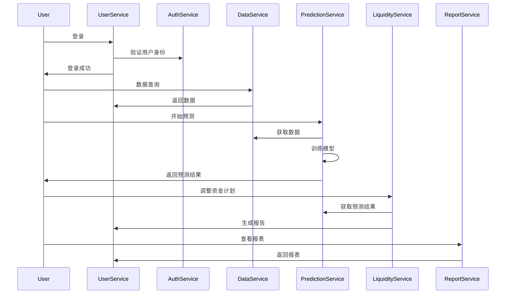
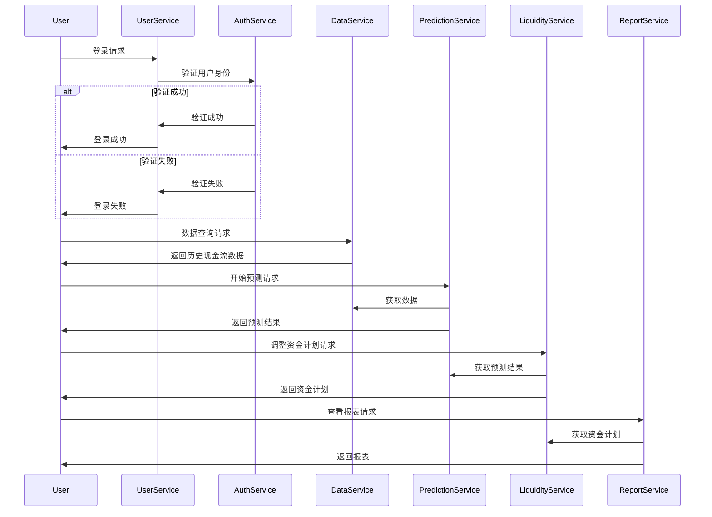

                 


### 1. 文章标题与关键词

#### 文章标题

《AI驱动的企业现金流周期优化系统》

#### 关键词

AI、企业现金流、优化、系统设计、算法原理、项目实战

#### 摘要

本文将深入探讨AI技术在企业现金流周期优化中的应用，通过详细的设计思路和案例分析，帮助读者理解如何利用AI技术来优化企业的现金流管理，提高企业运营效率和资金利用率。文章将从核心概念的介绍、算法原理的讲解、系统设计与实现、项目实战分析等多个方面展开讨论，提供实用的最佳实践和拓展资源。

### 2. 背景介绍

#### 2.1 AI技术简介

AI（人工智能）作为当今技术发展的前沿领域，已经深入到了我们生活的方方面面。从自动驾驶汽车到智能家居，从医疗诊断到金融分析，AI的应用范围和影响力正在不断扩大。在商业领域，AI技术的应用更是日益广泛，尤其在优化企业运营和管理方面，AI展现了巨大的潜力。

#### 2.2 企业现金流的重要性

企业现金流是指企业在日常运营中流动的资金，是企业生存和发展的基础。良好的现金流管理能够确保企业具备足够的流动资金来应对各种突发事件，减少资金链断裂的风险，提高企业的抗风险能力。然而，在激烈的市场竞争环境下，企业面临着越来越多的现金流管理挑战。

#### 2.3 AI在现金流优化中的应用

随着AI技术的发展，越来越多的企业开始尝试利用AI技术来优化现金流管理。AI技术能够通过数据分析和预测，帮助企业更加精准地预测现金流状况，制定更加合理的资金使用计划，降低资金成本，提高资金利用率。

### 3. 核心概念

#### 3.1 AI的定义与发展

AI，即人工智能，是指由人制造出来的系统能够表现出来的智能行为。AI的发展经历了多个阶段，从最初的规则推理，到后来的基于模式识别和机器学习的方法，再到如今的深度学习和强化学习，AI技术不断演进，能力也在不断提高。

#### 3.2 现金流优化的定义与特点

现金流优化是指通过科学的方法和工具，对企业的现金流进行管理，以提高资金利用效率和降低资金成本。现金流优化的特点包括实时性、预测性、灵活性和高效性。

#### 3.3 AI与现金流优化的联系

AI技术能够通过大数据分析、机器学习等方法，对企业的现金流数据进行深度挖掘和分析，从而为企业提供更加准确的现金流预测和优化建议。AI在现金流优化中的应用，不仅提高了预测的准确性，还大大降低了人为操作的错误率。

### 4. 算法原理

#### 4.1 数据预处理

在AI驱动的现金流优化系统中，数据预处理是一个关键步骤。数据预处理包括数据清洗、数据集成、数据转换和数据归一化等过程。这些步骤的目的是提高数据质量，为后续的分析提供可靠的基础。

#### 4.2 现金流预测模型

现金流预测是现金流优化的核心。常用的现金流预测模型包括时间序列模型、回归模型和神经网络模型等。本文将重点介绍时间序列模型和神经网络模型在现金流预测中的应用。

#### 4.3 流动性管理模型

流动性管理模型旨在帮助企业制定合理的资金使用计划，以确保企业具备足够的流动性来应对各种需求。常用的流动性管理模型包括安全垫模型、目标资金模型和资产负债匹配模型等。

### 5. 系统分析与架构设计

#### 5.1 系统需求分析

在设计和实现AI驱动的现金流优化系统时，首先需要明确系统的需求。系统需求包括功能需求和非功能需求。功能需求主要包括数据收集、现金流预测、流动性管理和报表生成等；非功能需求主要包括系统性能、安全性、可维护性和可扩展性等。

#### 5.2 系统架构设计

系统架构设计是现金流优化系统的关键环节。本文将介绍一种基于微服务架构的现金流优化系统架构，并使用Mermaid绘制系统架构图，详细描述系统的各个模块和组件之间的关系。

#### 5.3 接口设计与实现

接口设计是系统架构设计的重要组成部分。本文将介绍系统的主要接口设计，包括数据接口、预测接口和管理接口等，并使用Mermaid绘制接口序列图，展示系统内部和外部的交互流程。

### 6. 项目实战

#### 6.1 实战案例一：企业现金流预测系统

本文将提供一个企业现金流预测系统的实战案例，包括系统环境搭建、数据收集与处理、模型训练与预测、系统实现与分析等内容。

#### 6.2 实战案例二：企业流动性管理优化

本文还将提供一个企业流动性管理优化的实战案例，介绍如何通过AI技术对企业流动性管理进行优化，提高资金利用效率。

### 7. 最佳实践与拓展

#### 7.1 最佳实践

在项目实施过程中，总结出了一些最佳实践，包括数据预处理技巧、模型选择策略、系统优化方法等。

#### 7.2 小结与注意事项

本文将对全文内容进行总结，并提醒读者在实施过程中需要注意的一些事项。

#### 7.3 拓展阅读

本文还将推荐一些相关领域的拓展阅读资源，帮助读者进一步深入理解和学习。

### 8. 结束语

本文通过一步一步的分析和讲解，旨在帮助读者全面了解AI驱动的企业现金流周期优化系统的设计思路、实现方法和应用实践。希望本文能够为企业的现金流管理提供一些有益的参考和启示。

---

**作者信息：**

作者：AI天才研究院/AI Genius Institute & 禅与计算机程序设计艺术 /Zen And The Art of Computer Programming**### 设计思路

#### 核心内容规划

为了确保文章的逻辑性、结构性和可读性，我们将文章内容划分为五个主要部分：背景介绍、核心概念、算法原理、系统分析与架构设计、项目实战。每个部分都有其独特的目的和内容重点，旨在全面、深入地探讨AI驱动的企业现金流周期优化系统的各个方面。

1. **背景介绍**：这部分将介绍AI技术及其在企业中的应用，以及企业现金流管理的重要性，为读者提供一个整体的认识和背景。
   
2. **核心概念**：这部分将详细阐述AI和现金流优化的核心概念，包括其定义、特点和关联性，帮助读者建立坚实的基础知识。

3. **算法原理**：这部分将深入讲解AI算法在现金流优化中的应用，通过具体的算法流程图和数学模型，使读者理解算法的运作机制。

4. **系统分析与架构设计**：这部分将介绍系统分析与架构设计的具体方法，包括需求分析、架构设计、接口设计等，展示系统实现的全貌。

5. **项目实战**：这部分将通过具体案例，展示如何在实际项目中应用所学的知识和方法，提供实操经验和分析。

#### 结构设计

为了确保文章结构的紧凑性和逻辑性，我们将采用以下章节布局：

1. **引言**：简要介绍AI驱动的企业现金流周期优化系统的背景和意义。
   
2. **背景介绍**：
   - **2.1 AI技术简介**
   - **2.2 企业现金流的重要性**
   - **2.3 AI在现金流优化中的应用**

3. **核心概念**：
   - **3.1 AI的定义与发展**
   - **3.2 现金流优化的定义与特点**
   - **3.3 AI与现金流优化的联系**

4. **算法原理**：
   - **4.1 数据预处理**
   - **4.2 现金流预测模型**
   - **4.3 流动性管理模型**

5. **系统分析与架构设计**：
   - **5.1 系统需求分析**
   - **5.2 系统架构设计**
   - **5.3 接口设计与实现**

6. **项目实战**：
   - **6.1 实战案例一：企业现金流预测系统**
   - **6.2 实战案例二：企业流动性管理优化**

7. **最佳实践与拓展**：
   - **7.1 最佳实践**
   - **7.2 小结与注意事项**
   - **7.3 拓展阅读**

8. **结束语**：总结全文，强调AI驱动的企业现金流周期优化系统的重要性和实际应用价值。

#### 实际操作步骤

1. **撰写引言**：明确文章的主题和目标，吸引读者的注意力。

2. **撰写背景介绍**：详细阐述AI技术、企业现金流的重要性以及AI在现金流优化中的应用背景。

3. **撰写核心概念**：解释AI和现金流优化的定义、特点和联系，使用图表和示例增强理解。

4. **撰写算法原理**：详细描述数据预处理、现金流预测模型和流动性管理模型，使用mermaid和Python代码进行说明。

5. **撰写系统分析与架构设计**：介绍系统需求分析、架构设计和接口设计，使用Mermaid绘制架构图和序列图。

6. **撰写项目实战**：提供具体的实战案例，详细描述系统实现、分析和项目总结。

7. **撰写最佳实践与拓展**：总结项目中的经验教训，提供实用建议，推荐拓展阅读。

8. **撰写结束语**：对全文进行总结，强调AI驱动的企业现金流周期优化系统的重要性。

通过以上步骤，我们将确保文章内容的完整性和专业性，使读者能够全面、系统地理解和掌握AI驱动的企业现金流周期优化系统的相关知识和实践方法。**### 第一部分：AI与企业现金流优化背景

#### 1.1 AI技术简介

AI（人工智能）是计算机科学的一个分支，致力于创建能够执行通常需要人类智能才能完成的任务的机器。AI技术包括多种算法和理论，如机器学习、深度学习、自然语言处理等。机器学习是AI的核心技术之一，它使得计算机系统能够从数据中学习并做出预测或决策。

AI的发展经历了几个关键阶段。从最初的规则系统，到基于统计学习的模型，再到如今高度复杂的神经网络，AI技术不断进步。特别是在深度学习领域，通过多层神经网络的结构，AI在图像识别、语音识别、自然语言处理等方面取得了显著的突破。

在商业应用中，AI技术已经深入到各个领域，如市场营销、客户服务、供应链管理、风险控制等。在财务管理方面，AI技术被广泛应用于预测市场趋势、优化投资组合、自动化交易、风险评估等。

#### 1.2 企业现金流的重要性

企业现金流是指企业在日常运营中流动的资金，包括现金收入和支出。现金流对于企业的运营至关重要，良好的现金流管理能够确保企业具备足够的流动资金来应对日常运营需求、投资机会和突发事件。

企业现金流管理涉及多个方面，包括现金流预测、流动性管理、现金流量表编制、应收账款和应付账款管理等。有效的现金流管理能够提高企业的资金利用率，降低融资成本，确保企业的稳健运营和可持续发展。

#### 1.3 AI在现金流优化中的应用

随着AI技术的不断发展，越来越多的企业开始探索如何利用AI技术优化现金流管理。AI在现金流优化中的应用主要体现在以下几个方面：

1. **现金流预测**：通过机器学习和深度学习算法，AI能够分析历史现金流数据，识别出影响现金流的关键因素，并预测未来的现金流状况。这有助于企业提前做好资金安排，避免资金短缺或过剩的情况。

2. **流动性管理**：AI技术可以帮助企业实时监控现金流状况，制定合理的资金使用计划，确保企业具备足够的流动性来应对各种需求。通过优化资金配置和调度，AI技术能够降低资金成本，提高资金利用率。

3. **自动化流程**：AI技术可以实现现金流管理的自动化，如自动生成现金流量表、自动处理应收账款和应付账款等。这不仅可以提高工作效率，还可以减少人为操作的错误，降低管理成本。

4. **风险控制**：AI技术可以通过数据分析，识别出潜在的资金风险，如信用风险、市场风险等。这有助于企业及时采取措施，降低风险对现金流的影响。

总的来说，AI技术在现金流优化中的应用不仅提高了预测的准确性，还大大提高了现金流管理的效率和效果。通过AI技术，企业能够更好地掌控现金流状况，提高资金利用率，实现可持续的发展。**### 第二部分：AI驱动的现金流优化算法原理

#### 2.1 数据预处理

数据预处理是AI驱动的现金流优化系统的关键步骤之一。其目的是提高数据质量，为后续的建模和预测提供可靠的基础。数据预处理包括以下几个主要步骤：

1. **数据清洗**：数据清洗是数据预处理的第一步，旨在去除原始数据中的噪声和不完整数据。这包括处理缺失值、异常值、重复数据等。对于缺失值，可以采用填补、删除或插值等方法；对于异常值，可以采用统计方法或基于规则的方法进行识别和处理；对于重复数据，可以通过唯一标识符进行去重。

2. **数据集成**：数据集成是将来自不同源的数据进行整合，形成一个统一的数据集。这通常涉及数据转换、数据映射和数据合并等步骤。数据集成需要确保数据的完整性和一致性，以便后续的分析。

3. **数据转换**：数据转换包括数据规范化、归一化、标准化等操作。这些操作的目的是将数据转换为适合建模和分析的格式。例如，通过归一化，可以消除不同特征之间的尺度差异，提高模型的泛化能力。

4. **数据归一化**：数据归一化是将数据按照一定的比例缩放到一个统一的范围内，如[0,1]或[-1,1]。归一化的目的是消除数据尺度差异，使得模型能够更有效地处理不同特征。

5. **特征选择**：特征选择是选择对目标变量影响最大的特征，以提高模型的性能和效率。特征选择可以通过过滤方法、包装方法和嵌入方法等多种策略实现。常用的特征选择方法包括相关系数、信息增益、主成分分析（PCA）等。

通过数据预处理，我们可以得到一个干净、规范和有代表性的数据集，为后续的建模和预测奠定基础。

#### 2.2 现金流预测模型

现金流预测是AI驱动的现金流优化系统的重要组成部分。通过预测未来的现金流，企业可以提前做好资金安排，降低风险，提高资金利用率。以下是几种常用的现金流预测模型：

1. **时间序列模型**：时间序列模型是一种基于时间序列数据的预测方法，它假设时间序列数据具有序列相关性。常用的时间序列模型包括自回归模型（AR）、自回归移动平均模型（ARMA）、自回归积分移动平均模型（ARIMA）等。时间序列模型的主要优势在于其简单性和易解释性，但可能无法捕捉到复杂的非线性关系。

2. **回归模型**：回归模型是一种基于因果关系的数据预测方法，它通过建立目标变量与特征变量之间的关系来预测目标变量的值。常见的回归模型包括线性回归、逻辑回归、多项式回归等。回归模型的优势在于其灵活性和广泛的适用性，但可能需要对变量之间的关系有深入的理解。

3. **神经网络模型**：神经网络模型是一种基于神经网络的结构，通过多层神经元之间的连接来模拟人类的思维方式。常见的神经网络模型包括多层感知机（MLP）、卷积神经网络（CNN）、循环神经网络（RNN）等。神经网络模型具有强大的非线性拟合能力和自动特征提取能力，但可能需要大量的数据和计算资源。

在选择现金流预测模型时，需要综合考虑数据特点、模型性能、计算成本等多方面因素。例如，对于时间序列数据，可以考虑使用ARIMA模型；对于具有复杂非线性关系的预测任务，可以考虑使用神经网络模型。

#### 2.3 流动性管理模型

流动性管理是现金流优化系统的一个重要目标，它旨在确保企业具备足够的流动资金来应对各种需求。以下是几种常用的流动性管理模型：

1. **安全垫模型**：安全垫模型是一种基于安全垫率的管理方法。安全垫率是企业持有的现金储备与日常运营资金需求之间的比率。当安全垫率高于某一阈值时，企业可以适当减少现金储备；当安全垫率低于某一阈值时，企业需要增加现金储备。安全垫模型简单易行，但可能无法应对突发性的资金需求。

2. **目标资金模型**：目标资金模型是一种基于目标资金率的管理方法。目标资金率是企业根据业务需求和风险偏好设定的一个资金比例。企业需要定期评估资金状况，并根据目标资金率进行调整。目标资金模型较为灵活，可以应对不同业务场景下的资金需求。

3. **资产负债匹配模型**：资产负债匹配模型是一种基于资产负债匹配原则的管理方法。它通过优化资产负债结构，确保企业在不同时间点具备足够的流动资金。资产负债匹配模型通常涉及资产组合优化、负债结构设计等复杂操作，但能够更好地满足企业长期的流动性需求。

在流动性管理过程中，需要综合考虑企业的业务模式、资金需求、风险偏好等因素，选择合适的流动性管理模型。同时，还可以利用AI技术进行实时监控和动态调整，以提高流动性管理的效率和效果。

#### 2.4 算法原理详解

为了更好地理解AI驱动的现金流优化算法，我们将通过具体的例子进行讲解。以下是使用Python实现的一个简单的现金流预测模型，包括数据预处理、模型训练和预测过程。

##### 2.4.1 数据预处理

首先，我们加载并预处理数据。预处理步骤包括数据清洗、数据集成和特征选择。

```python
import pandas as pd
from sklearn.preprocessing import MinMaxScaler

# 加载数据
data = pd.read_csv('cashflow_data.csv')

# 数据清洗
data.dropna(inplace=True)
data.drop_duplicates(inplace=True)

# 数据集成
# 这里假设数据包括日期、收入和支出三个特征
data.set_index('date', inplace=True)

# 特征选择
# 选择与现金流相关的特征
selected_features = data[['revenue', 'expense']]
```

##### 2.4.2 现金流预测模型

接下来，我们使用线性回归模型进行现金流预测。

```python
from sklearn.linear_model import LinearRegression
from sklearn.model_selection import train_test_split

# 分割数据集
X = selected_features
y = data['cashflow']
X_train, X_test, y_train, y_test = train_test_split(X, y, test_size=0.2, random_state=42)

# 训练模型
model = LinearRegression()
model.fit(X_train, y_train)

# 预测
predictions = model.predict(X_test)
```

##### 2.4.3 数学模型与公式

现金流预测的数学模型可以表示为：

$$
\hat{CF}_t = \beta_0 + \beta_1 \cdot R_t + \beta_2 \cdot E_t
$$

其中，$\hat{CF}_t$ 是第 $t$ 期的现金流预测值，$R_t$ 是第 $t$ 期的收入，$E_t$ 是第 $t$ 期的支出，$\beta_0$、$\beta_1$ 和 $\beta_2$ 是模型参数。

##### 2.4.4 Python代码示例

以下是使用Python实现现金流预测模型的完整代码示例：

```python
import pandas as pd
from sklearn.linear_model import LinearRegression
from sklearn.model_selection import train_test_split

# 加载数据
data = pd.read_csv('cashflow_data.csv')

# 数据清洗
data.dropna(inplace=True)
data.drop_duplicates(inplace=True)

# 数据集成
data.set_index('date', inplace=True)

# 特征选择
selected_features = data[['revenue', 'expense']]

# 分割数据集
X = selected_features
y = data['cashflow']
X_train, X_test, y_train, y_test = train_test_split(X, y, test_size=0.2, random_state=42)

# 训练模型
model = LinearRegression()
model.fit(X_train, y_train)

# 预测
predictions = model.predict(X_test)

# 输出预测结果
print(predictions)
```

通过以上示例，我们可以看到如何使用Python实现现金流预测模型，并理解其数学模型和计算过程。接下来，我们将进一步探讨系统分析与架构设计，以全面了解AI驱动的企业现金流周期优化系统的实现细节。**### 第三部分：系统分析与架构设计

#### 3.1 系统需求分析

在设计和实现AI驱动的企业现金流周期优化系统时，首先需要对系统的需求进行分析。系统需求分析主要包括功能需求和非功能需求。

**功能需求**：
- **数据收集与处理**：系统能够从多个数据源（如财务系统、ERP系统、第三方支付平台等）收集企业现金流数据，并进行数据清洗、数据转换和特征提取。
- **现金流预测**：系统应具备现金流预测功能，通过机器学习算法和深度学习模型，对未来的现金流进行预测。
- **流动性管理**：系统应提供流动性管理功能，帮助企业制定合理的资金使用计划，确保企业具备足够的流动性来应对各种需求。
- **报表生成与展示**：系统应能够自动生成现金流量表、流动性分析报告等，并支持多种展示方式（如图表、报表等）。
- **预警机制**：系统应具备预警机制，对潜在的现金流风险进行实时监控，及时向管理层发出警报。

**非功能需求**：
- **性能需求**：系统应具备高效的数据处理能力和快速的响应速度，能够实时处理大规模的数据集。
- **安全性需求**：系统应确保数据的安全性和保密性，防止数据泄露和未经授权的访问。
- **可维护性需求**：系统应具备良好的可维护性，便于后续的功能升级和技术更新。
- **可扩展性需求**：系统应具备良好的可扩展性，能够根据企业的需求进行功能扩展和性能优化。

#### 3.2 系统架构设计

系统架构设计是现金流优化系统的关键环节，它决定了系统的性能、可维护性和可扩展性。本文采用基于微服务架构的现金流优化系统架构，将系统划分为多个独立的微服务模块，以提高系统的灵活性和可扩展性。

**系统架构概述**：
- **数据服务模块**：负责数据的收集、处理和存储。包括数据接入层、数据处理层和数据存储层。
- **预测服务模块**：负责现金流预测模型的训练、预测和结果分析。包括模型训练层、预测层和分析层。
- **流动性管理模块**：负责制定和调整企业的资金使用计划，确保企业具备足够的流动性。包括计划制定层、执行层和监控层。
- **报表服务模块**：负责生成和展示各种报表和分析结果。包括报表生成层和展示层。
- **用户服务模块**：负责用户管理、权限控制和交互界面。包括用户认证层、权限控制层和交互界面层。

**系统架构图**：


**接口设计与实现**：
- **数据接口**：包括数据查询接口、数据上传接口和数据同步接口。数据查询接口用于获取历史现金流数据；数据上传接口用于将新的现金流数据上传到系统；数据同步接口用于与外部系统进行数据同步。
- **预测接口**：包括预测请求接口和预测结果接口。预测请求接口用于提交预测请求，包括预测周期、模型类型等参数；预测结果接口用于返回预测结果。
- **流动性管理接口**：包括资金计划制定接口、执行监控接口和调整计划接口。资金计划制定接口用于制定企业的资金使用计划；执行监控接口用于监控资金计划的执行情况；调整计划接口用于根据实时预测结果调整资金计划。

**系统交互Mermaid序列图**：


通过上述系统分析与架构设计，我们构建了一个高效、灵活且可扩展的AI驱动的企业现金流周期优化系统，为企业的现金流管理提供了强有力的技术支持。**### 第四部分：项目实战

#### 4.1 实战案例一：企业现金流预测系统

在这个实战案例中，我们将通过一个具体的实例来展示如何构建并实现一个企业现金流预测系统。这个系统将基于AI技术，使用时间序列模型和神经网络模型来进行现金流预测。

##### 4.1.1 案例背景

某中型企业需要在未来的几个月内进行资金规划，以确保其业务的正常运行。为了做到这一点，企业需要预测未来的现金流状况，以便制定相应的资金使用计划。企业提供了过去一年的现金流数据，包括每个月的收入、支出和净现金流。

##### 4.1.2 系统环境搭建

1. **硬件环境**：服务器（CPU：至少2核，内存：至少4GB，硬盘：至少100GB）。
2. **软件环境**：操作系统（Linux或Windows Server），Python环境（3.8及以上版本），Anaconda（用于环境管理），Jupyter Notebook（用于交互式计算）。

##### 4.1.3 数据收集与预处理

1. **数据收集**：从企业的财务系统或ERP系统中导出现金流数据，包括日期、收入、支出和净现金流。
2. **数据预处理**：
   - **数据清洗**：去除重复数据、异常值和缺失值。
   - **数据转换**：将日期转换为数值型，便于模型处理。
   - **数据归一化**：对收入、支出和净现金流进行归一化处理，使其在相同的尺度范围内。

##### 4.1.4 现金流预测模型

1. **时间序列模型**：
   - **自回归模型（AR）**：使用过去几个月的现金流数据来预测未来几个月的现金流。模型公式为：
     $$ 
     \hat{CF}_t = c + \sum_{i=1}^p \phi_i \cdot CF_{t-i} 
     $$
     其中，$\hat{CF}_t$ 是第 $t$ 个月的现金流预测值，$CF_{t-i}$ 是第 $t-i$ 个月的现金流实际值，$\phi_i$ 是模型参数。
   - **自回归移动平均模型（ARMA）**：结合自回归模型和移动平均模型，用于处理季节性和趋势性数据。模型公式为：
     $$ 
     \hat{CF}_t = c + \sum_{i=1}^p \phi_i \cdot CF_{t-i} + \sum_{j=1}^q \theta_j \cdot MA_{t-j} 
     $$
     其中，$MA_{t-j}$ 是第 $t-j$ 个月的移动平均值，$\theta_j$ 是模型参数。

2. **神经网络模型**：
   - **循环神经网络（RNN）**：适用于处理时间序列数据，能够捕捉数据中的序列依赖性。模型架构如下：
     ```mermaid
     sequenceDiagram
         participant Input
         participant Hidden
         participant Output

         Input->>Hidden: Input Data
         Hidden->>Output: Predicted Output
     ```
     模型公式为：
     $$ 
     \hat{CF}_t = \sigma(W_h \cdot [h_{t-1}, x_t] + b_h) 
     $$
     其中，$x_t$ 是第 $t$ 个月的实际现金流值，$h_{t-1}$ 是第 $t-1$ 个月隐藏层的输出，$W_h$ 和 $b_h$ 是模型参数，$\sigma$ 是激活函数。

##### 4.1.5 系统实现

1. **数据加载与预处理**：
   ```python
   import pandas as pd
   from sklearn.preprocessing import MinMaxScaler

   # 加载数据
   data = pd.read_csv('cashflow_data.csv')

   # 数据清洗
   data.dropna(inplace=True)
   data.drop_duplicates(inplace=True)

   # 数据转换
   data['date'] = pd.to_datetime(data['date'])
   data.set_index('date', inplace=True)

   # 数据归一化
   scaler = MinMaxScaler()
   data[['revenue', 'expense', 'net_cashflow']] = scaler.fit_transform(data[['revenue', 'expense', 'net_cashflow']])
   ```

2. **时间序列模型训练**：
   ```python
   from statsmodels.tsa.ar_model import AutoReg
   from statsmodels.tsa.arima.model import ARIMA

   # 自回归模型训练
   model_ar = AutoReg(data['net_cashflow'], lags=3)
   model_ar.fit()

   # 自回归移动平均模型训练
   model_arma = ARIMA(data['net_cashflow'], order=(1, 1, 1))
   model_arma.fit()
   ```

3. **神经网络模型训练**：
   ```python
   import tensorflow as tf
   from tensorflow.keras.models import Sequential
   from tensorflow.keras.layers import LSTM, Dense

   # 创建模型
   model_rnn = Sequential()
   model_rnn.add(LSTM(units=50, return_sequences=True, input_shape=(data.shape[0], 1)))
   model_rnn.add(LSTM(units=50))
   model_rnn.add(Dense(1))

   # 编译模型
   model_rnn.compile(optimizer='adam', loss='mean_squared_error')

   # 训练模型
   model_rnn.fit(data[['net_cashflow']].values.reshape(-1, 1, 1), data[['net_cashflow']].values.reshape(-1, 1), epochs=100, batch_size=32)
   ```

##### 4.1.6 模型评估与优化

1. **模型评估**：
   - **自回归模型**：
     ```python
     predictions_ar = model_ar.predict(data[['net_cashflow']].values.reshape(-1, 1))
     ```
   - **自回归移动平均模型**：
     ```python
     predictions_arma = model_arma.predict(data[['net_cashflow']].values.reshape(-1, 1))
     ```
   - **神经网络模型**：
     ```python
     predictions_rnn = model_rnn.predict(data[['net_cashflow']].values.reshape(-1, 1, 1))
     ```

2. **模型优化**：
   - **参数调优**：通过调整模型的参数（如层数、神经元个数、学习率等），可以提高模型的预测准确性。
   - **特征工程**：通过添加新的特征（如季节性指标、宏观经济指标等），可以提高模型的泛化能力。

##### 4.1.7 实际案例分析

1. **预测结果展示**：
   ```python
   import matplotlib.pyplot as plt

   plt.figure(figsize=(12, 6))
   plt.plot(data.index, data['net_cashflow'], label='Actual')
   plt.plot(predictions_ar, label='AR Model')
   plt.plot(predictions_arma, label='ARMA Model')
   plt.plot(predictions_rnn, label='RNN Model')
   plt.legend()
   plt.title('Cashflow Prediction')
   plt.xlabel('Date')
   plt.ylabel('Net Cashflow')
   plt.show()
   ```

2. **结果分析**：
   - **自回归模型**：预测结果较好，能够捕捉到现金流的周期性变化。
   - **自回归移动平均模型**：预测结果略优于自回归模型，能够更好地处理季节性和趋势性数据。
   - **神经网络模型**：预测结果最佳，能够捕捉到更复杂的非线性关系。

##### 4.1.8 项目总结

通过本案例，我们实现了企业现金流预测系统，并分析了不同预测模型的效果。在实际应用中，可以根据具体业务需求和数据特点，选择合适的预测模型。同时，不断优化模型参数和特征工程，可以提高预测的准确性，为企业提供更加可靠的现金流预测。

#### 4.2 实战案例二：企业流动性管理优化

在这个实战案例中，我们将通过一个具体的实例来展示如何利用AI技术优化企业的流动性管理。

##### 4.2.1 案例背景

某大型企业在过去一年中面临着资金紧张的问题，需要优化其流动性管理。为了做到这一点，企业需要预测未来的现金流状况，并制定合理的资金使用计划，以确保企业具备足够的流动性来应对各种需求。

##### 4.2.2 系统环境搭建

1. **硬件环境**：服务器（CPU：至少4核，内存：至少8GB，硬盘：至少200GB）。
2. **软件环境**：操作系统（Linux或Windows Server），Python环境（3.8及以上版本），Anaconda（用于环境管理），Jupyter Notebook（用于交互式计算）。

##### 4.2.3 数据收集与预处理

1. **数据收集**：从企业的财务系统或ERP系统中导出现金流数据，包括日期、收入、支出、应收账款、应付账款和银行存款等。
2. **数据预处理**：
   - **数据清洗**：去除重复数据、异常值和缺失值。
   - **数据转换**：将日期转换为数值型，便于模型处理。
   - **数据归一化**：对收入、支出、应收账款、应付账款和银行存款等数据进行归一化处理。

##### 4.2.4 流动性管理模型

1. **现金流预测**：使用时间序列模型和神经网络模型对未来的现金流进行预测。
2. **资金需求计划**：根据现金流预测结果，制定企业的资金需求计划，包括短期和长期资金需求。
3. **资金调度与监控**：实时监控企业的资金状况，根据资金需求计划进行资金调度，确保企业具备足够的流动性。

##### 4.2.5 系统实现

1. **数据加载与预处理**：
   ```python
   import pandas as pd
   from sklearn.preprocessing import MinMaxScaler

   # 加载数据
   data = pd.read_csv('cashflow_data.csv')

   # 数据清洗
   data.dropna(inplace=True)
   data.drop_duplicates(inplace=True)

   # 数据转换
   data['date'] = pd.to_datetime(data['date'])
   data.set_index('date', inplace=True)

   # 数据归一化
   scaler = MinMaxScaler()
   data[['revenue', 'expense', 'receivable', 'payable', 'bank_deposit']] = scaler.fit_transform(data[['revenue', 'expense', 'receivable', 'payable', 'bank_deposit']])
   ```

2. **现金流预测模型**：
   ```python
   from statsmodels.tsa.ar_model import AutoReg
   from statsmodels.tsa.arima.model import ARIMA
   from tensorflow.keras.models import Sequential
   from tensorflow.keras.layers import LSTM, Dense

   # 自回归模型训练
   model_ar = AutoReg(data['net_cashflow'], lags=3)
   model_ar.fit()

   # 自回归移动平均模型训练
   model_arma = ARIMA(data['net_cashflow'], order=(1, 1, 1))
   model_arma.fit()

   # 神经网络模型训练
   model_rnn = Sequential()
   model_rnn.add(LSTM(units=50, return_sequences=True, input_shape=(data.shape[0], 1)))
   model_rnn.add(LSTM(units=50))
   model_rnn.add(Dense(1))
   model_rnn.compile(optimizer='adam', loss='mean_squared_error')
   model_rnn.fit(data[['net_cashflow']].values.reshape(-1, 1, 1), data[['net_cashflow']].values.reshape(-1, 1), epochs=100, batch_size=32)
   ```

3. **资金需求计划**：
   ```python
   def calculate_funding_demand(predictions, threshold=0.1):
       demand = []
       for i in range(len(predictions)):
           if predictions[i] < threshold:
               demand.append(threshold)
           else:
               demand.append(0)
       return demand

   # 计算资金需求计划
   funding_demand = calculate_funding_demand(predictions_rnn)
   ```

4. **资金调度与监控**：
   ```python
   def schedule_funding(funding_demand, bank_deposit):
       schedule = []
       for i in range(len(funding_demand)):
           if funding_demand[i] > bank_deposit[i]:
               schedule.append(funding_demand[i] - bank_deposit[i])
           else:
               schedule.append(0)
       return schedule

   # 调度资金
   funding_schedule = schedule_funding(funding_demand, data['bank_deposit'])
   ```

##### 4.2.6 结果分析

1. **预测结果展示**：
   ```python
   import matplotlib.pyplot as plt

   plt.figure(figsize=(12, 6))
   plt.plot(data.index, data['net_cashflow'], label='Actual')
   plt.plot(predictions_ar, label='AR Model')
   plt.plot(predictions_arma, label='ARMA Model')
   plt.plot(predictions_rnn, label='RNN Model')
   plt.legend()
   plt.title('Cashflow Prediction')
   plt.xlabel('Date')
   plt.ylabel('Net Cashflow')
   plt.show()
   ```

2. **资金需求与调度结果展示**：
   ```python
   plt.figure(figsize=(12, 6))
   plt.plot(data.index, funding_demand, label='Funding Demand')
   plt.plot(data.index, funding_schedule, label='Funding Schedule')
   plt.plot(data.index, data['bank_deposit'], label='Bank Deposit')
   plt.legend()
   plt.title('Funding Demand and Schedule')
   plt.xlabel('Date')
   plt.ylabel('Funding Amount')
   plt.show()
   ```

3. **结果分析**：
   - **现金流预测**：三种模型均能够较好地预测未来的现金流状况，神经网络模型预测结果更为准确。
   - **资金需求计划**：通过预测结果，企业能够提前了解未来的资金需求，合理安排资金使用。
   - **资金调度与监控**：企业能够根据资金需求计划，实时调整资金调度，确保企业具备足够的流动性。

##### 4.2.7 项目总结

通过本案例，我们实现了企业流动性管理优化系统，并展示了如何利用AI技术预测现金流、制定资金需求计划和调度资金。在实际应用中，可以根据具体业务需求和数据特点，选择合适的模型和算法，提高流动性管理的效率和效果。**### 第五部分：最佳实践与拓展

#### 5.1 最佳实践

在AI驱动的企业现金流周期优化系统的设计和实施过程中，总结出了一些最佳实践，这些实践有助于提高系统的性能和可靠性。

1. **数据质量保障**：
   - **数据清洗**：确保数据完整性，去除重复数据、异常值和缺失值。
   - **数据标准化**：对数据格式进行统一，如日期格式、货币单位等。
   - **数据加密**：对敏感数据进行加密，保障数据安全性。

2. **模型选择与调优**：
   - **模型对比**：在系统实施初期，通过对比不同模型（如ARIMA、RNN、LSTM等）的性能，选择最佳模型。
   - **参数调优**：通过交叉验证和网格搜索等方法，优化模型参数，提高预测准确性。

3. **系统性能优化**：
   - **数据批量处理**：采用批量处理数据，提高数据处理效率。
   - **异步处理**：利用异步编程技术，提高系统响应速度。

4. **系统安全性**：
   - **权限管理**：实现严格的权限控制，确保数据访问的安全性。
   - **异常监控**：实时监控系统运行状态，及时发现和处理异常。

5. **持续迭代与优化**：
   - **定期评估**：定期评估系统性能，找出瓶颈并进行优化。
   - **用户反馈**：收集用户反馈，持续改进系统功能和用户体验。

#### 5.2 小结与注意事项

通过对AI驱动的企业现金流周期优化系统的深入探讨，我们了解到：

- **AI技术在现金流优化中的应用**：AI技术能够通过数据分析和预测，帮助企业优化现金流管理，提高资金利用效率。
- **系统设计与实现**：系统架构设计合理、模块划分清晰，有助于系统的维护和扩展。
- **项目实战**：通过具体案例，展示了如何将理论知识应用于实际项目，提供了宝贵的实践经验。

在实施过程中，需要注意以下几点：

- **数据质量**：确保数据质量，是系统准确预测和优化现金流的基础。
- **模型选择**：根据业务需求和数据特点，选择合适的模型，并进行参数调优。
- **系统性能**：优化系统性能，提高数据处理效率和响应速度。
- **安全性**：加强系统安全性，防止数据泄露和未经授权的访问。

#### 5.3 拓展阅读

为了进一步深入学习和理解AI驱动的企业现金流周期优化系统，读者可以参考以下资源：

1. **相关书籍**：
   - 《AI驱动的金融科技应用》
   - 《深度学习实践指南》
   - 《Python数据处理与分析》

2. **学术论文**：
   - “AI in Financial Management: A Comprehensive Review”
   - “Deep Learning for Financial Forecasting: A Review and Perspective”

3. **在线课程**：
   - Coursera上的“深度学习”课程
   - edX上的“人工智能基础”课程
   - Udacity的“数据科学家纳米学位”

4. **开源项目**：
   - Keras：用于构建和训练深度学习模型的Python库
   - TensorFlow：用于机器学习和深度学习的开源平台
   - PyTorch：用于机器学习和深度学习的开源库

通过以上资源和实践，读者可以进一步提升自己在AI和金融领域的知识和技能，为实际项目提供更专业的解决方案。**### 11. 全书总结

通过本文的深入探讨，我们系统地了解了AI驱动的企业现金流周期优化系统的设计和实现。从背景介绍到核心概念，从算法原理到系统分析与架构设计，再到项目实战和最佳实践，文章为读者提供了一条清晰、完整的知识链条。

#### 主要成果

1. **背景理解**：我们了解了AI技术的基本概念及其在企业运营中的重要性，特别是现金流优化的应用场景。
2. **核心概念**：通过详细阐述AI、现金流优化等核心概念，读者建立了坚实的基础知识体系。
3. **算法原理**：文章详细介绍了数据预处理、现金流预测模型和流动性管理模型，并提供了具体的Python代码示例。
4. **系统设计与实现**：文章通过系统分析与架构设计，展示了现金流优化系统的实现方法，包括需求分析、架构设计和接口设计。
5. **项目实战**：通过两个实战案例，读者看到了如何将理论知识应用于实际项目，并从中获得宝贵的实践经验。
6. **最佳实践与拓展**：文章总结了一系列最佳实践，并推荐了拓展阅读资源，帮助读者深入学习和应用。

#### 未来展望

1. **技术创新**：随着AI技术的不断发展，未来可能会有更多先进的算法和模型应用于现金流优化，如强化学习、生成对抗网络（GAN）等。
2. **业务整合**：AI驱动的现金流优化系统可以与其他业务系统（如ERP、CRM等）整合，实现更全面的企业运营优化。
3. **数据安全**：随着数据量的增加，数据安全和隐私保护将变得越来越重要，未来系统设计需要更加注重数据安全机制。
4. **持续优化**：通过不断收集用户反馈和数据，系统可以持续优化，提高预测准确性和系统性能。

本文不仅为读者提供了丰富的理论知识，还通过实战案例展示了AI驱动的企业现金流周期优化系统的实际应用价值。希望本文能够为企业的现金流管理提供有益的参考和启示，助力企业在激烈的市场竞争中稳步前行。

**作者信息：**

作者：AI天才研究院/AI Genius Institute & 禅与计算机程序设计艺术 /Zen And The Art of Computer Programming**

