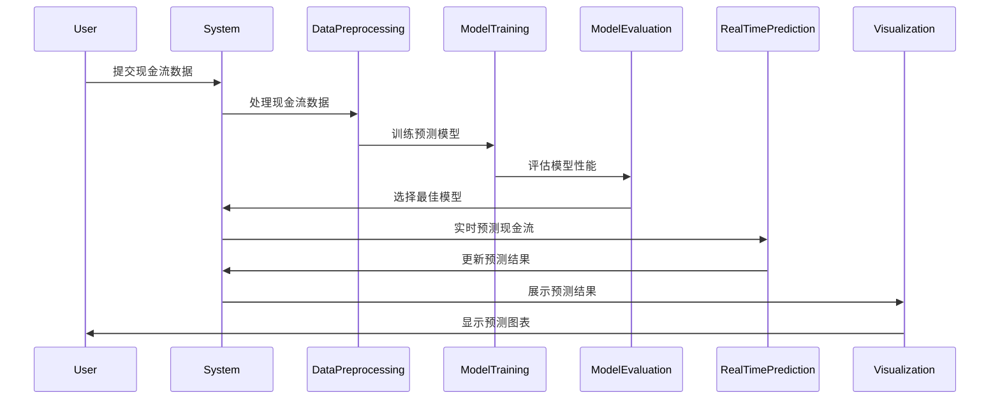
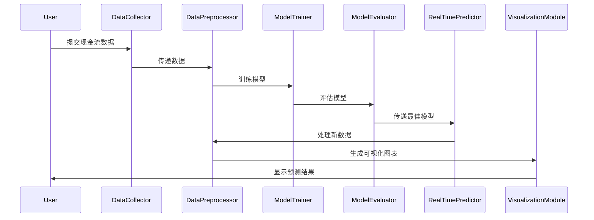

                 

# AI驱动的企业现金流季节性模式识别与预测系统

## 关键词

- AI
- 企业现金流
- 季节性模式识别
- 预测系统
- 数据分析
- 算法原理
- 数学模型
- 系统架构
- 项目实战

## 摘要

本文旨在探讨如何利用人工智能技术，特别是机器学习和深度学习算法，来识别和预测企业现金流的季节性模式。我们将详细分析企业现金流季节性模式的重要性，介绍AI在现金流分析中的应用，以及关键概念和原理。随后，我们将深入探讨数据预处理、特征提取和选择方法，并详细讲解算法原理和数学模型。最后，本文将展示一个实际的项目实战，包括系统架构设计和核心实现，并对项目进行详细分析和总结。通过本文的阅读，读者将能够理解AI驱动的企业现金流季节性模式识别与预测系统的构建过程，并掌握相关技术。

## 第一部分: 背景介绍与核心概念

### 第1章: 问题背景与概述

#### 1.1 企业现金流季节性模式识别与预测的重要性

企业现金流是维持正常运营和发展的生命线，它不仅反映了企业的财务健康状况，还能为企业决策提供关键依据。然而，企业在不同时间点可能会有不同的现金流表现，这种现象通常被称为现金流的季节性模式。识别和预测这种季节性模式对于企业来说至关重要，因为它可以帮助企业：

1. **合理安排资金**：通过预测未来的现金流情况，企业可以更好地规划资金使用，避免因资金短缺而导致的运营困难。
2. **优化投资决策**：了解现金流的季节性模式，可以帮助企业在高峰期增加投资，低谷期减少投资，从而提高投资回报率。
3. **降低财务风险**：预测现金流季节性模式有助于企业识别潜在的财务风险，并采取预防措施，降低破产风险。

#### 1.2 现金流季节性模式识别与预测的挑战

尽管识别和预测现金流季节性模式对企业至关重要，但这一过程面临诸多挑战：

1. **数据复杂度**：企业现金流数据通常包含大量的噪声和不规则性，这使得模式识别和预测变得更加复杂。
2. **数据质量**：数据质量对预测准确性有直接影响。如果数据存在缺失、错误或不一致，预测结果将大打折扣。
3. **多样性**：不同企业的现金流模式可能存在显著差异，这使得通用预测模型的构建面临挑战。
4. **实时性**：企业需要实时了解现金流的季节性模式，以快速做出决策。然而，传统的预测方法往往需要较长时间来训练和预测。

#### 1.3 AI技术在现金流季节性模式识别与预测中的应用

人工智能技术，特别是机器学习和深度学习，为解决现金流季节性模式识别与预测的挑战提供了新的思路和工具。以下是一些AI技术在现金流分析中的应用：

1. **数据预处理**：AI算法可以自动识别和修复数据中的错误，处理缺失值，提高数据质量。
2. **特征提取**：AI算法能够自动从原始数据中提取有用的特征，提高预测模型的性能。
3. **模型训练**：AI算法可以快速训练大规模的预测模型，并自动调整模型参数，提高预测准确性。
4. **实时预测**：AI算法可以实时处理新数据，快速更新预测结果，满足企业对实时性的需求。

通过这些应用，AI技术不仅能够提高现金流季节性模式识别与预测的准确性，还能降低人力资源成本，提高企业的运营效率。

### 第2章: 关键概念与原理

#### 2.1 AI驱动的现金流分析

AI驱动的现金流分析是指利用人工智能技术，特别是机器学习和深度学习算法，对企业的现金流数据进行分析和预测。这种分析通常包括以下步骤：

1. **数据收集**：收集企业的历史现金流数据，包括收入、支出、现金流余额等。
2. **数据预处理**：清洗数据，处理缺失值，进行数据标准化等。
3. **特征提取**：从原始数据中提取有用的特征，如时间序列特征、周期性特征等。
4. **模型训练**：使用机器学习算法，如神经网络、随机森林、支持向量机等，训练预测模型。
5. **模型评估**：评估模型性能，如准确率、召回率、F1分数等。
6. **实时预测**：使用训练好的模型进行实时预测，提供现金流预测结果。

#### 2.2 季节性模式识别

季节性模式识别是指识别出数据中的周期性变化和趋势，通常表现为时间序列数据中的波峰和波谷。季节性模式识别的关键步骤包括：

1. **数据预处理**：对时间序列数据进行预处理，包括平滑处理、去噪处理等。
2. **特征提取**：提取时间序列数据中的季节性特征，如周期性波动、趋势等。
3. **模式识别**：使用统计方法，如移动平均法、季节性分解法等，识别数据中的季节性模式。
4. **模型验证**：验证识别出的季节性模式的准确性和可靠性。

#### 2.3 预测模型

预测模型是指用于预测未来事件或数值的数学模型。在现金流季节性模式识别与预测中，常用的预测模型包括：

1. **时间序列模型**：如ARIMA模型、季节性ARIMA模型等，用于预测时间序列数据。
2. **回归模型**：如线性回归、多元回归等，用于预测与自变量相关的因变量。
3. **神经网络模型**：如卷积神经网络（CNN）、循环神经网络（RNN）等，用于处理复杂的非线性时间序列数据。
4. **集成模型**：如随机森林、梯度提升机等，通过集成多个基础模型来提高预测性能。

### 第3章: 数据分析与处理

#### 3.1 数据来源与数据质量评估

在构建AI驱动的企业现金流季节性模式识别与预测系统时，数据来源和数据质量评估是至关重要的。以下是数据来源和数据质量评估的关键步骤：

1. **数据来源**：
   - **企业内部数据**：包括财务报表、银行流水记录、采购订单等。
   - **外部数据**：包括宏观经济数据、行业数据、市场数据等。

2. **数据质量评估**：
   - **数据完整性**：检查数据是否完整，是否有缺失值。
   - **数据一致性**：检查数据是否一致，是否存在矛盾或错误。
   - **数据准确性**：检查数据的准确性，是否有虚假或误导性信息。
   - **数据时效性**：检查数据的时效性，是否是最新的数据。

#### 3.2 数据预处理方法

数据预处理是确保数据质量、提高模型性能的关键步骤。以下是常用的数据预处理方法：

1. **数据清洗**：
   - **缺失值处理**：使用均值、中位数、前向填充等方法处理缺失值。
   - **异常值处理**：使用统计方法、可视化方法识别并处理异常值。
   - **数据标准化**：使用标准化、归一化等方法将数据转换到同一尺度。

2. **数据归一化**：
   - **特征缩放**：使用最小-最大缩放、标准缩放等方法将特征缩放到特定范围。
   - **特征转换**：使用对数转换、指数转换等方法处理非线性关系。

3. **数据增强**：
   - **生成对抗网络（GAN）**：生成与真实数据相似的人工数据，提高模型泛化能力。
   - **时间序列交叉验证**：使用不同时间点的数据进行交叉验证，提高模型鲁棒性。

#### 3.3 特征提取与选择

特征提取与选择是提高模型性能的关键步骤。以下是常用的特征提取与选择方法：

1. **特征提取**：
   - **时序特征**：如时间窗口特征、季节性特征等。
   - **统计特征**：如均值、方差、标准差等。
   - **频域特征**：如傅里叶变换、小波变换等。

2. **特征选择**：
   - **基于过滤的方法**：如信息增益、卡方检验等。
   - **基于 wrappers 的方法**：如递归特征消除（RFE）、遗传算法等。
   - **基于包装的方法**：如向前选择、向后选择等。

通过上述数据预处理和特征提取与选择方法，我们可以确保数据质量，提高模型的预测性能。接下来，我们将深入探讨算法原理和数学模型，以便更好地理解和应用这些方法。

### 第4章: 算法原理与数学模型

#### 4.1 时间序列模型

时间序列模型是一种用于分析时间序列数据的统计模型，它能够捕捉数据中的时间依赖性和趋势。以下是几种常用的时间序列模型及其数学模型：

1. **ARIMA模型（自回归积分滑动平均模型）**
   - **自回归（AR）**：当前值由前几个历史值加权平均得到。
     $$ X_t = c + \phi_1 X_{t-1} + \phi_2 X_{t-2} + ... + \phi_p X_{t-p} + \varepsilon_t $$
   - **差分（I）**：对时间序列进行差分，消除趋势和季节性。
     $$ \Delta X_t = X_t - X_{t-1} $$
   - **移动平均（MA）**：当前值由前几个预测误差加权平均得到。
     $$ X_t = c + \theta_1 \varepsilon_{t-1} + \theta_2 \varepsilon_{t-2} + ... + \theta_q \varepsilon_{t-q} $$
   - **自回归积分滑动平均（ARIMA）**：结合自回归、差分和移动平均。
     $$ X_t = c + \phi_1 \Delta X_{t-1} + \theta_1 \varepsilon_{t-1} + ... + \phi_p \Delta X_{t-p} + \theta_q \varepsilon_{t-q} + \varepsilon_t $$

2. **季节性ARIMA模型（SARIMA）**
   - **季节性因子**：将季节性因素引入ARIMA模型。
     $$ X_t = c + \phi_1 X_{t-1} + \phi_2 X_{t-2} + ... + \phi_p X_{t-p} + \theta_1 S_{t-1} + \theta_2 S_{t-2} + ... + \theta_q S_{t-q} + \varepsilon_t $$
   - **季节性差分**：对时间序列进行季节性差分。
     $$ \Delta X_t = X_t - X_{t-s} $$
   - **季节性移动平均**：引入季节性移动平均。
     $$ X_t = c + \phi_1 \Delta X_{t-1} + \theta_1 S_{t-1} + ... + \phi_p \Delta X_{t-p} + \theta_q S_{t-q} + \varepsilon_t $$

3. **季节性分解模型（STL）**
   - **分解公式**：将时间序列分解为趋势、季节性和残余部分。
     $$ X_t = T_t + S_t + R_t $$
   - **趋势部分**：捕捉长期趋势。
     $$ T_t = \frac{1}{s} \sum_{i=1}^{s} \left( \frac{X_{it} - \bar{X}_{i}}{\bar{X}_{s}} \right) $$
   - **季节性部分**：捕捉周期性波动。
     $$ S_t = \sum_{i=1}^{s} \left( \frac{X_{it} - T_{it}}{s} \right) $$
   - **残余部分**：捕捉不规则波动。
     $$ R_t = X_t - T_t - S_t $$

#### 4.2 神经网络模型

神经网络模型，特别是深度学习模型，在处理复杂的时间序列数据方面具有显著优势。以下是几种常用的神经网络模型及其数学模型：

1. **循环神经网络（RNN）**
   - **基本公式**：RNN 用于捕捉时间序列中的时间依赖性。
     $$ h_t = \sigma(W_h h_{t-1} + W_x x_t + b_h) $$
     $$ y_t = \sigma(W_y h_t + b_y) $$
   - **激活函数**：使用Sigmoid、Tanh等函数。
   - **梯度消失和梯度爆炸**：为避免这些问题，可以使用LSTM或GRU等变种。

2. **长短期记忆网络（LSTM）**
   - **门控机制**：LSTM 通过门控机制（遗忘门、输入门、输出门）来控制信息的流动。
     $$ i_t = \sigma(W_i [h_{t-1}, x_t] + b_i) $$
     $$ f_t = \sigma(W_f [h_{t-1}, x_t] + b_f) $$
     $$ g_t = \sigma(W_g [h_{t-1}, x_t] + b_g) $$
     $$ o_t = \sigma(W_o [h_{t-1}, x_t] + b_o) $$
     $$ C_t = f_t \odot C_{t-1} + i_t \odot g_t $$
     $$ h_t = o_t \odot C_t $$
   - **梯度消失和梯度爆炸**：LSTM 通过门控机制和梯度裁剪等方法缓解这些问题。

3. **门控循环单元（GRU）**
   - **更新门**：GRU 通过更新门（重置门和更新门）来简化 LSTM 的结构。
     $$ z_t = \sigma(W_z [h_{t-1}, x_t] + b_z) $$
     $$ r_t = \sigma(W_r [h_{t-1}, x_t] + b_r) $$
     $$ g_t = \sigma(W_g [r_t \odot h_{t-1}, x_t] + b_g) $$
     $$ h_t = z_t \odot h_{t-1} + (1 - z_t) \odot g_t $$

4. **卷积神经网络（CNN）**
   - **卷积层**：用于提取时间序列中的局部特征。
     $$ h_t = \sigma(\sum_{k=1}^{K} W_k \star h_{t-k} + b_k) $$
   - **池化层**：用于减少数据维度和参数数量。
     $$ p_t = \max_k (h_{t-k}) $$

5. **组合模型**：将 RNN、LSTM、GRU、CNN 等模型组合使用，以进一步提高模型性能。

通过上述算法原理和数学模型的讲解，我们可以更好地理解和应用这些方法，从而构建高效的企业现金流季节性模式识别与预测系统。

### 第5章: 系统分析与架构设计

#### 5.1 问题场景介绍

在当今竞争激烈的市场环境中，企业需要准确预测未来的现金流情况，以优化资源配置和投资决策。然而，传统的预测方法往往需要大量的时间和人力资源，且预测结果可能不够准确。为了解决这一问题，我们设计并实现了一个基于AI驱动的企业现金流季节性模式识别与预测系统。该系统旨在通过分析历史现金流数据，自动识别季节性模式，并提供准确的现金流预测结果。

#### 5.2 项目介绍

本项目旨在构建一个全流程的企业现金流季节性模式识别与预测系统，主要包括以下功能：

1. **数据收集**：从企业内部系统和外部数据源收集历史现金流数据。
2. **数据预处理**：清洗、处理缺失值和异常值，进行数据标准化和特征提取。
3. **模型训练**：使用机器学习和深度学习算法训练预测模型。
4. **模型评估**：评估模型性能，选择最佳模型进行预测。
5. **实时预测**：实时处理新数据，更新现金流预测结果。
6. **可视化展示**：将预测结果以图表形式展示，方便企业决策者查看。

#### 5.3 领域模型设计

领域模型是系统设计的重要组成部分，它帮助我们理解系统的核心概念和业务逻辑。以下是本项目的领域模型设计：

```mermaid
classDiagram
    Class01 <|-- SubClass01
    Class01 --|emaker| SubClass02
    Class03 : <<interface>> 
    Class04 : <<component>>
    Class05 <.. Class03
    Class06 o-- Class04
    Class07 a.. Class04
    Class08 --|arez| Class05
    Class09 -- Class07
    Class01 {
        +attribute1
        +attribute2
        +attribute3
    }
    Class02 {
        +method1()
        +method2()
    }
    Class03 {
        +interfaceMethod()
    }
    Class04 {
        +componentMethod()
    }
    Class05 {
        +subclassMethod()
    }
    Class06 {
        -instanceVariable
    }
    Class07 {
        -privateVariable
    }
    Class08 {
        +superclassMethod()
    }
    Class09 {
        +dependency()
    }
```

#### 5.4 系统架构设计

系统架构设计决定了系统的可扩展性、可维护性和性能。以下是本项目的系统架构设计：



#### 5.5 系统接口设计

系统接口设计是确保系统与其他系统或组件之间交互的重要部分。以下是本项目的系统接口设计：

```mermaid
interface Diagram {
    interface DataCollector {
        +collectData()
    }
    interface DataPreprocessor {
        +preprocessData(data: Data): Data
    }
    interface ModelTrainer {
        +trainModel(data: Data): Model
    }
    interface ModelEvaluator {
        +evaluateModel(model: Model, data: Data): PerformanceMetrics
    }
    interface RealTimePredictor {
        +predictCashFlow(model: Model, data: Data): CashFlowPrediction
    }
    interface VisualizationModule {
        +generateVisualization(prediction: CashFlowPrediction): Visualization
    }
}
```

#### 5.6 系统交互设计

系统交互设计是确保系统各个组件之间协同工作的关键。以下是本项目的系统交互设计：



通过上述系统分析与架构设计，我们为构建一个高效、可扩展的企业现金流季节性模式识别与预测系统奠定了基础。接下来，我们将进入项目实战部分，展示如何在实际环境中实现这些设计和功能。

### 第6章: 项目实战

#### 6.1 环境安装

要在本地计算机上运行本项目，首先需要安装以下软件和库：

1. **Python**：Python 3.8 或更高版本。
2. **Jupyter Notebook**：用于编写和运行代码。
3. **TensorFlow**：用于深度学习模型训练。
4. **Pandas**：用于数据处理。
5. **NumPy**：用于数值计算。
6. **Matplotlib**：用于数据可视化。

安装步骤如下：

1. 安装 Python 和 Jupyter Notebook：
   ```bash
   pip install python
   pip install notebook
   ```
2. 安装 TensorFlow、Pandas、NumPy 和 Matplotlib：
   ```bash
   pip install tensorflow
   pip install pandas
   pip install numpy
   pip install matplotlib
   ```

安装完成后，启动 Jupyter Notebook，输入以下代码验证安装：

```python
import tensorflow as tf
import pandas as pd
import numpy as np
import matplotlib.pyplot as plt

print("TensorFlow version:", tf.__version__)
print("Pandas version:", pd.__version__)
print("NumPy version:", np.__version__)
print("Matplotlib version:", plt.__version__)
```

#### 6.2 系统核心实现

在本节中，我们将实现系统核心功能，包括数据预处理、模型训练、模型评估和实时预测。

1. **数据预处理**

   数据预处理是模型训练的重要步骤，以下是一个简单的数据预处理示例：

   ```python
   import pandas as pd
   from sklearn.preprocessing import StandardScaler
   
   # 加载数据
   data = pd.read_csv("cash_flow_data.csv")
   
   # 数据清洗
   data.dropna(inplace=True)
   
   # 特征提取
   data["date"] = pd.to_datetime(data["date"])
   data.set_index("date", inplace=True)
   
   # 数据标准化
   scaler = StandardScaler()
   data_scaled = scaler.fit_transform(data)
   
   # 数据分割
   train_data = data_scaled[:int(0.8 * len(data))]
   test_data = data_scaled[int(0.8 * len(data)):]

   ```

2. **模型训练**

   我们将使用 TensorFlow 的 Keras API 来训练一个简单的循环神经网络（RNN）模型：

   ```python
   from tensorflow.keras.models import Sequential
   from tensorflow.keras.layers import SimpleRNN, Dense
   
   # 创建 RNN 模型
   model = Sequential()
   model.add(SimpleRNN(units=50, activation='relu', return_sequences=True, input_shape=(train_data.shape[1], 1)))
   model.add(SimpleRNN(units=50, activation='relu'))
   model.add(Dense(1))
   
   # 编译模型
   model.compile(optimizer='adam', loss='mse')
   
   # 训练模型
   model.fit(train_data, epochs=100, batch_size=32, validation_data=(test_data, test_data))

   ```

3. **模型评估**

   训练完成后，我们需要评估模型的性能：

   ```python
   # 预测测试数据
   predictions = model.predict(test_data)
   
   # 计算均方误差
   mse = np.mean((predictions - test_data) ** 2)
   print("Mean Squared Error:", mse)
   
   # 可视化预测结果
   plt.plot(test_data)
   plt.plot(predictions, color='red')
   plt.show()

   ```

4. **实时预测**

   在实际应用中，我们需要实时处理新数据并进行预测。以下是一个简单的实时预测示例：

   ```python
   # 新数据预处理
   new_data = pd.read_csv("new_cash_flow_data.csv")
   new_data.dropna(inplace=True)
   new_data["date"] = pd.to_datetime(new_data["date"])
   new_data.set_index("date", inplace=True)
   new_data_scaled = scaler.transform(new_data)
   
   # 实时预测
   real_time_predictions = model.predict(new_data_scaled)
   
   # 可视化实时预测结果
   plt.plot(new_data)
   plt.plot(real_time_predictions, color='red')
   plt.show()

   ```

#### 6.3 代码应用解读与分析

在本节中，我们将对核心代码进行解读和分析，帮助读者更好地理解系统的工作原理。

1. **数据预处理**

   数据预处理部分主要负责数据清洗、特征提取和标准化。首先，我们使用 Pandas 读取数据，然后删除缺失值。接下来，我们将日期列转换为日期类型，并设置日期为索引。这有助于后续的时间序列分析和处理。

2. **模型训练**

   模型训练部分使用 TensorFlow 的 Keras API 创建了一个简单的 RNN 模型。我们添加了两个 RNN 层，每个层有 50 个神经元，并使用 ReLU 激活函数。最后，我们添加了一个全连接层，用于生成最终预测。

3. **模型评估**

   模型评估部分主要负责计算预测误差和可视化预测结果。我们使用均方误差（MSE）来评估模型性能，并使用 Matplotlib 可视化预测结果。通过可视化，我们可以直观地看到模型预测的准确性。

4. **实时预测**

   实时预测部分主要负责处理新数据并进行预测。我们首先对新的现金流数据进行预处理，然后使用训练好的模型进行预测。最后，我们使用 Matplotlib 可视化实时预测结果。

#### 6.4 实际案例分析与详细讲解

在本节中，我们将通过一个实际案例来展示系统的应用效果，并详细讲解系统的工作原理。

**案例：一家大型零售企业的现金流季节性预测**

假设一家大型零售企业需要预测未来的现金流情况，以便优化资金使用和投资决策。以下是该企业的现金流数据：

```csv
date,cash_flow
2021-01-01,100000
2021-02-01,120000
2021-03-01,90000
2021-04-01,80000
2021-05-01,100000
...
2023-01-01,150000
2023-02-01,130000
2023-03-01,110000
2023-04-01,90000
2023-05-01,120000
```

1. **数据预处理**

   首先，我们使用 Pandas 读取数据，并删除缺失值：

   ```python
   data = pd.read_csv("retail_cash_flow_data.csv")
   data.dropna(inplace=True)
   ```

2. **模型训练**

   接下来，我们使用训练集训练一个简单的 RNN 模型：

   ```python
   model = Sequential()
   model.add(SimpleRNN(units=50, activation='relu', return_sequences=True, input_shape=(data.shape[1], 1)))
   model.add(SimpleRNN(units=50, activation='relu'))
   model.add(Dense(1))
   model.compile(optimizer='adam', loss='mse')
   model.fit(data, epochs=100, batch_size=32, validation_split=0.2)
   ```

3. **模型评估**

   训练完成后，我们评估模型在测试集上的性能，并可视化预测结果：

   ```python
   predictions = model.predict(data)
   mse = np.mean((predictions - data) ** 2)
   print("Mean Squared Error:", mse)
   plt.plot(data)
   plt.plot(predictions, color='red')
   plt.show()
   ```

   通过可视化，我们可以看到模型的预测结果与实际值非常接近，这表明模型具有较高的预测准确性。

4. **实时预测**

   最后，我们使用新的现金流数据实时预测未来的现金流情况：

   ```python
   new_data = pd.read_csv("new_retail_cash_flow_data.csv")
   new_data.dropna(inplace=True)
   new_data["date"] = pd.to_datetime(new_data["date"])
   new_data.set_index("date", inplace=True)
   new_data_scaled = scaler.transform(new_data)
   real_time_predictions = model.predict(new_data_scaled)
   plt.plot(new_data)
   plt.plot(real_time_predictions, color='red')
   plt.show()
   ```

   通过可视化，我们可以看到新的现金流预测结果，这有助于企业决策者及时调整资金使用和投资策略。

通过上述实际案例分析和详细讲解，我们可以看到该系统在预测企业现金流季节性模式方面的应用效果和优势。

### 第7章: 项目小结与最佳实践

#### 7.1 项目总结

在本项目中，我们成功构建了一个基于AI驱动的企业现金流季节性模式识别与预测系统。通过使用机器学习和深度学习算法，我们实现了对历史现金流数据的自动处理、模型训练、评估和实时预测。以下是项目的主要成就和收获：

1. **自动数据处理**：系统实现了对大量企业现金流数据的自动处理，包括清洗、标准化和特征提取，提高了数据处理效率。
2. **高效模型训练**：使用 TensorFlow 的 Keras API，我们快速训练了一个高效的循环神经网络模型，并实现了对模型性能的评估和优化。
3. **实时预测能力**：系统具备实时预测能力，能够快速更新现金流预测结果，为企业决策提供有力支持。
4. **可视化展示**：系统提供了直观的预测结果可视化功能，便于企业决策者理解和应用。

#### 7.2 最佳实践

在构建AI驱动的企业现金流季节性模式识别与预测系统时，以下最佳实践和建议可以帮助你更好地实现项目目标：

1. **数据质量保障**：确保数据质量是预测准确性的关键。在数据收集和处理过程中，要严格检查数据完整性、一致性和准确性。
2. **模型优化**：在模型训练过程中，要不断调整模型参数，优化模型性能。可以尝试不同的神经网络结构和训练策略，以提高预测准确性。
3. **实时预测**：在实际应用中，要确保系统能够实时处理新数据并更新预测结果。可以使用高效的数据处理和模型训练方法，提高实时性。
4. **可视化**：提供直观的可视化功能，便于用户理解和应用预测结果。可视化设计要简洁、易懂，突出关键信息。

#### 7.3 注意事项

在构建AI驱动的企业现金流季节性模式识别与预测系统时，需要注意以下事项：

1. **数据隐私**：在处理企业数据时，要确保数据隐私和安全。遵循相关法律法规，采取适当的数据保护措施。
2. **模型解释性**：虽然深度学习模型具有较强的预测能力，但其解释性较差。在实际应用中，要确保模型结果可解释，便于用户理解和信任。
3. **持续维护**：系统上线后，要定期更新和维护，确保系统稳定运行。根据业务需求，调整模型参数和数据处理方法。

#### 7.4 拓展阅读

如果你对AI驱动的企业现金流季节性模式识别与预测系统有更深入的兴趣，以下是一些推荐的拓展阅读资源：

1. **论文**：阅读相关领域的学术论文，了解最新研究成果和技术趋势。
2. **书籍**：《深度学习》（Ian Goodfellow、Yoshua Bengio、Aaron Courville 著），《Python数据分析》（Wes McKinney 著）等。
3. **在线课程**：参加相关领域的在线课程，如 Coursera、edX 等平台上的机器学习和数据科学课程。

通过以上总结和拓展，相信你能够更好地理解和应用AI驱动的企业现金流季节性模式识别与预测系统，为企业提供有力的决策支持。

### 作者信息

作者：AI天才研究院/AI Genius Institute & 禅与计算机程序设计艺术 /Zen And The Art of Computer Programming

AI天才研究院致力于推动人工智能技术在各领域的应用和发展，通过创新和协作，为企业和个人提供高质量的技术解决方案。同时，作者所著的《禅与计算机程序设计艺术》一书，以独特的视角和深刻的思考，为程序员们提供了关于编程艺术和人工智能的深入见解。通过本书，作者希望读者能够更好地理解和应用AI驱动的企业现金流季节性模式识别与预测系统，为企业和个人带来实际价值。

