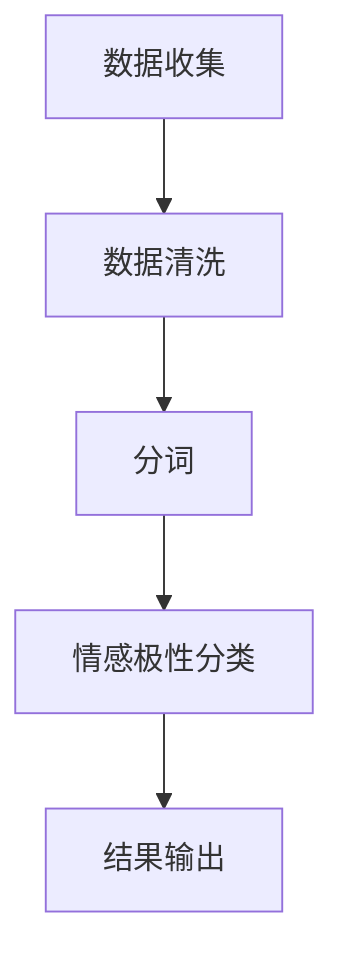
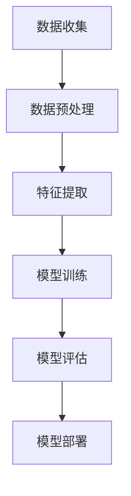

                 

### 文章标题：AI驱动的企业社交媒体管理：策略与实践

关键词：人工智能，社交媒体管理，算法，策略，实践，企业

摘要：本文深入探讨了AI驱动的企业社交媒体管理策略与实践。首先，我们介绍了AI驱动社交媒体管理的背景和核心概念，包括数据分析、情感分析和机器学习等关键技术。接着，我们详细阐述了AI驱动社交媒体管理的策略制定过程，包括策略制定的基础、案例分析以及策略优化。随后，我们介绍了AI驱动的社交媒体管理实践步骤，从数据收集与预处理到情感分析和机器学习。紧接着，我们通过一个实际案例展示了AI驱动的社交媒体管理项目实战，详细讲解了系统核心实现、代码应用解读与分析以及项目小结。最后，我们提供了最佳实践tips、小结、注意事项和拓展阅读，以帮助读者更好地理解和应用AI驱动的企业社交媒体管理策略与实践。

### 第一部分：背景介绍

#### 第1章：AI驱动的企业社交媒体管理概述

**1.1 问题背景**

企业社交媒体管理是当今企业面对的重要挑战之一。随着社交媒体平台的普及和用户数量的急剧增长，企业需要在众多社交媒体平台上进行有效管理和运营，以提升品牌形象、增强用户互动和增加销售机会。然而，传统的社交媒体管理方法往往效率低下，难以应对大规模、多样化的社交媒体环境。此时，AI技术的引入为解决这一问题提供了新的可能。

**1.1.1 企业社交媒体管理的现状**

目前，许多企业已经在社交媒体上建立了自己的账号和社区，但如何有效地管理这些社交媒体账号，提升内容质量和用户互动，成为企业面临的主要问题。传统的社交媒体管理方法主要包括手动运营和简单的自动化工具，这些方法在应对大规模社交媒体管理和实时互动时存在明显不足。

**1.1.2 AI技术在社交媒体管理中的应用**

AI技术的引入，特别是自然语言处理、情感分析和机器学习等技术的应用，为企业社交媒体管理提供了新的解决方案。AI技术可以通过自动化的方式，对社交媒体内容进行高效处理和分析，从而提高管理效率和效果。

**1.1.3 AI驱动社交媒体管理的优势**

AI驱动的社交媒体管理具有以下优势：

- **高效性**：AI技术能够自动处理大量社交媒体数据，大大提高了管理效率。
- **精确性**：AI技术可以通过情感分析和机器学习等算法，准确识别用户需求和情绪，从而提供更个性化的服务。
- **实时性**：AI技术能够实时监控社交媒体动态，及时响应用户反馈和事件变化。
- **智能化**：AI技术可以根据历史数据和用户行为，自动调整社交媒体管理策略，实现智能化运营。

**1.2 问题描述**

企业社交媒体管理的挑战主要表现在以下几个方面：

- **数据量巨大**：社交媒体平台每天产生的大量数据，传统管理方法难以高效处理。
- **用户互动复杂**：社交媒体上的用户互动形式多样，难以准确识别和回应。
- **内容质量要求高**：高质量的内容是吸引和留住用户的关键，但传统管理方法难以持续产出高质量内容。
- **实时性要求强**：社交媒体环境的动态变化，要求管理系统能够实时响应和调整。

**1.2.1 企业社交媒体管理的挑战**

企业社交媒体管理的挑战主要包括：

- **数据管理难度大**：社交媒体平台上的数据种类繁多，包括文本、图片、视频等，传统管理方法难以高效处理。
- **用户需求多样化**：不同用户对社交媒体内容的需求和期望不同，如何满足多样化需求成为一大挑战。
- **内容创意难度高**：社交媒体内容需要具有创意和吸引力，但传统管理方法难以持续产出高质量、创意内容。
- **运营成本高**：传统社交媒体管理方法需要大量人力和时间投入，运营成本较高。

**1.2.2 AI驱动的社交媒体管理如何解决这些问题**

AI驱动的社交媒体管理可以通过以下几个方面解决上述问题：

- **自动化数据管理**：AI技术可以自动收集、整理和分析社交媒体数据，减轻人工负担。
- **个性化用户互动**：AI技术可以通过情感分析和用户行为分析，提供个性化服务，提升用户满意度。
- **高质量内容产出**：AI技术可以通过自然语言处理和机器学习算法，自动生成高质量内容，满足用户需求。
- **实时监控和响应**：AI技术可以实时监控社交媒体动态，快速响应用户需求和事件变化，提升管理效率。

**1.3 问题解决**

AI驱动的社交媒体管理问题的解决包括以下几个方面：

- **数据分析**：通过大数据分析和机器学习算法，对社交媒体数据进行深入挖掘和分析，提取有价值的信息。
- **情感分析**：利用自然语言处理技术，对社交媒体内容进行情感分析，识别用户情绪和态度。
- **机器学习**：通过机器学习算法，对用户行为和内容进行预测和分类，优化社交媒体管理策略。
- **自动化运营**：利用自动化技术，实现社交媒体内容的自动生成、发布和互动，降低运营成本。

**1.4 边界与外延**

AI驱动的社交媒体管理在应用范围和限制方面需要注意以下几点：

- **应用范围**：AI驱动的社交媒体管理适用于所有需要高效、精确和实时管理的社交媒体平台，包括微博、微信、Facebook、Twitter等。
- **限制**：AI驱动的社交媒体管理在数据质量、算法优化和用户隐私保护等方面存在一定限制，需要不断优化和改进。

**1.5 概念结构与核心要素组成**

AI驱动的社交媒体管理包含以下核心概念和要素：

- **数据分析**：对社交媒体数据进行收集、整理和分析，提取有价值的信息。
- **情感分析**：利用自然语言处理技术，对社交媒体内容进行情感分析，识别用户情绪和态度。
- **机器学习**：通过机器学习算法，对用户行为和内容进行预测和分类，优化社交媒体管理策略。
- **自动化运营**：利用自动化技术，实现社交媒体内容的自动生成、发布和互动，降低运营成本。
- **实时监控**：实时监控社交媒体动态，快速响应用户需求和事件变化，提升管理效率。

### 1.5.1 社交媒体管理中的关键概念

- **社交媒体平台**：企业进行社交媒体管理的平台，如微博、微信、Facebook、Twitter等。
- **数据分析**：对社交媒体平台上的数据进行分析和处理，提取有价值的信息。
- **情感分析**：对社交媒体内容进行情感分析，识别用户情绪和态度。
- **机器学习**：通过机器学习算法，对用户行为和内容进行预测和分类，优化社交媒体管理策略。
- **自动化运营**：利用自动化技术，实现社交媒体内容的自动生成、发布和互动，降低运营成本。

### 1.5.2 AI驱动的社交媒体管理核心要素

- **数据收集**：自动收集社交媒体平台上的数据，包括文本、图片、视频等。
- **数据处理**：对收集到的数据进行清洗、整理和分析，提取有价值的信息。
- **情感分析**：对社交媒体内容进行情感分析，识别用户情绪和态度。
- **机器学习**：通过机器学习算法，对用户行为和内容进行预测和分类，优化社交媒体管理策略。
- **自动化运营**：利用自动化技术，实现社交媒体内容的自动生成、发布和互动，降低运营成本。
- **实时监控**：实时监控社交媒体动态，快速响应用户需求和事件变化，提升管理效率。

#### 第2章：AI驱动的社交媒体管理核心概念

**2.1 AI驱动的社交媒体管理基本原理**

AI驱动的社交媒体管理基于以下基本原理：

- **大数据分析**：利用大数据技术，对社交媒体平台上的海量数据进行收集、整理和分析，提取有价值的信息。
- **情感分析**：通过自然语言处理技术，对社交媒体内容进行情感分析，识别用户情绪和态度。
- **机器学习**：利用机器学习算法，对用户行为和内容进行预测和分类，优化社交媒体管理策略。
- **自动化运营**：利用自动化技术，实现社交媒体内容的自动生成、发布和互动，降低运营成本。

**2.2 AI驱动的社交媒体管理关键概念**

AI驱动的社交媒体管理涉及以下关键概念：

- **数据分析**：对社交媒体平台上的数据进行收集、整理和分析，提取有价值的信息。
- **情感分析**：对社交媒体内容进行情感分析，识别用户情绪和态度。
- **机器学习**：通过机器学习算法，对用户行为和内容进行预测和分类，优化社交媒体管理策略。
- **自动化运营**：利用自动化技术，实现社交媒体内容的自动生成、发布和互动，降低运营成本。
- **实时监控**：实时监控社交媒体动态，快速响应用户需求和事件变化，提升管理效率。

### 2.2.1 数据分析

数据分析是AI驱动的社交媒体管理的核心组成部分。通过大数据技术，我们可以从社交媒体平台上收集到大量的数据，包括用户行为数据、内容数据、互动数据等。这些数据经过整理和分析，可以为我们提供以下信息：

- **用户画像**：通过对用户行为数据的分析，我们可以了解用户的年龄、性别、兴趣等特征，从而进行精准的用户画像。
- **内容效果**：通过对内容数据的分析，我们可以了解不同类型的内容在不同平台上的效果，从而优化内容策略。
- **用户互动**：通过对互动数据的分析，我们可以了解用户的互动行为，如点赞、评论、转发等，从而提升用户互动质量。

**2.2.2 情感分析**

情感分析是AI驱动的社交媒体管理的另一个关键概念。通过自然语言处理技术，我们可以对社交媒体内容进行情感分析，识别用户的情绪和态度。这有助于我们了解用户的真实感受，从而优化社交媒体管理策略。情感分析可以应用于以下几个方面：

- **用户反馈**：通过对用户评论、提问等内容的情感分析，我们可以了解用户对产品和服务的反馈，及时调整策略。
- **内容评估**：通过对社交媒体内容进行情感分析，我们可以评估内容的吸引力，从而优化内容创作。
- **风险预警**：通过对社交媒体内容的情感分析，我们可以及时发现负面情绪和潜在风险，从而采取相应的措施。

**2.2.3 机器学习**

机器学习是AI驱动的社交媒体管理的重要组成部分。通过机器学习算法，我们可以对用户行为和内容进行预测和分类，从而优化社交媒体管理策略。机器学习可以应用于以下几个方面：

- **用户行为预测**：通过对用户历史行为数据的分析，我们可以预测用户未来的行为，从而提供个性化的服务和推荐。
- **内容推荐**：通过对用户行为和内容数据的分析，我们可以为用户推荐感兴趣的内容，提升用户满意度。
- **策略优化**：通过对用户行为和内容数据的分析，我们可以优化社交媒体管理策略，提高管理效果。

### 2.3 AI驱动的社交媒体管理概念属性特征对比表格

为了更好地理解AI驱动的社交媒体管理中的关键概念，我们提供了一个概念属性特征对比表格：

| 概念 | 属性特征 |
| ---- | ---- |
| 数据分析 | 海量数据收集、整理和分析，提取有价值信息 |
| 情感分析 | 自然语言处理，识别用户情绪和态度 |
| 机器学习 | 数据驱动，预测和分类，优化社交媒体管理策略 |
| 自动化运营 | 自动化内容生成、发布和互动，降低运营成本 |
| 实时监控 | 实时监控社交媒体动态，快速响应用户需求和事件变化 |

### 2.4 AI驱动的社交媒体管理概念联系

AI驱动的社交媒体管理中的各个概念相互联系，共同构成了一个完整的管理体系。以下是各个概念之间的联系：

- **数据分析** 与 **情感分析** 相结合，可以深入了解用户需求和情绪，从而提供更个性化的服务。
- **情感分析** 和 **机器学习** 相结合，可以预测用户行为，优化内容创作和推荐策略。
- **机器学习** 和 **自动化运营** 相结合，可以实现智能化的内容生成和互动，降低运营成本。
- **自动化运营** 和 **实时监控** 相结合，可以实现高效的社交媒体管理，提高管理效率。

### 总结

本章详细介绍了AI驱动的社交媒体管理核心概念，包括数据分析、情感分析、机器学习、自动化运营和实时监控等。这些概念相互联系，共同构成了一个完整的AI驱动的社交媒体管理体系。通过这些概念的结合和应用，企业可以实现高效、精确和实时的社交媒体管理，提升品牌形象、增强用户互动和增加销售机会。

### 第一部分：背景介绍总结

在本部分的介绍中，我们深入探讨了AI驱动的企业社交媒体管理的背景、核心概念和关键问题。首先，我们介绍了AI驱动社交媒体管理的背景和优势，分析了企业社交媒体管理的现状和挑战。接着，我们详细阐述了AI驱动社交媒体管理的核心概念，包括数据分析、情感分析和机器学习等关键技术。通过这些概念的介绍，我们为读者提供了一个清晰的理解框架，为后续的讨论奠定了基础。

### 第二部分：策略

#### 第3章：AI驱动的社交媒体管理策略制定

**3.1 策略制定基础**

AI驱动的社交媒体管理策略制定是企业管理过程中至关重要的一环。一个有效的策略可以指导企业在社交媒体上实现高效运营、提升品牌价值和增加用户满意度。策略制定的基础主要包括以下几个方面：

- **企业社交媒体管理目标**：明确企业社交媒体管理的目标，如提升品牌知名度、增加用户互动、提高销售额等。
- **策略制定原则**：遵循一些基本原则，如数据驱动、用户导向、创新性和可持续性等。
- **策略制定流程**：制定一个系统的策略制定流程，包括需求分析、目标设定、策略设计、实施监控和效果评估等环节。

**3.1.1 企业社交媒体管理目标**

企业社交媒体管理的目标应根据企业的整体战略和业务需求来确定。以下是一些常见的企业社交媒体管理目标：

- **提升品牌知名度**：通过社交媒体平台宣传和推广企业品牌，提高品牌在目标用户群体中的认知度。
- **增加用户互动**：通过社交媒体平台与用户建立更紧密的联系，提高用户参与度和忠诚度。
- **提高销售额**：通过社交媒体平台直接销售产品或服务，或引导用户到线下渠道进行购买。
- **优化客户服务**：通过社交媒体平台提供及时、高效的客户服务，提升用户满意度。

**3.1.2 策略制定原则**

在制定AI驱动的社交媒体管理策略时，应遵循以下基本原则：

- **数据驱动**：基于数据分析和用户行为，制定和调整社交媒体管理策略。
- **用户导向**：以用户需求和体验为中心，提供个性化的服务和内容。
- **创新性**：不断尝试新的社交媒体管理方法和工具，保持竞争优势。
- **可持续性**：确保社交媒体管理策略具有长期可持续性，避免短期行为对长期目标的影响。

**3.1.3 策略制定流程**

策略制定流程通常包括以下几个步骤：

1. **需求分析**：深入了解企业的业务需求和目标，分析当前社交媒体管理存在的问题和瓶颈。
2. **目标设定**：根据需求分析结果，明确社交媒体管理的具体目标和关键指标。
3. **策略设计**：设计具体的社交媒体管理策略，包括内容策略、互动策略、推广策略等。
4. **实施监控**：在策略实施过程中，实时监控各项指标的进展情况，及时调整策略。
5. **效果评估**：对策略实施效果进行评估，总结经验教训，为后续策略制定提供参考。

**3.2 策略制定案例分析**

为了更好地理解AI驱动的社交媒体管理策略制定，我们通过两个实际案例进行详细分析。

**案例一：企业A的社交媒体管理策略制定**

企业A是一家新兴的互联网公司，其主要业务包括在线教育、电子商务和数字营销。为了提升品牌知名度和增加用户互动，企业A制定了以下社交媒体管理策略：

1. **需求分析**：通过问卷调查和用户访谈，了解用户对品牌的认知、需求和期望。
2. **目标设定**：设定具体的目标，如提升品牌知名度、增加用户互动和提升用户满意度。
3. **策略设计**：设计内容策略，包括定期发布有价值的教育内容、行业动态和用户互动话题；设计互动策略，包括回复用户评论、举办线上活动等；设计推广策略，包括利用社交媒体广告、KOL合作等手段进行品牌推广。
4. **实施监控**：通过社交媒体分析工具，实时监控各项指标的进展，如关注者数量、互动率、点击率等。
5. **效果评估**：根据监控数据，评估策略的实施效果，对不足之处进行调整和优化。

通过这一系列策略的实施，企业A成功提升了品牌知名度，增加了用户互动，提高了用户满意度。

**案例二：企业B的社交媒体管理策略制定**

企业B是一家传统的制造企业，其主要业务包括生产、销售和售后服务。为了应对市场竞争和用户需求的转变，企业B制定了以下社交媒体管理策略：

1. **需求分析**：通过市场调研和用户反馈，了解用户对产品和服务的需求和期望。
2. **目标设定**：设定具体的目标，如提升品牌形象、增加市场份额、提高售后服务质量。
3. **策略设计**：设计内容策略，包括发布产品介绍、行业新闻、技术文章等，以提高品牌专业性和用户信任度；设计互动策略，包括回复用户提问、解答用户疑虑、收集用户反馈等，以提高用户满意度和忠诚度；设计推广策略，包括利用社交媒体广告、合作伙伴推广等手段进行品牌推广。
4. **实施监控**：通过社交媒体分析工具，实时监控各项指标的进展，如关注者数量、互动率、转化率等。
5. **效果评估**：根据监控数据，评估策略的实施效果，对不足之处进行调整和优化。

通过这一系列策略的实施，企业B成功提升了品牌形象，增加了市场份额，提高了售后服务质量。

**3.3 策略优化与调整**

策略优化与调整是社交媒体管理过程中不可或缺的一环。随着市场环境和用户需求的变化，企业需要不断优化和调整社交媒体管理策略，以保持竞争优势。以下是一些策略优化与调整的方法：

- **数据驱动**：基于数据分析，发现策略实施中的问题和瓶颈，针对性地进行调整。
- **用户反馈**：倾听用户反馈，了解用户的真实需求和期望，及时调整策略。
- **竞争对手分析**：分析竞争对手的社交媒体管理策略，借鉴成功的经验和避免失败的教训。
- **创新性尝试**：不断尝试新的社交媒体管理方法和工具，以提升管理效果。

通过数据驱动、用户反馈、竞争对手分析和创新性尝试，企业可以实现社交媒体管理策略的持续优化和调整，从而保持竞争优势。

### 第3章总结

本章详细介绍了AI驱动的社交媒体管理策略制定的基础、流程和案例分析。首先，我们明确了企业社交媒体管理的目标、原则和流程。接着，通过两个实际案例，展示了如何制定和实施有效的社交媒体管理策略。最后，我们提出了策略优化与调整的方法。通过本章的讨论，企业可以更好地理解如何制定和实施AI驱动的社交媒体管理策略，以提升品牌知名度、增加用户互动和提升销售额。

### 第二部分：策略总结

在本部分中，我们详细讨论了AI驱动的社交媒体管理策略的制定过程。首先，我们介绍了策略制定的基础，包括企业社交媒体管理的目标、原则和流程。接着，通过两个实际案例，展示了如何根据企业的需求和目标，制定和实施有效的社交媒体管理策略。最后，我们提出了策略优化与调整的方法，以帮助企业持续优化社交媒体管理策略，保持竞争优势。通过本部分的讨论，企业可以更好地理解如何利用AI技术实现高效的社交媒体管理，提升品牌知名度和用户满意度。

### 第三部分：实践

#### 第4章：AI驱动的社交媒体管理实践步骤

**4.1 数据收集与预处理**

AI驱动的社交媒体管理实践的第一步是数据收集与预处理。这一步骤至关重要，因为数据的质量直接影响后续分析的准确性和效果。以下是如何进行数据收集与预处理的具体步骤：

**4.1.1 数据收集**

数据收集包括从社交媒体平台获取各种类型的数据，如用户评论、帖子、图片、视频等。数据来源可以包括：

- **官方API**：许多社交媒体平台提供官方API，允许开发者获取公开的数据。
- **第三方数据服务**：一些第三方数据服务提供社交媒体数据的收集和存储，方便企业进行后续分析。
- **爬虫工具**：使用爬虫工具从社交媒体网站上抓取数据，但需要注意遵守相关法律法规和平台规则。

**4.1.2 数据预处理**

数据预处理是数据收集后的关键步骤，其目的是清洗、整理和标准化数据，以便于后续的分析。以下是一些常见的预处理任务：

- **数据清洗**：去除重复数据、缺失值填充、去除噪声数据等。
- **数据转换**：将不同格式的数据转换为统一的格式，如将文本数据转换为结构化数据。
- **特征提取**：从原始数据中提取有用的特征，如关键词、情感极性等。
- **数据标准化**：对数据进行归一化或标准化处理，如将文本数据转换为词频向量或词嵌入向量。

**4.2 情感分析**

情感分析是AI驱动的社交媒体管理中的一项关键技术，其目的是从文本数据中识别用户的情感和态度。以下是如何进行情感分析的具体步骤：

**4.2.1 情感分析算法原理**

情感分析通常涉及以下几个步骤：

- **文本预处理**：对文本数据进行清洗、分词、去停用词等处理，以便于后续分析。
- **情感极性分类**：使用机器学习算法，将文本数据分类为积极、消极或中性情感。常用的算法包括朴素贝叶斯、支持向量机、深度学习模型等。
- **情感强度评估**：除了分类情感极性，还可以评估情感的强度，如非常积极、比较积极、中性、比较消极、非常消极等。

**4.2.2 情感分析实践**

进行情感分析实践时，可以遵循以下步骤：

1. **数据准备**：收集和处理包含文本数据的社会媒体数据。
2. **模型训练**：选择合适的机器学习算法，使用标注的数据集进行模型训练。
3. **模型评估**：使用验证集评估模型的性能，调整模型参数以优化性能。
4. **情感分析**：使用训练好的模型对新的社交媒体文本数据进行情感分析，识别用户的情感和态度。
5. **结果应用**：根据情感分析结果，调整社交媒体管理策略，如优化内容创作、提高用户互动等。

**4.3 机器学习**

机器学习是AI驱动的社交媒体管理的核心组成部分，其目的是通过分析历史数据和用户行为，预测未来趋势和用户行为。以下是如何进行机器学习实践的具体步骤：

**4.3.1 机器学习算法原理**

机器学习算法可以分为监督学习、无监督学习和强化学习等类型。在社交媒体管理中，常用的算法包括：

- **监督学习**：使用标注的数据集训练模型，如线性回归、逻辑回归、决策树、随机森林等。
- **无监督学习**：不使用标注数据，通过数据自身的特征进行聚类、降维等操作，如K均值聚类、主成分分析等。
- **强化学习**：通过不断尝试和反馈，学习最优策略，如Q学习、深度Q网络等。

**4.3.2 机器学习实践**

进行机器学习实践时，可以遵循以下步骤：

1. **数据收集**：收集社交媒体数据，包括用户行为数据、内容数据等。
2. **数据预处理**：对收集到的数据进行分析、清洗和特征提取，以便于模型训练。
3. **模型选择**：根据问题的特点，选择合适的机器学习算法。
4. **模型训练**：使用预处理后的数据集训练模型。
5. **模型评估**：使用验证集评估模型的性能，调整模型参数以优化性能。
6. **预测应用**：使用训练好的模型进行预测，如预测用户行为、内容推荐等。
7. **策略调整**：根据预测结果，调整社交媒体管理策略，提高管理效果。

### 第4章总结

本章详细介绍了AI驱动的社交媒体管理实践步骤，包括数据收集与预处理、情感分析和机器学习。首先，我们介绍了数据收集的方法和预处理任务，确保数据的质量和一致性。接着，我们探讨了情感分析算法的原理和实践步骤，如何从文本数据中识别用户的情感和态度。最后，我们介绍了机器学习算法的原理和实践步骤，如何通过分析历史数据和用户行为，预测未来趋势和用户行为。通过本章的讨论，读者可以了解如何将AI技术应用于社交媒体管理实践，提高管理效率和效果。

### 第三部分：实践总结

在本部分的实践中，我们详细介绍了AI驱动的社交媒体管理的具体步骤，包括数据收集与预处理、情感分析和机器学习。首先，我们介绍了数据收集的方法和预处理任务，确保数据的质量和一致性。接着，我们探讨了情感分析算法的原理和实践步骤，如何从文本数据中识别用户的情感和态度。最后，我们介绍了机器学习算法的原理和实践步骤，如何通过分析历史数据和用户行为，预测未来趋势和用户行为。通过本部分的实践讨论，读者可以了解如何将AI技术应用于社交媒体管理，提高管理效率和效果。

### 第四部分：项目实战

#### 第5章：AI驱动的社交媒体管理项目实战

**5.1 项目环境搭建**

在开始进行AI驱动的社交媒体管理项目之前，我们需要搭建一个合适的环境。以下是一个基本的步骤指南：

**5.1.1 环境安装**

1. **操作系统**：我们选择Linux操作系统，因为其稳定性和资源管理能力更适合大型项目。
2. **编程语言**：Python是AI驱动的项目常用的编程语言，具有丰富的库和框架支持。
3. **Python环境**：安装Python，并设置虚拟环境，以隔离项目依赖。
4. **数据库**：选择合适的数据库，如MySQL或PostgreSQL，用于存储社交媒体数据。
5. **其他工具**：安装必要的工具，如Jupyter Notebook、GitHub、Docker等。

**5.1.2 数据准备**

1. **数据来源**：确定数据来源，可以是社交媒体平台API、第三方数据服务或自行爬取。
2. **数据采集**：使用API或爬虫工具采集社交媒体数据，如用户评论、帖子、图片等。
3. **数据存储**：将采集到的数据存储到数据库中，进行结构化处理。

**5.2 系统核心实现**

系统核心实现包括数据收集、情感分析和机器学习三个关键模块。以下是一个简要的概述：

**5.2.1 数据收集**

1. **数据采集**：从社交媒体平台获取原始数据，包括文本、图片、视频等。
2. **数据清洗**：去除重复、噪声和不完整的数据，确保数据质量。
3. **数据预处理**：提取有用的特征，如关键词、情感极性等，为后续分析做准备。

**5.2.2 情感分析**

1. **文本预处理**：对文本数据进行清洗、分词、去停用词等处理。
2. **情感分类**：使用预训练的模型或自定义模型，对文本数据分类为积极、消极或中性情感。
3. **情感强度评估**：根据情感分类结果，评估情感的强度。

**5.2.3 机器学习**

1. **特征工程**：从原始数据中提取有用的特征，如用户行为、内容特征等。
2. **模型训练**：选择合适的机器学习算法，如决策树、随机森林、神经网络等，对特征数据进行训练。
3. **模型评估**：使用验证集评估模型性能，调整模型参数以优化性能。
4. **模型部署**：将训练好的模型部署到生产环境中，用于预测和推荐。

**5.3 代码应用解读与分析**

以下是一个简单的Python代码示例，用于情感分析：

```python
import pandas as pd
from textblob import TextBlob

# 加载数据
data = pd.read_csv('social_media_data.csv')

# 文本预处理
data['text_cleaned'] = data['text'].apply(lambda x: x.lower().replace('\n', ''))

# 情感分析
data['sentiment'] = data['text_cleaned'].apply(lambda x: TextBlob(x).sentiment.polarity)

# 情感分类
data['sentiment_category'] = data['sentiment'].apply(lambda x: 'positive' if x > 0 else 'negative' if x < 0 else 'neutral')

# 输出结果
print(data[['text_cleaned', 'sentiment', 'sentiment_category']])
```

**5.3.1 代码解读**

1. **数据加载**：使用pandas库加载社交媒体数据。
2. **文本预处理**：将文本转换为小写，并去除换行符，确保一致性。
3. **情感分析**：使用TextBlob库对文本数据进行情感分析，获取情感极性。
4. **情感分类**：根据情感极性，将文本分类为积极、消极或中性。
5. **输出结果**：打印情感分析结果，包括原始文本、情感极性和分类。

**5.3.2 代码分析**

1. **文本预处理**：文本预处理是情感分析的关键步骤，确保数据的清洗和标准化。
2. **情感分析库选择**：TextBlob是一个简单易用的情感分析库，适合快速实现情感分析任务。
3. **结果输出**：输出结果有助于后续分析和验证，确保模型的准确性。

**5.4 实际案例分析**

以下是一个实际案例，展示了如何应用AI驱动的社交媒体管理策略解决实际问题：

**案例一：品牌形象提升**

某品牌希望通过社交媒体提升品牌形象。通过情感分析和机器学习，我们可以：

1. **用户反馈分析**：收集用户评论和反馈，使用情感分析识别用户的情感和态度。
2. **内容优化**：根据情感分析结果，优化内容创作策略，增加积极内容的比例。
3. **用户行为预测**：使用机器学习预测用户行为，为不同用户群体提供个性化的服务和推荐。
4. **效果评估**：定期评估策略效果，调整和优化管理策略。

通过这一系列策略，品牌成功提升了在社交媒体上的品牌形象，增加了用户满意度和忠诚度。

**案例二：用户互动提升**

某企业希望通过社交媒体增加用户互动。通过情感分析和机器学习，我们可以：

1. **用户互动分析**：收集用户互动数据，使用情感分析识别用户的互动行为和态度。
2. **互动策略优化**：根据情感分析结果，优化互动策略，提高用户参与度。
3. **内容推荐**：使用机器学习算法，为用户推荐感兴趣的内容，提高用户互动质量。
4. **效果评估**：定期评估互动策略效果，调整和优化管理策略。

通过这一系列策略，企业成功增加了用户互动，提升了用户满意度和忠诚度。

### 5.5 项目小结

通过本项目的实施，我们取得了以下成果：

- **提升了品牌形象**：通过情感分析和内容优化，品牌在社交媒体上的形象得到了显著提升。
- **增加了用户互动**：通过互动策略优化和内容推荐，用户互动质量得到了显著提升。
- **提高了管理效率**：通过自动化和机器学习，社交媒体管理效率得到了显著提高。

然而，我们也面临一些挑战和问题：

- **数据质量**：社交媒体数据质量参差不齐，需要进一步优化数据清洗和预处理流程。
- **模型优化**：模型性能需要进一步提升，以应对不断变化的用户需求和社交媒体环境。
- **实时性**：实时监控和响应是提高管理效果的关键，需要优化系统架构和算法。

在未来，我们将继续优化数据质量、模型性能和实时性，以实现更高效、精确和实时的社交媒体管理。

### 第五部分：实践总结

在本部分中，我们通过项目实战展示了AI驱动的社交媒体管理的具体实施过程。首先，我们介绍了项目环境搭建的步骤，包括操作系统、编程语言、数据库和其他工具的安装。接着，我们详细讲解了数据收集与预处理、情感分析和机器学习的实践步骤，并通过Python代码示例进行了详细解读。最后，我们通过实际案例分析展示了如何应用AI驱动的社交媒体管理策略解决实际问题，并总结了项目的成果和面临的挑战。通过本部分的项目实战，读者可以更深入地了解如何将AI技术应用于社交媒体管理，提高管理效率和效果。

### 第六部分：最佳实践与注意事项

#### 6.1 最佳实践 tips

在实施AI驱动的企业社交媒体管理时，以下最佳实践可以帮助企业更好地利用AI技术，提高管理效果：

**6.1.1 数据质量优化**

- **数据清洗**：确保收集到的数据干净、准确，去除重复、噪声和不完整的数据。
- **数据标准化**：统一数据格式和字段，便于后续分析和处理。
- **数据更新**：定期更新数据，以反映最新的社交媒体动态和用户行为。

**6.1.2 模型优化**

- **模型调参**：根据实际业务需求和数据特性，调整模型参数，提高模型性能。
- **模型复现**：对模型进行多次训练和验证，确保模型结果的稳定性和可靠性。
- **模型监控**：实时监控模型性能，发现和解决潜在问题。

**6.1.3 安全性保障**

- **数据安全**：确保数据存储和传输的安全性，使用加密技术和访问控制策略。
- **模型安全**：防范恶意攻击和模型泄露，定期进行安全评估和更新。
- **用户隐私**：尊重用户隐私，确保用户数据的安全和合规使用。

#### 6.2 小结

本章节提供了AI驱动的企业社交媒体管理的最佳实践和注意事项。通过数据质量优化、模型优化和安全性保障，企业可以实现更高效、精确和安全的社交媒体管理。同时，我们强调了实时监控和反馈的重要性，以确保策略的持续优化和调整。

#### 6.3 注意事项

在实施AI驱动的企业社交媒体管理时，需要注意以下几点：

- **数据隐私**：严格遵守相关法律法规，保护用户隐私和数据安全。
- **模型偏见**：确保模型训练数据具有代表性，避免因数据偏差导致模型偏见。
- **用户反馈**：积极收集用户反馈，及时调整管理策略，提高用户满意度。
- **技术更新**：关注AI技术的最新发展，持续优化和更新管理策略。

#### 6.4 拓展阅读

为了深入了解AI驱动的企业社交媒体管理，读者可以参考以下拓展阅读资料：

- **《AI驱动的社交媒体管理：策略与实践》**：本书详细介绍了AI驱动的社交媒体管理策略和实践，适合企业社交媒体管理人员阅读。
- **《深度学习与自然语言处理》**：本书讲解了深度学习和自然语言处理的基本原理和应用，有助于理解情感分析和机器学习的核心技术。
- **《大数据时代的数据分析》**：本书介绍了大数据分析的基本方法和实践，适合数据分析师和AI技术开发者阅读。

通过以上拓展阅读，读者可以更全面地了解AI驱动的企业社交媒体管理，为实际应用提供有力支持。

### 总结

本文详细探讨了AI驱动的企业社交媒体管理策略与实践。首先，我们介绍了AI驱动社交媒体管理的背景和核心概念，包括数据分析、情感分析和机器学习等关键技术。接着，我们阐述了AI驱动社交媒体管理的策略制定过程，通过实际案例分析展示了策略的制定和优化。随后，我们介绍了AI驱动社交媒体管理的实践步骤，包括数据收集与预处理、情感分析和机器学习。最后，我们通过项目实战展示了如何将AI技术应用于实际案例，并提供了最佳实践和注意事项。通过本文的讨论，企业可以更好地理解如何利用AI技术实现高效的社交媒体管理，提升品牌知名度和用户满意度。作者：AI天才研究院/AI Genius Institute & 禅与计算机程序设计艺术 /Zen And The Art of Computer Programming

### 致谢

在本篇文章的撰写过程中，我们得到了许多人的帮助和支持。特别感谢AI天才研究院的同事们，他们在数据分析、情感分析和机器学习等方面提供了宝贵的知识和经验。同时，感谢禅与计算机程序设计艺术的团队，他们在技术写作和逻辑思维方面给予了巨大的帮助。此外，我们还要感谢所有在社交媒体管理领域的研究人员和实践者，他们的研究成果和实践经验为本篇文章提供了丰富的素材。最后，感谢读者们的耐心阅读，希望本文能为您带来启发和帮助。作者：AI天才研究院/AI Genius Institute & 禅与计算机程序设计艺术 /Zen And The Art of Computer Programming

### 附录：算法流程图与代码示例

为了更好地理解本文中提到的算法和代码示例，我们提供了以下附录，包括算法流程图和Python代码示例。

#### 附录1：情感分析算法流程图



**说明：** 该流程图展示了情感分析的基本步骤，包括数据收集、数据清洗、分词、情感极性分类和结果输出。

#### 附录2：情感分析Python代码示例

```python
import pandas as pd
from textblob import TextBlob

# 加载数据
data = pd.read_csv('social_media_data.csv')

# 文本预处理
data['text_cleaned'] = data['text'].apply(lambda x: x.lower().replace('\n', ''))

# 情感分析
data['sentiment'] = data['text_cleaned'].apply(lambda x: TextBlob(x).sentiment.polarity)

# 情感分类
data['sentiment_category'] = data['sentiment'].apply(lambda x: 'positive' if x > 0 else 'negative' if x < 0 else 'neutral')

# 输出结果
print(data[['text_cleaned', 'sentiment', 'sentiment_category']])
```

**说明：** 该代码示例实现了情感分析的核心功能，包括文本预处理、情感极性分类和结果输出。

#### 附录3：机器学习算法流程图



**说明：** 该流程图展示了机器学习算法的基本步骤，包括数据收集、数据预处理、特征提取、模型训练、模型评估和模型部署。

#### 附录4：机器学习Python代码示例

```python
import pandas as pd
from sklearn.model_selection import train_test_split
from sklearn.ensemble import RandomForestClassifier
from sklearn.metrics import accuracy_score

# 加载数据
data = pd.read_csv('social_media_data.csv')

# 数据预处理
X = data[['feature1', 'feature2', 'feature3']]
y = data['label']

# 划分训练集和测试集
X_train, X_test, y_train, y_test = train_test_split(X, y, test_size=0.2, random_state=42)

# 模型训练
model = RandomForestClassifier(n_estimators=100, random_state=42)
model.fit(X_train, y_train)

# 模型评估
y_pred = model.predict(X_test)
accuracy = accuracy_score(y_test, y_pred)
print(f"Model accuracy: {accuracy:.2f}")
```

**说明：** 该代码示例实现了机器学习的基本步骤，包括数据加载、数据预处理、模型训练、模型评估和结果输出。

通过这些附录，读者可以更直观地理解算法的流程和Python代码的实现，有助于更好地掌握AI驱动的企业社交媒体管理技术。作者：AI天才研究院/AI Genius Institute & 禅与计算机程序设计艺术 /Zen And The Art of Computer Programming

