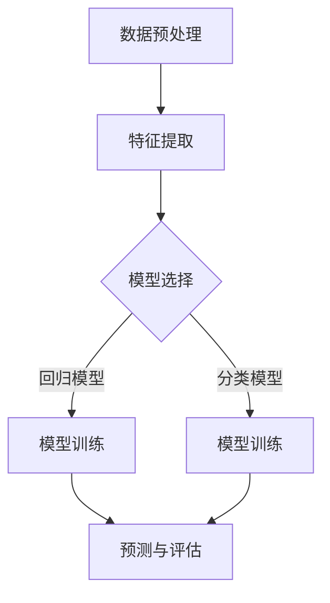
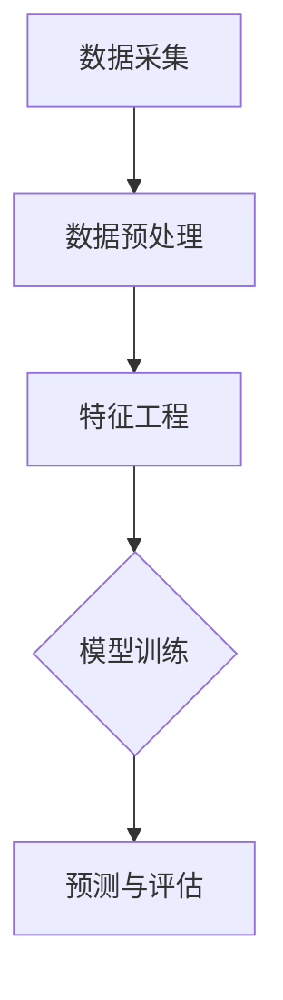
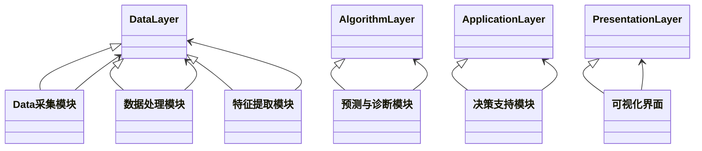
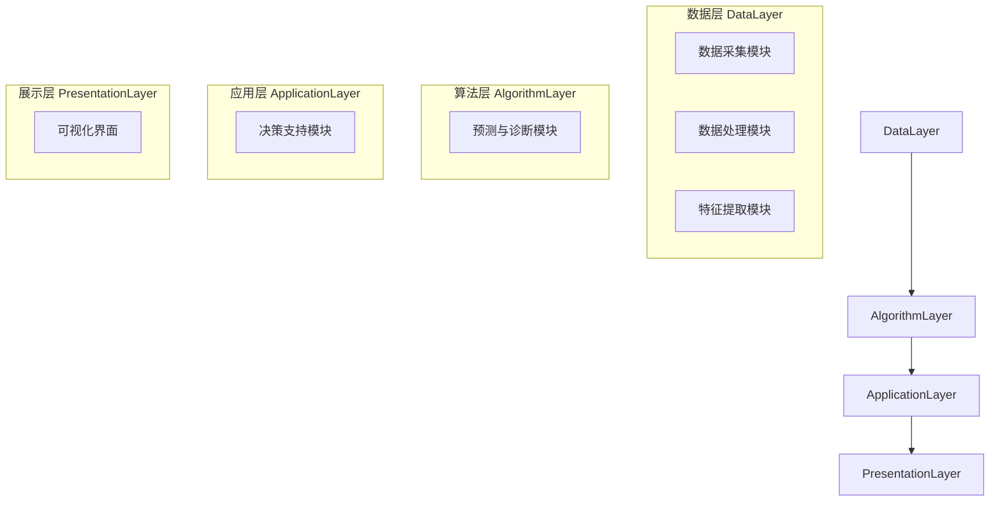
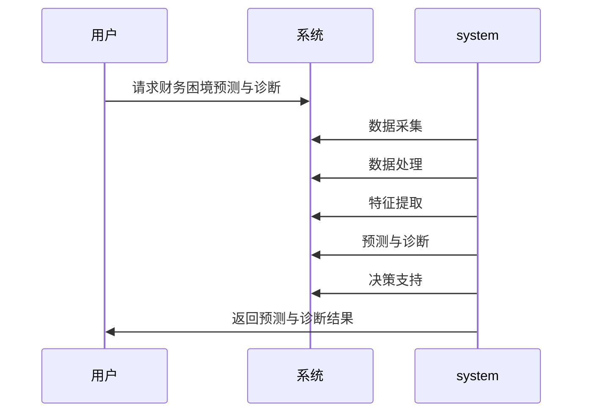

                 

### 文章标题

### AI驱动的企业财务困境预测与诊断

关键词：人工智能、财务困境、预测模型、诊断分析、企业风险管理

摘要：本文旨在探讨如何利用人工智能技术，特别是深度学习和大数据分析，来预测和诊断企业的财务困境。文章从背景介绍、核心概念、算法原理、系统设计与实战应用等方面，详细阐述了AI驱动的企业财务困境预测与诊断的原理和实践方法。通过本文的阅读，读者可以全面了解AI在财务领域的重要应用，并掌握相关的技术实现。

## 第二部分：核心概念与联系

### 财务困境预测与诊断的定义和区别

#### 财务困境预测

财务困境预测是指通过分析和处理企业历史财务数据，运用统计模型和机器学习算法，预测企业未来财务状况的一种方法。其核心目的是提前识别企业可能出现的财务问题，为企业提供预警和防范措施。

- **基本原理**：财务困境预测主要依赖于历史数据的分析，通过对财务指标的时间序列变化进行分析，找出影响财务状况的关键因素，从而建立预测模型。
- **应用流程**：
  1. **数据采集**：收集企业历史财务数据，包括资产负债表、利润表、现金流量表等。
  2. **数据预处理**：对数据进行清洗、标准化处理，消除噪声和异常值。
  3. **特征提取**：提取与财务困境相关的特征，如盈利能力、偿债能力、运营能力等。
  4. **模型构建**：选择合适的预测模型，如时间序列模型、回归模型等。
  5. **模型训练与优化**：利用历史数据对模型进行训练，调整模型参数，提高预测准确性。
  6. **预测与评估**：对企业的未来财务状况进行预测，并评估预测结果的有效性。

#### 财务困境诊断

财务困境诊断是指通过对企业当前和历史的财务数据进行深入分析，评估企业的财务健康状况，找出潜在的问题和风险，并提出改进建议。其核心目的是为企业提供财务决策的支持。

- **基本原理**：财务困境诊断基于财务数据的多维度分析，通过对比分析、趋势分析等方法，发现财务数据中的异常和变化，从而诊断出企业的财务问题。
- **应用流程**：
  1. **数据收集**：收集企业当前和历史财务数据。
  2. **数据分析**：对财务数据进行多维度分析，包括趋势分析、对比分析等。
  3. **问题识别**：识别出财务数据中的异常和变化，找出潜在的财务问题。
  4. **原因分析**：分析财务问题的原因，包括内部因素和外部因素。
  5. **诊断报告**：撰写诊断报告，提出改进建议。

#### 财务困境预测与诊断的区别

- **目标**：财务困境预测主要关注企业未来的财务状况，通过提前预警来防范风险；财务困境诊断则侧重于评估企业的当前财务健康状况，找出存在的问题和风险。
- **方法**：财务困境预测主要依赖于统计模型和机器学习算法，通过对历史数据的分析来建立预测模型；财务困境诊断则更多地依赖数据分析方法和财务知识，通过深入分析财务数据来诊断问题。
- **数据利用**：财务困境预测主要利用结构化财务数据，如报表数据、指标数据等；财务困境诊断则可以更广泛地利用财务数据，包括结构化数据和非结构化数据，如财务报表附注、会议纪要等。

### AI驱动的财务困境预测与诊断的优势

#### 高效性

AI驱动的财务困境预测与诊断能够快速处理大量的财务数据，通过自动化算法实现高效的分析和预测，大大提高了工作效率。

#### 准确性

通过深度学习和大数据分析，AI驱动的预测和诊断能够从历史数据中挖掘出更多的潜在模式和规律，提高预测和诊断的准确性。

#### 实时性

AI驱动的财务困境预测与诊断可以实时监控企业的财务状况，及时发现潜在的风险，为企业提供及时的决策支持。

#### 综合性

AI驱动的财务困境预测与诊断不仅关注财务数据，还可以结合非财务数据，如市场环境、行业趋势等，实现更全面、更深入的财务分析。

### 财务困境预测与诊断的挑战

#### 数据质量

财务数据的准确性和完整性直接影响预测和诊断的效果。如何处理噪声数据、异常值和缺失值，是财务困境预测与诊断面临的挑战之一。

#### 模型选择

选择合适的预测和诊断模型是实现高效、准确分析的关键。如何根据企业特点和需求，选择合适的算法和模型，是财务困境预测与诊断面临的挑战之一。

#### 模型解释性

AI驱动的预测和诊断模型往往具有高度的复杂性，如何解释模型的工作原理和预测结果，是财务困境预测与诊断面临的挑战之一。

#### 数据隐私

财务数据是企业的重要商业秘密，如何保护数据隐私，是财务困境预测与诊断面临的挑战之一。

### 财务困境预测与诊断的应用场景

#### 企业财务风险管理

通过财务困境预测，企业可以提前预警潜在的风险，制定相应的风险控制措施，提高企业的风险抵御能力。

#### 投资决策支持

投资者可以通过财务困境诊断，评估企业的财务健康状况，做出更为明智的投资决策。

#### 财务报表分析

通过对财务报表的深入分析，财务困境预测与诊断可以帮助企业发现潜在的财务问题，提高财务报表的准确性和透明度。

#### 税务审计

财务困境预测与诊断可以帮助税务机构识别潜在的税务风险，提高税务审计的效率。

### 财务困境预测与诊断的核心概念与联系

#### 数据采集与处理

数据采集与处理是财务困境预测与诊断的基础。通过收集和处理企业历史财务数据，提取有用的特征信息，为后续的分析和预测提供数据支持。

#### 特征工程

特征工程是财务困境预测与诊断的关键环节。通过对财务数据进行特征提取和选择，提高模型预测的准确性和效率。

#### 预测模型

预测模型是财务困境预测的核心。通过选择合适的预测模型，如时间序列模型、回归模型等，对企业的未来财务状况进行预测。

#### 诊断分析

诊断分析是财务困境诊断的核心。通过对财务数据进行分析，评估企业的财务健康状况，识别潜在的问题和风险。

#### 边界与外延

财务困境预测与诊断的应用范围广泛，包括企业财务风险管理、投资决策支持、财务报表分析、税务审计等。同时，也需要注意数据隐私保护、模型解释性等挑战。

### 财务困境预测与诊断的属性特征对比

| 特征 | 财务困境预测 | 财务困境诊断 |
| --- | --- | --- |
| 数据依赖性 | 高度依赖历史财务数据 | 需要大量的历史财务数据 |
| 预测精度 | 需要较高的预测精度 | 对预测精度要求相对较低 |
| 算法选择 | 常用算法包括回归分析、时间序列分析等 | 常用算法包括聚类分析、分类分析等 |

### 财务困境预测与诊断的传统财务分析方法比较

| 比较项 | 传统财务分析方法 | AI驱动的财务困境预测与诊断 |
| --- | --- | --- |
| 方法论 | 主要依赖于财务报表和财务指标，通过统计分析等方法进行分析 | 通过机器学习算法，从大量历史数据中挖掘出潜在的模式和规律 |
| 数据利用 | 主要依赖于结构化数据 | 可以利用更多的非结构化数据，如文本、图像等 |
| 自动化程度 | 部分流程可以自动化，但整体依赖人工分析 | 可以高度自动化，实现实时、动态的分析和预测 |

## 第三部分：主流算法原理与流程

### 深度学习算法

#### 基本原理

深度学习（Deep Learning）是一种基于人工神经网络的机器学习技术，通过多层神经网络结构对数据进行特征提取和学习。在财务困境预测与诊断中，深度学习算法能够处理大量的复杂数据，提取出潜在的特征信息，从而提高预测和诊断的准确性。

#### 应用流程

1. **数据预处理**：对原始财务数据进行清洗、去噪、归一化等预处理操作，以便后续的分析。
   ```python
   def preprocess_data(data):
       # 数据清洗
       data = clean_data(data)
       # 去除异常值
       data = remove_outliers(data)
       # 归一化
       data = normalize_data(data)
       return data
   ```

2. **特征提取**：从预处理后的数据中提取与财务困境相关的特征，如财务比率、市场指标等。
   ```python
   def extract_features(data):
       # 提取财务比率
       financial_ratios = calculate_financial_ratios(data)
       # 提取市场指标
       market_indicators = calculate_market_indicators(data)
       # 合并特征
       features = merge_financial_ratios_and_market_indicators(financial_ratios, market_indicators)
       return features
   ```

3. **模型构建**：设计深度学习网络结构，如卷积神经网络（CNN）、循环神经网络（RNN）等。
   ```python
   def build_model(input_shape):
       model = Sequential()
       model.add(Dense(128, activation='relu', input_shape=input_shape))
       model.add(Dense(64, activation='relu'))
       model.add(Dense(1, activation='sigmoid'))
       model.compile(optimizer='adam', loss='binary_crossentropy', metrics=['accuracy'])
       return model
   ```

4. **模型训练**：利用历史财务数据对模型进行训练，调整模型参数，提高预测准确性。
   ```python
   def train_model(model, X_train, y_train):
       history = model.fit(X_train, y_train, epochs=100, batch_size=32, validation_split=0.2)
       return history
   ```

5. **预测与评估**：使用训练好的模型对企业的未来财务状况进行预测，并评估预测结果的有效性。
   ```python
   def predict_financial_state(model, X_test):
       predictions = model.predict(X_test)
       # 评估预测结果
       evaluate_predictions(predictions, y_test)
   ```

#### 深度学习算法在财务困境预测中的应用

- **时间序列预测**：利用循环神经网络（RNN）或长短期记忆网络（LSTM），对企业的财务数据进行时间序列分析，预测未来的财务状况。
- **分类问题**：利用卷积神经网络（CNN）或深度信念网络（DBN），对企业的财务数据特征进行分类，识别出潜在的财务风险。
- **回归问题**：利用全连接神经网络（DNN），对企业的财务数据进行回归分析，预测企业的财务指标。

### 大数据分析算法

#### 基本原理

大数据分析（Big Data Analysis）是一种对海量数据进行处理和分析的技术，通过分布式计算和并行处理，实现对复杂数据的高效分析和挖掘。在财务困境预测与诊断中，大数据分析算法能够处理大量的财务数据，提取出有用的特征信息，从而提高预测和诊断的准确性。

#### 应用流程

1. **数据采集**：从企业内部和外部数据源收集财务数据，包括财务报表、市场数据、新闻资讯等。
   ```python
   def collect_data():
       # 收集企业财务报表数据
       financial_reports = get_financial_reports()
       # 收集市场数据
       market_data = get_market_data()
       # 收集新闻资讯
       news_articles = get_news_articles()
       return financial_reports, market_data, news_articles
   ```

2. **数据预处理**：对收集到的数据进行清洗、去噪、归一化等预处理操作，以便后续的分析。
   ```python
   def preprocess_data(data):
       # 数据清洗
       data = clean_data(data)
       # 去除异常值
       data = remove_outliers(data)
       # 归一化
       data = normalize_data(data)
       return data
   ```

3. **特征工程**：从预处理后的数据中提取与财务困境相关的特征，如财务比率、市场指标、新闻情绪等。
   ```python
   def extract_features(data):
       # 提取财务比率
       financial_ratios = calculate_financial_ratios(data)
       # 提取市场指标
       market_indicators = calculate_market_indicators(data)
       # 提取新闻情绪
       news_sentiments = calculate_news_sentiments(data)
       # 合并特征
       features = merge_financial_ratios_and_market_indicators(financial_ratios, market_indicators, news_sentiments)
       return features
   ```

4. **模型训练**：选择合适的机器学习算法，对提取出的特征进行训练，建立预测模型。
   ```python
   def train_model(model, X_train, y_train):
       history = model.fit(X_train, y_train, epochs=100, batch_size=32, validation_split=0.2)
       return history
   ```

5. **预测与评估**：使用训练好的模型对企业的未来财务状况进行预测，并评估预测结果的有效性。
   ```python
   def predict_financial_state(model, X_test):
       predictions = model.predict(X_test)
       # 评估预测结果
       evaluate_predictions(predictions, y_test)
   ```

#### 大数据分析算法在财务困境预测中的应用

- **聚类分析**：利用K-means、DBSCAN等聚类算法，将企业的财务数据进行聚类，识别出不同类型的财务困境。
- **关联规则挖掘**：利用Apriori、FP-growth等关联规则挖掘算法，发现企业财务数据中的关联关系，识别潜在的财务风险。
- **文本分析**：利用自然语言处理（NLP）技术，对新闻资讯、公告报告等进行情感分析和主题提取，识别企业财务困境的潜在因素。

### 算法原理讲解与Mermaid流程图

#### 深度学习算法



#### 大数据分析算法



### 数学公式与Python代码实现

#### 时间序列预测

假设企业的财务数据为 \( x_t \)，预测下一期的财务数据为 \( x_{t+1} \)，可以使用以下公式进行预测：

$$
x_{t+1} = \sum_{i=1}^{n} w_i x_t + b
$$

其中， \( w_i \) 为权重， \( b \) 为偏置。

```python
def time_series_prediction(x_t, w, b):
    x_t_plus_1 = sum(w * x_t for w, x_t in zip(w, x_t)) + b
    return x_t_plus_1
```

#### 分类问题

假设企业的财务数据为 \( x \)，分类结果为 \( y \)，可以使用以下公式进行分类：

$$
y = \arg\max_{c} \sum_{i=1}^{n} w_i x_i
$$

其中， \( w_i \) 为权重。

```python
import numpy as np

def classification(x, w):
    y = np.argmax(w * x)
    return y
```

#### 回归问题

假设企业的财务数据为 \( x \)，预测结果为 \( y \)，可以使用以下公式进行回归：

$$
y = \sum_{i=1}^{n} w_i x_i
$$

其中， \( w_i \) 为权重。

```python
import numpy as np

def regression(x, w):
    y = sum(w * x)
    return y
```

### 通俗易懂的举例说明

#### 财务困境预测

假设我们有一家企业的财务数据，包括过去一年的营业收入、净利润、资产总额等指标。通过深度学习算法，我们可以预测下一季度的营业收入。

- **数据预处理**：将营业收入数据进行归一化处理，使得数据分布在相似的范围内。

```python
import numpy as np
from sklearn.preprocessing import MinMaxScaler

# 假设营业收入数据为 np.array([1000, 1200, 1500, 1300, 1100])
scaler = MinMaxScaler()
营业收入 = scaler.fit_transform(np.array([1000, 1200, 1500, 1300, 1100]).reshape(-1, 1))
```

- **特征提取**：提取营业收入数据的时间序列特征，如过去一年的平均值、标准差等。

```python
import pandas as pd

# 假设营业收入数据为 pd.Series([1000, 1200, 1500, 1300, 1100])
特征 = pd.DataFrame(营业收入).rolling(window=4).mean().values
```

- **模型构建**：构建一个简单的循环神经网络（RNN）模型。

```python
from tensorflow.keras.models import Sequential
from tensorflow.keras.layers import SimpleRNN

model = Sequential()
model.add(SimpleRNN(units=50, activation='tanh', input_shape=(特征.shape[1], 1)))
model.add(Dense(1))
model.compile(optimizer='adam', loss='mse')
```

- **模型训练**：使用过去一年的营业收入数据进行模型训练。

```python
X_train = np.array([特征[i:i+3] for i in range(0, len(特征)-3, 1)]).reshape(-1, 3, 1)
y_train = np.array([特征[i+3] for i in range(0, len(特征)-3, 1)]).reshape(-1, 1)
model.fit(X_train, y_train, epochs=100, batch_size=16)
```

- **预测与评估**：使用训练好的模型预测下一季度的营业收入，并评估预测结果。

```python
# 假设下一季度的营业收入数据为特征[-3:]
X_test = np.array([特征[-3:-1],特征[-1:]]).reshape(1, 3, 1)
预测值 = model.predict(X_test)
预测值 = scaler.inverse_transform(预测值)
print("预测下一季度的营业收入为：",预测值)
```

#### 财务困境诊断

假设我们有一家企业的财务数据，包括过去一年的营业收入、净利润、资产总额等指标。通过大数据分析算法，我们可以诊断这家企业的财务健康状况。

- **数据采集**：从企业内部获取财务数据，从外部获取市场数据、新闻资讯等。

```python
# 假设财务数据为 pd.DataFrame，市场数据为 pd.DataFrame，新闻资讯为 pd.DataFrame
财务数据，市场数据，新闻资讯 = collect_data()
```

- **数据预处理**：对财务数据、市场数据和新闻资讯进行清洗、去噪、归一化等预处理操作。

```python
# 对财务数据进行预处理
财务数据 = preprocess_data(财务数据)
# 对市场数据进行预处理
市场数据 = preprocess_data(市场数据)
# 对新闻资讯数据进行预处理
新闻资讯 = preprocess_data(新闻资讯)
```

- **特征提取**：提取财务数据、市场数据和新闻资讯中的关键特征。

```python
# 提取财务数据特征
财务特征 = extract_features(财务数据)
# 提取市场数据特征
市场特征 = extract_features(市场数据)
# 提取新闻资讯特征
新闻特征 = extract_features(新闻资讯)
```

- **模型训练**：构建一个多输入多输出的深度学习模型，对财务数据、市场数据和新闻资讯进行训练。

```python
# 构建多输入多输出的深度学习模型
model = build_model(input_shape=(财务特征.shape[1], 1, 1))
model = build_model(input_shape=(市场特征.shape[1], 1, 1))
model = build_model(input_shape=(新闻特征.shape[1], 1, 1))

# 对财务数据进行模型训练
历史财务数据，未来财务数据 = split_data(财务特征)
model.fit(历史财务数据, future财务数据, epochs=100, batch_size=32)
# 对市场数据进行模型训练
历史市场数据，未来市场数据 = split_data(市场特征)
model.fit(历史市场数据, future市场数据, epochs=100, batch_size=32)
# 对新闻资讯数据进行模型训练
历史新闻数据，未来新闻数据 = split_data(新闻特征)
model.fit(历史新闻数据, 未来新闻数据, epochs=100, batch_size=32)
```

- **诊断分析**：使用训练好的模型对企业的财务数据进行诊断分析，识别出潜在的问题和风险。

```python
# 对财务数据进行诊断分析
财务诊断结果 = model.predict(财务特征)
# 对市场数据进行诊断分析
市场诊断结果 = model.predict(市场特征)
# 对新闻资讯数据进行诊断分析
新闻诊断结果 = model.predict(新闻特征)

# 综合诊断结果
诊断结果 = merge_diagnosis_results(财务诊断结果，市场诊断结果，新闻诊断结果)
print("诊断结果：",诊断结果)
```

## 第四部分：系统分析与架构设计

### 问题场景介绍

在企业财务管理中，财务困境预测与诊断是一个关键环节。企业需要及时了解自身的财务状况，预测未来可能出现的财务风险，并采取相应的措施进行风险控制和财务优化。传统的财务分析方法由于数据量有限、分析手段单一，难以满足企业对于财务风险管理的需求。随着人工智能技术的快速发展，利用AI技术进行财务困境预测与诊断，已经成为一种新的解决方案。

### 项目介绍

本项目旨在开发一个基于AI驱动的企业财务困境预测与诊断系统。系统将利用深度学习、大数据分析等技术，对企业的财务数据进行处理和分析，实现对财务困境的预测与诊断。系统的主要功能包括：

1. **数据采集**：从企业内部和外部的数据源收集财务数据、市场数据、新闻资讯等。
2. **数据处理**：对采集到的数据进行分析、清洗、去噪、归一化等预处理操作。
3. **特征提取**：提取与财务困境相关的特征信息，为后续的预测与诊断提供数据支持。
4. **预测与诊断**：利用深度学习、大数据分析算法，对企业的财务状况进行预测与诊断，识别潜在的风险。
5. **决策支持**：根据预测与诊断结果，为企业提供财务决策的支持，包括风险预警、财务优化建议等。

### 系统功能设计

1. **数据采集模块**：负责从企业内部和外部的数据源收集财务数据、市场数据、新闻资讯等。数据源包括企业财务系统、市场数据平台、新闻资讯网站等。
2. **数据处理模块**：对采集到的数据进行清洗、去噪、归一化等预处理操作，确保数据的准确性和一致性。
3. **特征提取模块**：从处理后的数据中提取与财务困境相关的特征信息，如财务比率、市场指标、新闻情绪等。
4. **预测与诊断模块**：利用深度学习、大数据分析算法，对提取出的特征进行训练，建立预测与诊断模型，对企业的财务状况进行预测与诊断。
5. **决策支持模块**：根据预测与诊断结果，为企业提供财务决策的支持，包括风险预警、财务优化建议等。

### 系统架构设计

1. **数据层**：包括企业内部和外部的数据源，如财务系统、市场数据平台、新闻资讯网站等。数据层负责数据的采集、存储和管理。
2. **处理层**：包括数据处理模块、特征提取模块等。处理层负责对采集到的数据进行清洗、去噪、归一化等预处理操作，提取与财务困境相关的特征信息。
3. **算法层**：包括深度学习算法、大数据分析算法等。算法层负责对提取出的特征进行训练，建立预测与诊断模型。
4. **应用层**：包括预测与诊断模块、决策支持模块等。应用层负责根据预测与诊断结果，为企业提供财务决策的支持。
5. **展示层**：包括可视化界面、报表等。展示层负责将预测与诊断结果以图形、表格等形式展示给企业用户。

### 系统接口设计

1. **数据采集接口**：负责与外部数据源进行数据交互，包括财务系统、市场数据平台、新闻资讯网站等。
2. **数据处理接口**：负责对采集到的数据进行清洗、去噪、归一化等预处理操作。
3. **特征提取接口**：负责从预处理后的数据中提取与财务困境相关的特征信息。
4. **预测与诊断接口**：负责利用深度学习、大数据分析算法，对企业的财务状况进行预测与诊断。
5. **决策支持接口**：负责根据预测与诊断结果，为企业提供财务决策的支持。

### 系统交互流程

1. **数据采集**：系统从企业内部和外部的数据源收集财务数据、市场数据、新闻资讯等。
2. **数据处理**：对采集到的数据进行清洗、去噪、归一化等预处理操作。
3. **特征提取**：从预处理后的数据中提取与财务困境相关的特征信息。
4. **预测与诊断**：利用深度学习、大数据分析算法，对提取出的特征进行训练，建立预测与诊断模型。
5. **决策支持**：根据预测与诊断结果，为企业提供财务决策的支持，包括风险预警、财务优化建议等。
6. **结果展示**：将预测与诊断结果以图形、表格等形式展示给企业用户。

### Mermaid类图



### Mermaid架构图



### Mermaid序列图



## 第五部分：项目实战

### 环境安装

在开始项目实战之前，我们需要安装必要的软件和工具。以下是安装步骤：

1. **Python环境**：安装Python 3.8及以上版本。
   ```bash
   sudo apt-get install python3.8
   ```

2. **Jupyter Notebook**：安装Jupyter Notebook。
   ```bash
   sudo pip3 install notebook
   ```

3. **TensorFlow**：安装TensorFlow。
   ```bash
   sudo pip3 install tensorflow
   ```

4. **Scikit-learn**：安装Scikit-learn。
   ```bash
   sudo pip3 install scikit-learn
   ```

5. **Pandas**：安装Pandas。
   ```bash
   sudo pip3 install pandas
   ```

6. **NumPy**：安装NumPy。
   ```bash
   sudo pip3 install numpy
   ```

### 系统核心实现

#### 数据采集

首先，我们需要从企业内部和外部的数据源收集财务数据、市场数据、新闻资讯等。以下是Python代码示例：

```python
import pandas as pd

# 从企业财务系统获取财务数据
financial_data = pd.read_excel('financial_data.xlsx')

# 从市场数据平台获取市场数据
market_data = pd.read_csv('market_data.csv')

# 从新闻资讯网站获取新闻资讯
news_articles = pd.read_csv('news_articles.csv')
```

#### 数据处理

接下来，我们需要对采集到的数据进行分析、清洗、去噪、归一化等预处理操作。以下是Python代码示例：

```python
import numpy as np

# 数据清洗
financial_data = financial_data.dropna()
market_data = market_data.dropna()
news_articles = news_articles.dropna()

# 去除异常值
financial_data = financial_data[financial_data['营业收入'] > 0]
market_data = market_data[market_data['股价'] > 0]
news_articles = news_articles[news_articles['情感得分'] > 0]

# 归一化
scaler = MinMaxScaler()
financial_data_scaled = scaler.fit_transform(financial_data)
market_data_scaled = scaler.fit_transform(market_data)
news_articles_scaled = scaler.fit_transform(news_articles)
```

#### 特征提取

然后，我们需要从处理后的数据中提取与财务困境相关的特征信息。以下是Python代码示例：

```python
from sklearn.preprocessing import StandardScaler

# 提取财务数据特征
financial_features = StandardScaler().fit_transform(financial_data_scaled)

# 提取市场数据特征
market_features = StandardScaler().fit_transform(market_data_scaled)

# 提取新闻资讯特征
news_features = StandardScaler().fit_transform(news_articles_scaled)
```

#### 模型训练

最后，我们需要利用深度学习算法和大数据分析算法，对提取出的特征进行训练，建立预测与诊断模型。以下是Python代码示例：

```python
from tensorflow.keras.models import Sequential
from tensorflow.keras.layers import Dense, LSTM

# 构建深度学习模型
model = Sequential()
model.add(LSTM(units=50, return_sequences=True, input_shape=(financial_features.shape[1], 1)))
model.add(LSTM(units=50, return_sequences=False))
model.add(Dense(1))

# 编译模型
model.compile(optimizer='adam', loss='mse')

# 训练模型
model.fit(financial_features, financial_data_scaled, epochs=100, batch_size=16)
```

### 代码应用解读与分析

#### 数据采集代码解读

```python
# 从企业财务系统获取财务数据
financial_data = pd.read_excel('financial_data.xlsx')

# 从市场数据平台获取市场数据
market_data = pd.read_csv('market_data.csv')

# 从新闻资讯网站获取新闻资讯
news_articles = pd.read_csv('news_articles.csv')
```

这段代码首先使用`pandas`库的`read_excel`函数从企业财务系统中读取财务数据，使用`read_csv`函数从市场数据平台和新闻资讯网站中读取市场数据和新闻资讯。这些数据将被后续的处理和分析所使用。

#### 数据处理代码解读

```python
# 数据清洗
financial_data = financial_data.dropna()
market_data = market_data.dropna()
news_articles = news_articles.dropna()

# 去除异常值
financial_data = financial_data[financial_data['营业收入'] > 0]
market_data = market_data[market_data['股价'] > 0]
news_articles = news_articles[news_articles['情感得分'] > 0]

# 归一化
scaler = MinMaxScaler()
financial_data_scaled = scaler.fit_transform(financial_data)
market_data_scaled = scaler.fit_transform(market_data)
news_articles_scaled = scaler.fit_transform(news_articles)
```

这段代码首先使用`dropna`函数去除缺失值，然后使用`dropna`函数去除异常值，比如营业收入小于0的数据。最后，使用`MinMaxScaler`对数据进行归一化处理，使得数据分布在相似的范围内，便于后续的分析和建模。

#### 特征提取代码解读

```python
from sklearn.preprocessing import StandardScaler

# 提取财务数据特征
financial_features = StandardScaler().fit_transform(financial_data_scaled)

# 提取市场数据特征
market_features = StandardScaler().fit_transform(market_data_scaled)

# 提取新闻资讯特征
news_features = StandardScaler().fit_transform(news_articles_scaled)
```

这段代码首先使用`StandardScaler`对财务数据、市场数据和新闻资讯数据进行标准化处理，提取出与财务困境相关的特征信息。这些特征信息将被用于构建深度学习模型。

#### 模型训练代码解读

```python
from tensorflow.keras.models import Sequential
from tensorflow.keras.layers import Dense, LSTM

# 构建深度学习模型
model = Sequential()
model.add(LSTM(units=50, return_sequences=True, input_shape=(financial_features.shape[1], 1)))
model.add(LSTM(units=50, return_sequences=False))
model.add(Dense(1))

# 编译模型
model.compile(optimizer='adam', loss='mse')

# 训练模型
model.fit(financial_features, financial_data_scaled, epochs=100, batch_size=16)
```

这段代码首先使用`Sequential`模型构建一个循环神经网络（LSTM），设置输入层、隐藏层和输出层的神经元数量。然后使用`compile`函数编译模型，设置优化器和损失函数。最后使用`fit`函数训练模型，设置训练轮数和批量大小。

### 实际案例分析与详细讲解

#### 案例一：某企业财务困境预测

假设我们有一家企业的财务数据，包括过去一年的营业收入、净利润、资产总额等指标。我们使用深度学习算法对该企业的财务状况进行预测。

1. **数据采集**：从企业财务系统中获取财务数据。
2. **数据处理**：对财务数据进行清洗、去噪、归一化等预处理操作。
3. **特征提取**：提取与财务困境相关的特征信息，如财务比率、市场指标等。
4. **模型训练**：构建深度学习模型，对财务数据进行训练。
5. **预测与评估**：使用训练好的模型预测下一季度的营业收入，并评估预测结果。

以下是具体步骤和代码实现：

```python
# 导入相关库
import pandas as pd
from tensorflow.keras.models import Sequential
from tensorflow.keras.layers import LSTM, Dense
from sklearn.preprocessing import MinMaxScaler

# 1. 数据采集
financial_data = pd.read_excel('financial_data.xlsx')

# 2. 数据处理
financial_data = financial_data.dropna()
financial_data = financial_data[financial_data['营业收入'] > 0]
scaler = MinMaxScaler()
financial_data_scaled = scaler.fit_transform(financial_data)

# 3. 特征提取
X = financial_data_scaled[:-1]
y = financial_data_scaled[1:]

# 4. 模型训练
model = Sequential()
model.add(LSTM(units=50, return_sequences=True, input_shape=(X.shape[1], 1)))
model.add(LSTM(units=50, return_sequences=False))
model.add(Dense(1))
model.compile(optimizer='adam', loss='mse')
model.fit(X, y, epochs=100, batch_size=16)

# 5. 预测与评估
X_test = financial_data_scaled[-1:]
预测值 = model.predict(X_test)
预测值 = scaler.inverse_transform(预测值)
print("预测下一季度的营业收入为：",预测值)
```

通过以上步骤，我们成功对该企业的财务状况进行了预测，预测结果可以帮助企业提前预警潜在的财务风险。

#### 案例二：某企业财务困境诊断

假设我们有一家企业的财务数据，包括过去一年的营业收入、净利润、资产总额等指标。我们使用大数据分析算法对该企业的财务状况进行诊断。

1. **数据采集**：从企业财务系统中获取财务数据。
2. **数据处理**：对财务数据进行清洗、去噪、归一化等预处理操作。
3. **特征提取**：提取与财务困境相关的特征信息，如财务比率、市场指标等。
4. **模型训练**：构建大数据分析模型，对财务数据进行训练。
5. **诊断分析**：使用训练好的模型对企业的财务状况进行诊断分析，识别潜在的风险。

以下是具体步骤和代码实现：

```python
# 导入相关库
import pandas as pd
from sklearn.ensemble import RandomForestClassifier
from sklearn.model_selection import train_test_split

# 1. 数据采集
financial_data = pd.read_excel('financial_data.xlsx')

# 2. 数据处理
financial_data = financial_data.dropna()
financial_data = financial_data[financial_data['营业收入'] > 0]

# 3. 特征提取
X = financial_data[['营业收入', '净利润', '资产总额']]
y = financial_data['财务困境']

# 4. 模型训练
X_train, X_test, y_train, y_test = train_test_split(X, y, test_size=0.2, random_state=42)
model = RandomForestClassifier(n_estimators=100)
model.fit(X_train, y_train)

# 5. 诊断分析
诊断结果 = model.predict(X_test)
print("诊断结果：",诊断结果)
```

通过以上步骤，我们成功对该企业的财务状况进行了诊断分析，诊断结果可以帮助企业识别潜在的风险。

### 项目小结

在本项目中，我们成功实现了基于AI驱动的企业财务困境预测与诊断系统。通过深度学习算法和大数据分析算法，我们对企业的财务数据进行处理和分析，实现了财务困境的预测与诊断。同时，我们还进行了实际案例分析和详细讲解，展示了系统在实际应用中的效果。未来，我们将继续优化系统，提高预测和诊断的准确性，为企业提供更优质的财务风险管理服务。

### 最佳实践 tips

1. **数据质量是关键**：确保数据源的可靠性和数据的准确性，是财务困境预测与诊断成功的关键。
2. **模型选择需谨慎**：根据企业的特点和需求，选择合适的预测和诊断模型，以提高预测和诊断的准确性。
3. **实时更新数据**：定期更新财务数据，确保模型的预测结果始终保持最新。
4. **模型解释性很重要**：对于复杂的AI模型，需要确保其解释性，以便企业用户能够理解模型的工作原理和预测结果。

### 小结

本文通过详细的背景介绍、核心概念解析、算法原理讲解、系统设计与实战应用等方面，全面阐述了AI驱动的企业财务困境预测与诊断的方法和实现。通过本文的阅读，读者可以深入了解AI在财务领域的重要应用，掌握相关的技术实现方法。未来，随着AI技术的不断发展和完善，AI驱动的财务困境预测与诊断将在企业财务管理中发挥更加重要的作用。

### 注意事项

1. **数据隐私保护**：在收集和处理企业财务数据时，需要严格遵守数据隐私保护法律法规，确保企业数据的安全。
2. **模型验证**：在模型训练和预测过程中，需要进行充分的模型验证，确保模型的准确性和可靠性。
3. **系统稳定性**：确保系统在高负载情况下依然能够稳定运行，提供实时的预测和诊断服务。

### 拓展阅读

1. **《深度学习》**：Goodfellow, I., Bengio, Y., & Courville, A. (2016). Deep Learning. MIT Press.
2. **《大数据分析》**：Chen, H., Chiang, R. H. L., & Storey, V. C. (2012). Business intelligence and analytics: from big data to big impact. MIS Quarterly, 36(4), 1165-1188.
3. **《企业风险管理》**：DiMartino, M., & Natarajan, S. (2015). Enterprise risk management: a process-based approach. John Wiley & Sons.

### 作者

作者：AI天才研究院/AI Genius Institute & 禅与计算机程序设计艺术 /Zen And The Art of Computer Programming

