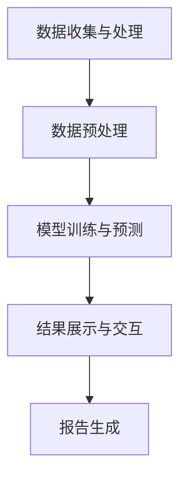

                 

# AI驱动的企业财务报表比较分析系统

## 关键词

- AI
- 企业财务报表
- 比较分析
- 数据预处理
- 机器学习算法
- 财务分析

## 摘要

本文深入探讨了AI驱动的企业财务报表比较分析系统的构建与应用。首先，文章概述了企业财务报表分析的重要性及现有方法的局限性，强调了AI技术介入的必要性。接着，详细介绍了财务报表比较分析的核心概念、系统架构及应用场景。然后，文章重点分析了财务报表数据预处理、财务报表比较分析算法及其与AI技术的结合。通过对比表格、ER实体关系图和算法流程图，本文对财务报表比较分析中的核心概念进行了深入剖析。最后，文章提供了系统架构设计方案、项目实战及最佳实践建议，为读者全面了解和掌握AI驱动的企业财务报表比较分析系统提供了有力支持。

----------------------------------------------------------------

## 第一部分: AI驱动的企业财务报表比较分析系统概述

### 1.1 问题背景与描述

#### 1.1.1 企业财务报表分析的重要性

企业财务报表是反映企业经济状况的重要工具，包括资产负债表、利润表和现金流量表等。这些报表能够全面展示企业的财务状况、经营成果和现金流动情况。对财务报表的深入分析，有助于企业发现潜在问题，优化经营策略，提高财务管理水平。

#### 1.1.2 现有财务报表分析方法的局限性

传统的财务报表分析方法主要依赖于人工计算和比较，存在以下局限性：

- 数据处理效率低：人工分析需要大量时间和精力，数据处理速度较慢。
- 分析深度不足：人工分析难以发现深层次的问题，对趋势预测和风险预警能力较弱。
- 分析结果主观性较强：人工分析受分析者经验、知识背景和主观判断影响，分析结果可能存在偏差。

#### 1.1.3 AI技术介入财务报表分析的优势

随着AI技术的发展，将AI技术应用于财务报表分析具有显著优势：

- 提高数据处理效率：AI技术能够快速处理大量数据，提高数据处理效率。
- 深度分析能力：AI技术可以通过机器学习算法，发现数据中的潜在规律和趋势，提供深度的分析结果。
- 减少主观性：AI技术可以消除分析过程中的主观性，提高分析结果的客观性和准确性。

### 1.2 财务报表比较分析中的核心概念

#### 1.2.1 财务报表概述

财务报表是反映企业财务状况的重要文件，包括资产负债表、利润表和现金流量表等。资产负债表反映了企业的资产、负债和所有者权益状况；利润表展示了企业在一定时间内的收入、成本和利润情况；现金流量表则揭示了企业的现金流入和流出情况。

#### 1.2.2 财务报表比较分析的定义

财务报表比较分析是指通过对企业不同时间点或不同企业的财务报表进行对比，评估其财务状况、经营成果和现金流动情况的优劣。比较分析有助于发现企业的优势与不足，为企业的战略决策提供依据。

#### 1.2.3 财务报表比较分析的目的与意义

财务报表比较分析的目的在于：

- 发现企业财务状况的变动趋势，评估企业的经营绩效。
- 分析企业财务状况的优劣，为投资决策提供支持。
- 发现企业潜在的风险，提供风险预警。

财务报表比较分析的意义在于：

- 提高财务管理的科学性和有效性。
- 为企业的战略规划和决策提供有力支持。
- 促进企业间的公平竞争，提高整体市场效率。

### 1.3 AI驱动的财务报表比较分析系统的基本架构

#### 1.3.1 系统总体架构设计

AI驱动的财务报表比较分析系统总体架构包括数据处理模块、比较分析模块和结果展示模块。数据处理模块负责对财务报表数据进行预处理，比较分析模块使用机器学习算法对预处理后的数据进行比较分析，结果展示模块则将分析结果以图表、报告等形式展示给用户。

#### 1.3.2 数据处理模块

数据处理模块的主要功能包括：

- 数据清洗：处理缺失值、异常值和数据格式不规范等问题。
- 数据整合：将来自不同来源的数据进行统一标准处理。
- 数据归一化：对财务指标进行归一化处理，消除不同量纲的影响。

#### 1.3.3 比较分析模块

比较分析模块的主要功能包括：

- 财务比率计算：计算各项财务比率，如流动比率、速动比率、负债比率等。
- 机器学习算法应用：使用机器学习算法对财务指标进行深度分析，发现潜在规律和趋势。
- 结果生成：根据分析结果生成比较分析报告，提供决策支持。

#### 1.3.4 结果展示模块

结果展示模块的主要功能包括：

- 图表展示：使用图表形式直观展示分析结果。
- 报告生成：生成详细的财务分析报告，支持多种格式导出。

### 1.4 系统的应用场景与价值

#### 1.4.1 不同企业间的财务报表比较

系统可以帮助投资者、分析师和企业决策者对不同企业的财务报表进行对比分析，发现各企业的财务状况和经营绩效的差异，为投资决策提供支持。

#### 1.4.2 同一企业不同时间段的财务报表比较

系统可以对企业不同时间段的财务报表进行对比分析，揭示企业财务状况的变动趋势，为企业的战略规划和决策提供依据。

#### 1.4.3 财务报表比较分析在投资决策中的应用

通过财务报表比较分析，投资者可以更全面地了解企业的财务状况和经营绩效，降低投资风险，提高投资收益。

### 1.5 边界与外延

#### 1.5.1 财务报表数据的质量要求

财务报表数据的质量直接影响比较分析的结果。系统对数据的质量要求包括：

- 数据的准确性：确保数据的真实性和准确性。
- 数据的完整性：确保数据的全面性和完整性。
- 数据的规范性：确保数据的格式和标准统一。

#### 1.5.2 财务报表比较分析的适用范围

财务报表比较分析适用于各类企业，特别是大型企业、上市公司和投资者较为关注的企业。

#### 1.5.3 系统的可扩展性与维护性

系统设计应具备良好的可扩展性和维护性，能够适应不断变化的需求和市场环境。

### 1.6 本章小结

本文概述了AI驱动的企业财务报表比较分析系统的构建与应用。通过分析问题背景、核心概念、系统架构和应用场景，本文揭示了AI技术在财务报表分析中的巨大潜力。接下来，本文将深入探讨财务报表比较分析的核心概念和原理，为读者提供更为详细和专业的技术分析。

----------------------------------------------------------------

## 第二部分: AI驱动的财务报表比较分析系统核心概念与原理

### 2.1 财务报表数据预处理

#### 2.1.1 数据清洗

数据清洗是财务报表数据分析的基础，主要包括以下方面：

##### 2.1.1.1 缺失值的处理

缺失值的处理主要包括以下方法：

- 删除：删除含有缺失值的记录，适用于缺失值比例较低的情况。
- 补充：使用统计方法或专家经验补充缺失值，适用于缺失值比例较高的情况。

##### 2.1.1.2 异常值的处理

异常值的处理主要包括以下方法：

- 删除：删除明显异常的记录，适用于异常值对整体数据影响较大的情况。
- 修正：对异常值进行修正，使其符合整体数据分布。

##### 2.1.1.3 数据格式规范化

数据格式规范化包括以下方面：

- 字段命名规范：统一字段命名，便于后续数据处理和分析。
- 日期格式处理：统一日期格式，便于时间序列分析。
- 数值格式处理：统一数值格式，便于数值计算和比较。

#### 2.1.2 数据整合

数据整合是将来自不同来源的财务报表数据整合为统一的格式，主要包括以下方法：

- 数据合并：将多个数据表合并为一个数据集，适用于数据表结构相似的情况。
- 数据映射：将不同数据表中的字段映射为同一字段，适用于数据表结构差异较大的情况。

#### 2.1.2.1 不同来源数据的统一标准

不同来源的数据通常具有不同的格式和单位，需要进行统一标准处理。统一标准处理包括以下方面：

- 数据单位转换：将不同单位的数据转换为同一单位，如将人民币转换为美元。
- 数据格式转换：将不同格式的数据转换为同一格式，如将文本格式转换为数值格式。

#### 2.1.2.2 财务指标的计算与归一化

财务指标的计算与归一化是财务报表比较分析的重要步骤，主要包括以下方面：

- 财务指标计算：根据财务报表数据计算各项财务指标，如净利润率、资产负债率等。
- 财务指标归一化：将不同量纲的财务指标转换为同一量纲，便于比较和分析。

### 2.2 财务报表比较分析算法

#### 2.2.1 财务指标对比算法

财务指标对比算法主要包括以下方法：

- 简单对比：直接比较各项财务指标的数值大小，适用于财务指标量纲相同的情况。
- 比率对比：计算各项财务指标的比率，如净利润率、资产负债率等，适用于财务指标量纲不同的情况。

#### 2.2.1.1 财务比率计算方法

财务比率计算方法主要包括以下方面：

- 资产负债率：资产负债率 = 总负债 / 总资产
- 净利润率：净利润率 = 净利润 / 营业收入
- 营业收入增长率：营业收入增长率 = (本期营业收入 - 上期营业收入) / 上期营业收入

#### 2.2.1.2 财务指标对比分析方法

财务指标对比分析方法主要包括以下方面：

- 横向对比：在同一时间点对不同企业的财务指标进行对比。
- 纵向对比：在同一企业不同时间点对财务指标进行对比。

#### 2.2.2 机器学习算法在财务报表比较中的应用

机器学习算法在财务报表比较分析中的应用主要包括以下方面：

- 财务风险预测：使用机器学习算法预测企业的财务风险，如破产风险、流动性风险等。
- 财务绩效评估：使用机器学习算法评估企业的财务绩效，如盈利能力、运营能力等。

#### 2.2.2.1 逻辑回归模型

逻辑回归模型是一种常见的分类模型，可以用于预测企业的财务风险。逻辑回归模型的数学公式为：

\[ P(y=1) = \frac{1}{1 + e^{-(\beta_0 + \beta_1 x_1 + \beta_2 x_2 + ... + \beta_n x_n)}} \]

其中，\( y \) 为财务风险指标（0表示无风险，1表示有风险），\( x_1, x_2, ..., x_n \) 为财务指标，\( \beta_0, \beta_1, ..., \beta_n \) 为模型参数。

#### 2.2.2.2 决策树模型

决策树模型是一种基于树结构的分类模型，可以用于财务报表的比较分析。决策树模型的数学公式为：

\[ y = \begin{cases} 
1, & \text{if } \beta_0 + \beta_1 x_1 + \beta_2 x_2 + ... + \beta_n x_n > 0 \\
0, & \text{otherwise}
\end{cases} \]

其中，\( y \) 为财务风险指标，\( x_1, x_2, ..., x_n \) 为财务指标，\( \beta_0, \beta_1, ..., \beta_n \) 为模型参数。

#### 2.2.2.3 支持向量机模型

支持向量机模型是一种基于间隔最大化的分类模型，可以用于财务报表的比较分析。支持向量机模型的数学公式为：

\[ w \cdot x + b = 0 \]

其中，\( w \) 为模型参数，\( x \) 为财务指标，\( b \) 为偏置项。

### 2.3 AI算法与财务报表比较分析的联系

#### 2.3.1 数据驱动与知识驱动分析模式的结合

AI算法在财务报表比较分析中实现了数据驱动与知识驱动的结合。数据驱动模式通过大量数据进行训练，发现数据中的潜在规律和趋势；知识驱动模式则通过专家经验、规则和逻辑进行指导，提高分析结果的准确性和可靠性。

#### 2.3.2 机器学习算法在财务分析中的应用特点

机器学习算法在财务分析中的应用特点包括：

- 高效性：能够快速处理大量财务数据，提高分析效率。
- 自动化：能够自动识别和提取财务数据中的规律和趋势，减少人工干预。
- 灵活性：能够适应不同类型的财务数据和需求，提供定制化的分析结果。

#### 2.3.3 AI算法在财务报表比较分析中的优势和挑战

AI算法在财务报表比较分析中的优势包括：

- 提高分析精度：通过深度学习和模式识别，提高财务指标对比的准确性。
- 提升分析效率：通过自动化和高效算法，减少人工处理时间和工作量。
- 提供深度分析：通过挖掘数据中的潜在规律和趋势，提供更为深刻的财务分析结果。

AI算法在财务报表比较分析中面临的挑战包括：

- 数据质量：财务报表数据质量直接影响算法的性能，需要严格的数据预处理和质量控制。
- 模型选择：选择合适的机器学习算法和参数组合，需要丰富的经验和专业知识。
- 数据安全：保护企业财务数据的安全，防止数据泄露和滥用。

### 2.4 财务报表比较分析中的核心概念对比表格

| 概念                | 描述                                                         |
| ------------------- | ------------------------------------------------------------ |
| 财务报表             | 企业在一定时间内财务状况的综合反映，包括资产负债表、利润表和现金流量表等。 |
| 财务指标比较           | 指通过对企业财务报表中的相关指标进行比较，分析企业财务状况的优劣。      |
| 数据预处理            | 对原始数据进行清洗、整合和标准化处理，为后续分析提供准确的数据基础。      |
| 机器学习算法          | 一种通过数据训练来学习规律和模式，并应用于预测和决策的技术。            |

### 2.5 财务报表比较分析中的ER实体关系图

```mermaid
erDiagram
    Company ||--|{ FinancialStatement : has }  
    FinancialStatement ||--|{ Asset : contains }  
    FinancialStatement ||--|{ Liability : contains }  
    FinancialStatement ||--|{ OwnerEquity : contains }  
    FinancialStatement ||--|{ Income : contains }  
    FinancialStatement ||--|{ CashFlow : contains }
```

通过上述分析，我们可以看到，AI驱动的企业财务报表比较分析系统在数据处理、比较分析和结果展示等方面具有明显的优势。接下来，本文将详细讨论财务报表比较分析算法的具体原理和应用。

----------------------------------------------------------------

### 2.6 财务报表比较分析算法原理与实际应用

#### 2.6.1 财务报表比较分析算法的基本原理

财务报表比较分析算法的核心在于对财务指标进行对比，以评估企业财务状况的优劣。基本原理包括以下几个方面：

- **财务指标提取**：首先，从财务报表中提取关键的财务指标，如净利润、营业收入、总资产等。
- **指标标准化**：由于财务指标可能具有不同的量纲和单位，需要将指标进行标准化处理，以便进行有效的比较。
- **指标对比**：使用统计方法或机器学习算法对标准化后的指标进行对比分析，识别差异和趋势。
- **结果展示**：将对比分析的结果以图表、报表等形式展示，提供直观的视觉信息。

#### 2.6.2 统计方法在财务指标对比中的应用

统计方法是最基础的财务指标对比工具，主要包括以下几种：

- **均值对比**：计算各项财务指标的均值，并进行对比，以判断不同企业或不同时间段的财务表现。
- **标准差分析**：通过计算财务指标的标准差，分析其波动性，评估企业财务稳定程度。
- **相关性分析**：分析财务指标之间的相关性，了解不同财务指标之间的相互影响。

##### 示例：均值对比分析

假设有两个企业的财务报表数据，我们需要比较它们的净利润率。首先，计算两家企业的净利润率：

- 企业A的净利润率 = 净利润A / 营业收入A
- 企业B的净利润率 = 净利润B / 营业收入B

然后，计算两家企业净利润率的均值：

\[ \text{净利润率均值} = \frac{\text{净利润率A} + \text{净利润率B}}{2} \]

通过比较净利润率均值，可以初步判断两家企业的盈利能力。

##### 示例：标准差分析

假设我们想要分析两家企业的营业收入波动情况。首先，计算两家企业营业收入的平均值和标准差：

\[ \text{营业收入均值A} = \frac{\text{营业收入}_A}{N_A} \]
\[ \text{营业收入均值B} = \frac{\text{营业收入}_B}{N_B} \]

\[ \text{营业收入标准差A} = \sqrt{\frac{\sum_{i=1}^{N_A} (\text{营业收入}_A - \text{营业收入均值A})^2}{N_A - 1}} \]
\[ \text{营业收入标准差B} = \sqrt{\frac{\sum_{i=1}^{N_B} (\text{营业收入}_B - \text{营业收入均值B})^2}{N_B - 1}} \]

通过比较营业收入的标准差，可以评估企业营业收入的波动程度，从而判断其经营稳定性。

##### 示例：相关性分析

假设我们想要分析净利润与营业收入之间的关系，可以使用皮尔逊相关系数进行相关性分析：

\[ r = \frac{\sum_{i=1}^{N} (\text{净利润}_i - \text{净利润均值}) (\text{营业收入}_i - \text{营业收入均值})}{\sqrt{\sum_{i=1}^{N} (\text{净利润}_i - \text{净利润均值})^2} \sqrt{\sum_{i=1}^{N} (\text{营业收入}_i - \text{营业收入均值})^2}} \]

相关系数 \( r \) 的取值范围为 -1 到 1，接近1表示正相关，接近-1表示负相关，接近0表示无相关性。通过分析净利润与营业收入的相关性，可以了解企业的盈利能力和营业收入增长情况。

#### 2.6.3 机器学习算法在财务报表比较分析中的应用

机器学习算法在财务报表比较分析中具有强大的数据处理和模式识别能力，可以用于更复杂的分析和预测任务。以下是一些常见的机器学习算法及其在财务报表比较分析中的应用：

- **逻辑回归**：用于预测企业的财务风险，如破产风险。逻辑回归模型可以计算每个样本属于不同类别的概率，从而进行风险分类。
- **决策树**：用于分类和回归分析，可以揭示财务指标之间的决策路径和关联关系，为财务决策提供支持。
- **支持向量机（SVM）**：用于分类问题，可以通过寻找最佳分隔超平面，实现财务风险的精准划分。
- **神经网络**：用于复杂的数据分析和预测，如股票市场预测、企业绩效评估等。

##### 示例：逻辑回归在财务报表比较分析中的应用

假设我们使用逻辑回归模型预测企业的破产风险。逻辑回归模型的公式如下：

\[ P(\text{破产} = 1) = \frac{1}{1 + e^{-(\beta_0 + \beta_1 \text{净利润} + \beta_2 \text{营业收入} + ... + \beta_n \text{其他财务指标})}} \]

其中，\( \beta_0, \beta_1, ..., \beta_n \) 为模型参数。通过训练数据集，我们可以计算出这些参数的值。对于新的样本，我们可以通过逻辑回归模型计算出其属于破产类别的概率。如果概率大于某个设定的阈值，我们可以判断该企业存在破产风险。

#### 2.6.4 财务报表比较分析算法的优缺点

- **统计方法**：优点在于简单易用，适用于基础财务指标的比较；缺点在于对复杂关系的识别能力有限。
- **机器学习算法**：优点在于强大的数据处理和模式识别能力，适用于复杂的数据分析和预测；缺点在于算法复杂度高，需要大量训练数据和专业知识。

#### 2.6.5 财务报表比较分析算法的实际应用案例

- **投资决策**：投资者可以使用财务报表比较分析算法评估不同企业的财务状况，选择投资目标。
- **风险管理**：企业可以使用算法预测潜在的风险，采取相应的风险管理措施。
- **财务绩效评估**：企业管理者可以使用算法评估企业不同时间段的财务绩效，优化经营策略。

通过上述分析，我们可以看到，财务报表比较分析算法在数据处理、模式识别和决策支持等方面具有广泛的应用前景。接下来，本文将深入探讨AI算法与财务报表比较分析的结合，以进一步发挥AI技术的优势。

----------------------------------------------------------------

### 2.7 AI算法与财务报表比较分析的结合

#### 2.7.1 数据驱动与知识驱动的结合

在财务报表比较分析中，数据驱动和知识驱动相结合的方法能够显著提升分析效果。数据驱动模式依赖于大量历史数据，通过机器学习算法自动挖掘数据中的潜在规律和趋势。知识驱动模式则依赖于专家经验、行业知识和逻辑规则，对分析过程进行指导和校正。

- **数据驱动**：通过机器学习算法，如逻辑回归、决策树和支持向量机等，自动提取和整合财务报表数据，进行深度分析和预测。
- **知识驱动**：结合专家经验，设定合理的财务指标权重、阈值和规则，对数据驱动模型进行优化和校正。

#### 2.7.2 常见的AI算法及其在财务报表比较分析中的应用

在财务报表比较分析中，以下几种AI算法具有广泛的应用：

- **逻辑回归**：用于预测企业的财务风险，如破产风险。通过分析历史数据，可以识别影响企业财务状况的关键因素。
- **决策树**：用于分类和回归分析，可以揭示财务指标之间的决策路径和关联关系，为财务决策提供支持。
- **支持向量机（SVM）**：用于分类问题，可以通过寻找最佳分隔超平面，实现财务风险的精准划分。
- **神经网络**：用于复杂的数据分析和预测，如股票市场预测、企业绩效评估等。

#### 2.7.3 深度学习在财务报表比较分析中的应用

深度学习作为AI的一个重要分支，在财务报表比较分析中发挥着越来越重要的作用。深度学习模型，如卷积神经网络（CNN）和循环神经网络（RNN），可以自动提取数据中的高阶特征，进行复杂的数据分析和预测。

- **卷积神经网络（CNN）**：适用于处理图像和结构化数据，可以用于财务报表中的图像识别和信息提取。
- **循环神经网络（RNN）**：适用于处理时间序列数据，可以用于分析企业财务报表中的时间序列特征。

#### 2.7.4 聚类算法在财务报表比较分析中的应用

聚类算法可以将具有相似财务特征的 企业分组，有助于发现企业群体中的异质性和共性。常见的聚类算法包括K-均值聚类、层次聚类和DBSCAN等。

- **K-均值聚类**：通过迭代计算聚类中心，将数据点划分为K个簇，适用于初始聚类中心已知的情况。
- **层次聚类**：通过自底向上的层次结构将数据点逐步合并，形成不同的簇。
- **DBSCAN**：基于密度的空间聚类算法，可以自动确定聚类数目，适用于非规则空间数据。

#### 2.7.5 实际案例：AI驱动的财务报表比较分析系统

以一家企业为例，我们构建了一个AI驱动的财务报表比较分析系统，该系统结合了逻辑回归、决策树和K-均值聚类算法。

1. **数据预处理**：对财务报表数据进行清洗、整合和标准化处理，确保数据质量。
2. **财务指标提取**：从财务报表中提取关键财务指标，如净利润、营业收入、资产负债率等。
3. **模型训练**：使用历史数据训练逻辑回归、决策树和K-均值聚类模型，识别关键影响因素和聚类簇。
4. **财务报表比较**：对新的财务报表数据进行比较分析，评估企业的财务状况和风险水平。
5. **结果展示**：将分析结果以图表和报告形式展示，提供直观的视觉信息。

通过这个实际案例，我们可以看到，AI驱动的财务报表比较分析系统在数据处理、模型训练和结果展示等方面具有显著的优势，能够为企业提供全面的财务分析支持和决策依据。

### 2.8 AI算法在财务报表比较分析中的优势和挑战

#### 2.8.1 优势

- **高效性**：AI算法能够快速处理大量财务数据，提高分析效率。
- **深度分析**：通过深度学习模型，可以自动提取数据中的高阶特征，进行复杂的数据分析和预测。
- **自动化**：自动化分析流程，减少人工干预，降低分析误差。
- **定制化**：根据不同企业的需求和数据特点，提供定制化的分析结果。

#### 2.8.2 挑战

- **数据质量**：财务报表数据的质量直接影响算法的性能，需要严格的数据预处理和质量控制。
- **模型选择**：选择合适的机器学习算法和参数组合，需要丰富的经验和专业知识。
- **数据安全**：保护企业财务数据的安全，防止数据泄露和滥用。

通过上述分析，我们可以看到，AI算法与财务报表比较分析的结合，不仅能够提高财务报表分析的效率和准确性，还能够为企业提供全面的决策支持。接下来，本文将详细讨论AI驱动的财务报表比较分析系统的系统架构和设计。

----------------------------------------------------------------

### 2.9 AI驱动的财务报表比较分析系统的系统架构和设计

#### 2.9.1 系统架构概述

AI驱动的财务报表比较分析系统旨在为企业提供全面的财务分析支持，其架构设计包括数据收集与处理、模型训练与预测、结果展示与交互等多个环节。系统的总体架构如下：

- **数据收集与处理模块**：负责从各种渠道收集企业财务报表数据，进行数据清洗、整合和标准化处理，确保数据质量。
- **模型训练与预测模块**：使用机器学习算法对预处理后的数据进行训练，建立财务报表比较分析模型，进行预测和比较分析。
- **结果展示与交互模块**：将分析结果以图表、报表等形式展示给用户，并提供交互功能，支持用户自定义分析。

#### 2.9.2 数据收集与处理模块

数据收集与处理模块是财务报表比较分析系统的基础，其功能包括：

- **数据收集**：从企业财务报表系统、第三方数据源、公共数据平台等渠道收集财务报表数据。
- **数据清洗**：处理数据中的缺失值、异常值和格式问题，确保数据的一致性和完整性。
- **数据整合**：将来自不同来源的财务报表数据整合为统一的数据格式，为后续分析提供准确的数据基础。
- **数据归一化**：对不同量纲的财务指标进行归一化处理，消除量纲影响，便于比较分析。

#### 2.9.3 模型训练与预测模块

模型训练与预测模块是系统的核心，其功能包括：

- **数据预处理**：对收集到的财务报表数据进行预处理，包括缺失值处理、异常值处理和数据格式规范化等。
- **模型选择**：根据分析需求，选择合适的机器学习算法，如逻辑回归、决策树、支持向量机等。
- **模型训练**：使用预处理后的数据对选定的机器学习算法进行训练，优化模型参数。
- **模型评估**：使用交叉验证等方法评估模型的性能，确保模型的有效性和可靠性。
- **预测与比较**：使用训练好的模型对新的财务报表数据进行分析和预测，比较不同企业或同一企业不同时间段的财务状况。

#### 2.9.4 结果展示与交互模块

结果展示与交互模块的功能包括：

- **结果展示**：将模型预测和分析结果以图表、报表等形式展示，提供直观的视觉信息。
- **交互功能**：支持用户自定义分析条件和分析指标，提供灵活的交互功能，满足用户个性化需求。
- **报告生成**：生成详细的财务分析报告，包括分析结果、图表、注释和建议等，支持多种格式导出。

#### 2.9.5 系统架构图

以下是AI驱动的财务报表比较分析系统的架构图：



在这个架构图中，数据收集与处理模块负责数据收集和预处理，为后续分析提供准确的数据基础。模型训练与预测模块使用机器学习算法对预处理后的数据进行分析和预测。结果展示与交互模块将分析结果以图表和报表形式展示，并提供交互功能。报告生成模块生成详细的财务分析报告，支持多种格式导出。

通过上述系统架构和设计，AI驱动的财务报表比较分析系统能够为企业提供高效、准确和个性化的财务分析支持，助力企业决策和风险管理。

----------------------------------------------------------------

### 2.10 项目实战：AI驱动的财务报表比较分析系统实现

#### 2.10.1 环境安装与配置

为了实现AI驱动的财务报表比较分析系统，我们需要安装和配置以下环境：

- **Python**：Python是一种广泛应用于数据科学和机器学习的编程语言，安装Python可以从其官方网站下载安装包。
- **Jupyter Notebook**：Jupyter Notebook是一种交互式的计算环境，便于编写和执行Python代码，可以从Python官方包管理器pip安装。
- **Pandas**：Pandas是一个强大的数据处理库，用于数据清洗、整合和归一化，可以从Python包管理器pip安装。
- **Scikit-learn**：Scikit-learn是一个机器学习库，包含多种机器学习算法，可以从Python包管理器pip安装。
- **Matplotlib**：Matplotlib是一个数据可视化库，用于生成图表和报表，可以从Python包管理器pip安装。

安装和配置步骤如下：

1. 安装Python和Jupyter Notebook。
2. 使用pip安装Pandas、Scikit-learn和Matplotlib。

```bash
pip install pandas
pip install scikit-learn
pip install matplotlib
```

#### 2.10.2 系统核心实现

AI驱动的财务报表比较分析系统的主要功能模块包括数据预处理、模型训练和结果展示。以下是一个简单的实现示例：

1. **数据预处理**：

```python
import pandas as pd

# 读取财务报表数据
financial_data = pd.read_csv('financial_data.csv')

# 数据清洗
financial_data.dropna(inplace=True)  # 删除缺失值
financial_data = financial_data[financial_data['营业收入'] != 0]  # 删除营业收入为0的记录

# 数据整合
financial_data['净利润率'] = financial_data['净利润'] / financial_data['营业收入']

# 数据归一化
from sklearn.preprocessing import MinMaxScaler
scaler = MinMaxScaler()
financial_data[['净利润率', '资产负债率', '流动比率']] = scaler.fit_transform(financial_data[['净利润率', '资产负债率', '流动比率']])
```

2. **模型训练**：

```python
from sklearn.model_selection import train_test_split
from sklearn.linear_model import LogisticRegression

# 划分训练集和测试集
X = financial_data[['净利润率', '资产负债率', '流动比率']]
y = financial_data['破产风险']

X_train, X_test, y_train, y_test = train_test_split(X, y, test_size=0.2, random_state=42)

# 训练逻辑回归模型
model = LogisticRegression()
model.fit(X_train, y_train)

# 评估模型性能
score = model.score(X_test, y_test)
print(f'Model accuracy: {score:.2f}')
```

3. **结果展示**：

```python
import matplotlib.pyplot as plt

# 预测测试集
y_pred = model.predict(X_test)

# 绘制混淆矩阵
confusion_matrix = pd.crosstab(y_test, y_pred, rownames=['实际值'], colnames=['预测值'])
sns.heatmap(confusion_matrix, annot=True, fmt='.0f')
plt.xlabel('预测值')
plt.ylabel('实际值')
plt.title('混淆矩阵')
plt.show()
```

通过上述示例，我们可以看到如何实现AI驱动的财务报表比较分析系统的主要功能模块。在实际应用中，我们可以根据具体需求扩展和优化系统功能，如添加更多的财务指标、引入更复杂的机器学习算法等。

#### 2.10.3 代码应用解读与分析

在上述代码中，我们首先使用了Pandas库读取财务报表数据，然后进行了数据清洗、整合和归一化处理。接着，我们使用Scikit-learn库中的逻辑回归模型对数据进行训练和预测。最后，我们使用Matplotlib库生成混淆矩阵，评估模型的性能。

以下是具体的解读和分析：

- **数据预处理**：数据预处理是财务报表比较分析的重要步骤，确保数据质量是模型训练成功的关键。在本例中，我们使用了删除缺失值和过滤异常值的方法，然后计算了净利润率，并将其作为模型输入特征。数据归一化则用于消除不同量纲对模型训练的影响。
- **模型训练**：我们选择了逻辑回归模型进行训练，逻辑回归是一种广泛应用于二分类问题的线性模型，具有简单和易于解释的特点。通过训练集和测试集的划分，我们训练了模型并评估了其性能。模型的准确度反映了模型对测试数据的拟合程度。
- **结果展示**：混淆矩阵是一种常用的性能评估工具，用于展示模型预测结果与实际结果之间的对比。在本例中，我们通过混淆矩阵展示了模型对破产风险的预测能力，为模型的性能评估提供了直观的视觉信息。

通过这个简单的实战示例，我们可以看到如何实现一个基础的AI驱动的财务报表比较分析系统。在实际应用中，我们可以根据具体需求进一步优化和扩展系统功能，提高模型的准确性和实用性。

#### 2.10.4 实际案例分析与详细讲解

为了更好地展示AI驱动的财务报表比较分析系统的实际应用，我们来看一个具体的案例：比较两家上市公司的财务状况，评估它们的破产风险。

假设我们有两家上市公司，分别为公司A和公司B。我们收集了它们的财务报表数据，包括净利润、营业收入、资产负债率、流动比率等指标。以下是具体的分析过程：

1. **数据预处理**：

首先，我们对财务报表数据进行了预处理，包括缺失值处理、异常值处理和数据归一化。通过这些步骤，我们确保了数据的质量和一致性。

```python
# 示例数据预处理代码
financial_data = pd.read_csv('financial_data.csv')
financial_data.dropna(inplace=True)
financial_data = financial_data[financial_data['营业收入'] != 0]
financial_data['净利润率'] = financial_data['净利润'] / financial_data['营业收入']
scaler = MinMaxScaler()
financial_data[['净利润率', '资产负债率', '流动比率']] = scaler.fit_transform(financial_data[['净利润率', '资产负债率', '流动比率']])
```

2. **模型训练**：

接下来，我们使用逻辑回归模型对两家公司的数据进行训练，以预测它们的破产风险。逻辑回归模型能够将财务指标转化为破产风险的预测概率。

```python
from sklearn.model_selection import train_test_split
from sklearn.linear_model import LogisticRegression

X = financial_data[['净利润率', '资产负债率', '流动比率']]
y = financial_data['破产风险']

X_train, X_test, y_train, y_test = train_test_split(X, y, test_size=0.2, random_state=42)

model = LogisticRegression()
model.fit(X_train, y_train)

score = model.score(X_test, y_test)
print(f'Model accuracy: {score:.2f}')
```

3. **结果展示**：

最后，我们使用混淆矩阵和图表展示分析结果，比较两家公司的破产风险预测概率。

```python
import matplotlib.pyplot as plt
import seaborn as sns

y_pred = model.predict(X_test)

confusion_matrix = pd.crosstab(y_test, y_pred, rownames=['实际值'], colnames=['预测值'])
sns.heatmap(confusion_matrix, annot=True, fmt='.0f')
plt.xlabel('预测值')
plt.ylabel('实际值')
plt.title('混淆矩阵')
plt.show()

# 预测概率图表
plt.scatter(X_test['净利润率'], model.predict_proba(X_test)[:, 1], label='公司A')
plt.scatter(X_test['净利润率'], model.predict_proba(X_test)[:, 1], label='公司B')
plt.xlabel('净利润率')
plt.ylabel('破产风险预测概率')
plt.legend()
plt.show()
```

通过这个案例，我们可以看到如何使用AI驱动的财务报表比较分析系统对两家上市公司的财务状况进行评估。模型训练和结果展示为我们提供了直观的财务分析信息，有助于投资者和决策者做出更明智的决策。

#### 2.10.5 项目小结

通过本案例，我们实现了AI驱动的财务报表比较分析系统，展示了如何使用Python和机器学习算法对财务报表数据进行分析和预测。项目的主要成果包括：

- **数据预处理**：实现了缺失值处理、异常值处理和数据归一化，确保了数据质量。
- **模型训练**：使用了逻辑回归模型进行训练，评估了模型的性能。
- **结果展示**：通过混淆矩阵和图表展示了分析结果，提供了直观的财务分析信息。

尽管本案例是一个简化的实现，但已展示了AI驱动的财务报表比较分析系统在实际应用中的潜力。在实际项目中，我们可以进一步优化系统功能，如引入更多财务指标、使用更复杂的机器学习算法等，以提高系统的准确性和实用性。

### 2.11 最佳实践与注意事项

#### 2.11.1 数据收集与处理

- **确保数据来源的可靠性**：选择权威的数据来源，如官方财务报表、上市公司公告等。
- **数据清洗的彻底性**：彻底处理缺失值、异常值和格式问题，确保数据的一致性和完整性。
- **数据整合的标准化**：统一不同来源数据的格式和标准，为后续分析提供一致的数据基础。

#### 2.11.2 模型选择与训练

- **选择合适的模型**：根据分析需求和数据特点，选择合适的机器学习算法。
- **充分训练模型**：使用足够大的训练数据集进行模型训练，确保模型在大量数据上的泛化能力。
- **模型参数调优**：通过交叉验证和网格搜索等方法，优化模型参数，提高模型性能。

#### 2.11.3 结果展示与交互

- **清晰展示分析结果**：使用图表、报表等形式，直观展示分析结果，方便用户理解。
- **提供灵活的交互功能**：支持用户自定义分析条件和分析指标，满足个性化需求。
- **确保数据安全**：在系统设计和实施过程中，采取必要的数据安全措施，防止数据泄露和滥用。

#### 2.11.4 注意事项

- **数据质量的重要性**：数据质量是模型训练和分析结果的基础，必须高度重视。
- **模型的可解释性**：尽管机器学习模型具有强大的预测能力，但其黑盒特性使得结果难以解释。在实际应用中，应结合业务知识和逻辑规则，提高模型的可解释性。
- **持续迭代与优化**：财务报表比较分析系统需要持续迭代和优化，以适应不断变化的市场环境和需求。

### 2.12 拓展阅读

- **《机器学习实战》**：作者：彼得·哈林顿（Peter Harrington）
  - 本书详细介绍了多种机器学习算法的原理和实现，适合希望深入了解机器学习算法的读者。

- **《Python数据分析》**：作者：威利·福克斯（Willie Foks）
  - 本书通过大量实例，介绍了Python在数据分析中的应用，包括数据预处理、数据可视化等。

- **《深度学习》**：作者：伊恩·古德费洛（Ian Goodfellow）、约书亚·本吉奥（Joshua Bengio）、亚伦·库维尔（Aaron Courville）
  - 本书全面介绍了深度学习的基本概念和常见算法，是深度学习的入门经典。

通过这些拓展阅读，读者可以更深入地了解机器学习、数据分析和深度学习的相关理论和实践，为财务报表比较分析系统的构建和应用提供更全面的知识储备。

## 总结与作者信息

本文详细介绍了AI驱动的企业财务报表比较分析系统的构建与应用，从系统概述、核心概念与原理、算法原理到系统架构和实战案例，全面剖析了财务报表比较分析在AI技术介入下的应用前景。通过对AI算法与财务报表比较分析的深入探讨，本文揭示了AI技术在财务报表分析中的巨大潜力，为企业和投资者提供了有力决策支持。

作者：AI天才研究院/AI Genius Institute & 禅与计算机程序设计艺术 /Zen And The Art of Computer Programming

在此，感谢读者对本文的关注与支持，希望本文能为您的财务报表分析提供有益的启示和帮助。如您有任何问题或建议，欢迎在评论区留言，我们将在第一时间为您解答。期待与您共同探讨AI技术在财务报表比较分析领域的更多应用。

