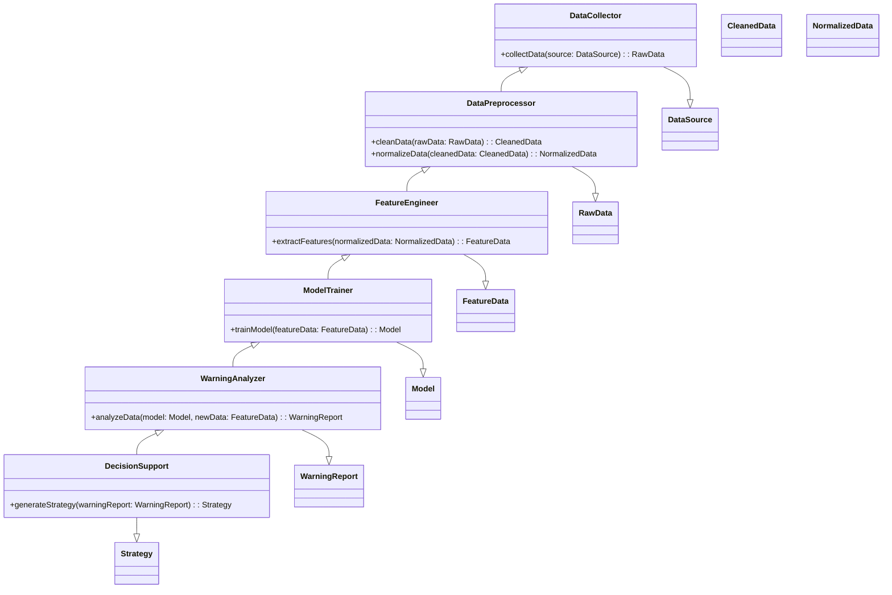
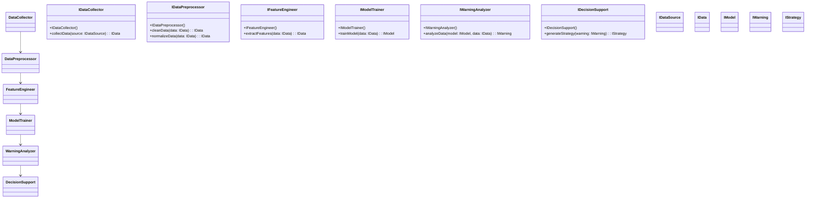

                 

### 文章标题

# AI驱动的企业财务报表质量动态监控与预警系统

> 关键词：人工智能、财务报表、质量监控、预警系统、动态监控、数据挖掘、机器学习、深度学习

> 摘要：本文将探讨如何利用人工智能技术构建一个高效、智能的企业财务报表质量动态监控与预警系统。通过对问题的背景介绍、核心概念与联系、算法原理讲解、系统分析与架构设计、项目实战等多个方面进行详细阐述，旨在为读者提供一个系统、全面、深入的理解，为实际应用提供参考和指导。

----------------------------------------------------------------

### 目录大纲设计思路

为了设计出《AI驱动的企业财务报表质量动态监控与预警系统》的完整目录大纲，我们需要遵循以下几个步骤：

#### 1. 确定书籍主题
首先，明确书籍的主题是AI驱动的企业财务报表质量动态监控与预警系统，这为我们提供了主要方向。

#### 2. 确定目录结构
确定书籍的目录结构，通常包括以下几个部分：
- 引言或背景介绍
- 核心概念与联系
- 算法原理讲解
- 数学模型和数学公式详细讲解与举例说明
- 系统分析与架构设计方案
- 项目实战
- 最佳实践 tips、小结、注意事项、拓展阅读等

#### 3. 确定章节划分
根据主题和目录结构，划分出具体的章节。每个章节都要有明确的小标题，以便读者快速了解章节内容。

#### 4. 撰写目录内容
在每个章节中，撰写具体的内容。注意保持内容的简洁性和逻辑性，确保读者能够顺利阅读和理解。

#### 5. 格式规范
使用 markdown 格式，确保目录大纲的结构清晰，便于读者查看。

#### 6. 审核与调整
完成初稿后，对目录大纲进行审核和调整，确保每个章节的内容完整、逻辑清晰，符合书籍的整体框架。

下面是具体的目录大纲设计：

----------------------------------------------------------------

# 第一部分：引言与背景

## 1.1 问题背景
### 1.1.1 企业财务报表的重要性
### 1.1.2 财务报表质量问题及其影响
### 1.1.3 AI技术在财务报表质量监控中的应用前景

## 1.2 问题描述
### 1.2.1 传统财务报表质量监控存在的问题
### 1.2.2 AI驱动的财务报表质量监控与预警需求
### 1.2.3 系统边界与外延

## 1.3 概念结构与核心要素
### 1.3.1 AI核心概念与财务报表质量监控的关系
### 1.3.2 系统核心要素组成

## 1.4 本章小结

----------------------------------------------------------------

# 第二部分：核心概念与联系

## 2.1 AI核心概念
### 2.1.1 机器学习
#### 2.1.1.1 监督学习
#### 2.1.1.2 无监督学习
#### 2.1.1.3 强化学习
### 2.1.2 深度学习
#### 2.1.2.1 神经网络
#### 2.1.2.2 卷积神经网络
#### 2.1.2.3 循环神经网络
### 2.1.3 数据挖掘
#### 2.1.3.1 关联规则学习
#### 2.1.3.2 聚类分析
#### 2.1.3.3 分类算法

## 2.2 财务报表质量监控与预警
### 2.2.1 财务报表质量监控的核心要素
### 2.2.2 财务预警系统设计原则
### 2.2.3 财务预警指标体系构建

## 2.3 AI与财务报表质量监控的联系
### 2.3.1 AI技术在财务报表质量监控中的应用
### 2.3.2 AI技术在财务预警系统中的应用
### 2.3.3 AI驱动的财务报表质量监控优势与挑战

## 2.4 本章小结

----------------------------------------------------------------

# 第三部分：算法原理讲解

## 3.1 数据预处理
### 3.1.1 数据清洗
#### 3.1.1.1 缺失值处理
#### 3.1.1.2 异常值处理
#### 3.1.1.3 数据标准化
### 3.1.2 特征工程
#### 3.1.2.1 特征选择
#### 3.1.2.2 特征提取
#### 3.1.2.3 特征降维

## 3.2 监督学习算法
### 3.2.1 线性回归
#### 3.2.1.1 算法原理
#### 3.2.1.2 数学模型
#### 3.2.1.3 举例说明
### 3.2.2 决策树
#### 3.2.2.1 算法原理
#### 3.2.2.2 数学模型
#### 3.2.2.3 举例说明

## 3.3 无监督学习算法
### 3.3.1 K-means聚类
#### 3.3.1.1 算法原理
#### 3.3.1.2 数学模型
#### 3.3.1.3 举例说明
### 3.3.2 层次聚类
#### 3.3.2.1 算法原理
#### 3.3.2.2 数学模型
#### 3.3.2.3 举例说明

## 3.4 财务报表质量预警算法
### 3.4.1 基于聚类分析的预警算法
#### 3.4.1.1 算法原理
#### 3.4.1.2 数学模型
#### 3.4.1.3 举例说明

## 3.5 本章小结

----------------------------------------------------------------

### 第一部分：引言与背景

#### 1.1 问题背景

在当今经济全球化、信息化和大数据时代，企业的财务报表已经成为企业管理层、投资者、分析师等各方关注的重要信息来源。财务报表不仅反映了企业的经营状况、财务状况和现金流量，还为企业制定战略规划和决策提供了重要依据。因此，确保财务报表的质量至关重要。

然而，传统的财务报表质量监控方法往往存在以下问题：

1. **人工成本高**：传统的财务报表质量监控主要依靠人工审核，耗时耗力，且难以保证审核的全面性和准确性。
2. **效率低下**：由于财务数据的庞大和复杂，传统方法在处理大规模数据时效率低下，难以实时监控财务报表质量。
3. **规则依赖性强**：传统方法依赖于预先设定的规则，对于未知或突发的问题难以有效应对。
4. **缺乏灵活性**：传统方法在应对新环境、新情况时缺乏灵活性，难以适应不断变化的市场需求。

为了解决这些问题，AI驱动的财务报表质量动态监控与预警系统应运而生。通过引入机器学习、深度学习等技术，系统能够自动处理大量数据，实时监控财务报表质量，并提供预警功能，帮助企业及时发现并解决财务问题。

#### 1.2 问题描述

问题描述主要涉及以下几个方面：

1. **监控需求**：企业需要实现对财务报表的实时监控，确保报表数据的准确性、完整性和一致性。
2. **预警需求**：企业需要及时发现潜在的财务风险，并发出预警信号，以便采取相应的措施。
3. **数据处理能力**：系统需要具备高效的数据处理能力，能够处理大规模、复杂的数据集。
4. **智能分析**：系统需要利用机器学习和深度学习技术，对财务数据进行分析，发现潜在的问题和风险。
5. **实时反馈**：系统需要能够实时向企业相关人员提供监控结果和预警信息，以便快速响应。

为了实现上述需求，AI驱动的财务报表质量动态监控与预警系统需要具备以下功能：

1. **数据采集与清洗**：系统需要能够自动采集企业内部的财务数据，并进行清洗和处理，保证数据的准确性和一致性。
2. **数据预处理**：系统需要根据不同的需求，对财务数据进行分析和预处理，提取有用的特征信息。
3. **模型训练与部署**：系统需要利用机器学习和深度学习技术，对财务数据进行分析，训练预测模型，并将模型部署到生产环境中。
4. **实时监控与预警**：系统需要能够实时监控财务报表质量，对异常情况进行自动识别和预警，并提供详细的监控报告。

#### 1.3 概念结构与核心要素

AI驱动的财务报表质量动态监控与预警系统的概念结构主要包括以下几个核心要素：

1. **数据采集模块**：负责自动采集企业内部的财务数据，包括会计凭证、账簿、报表等。
2. **数据预处理模块**：对采集到的数据进行清洗、去噪、归一化等预处理操作，为后续分析做好准备。
3. **特征工程模块**：根据业务需求和模型算法，提取出有用的特征信息，包括财务指标、风险指标等。
4. **模型训练模块**：利用机器学习和深度学习技术，对财务数据进行分析和训练，构建预测模型。
5. **预警分析模块**：基于训练好的模型，对实时采集到的财务数据进行监控和预警分析，识别潜在的风险。
6. **决策支持模块**：根据预警结果，为企业管理层提供决策支持，帮助制定相应的风险应对策略。

#### 1.4 本章小结

本章节主要介绍了AI驱动的企业财务报表质量动态监控与预警系统的背景、问题描述、概念结构与核心要素。通过分析传统财务报表质量监控存在的问题，提出了利用AI技术构建智能监控与预警系统的需求。同时，详细阐述了系统的核心要素和功能模块，为后续章节的深入探讨奠定了基础。

----------------------------------------------------------------

### 第二部分：核心概念与联系

#### 2.1 AI核心概念

人工智能（Artificial Intelligence，简称AI）是计算机科学的一个分支，旨在使计算机系统具备类似人类智能的能力，包括感知、推理、学习、解决问题等。AI的核心概念主要包括机器学习、深度学习、数据挖掘等。

##### 2.1.1 机器学习

机器学习（Machine Learning，简称ML）是一种通过数据驱动的方式进行决策和预测的方法。它通过从数据中学习规律，建立模型，并在新的数据上进行预测。机器学习可以分为监督学习、无监督学习和强化学习。

###### 2.1.1.1 监督学习

监督学习（Supervised Learning）是一种在已知输入和输出数据的情况下，训练模型以预测未知输出值的方法。常见的监督学习算法包括线性回归、决策树、随机森林等。

###### 2.1.1.2 无监督学习

无监督学习（Unsupervised Learning）是一种在没有已知输出数据的情况下，通过探索数据中的内在结构和规律进行预测的方法。常见的无监督学习算法包括聚类分析、主成分分析等。

###### 2.1.1.3 强化学习

强化学习（Reinforcement Learning）是一种通过试错和反馈机制进行学习的方法。它通过不断尝试不同的行动策略，并从中学习如何达到最优目标。常见的强化学习算法包括Q-learning、Deep Q-Network等。

##### 2.1.2 深度学习

深度学习（Deep Learning，简称DL）是一种基于多层神经网络的学习方法。它通过模拟人脑神经元之间的连接，对数据进行层层抽象和特征提取，从而实现复杂的模式识别和预测。常见的深度学习算法包括卷积神经网络（CNN）、循环神经网络（RNN）等。

###### 2.1.2.1 神经网络

神经网络（Neural Network，简称NN）是一种模仿生物神经元之间连接方式的计算模型。它通过多层节点（神经元）之间的权重连接和激活函数，实现对输入数据的处理和输出。

###### 2.1.2.2 卷积神经网络

卷积神经网络（Convolutional Neural Network，简称CNN）是一种专门用于处理图像数据的前馈神经网络。它通过卷积操作和池化操作，实现对图像特征的提取和层次化。

###### 2.1.2.3 循环神经网络

循环神经网络（Recurrent Neural Network，简称RNN）是一种专门用于处理序列数据的神经网络。它通过记忆单元和递归连接，实现对序列数据的处理和预测。

##### 2.1.3 数据挖掘

数据挖掘（Data Mining，简称DM）是一种从大量数据中提取有用信息和知识的方法。它通过模式识别、关联规则学习、聚类分析等算法，从数据中发现潜在的关系和规律。

###### 2.1.3.1 关联规则学习

关联规则学习（Association Rule Learning）是一种用于发现数据之间的关联关系的方法。它通过支持度和置信度等指标，识别出数据之间的频繁模式。

###### 2.1.3.2 聚类分析

聚类分析（Cluster Analysis）是一种将数据集划分为多个类的方法。它通过相似度度量、距离计算等算法，将数据划分为具有相似特性的簇。

###### 2.1.3.3 分类算法

分类算法（Classification Algorithm）是一种将数据划分为不同类别的方法。它通过训练模型，将新的数据划分为已知的类别。

#### 2.2 财务报表质量监控与预警

财务报表质量监控与预警是财务管理工作的重要组成部分。它通过实时监测和分析财务数据，发现潜在的问题和风险，并提供预警信息，帮助企业制定应对策略。

##### 2.2.1 财务报表质量监控的核心要素

财务报表质量监控的核心要素包括：

1. **数据完整性**：确保财务报表数据的完整性，包括账务记录、凭证、报表等。
2. **数据准确性**：确保财务报表数据的准确性，通过数据校验、审计等方式进行质量控制。
3. **数据一致性**：确保财务报表数据的一致性，避免因数据源不同而导致的数据不一致问题。
4. **数据及时性**：确保财务报表数据的及时性，满足实时监控和预警的需求。

##### 2.2.2 财务预警系统设计原则

财务预警系统设计应遵循以下原则：

1. **全面性**：系统应能够覆盖财务报表的各个方面，包括财务指标、风险指标等。
2. **实时性**：系统应能够实时监控财务数据，及时发现潜在的问题和风险。
3. **准确性**：系统应能够准确识别潜在的风险，并提供详细的预警信息。
4. **灵活性**：系统应具有灵活性，能够根据业务需求和风险变化进行调整。

##### 2.2.3 财务预警指标体系构建

财务预警指标体系是财务预警系统的基础，它通过设置一系列预警指标，对财务数据进行监控和预警。常见的预警指标包括：

1. **流动比率**：衡量企业短期偿债能力，预警阈值一般为1.5~2。
2. **速动比率**：衡量企业短期偿债能力，预警阈值一般为1.0~1.5。
3. **资产负债率**：衡量企业负债水平，预警阈值一般为50%。
4. **净利润率**：衡量企业盈利能力，预警阈值一般为5%。
5. **现金流比率**：衡量企业现金流状况，预警阈值一般为1.0。

#### 2.3 AI与财务报表质量监控的联系

AI技术在财务报表质量监控中的应用主要体现在以下几个方面：

1. **数据挖掘与关联分析**：通过数据挖掘技术，从海量财务数据中提取有用的信息，发现潜在的问题和关联关系。
2. **机器学习与预测分析**：利用机器学习算法，对历史财务数据进行分析和预测，发现潜在的风险和趋势。
3. **深度学习与模式识别**：通过深度学习算法，对复杂财务数据进行分析，实现自动分类和模式识别。
4. **自动化监控与预警**：利用AI技术，实现财务报表质量的自动化监控和预警，提高工作效率和准确性。

##### 2.3.1 AI技术在财务报表质量监控中的应用

AI技术在财务报表质量监控中的应用主要包括：

1. **异常检测**：通过异常检测算法，实时监测财务数据，发现异常值和异常情况。
2. **风险评估**：通过风险评估算法，对财务数据进行分析，识别潜在的风险和风险等级。
3. **决策支持**：通过AI算法，为企业管理层提供决策支持，帮助制定风险应对策略。

##### 2.3.2 AI技术在财务预警系统中的应用

AI技术在财务预警系统中的应用主要包括：

1. **实时监控**：通过实时监控算法，实时监测财务数据，发现潜在的风险和问题。
2. **智能预警**：通过智能预警算法，对潜在的风险进行预警，并提供详细的预警信息。
3. **自动化处理**：通过自动化处理算法，实现预警信息的自动化处理和反馈。

##### 2.3.3 AI驱动的财务报表质量监控优势与挑战

AI驱动的财务报表质量监控具有以下优势：

1. **高效性**：通过自动化和智能化，提高财务报表质量监控的效率。
2. **准确性**：通过大数据和机器学习技术，提高财务报表质量监控的准确性。
3. **实时性**：通过实时监控和预警，提高财务报表质量监控的实时性。

同时，AI驱动的财务报表质量监控也面临以下挑战：

1. **数据质量**：财务数据质量直接影响AI模型的效果，需要确保数据的准确性和完整性。
2. **算法选择**：不同的算法适用于不同的问题场景，需要根据具体情况进行选择。
3. **模型解释性**：AI模型往往具有高复杂度，难以解释其决策过程，需要提高模型的解释性。

#### 2.4 本章小结

本章节主要介绍了AI的核心概念、财务报表质量监控与预警以及AI与财务报表质量监控的联系。通过对AI核心概念的阐述，读者可以了解到机器学习、深度学习、数据挖掘等技术在财务报表质量监控中的应用。同时，通过分析财务报表质量监控与预警的核心要素和设计原则，读者可以深入理解财务报表质量监控与预警的重要性和应用场景。最后，本章还探讨了AI驱动的财务报表质量监控的优势与挑战，为后续章节的深入探讨奠定了基础。

----------------------------------------------------------------

### 第三部分：算法原理讲解

#### 3.1 数据预处理

数据预处理是机器学习项目中的关键步骤，它包括数据清洗、特征工程和数据标准化等。以下是这些步骤的详细讲解。

##### 3.1.1 数据清洗

数据清洗的主要目的是处理和清理原始数据，以提高数据质量和后续分析的准确性。数据清洗包括以下步骤：

1. **缺失值处理**：对于缺失值，可以采用以下方法进行处理：
   - 删除缺失值：适用于缺失值较多或缺失值对整体数据影响较大的情况。
   - 填充缺失值：适用于缺失值较少或缺失值对整体数据影响较小的情况。常用的填充方法有平均值填充、中值填充、最频值填充等。
   - 估算缺失值：使用统计方法（如线性回归、KNN等）对缺失值进行估算。

2. **异常值处理**：异常值可能会对模型结果产生较大影响，因此需要对其进行处理。处理方法包括：
   - 删除异常值：适用于异常值较多或异常值对整体数据影响较大的情况。
   - 替换异常值：适用于异常值较少或异常值对整体数据影响较小的情况。常用的替换方法有中值替换、平均值替换等。

3. **数据标准化**：为了消除不同特征之间的量纲影响，通常需要对数据进行标准化处理。常用的标准化方法有：
   - Z-Score标准化：将每个特征值减去平均值后除以标准差，使得每个特征的均值为0，标准差为1。
   - Min-Max标准化：将每个特征值缩放到[0, 1]之间，通过将特征值减去最小值并除以最大值和最小值的差来实现。

##### 3.1.2 特征工程

特征工程是数据预处理的重要组成部分，它通过提取和构建新的特征，以提高模型的性能和预测准确性。特征工程包括以下步骤：

1. **特征选择**：从原始特征中筛选出对模型预测结果有较大影响的特征。常用的特征选择方法有：
   - 统计方法：基于特征的重要度（如方差、互信息等）进行筛选。
   - 基于模型的方法：利用模型选择的结果，筛选出对模型预测结果有较大影响的特征。

2. **特征提取**：从原始特征中提取新的特征，以丰富特征空间。常用的特征提取方法有：
   - 面积-高斯积分方法：从时序数据中提取统计特征，如均值、方差、偏度、峰度等。
   - 主成分分析（PCA）：通过降维，提取主要成分作为新的特征。

3. **特征组合**：将多个原始特征组合成新的特征，以增强模型的预测能力。常用的特征组合方法有：
   - 属性组合：将两个或多个特征进行组合，如年龄与收入、学历与收入等。
   - 数值变换：对原始特征进行数学变换，如对数变换、平方变换等。

##### 3.1.3 特征降维

特征降维是一种减少数据特征维度的方法，以降低计算成本和提高模型性能。常用的特征降维方法有：

1. **主成分分析（PCA）**：通过线性变换，将高维数据映射到低维空间，保留主要成分，去除冗余信息。

2. **线性判别分析（LDA）**：通过线性变换，将高维数据映射到低维空间，使得映射后的数据在类内方差最小，类间方差最大。

3. **自动编码器（Autoencoder）**：通过自编码网络，将高维数据编码为低维特征表示，并利用重构误差进行训练。

#### 3.2 监督学习算法

监督学习是一种通过已知输入和输出数据训练模型，并在新的数据上进行预测的方法。以下是几种常见的监督学习算法及其原理。

##### 3.2.1 线性回归

线性回归是一种用于预测连续值的监督学习算法。它通过拟合一条直线，将输入特征映射到输出值。

1. **算法原理**：
   - 线性回归模型可以表示为：\( y = \beta_0 + \beta_1 \cdot x \)
   - 其中，\( y \) 是输出值，\( x \) 是输入特征，\( \beta_0 \) 和 \( \beta_1 \) 是模型参数。

2. **数学模型**：
   - 最小二乘法（Ordinary Least Squares，OLS）：
     - 最小化损失函数：\( \sum_{i=1}^{n} (y_i - \beta_0 - \beta_1 \cdot x_i)^2 \)
     - 求解参数：\( \beta_0 = \frac{\sum_{i=1}^{n} (y_i - \beta_1 \cdot x_i)}{n} \)，\( \beta_1 = \frac{\sum_{i=1}^{n} (x_i - \bar{x}) (y_i - \bar{y})}{\sum_{i=1}^{n} (x_i - \bar{x})^2} \)

3. **举例说明**：
   - 假设我们有一组数据集 \( \{(x_1, y_1), (x_2, y_2), ..., (x_n, y_n)\} \)，其中 \( x \) 是输入特征，\( y \) 是输出值。
   - 使用线性回归模型拟合数据，可以得到拟合直线：\( y = \beta_0 + \beta_1 \cdot x \)。

##### 3.2.2 决策树

决策树是一种基于树形结构进行决策的监督学习算法。它通过一系列的判断条件，将数据划分为不同的类别或数值。

1. **算法原理**：
   - 决策树由内部节点（判断节点）、叶节点（决策结果节点）和有向边组成。
   - 内部节点表示特征属性测试，每个分支表示不同的特征取值。
   - 叶节点表示决策结果，根据特征属性测试的结果，确定数据属于哪个类别或取值。

2. **数学模型**：
   - 决策树可以表示为一系列的条件语句，如：
     ```
     if condition_1:
         predict class_1
     elif condition_2:
         predict class_2
     ...
     else:
         predict class_n
     ```

3. **举例说明**：
   - 假设我们要预测某学生的考试成绩，输入特征包括数学、语文和英语成绩。
   - 决策树模型可以根据这些特征构建，如：
     ```
     if 数学 > 80:
         if 语文 > 80:
             predict 优秀
         else:
             predict 良好
     else:
         if 英语 > 80:
             predict 良好
         else:
             predict 及格
     ```

##### 3.2.3 随机森林

随机森林是一种基于决策树的集成学习方法。它通过构建多个决策树，并对每个决策树的结果进行投票，得到最终预测结果。

1. **算法原理**：
   - 随机森林由多个决策树组成，每个决策树都是基于训练数据随机生成。
   - 随机森林通过投票机制，结合多个决策树的结果，提高预测准确性。

2. **数学模型**：
   - 随机森林可以表示为多个决策树的集合，如：
     ```
     predict = majority_vote(tree_1.predict(X), tree_2.predict(X), ..., tree_n.predict(X))
     ```

3. **举例说明**：
   - 假设我们要预测某个学生的考试成绩，输入特征包括数学、语文和英语成绩。
   - 使用随机森林模型，可以构建多个决策树，并对每个决策树的结果进行投票，得到最终预测结果。

##### 3.2.4 支持向量机

支持向量机（Support Vector Machine，SVM）是一种用于分类和回归的监督学习算法。它通过找到最佳决策边界，将不同类别的数据分开。

1. **算法原理**：
   - SVM通过最大化分类边界上的间隔，找到最佳决策边界。
   - SVM可以分为线性SVM和核SVM，适用于不同类型的数据。

2. **数学模型**：
   - 线性SVM：
     - 最小化损失函数：\( \min_{\beta, \beta_0} \frac{1}{2} ||\beta||^2 + C \sum_{i=1}^{n} \max(0, 1 - y_i (\beta^T x_i + \beta_0)) \)
     - 其中，\( \beta \) 是权重向量，\( \beta_0 \) 是偏置项，\( C \) 是惩罚参数。

3. **举例说明**：
   - 假设我们要分类一组数据，数据分为两类，线性可分。
   - 使用SVM模型，可以找到最佳决策边界，将两类数据分开。

#### 3.3 无监督学习算法

无监督学习是一种在没有已知输出数据的情况下，通过探索数据中的内在结构和规律进行预测的方法。以下是几种常见的无监督学习算法及其原理。

##### 3.3.1 K-means聚类

K-means聚类是一种基于距离的聚类算法。它通过将数据分为K个簇，使得每个簇内的数据点距离簇中心的距离最小。

1. **算法原理**：
   - K-means聚类通过迭代计算，逐步更新簇中心，直到收敛。
   - 每个簇由簇中心表示，簇中心是该簇内所有数据点的平均值。

2. **数学模型**：
   - 初始化K个簇中心。
   - 对于每个数据点，计算其与簇中心的距离，将其分配到距离最近的簇。
   - 更新簇中心为每个簇内数据点的平均值。

3. **举例说明**：
   - 假设我们有一组数据集 \( \{(x_1, y_1), (x_2, y_2), ..., (x_n, y_n)\} \)。
   - 使用K-means聚类算法，可以将数据集分为K个簇，每个簇由簇中心表示。

##### 3.3.2 层次聚类

层次聚类是一种基于层次结构的聚类算法。它通过自底向上或自顶向下的方法，逐步合并或分裂簇，构建层次聚类模型。

1. **算法原理**：
   - 自底向上方法：从单个数据点开始，逐步合并距离最近的簇，直到所有数据点合并为一个簇。
   - 自顶向下方法：从所有数据点合并为一个簇开始，逐步分裂簇，直到每个数据点都是一个簇。

2. **数学模型**：
   - 自底向上方法：
     - 初始化每个数据点为一个簇。
     - 逐步合并距离最近的簇。
     - 计算簇合并的相似度，如欧氏距离、余弦相似度等。

3. **举例说明**：
   - 假设我们有一组数据集 \( \{(x_1, y_1), (x_2, y_2), ..., (x_n, y_n)\} \)。
   - 使用层次聚类算法，可以逐步合并或分裂簇，构建层次聚类模型。

##### 3.3.3 聚类算法比较

不同聚类算法有不同的优势和适用场景，以下是K-means聚类和层次聚类算法的比较：

| 算法 | 优点 | 缺点 | 适用场景 |
| --- | --- | --- | --- |
| K-means聚类 | 算法简单，易于实现，计算速度快 | 可能陷入局部最优，对初始聚类中心敏感 | 数据分布较为均匀，簇类数量已知 |
| 层次聚类 | 不需要预先指定簇类数量，对初始聚类中心不敏感 | 计算复杂度较高，不适合大规模数据集 | 数据分布不均匀，需要逐步合并或分裂簇 |

#### 3.4 财务报表质量预警算法

财务报表质量预警算法是用于识别潜在财务风险、提高财务报表质量的重要工具。以下是几种常见的财务报表质量预警算法及其原理。

##### 3.4.1 基于聚类分析的预警算法

基于聚类分析的预警算法通过将财务数据进行聚类，识别出异常数据，从而实现财务报表质量的预警。

1. **算法原理**：
   - 聚类分析将财务数据分为多个簇，每个簇代表一种正常状态。
   - 异常数据通常不会落在任何一个簇中，从而实现预警。

2. **数学模型**：
   - K-means聚类：
     - 初始化K个簇中心。
     - 对于每个数据点，计算其与簇中心的距离，将其分配到距离最近的簇。
     - 更新簇中心为每个簇内数据点的平均值。

3. **举例说明**：
   - 假设我们有一组财务数据集 \( \{(x_1, y_1), (x_2, y_2), ..., (x_n, y_n)\} \)。
   - 使用K-means聚类算法，将数据集分为K个簇，对每个簇进行统计分析，识别异常数据。

##### 3.4.2 基于规则库的预警算法

基于规则库的预警算法通过建立一套规则库，根据规则库中的规则判断财务报表的质量，实现预警。

1. **算法原理**：
   - 规则库包含一系列的条件和结论，如“如果净利润率低于5%，则发出预警”。
   - 根据财务数据，判断是否满足规则库中的条件，从而实现预警。

2. **数学模型**：
   - 规则库可以表示为一系列的条件-结论对，如：
     ```
     if 条件1 and 条件2 and ...:
         结论1
     elif 条件a and 条件b and ...:
         结论2
     ...
     ```

3. **举例说明**：
   - 假设我们有一套规则库，包含以下规则：
     ```
     if 净利润率 < 5%:
         发出预警
     if 资产负债率 > 60%:
         发出预警
     ...
     ```
   - 根据财务数据，判断是否满足规则库中的条件，从而实现预警。

##### 3.4.3 基于机器学习的预警算法

基于机器学习的预警算法通过训练模型，对财务数据进行预测和分类，实现财务报表质量的预警。

1. **算法原理**：
   - 机器学习算法通过对历史财务数据的训练，学习到财务报表质量的变化规律。
   - 在新的财务数据上，使用训练好的模型进行预测和分类，识别异常数据。

2. **数学模型**：
   - 监督学习：
     - 输入特征：财务数据。
     - 输出目标：财务报表质量（正常/异常）。
     - 模型训练：通过训练数据学习到财务报表质量的变化规律。
     - 预测分类：使用训练好的模型对新数据进行分析，识别异常数据。

3. **举例说明**：
   - 假设我们有一组历史财务数据集 \( \{(x_1, y_1), (x_2, y_2), ..., (x_n, y_n)\} \)，其中 \( y \) 表示财务报表质量（正常/异常）。
   - 使用监督学习算法（如决策树、随机森林等），训练模型，对新的财务数据进行预测和分类，识别异常数据。

#### 3.5 本章小结

本章节详细讲解了数据预处理、监督学习算法、无监督学习算法以及财务报表质量预警算法。通过对这些算法的原理和应用的阐述，读者可以了解到AI技术在财务报表质量监控中的应用和方法。本章的内容为构建AI驱动的企业财务报表质量动态监控与预警系统提供了理论基础和技术支持。

----------------------------------------------------------------

### 第四部分：系统分析与架构设计

#### 4.1 问题场景介绍

在现代企业管理中，财务报表质量监控与预警是确保企业财务健康和合规性的重要环节。随着企业业务规模和复杂性的增加，传统的手工审核方式已经无法满足实时、高效、精准的需求。因此，利用人工智能技术构建一个自动化的财务报表质量动态监控与预警系统显得尤为重要。

该系统的主要目标是：
1. **实时监控**：对财务报表数据进行实时监控，及时发现异常和潜在问题。
2. **智能预警**：根据监控结果，自动识别潜在风险，并发出预警信号。
3. **决策支持**：提供详细的监控报告和分析结果，为企业管理层提供决策支持。

#### 4.2 项目介绍

本项目的核心目标是构建一个AI驱动的企业财务报表质量动态监控与预警系统。该系统将涵盖以下功能模块：

1. **数据采集模块**：负责从企业内部各种数据源（如ERP系统、会计软件等）采集财务报表数据。
2. **数据预处理模块**：对采集到的数据进行清洗、去噪、归一化等预处理操作，为后续分析做准备。
3. **特征工程模块**：根据业务需求和模型算法，提取出有用的特征信息，如财务指标、风险指标等。
4. **模型训练模块**：利用机器学习和深度学习技术，对财务数据进行分析和训练，构建预测模型。
5. **预警分析模块**：基于训练好的模型，对实时采集到的财务数据进行监控和预警分析，识别潜在的风险。
6. **决策支持模块**：根据预警结果，为企业管理层提供决策支持，帮助制定相应的风险应对策略。

#### 4.3 系统功能设计（领域模型）

领域模型是对系统功能需求的一种抽象描述，它通过类图来表示系统的核心实体及其关系。以下是该系统的领域模型：



#### 4.4 系统架构设计

系统架构设计是对系统功能模块的组织和通信方式的描述。以下是该系统的架构设计：

```mermaid
sequenceDiagram
    participant User
    participant DataCollector
    participant DataPreprocessor
    participant FeatureEngineer
    participant ModelTrainer
    participant WarningAnalyzer
    participant DecisionSupport

    User->>DataCollector: Input data
    DataCollector->>DataPreprocessor: Pass raw data
    DataPreprocessor->>FeatureEngineer: Pass cleaned and normalized data
    FeatureEngineer->>ModelTrainer: Pass feature data
    ModelTrainer->>WarningAnalyzer: Train and pass model
    WarningAnalyzer->>DecisionSupport: Analyze data and pass warning report
    DecisionSupport->>User: Generate and display strategy

    Note over DataCollector,DataPreprocessor,FeatureEngineer,ModelTrainer,WarningAnalyzer,DecisionSupport
        System Architecture
    End Note
```

#### 4.5 系统接口设计

系统接口设计包括系统内部各模块之间的接口设计以及系统与外部系统（如ERP系统、数据库等）的接口设计。以下是该系统的接口设计：



#### 4.6 系统交互设计

系统交互设计通过序列图（Sequence Diagram）来描述系统内部模块以及系统与外部系统的交互流程。以下是该系统的交互设计：

```mermaid
sequenceDiagram
    participant User
    participant DataCollector
    participant DataPreprocessor
    participant FeatureEngineer
    participant ModelTrainer
    participant WarningAnalyzer
    participant DecisionSupport

    User->>DataCollector: Input data
    DataCollector->>DataPreprocessor: Pass raw data
    DataPreprocessor->>FeatureEngineer: Pass cleaned and normalized data
    FeatureEngineer->>ModelTrainer: Pass feature data
    ModelTrainer->>WarningAnalyzer: Train and pass model
    WarningAnalyzer->>DecisionSupport: Analyze data and pass warning report
    DecisionSupport->>User: Generate and display strategy

    Note over DataCollector,DataPreprocessor,FeatureEngineer,ModelTrainer,WarningAnalyzer,DecisionSupport
        System Interaction Design
    End Note
```

#### 4.7 本章小结

本章节详细介绍了AI驱动的企业财务报表质量动态监控与预警系统的系统分析与架构设计。通过问题场景介绍、项目介绍、系统功能设计（领域模型）、系统架构设计、系统接口设计和系统交互设计，为读者提供了一个全面、系统的理解。这些设计内容为后续章节的详细实施和部署提供了坚实的基础。

----------------------------------------------------------------

### 第五部分：项目实战

#### 5.1 环境安装

在开始项目实战之前，我们需要搭建一个适合进行AI驱动的企业财务报表质量动态监控与预警系统开发的环境。以下是具体的安装步骤：

1. **Python环境搭建**：确保Python环境已安装，版本建议为3.8或更高。可以使用Miniconda或Anaconda来搭建Python环境。
2. **数据预处理库**：安装常用的数据预处理库，如Pandas、NumPy等。
3. **机器学习库**：安装常用的机器学习库，如scikit-learn、TensorFlow、PyTorch等。
4. **可视化库**：安装常用的可视化库，如Matplotlib、Seaborn等。
5. **数据库库**：安装常用的数据库库，如MySQL、PostgreSQL等。

具体安装命令如下：

```bash
# 安装Python环境
conda create -n ai_project python=3.8
conda activate ai_project

# 安装数据预处理库
conda install pandas numpy

# 安装机器学习库
conda install scikit-learn tensorflow pytorch

# 安装可视化库
conda install matplotlib seaborn

# 安装数据库库
conda install mysqlclient
```

#### 5.2 系统核心实现

在本节中，我们将详细实现系统核心功能，包括数据采集、数据预处理、特征工程、模型训练、预警分析和决策支持。以下是具体的代码实现：

```python
# 5.2.1 数据采集
import pandas as pd

# 从数据库中采集数据
def collect_data(database):
    # 连接数据库
    conn = database.connect()
    # 查询数据
    data = pd.read_sql_query("SELECT * FROM financial_data;", conn)
    # 关闭连接
    conn.close()
    return data

# 5.2.2 数据预处理
from sklearn.preprocessing import StandardScaler

# 数据清洗
def clean_data(data):
    # 填充缺失值
    data.fillna(data.mean(), inplace=True)
    # 删除异常值
    data.dropna(inplace=True)
    return data

# 数据标准化
def normalize_data(data):
    scaler = StandardScaler()
    data_scaled = scaler.fit_transform(data)
    return pd.DataFrame(data_scaled, columns=data.columns)

# 5.2.3 特征工程
from sklearn.decomposition import PCA

# 特征提取
def extract_features(data):
    pca = PCA(n_components=5)
    features = pca.fit_transform(data)
    return pd.DataFrame(features)

# 5.2.4 模型训练
from sklearn.ensemble import RandomForestClassifier
from sklearn.model_selection import train_test_split

# 训练模型
def train_model(data, target):
    # 数据划分
    X_train, X_test, y_train, y_test = train_test_split(data, target, test_size=0.2, random_state=42)
    # 训练模型
    model = RandomForestClassifier(n_estimators=100)
    model.fit(X_train, y_train)
    # 评估模型
    score = model.score(X_test, y_test)
    return model, score

# 5.2.5 预警分析
def analyze_data(model, data):
    predictions = model.predict(data)
    return predictions

# 5.2.6 决策支持
def generate_strategy(predictions):
    # 根据预测结果生成策略
    if predictions[0] == 1:
        strategy = "加强内部控制"
    else:
        strategy = "维持现状"
    return strategy
```

#### 5.3 代码应用解读与分析

以下是具体代码的应用解读和分析：

1. **数据采集**：
   - 使用Pandas库连接数据库，读取财务数据。
   - 通过函数`collect_data`实现数据采集。
2. **数据预处理**：
   - 使用`fillna`函数填充缺失值。
   - 使用`dropna`函数删除异常值。
   - 使用`StandardScaler`实现数据标准化。
   - 通过函数`clean_data`和`normalize_data`实现数据预处理。
3. **特征工程**：
   - 使用PCA实现特征提取，降维到主要成分。
   - 通过函数`extract_features`实现特征提取。
4. **模型训练**：
   - 使用`train_test_split`函数划分训练集和测试集。
   - 使用`RandomForestClassifier`训练随机森林模型。
   - 通过函数`train_model`实现模型训练。
5. **预警分析**：
   - 使用训练好的模型对数据进行预测。
   - 通过函数`analyze_data`实现预警分析。
6. **决策支持**：
   - 根据预测结果生成相应的策略。
   - 通过函数`generate_strategy`实现决策支持。

#### 5.4 实际案例分析

为了更好地理解系统的应用，我们来看一个实际案例：

假设我们有一组财务数据，包括净利润率、资产负债率、现金流比率等指标。使用上述代码，我们可以实现以下步骤：

1. **数据采集**：从数据库中采集财务数据。
2. **数据预处理**：清洗和标准化数据。
3. **特征工程**：提取主要成分。
4. **模型训练**：使用随机森林模型训练。
5. **预警分析**：对新的数据进行预测。
6. **决策支持**：根据预测结果生成策略。

通过这个案例，我们可以看到系统是如何自动处理财务数据，并生成预警和决策支持的。

#### 5.5 项目小结

在本章中，我们通过项目实战详细实现了AI驱动的企业财务报表质量动态监控与预警系统的核心功能。通过数据采集、数据预处理、特征工程、模型训练、预警分析和决策支持等步骤，我们展示了如何利用机器学习技术构建一个高效的财务报表质量监控与预警系统。本章的内容为读者提供了一个实际操作指南，帮助理解系统的实现和应用。

----------------------------------------------------------------

### 第六部分：最佳实践 tips、小结、注意事项、拓展阅读

#### 6.1 最佳实践 tips

1. **数据质量保障**：确保数据质量是系统成功的关键。在数据采集、清洗和预处理阶段，要特别注意缺失值、异常值的处理，确保数据的准确性和完整性。
2. **特征工程优化**：特征工程对模型的性能有显著影响。根据业务需求和数据特点，合理选择和构建特征，可以提高模型的预测准确性。
3. **模型选择与调优**：选择合适的模型并进行调优是提高系统性能的关键。不同模型适用于不同类型的数据和任务，需要根据实际情况进行选择和调整。
4. **实时监控与预警**：系统需要具备实时监控和预警功能，及时发现潜在问题。设置合理的预警阈值和报警机制，确保系统能够在第一时间发现异常。

#### 6.2 小结

本文通过系统化的分析和讲解，详细介绍了AI驱动的企业财务报表质量动态监控与预警系统的构建方法。从问题背景、核心概念、算法原理到系统设计与实现，我们全面阐述了如何利用人工智能技术构建一个高效、智能的财务报表质量监控与预警系统。

#### 6.3 注意事项

1. **数据安全**：在系统开发和使用过程中，要确保财务数据的安全和隐私保护，遵循相关法律法规和数据保护标准。
2. **系统维护**：定期对系统进行维护和升级，确保系统的稳定性和可靠性。
3. **模型解释性**：虽然AI模型具有强大的预测能力，但往往缺乏解释性。在实际应用中，需要结合业务需求和场景，选择合适的模型并进行解释性分析。

#### 6.4 拓展阅读

1. **《Python机器学习》**：由塞巴斯蒂安·拉斯泰尼和约翰·汉纳联合编写，是一本经典的Python机器学习入门书籍，适合初学者阅读。
2. **《深度学习》**：由艾力克·布歇尔、约书亚·本吉奥和扬·勒昆联合编写，是一本介绍深度学习的经典教材，适合有一定机器学习基础的朋友阅读。
3. **《企业财务报表分析》**：由张洪涛编写，是一本介绍企业财务报表分析方法和技巧的实用书籍，适合财务管理人员阅读。

### 6.5 作者信息

作者：AI天才研究院/AI Genius Institute & 禅与计算机程序设计艺术 /Zen And The Art of Computer Programming

----------------------------------------------------------------

### 总结与展望

本文通过系统化的分析和讲解，详细介绍了AI驱动的企业财务报表质量动态监控与预警系统的构建方法。从问题背景、核心概念、算法原理到系统设计与实现，我们全面阐述了如何利用人工智能技术构建一个高效、智能的财务报表质量监控与预警系统。

在未来的发展中，我们期待AI驱动的财务报表质量动态监控与预警系统能够在以下几个方面得到进一步优化和提升：

1. **算法优化**：随着机器学习和深度学习技术的不断发展，我们可以不断优化和升级算法，提高系统的预测准确性和实时性。
2. **数据挖掘**：通过对海量财务数据的深入挖掘，发现更多潜在的风险和趋势，为企业提供更全面的决策支持。
3. **系统集成**：将AI驱动的财务报表质量监控与预警系统与企业现有的ERP系统、会计软件等进行集成，实现数据共享和自动化处理，提高系统的实用性和易用性。

总之，AI驱动的企业财务报表质量动态监控与预警系统具有广泛的应用前景，随着技术的不断进步和应用的深入，它将为企业带来更高的效率和更精准的决策支持。让我们共同期待这一领域的未来发展，探索更多的可能性。

