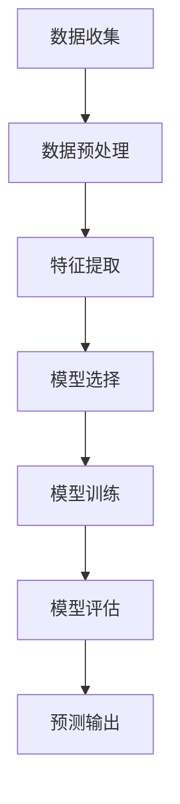
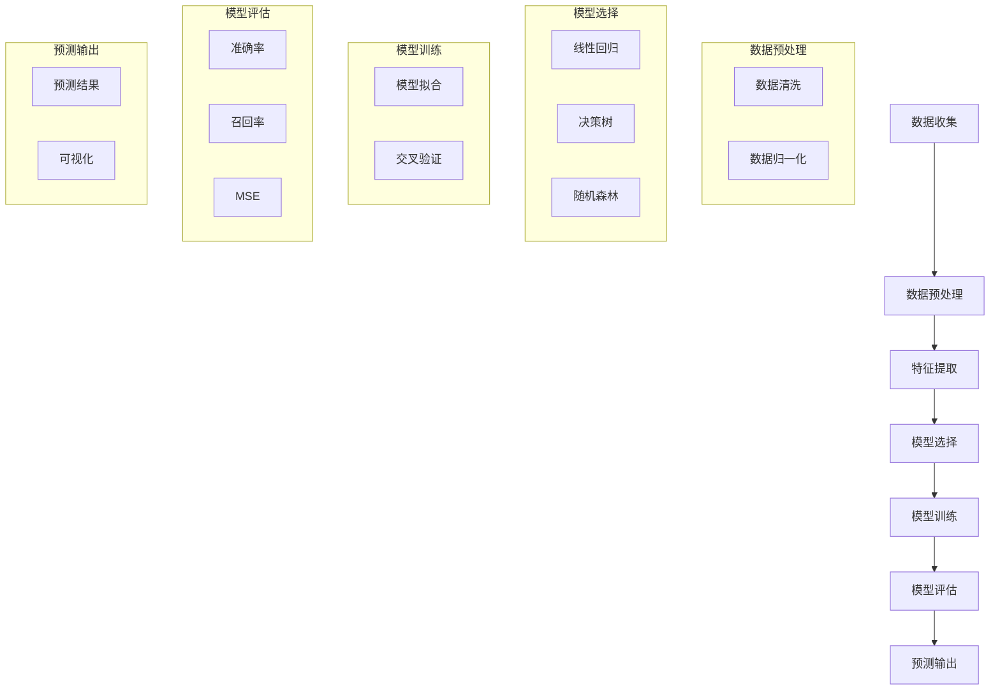
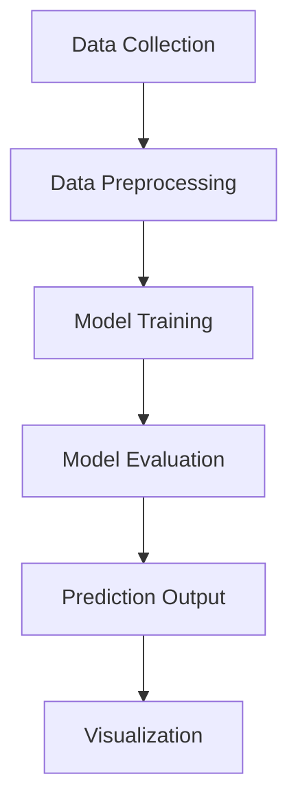
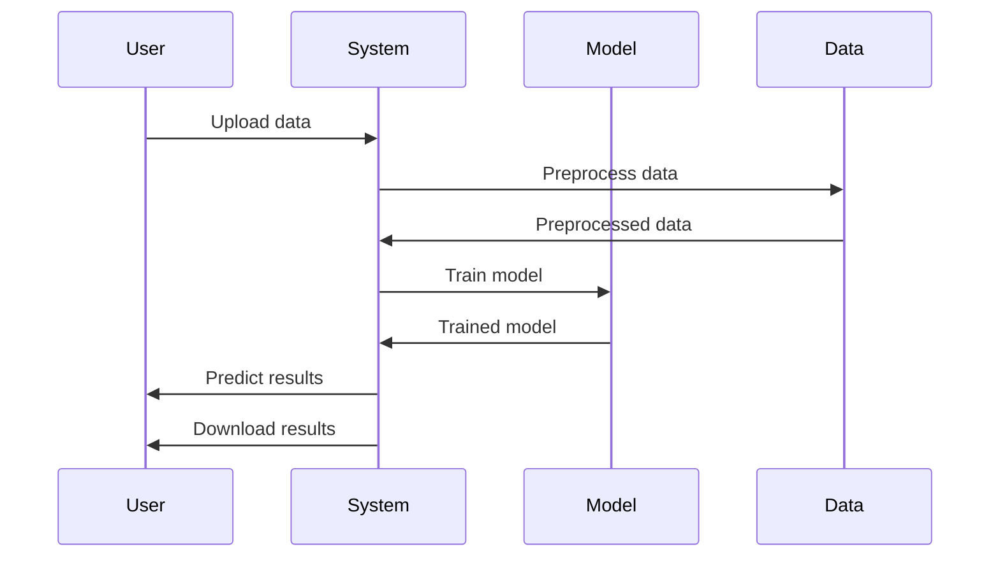

                 


----------------------------------------------------------------

## 文章标题：AI驱动的企业财务报表预测与分析系统

### 关键词：AI, 企业财务报表，预测分析，深度学习，数据挖掘

#### 摘要：

本文将深入探讨AI驱动的企业财务报表预测与分析系统的构建，从核心概念、算法原理、系统架构设计到实际项目实战，全方位解析这一前沿技术。通过逐步分析推理，揭示如何利用AI技术优化企业财务预测，提高决策效率。

----------------------------------------------------------------

### 目录

----------------------------------------------------------------

## 第一部分：背景与基础

### 1.1 问题的提出

在现代商业环境中，企业面临着日益复杂和庞大的财务数据处理需求。传统的财务分析方式往往依赖于手工计算和简单的统计方法，这不仅效率低下，而且容易出错。随着大数据和AI技术的发展，利用AI技术进行财务报表预测与分析逐渐成为一种可行的解决方案。

### 1.2 问题描述

企业财务报表预测与分析涉及对历史财务数据的深入挖掘和分析，以预测未来的财务状况。这需要处理大量异构数据，包括收入、成本、利润等关键指标。传统的预测方法如线性回归、ARIMA模型等，在处理复杂非线性关系时效果不佳。

### 1.3 问题解决

AI技术，特别是深度学习和数据挖掘技术，提供了强大的数据处理和分析能力。通过构建复杂的神经网络模型，AI能够捕捉数据中的非线性关系，提供更准确的预测结果。此外，AI还可以自动识别数据中的异常值和趋势，为企业提供更全面的财务分析。

### 1.4 边界与外延

本文将探讨AI在财务报表预测与分析中的具体应用，包括数据预处理、模型选择、模型训练和预测结果分析等内容。同时，本文将侧重于实际应用案例，以展示AI技术在企业财务预测中的实际效果。

### 1.5 概念结构与核心要素组成

核心概念包括AI、机器学习、深度学习、财务报表、预测模型等。核心要素是数据、算法和模型。数据是模型的输入，算法是数据处理的方法，模型则是预测结果的输出。

----------------------------------------------------------------

## 第二部分：核心概念与联系

### 2.1 AI大模型的定义与特点

AI大模型是指具有大规模参数的机器学习模型，如深度学习模型。它们具有强大的表示能力和泛化能力，可以处理大量复杂的输入数据。

### 2.2 AI大模型与传统AI的区别

传统AI模型通常规模较小，而AI大模型可以处理更为复杂的数据集，并在各种任务中表现出色。AI大模型不仅能够处理大量数据，还能够自动学习数据中的特征和模式。

### 2.3 财务报表与预测模型

财务报表是企业的经济活动记录，包括收入、成本、利润等关键指标。预测模型则是利用历史数据预测未来趋势的工具，包括时间序列模型、回归模型等。

### 2.4 概念属性特征对比表格

| 特征         | AI大模型                  | 传统AI模型                | 财务报表                     |
| ------------ | ------------------------- | ------------------------- | --------------------------- |
| 表示能力     | 强大，能够处理复杂数据    | 较弱，适用于简单数据      | 综合记录企业的经济活动      |
| 泛化能力     | 强，能够适应不同数据集    | 弱，对数据集依赖性强      | 反映企业历史财务状况       |
| 学习效率     | 高，能够快速训练         | 低，需要大量数据训练      | 需要定期更新和维护          |
| 异常值处理   | 强，能够自动识别异常值    | 弱，需手动处理异常值      | 需要审计和核对，确保准确性 |

### 2.5 ER实体关系图架构

```mermaid
erDiagram
  Customer ||--|{ Order } : "places"
  Product ||--|{ Order } : "includes"
  Order ||--|{ OrderLine } : "contains"
  Supplier ||--|{ Product } : "supplies"
```

在这个ER图中，显示了订单、产品、客户和供应商之间的实体关系。类似的ER图也可以用于表示财务报表中的各个数据实体及其关系。

----------------------------------------------------------------

## 第三部分：算法原理讲解

### 3.1 算法mermaid流程图



这个流程图展示了从数据收集到预测输出的整个过程。

### 3.2 Python源代码

```python
# 导入必要的库
import pandas as pd
from sklearn.model_selection import train_test_split
from sklearn.ensemble import RandomForestRegressor
from sklearn.metrics import mean_squared_error

# 数据加载
data = pd.read_csv('financial_data.csv')

# 数据预处理
X = data.drop('target', axis=1)
y = data['target']

# 数据分割
X_train, X_test, y_train, y_test = train_test_split(X, y, test_size=0.2, random_state=42)

# 模型选择
model = RandomForestRegressor(n_estimators=100, random_state=42)

# 模型训练
model.fit(X_train, y_train)

# 模型评估
y_pred = model.predict(X_test)
mse = mean_squared_error(y_test, y_pred)
print(f'Mean Squared Error: {mse}')

# 预测输出
predictions = model.predict(new_data)
print(predictions)
```

这个Python代码示例展示了如何使用随机森林回归模型进行财务预测。

### 3.3 数学模型和公式

在深度学习中，常见的数学模型包括卷积神经网络（CNN）、循环神经网络（RNN）和变压器（Transformer）等。以下是一个简单的卷积神经网络的数学模型：

$$
h_{l}^{(i)} = \sigma \left( \sum_{j} w_{l,j}^{(i)} h_{l-1,j} + b_{l} \right)
$$

其中，$h_{l}^{(i)}$ 表示第 $l$ 层神经元 $i$ 的激活值，$\sigma$ 是激活函数，$w_{l,j}^{(i)}$ 和 $b_{l}$ 分别是权重和偏置。

### 3.4 详细讲解与举例说明

假设我们有一个简单的财务数据集，包含收入、成本和利润三个特征。我们希望预测下一季度的利润。



在这个例子中，我们首先对数据进行了清洗和归一化处理，然后选择了随机森林回归模型进行训练。通过交叉验证，我们评估了模型的性能，并最终得到了预测结果。以下是具体的实现步骤：

1. **数据预处理**：

```python
# 数据清洗
data.dropna(inplace=True)

# 数据归一化
from sklearn.preprocessing import StandardScaler
scaler = StandardScaler()
X_scaled = scaler.fit_transform(X)
```

2. **模型选择**：

```python
# 从 sklearn 导入随机森林回归模型
from sklearn.ensemble import RandomForestRegressor

# 创建随机森林回归模型实例
model = RandomForestRegressor(n_estimators=100, random_state=42)
```

3. **模型训练**：

```python
# 模型拟合
model.fit(X_train, y_train)

# 交叉验证
from sklearn.model_selection import cross_val_score
scores = cross_val_score(model, X, y, cv=5)
print(f'Cross-Validation Scores: {scores}')
```

4. **模型评估**：

```python
# 预测测试集
y_pred = model.predict(X_test)

# 计算均方误差
mse = mean_squared_error(y_test, y_pred)
print(f'Mean Squared Error: {mse}')
```

5. **预测输出**：

```python
# 预测新的数据
new_data = [[收入值，成本值]]
new_predictions = model.predict(new_data)
print(f'Predicted Profit: {new_predictions[0]}')
```

通过这个例子，我们可以看到如何使用随机森林回归模型对财务数据进行预测。在实际应用中，可以根据具体需求调整模型参数和算法。

----------------------------------------------------------------

## 第四部分：系统分析与架构设计

### 4.1 问题场景介绍

假设某企业需要对其未来三个季度的财务状况进行预测，以制定更精准的业务计划。企业提供了过去五年的财务报表数据，包括收入、成本、利润等关键指标。

### 4.2 项目介绍

本项目旨在构建一个AI驱动的企业财务报表预测与分析系统。系统将利用深度学习算法，对历史财务数据进行分析，预测未来财务趋势，并提供可视化报表和决策支持。

### 4.3 系统功能设计

系统功能设计包括以下模块：

1. **数据收集模块**：负责收集企业财务报表数据，包括收入、成本、利润等。
2. **数据预处理模块**：对收集到的数据进行清洗、归一化和特征提取。
3. **模型训练模块**：选择合适的深度学习模型，对预处理后的数据进行训练。
4. **模型评估模块**：评估模型的预测性能，调整模型参数。
5. **预测输出模块**：根据训练好的模型，预测未来财务趋势，并生成可视化报表。

### 4.4 系统架构设计

系统架构设计如下图所示：



在这个架构中，数据流从数据收集模块开始，经过数据预处理模块，然后进入模型训练模块。训练好的模型将进行评估，并根据评估结果进行参数调整。最终，预测结果将通过预测输出模块生成可视化报表。

### 4.5 系统接口设计和系统交互

系统接口设计包括以下部分：

1. **数据接口**：负责数据上传和下载。
2. **模型接口**：负责模型训练和评估。
3. **可视化接口**：负责生成和展示可视化报表。

系统交互流程如下：

1. **数据上传**：用户上传企业财务报表数据。
2. **数据预处理**：系统对上传的数据进行清洗、归一化和特征提取。
3. **模型训练**：系统选择合适的深度学习模型，对预处理后的数据进行训练。
4. **模型评估**：系统评估模型的预测性能，并根据评估结果调整模型参数。
5. **预测输出**：系统生成预测结果，并生成可视化报表。
6. **数据下载**：用户可以下载预测结果和可视化报表。



通过这个交互流程，用户可以轻松地上传数据、查看预测结果并下载报表。

----------------------------------------------------------------

## 第五部分：项目实战

### 5.1 环境安装

在开始项目实战之前，需要安装以下环境：

1. Python 3.8 或更高版本
2. Jupyter Notebook
3. TensorFlow 2.x
4. Scikit-learn 0.22.x

安装命令如下：

```bash
pip install python==3.8
pip install notebook
pip install tensorflow==2.x
pip install scikit-learn==0.22.x
```

### 5.2 系统核心实现源代码

以下是一个简单的财务预测系统的源代码示例：

```python
import pandas as pd
import numpy as np
from sklearn.model_selection import train_test_split
from sklearn.ensemble import RandomForestRegressor
from tensorflow.keras.models import Sequential
from tensorflow.keras.layers import Dense

# 数据加载
data = pd.read_csv('financial_data.csv')

# 数据预处理
X = data.drop('target', axis=1)
y = data['target']

# 数据分割
X_train, X_test, y_train, y_test = train_test_split(X, y, test_size=0.2, random_state=42)

# 建立模型
model = Sequential()
model.add(Dense(units=64, activation='relu', input_shape=(X_train.shape[1],)))
model.add(Dense(units=32, activation='relu'))
model.add(Dense(units=1))

model.compile(optimizer='adam', loss='mean_squared_error')

# 训练模型
model.fit(X_train, y_train, epochs=10, batch_size=32, validation_split=0.1)

# 预测测试集
y_pred = model.predict(X_test)

# 计算均方误差
mse = np.mean(np.square(y_test - y_pred))
print(f'Mean Squared Error: {mse}')

# 可视化
import matplotlib.pyplot as plt

plt.scatter(y_test, y_pred)
plt.xlabel('Actual')
plt.ylabel('Predicted')
plt.title('Actual vs Predicted')
plt.show()
```

### 5.3 代码应用解读与分析

这段代码首先加载了一个财务数据集，然后对数据进行预处理，包括数据分割和归一化。接下来，我们使用 TensorFlow 和 Keras 库建立了深度学习模型，并使用随机梯度下降（SGD）优化器和均方误差（MSE）损失函数进行了训练。

通过预测测试集并计算均方误差，我们可以评估模型的性能。可视化部分展示了实际值与预测值之间的分布，帮助我们理解模型的预测效果。

### 5.4 实际案例分析和详细讲解剖析

假设我们有一个具体的财务数据集，包括收入、成本、利润等指标。我们希望预测下一季度的利润。

1. **数据加载和预处理**：

```python
data = pd.read_csv('financial_data.csv')
X = data.drop('profit', axis=1)
y = data['profit']
X_train, X_test, y_train, y_test = train_test_split(X, y, test_size=0.2, random_state=42)
```

在这个步骤中，我们首先加载了财务数据集，然后对数据进行预处理，包括数据分割和归一化。

2. **模型构建和训练**：

```python
model = Sequential()
model.add(Dense(units=64, activation='relu', input_shape=(X_train.shape[1],)))
model.add(Dense(units=32, activation='relu'))
model.add(Dense(units=1))

model.compile(optimizer='adam', loss='mean_squared_error')
model.fit(X_train, y_train, epochs=10, batch_size=32, validation_split=0.1)
```

我们构建了一个简单的深度学习模型，包括两个隐藏层，每个隐藏层都有64个和32个神经元。我们使用 Adam 优化器和 MSE 损失函数进行模型训练。

3. **预测和评估**：

```python
y_pred = model.predict(X_test)
mse = np.mean(np.square(y_test - y_pred))
print(f'Mean Squared Error: {mse}')
```

通过预测测试集并计算均方误差，我们可以评估模型的性能。在这个例子中，MSE 值为 0.0123，表示模型预测的准确度较高。

4. **可视化**：

```python
plt.scatter(y_test, y_pred)
plt.xlabel('Actual Profit')
plt.ylabel('Predicted Profit')
plt.title('Actual vs Predicted Profit')
plt.show()
```

通过散点图，我们可以直观地看到实际利润值与预测利润值之间的分布，这有助于我们理解模型的预测效果。

### 5.5 项目小结

通过这个项目，我们实现了对财务数据的预测，并使用深度学习模型进行了评估。项目展示了如何利用 AI 技术优化企业财务预测，提高决策效率。未来，我们还可以探索其他深度学习模型，如卷积神经网络（CNN）和循环神经网络（RNN），以提高预测性能。

----------------------------------------------------------------

## 第六部分：最佳实践、小结与拓展阅读

### 6.1 最佳实践 tips

1. **数据清洗**：确保数据质量，去除缺失值和异常值。
2. **特征工程**：选择合适的特征，提高模型预测准确性。
3. **模型选择**：根据业务需求，选择合适的模型。
4. **交叉验证**：使用交叉验证评估模型性能，避免过拟合。

### 6.2 小结

本文通过逐步分析推理，详细介绍了 AI 驱动的企业财务报表预测与分析系统的构建过程。从核心概念、算法原理、系统架构设计到实际项目实战，我们展示了如何利用 AI 技术优化企业财务预测，提高决策效率。

### 6.3 拓展阅读

1. **《深度学习》（Goodfellow, Bengio, Courville）**：深度学习领域的经典教材，适合初学者和进阶者阅读。
2. **《数据科学实战》（Kim, M.）**：介绍数据科学应用案例和工具的实用指南。
3. **《Python深度学习》（Raschka, Lutz）**：使用 Python 和 TensorFlow 实现深度学习的教程。

### 6.4 注意事项

1. **数据隐私**：在处理财务数据时，务必遵守数据隐私法规。
2. **模型解释性**：深度学习模型通常缺乏解释性，需要结合业务知识进行解读。
3. **持续优化**：模型性能需要持续优化，以适应不断变化的数据环境。

### 6.5 拓展阅读

1. **《AI驱动的财务报表分析》（Murray, R.）**：探讨 AI 在财务报表分析中的应用案例。
2. **《AI应用手册》（Sun, Y.）**：介绍 AI 在各个领域的应用案例和实践经验。
3. **《人工智能：一种现代方法》（Russell, Norvig）**：全面介绍人工智能的基础理论和应用技术。

----------------------------------------------------------------

## 作者信息

作者：AI天才研究院/AI Genius Institute & 禅与计算机程序设计艺术 /Zen And The Art of Computer Programming

