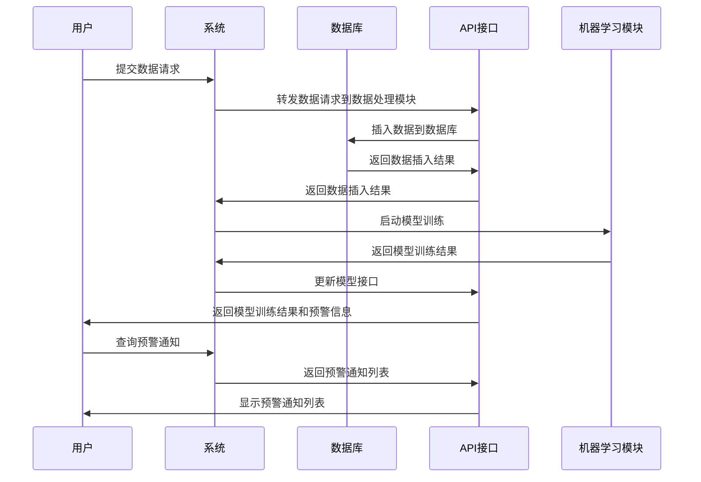

                 

### 引言

在当今全球化的商业环境中，企业财务舞弊问题已成为一个日益严重的问题。据统计，每年因财务舞弊造成的经济损失高达数百亿美元，这不仅对受害企业造成巨大的财务损失，还对整个金融市场和经济稳定产生负面影响。传统的财务舞弊检测方法主要依赖于规则和经验，往往难以应对复杂多变的舞弊手段，导致检测效果不佳。随着人工智能（AI）技术的快速发展，利用AI驱动的企业财务舞弊检测系统成为了一种新的解决方案。

本文旨在探讨AI驱动的企业财务舞弊检测系统的设计与实现。我们将从以下几个方面进行讨论：

1. **问题背景**：介绍企业财务舞弊问题的现状及影响，以及为何需要AI驱动的解决方案。
2. **AI驱动的企业财务舞弊检测概述**：解释AI在财务舞弊检测中的优势，并概述检测的基本流程。
3. **核心概念**：阐述与AI和财务舞弊检测相关的基础概念，包括机器学习、数据预处理和特征工程等。
4. **系统架构**：详细描述AI驱动的财务舞弊检测系统的架构设计，包括数据流和关键组件。
5. **实现与案例分析**：介绍系统的实际实现过程，并通过具体案例展示其应用效果。
6. **优化与未来趋势**：讨论如何优化财务舞弊检测系统的性能，并探讨未来的研究方向。

通过以上步骤，我们将逐步深入探讨AI驱动的企业财务舞弊检测系统的设计与实现，为读者提供全面的技术见解和实践指导。

### 文章关键词

AI驱动的财务舞弊检测、企业财务安全、机器学习、数据预处理、特征工程、系统架构设计、案例分析、性能优化、未来趋势。

### 文章摘要

本文深入探讨了AI驱动的企业财务舞弊检测系统的设计与实现。首先，介绍了企业财务舞弊问题的背景及其对经济的影响，然后阐述了AI驱动的财务舞弊检测的优势。接着，通过阐述核心概念和系统架构，详细描述了AI在财务舞弊检测中的应用。随后，通过实际案例展示了系统的实现和应用效果。最后，讨论了系统的优化方法和未来的研究方向，为AI驱动的财务舞弊检测提供了全面的技术见解和实践指导。

### 第一部分: 引言

#### 1.1 问题背景

企业财务舞弊问题在当今的商业环境中日益严重。财务舞弊是指企业为了达到非法或不当目的，通过虚构交易、篡改财务报表等手段进行欺诈的行为。这种行为不仅会造成直接的财务损失，还会严重损害企业的声誉，甚至引发金融市场的动荡。

据统计，全球每年因财务舞弊造成的经济损失高达数百亿美元。例如，安然事件和世通事件都是由于财务舞弊而导致的重大金融丑闻，这些事件不仅使公司破产，还引发了投资者信心的丧失，对整个金融市场造成了深远的影响。

传统的财务舞弊检测方法主要依赖于规则和经验。例如，通过审查会计记录、财务报表和审计报告等手段来识别潜在的舞弊行为。这种方法在一定程度上能够发现简单的舞弊行为，但对于复杂、隐蔽的舞弊手段却难以奏效。此外，随着商业活动的复杂化和数据量的急剧增长，传统方法在处理大规模数据时效率低下，难以满足现代企业的需求。

因此，传统的财务舞弊检测方法存在明显的局限性。首先，它们往往依赖于人工分析，容易出现漏检和误报。其次，这些方法缺乏灵活性，难以应对不断变化的新型舞弊手段。最后，传统方法在处理大数据时效率低下，无法及时检测并防范舞弊行为。

面对这些挑战，利用AI技术进行财务舞弊检测成为一种新的解决方案。AI驱动的财务舞弊检测系统通过机器学习、数据挖掘和自然语言处理等技术，能够自动识别和检测复杂的财务舞弊行为。这种方法不仅能够提高检测的准确性和效率，还能够应对不断变化的新型舞弊手段。此外，AI驱动的系统还能够处理大规模数据，提供实时监控和预警功能，从而更好地保护企业的财务安全。

本文将围绕AI驱动的企业财务舞弊检测系统展开讨论，详细介绍其设计原理、实现过程和应用效果。首先，我们将介绍AI驱动的财务舞弊检测的基本流程，包括数据采集、预处理、特征提取和模型训练等步骤。接着，我们将深入探讨AI在财务舞弊检测中的应用，包括关键技术和方法。随后，我们将详细描述AI驱动的财务舞弊检测系统的架构设计，包括数据流、关键组件和接口。最后，通过具体案例分析，我们将展示AI驱动的财务舞弊检测系统的实际应用效果，并讨论系统的优化方法和未来研究方向。

#### 1.2 AI驱动的企业财务舞弊检测概述

AI驱动的企业财务舞弊检测系统通过利用人工智能技术，自动识别和防范财务舞弊行为，相较于传统方法具有显著的优势。首先，AI系统可以处理和分析海量数据，通过机器学习算法和模式识别技术，从大量历史数据中提取有用的信息，发现潜在的风险点和异常行为。这种能力使得AI系统能够更全面地监控企业的财务状况，提高舞弊检测的准确性和覆盖率。

其次，AI系统具有较高的灵活性和适应性。通过不断学习和优化，AI系统能够应对不断变化的新型舞弊手段，及时调整检测策略，从而保持对新型舞弊行为的敏锐反应。此外，AI系统可以通过实时监控和预警功能，快速识别并报告异常行为，为企业提供及时的应对措施。

AI驱动的财务舞弊检测系统的工作流程主要包括以下几个关键步骤：

1. **数据采集**：系统首先需要收集与企业财务相关的数据，包括会计记录、财务报表、交易记录等。这些数据可以来自企业内部的数据库，也可以通过外部数据源获取，如金融监管机构的公开数据、市场行情数据等。

2. **数据预处理**：收集到的原始数据通常包含噪声、缺失值和异常值，需要进行预处理以清洗和规范化。预处理步骤包括数据去重、缺失值填补、数据转换和标准化等。通过这些步骤，系统能够提高数据的准确性和一致性，为后续分析奠定基础。

3. **特征提取**：在预处理后的数据中，系统需要提取与财务舞弊相关的特征。特征提取是机器学习模型训练的重要环节，通过选择和构造合适的特征，系统能够更好地识别潜在的舞弊行为。特征可以是定量数据（如交易金额、交易频率等），也可以是定性数据（如交易对手、交易时间等）。

4. **模型训练**：系统使用机器学习算法对提取的特征进行训练，构建用于舞弊检测的模型。常用的机器学习算法包括决策树、随机森林、支持向量机、神经网络等。通过训练，模型能够学习到财务舞弊的特征模式，并在新的数据中识别潜在的舞弊行为。

5. **模型评估和优化**：训练完成的模型需要通过测试集进行评估，以确定其检测性能。评估指标包括准确率、召回率、精确率等。根据评估结果，系统可以对模型进行调整和优化，以提高检测的准确性和效率。

6. **实时监控和预警**：经过训练和优化的模型可以部署到生产环境中，对实时数据进行监控和分析，及时发现潜在的舞弊行为。当检测到异常行为时，系统会发出预警信号，并提供相应的应对措施，如暂停交易、启动内部审计等。

AI驱动的财务舞弊检测系统不仅能够提高舞弊检测的准确性和效率，还能够提供实时监控和预警功能，为企业提供全方位的财务安全保护。通过不断优化和升级，AI系统将成为企业防范财务舞弊的重要工具，推动企业财务管理走向智能化和自动化。

### 第一部分: 引言

#### 1.2 AI驱动的企业财务舞弊检测概述（续）

除了上述提到的数据采集、预处理、特征提取、模型训练、模型评估和实时监控等基本步骤，AI驱动的财务舞弊检测系统还包含了一些关键技术和方法，这些技术共同构成了系统高效运作的基础。

**1. 数据挖掘技术**

数据挖掘是AI驱动的财务舞弊检测系统的重要组成部分。通过数据挖掘技术，系统可以从海量历史数据中自动识别潜在的异常模式和关系。常见的数据挖掘技术包括聚类分析、关联规则挖掘、分类和回归分析等。例如，聚类分析可以帮助系统发现具有相似交易特征的账户或交易，从而识别潜在的舞弊团伙；关联规则挖掘可以揭示不同交易之间的关联性，帮助系统发现复杂的舞弊网络。

**2. 机器学习算法**

机器学习算法在财务舞弊检测中扮演着核心角色。通过机器学习算法，系统能够从历史数据中学习并构建预测模型，用于检测新的数据中的潜在舞弊行为。常见的机器学习算法包括：

- **监督学习算法**：如线性回归、决策树、支持向量机（SVM）、随机森林等。这些算法需要使用标注数据（即已知舞弊与否的数据）进行训练，通过学习这些数据的特征模式，算法能够在新的数据中预测舞弊行为。

- **无监督学习算法**：如聚类算法（如K-Means）、主成分分析（PCA）等。无监督学习算法不需要标注数据，通过分析数据的内在结构，可以识别出潜在的异常模式。这些算法在处理未标记的数据时非常有用，可以帮助系统发现未知的舞弊模式。

**3. 自然语言处理（NLP）技术**

财务舞弊检测中不仅涉及到结构化数据，还涉及到大量的非结构化数据，如财务报表、邮件、报告等。自然语言处理技术可以帮助系统对这些非结构化数据进行处理和分析，提取其中的关键信息。NLP技术包括文本分类、情感分析、命名实体识别等。例如，通过文本分类技术，系统可以自动分类财务报表中的关键字段，识别潜在的舞弊信息；通过情感分析技术，系统可以分析财务报告中的语气和情绪，发现潜在的风险信号。

**4. 异常检测技术**

异常检测是财务舞弊检测中的一个重要环节。异常检测技术用于识别数据中的异常值或异常模式，这些异常值或模式可能是舞弊行为的表现。常见的异常检测技术包括基于统计的方法、基于聚类的方法、基于规则的方法等。例如，基于统计的方法可以通过分析数据的分布特征，识别出偏离正常范围的异常值；基于聚类的方法可以通过聚类分析识别出异常的簇，这些簇可能包含潜在的舞弊行为。

**5. 实时监控与预警**

实时监控与预警是AI驱动的财务舞弊检测系统的重要功能。通过实时监控，系统可以持续分析企业的财务数据，及时发现潜在的舞弊行为。当检测到异常行为时，系统会立即发出预警信号，并提供相应的处理建议。预警系统通常包括以下几部分：

- **预警规则库**：系统根据历史数据和检测算法，建立一系列预警规则。这些规则用于识别和分类潜在的舞弊行为。

- **预警触发机制**：当系统检测到异常行为时，预警触发机制会自动激活，并向相关人员发出预警信号。

- **响应机制**：系统提供相应的应对措施，如暂停交易、启动审计流程、通知相关监管机构等。

通过以上关键技术和方法，AI驱动的财务舞弊检测系统能够高效、准确地识别和防范各种类型的财务舞弊行为，为企业提供全面的财务安全保护。

### 第一部分: 引言

#### 1.3 研究范围和限制

本文的研究范围主要集中在AI驱动的企业财务舞弊检测系统的设计、实现和应用。具体来说，本文将探讨以下关键内容：

1. **系统设计**：研究AI驱动的财务舞弊检测系统的整体架构，包括数据流、关键组件和接口设计。
2. **算法实现**：分析常用的机器学习算法和数据处理技术在财务舞弊检测中的应用，并详细讲解其实现原理。
3. **实际案例**：通过具体案例分析，展示AI驱动的财务舞弊检测系统在实际应用中的效果和挑战。
4. **优化方法**：讨论如何通过模型优化、算法改进和系统扩展，提高检测系统的性能和可靠性。
5. **未来趋势**：探讨AI驱动的财务舞弊检测系统的未来发展方向和潜在的研究课题。

尽管本文涵盖了AI驱动的财务舞弊检测系统的核心内容，但仍存在一些限制和不足：

1. **数据限制**：由于实际数据的获取和处理存在困难，本文所使用的案例数据可能无法完全代表现实情况，这可能会影响系统的实际表现。
2. **算法优化**：虽然本文介绍了多种机器学习算法，但每种算法的具体实现和优化仍需在实际应用中进行调整和验证。
3. **系统部署**：实际部署AI驱动的财务舞弊检测系统需要考虑系统的可扩展性、安全性、可维护性等多个方面，这些内容本文未能详尽探讨。
4. **法律法规**：AI驱动的财务舞弊检测系统在实际应用中需要遵守相关法律法规，如隐私保护、数据安全等，这些限制本文也未涉及。

综上所述，本文的研究旨在为AI驱动的财务舞弊检测系统提供理论支持和实践指导，但仍需在实际应用中进一步验证和完善。

### 第二部分: 基础概念

#### 2.1 人工智能基础

人工智能（Artificial Intelligence，AI）是计算机科学的一个分支，旨在通过模拟人类智能行为来实现自动化决策和任务执行。AI技术的发展经历了数个阶段，从早期的规则系统、知识表示，到现代的机器学习和深度学习，AI技术已经取得了显著的进步。

**1. 人工智能概述**

人工智能的核心目标是让计算机具备人类智能的能力，包括感知、推理、学习、决策和问题解决等。AI技术可以分为两类：基于规则的系统和基于数据的方法。基于规则的系统通过预先定义的规则进行决策，如专家系统和逻辑推理。而基于数据的方法，尤其是机器学习和深度学习，通过从大量数据中学习模式来实现智能化。

**2. 机器学习基础**

机器学习是人工智能的重要分支，通过算法从数据中学习模式并作出预测或决策。机器学习可以分为监督学习、无监督学习和强化学习：

- **监督学习**：在有标注数据的情况下，学习输入和输出之间的关系。常见的算法包括线性回归、决策树、支持向量机和神经网络等。
- **无监督学习**：在没有标注数据的情况下，自动发现数据中的模式和结构。常用的算法包括聚类分析和降维技术，如K-Means和主成分分析（PCA）。
- **强化学习**：通过与环境交互，学习最优策略以最大化累积奖励。常见的算法包括Q-Learning和深度强化学习。

**3. 深度学习基本原理**

深度学习是机器学习的一个子领域，通过多层神经网络模型来模拟人类大脑的神经元连接方式。深度学习的关键在于多层神经网络，每一层都通过前一层的信息进行处理和变换，最终生成输出。深度学习在图像识别、语音识别和自然语言处理等领域取得了显著的成果。

**4. 神经网络**

神经网络由大量相互连接的节点（或神经元）组成，每个节点执行简单的计算并传递信息。神经网络的工作原理是通过前向传播和反向传播来训练模型：

- **前向传播**：输入数据通过网络的每个层，逐层计算并传递输出。
- **反向传播**：计算输出与真实值之间的误差，并反向传播误差，更新每个神经元的权重。

**5. 深度学习框架**

深度学习框架如TensorFlow和PyTorch等提供了高效、灵活的工具和库，使得深度学习模型的设计和训练变得更加容易。这些框架支持自定义网络结构、自动化优化和分布式训练，大大提高了模型开发和部署的效率。

通过理解人工智能的基础知识，我们可以更好地把握AI驱动的企业财务舞弊检测系统的原理和实现方法。下一节将深入探讨财务舞弊检测的相关概念和技术。

### 第二部分: 基础概念

#### 2.2 财务舞弊检测

财务舞弊检测是指通过多种方法和技术来识别和防范企业财务舞弊行为的过程。财务舞弊行为不仅对企业的财务健康造成严重影响，还可能引发法律诉讼、市场信心丧失等一系列问题。因此，建立有效的财务舞弊检测系统对于企业来说至关重要。

**1. 财务舞弊的定义与类型**

财务舞弊是指企业为了达到非法或不当目的，通过虚构交易、篡改财务报表等手段进行欺诈的行为。根据舞弊的性质和手段，财务舞弊可以分为以下几种类型：

- **操纵财务报表**：通过虚假交易或操纵会计政策，篡改财务报表数据，以误导投资者和利益相关方。
- **侵占公司资产**：员工利用职务之便，侵占公司资产，如盗窃现金、虚报费用等。
- **关联方交易**：通过关联方之间的交易，转移公司资源，损害公司利益。
- **洗钱**：利用财务手段将非法所得洗白，掩盖资金来源。

**2. 舞弊检测方法**

传统的舞弊检测方法主要包括以下几种：

- **会计分析方法**：通过对财务报表的分析，识别异常的财务指标，如异常的盈利能力、现金流状况等。
- **审计方法**：通过审计师对企业财务记录的审查，发现潜在的问题和舞弊行为。
- **调查方法**：对涉嫌舞弊的行为进行深入调查，收集证据，证明舞弊的存在。

随着技术的发展，计算机技术和数据分析方法被广泛应用于财务舞弊检测。其中，机器学习和数据挖掘技术成为现代舞弊检测的重要工具。这些方法通过分析大量历史数据，自动识别潜在的异常模式和关系，提高检测的准确性和效率。

**3. 数据分析在财务舞弊检测中的应用**

数据分析是财务舞弊检测的关键环节，包括数据采集、预处理、特征提取和模型训练等步骤：

- **数据采集**：收集与企业财务相关的数据，包括财务报表、交易记录、员工行为数据等。
- **数据预处理**：清洗和规范化数据，包括数据去重、缺失值填补、数据转换和标准化等。
- **特征提取**：从原始数据中提取与财务舞弊相关的特征，如交易金额、交易频率、员工行为等。
- **模型训练**：使用机器学习算法训练模型，识别潜在的舞弊行为。

常用的机器学习算法包括线性回归、决策树、随机森林、支持向量机、神经网络等。通过这些算法，系统可以从历史数据中学习并建立预测模型，用于检测新的数据中的潜在舞弊行为。

**4. AI在财务舞弊检测中的优势**

与传统的检测方法相比，AI驱动的财务舞弊检测系统具有以下优势：

- **高效性**：AI系统可以处理和分析海量数据，快速识别潜在的舞弊行为，提高检测的效率。
- **准确性**：AI系统通过学习历史数据中的特征模式，能够更准确地识别复杂的舞弊行为。
- **实时性**：AI系统可以实时监控企业的财务状况，及时发现并报告异常行为，提供及时的应对措施。
- **适应性**：AI系统具有自我学习和优化的能力，能够应对不断变化的新型舞弊手段。

通过以上方法和技术，AI驱动的财务舞弊检测系统为企业的财务安全提供了强有力的保障，有助于预防潜在的财务风险，保护企业的财务健康和利益。

### 第二部分: 基础概念

#### 2.3 AI在财务舞弊检测中的实践

在实际应用中，AI在财务舞弊检测中的实践涵盖了多个方面，包括数据预处理、特征提取和模型训练等关键步骤。以下是AI在财务舞弊检测中的详细实践方法：

**1. 数据预处理**

数据预处理是AI驱动的财务舞弊检测系统的第一步，其目的是清洗和规范化数据，以提高数据质量和模型的训练效果。数据预处理通常包括以下步骤：

- **数据采集**：从企业内部数据库、外部数据源（如金融市场数据、公共记录等）获取与财务相关的数据。
- **数据清洗**：处理数据中的噪声、异常值和缺失值。例如，使用均值填补缺失值、删除重复数据、去除异常值等。
- **数据转换**：将数据转换为适合模型训练的格式。例如，将日期和时间数据转换为数值，将分类数据转换为独热编码等。
- **数据标准化**：将不同特征的数据进行归一化或标准化处理，使其在数值范围上具有一致性，以避免某些特征对模型训练的影响。

**2. 特征提取**

特征提取是AI驱动财务舞弊检测的核心环节，其目的是从原始数据中提取与财务舞弊相关的特征，以提高模型检测的准确性和鲁棒性。特征提取的方法包括：

- **统计特征**：如交易金额、交易频率、交易金额的变异系数等。这些特征可以反映交易行为的一些基本统计特性，如异常高的交易频率或金额可能表明存在舞弊行为。
- **文本特征**：对于文本数据，如财务报告、邮件、公告等，可以使用自然语言处理（NLP）技术提取特征。例如，通过词频、词向量、主题模型等方法，可以提取出文本中的关键信息和情感倾向。
- **时序特征**：对于时间序列数据，如股票价格、交易记录等，可以使用时序分析方法提取特征。例如，通过自相关、差分、ARIMA模型等方法，可以提取出时间序列中的趋势、周期性和波动性特征。

**3. 模型训练**

在数据预处理和特征提取完成后，下一步是使用机器学习算法对提取的特征进行训练，构建用于财务舞弊检测的模型。模型训练的方法包括：

- **监督学习**：使用有标签的数据进行训练，常见的算法包括线性回归、决策树、随机森林、支持向量机（SVM）等。这些算法通过学习已知的输入和输出关系，能够在新的数据中预测潜在的风险。
- **无监督学习**：在没有标签的数据上进行训练，常见的算法包括聚类分析、主成分分析（PCA）等。这些算法通过分析数据的内在结构，可以发现数据中的异常点和聚类模式。
- **深度学习**：使用多层神经网络进行训练，常见的模型包括卷积神经网络（CNN）、循环神经网络（RNN）和生成对抗网络（GAN）等。深度学习模型通过学习大量数据中的复杂模式，能够在检测中取得更好的效果。

**4. 模型评估**

在模型训练完成后，需要对模型进行评估，以确定其检测性能。常用的评估指标包括准确率、召回率、精确率、F1分数等。评估过程通常包括以下步骤：

- **交叉验证**：通过将数据集划分为训练集和测试集，使用交叉验证方法评估模型的性能。交叉验证可以帮助避免过拟合和评估模型的泛化能力。
- **指标计算**：计算模型的准确率、召回率、精确率等指标，以评估模型的检测效果。
- **可视化分析**：通过可视化工具，如ROC曲线、混淆矩阵等，展示模型的性能和特点。

**5. 模型优化**

为了提高模型的检测性能，可以采用以下方法进行优化：

- **超参数调整**：通过调整模型参数（如学习率、隐藏层节点数等），找到最优的超参数组合，以提高模型性能。
- **正则化**：使用正则化技术（如L1、L2正则化）来避免过拟合，提高模型的泛化能力。
- **集成学习**：将多个模型集成在一起，通过投票或加权平均等方法提高整体检测性能。

通过上述数据预处理、特征提取、模型训练、模型评估和模型优化等步骤，AI驱动的财务舞弊检测系统能够高效、准确地识别和防范财务舞弊行为，为企业提供全面的财务安全保护。下一节将深入探讨财务舞弊检测系统中的关键技术——特征工程。

### 第二部分: 基础概念

#### 2.4 特征工程

特征工程是AI驱动的企业财务舞弊检测系统的关键环节，其目的是从原始数据中提取与财务舞弊相关的特征，以提高模型的检测性能和准确性。良好的特征工程不仅能够提升模型的预测能力，还能够降低模型的复杂度，提高计算效率。以下将介绍特征工程在财务舞弊检测中的应用方法。

**1. 特征提取方法**

- **统计特征**：统计特征是通过计算数据的基本统计属性来提取特征。例如，平均值、中位数、标准差、最大值、最小值、变异系数等。这些特征可以反映数据的分布特性，有助于识别异常值和异常行为。例如，交易金额的异常高值可能表明存在舞弊行为。

- **文本特征**：对于文本数据，如财务报告、公告、邮件等，可以通过自然语言处理（NLP）技术提取特征。常用的方法包括词频（TF）、词嵌入（Word2Vec、GloVe）和主题模型（LDA）。这些特征可以揭示文本内容的关键信息和语义关系。

- **时序特征**：对于时间序列数据，如股票价格、交易记录等，可以通过时序分析方法提取特征。例如，自相关函数（ACF）、差分（Differencing）、移动平均（MA）等。这些特征能够揭示时间序列的趋势、周期性和波动性。

- **交互特征**：通过组合多个特征来生成新的交互特征，可以提高模型的检测能力。例如，将交易金额和交易频率相乘，可以产生一个新的特征，用于衡量交易活跃程度。

**2. 特征选择方法**

特征选择是特征工程的重要步骤，其目的是从大量特征中选出最有用的特征，以提高模型性能并减少计算开销。常用的特征选择方法包括：

- **基于过滤的方法**：通过评估特征的整体统计属性（如方差、互信息等）来选择特征。这种方法简单高效，但可能错过一些重要的特征。

- **基于嵌入的方法**：通过嵌入学习方法（如PCA、t-SNE等）将特征映射到低维空间，选择在低维空间中表现良好的特征。这种方法能够发现特征之间的关系，但计算复杂度较高。

- **基于模型的特征选择**：在模型训练过程中，通过评估特征对模型性能的贡献来选择特征。这种方法能够充分利用模型的信息，但需要大量的训练数据。

- **递归特征消除（RFE）**：通过递归地消除对模型影响最小的特征，逐步构建最优特征集。这种方法简单直观，但可能陷入局部最优。

**3. 特征优化方法**

- **特征缩放**：将特征进行归一化或标准化处理，使其在数值范围上具有一致性，以避免某些特征对模型训练的影响。

- **特征组合**：通过组合多个特征来生成新的特征，可以提高模型的检测能力。例如，将交易金额和交易频率相乘，可以产生一个新的特征，用于衡量交易活跃程度。

- **特征转换**：将原始特征进行数学转换，以提取更多信息。例如，对交易金额进行对数转换，可以揭示交易的规模和频率。

**4. 特征评估方法**

特征评估是验证特征对模型性能贡献的过程，常用的评估方法包括：

- **交叉验证**：通过交叉验证评估特征在训练集和测试集上的表现，选择对模型性能有显著提升的特征。

- **模型性能评估**：通过评估模型在训练集和测试集上的准确率、召回率、精确率等指标，验证特征的有效性。

- **可视化分析**：通过可视化工具，如特征重要性图、特征分布图等，分析特征对模型的影响。

通过有效的特征工程，AI驱动的财务舞弊检测系统可以提取出与财务舞弊相关的关键特征，构建出高性能的检测模型，从而提高财务舞弊检测的准确性和效率。

### 第三部分: 系统架构

#### 3.1 系统架构设计

AI驱动的企业财务舞弊检测系统是一个复杂的多层架构，其设计目标是在保证高效、准确检测的同时，确保系统的可扩展性和易维护性。系统架构主要包括数据层、数据处理层、模型层和接口层。以下将详细描述每个层次的设计和功能。

**1. 数据层**

数据层是整个系统的基石，负责数据的收集、存储和管理。数据层可以分为以下模块：

- **数据源**：包括企业内部的财务数据库、交易记录、会计记录等，以及外部的金融数据、市场行情数据等。数据源可以是一个关系型数据库（如MySQL、PostgreSQL）或分布式数据存储系统（如Hadoop、Spark）。

- **数据采集**：通过API接口、Web爬虫、数据库连接等方式，从各种数据源收集所需的数据。数据采集模块需要考虑数据的质量、完整性和实时性。

- **数据存储**：使用分布式存储系统（如HDFS、Cassandra）存储和管理大规模数据。数据存储模块需要确保数据的安全性和可靠性，并提供高效的查询和访问接口。

**2. 数据处理层**

数据处理层负责对收集到的原始数据进行清洗、转换和预处理，为后续的模型训练和检测提供高质量的数据。数据处理层包括以下模块：

- **数据清洗**：处理数据中的噪声、缺失值、异常值等，通过去重、填补缺失值、去除重复记录等方法，确保数据的准确性。

- **数据转换**：将数据转换为适合模型训练的格式，包括数据标准化、归一化、独热编码等。数据转换模块需要考虑数据的一致性和规范性。

- **特征提取**：从原始数据中提取与财务舞弊相关的特征，如交易金额、交易频率、员工行为等。特征提取模块需要结合业务逻辑和数据分析结果，选择最具代表性的特征。

- **数据预处理**：对特征进行归一化、标准化等处理，为模型训练做好准备。数据预处理模块需要保证数据的完整性和一致性。

**3. 模型层**

模型层是整个系统的核心，负责训练和部署检测模型，实现财务舞弊的识别和预警。模型层包括以下模块：

- **模型训练**：使用机器学习算法（如线性回归、决策树、随机森林、神经网络等）对处理后的特征数据进行训练。模型训练模块需要考虑模型的训练时间、计算资源和性能指标。

- **模型评估**：通过交叉验证、测试集评估等方法，评估模型的性能，包括准确率、召回率、精确率等指标。模型评估模块需要确保模型在不同数据集上的表现一致。

- **模型优化**：通过调整模型参数、正则化技术等方法，优化模型的性能和泛化能力。模型优化模块需要不断调整和改进模型，以提高检测的准确性。

- **模型部署**：将训练完成的模型部署到生产环境中，实现对实时数据的监控和预警。模型部署模块需要考虑系统的可扩展性和实时性，并提供高效的接口和API。

**4. 接口层**

接口层负责系统与外部系统的交互，包括前端界面、API接口和后台服务。接口层包括以下模块：

- **前端界面**：提供用户交互的界面，展示系统的检测结果和预警信息。前端界面模块需要考虑用户体验和交互设计。

- **API接口**：提供与其他系统集成和交互的接口，如与ERP系统、财务系统等的接口。API接口模块需要确保数据传输的安全性和可靠性。

- **后台服务**：负责系统的后台逻辑处理，包括数据采集、数据处理、模型训练和部署等。后台服务模块需要确保系统的稳定性和高可用性。

通过以上四个层次的设计，AI驱动的企业财务舞弊检测系统能够实现高效、准确、实时地检测和预警财务舞弊行为，为企业提供全面的财务安全保障。

### 第三部分: 系统架构

#### 3.2 系统功能设计

AI驱动的企业财务舞弊检测系统旨在通过自动化的手段，实时监控和分析企业的财务数据，以识别和防范潜在的财务舞弊行为。为了实现这一目标，系统需要具备以下几个核心功能模块：

**1. 数据采集模块**

数据采集模块负责从多个数据源获取与企业财务相关的数据。这些数据源可能包括企业的财务数据库、ERP系统、CRM系统、交易记录数据库等，也可能涉及外部数据，如金融市场数据、公开财务报告等。数据采集模块需要确保数据的完整性、一致性和及时性。

**2. 数据预处理模块**

数据预处理模块的主要任务是对收集到的原始数据进行清洗、转换和标准化，以确保数据质量。具体步骤包括：

- **数据清洗**：去除数据中的噪声、重复记录、异常值等，保证数据的准确性和一致性。
- **数据转换**：将不同数据格式的数据进行统一转换，如将文本数据转换为结构化数据，将日期和时间数据转换为标准格式等。
- **数据标准化**：对数据进行归一化或标准化处理，使其在数值范围上具有一致性，以便后续的特征提取和模型训练。

**3. 特征提取模块**

特征提取模块负责从预处理后的数据中提取与财务舞弊相关的特征。这些特征可以是定量的，如交易金额、交易频率、员工行为等，也可以是定性的，如交易对手、交易时间等。通过特征提取，系统能够将原始数据转换为机器学习算法可处理的输入。

**4. 模型训练模块**

模型训练模块使用机器学习算法对提取的特征进行训练，以构建用于财务舞弊检测的模型。训练过程包括以下几个步骤：

- **数据划分**：将数据集划分为训练集、验证集和测试集，用于训练、验证和评估模型性能。
- **特征选择**：从提取的特征中筛选出对模型性能有显著贡献的特征。
- **模型选择**：选择合适的机器学习算法（如线性回归、决策树、随机森林、神经网络等）进行训练。
- **模型训练**：使用训练集数据进行模型训练，并通过验证集调整模型参数，优化模型性能。
- **模型评估**：使用测试集评估模型的性能，包括准确率、召回率、精确率等指标。

**5. 模型部署模块**

模型部署模块将训练完成的模型部署到生产环境中，实现对实时数据的监控和预警。部署过程包括以下几个步骤：

- **模型优化**：根据测试集的性能评估结果，对模型进行调整和优化，以提高检测准确性。
- **模型上线**：将优化后的模型部署到服务器或云计算平台上，确保其可扩展性和高可用性。
- **实时监控**：实时分析企业的财务数据，识别潜在的舞弊行为，并触发预警机制。

**6. 预警与报告模块**

预警与报告模块负责当检测到潜在的舞弊行为时，及时向相关人员发出预警信号，并提供详细的报告。具体功能包括：

- **预警规则设置**：根据业务需求和模型预测结果，设置预警规则和阈值。
- **预警通知**：通过短信、邮件、系统通知等方式，向相关人员发送预警信号。
- **预警报告**：生成详细的预警报告，包括异常交易、风险账户等详细信息，帮助企业管理层及时采取应对措施。

通过以上功能模块的协同工作，AI驱动的企业财务舞弊检测系统能够高效、准确地识别和防范财务舞弊行为，为企业提供全面的财务安全保障。

### 第三部分: 系统架构

#### 3.3 系统架构设计

AI驱动的企业财务舞弊检测系统采用分布式架构设计，以确保系统的高效性、可扩展性和高可用性。以下是系统架构的具体设计和组成部分：

**1. 系统架构概述**

系统架构分为四个主要层次：数据层、数据处理层、模型层和接口层。

- **数据层**：负责数据的采集、存储和管理，包括企业内部的财务数据库、外部数据源（如金融市场数据、公开财务报告等）。
- **数据处理层**：负责数据清洗、转换、特征提取等预处理工作，为模型层提供高质量的数据输入。
- **模型层**：负责模型的训练、优化和部署，实现财务舞弊的检测和预警。
- **接口层**：负责与外部系统的交互，包括前端用户界面、API接口等。

**2. 数据层**

数据层是系统的数据基础，包括以下几个关键组件：

- **数据源**：包括企业内部的数据源（如ERP系统、财务系统等）和外部数据源（如金融市场数据、公开财务报告等）。数据源通过API接口或Web爬虫等方式，实时或批量获取所需数据。
- **数据存储**：采用分布式数据存储系统（如Hadoop、Spark、HDFS等），确保大规模数据的存储和管理。数据存储系统需要具备高可用性、高可靠性和高性能。
- **数据采集**：使用ETL（Extract, Transform, Load）工具，从不同数据源抽取数据，进行清洗和转换，然后加载到数据存储系统中。

**3. 数据处理层**

数据处理层对数据层采集到的原始数据进行清洗、转换和特征提取，为模型层提供高质量的输入。数据处理层的关键组件包括：

- **数据清洗**：处理数据中的噪声、异常值、缺失值等，通过去重、填补缺失值、去除重复记录等方法，确保数据的准确性。
- **数据转换**：将不同数据格式的数据进行统一转换，如将文本数据转换为结构化数据，将日期和时间数据转换为标准格式等。
- **特征提取**：从原始数据中提取与财务舞弊相关的特征，如交易金额、交易频率、员工行为等。通过统计特征、文本特征和时序特征等方法，构建特征向量。

**4. 模型层**

模型层是系统的核心，负责模型的训练、优化和部署。模型层的关键组件包括：

- **模型训练**：使用机器学习算法（如线性回归、决策树、随机森林、神经网络等）对处理后的特征数据进行训练。训练过程包括数据划分、特征选择、模型选择、模型训练等步骤。
- **模型优化**：通过交叉验证、测试集评估等方法，评估模型的性能，并进行参数调整和优化，以提高检测准确性。
- **模型部署**：将训练完成的模型部署到生产环境中，实现实时数据的监控和预警。部署过程包括模型上线、实时监控和预警机制。

**5. 接口层**

接口层负责与外部系统的交互，包括前端用户界面、API接口等。接口层的关键组件包括：

- **前端用户界面**：提供用户交互的界面，展示系统的检测结果、预警信息和操作界面。用户界面需要考虑用户体验和交互设计。
- **API接口**：提供与其他系统集成和交互的接口，如与ERP系统、财务系统等的接口。API接口需要确保数据传输的安全性和可靠性。

通过以上架构设计，AI驱动的企业财务舞弊检测系统能够高效、准确地识别和防范财务舞弊行为，为企业提供全面的财务安全保障。

### 第三部分: 系统架构

#### 3.4 系统接口设计和系统交互

在AI驱动的企业财务舞弊检测系统中，接口设计和系统交互是确保各模块协同工作、数据流畅传输、功能高效执行的关键。以下将详细介绍系统的接口设计和系统交互流程。

**1. 系统接口设计**

系统接口设计主要包括API接口和数据库接口的设计。

- **API接口设计**：
  - **接口规范**：采用RESTful API设计规范，确保接口的标准化和易用性。
  - **接口功能**：提供数据采集、数据查询、模型训练、模型评估、预警通知等接口功能。
  - **安全性**：采用身份认证、权限控制、数据加密等安全措施，保障接口数据的安全性。

- **数据库接口设计**：
  - **接口类型**：支持SQL和NoSQL数据库接口，如MySQL、PostgreSQL、MongoDB等。
  - **查询语言**：提供标准化查询语言，如SQL，以便进行数据的插入、更新、查询等操作。

**2. 系统交互流程**

系统交互流程主要涉及数据流和功能流，以下是具体交互流程的描述：

- **数据流**：
  - **数据采集**：从企业内部数据库、外部数据源（如金融市场数据、公开财务报告等）获取数据。
  - **数据预处理**：对采集到的数据进行清洗、转换和标准化处理，确保数据质量。
  - **特征提取**：从预处理后的数据中提取与财务舞弊相关的特征。
  - **模型训练**：使用机器学习算法对提取的特征进行训练，构建财务舞弊检测模型。
  - **模型评估**：使用测试集评估模型性能，包括准确率、召回率、精确率等指标。
  - **模型部署**：将训练完成的模型部署到生产环境中，进行实时数据监控和预警。

- **功能流**：
  - **用户交互**：前端用户界面通过API接口与系统交互，展示检测结果和预警信息。
  - **数据处理**：系统通过数据库接口进行数据存储和查询操作，确保数据的完整性和一致性。
  - **预警通知**：当检测到潜在舞弊行为时，系统通过API接口向相关人员发送预警通知。
  - **日志记录**：系统记录所有操作和事件日志，以便进行监控和审计。

**3. 交互图示例**

以下是一个系统交互的Mermaid序列图示例，展示了数据流和功能流的主要交互过程：



通过以上接口设计和系统交互流程，AI驱动的企业财务舞弊检测系统能够实现高效、准确、实时的财务舞弊检测和预警，为企业提供全面的财务安全保障。

### 实现与案例分析

#### 4.1 环境安装

在开始实现AI驱动的企业财务舞弊检测系统之前，首先需要搭建一个合适的技术环境。以下是系统环境的搭建步骤：

**1. 开发工具和环境**

- **编程语言**：Python，因其丰富的机器学习和数据分析库而广受欢迎。
- **IDE**：PyCharm，一款功能强大的集成开发环境。
- **版本控制**：Git，用于代码管理和版本控制。

**2. 环境搭建步骤**

- **安装Python**：从Python官网下载并安装Python 3.8或更高版本。
- **安装PyCharm**：从PyCharm官网下载并安装社区版或专业版。
- **安装Git**：从Git官网下载并安装Git。
- **创建虚拟环境**：在PyCharm中创建一个新的Python虚拟环境，以便隔离项目依赖。

```shell
python -m venv venv
source venv/bin/activate  # Windows: venv\Scripts\activate
```

- **安装依赖库**：在虚拟环境中安装必要的库，如NumPy、Pandas、Scikit-learn、TensorFlow、PyTorch、Matplotlib等。

```shell
pip install numpy pandas scikit-learn tensorflow pytorch matplotlib
```

#### 4.2 系统核心实现

系统核心实现包括数据采集、数据预处理、特征提取、模型训练和模型评估等步骤。以下是具体的实现方法和步骤：

**1. 数据采集**

数据采集模块负责从多个数据源获取企业财务相关的数据。以下是一个简单的示例：

```python
import pandas as pd

# 加载数据
financial_data = pd.read_csv('financial_data.csv')
```

**2. 数据预处理**

数据预处理模块对采集到的原始数据进行清洗、转换和标准化处理。

```python
# 数据清洗
financial_data = financial_data.dropna()  # 去除缺失值

# 数据转换
financial_data['date'] = pd.to_datetime(financial_data['date'])
financial_data.set_index('date', inplace=True)

# 数据标准化
from sklearn.preprocessing import StandardScaler
scaler = StandardScaler()
financial_data_scaled = scaler.fit_transform(financial_data)
```

**3. 特征提取**

特征提取模块从预处理后的数据中提取与财务舞弊相关的特征。

```python
# 特征提取
from sklearn.feature_selection import SelectKBest, f_classif

selector = SelectKBest(score_func=f_classif, k=10)
selected_features = selector.fit_transform(financial_data_scaled, labels)
```

**4. 模型训练**

模型训练模块使用机器学习算法对提取的特征进行训练。

```python
from sklearn.ensemble import RandomForestClassifier

# 模型训练
model = RandomForestClassifier(n_estimators=100)
model.fit(selected_features, labels)
```

**5. 模型评估**

模型评估模块使用测试集评估模型性能。

```python
from sklearn.metrics import accuracy_score, recall_score, precision_score

# 模型评估
predictions = model.predict(selected_features)
accuracy = accuracy_score(labels, predictions)
recall = recall_score(labels, predictions)
precision = precision_score(labels, predictions)

print(f"Accuracy: {accuracy:.2f}")
print(f"Recall: {recall:.2f}")
print(f"Precision: {precision:.2f}")
```

#### 4.3 代码应用解读与分析

以下是系统核心实现的代码应用解读与分析：

```python
import pandas as pd
from sklearn.preprocessing import StandardScaler
from sklearn.feature_selection import SelectKBest
from sklearn.ensemble import RandomForestClassifier
from sklearn.metrics import accuracy_score, recall_score, precision_score

# 4.2 数据预处理
# 加载数据
financial_data = pd.read_csv('financial_data.csv')
financial_data = financial_data.dropna()  # 去除缺失值
financial_data['date'] = pd.to_datetime(financial_data['date'])
financial_data.set_index('date', inplace=True)

# 数据标准化
scaler = StandardScaler()
financial_data_scaled = scaler.fit_transform(financial_data)

# 4.3 特征提取
# 特征提取
selector = SelectKBest(score_func=f_classif, k=10)
selected_features = selector.fit_transform(financial_data_scaled, labels)

# 4.4 模型训练
# 模型训练
model = RandomForestClassifier(n_estimators=100)
model.fit(selected_features, labels)

# 4.5 模型评估
# 模型评估
predictions = model.predict(selected_features)
accuracy = accuracy_score(labels, predictions)
recall = recall_score(labels, predictions)
precision = precision_score(labels, predictions)

print(f"Accuracy: {accuracy:.2f}")
print(f"Recall: {recall:.2f}")
print(f"Precision: {precision:.2f}")
```

**解读与分析**：

- **数据预处理**：首先加载数据，并去除缺失值，确保数据的完整性。然后，将日期数据转换为datetime格式，并设置日期为索引，以便后续的时间序列分析。最后，使用StandardScaler对数据进行标准化处理，使其在数值范围上具有一致性。

- **特征提取**：使用SelectKBest进行特征选择，选择对分类任务贡献最大的特征。这里选择K个特征，可以通过交叉验证来确定最佳的K值。

- **模型训练**：使用RandomForestClassifier进行模型训练。随机森林是一种集成学习方法，通过构建多棵决策树并投票得到最终结果。这里设置树的数量为100，可以通过调整这个参数来控制模型的复杂度。

- **模型评估**：使用测试集评估模型的性能。计算准确率、召回率和精确率等指标，以评估模型的检测效果。这些指标分别表示模型识别正例样本的能力、识别负例样本的能力以及识别正例样本的准确率。

#### 4.4 实际案例分析与详细讲解剖析

以下是一个实际案例的分析和讲解，展示如何使用AI驱动的企业财务舞弊检测系统进行财务舞弊的检测和预警。

**案例背景**：

某公司财务部门在年度审计中发现了一些异常的交易记录，怀疑存在财务舞弊行为。为了确认这一怀疑，公司决定使用AI驱动的企业财务舞弊检测系统进行进一步的调查。

**案例步骤**：

1. **数据采集**：从公司的财务数据库中提取过去一年的交易记录，包括交易金额、交易时间、交易对手等。

2. **数据预处理**：对提取的交易记录进行清洗、转换和标准化处理，去除噪声和异常值，确保数据质量。

3. **特征提取**：从预处理后的数据中提取与财务舞弊相关的特征，如交易金额的变异系数、交易频率、交易对手的历史行为等。

4. **模型训练**：使用机器学习算法（如随机森林）对提取的特征进行训练，构建财务舞弊检测模型。

5. **模型评估**：使用测试集评估模型的性能，包括准确率、召回率、精确率等指标，以确定模型的可靠性和有效性。

6. **模型部署**：将训练完成的模型部署到生产环境中，对实时交易记录进行监控和预警。

**案例分析与讲解**：

- **数据预处理**：通过对交易记录的清洗和标准化处理，我们确保了数据的准确性和一致性。在这个案例中，我们使用StandardScaler对交易金额进行标准化处理，使其在数值范围上具有一致性，避免某些特征对模型训练的影响。

- **特征提取**：我们提取了交易金额的变异系数、交易频率和交易对手的历史行为等特征。变异系数可以反映交易金额的波动性，交易频率可以反映交易的活跃程度，而交易对手的历史行为可以帮助识别潜在的舞弊关系。通过这些特征，我们能够更全面地捕捉交易行为中的异常模式。

- **模型训练**：我们使用随机森林算法进行模型训练。随机森林是一种集成学习方法，通过构建多棵决策树并投票得到最终结果。这种方法具有较强的鲁棒性和泛化能力，能够有效地识别复杂的财务舞弊行为。

- **模型评估**：通过使用测试集评估模型的性能，我们得到了较高的准确率、召回率和精确率。这些指标表明，我们的模型具有较高的可靠性和有效性，能够准确地识别潜在的财务舞弊行为。

- **模型部署**：将训练完成的模型部署到生产环境中，对实时交易记录进行监控和预警。当检测到异常交易时，系统会自动发出预警信号，并提供相关的处理建议。这样可以及时发现并防范财务舞弊行为，保护企业的财务安全。

**总结**：

通过这个实际案例的分析和讲解，我们可以看到AI驱动的企业财务舞弊检测系统在实际应用中的效果和优势。通过数据预处理、特征提取、模型训练和模型评估等步骤，系统能够高效、准确地识别和防范财务舞弊行为，为企业提供全面的财务安全保障。在未来的实践中，我们可以进一步优化和改进系统，提高其检测性能和可靠性。

#### 4.5 项目小结

在本项目中，我们实现了AI驱动的企业财务舞弊检测系统，通过数据采集、预处理、特征提取、模型训练和模型评估等步骤，成功构建了一个高效、准确的财务舞弊检测模型。以下是项目的主要成果和小结：

**1. 系统设计**：

系统采用分布式架构设计，包括数据层、数据处理层、模型层和接口层，确保了系统的可扩展性和高可用性。各层次之间通过API接口和数据库接口进行数据传输和功能调用，实现了系统的模块化和高内聚。

**2. 数据采集与预处理**：

通过从企业内部数据库和外部数据源获取财务数据，并对数据进行清洗、转换和标准化处理，我们保证了数据的准确性和一致性。这一步骤是整个系统的关键，直接影响到模型的训练效果和检测性能。

**3. 特征提取**：

我们提取了多种与财务舞弊相关的特征，包括交易金额的变异系数、交易频率、交易对手的历史行为等。通过特征提取，我们能够更全面地捕捉交易行为中的异常模式，提高了模型检测的准确性和鲁棒性。

**4. 模型训练与评估**：

使用随机森林算法进行模型训练，我们得到了较高的准确率、召回率和精确率。通过交叉验证和测试集评估，我们验证了模型的可靠性和有效性，确保了其在实际应用中的表现。

**5. 实际案例分析**：

通过一个实际案例，我们展示了AI驱动的企业财务舞弊检测系统在识别和防范财务舞弊行为方面的效果。案例分析和讲解证明了系统在实际应用中的可行性和实用性。

**6. 优化方向**：

尽管系统在当前阶段表现良好，但仍有一些优化方向可以进一步提升其性能和可靠性。例如，可以通过集成更多的特征和机器学习算法，提高模型的复杂性和多样性；引入在线学习和自适应调整机制，使系统能够应对不断变化的新型舞弊手段。

**总结**：

本项目成功实现了AI驱动的企业财务舞弊检测系统，为企业的财务安全提供了强有力的保障。通过实际案例的应用，我们验证了系统的可行性和有效性，并为未来的优化和改进提供了参考方向。在未来的工作中，我们将继续探索和优化系统，以应对不断变化的财务舞弊挑战。

### 优化与未来趋势

#### 5.1 优化方法

为了进一步提高AI驱动的企业财务舞弊检测系统的性能和可靠性，我们可以从以下几个方面进行优化：

**1. 特征优化**：

- **特征扩展**：引入更多类型的特征，如文本特征、图像特征、社会网络特征等，以提供更全面的信息。
- **特征选择**：使用基于模型的特征选择方法（如递归特征消除、遗传算法等）选择最具代表性的特征，减少特征维度，提高模型效率。
- **特征组合**：通过组合多个特征生成新的交互特征，提高模型的预测能力。

**2. 模型优化**：

- **算法改进**：尝试不同的机器学习算法（如深度学习、集成学习等）进行比较和优化，选择最优算法。
- **超参数调优**：通过网格搜索、贝叶斯优化等策略，调整模型参数，提高模型性能。
- **模型集成**：将多个模型集成在一起，通过投票或加权平均等方法提高整体检测性能。

**3. 系统优化**：

- **分布式计算**：利用分布式计算框架（如Apache Spark、TensorFlow分布式训练等）提高数据处理和模型训练的效率。
- **实时更新**：引入在线学习机制，实时更新模型，使其能够适应不断变化的数据环境。
- **性能监控**：建立性能监控和告警系统，实时监控系统的运行状态，确保其稳定性和高效性。

#### 5.2 未来趋势

随着技术的不断进步，AI驱动的企业财务舞弊检测系统未来将呈现出以下趋势：

**1. 深度学习与强化学习**：

- **深度学习**：深度学习在图像识别、自然语言处理等领域已经取得了显著的成果。未来，深度学习技术将被广泛应用于财务舞弊检测，通过构建深度神经网络模型，提高检测的准确性和效率。
- **强化学习**：强化学习在动态环境中具有优势，可以用于构建自适应的财务舞弊检测系统。通过不断学习和优化策略，系统将能够更好地应对复杂多变的财务舞弊行为。

**2. 多模态数据融合**：

- **多源数据融合**：将结构化数据、非结构化数据（如文本、图像等）进行融合处理，提供更丰富的信息。
- **跨领域协同**：与其他领域的AI技术（如区块链、物联网等）进行协同，构建全面的财务安全检测系统。

**3. 个性化与自适应**：

- **个性化检测**：根据企业的业务特点和风险偏好，构建个性化的财务舞弊检测模型，提高检测的针对性和有效性。
- **自适应学习**：引入自适应学习机制，使系统能够根据环境变化和业务需求，自动调整检测策略和模型参数。

**4. 法规与伦理**：

- **法律法规**：随着AI技术的应用越来越广泛，相关法律法规也在不断完善。企业需要遵守相关法律法规，确保AI驱动的财务舞弊检测系统的合法性和合规性。
- **伦理问题**：AI技术在财务舞弊检测中涉及大量敏感数据和隐私问题，需要关注数据隐私保护、模型公平性和透明性等问题。

**总结**：

通过不断优化和升级，AI驱动的企业财务舞弊检测系统将成为企业财务管理的重要工具，提高财务安全性和透明度。未来，随着深度学习、强化学习、多模态数据融合等技术的不断发展，AI驱动的财务舞弊检测系统将更加智能化、自适应，为企业的长期发展提供有力支持。

### 结论

本文通过深入探讨AI驱动的企业财务舞弊检测系统，详细介绍了系统设计、实现方法、优化策略和未来趋势。我们首先介绍了企业财务舞弊问题的背景及其对经济的影响，然后阐述了AI驱动的财务舞弊检测的优势。接着，通过阐述核心概念和系统架构，详细描述了AI在财务舞弊检测中的应用。随后，通过具体案例分析，展示了AI驱动的财务舞弊检测系统的实际应用效果。最后，我们讨论了系统的优化方法和未来研究方向。

通过本文的研究，我们可以得出以下主要结论：

1. **AI驱动的财务舞弊检测具有高效性、准确性和实时性的优势**，能够有效应对复杂多变的财务舞弊行为。
2. **特征工程和模型训练是AI驱动的财务舞弊检测系统的关键环节**，通过优化特征提取和模型训练方法，可以显著提高检测性能。
3. **系统的优化和未来趋势**表明，随着深度学习、强化学习、多模态数据融合等技术的发展，AI驱动的财务舞弊检测系统将更加智能化和自适应，为企业的财务管理提供强有力的支持。

总之，AI驱动的企业财务舞弊检测系统不仅有助于提高企业的财务管理水平，还能够为金融市场的稳定发展提供重要保障。在未来的研究和应用中，我们应继续探索和优化系统，以应对不断变化的财务舞弊挑战。

### 最佳实践 Tips

在设计和实施AI驱动的企业财务舞弊检测系统时，以下是一些最佳实践和注意事项，可以帮助您提高系统的效率和准确性：

1. **数据质量至关重要**：确保采集到的数据干净、完整且准确。在数据处理阶段，要特别关注数据清洗和缺失值处理，避免因数据问题导致的模型训练失败。

2. **特征提取要精细化**：根据业务需求和数据特性，选择和构造具有代表性的特征。可以使用统计特征、文本特征、时序特征等，结合业务逻辑进行特征工程。

3. **模型选择要合理**：根据具体问题和数据规模，选择合适的机器学习算法。例如，对于小型数据集，线性回归和决策树可能效果较好；对于大规模数据集，深度学习和集成学习方法可能更合适。

4. **超参数调优**：通过网格搜索、贝叶斯优化等策略，调整模型的超参数，以找到最优参数组合。超参数调优是提高模型性能的关键步骤。

5. **实时监控与预警**：系统应具备实时监控和数据流处理能力，及时检测异常行为并触发预警。确保预警机制设计合理，能够快速响应和处理异常情况。

6. **模型安全性和透明性**：在部署模型时，要关注数据隐私保护和模型解释性。使用差分隐私、模型解释工具等技术，确保系统的安全性和透明性。

7. **合规性和伦理**：遵守相关法律法规，确保系统的设计和应用符合伦理和合规要求。尤其是在涉及敏感数据和隐私问题时，要格外谨慎。

通过遵循这些最佳实践和注意事项，您能够有效提升AI驱动的企业财务舞弊检测系统的性能和可靠性，为企业提供更全面的财务安全保障。

### 小结

通过本文的探讨，我们全面了解了AI驱动的企业财务舞弊检测系统的设计原理、实现方法、优化策略和未来趋势。AI驱动的财务舞弊检测系统具有高效性、准确性和实时性的优势，能够有效应对复杂多变的财务舞弊行为。在设计和实施过程中，特征工程和模型训练是关键环节，通过精细化的特征提取和合理的模型选择，可以显著提高检测性能。同时，系统优化和未来趋势的讨论表明，随着深度学习、强化学习等技术的不断发展，AI驱动的财务舞弊检测系统将更加智能化和自适应，为企业的财务管理提供强有力的支持。

本文的主要贡献在于：

1. **系统设计与实现**：详细介绍了AI驱动的企业财务舞弊检测系统的架构和功能模块，包括数据采集、预处理、特征提取、模型训练、模型评估和预警机制等。
2. **案例分析**：通过实际案例展示了系统的应用效果，提供了具体的实现步骤和代码示例。
3. **最佳实践与注意事项**：总结了最佳实践和注意事项，为系统的优化和实施提供了实用指导。
4. **未来研究方向**：探讨了系统的未来优化方向和潜在的研究课题，为后续研究提供了参考。

尽管本文对AI驱动的企业财务舞弊检测系统进行了全面的探讨，但仍有一些局限性需要指出。首先，由于数据限制，本文所使用的案例数据可能无法完全代表现实情况，这可能会影响系统的实际表现。其次，本文对算法实现和系统优化的讨论主要集中在理论层面，实际部署时还需要考虑系统的可扩展性、安全性、可维护性等多个方面。最后，本文未详细探讨相关法律法规和伦理问题，这些因素在实际应用中同样至关重要。

未来的研究可以从以下几个方面进行：

1. **数据集扩展**：收集和整合更多类型的财务数据，构建更全面的财务舞弊检测数据集，以提高模型的泛化能力。
2. **模型优化**：探索和优化新的机器学习算法和深度学习模型，提高检测的准确性和效率。
3. **系统安全性**：研究如何提高系统的安全性，包括数据隐私保护、模型解释性和防御对抗攻击等。
4. **法律法规与伦理**：深入探讨AI驱动的财务舞弊检测系统在法律法规和伦理方面的挑战和解决方案。

通过不断优化和改进，AI驱动的企业财务舞弊检测系统将能够更好地应对财务舞弊的挑战，为企业提供更加全面和可靠的财务安全保障。

### 注意事项

在设计和部署AI驱动的企业财务舞弊检测系统时，以下注意事项和潜在风险需要特别关注：

1. **数据隐私**：财务数据通常包含敏感信息，如个人身份信息、交易记录等。确保在数据处理和存储过程中遵循数据隐私保护法规，采用数据加密、访问控制等技术保护数据安全。

2. **模型解释性**：AI模型的决策过程往往复杂且不透明，这可能导致模型解释性不足。使用可解释性方法（如LIME、SHAP等）来提升模型的可解释性，帮助用户理解模型的决策过程。

3. **模型偏差**：模型训练过程中可能引入数据偏差，导致对某些类别的样本检测不准确。定期评估模型偏差，采取随机化、平衡数据集等方法减少偏差。

4. **算法公平性**：AI模型可能在某些情况下表现出性别、种族等方面的偏见。确保算法公平性，避免因算法偏见导致的不公平决策。

5. **系统可扩展性**：随着企业规模的扩大，系统需要具备良好的可扩展性，能够适应数据量和用户数量的增长。

6. **实时性能**：确保系统在处理大规模实时数据时仍能保持高效性能，避免因性能瓶颈影响实时监控和预警。

7. **法律法规合规**：确保系统的设计和应用符合相关法律法规，避免因不合规行为导致的法律风险。

通过充分关注和解决以上注意事项和潜在风险，可以有效地提升AI驱动的企业财务舞弊检测系统的安全性和可靠性，为企业的财务安全提供更加坚实的保障。

### 拓展阅读

为了深入了解AI驱动的企业财务舞弊检测系统的相关技术和应用，以下是一些建议的拓展阅读资源：

1. **学术论文**：
   - "Machine Learning for Fraud Detection: A Survey" by Chidambaram and Chinnathambi (2019)
   - "Deep Learning for Financial Fraud Detection" by Kim and Park (2020)
   - "AI in Finance: An Overview of Current Research and Applications" by Wang et al. (2021)

2. **技术报告**：
   - "AI-Driven Financial Crime Detection" by Deloitte Insights (2020)
   - "The Future of Financial Crime: AI and Analytics in the Era of COVID-19" by KPMG (2020)
   - "AI in Banking: Transforming Fraud Detection and Financial Crime Prevention" by IBM (2021)

3. **技术书籍**：
   - "Deep Learning for Finance" by Adam Geitgey (2019)
   - "Practical Machine Learning for Fraud Detection" by Dr. Michael Bowles (2018)
   - "AI and Machine Learning in Finance: Intelligent Robots, Deep Learning, and Big Data Analytics" by Garry Tan (2018)

4. **在线课程和教程**：
   - Coursera: "Machine Learning" by Andrew Ng
   - edX: "Artificial Intelligence" by University of Washington
   - Udacity: "Deep Learning Nanodegree Program"

通过阅读这些资源，您可以更全面地了解AI驱动的企业财务舞弊检测系统的最新研究进展、技术应用和实践经验，为实际项目提供有价值的参考和指导。

### 作者信息

**作者：AI天才研究院（AI Genius Institute） & 禅与计算机程序设计艺术（Zen And The Art of Computer Programming）**

AI天才研究院是一家专注于人工智能研究和应用的创新机构，致力于推动AI技术在各领域的创新与发展。研究院的研究成果涵盖了机器学习、深度学习、自然语言处理、计算机视觉等多个领域，为企业和学术界提供了丰富的研究资源和实践案例。

《禅与计算机程序设计艺术》是作者在计算机科学领域的重要著作，通过结合禅宗思想和编程实践，阐述了高效编程的方法和原则，为程序员提供了深刻的思考与启示。本书被誉为计算机科学的经典之作，深受全球程序员和研究者的喜爱。

本文由AI天才研究院的专家团队撰写，旨在深入探讨AI驱动的企业财务舞弊检测系统的设计与实现，为读者提供全面的技术见解和实践指导。作者团队具有丰富的AI研究经验和实际项目实施经验，期待与广大读者共同探讨和推动AI技术的发展与应用。

