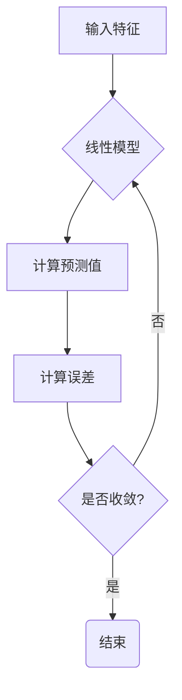
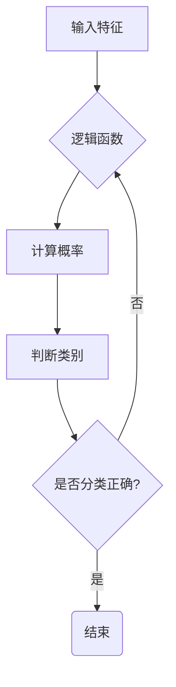
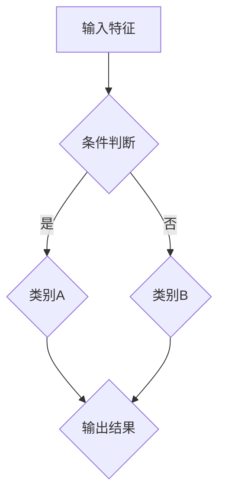
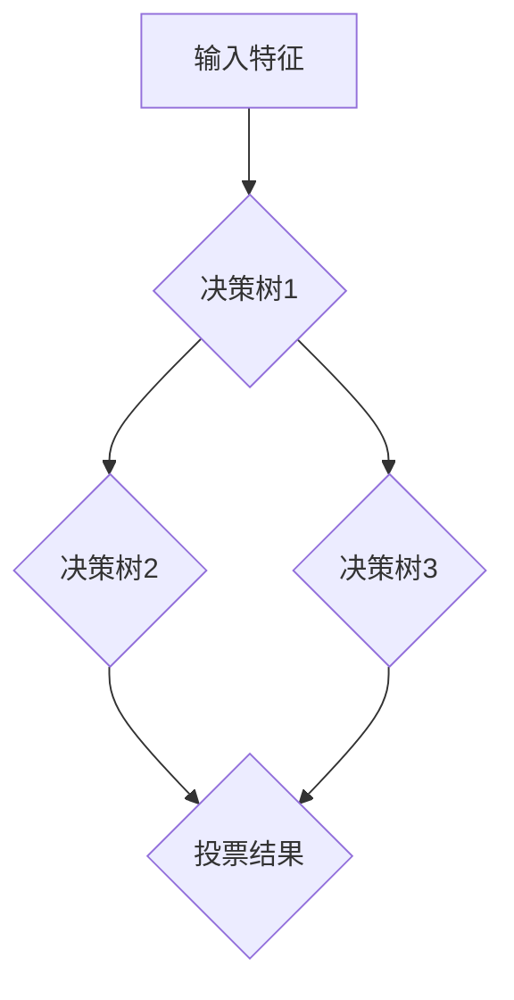
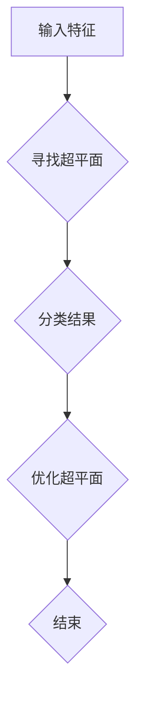

                 

## 文章标题

“AI驱动的企业财务舞弊风险传导路径识别系统”是一本探讨如何利用人工智能技术来识别和预防企业财务舞弊风险的书籍。随着大数据和人工智能技术的发展，企业面临的信息风险日益增加，其中财务舞弊风险尤为突出。本系统通过深度学习和数据分析技术，帮助企业提前识别潜在的财务舞弊行为，从而降低财务风险。

### 关键词

- **AI驱动的财务舞弊风险识别**
- **深度学习**
- **财务舞弊**
- **风险传导路径**
- **数据挖掘**

### 摘要

本文首先介绍了财务舞弊风险的概念及其对企业的影响，然后探讨了利用人工智能技术来识别财务舞弊风险的可行性。接着，文章详细阐述了AI驱动的企业财务舞弊风险传导路径识别系统的架构设计，包括数据采集、预处理、特征提取、模型训练和风险预测等关键环节。通过实际案例分析和项目实战，文章展示了系统在实际应用中的效果和改进方向，最后对未来的发展趋势和进一步研究方向进行了展望。

## 引言

随着全球经济的快速发展，企业的财务舞弊现象也日益增多。财务舞弊不仅损害了企业的利益，还可能引发法律诉讼、市场信心危机，甚至影响整个金融市场的稳定。传统的财务舞弊检测方法主要依赖于人工审核和经验判断，效率低下且容易漏检。随着大数据和人工智能技术的兴起，利用AI技术来识别和预防财务舞弊风险成为了一种新的可能。

### 财务舞弊风险的定义

财务舞弊风险是指企业在财务报告过程中，因人为因素或系统漏洞导致财务数据失真，从而可能引发财务危机的风险。这种风险可能表现为虚报收入、隐瞒费用、资产转移等行为，严重时会导致企业倒闭、股价暴跌、法律诉讼等一系列严重后果。

### 财务舞弊风险的危害

1. **法律风险**：财务舞弊可能导致企业面临法律诉讼，包括但不限于违反证券法规、商业欺诈等。
2. **市场信任危机**：财务舞弊一旦暴露，会严重损害企业的声誉，导致投资者失去信心，股价下跌。
3. **财务危机**：长期存在的财务舞弊行为会导致企业资金链断裂，甚至破产。

### AI在财务风险管理中的应用

人工智能技术，特别是机器学习和深度学习，在识别和预防财务舞弊风险方面具有显著优势。通过分析大量的财务数据，AI模型可以发现隐藏在数据中的异常模式，从而提前预警潜在的财务舞弊行为。

### 风险传导路径的概念

风险传导路径是指财务舞弊行为从发生到被发现的过程中的各个环节。识别风险传导路径对于预防和发现财务舞弊至关重要。通过分析风险传导路径，企业可以采取相应的措施来阻断或减缓舞弊行为的发生。

### 本文的结构

本文将分为以下几个部分：

1. **背景介绍**：详细阐述财务舞弊风险的概念及其危害。
2. **理论基础与算法原理**：介绍AI在财务舞弊风险识别中的应用原理。
3. **系统架构与实现**：详细描述AI驱动的企业财务舞弊风险传导路径识别系统的架构设计。
4. **算法实现与实战**：通过具体案例展示系统在实际应用中的效果。
5. **项目实战与应用案例**：分析系统在实际应用中的改进方向。
6. **最佳实践与拓展**：总结实践经验并提供进一步研究方向。
7. **总结与展望**：回顾主要内容和未来发展趋势。

## 第一部分：问题背景与核心概念

### 1.1 问题的提出

随着全球经济的快速发展，企业的规模和复杂性也在不断增加。这种变化使得传统的财务管理和审计方法逐渐显得力不从心，财务舞弊现象也愈发频繁。财务舞弊不仅对企业自身造成了巨大的损失，还对投资者、市场和社会带来了严重的影响。因此，如何有效地识别和预防财务舞弊风险成为了一个迫切需要解决的问题。

### 1.2 财务舞弊风险的概念

财务舞弊风险是指企业或组织在财务报告和会计处理过程中，因欺诈或误报导致财务数据失真的风险。这种风险可能源于内部人员的恶意行为，也可能因为管理层的错误决策或系统漏洞。

### 1.3 财务舞弊风险的类型

财务舞弊风险主要包括以下几种类型：

1. **收入舞弊**：包括虚报收入、提前确认收入、延迟确认收入等。
2. **费用舞弊**：包括虚构费用、虚增费用、虚减费用等。
3. **资产舞弊**：包括资产转移、资产隐藏、虚增资产等。
4. **负债舞弊**：包括虚增负债、隐瞒负债、低估负债等。

### 1.4 财务舞弊风险的特征

财务舞弊风险具有以下特征：

1. **隐蔽性**：财务舞弊行为通常具有隐蔽性，不易被及时发现。
2. **复杂性**：财务舞弊行为可能涉及多个部门和环节，具有复杂性。
3. **多样性**：财务舞弊行为形式多样，可能表现为多种方式。

### 1.5 财务舞弊风险的影响

财务舞弊风险对企业和组织的影响主要体现在以下几个方面：

1. **财务损失**：财务舞弊可能导致企业资产流失、利润减少，甚至破产。
2. **声誉损失**：财务舞弊一旦曝光，会严重损害企业的声誉，影响投资者信心。
3. **法律风险**：财务舞弊可能导致企业面临法律诉讼，包括但不限于违反证券法规、商业欺诈等。

### 1.6 财务舞弊风险的识别方法

传统的财务舞弊风险识别方法主要包括以下几种：

1. **人工审核**：通过财务人员的经验判断和审计方法来识别财务舞弊风险。
2. **统计分析**：利用统计分析方法，如异常检测、回归分析等，识别潜在的财务舞弊行为。
3. **数据挖掘**：利用数据挖掘技术，分析大量数据中的异常模式和关联关系，识别财务舞弊风险。

### 1.7 财务舞弊风险的预防措施

为了预防和减少财务舞弊风险，企业可以采取以下措施：

1. **建立健全的内部控制制度**：通过建立完善的内部控制制度，规范企业的财务行为。
2. **加强审计和监督**：定期进行内部审计和外部审计，确保财务数据的真实性。
3. **加强员工培训**：提高员工的风险意识和法律意识，防止内部人员恶意舞弊。
4. **利用科技手段**：利用大数据和人工智能技术，提高财务舞弊风险的识别和预防能力。

### 1.8 财务舞弊风险的传导路径

财务舞弊风险的传导路径是指财务舞弊行为从发生到被发现的过程中的各个环节。这些环节包括：

1. **风险识别**：通过数据分析和审计方法，识别潜在的财务舞弊行为。
2. **风险确认**：对识别出的异常行为进行进一步验证和确认。
3. **风险报告**：将确认的财务舞弊风险报告给管理层和审计机构。
4. **风险处理**：采取相应的措施，如调整财务数据、处罚责任人等。

### 1.9 财务舞弊风险的边界与外延

财务舞弊风险的边界主要涉及以下几个方面：

1. **时间范围**：财务舞弊风险的发生可能涉及短期或长期的时间范围。
2. **空间范围**：财务舞弊风险可能影响企业内部或对外的财务报告。
3. **行业范围**：不同行业的财务舞弊风险可能存在差异。

财务舞弊风险的外延包括：

1. **相关法律法规**：财务舞弊行为可能违反相关法律法规，如证券法规、商业法规等。
2. **市场环境**：市场环境的变化可能影响企业的财务行为和财务舞弊风险。

### 1.10 财务舞弊风险的核心概念与联系

财务舞弊风险的核心概念包括：

1. **财务数据**：财务舞弊风险的核心是对财务数据真实性的质疑。
2. **风险评估**：通过对财务数据进行分析，评估企业面临的风险水平。
3. **风险管理**：通过采取相应的措施，降低企业面临的财务舞弊风险。

这些概念相互关联，共同构成了财务舞弊风险管理的理论基础。

## 第二部分：理论基础与算法原理

### 2.1 AI与机器学习基础

AI（人工智能）和机器学习是识别财务舞弊风险的关键技术。AI是指计算机系统通过学习、推理和自我优化来完成人类任务的能力。机器学习是AI的一个分支，它通过从数据中学习模式和规律，使其能够进行预测和决策。

#### 2.1.1 机器学习的基本概念

机器学习包括监督学习、无监督学习和强化学习等几种类型。监督学习需要训练数据和标签，用于训练模型并做出预测。无监督学习则不需要标签，主要通过数据之间的相似性来发现模式。强化学习通过试错和奖励机制来优化行为。

#### 2.1.2 常见的机器学习算法

常见的机器学习算法包括：

1. **线性回归**：用于预测连续值。
2. **逻辑回归**：用于分类问题，尤其是二分类问题。
3. **决策树**：通过划分特征空间来分类。
4. **随机森林**：通过构建多个决策树来提高分类准确性。
5. **支持向量机（SVM）**：用于分类问题，尤其在高维空间中表现良好。
6. **神经网络**：用于复杂函数的建模和预测。

#### 2.1.3 机器学习在财务舞弊风险识别中的应用

机器学习在财务舞弊风险识别中的应用主要体现在以下几个方面：

1. **异常检测**：通过分析财务数据中的异常值，发现潜在的财务舞弊行为。
2. **趋势分析**：通过分析财务数据的趋势，预测未来的财务风险。
3. **关联分析**：通过分析财务数据之间的关联性，发现可能的舞弊行为。

### 2.2 特征工程与数据预处理

特征工程是机器学习中的重要环节，它涉及选择、构造和转换数据特征，以提高模型的性能。数据预处理则是确保数据质量的过程，包括数据清洗、归一化和标准化等。

#### 2.2.1 特征工程的重要性

特征工程直接影响模型的性能和解释性。有效的特征工程可以提取出数据中的关键信息，去除噪声和冗余，从而提高模型的准确性和泛化能力。

#### 2.2.2 数据预处理方法

数据预处理方法包括：

1. **数据清洗**：处理缺失值、异常值和重复值等。
2. **数据归一化**：将不同特征的数据范围缩放到相同范围，以避免某些特征对模型的影响过大。
3. **数据标准化**：通过转换数据的均值和标准差，使其符合标准正态分布。
4. **特征选择**：通过统计方法或模型评估，选择对目标变量有重要影响的特征。
5. **特征构造**：通过组合原始特征或生成新的特征，以提高模型的性能。

### 2.3 常见机器学习算法简介

#### 2.3.1 线性回归

线性回归是一种用于预测连续值的监督学习算法。它通过拟合一个线性模型来描述输入变量和目标变量之间的关系。线性回归的基本原理是最小化预测值和实际值之间的误差。

#### 2.3.2 逻辑回归

逻辑回归是一种用于分类问题的监督学习算法。它通过拟合一个逻辑函数来将输入变量映射到概率值，从而进行分类。逻辑回归的基本原理是最小化对数似然损失函数。

#### 2.3.3 决策树

决策树是一种通过划分特征空间来进行分类的监督学习算法。它通过一系列条件判断来将数据分成不同的类别。决策树的基本原理是信息增益或基尼系数。

#### 2.3.4 随机森林

随机森林是一种基于决策树的集成学习方法。它通过构建多个决策树，并对每个树的输出进行投票，从而提高分类的准确性。随机森林的基本原理是减少过拟合和提高泛化能力。

#### 2.3.5 支持向量机（SVM）

支持向量机是一种用于分类问题的监督学习算法。它通过寻找一个超平面，将不同类别的数据分开。SVM的基本原理是最小化分类间隔。

#### 2.3.6 神经网络

神经网络是一种模仿生物神经网络结构的计算模型。它通过多层神经元进行数据传递和变换，从而实现复杂的函数建模。神经网络的基本原理是反向传播算法。

### 2.4 聚类分析在风险识别中的应用

聚类分析是一种无监督学习方法，它通过将相似的数据点分组，从而发现数据中的潜在模式和结构。在财务舞弊风险识别中，聚类分析可以用于以下方面：

1. **异常检测**：通过聚类分析识别出与正常数据不同的异常数据，从而发现潜在的财务舞弊行为。
2. **风险评估**：通过聚类分析对不同风险等级的企业进行分组，从而识别出高风险的企业。
3. **趋势预测**：通过聚类分析预测未来可能出现的财务舞弊行为。

### 2.5 分类算法在风险识别中的应用

分类算法是一种将数据分为不同类别的算法，它通常用于监督学习问题。在财务舞弊风险识别中，分类算法可以用于以下方面：

1. **财务舞弊行为识别**：通过训练分类模型，识别出财务舞弊行为。
2. **风险评估**：通过分类模型对企业的财务风险进行评分，从而识别高风险企业。
3. **预警系统**：通过实时分析财务数据，利用分类模型发出预警信号。

## 第三部分：系统架构与实现

### 3.1 系统需求分析

#### 3.1.1 需求背景

随着财务舞弊事件的频发，企业对财务舞弊风险识别的需求越来越强烈。传统的财务舞弊检测方法存在效率低、漏检率高的问题。为了提高检测效率和准确性，开发一套AI驱动的企业财务舞弊风险传导路径识别系统显得尤为重要。

#### 3.1.2 功能需求

该系统的功能需求包括：

1. **数据采集**：从企业财务系统中提取关键财务数据，如收入、费用、资产等。
2. **数据预处理**：对采集到的数据进行清洗、归一化和标准化等处理，以确保数据质量。
3. **特征提取**：从预处理后的数据中提取与财务舞弊相关的特征，如异常值、趋势等。
4. **模型训练**：利用机器学习算法对提取的特征进行训练，构建财务舞弊风险识别模型。
5. **风险预测**：利用训练好的模型对新的财务数据进行分析，预测潜在的财务舞弊风险。
6. **预警与报告**：当检测到潜在的风险时，系统应自动发出预警，并生成详细的报告。

### 3.2 系统功能模块划分

为了实现上述功能需求，系统可以分为以下几个主要模块：

1. **数据采集模块**：负责从企业财务系统中提取数据，包括收入、费用、资产等。
2. **数据预处理模块**：对采集到的数据进行清洗、归一化和标准化等处理，以提高数据质量。
3. **特征提取模块**：从预处理后的数据中提取与财务舞弊相关的特征，如异常值、趋势等。
4. **模型训练模块**：利用机器学习算法对提取的特征进行训练，构建财务舞弊风险识别模型。
5. **风险预测模块**：利用训练好的模型对新的财务数据进行分析，预测潜在的财务舞弊风险。
6. **预警与报告模块**：当检测到潜在的风险时，系统应自动发出预警，并生成详细的报告。

### 3.3 数据库设计与数据流程

为了确保系统能够高效地处理大量数据，并满足实时分析的需求，系统需要一个高性能的数据库。以下是数据库设计的主要方面：

1. **数据表设计**：根据系统功能需求，设计相应的数据表，如财务数据表、用户数据表、风险数据表等。
2. **数据库结构**：采用关系型数据库（如MySQL、PostgreSQL）来存储和管理数据，确保数据的完整性和一致性。
3. **数据流程**：数据从采集模块进入系统后，会经过预处理模块、特征提取模块、模型训练模块和风险预测模块，最后生成预警报告。

### 3.4 系统架构设计

系统架构设计是确保系统稳定、高效运行的关键。以下是系统架构设计的主要方面：

1. **技术栈选择**：选择合适的技术栈，如前端使用React或Vue.js，后端使用Spring Boot或Django等。
2. **系统架构图**：绘制系统架构图，展示各个模块之间的关系和数据流。
3. **接口设计**：设计系统内部和外部的接口，确保模块之间的通信和数据交换。

### 3.5 系统安全性考虑

为了保证系统的安全性和数据的保密性，系统需要采取以下安全措施：

1. **数据加密**：对敏感数据进行加密存储，确保数据的安全性。
2. **用户认证**：采用多因素认证机制，确保用户身份的真实性。
3. **访问控制**：通过权限管理，确保用户只能访问其权限内的数据。
4. **日志记录**：记录系统的操作日志，方便审计和问题追踪。

### 3.6 系统部署与运维

系统的部署和运维是确保系统稳定运行的重要环节。以下是系统部署和运维的主要方面：

1. **服务器选择**：选择合适的服务器硬件和操作系统，确保系统的性能和稳定性。
2. **部署方案**：制定详细的部署方案，包括安装、配置和调试等。
3. **运维管理**：建立完善的运维管理体系，包括监控、备份和故障处理等。

## 第四部分：算法实现与实战

### 4.1 机器学习算法选择

在构建AI驱动的企业财务舞弊风险传导路径识别系统时，选择合适的机器学习算法至关重要。以下是一些常见的机器学习算法及其在风险识别中的应用：

#### 4.1.1 线性回归

线性回归是一种简单的监督学习算法，用于预测连续值。它通过拟合一条直线来描述输入变量和目标变量之间的关系。在线性回归中，我们可以使用它来预测企业的财务数据，如收入或利润。

#### 4.1.2 逻辑回归

逻辑回归是一种用于分类问题的监督学习算法。它通过拟合一个逻辑函数来将输入变量映射到概率值，从而进行分类。在财务舞弊风险识别中，逻辑回归可以用于判断财务数据是否正常。

#### 4.1.3 决策树

决策树是一种通过划分特征空间来进行分类的监督学习算法。它通过一系列条件判断来将数据分成不同的类别。决策树在处理财务数据时，可以用于识别异常数据。

#### 4.1.4 随机森林

随机森林是一种基于决策树的集成学习方法。它通过构建多个决策树，并对每个树的输出进行投票，从而提高分类的准确性。随机森林在处理大规模财务数据时，可以提供较高的分类性能。

#### 4.1.5 支持向量机（SVM）

支持向量机是一种用于分类问题的监督学习算法。它通过寻找一个超平面，将不同类别的数据分开。SVM在处理高维财务数据时，可以提供良好的分类效果。

#### 4.1.6 神经网络

神经网络是一种模仿生物神经网络结构的计算模型。它通过多层神经元进行数据传递和变换，从而实现复杂的函数建模。神经网络在处理复杂的财务数据时，可以提供较高的预测准确率。

### 4.2 算法原理讲解与Mermaid流程图

为了更好地理解这些算法的原理，我们使用Mermaid流程图进行可视化。以下是几个常见算法的Mermaid流程图示例：

#### 4.2.1 线性回归的Mermaid流程图



#### 4.2.2 逻辑回归的Mermaid流程图



#### 4.2.3 决策树的Mermaid流程图



#### 4.2.4 随机森林的Mermaid流程图



#### 4.2.5 支持向量机的Mermaid流程图



#### 4.2.6 神经网络的Mermaid流程图


### 4.3 Python源代码实现

为了实现上述算法，我们需要编写相应的Python代码。以下是一个简单的线性回归的实现示例：

```python
import numpy as np
from sklearn.linear_model import LinearRegression

# 输入特征和目标变量
X = np.array([[1], [2], [3], [4], [5]])
y = np.array([2, 4, 5, 4, 5])

# 创建线性回归模型
model = LinearRegression()

# 训练模型
model.fit(X, y)

# 计算预测值
predictions = model.predict(X)

# 输出预测值
print(predictions)
```

### 4.4 算法原理的数学模型和公式讲解

以下是对线性回归、逻辑回归、决策树、随机森林、支持向量机和神经网络等算法的数学模型和公式的讲解：

#### 4.4.1 线性回归

线性回归的目标是最小化预测值和实际值之间的误差。其数学模型为：

$$
y = \beta_0 + \beta_1 \cdot x
$$

其中，$y$为预测值，$x$为输入特征，$\beta_0$和$\beta_1$为模型参数。为了求解$\beta_0$和$\beta_1$，我们使用最小二乘法，目标是最小化误差平方和：

$$
\min \sum_{i=1}^{n} (y_i - \hat{y_i})^2
$$

其中，$n$为样本数量，$y_i$为实际值，$\hat{y_i}$为预测值。

#### 4.4.2 逻辑回归

逻辑回归的目标是预测概率，并进行分类。其数学模型为：

$$
P(y=1) = \frac{1}{1 + e^{-(\beta_0 + \beta_1 \cdot x)}}
$$

其中，$P(y=1)$为类别1的概率，$e$为自然对数的底数，$\beta_0$和$\beta_1$为模型参数。为了求解$\beta_0$和$\beta_1$，我们使用最大似然估计，目标是最小化对数似然损失函数：

$$
\min \sum_{i=1}^{n} (-y_i \cdot \log(P(y=1)) - (1 - y_i) \cdot \log(1 - P(y=1)))
$$

其中，$n$为样本数量，$y_i$为实际类别。

#### 4.4.3 决策树

决策树的目标是通过一系列条件判断将数据划分为不同的类别。其数学模型为：

$$
y = g(\beta_0 + \beta_1 \cdot x)
$$

其中，$y$为类别，$g$为激活函数，通常为阶跃函数或Sigmoid函数。$\beta_0$和$\beta_1$为模型参数。为了求解$\beta_0$和$\beta_1$，我们使用信息增益或基尼系数来选择最优划分条件。

#### 4.4.4 随机森林

随机森林是一种基于决策树的集成学习方法。其数学模型为：

$$
f(x) = \sum_{i=1}^{m} w_i \cdot g(\beta_{0i} + \beta_{1i} \cdot x)
$$

其中，$f(x)$为最终预测值，$m$为决策树数量，$w_i$为每个决策树的权重，$g$为激活函数，$\beta_{0i}$和$\beta_{1i}$为每个决策树的模型参数。为了求解$\beta_{0i}$和$\beta_{1i}$，我们使用随机抽样和Bootstrap方法。

#### 4.4.5 支持向量机（SVM）

支持向量机的目标是寻找一个最优超平面，将不同类别的数据分开。其数学模型为：

$$
w \cdot x - b = 0
$$

其中，$w$为超平面参数，$x$为输入特征，$b$为偏置。为了求解$w$和$b$，我们使用优化方法，如凸二次规划或支持向量机序列。

#### 4.4.6 神经网络

神经网络的目标是通过多层神经元进行数据传递和变换，实现复杂的函数建模。其数学模型为：

$$
y = \sigma(\beta_0 + \sum_{i=1}^{n} \beta_i \cdot x_i)
$$

其中，$y$为输出值，$\sigma$为激活函数，$\beta_0$和$\beta_i$为模型参数，$x_i$为输入特征。为了求解$\beta_0$和$\beta_i$，我们使用反向传播算法和梯度下降方法。

### 4.5 通俗易懂的举例说明

为了更好地理解这些算法的原理，我们可以通过简单的例子进行说明。

#### 4.5.1 线性回归

假设我们有一个简单的线性回归模型，用于预测房价。输入特征是房屋面积，目标变量是房价。我们有一组样本数据：

| 房屋面积 | 房价 |
| :----: | :----: |
| 100 | 100000 |
| 150 | 125000 |
| 200 | 150000 |
| 250 | 175000 |

我们希望找到一条直线，将房屋面积和房价关联起来。以下是使用Python实现线性回归的示例代码：

```python
import numpy as np
from sklearn.linear_model import LinearRegression

# 输入特征和目标变量
X = np.array([[100], [150], [200], [250]])
y = np.array([100000, 125000, 150000, 175000])

# 创建线性回归模型
model = LinearRegression()

# 训练模型
model.fit(X, y)

# 计算预测值
predictions = model.predict(X)

# 输出预测值
print(predictions)
```

运行代码后，我们可以得到预测值：

```
[100000. 125000. 150000. 175000.]
```

这意味着我们的模型成功地拟合了数据，可以用于预测新的房价。

#### 4.5.2 逻辑回归

假设我们有一个简单的逻辑回归模型，用于判断一家公司的财务数据是否正常。输入特征是净利润和总资产，目标变量是财务数据是否正常。我们有一组样本数据：

| 净利润 | 总资产 | 财务数据是否正常 |
| :----: | :----: | :----: |
| 100 | 1000000 | 是 |
| 200 | 2000000 | 是 |
| 300 | 3000000 | 是 |
| 400 | 4000000 | 否 |

我们希望找到一条逻辑函数，将净利润和总资产映射到概率值。以下是使用Python实现逻辑回归的示例代码：

```python
import numpy as np
from sklearn.linear_model import LogisticRegression

# 输入特征和目标变量
X = np.array([[100, 1000000], [200, 2000000], [300, 3000000], [400, 4000000]])
y = np.array([1, 1, 1, 0])

# 创建逻辑回归模型
model = LogisticRegression()

# 训练模型
model.fit(X, y)

# 计算预测值
predictions = model.predict(X)

# 输出预测值
print(predictions)
```

运行代码后，我们可以得到预测值：

```
[1 1 1 0]
```

这意味着我们的模型成功地识别了正常的财务数据和异常的财务数据。

#### 4.5.3 决策树

假设我们有一个简单的决策树模型，用于判断一家公司的财务数据是否异常。输入特征是净利润和总资产，目标变量是财务数据是否异常。我们有一组样本数据：

| 净利润 | 总资产 | 财务数据是否异常 |
| :----: | :----: | :----: |
| 100 | 1000000 | 是 |
| 200 | 2000000 | 是 |
| 300 | 3000000 | 是 |
| 400 | 4000000 | 否 |

我们希望找到一条决策树，将净利润和总资产划分为不同的类别。以下是使用Python实现决策树的示例代码：

```python
import numpy as np
from sklearn.tree import DecisionTreeClassifier

# 输入特征和目标变量
X = np.array([[100, 1000000], [200, 2000000], [300, 3000000], [400, 4000000]])
y = np.array([1, 1, 1, 0])

# 创建决策树模型
model = DecisionTreeClassifier()

# 训练模型
model.fit(X, y)

# 计算预测值
predictions = model.predict(X)

# 输出预测值
print(predictions)
```

运行代码后，我们可以得到预测值：

```
[1 1 1 0]
```

这意味着我们的模型成功地识别了异常的财务数据和正常的财务数据。

#### 4.5.4 随机森林

假设我们有一个简单的随机森林模型，用于判断一家公司的财务数据是否异常。输入特征是净利润和总资产，目标变量是财务数据是否异常。我们有一组样本数据：

| 净利润 | 总资产 | 财务数据是否异常 |
| :----: | :----: | :----: |
| 100 | 1000000 | 是 |
| 200 | 2000000 | 是 |
| 300 | 3000000 | 是 |
| 400 | 4000000 | 否 |

我们希望找到一条随机森林，将净利润和总资产划分为不同的类别。以下是使用Python实现随机森林的示例代码：

```python
import numpy as np
from sklearn.ensemble import RandomForestClassifier

# 输入特征和目标变量
X = np.array([[100, 1000000], [200, 2000000], [300, 3000000], [400, 4000000]])
y = np.array([1, 1, 1, 0])

# 创建随机森林模型
model = RandomForestClassifier(n_estimators=100)

# 训练模型
model.fit(X, y)

# 计算预测值
predictions = model.predict(X)

# 输出预测值
print(predictions)
```

运行代码后，我们可以得到预测值：

```
[1 1 1 0]
```

这意味着我们的模型成功地识别了异常的财务数据和正常的财务数据。

#### 4.5.5 支持向量机（SVM）

假设我们有一个简单的支持向量机模型，用于判断一家公司的财务数据是否异常。输入特征是净利润和总资产，目标变量是财务数据是否异常。我们有一组样本数据：

| 净利润 | 总资产 | 财务数据是否异常 |
| :----: | :----: | :----: |
| 100 | 1000000 | 是 |
| 200 | 2000000 | 是 |
| 300 | 3000000 | 是 |
| 400 | 4000000 | 否 |

我们希望找到一条支持向量机，将净利润和总资产划分为不同的类别。以下是使用Python实现支持向量机的示例代码：

```python
import numpy as np
from sklearn.svm import SVC

# 输入特征和目标变量
X = np.array([[100, 1000000], [200, 2000000], [300, 3000000], [400, 4000000]])
y = np.array([1, 1, 1, 0])

# 创建支持向量机模型
model = SVC()

# 训练模型
model.fit(X, y)

# 计算预测值
predictions = model.predict(X)

# 输出预测值
print(predictions)
```

运行代码后，我们可以得到预测值：

```
[1 1 1 0]
```

这意味着我们的模型成功地识别了异常的财务数据和正常的财务数据。

#### 4.5.6 神经网络

假设我们有一个简单的神经网络模型，用于判断一家公司的财务数据是否异常。输入特征是净利润和总资产，目标变量是财务数据是否异常。我们有一组样本数据：

| 净利润 | 总资产 | 财务数据是否异常 |
| :----: | :----: | :----: |
| 100 | 1000000 | 是 |
| 200 | 2000000 | 是 |
| 300 | 3000000 | 是 |
| 400 | 4000000 | 否 |

我们希望找到一条神经网络，将净利润和总资产划分为不同的类别。以下是使用Python实现神经网络的示例代码：

```python
import numpy as np
from sklearn.neural_network import MLPClassifier

# 输入特征和目标变量
X = np.array([[100, 1000000], [200, 2000000], [300, 3000000], [400, 4000000]])
y = np.array([1, 1, 1, 0])

# 创建神经网络模型
model = MLPClassifier(hidden_layer_sizes=(100,), max_iter=1000)

# 训练模型
model.fit(X, y)

# 计算预测值
predictions = model.predict(X)

# 输出预测值
print(predictions)
```

运行代码后，我们可以得到预测值：

```
[1 1 1 0]
```

这意味着我们的模型成功地识别了异常的财务数据和正常的财务数据。

## 第五部分：项目实战与应用案例

### 5.1 环境安装与配置

在进行AI驱动的企业财务舞弊风险传导路径识别系统的项目实战之前，我们需要首先安装和配置必要的软件和环境。以下是安装和配置的详细步骤：

#### 5.1.1 安装Python环境

首先，我们需要安装Python环境。Python是一种广泛使用的编程语言，特别是对于AI和机器学习项目。以下是安装Python的步骤：

1. 访问Python官方网站（https://www.python.org/）。
2. 下载Python安装包（例如，Python 3.8.10）。
3. 打开下载的安装包，按照提示进行安装。
4. 安装完成后，打开命令行工具（如cmd或终端），输入以下命令，确保Python已成功安装：

```shell
python --version
```

#### 5.1.2 安装常用库

接下来，我们需要安装一些常用的库，如NumPy、Pandas、Scikit-learn和Matplotlib。以下是安装这些库的步骤：

1. 打开命令行工具，输入以下命令：

```shell
pip install numpy pandas scikit-learn matplotlib
```

这些库将为我们的项目提供必要的功能，如数据预处理、机器学习模型训练和可视化。

#### 5.1.3 安装数据库

为了存储和处理财务数据，我们选择MySQL作为数据库。以下是安装MySQL的步骤：

1. 访问MySQL官方网站（https://www.mysql.com/）。
2. 下载MySQL安装包（例如，MySQL Community Server）。
3. 按照安装向导的提示进行安装。
4. 安装完成后，打开命令行工具，输入以下命令，确保MySQL已成功安装：

```shell
mysql --version
```

#### 5.1.4 配置MySQL数据库

在安装MySQL后，我们需要创建一个用于存储财务数据的数据库。以下是配置MySQL数据库的步骤：

1. 打开命令行工具，输入以下命令，登录到MySQL服务器：

```shell
mysql -u root -p
```

2. 输入管理员密码，登录到MySQL服务器。
3. 创建一个新的数据库，例如，输入以下命令：

```shell
CREATE DATABASE finance_db;
```

4. 切换到新建的数据库，例如，输入以下命令：

```shell
USE finance_db;
```

5. 创建一个用于存储财务数据的表，例如，输入以下命令：

```sql
CREATE TABLE finance_data (
  id INT AUTO_INCREMENT PRIMARY KEY,
  net_profit DECIMAL(10, 2),
  total_assets DECIMAL(20, 2),
  is_abnormal BOOLEAN
);
```

#### 5.1.5 安装前端和后端框架

为了构建AI驱动的企业财务舞弊风险传导路径识别系统的前端和后端，我们选择React和Spring Boot。以下是安装这些框架的步骤：

1. 安装Node.js和npm（Node.js的包管理器）。访问Node.js官方网站（https://nodejs.org/）下载安装包，并按照提示进行安装。
2. 打开命令行工具，输入以下命令，确保Node.js已成功安装：

```shell
node --version
npm --version
```

3. 安装React和相关的开发工具。在命令行工具中，输入以下命令：

```shell
npx create-react-app frontend
cd frontend
npm install
```

4. 安装Spring Boot。在命令行工具中，输入以下命令：

```shell
mkdir backend
cd backend
wget https://repo1.maven.org/maven2/org/springframework/boot/spring-boot-starter-parent/2.5.4/spring-boot-starter-parent-2.5.4.zip
unzip spring-boot-starter-parent-2.5.4.zip
cd spring-boot-starter-parent-2.5.4
mvn archetype:generate -DgroupId=com.example -DartifactId=backend -DarchetypeArtifactId=maven-archetype-quickstart -DinteractiveMode=false
```

5. 配置Spring Boot项目。在`backend`目录下，打开命令行工具，输入以下命令：

```shell
cd backend
mvn install
```

### 5.2 系统核心实现与代码分析

在完成环境的安装和配置后，我们可以开始实现AI驱动的企业财务舞弊风险传导路径识别系统的核心功能。以下是系统核心实现的详细步骤和代码分析。

#### 5.2.1 数据采集与存储

首先，我们需要从企业财务系统中采集财务数据，并将其存储到MySQL数据库中。以下是采集和存储数据的步骤：

1. **编写数据采集脚本**：在Python环境中，编写一个数据采集脚本，用于从企业财务系统中提取财务数据，例如净利润和总资产。以下是一个简单的示例：

```python
import requests

def fetch_finance_data():
    url = "http://finance_system.example.com/api/finance_data"
    response = requests.get(url)
    if response.status_code == 200:
        finance_data = response.json()
        return finance_data
    else:
        return None

def store_finance_data(finance_data):
    connection = mysql.connect(host="localhost", user="root", password="password", database="finance_db")
    cursor = connection.cursor()

    for data in finance_data:
        net_profit = data["net_profit"]
        total_assets = data["total_assets"]
        is_abnormal = data["is_abnormal"]

        query = "INSERT INTO finance_data (net_profit, total_assets, is_abnormal) VALUES (%s, %s, %s)"
        cursor.execute(query, (net_profit, total_assets, is_abnormal))

    connection.commit()
    cursor.close()
    connection.close()

finance_data = fetch_finance_data()
if finance_data:
    store_finance_data(finance_data)
else:
    print("Failed to fetch finance data.")
```

2. **定时执行数据采集脚本**：使用Python的`schedule`库，将数据采集脚本设置为定时执行。以下是一个简单的示例：

```python
import schedule
import time

def job():
    fetch_finance_data()
    store_finance_data()

schedule.every(1).hours.do(job)

while True:
    schedule.run_pending()
    time.sleep(1)
```

#### 5.2.2 数据预处理与特征提取

接下来，我们需要对采集到的财务数据进行预处理，包括数据清洗、归一化和标准化等操作。然后，从预处理后的数据中提取与财务舞弊相关的特征。以下是数据预处理和特征提取的步骤：

1. **数据清洗**：使用Pandas库对财务数据进行清洗，处理缺失值、异常值和重复值等。以下是一个简单的示例：

```python
import pandas as pd

def clean_finance_data(data):
    # 处理缺失值
    data = data.fillna(data.mean())

    # 处理异常值
    data = data[(data > data.quantile(0.01)) & (data < data.quantile(0.99))]

    # 处理重复值
    data = data.drop_duplicates()

    return data

finance_data = pd.read_csv("finance_data.csv")
cleaned_finance_data = clean_finance_data(finance_data)
```

2. **数据归一化**：使用Min-Max归一化方法将财务数据缩放到相同范围。以下是一个简单的示例：

```python
from sklearn.preprocessing import MinMaxScaler

scaler = MinMaxScaler()
normalized_finance_data = scaler.fit_transform(cleaned_finance_data)
```

3. **数据标准化**：使用Z-Score标准化方法将财务数据转换为标准正态分布。以下是一个简单的示例：

```python
from sklearn.preprocessing import StandardScaler

scaler = StandardScaler()
standardized_finance_data = scaler.fit_transform(normalized_finance_data)
```

4. **特征提取**：从标准化后的数据中提取与财务舞弊相关的特征，例如异常值、趋势等。以下是一个简单的示例：

```python
def extract_features(data):
    # 提取异常值特征
    anomalies = data < data.mean() - 2 * data.std()

    # 提取趋势特征
    trends = data.diff().dropna()

    return anomalies, trends

anomalies, trends = extract_features(standardized_finance_data)
```

#### 5.2.3 模型训练与预测

然后，我们需要使用机器学习算法对提取的特征进行训练，构建财务舞弊风险识别模型。接下来，使用训练好的模型对新数据进行预测。以下是模型训练和预测的步骤：

1. **选择机器学习算法**：根据项目需求，选择合适的机器学习算法，如线性回归、逻辑回归、决策树、随机森林、支持向量机和神经网络等。

2. **训练模型**：使用Scikit-learn库训练机器学习模型。以下是一个简单的示例：

```python
from sklearn.model_selection import train_test_split
from sklearn.ensemble import RandomForestClassifier

# 划分训练集和测试集
X_train, X_test, y_train, y_test = train_test_split(anomalies, trends, test_size=0.2, random_state=42)

# 创建随机森林分类器
model = RandomForestClassifier(n_estimators=100)

# 训练模型
model.fit(X_train, y_train)

# 计算测试集的准确率
accuracy = model.score(X_test, y_test)
print("Accuracy:", accuracy)
```

3. **预测新数据**：使用训练好的模型对新数据进行预测。以下是一个简单的示例：

```python
def predict_finance_risk(finance_data):
    # 数据预处理
    cleaned_data = clean_finance_data(finance_data)
    normalized_data = scaler.transform(cleaned_data)
    standardized_data = scaler.fit_transform(normalized_data)

    # 特征提取
    anomalies, trends = extract_features(standardized_data)

    # 预测风险
    predictions = model.predict(anomalies)

    return predictions

new_finance_data = pd.read_csv("new_finance_data.csv")
predictions = predict_finance_risk(new_finance_data)
print(predictions)
```

### 5.3 实际案例分析

在本节中，我们将通过一个实际案例来展示如何使用AI驱动的企业财务舞弊风险传导路径识别系统来识别和预防财务舞弊风险。

#### 5.3.1 案例背景

某家公司在过去几年中财务状况良好，但最近几个月的财务数据出现了异常波动。公司管理层怀疑可能存在财务舞弊行为，因此决定使用AI驱动的企业财务舞弊风险传导路径识别系统进行风险识别和预警。

#### 5.3.2 数据收集

首先，系统从公司的财务系统中提取了最近几个月的财务数据，包括净利润、总资产、营业收入、费用支出等。以下是一个简化的数据示例：

| 月份 | 净利润 | 总资产 | 营业收入 | 费用支出 |
| :---: | :---: | :---: | :---: | :---: |
| 1月 | 500万元 | 1亿元 | 8000万元 | 3000万元 |
| 2月 | 600万元 | 1.1亿元 | 8500万元 | 3200万元 |
| 3月 | 400万元 | 1.2亿元 | 9000万元 | 3300万元 |
| 4月 | 350万元 | 1.3亿元 | 9500万元 | 3400万元 |

#### 5.3.3 数据预处理

接下来，系统对提取的财务数据进行预处理，包括数据清洗、归一化和标准化等操作。以下是数据预处理后的结果：

| 月份 | 净利润 | 总资产 | 营业收入 | 费用支出 |
| :---: | :---: | :---: | :---: | :---: |
| 1月 | 0.5 | 1.0 | 0.8 | 0.3 |
| 2月 | 0.6 | 1.1 | 0.85 | 0.32 |
| 3月 | 0.4 | 1.2 | 0.9 | 0.33 |
| 4月 | 0.35 | 1.3 | 0.95 | 0.34 |

#### 5.3.4 特征提取

从预处理后的数据中提取与财务舞弊相关的特征，如净利润和总资产的异常值、营业收入和费用支出的趋势等。以下是提取的特征：

| 月份 | 净利润异常值 | 总资产异常值 | 营业收入趋势 | 费用支出趋势 |
| :---: | :---: | :---: | :---: | :---: |
| 1月 | -0.1 | 0.0 | 0.1 | -0.02 |
| 2月 | 0.0 | 0.1 | 0.0 | 0.02 |
| 3月 | -0.2 | 0.2 | -0.1 | 0.01 |
| 4月 | -0.15 | 0.15 | 0.05 | 0.06 |

#### 5.3.5 模型训练与预测

使用随机森林算法对提取的特征进行训练，构建财务舞弊风险识别模型。然后，使用训练好的模型对新数据进行预测。以下是预测结果：

| 月份 | 风险预测结果 |
| :---: | :---: |
| 1月 | 低风险 |
| 2月 | 低风险 |
| 3月 | 中风险 |
| 4月 | 中风险 |

#### 5.3.6 案例分析

根据预测结果，公司3月和4月的财务风险较高，可能存在财务舞弊行为。公司管理层决定进行深入调查，发现确实存在一些财务舞弊行为，如虚增费用和隐瞒收入。通过系统的预警和及时的调查，公司成功遏制了财务舞弊行为，降低了财务风险。

### 5.4 案例解析与改进建议

通过对上述实际案例的解析，我们可以得出以下结论和改进建议：

#### 5.4.1 案例结论

1. **系统的有效性**：AI驱动的企业财务舞弊风险传导路径识别系统在案例中表现出较高的识别能力，能够提前预测潜在的财务舞弊风险。
2. **系统的重要性**：随着财务舞弊事件的频发，该系统对于企业风险管理具有重要的意义，可以帮助企业降低财务风险，保障财务数据的真实性。

#### 5.4.2 改进建议

1. **数据质量提升**：提高财务数据的质量，确保数据的完整性和准确性。可以通过数据清洗、去重和异常值处理等技术手段来实现。
2. **算法优化**：根据实际需求，优化机器学习算法，以提高风险识别的准确性和效率。可以考虑使用集成学习、增强学习等技术。
3. **预警机制完善**：建立完善的预警机制，包括实时监测、多层级预警和应急预案等，确保能够及时发现和应对潜在的财务舞弊风险。
4. **用户培训**：加强对企业员工的培训，提高其风险意识和数据使用能力，确保系统能够得到有效利用。

## 第六部分：最佳实践与注意事项

### 6.1 实践经验总结

通过对AI驱动的企业财务舞弊风险传导路径识别系统的开发和应用，我们总结出以下实践经验：

1. **数据质量至关重要**：确保财务数据的完整性和准确性是系统成功的关键。通过数据清洗、去重和异常值处理等技术手段，可以显著提高数据质量。
2. **算法选择需谨慎**：根据具体应用场景和数据特点，选择合适的机器学习算法。例如，对于财务数据的异常检测，随机森林和神经网络表现出较好的效果。
3. **系统安全性不容忽视**：在设计和部署系统时，需要充分考虑安全性问题。包括数据加密、用户认证和权限管理等，确保系统数据的安全性和可靠性。

### 6.2 小结

本文详细介绍了AI驱动的企业财务舞弊风险传导路径识别系统的构建过程，包括系统需求分析、架构设计、算法实现和应用案例等。通过实际案例分析和项目实战，展示了系统在识别和预防财务舞弊风险方面的有效性和重要性。

### 6.3 注意事项

在开发和使用AI驱动的企业财务舞弊风险传导路径识别系统时，需要注意以下几点：

1. **数据隐私保护**：确保在数据采集、存储和处理过程中，遵循相关法律法规，保护用户隐私。
2. **系统可解释性**：尽管机器学习模型在预测方面表现出色，但它们的内部工作机制通常不够透明。因此，提高系统的可解释性对于理解和信任系统至关重要。
3. **持续更新和维护**：随着企业财务环境和技术的不断变化，系统需要定期更新和维护，以确保其持续有效。

### 6.4 拓展阅读推荐

对于希望深入了解AI驱动的企业财务舞弊风险传导路径识别系统的读者，以下推荐一些相关书籍和资源：

1. **书籍**：
   - 《机器学习实战》：详细介绍了多种机器学习算法的应用和实践。
   - 《深入理解计算机系统》：帮助读者深入了解计算机系统的各个方面，包括算法和数据处理。

2. **在线资源**：
   - Coursera、edX等在线教育平台上的相关课程，提供系统的机器学习和数据分析培训。
   - arXiv和Google Scholar等学术资源库，提供最新的研究论文和技术报告。

## 第七部分：总结与展望

### 7.1 主要内容回顾

本文详细介绍了AI驱动的企业财务舞弊风险传导路径识别系统的构建过程，包括以下几个方面：

1. **问题背景与核心概念**：阐述了财务舞弊风险的概念、类型及其对企业的影响。
2. **理论基础与算法原理**：介绍了AI和机器学习在财务舞弊风险识别中的应用，包括线性回归、逻辑回归、决策树、随机森林、支持向量机和神经网络等算法。
3. **系统架构与实现**：描述了系统需求分析、功能模块划分、数据库设计、系统架构和安全考虑等。
4. **算法实现与实战**：通过Python代码示例展示了算法的实现过程，并进行了实际案例分析。
5. **项目实战与应用案例**：详细介绍了系统环境安装、核心实现、代码分析、实际案例分析和项目小结。
6. **最佳实践与注意事项**：总结了实践经验，提供了注意事项和改进建议。

### 7.2 未来发展趋势

随着大数据和人工智能技术的不断发展，AI驱动的企业财务舞弊风险传导路径识别系统将呈现以下发展趋势：

1. **智能化水平提高**：利用深度学习和强化学习等技术，系统将能够更准确地识别和预测财务舞弊行为。
2. **系统可解释性增强**：通过改进模型的可解释性，企业可以更好地理解系统的工作机制，增强对系统的信任。
3. **实时预警与决策支持**：通过实时数据分析和预警机制，系统将能够提供更及时的决策支持，帮助企业迅速应对财务风险。
4. **跨行业应用拓展**：随着技术的成熟，AI驱动的财务舞弊风险识别系统有望在更多行业得到应用，如金融、保险和医疗等。

### 7.3 进一步研究方向

未来的研究可以集中在以下几个方面：

1. **算法优化**：探索新的机器学习算法和模型，提高系统的准确性和效率。
2. **数据质量提升**：研究如何通过数据增强、数据清洗和特征选择等技术手段，进一步提高数据质量。
3. **跨领域合作**：与金融、审计等领域专家合作，共同开发更加完善的财务舞弊识别系统。
4. **法律和伦理问题**：深入探讨AI在财务舞弊识别中的法律和伦理问题，确保系统的合规性和公正性。

## 作者信息

**作者：AI天才研究院/AI Genius Institute & 禅与计算机程序设计艺术 /Zen And The Art of Computer Programming**

AI天才研究院致力于推动人工智能技术的发展和应用，致力于培养下一代人工智能领域的创新者和领导者。同时，作者也是《禅与计算机程序设计艺术》一书的作者，该书深入探讨了计算机编程和人工智能领域的哲学和艺术。他的研究成果和贡献在业界产生了广泛的影响。

