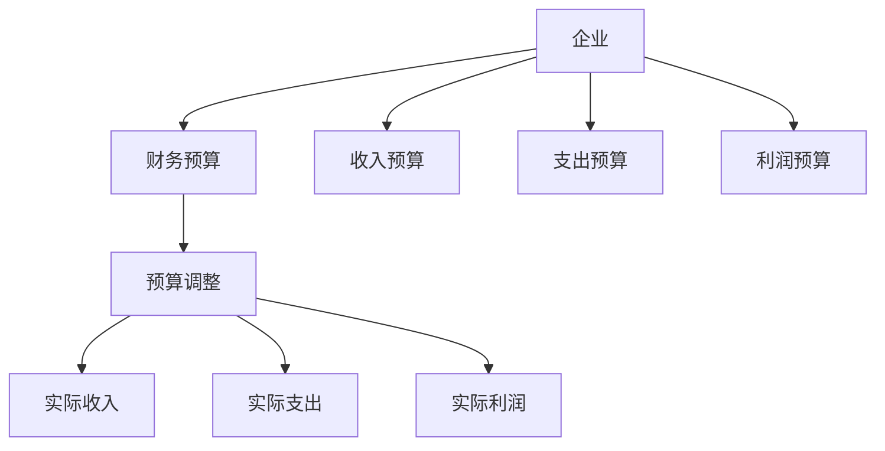
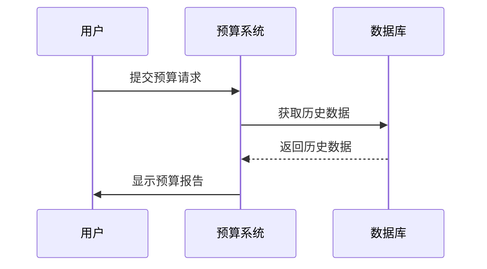

                 

### 第一部分：引言与背景

#### 第1章：引言

在当今快速变化的商业环境中，企业面临的市场动态和竞争压力前所未有。财务预算是企业规划和管理的重要工具，它不仅关乎企业的资源配置，还直接影响到企业的生存与发展。传统的财务预算编制方法往往依赖于人工经验，容易出现偏差，无法及时反映市场变化。而随着人工智能（AI）技术的迅猛发展，AI驱动的财务预算编制与调整系统逐渐成为企业财务管理的重要创新。

本章将探讨AI驱动的财务预算编制与调整系统的主题和目标，介绍该系统的重要性，并简要介绍AI技术在财务预算中的应用潜力。通过这些内容，读者可以初步了解AI驱动财务预算系统的基本概念，为后续章节的深入学习打下基础。

##### 1.1 书籍主题与目标

本书籍的主题是“AI驱动的企业财务预算编制与调整系统”。在这个主题下，我们旨在探讨如何利用人工智能技术来优化企业财务预算的编制和调整过程。具体目标如下：

1. **全面理解AI技术及其在财务预算中的应用**：介绍AI技术的基本概念、核心原理及其在现代财务预算中的具体应用。
2. **分析AI驱动的财务预算流程**：从数据采集、数据分析到预算编制和调整，系统分析AI在各个环节中的作用。
3. **探讨财务预算系统的设计实现**：详细讲解财务预算系统的架构设计、功能实现和接口设计，为实际应用提供理论支持。
4. **提供实践指导与案例分析**：通过具体案例展示AI驱动财务预算系统的实际应用效果，并提供实施过程中的挑战与解决方案。
5. **展望未来发展方向与最佳实践**：总结AI驱动财务预算的发展趋势，分享最佳实践，帮助读者更好地理解和应用该系统。

##### 1.2 财务预算编制与调整的重要性

财务预算编制是企业财务管理中的一项核心任务，它涉及对企业未来一段时间内收入、支出、利润的预测和规划。有效的财务预算不仅有助于企业合理分配资源，规避财务风险，还可以为企业战略决策提供重要依据。而预算调整则是在实际运营过程中根据市场变化和企业实际情况对预算进行动态调整，以确保企业财务目标的实现。

财务预算编制与调整的重要性体现在以下几个方面：

1. **资源优化配置**：通过财务预算，企业可以预先规划各项资源的投入，避免资源浪费，提高资源利用效率。
2. **风险控制**：预算编制可以帮助企业预见潜在的财务风险，提前采取措施进行风险控制，确保企业稳定运营。
3. **战略决策支持**：财务预算是企业战略决策的重要依据，可以帮助企业制定长期发展规划，实现可持续发展。
4. **绩效评估**：预算调整过程中，企业可以对比预算与实际绩效，评估各部门和项目的执行情况，为绩效评估提供依据。

##### 1.3 AI在财务预算中的潜力

随着人工智能技术的不断发展，AI在财务预算中的应用潜力逐渐显现。AI技术可以为企业提供更加精准的财务预测和分析，从而优化预算编制和调整过程。以下是一些AI技术在财务预算中的具体应用潜力：

1. **数据分析和预测**：AI可以通过大数据分析，挖掘出财务数据中的潜在规律，为企业提供准确的财务预测。
2. **自动编制和调整**：AI技术可以自动化处理大量的财务数据，快速编制和调整预算，提高工作效率。
3. **风险预警与控制**：AI可以实时监控财务数据，发现异常情况，及时发出风险预警，帮助企业提前采取应对措施。
4. **决策支持**：AI可以为企业管理层提供基于数据的决策支持，帮助企业在面对复杂市场环境时做出更加明智的决策。

通过本章的介绍，读者可以初步了解AI驱动的财务预算编制与调整系统的背景和重要性，为后续章节的深入学习做好准备。在接下来的章节中，我们将进一步探讨财务预算编制的基本概念、AI在财务预算中的应用原理以及系统的设计实现等内容。

### 第二部分：财务预算编制的基本概念

#### 第2章：财务预算编制的基本概念

在深入了解AI驱动的财务预算编制与调整系统之前，我们需要首先掌握财务预算编制的基本概念。财务预算是企业对未来一段时间内财务活动的预测和规划，是企业管理的重要工具。本章将介绍财务预算的概述、编制过程以及核心要素，帮助读者建立对财务预算编制的全面理解。

##### 2.1 财务预算概述

财务预算是企业对未来财务状况的预测和规划，包括收入、支出、利润等财务指标的预测。财务预算的主要目的是为企业提供财务决策的依据，确保企业资源的合理配置和有效利用。财务预算通常分为年度预算和季度预算，年度预算是整个企业全年财务活动的总体规划，而季度预算则是年度预算的具体执行和调整。

财务预算的基本概念包括以下几个方面：

1. **收入预算**：预测企业在未来一段时间内的收入情况，包括主营业务收入、其他收入等。
2. **支出预算**：预测企业在未来一段时间内的支出情况，包括日常运营支出、投资支出等。
3. **利润预算**：根据收入和支出的预测，计算企业在未来一段时间内的利润情况。
4. **现金预算**：预测企业在未来一段时间内的现金流入和流出情况，确保现金流的稳定和充足。

##### 2.2 预算编制的过程

财务预算编制是一个系统性的过程，通常包括以下几个阶段：

1. **数据收集**：收集与企业财务相关的各种数据，包括历史财务数据、市场数据、行业数据等。
2. **预算草案编制**：根据收集到的数据，制定初步的预算草案，包括收入预算、支出预算和利润预算。
3. **预算评审与调整**：对预算草案进行评审，根据实际情况进行调整和优化，确保预算的合理性和可行性。
4. **预算审批与发布**：将调整后的预算提交给管理层进行审批，审批通过后发布实施。
5. **预算执行与监控**：在预算执行过程中，定期对预算执行情况进行监控和评估，发现偏差及时进行调整。

预算编制过程的每个阶段都需要严谨的执行和有效的管理，以确保预算的准确性和有效性。

##### 2.3 预算编制的核心要素

财务预算编制的核心要素包括以下几个方面：

1. **业务预测**：根据企业的业务情况和市场环境，预测未来一段时间的业务量、价格等关键指标，为收入预算和支出预算提供依据。
2. **历史数据分析**：分析历史财务数据，了解企业的经营规律和趋势，为预算编制提供数据支持。
3. **成本控制**：制定合理的成本控制措施，确保支出预算的合理性和可控性。
4. **利润目标**：根据企业的战略目标，设定合理的利润目标，作为预算编制的指导性指标。
5. **现金流管理**：预测未来一段时间的现金流情况，确保现金流的稳定和充足，为企业运营提供资金保障。

在预算编制过程中，需要综合考虑这些核心要素，制定出科学、合理、可行的预算方案。通过有效的预算编制，企业可以更好地应对市场变化，实现资源的合理配置和最大化利用。

本章对财务预算编制的基本概念进行了详细的介绍，包括财务预算的概述、编制过程和核心要素。通过对这些基本概念的理解，读者可以为后续章节的深入学习打下坚实的基础。在接下来的章节中，我们将进一步探讨AI技术在财务预算编制中的应用原理，以及如何通过AI技术优化财务预算的编制和调整过程。

### 第三部分：AI驱动的财务预算编制

#### 第3章：AI驱动的财务预算编制

随着人工智能技术的不断进步，其在财务预算编制中的应用越来越广泛。AI驱动的财务预算编制不仅提高了预算编制的效率和准确性，还为企业提供了更加智能的决策支持。本章将深入探讨AI技术在财务预算编制中的作用、在数据分析和预测中的应用，以及AI驱动的财务预算编制流程，帮助读者全面了解AI在财务预算编制中的潜力。

##### 3.1 AI技术在财务预算中的作用

AI技术在财务预算中的作用主要体现在以下几个方面：

1. **数据挖掘与分析**：AI可以通过大数据技术，从大量的历史数据中挖掘出潜在的信息和规律，为财务预算提供更准确的预测依据。
2. **自动化与智能化**：AI技术可以自动化处理大量的财务数据，减少人工干预，提高预算编制的效率和准确性。
3. **实时监控与调整**：AI可以实时监控企业的财务状况，发现异常情况并自动进行调整，确保预算的动态性和灵活性。
4. **决策支持**：AI可以为企业管理层提供基于数据的决策支持，帮助企业在面对复杂市场环境时做出更加明智的决策。

通过AI技术的应用，企业可以大幅提升财务预算的准确性和灵活性，提高资源配置的效率。

##### 3.2 AI在数据分析和预测中的应用

AI在数据分析和预测中的应用是财务预算编制的核心。以下是一些关键的应用场景：

1. **历史数据分析**：AI可以通过对历史财务数据的分析，识别出企业的经营规律和趋势，为预算编制提供参考。
2. **市场趋势预测**：AI可以利用市场数据，结合时间序列分析和机器学习算法，预测市场变化趋势，为企业制定合理的预算策略。
3. **竞争对手分析**：AI可以分析竞争对手的财务数据和市场行为，为企业提供竞争情报，帮助制定更有竞争力的预算计划。
4. **风险预测**：AI可以通过对财务数据的风险分析，预测潜在的财务风险，为企业提供风险预警和应对策略。

通过AI技术的应用，企业可以更准确地预测未来的财务状况，提高预算编制的科学性和可靠性。

##### 3.3 AI驱动的财务预算编制流程

AI驱动的财务预算编制流程与传统预算编制流程有所不同，更加注重数据驱动的决策。以下是AI驱动的财务预算编制流程：

1. **数据采集与清洗**：首先，收集与企业财务相关的各种数据，包括历史财务数据、市场数据、行业数据等。然后，对数据进行清洗和预处理，确保数据的准确性和完整性。
2. **数据挖掘与分析**：利用AI技术对采集到的数据进行挖掘和分析，识别出数据中的潜在规律和趋势，为预算编制提供科学依据。
3. **预测模型建立**：根据分析结果，建立预测模型，包括收入预测模型、支出预测模型、利润预测模型等。这些模型可以根据不同的业务场景进行定制化调整。
4. **预算草案编制**：利用预测模型生成预算草案，包括收入预算、支出预算和利润预算。预算草案可以根据实际情况进行多次调整和优化。
5. **预算评审与发布**：对预算草案进行评审，确保其合理性和可行性。评审通过后，将预算方案提交给管理层进行审批，审批通过后发布实施。
6. **预算执行与监控**：在预算执行过程中，利用AI技术进行实时监控和调整，确保预算的动态性和灵活性。定期对预算执行情况进行评估和反馈，为下一期的预算编制提供参考。

通过AI驱动的财务预算编制流程，企业可以实现更加精准、灵活的预算管理，提高财务决策的科学性和有效性。

本章详细探讨了AI驱动的财务预算编制，从AI技术在财务预算中的作用，到AI在数据分析和预测中的应用，再到AI驱动的财务预算编制流程，为读者全面展示了AI在财务预算编制中的潜力。在接下来的章节中，我们将继续探讨AI驱动的预算调整以及财务预算系统的设计实现，帮助读者更深入地理解AI驱动财务预算的全面应用。

### 第四部分：AI驱动的预算调整

#### 第4章：AI驱动的预算调整

在企业的运营过程中，市场环境和企业内部情况可能会发生各种变化，传统的预算编制往往难以适应这些变化。AI驱动的预算调整系统利用人工智能技术，实现了预算的实时监控和动态调整，从而提高了预算的灵活性和准确性。本章将详细探讨预算调整的必要性、AI在预算调整中的作用以及AI驱动的预算调整流程。

##### 4.1 预算调整的必要性

预算调整是预算管理中不可或缺的一部分。预算调整的必要性主要体现在以下几个方面：

1. **市场变化**：市场环境的变化是不可避免的，企业需要根据市场动态调整预算，以适应市场变化，确保财务目标的实现。
2. **内部变化**：企业内部情况也会发生变化，如业务拓展、人员变动、技术升级等，这些变化需要通过预算调整来反映。
3. **风险控制**：通过预算调整，企业可以及时识别和应对潜在的财务风险，确保企业运营的稳定和安全。
4. **资源优化**：预算调整可以帮助企业优化资源配置，确保资源的有效利用，提高经营效率。

##### 4.2 AI在预算调整中的作用

AI在预算调整中发挥着关键作用，主要体现在以下几个方面：

1. **实时监控**：AI技术可以实时监控企业的财务状况，包括收入、支出、利润等关键指标，及时发现异常情况。
2. **智能分析**：AI可以通过大数据分析和机器学习算法，对财务数据进行深入分析，发现潜在的问题和趋势，为预算调整提供科学依据。
3. **自动化调整**：AI技术可以自动化执行预算调整，根据分析结果和预设规则，自动调整预算，提高调整的效率和准确性。
4. **决策支持**：AI可以为企业管理层提供基于数据的决策支持，帮助管理层在预算调整过程中做出更加明智的决策。

通过AI技术的应用，企业可以实现预算的实时监控和动态调整，提高预算的灵活性和准确性。

##### 4.3 AI驱动的预算调整流程

AI驱动的预算调整流程主要包括以下几个阶段：

1. **数据采集与监控**：首先，收集与企业财务相关的各种数据，包括实时财务数据、市场数据、行业数据等。然后，利用AI技术对这些数据进行实时监控和分析。
2. **数据分析与预警**：利用AI技术对采集到的财务数据进行分析，发现异常情况和潜在问题，并发出预警。预警系统可以根据预设规则和实际情况进行个性化定制。
3. **自动调整**：根据分析结果和预警信息，AI技术可以自动化执行预算调整。调整过程可以根据不同情况和调整规则进行多层次的自动化处理，确保调整的灵活性和准确性。
4. **调整审批与发布**：对自动调整的结果进行审批，确保调整方案的合理性和可行性。审批通过后，将调整后的预算方案发布实施。
5. **调整评估与反馈**：在预算调整实施后，对调整效果进行评估和反馈，总结调整过程中的经验和教训，为下一期的预算调整提供参考。

通过AI驱动的预算调整流程，企业可以实现预算的实时监控和动态调整，提高预算管理的效率和准确性。

本章详细探讨了AI驱动的预算调整，从预算调整的必要性，到AI在预算调整中的作用，再到AI驱动的预算调整流程，为读者提供了全面的理解。在接下来的章节中，我们将继续探讨财务预算系统的设计实现，包括系统的架构设计、功能实现和接口设计，帮助读者深入了解AI驱动财务预算系统的实现细节。

### 第五部分：企业财务预算系统的设计

#### 第5章：企业财务预算系统的设计

一个高效、智能的财务预算系统是企业财务管理的重要工具。本章节将深入探讨企业财务预算系统的设计，包括系统架构、功能设计和接口设计。通过详细的讲解，读者可以全面了解财务预算系统的设计与实现，为实际应用提供理论基础。

##### 5.1 财务预算系统的架构

财务预算系统的架构设计是系统设计的第一步，它决定了系统的性能、可扩展性和灵活性。以下是财务预算系统的典型架构设计：

1. **数据层**：数据层是系统的核心，负责存储和管理与企业财务相关的数据，包括历史财务数据、市场数据、行业数据等。数据层通常采用数据库管理系统（DBMS），如MySQL、Oracle等，确保数据的安全和高效访问。
2. **服务层**：服务层是系统的数据处理和逻辑处理中心，负责数据的处理和分析。服务层包括以下几个模块：
   - 数据采集模块：负责从不同的数据源采集财务数据，包括内部数据源和外部数据源。
   - 数据分析模块：利用人工智能和大数据分析技术，对采集到的数据进行分析和挖掘，生成预测模型和报表。
   - 预算调整模块：根据实时数据和分析结果，自动执行预算调整，并生成调整方案。
3. **表现层**：表现层是系统的用户界面，负责展示系统的功能和数据。表现层通常包括Web界面和移动应用，用户可以通过这些界面查看预算报表、执行预算调整等操作。

通过这种分层架构设计，财务预算系统可以实现高度模块化，便于扩展和维护。

##### 5.2 系统功能设计

财务预算系统的功能设计是系统设计的核心，它决定了系统的实用性和易用性。以下是财务预算系统的关键功能设计：

1. **数据采集与预处理**：系统应能够自动采集企业内部和外部的财务数据，并对数据进行清洗、转换和整合，确保数据的准确性和一致性。
2. **数据分析与预测**：系统应具备强大的数据分析能力，能够利用人工智能技术对财务数据进行深度分析和预测，生成可靠的预测模型和报表。
3. **预算编制与调整**：系统应提供便捷的预算编制工具，支持用户自定义预算模板和规则，自动生成预算草案。同时，系统应支持实时预算调整，根据实时数据和分析结果自动调整预算。
4. **预算审批与发布**：系统应提供预算审批功能，支持多级审批流程，确保预算方案的合理性和可行性。审批通过后，系统应自动发布预算方案。
5. **预算执行与监控**：系统应实时监控预算执行情况，包括收入、支出、利润等关键指标的实时数据，发现偏差及时进行调整。
6. **报表与分析**：系统应提供丰富的报表和分析工具，支持用户自定义报表，实时查看预算执行情况，生成详细的财务分析报告。

通过这些功能设计，财务预算系统可以为企业提供全面、准确的财务预算和管理支持。

##### 5.3 系统接口设计

财务预算系统的接口设计是系统与其他系统进行交互的桥梁，确保数据的流通和功能的集成。以下是财务预算系统的关键接口设计：

1. **数据接口**：系统应提供标准化的数据接口，支持与其他系统（如ERP系统、CRM系统等）进行数据交换，确保数据的实时性和一致性。
2. **功能接口**：系统应提供功能接口，支持与其他系统集成，如预算编制、审批、监控等功能的集成。
3. **用户接口**：系统应提供用户友好的Web界面和移动应用，支持用户通过多种终端设备访问和使用系统。

通过这些接口设计，财务预算系统可以与其他系统无缝集成，提高系统的整体效能。

本章详细介绍了企业财务预算系统的设计，包括系统架构、功能设计和接口设计。通过本章的学习，读者可以全面了解财务预算系统的设计原则和实现方法，为实际应用奠定基础。在接下来的章节中，我们将进一步探讨财务预算系统的实现细节，包括核心模块的实现、系统测试与评估等内容。

### 第六部分：AI驱动的财务预算系统实现

#### 第6章：AI驱动的财务预算系统实现

在了解了企业财务预算系统的设计与架构之后，本章节将详细探讨财务预算系统的实现过程，包括系统核心模块的实现、系统测试与评估。通过具体的实现步骤和案例分析，读者可以深入理解AI驱动的财务预算系统的实际应用，为实际操作提供参考。

##### 6.1 系统实现概述

财务预算系统的实现是一个复杂的过程，涉及多个模块和组件的协同工作。以下是系统实现的总体概述：

1. **技术栈选择**：系统采用Python作为主要编程语言，因为它具有良好的可扩展性和丰富的机器学习库。此外，系统还使用了Django作为Web框架，PostgreSQL作为数据库管理系统，TensorFlow和Scikit-learn作为机器学习库。
2. **模块划分**：系统划分为多个模块，包括数据采集模块、数据分析模块、预算编制模块、预算调整模块、预算审批模块和预算执行模块。
3. **前后端分离**：系统采用前后端分离的设计，前端使用React框架，后端使用Django REST framework，确保系统的灵活性和可维护性。

##### 6.2 系统核心模块实现

以下是财务预算系统的核心模块实现，包括数据采集、数据分析、预算编制和预算调整等。

1. **数据采集模块**：

   ```python
   # 数据采集示例代码
   import requests

   def fetch_financial_data(source_url):
       response = requests.get(source_url)
       if response.status_code == 200:
           return response.json()
       else:
           return None

   # 调用API获取财务数据
   financial_data = fetch_financial_data('https://api.example.com/financial_data')
   ```

   数据采集模块主要负责从不同数据源（如API、数据库等）获取财务数据，并对数据进行预处理。

2. **数据分析模块**：

   ```python
   # 数据分析示例代码
   import pandas as pd
   from sklearn.ensemble import RandomForestRegressor

   def analyze_data(data):
       # 数据预处理
       df = pd.DataFrame(data)
       df['timestamp'] = pd.to_datetime(df['timestamp'])
       df.set_index('timestamp', inplace=True)
       df = df.asfreq('D')

       # 建立预测模型
       model = RandomForestRegressor(n_estimators=100)
       model.fit(df[['historical_income', 'historical_expenses']], df['profit'])

       # 进行预测
       predicted_profit = model.predict(df[['historical_income', 'historical_expenses']])
       df['predicted_profit'] = predicted_profit
       return df

   # 分析财务数据
   analyzed_data = analyze_data(financial_data)
   ```

   数据分析模块利用机器学习算法对财务数据进行分析和预测，为预算编制提供依据。

3. **预算编制模块**：

   ```python
   # 预算编制示例代码
   import json

   def generate_budget(data):
       # 根据分析结果生成预算草案
       budget = {
           'income_budget': analyzed_data['predicted_income'].iloc[-1],
           'expense_budget': analyzed_data['predicted_expense'].iloc[-1],
           'profit_budget': analyzed_data['predicted_profit'].iloc[-1]
       }
       return budget

   # 生成预算草案
   budget_draft = generate_budget(analyzed_data)
   ```

   预算编制模块根据数据分析结果生成预算草案，包括收入预算、支出预算和利润预算。

4. **预算调整模块**：

   ```python
   # 预算调整示例代码
   def adjust_budget(budget, real_data):
       # 根据实际数据调整预算
       if real_data['profit'] < budget['profit_budget']:
           budget['expense_budget'] -= 1000  # 减少支出
       elif real_data['profit'] > budget['profit_budget']:
           budget['income_budget'] += 1000  # 增加收入
       return budget

   # 调整预算
   adjusted_budget = adjust_budget(budget_draft, real_data)
   ```

   预算调整模块根据实际运营数据对预算进行调整，确保预算的动态性和灵活性。

##### 6.3 系统测试与评估

系统测试与评估是确保系统质量和稳定性的关键步骤。以下是系统测试与评估的主要步骤：

1. **单元测试**：对系统中的各个模块进行单元测试，确保每个模块的功能和性能符合预期。
2. **集成测试**：对系统的整体功能进行集成测试，确保不同模块之间的协同工作。
3. **性能测试**：对系统的性能进行测试，包括响应时间、处理能力等，确保系统能够满足实际应用需求。
4. **用户验收测试**：邀请实际用户参与测试，根据用户的反馈对系统进行优化和改进。

通过系统测试与评估，可以确保财务预算系统的质量和稳定性，为企业的实际应用提供可靠保障。

本章详细介绍了AI驱动的财务预算系统的实现过程，包括核心模块的实现和系统测试与评估。通过具体的实现步骤和案例分析，读者可以深入理解财务预算系统的实现方法，为实际应用提供指导。在接下来的章节中，我们将通过具体案例展示AI驱动财务预算系统的实际应用效果，并总结案例分析结果，帮助读者更好地理解和应用AI驱动的财务预算系统。

### 第七部分：案例分析与实践指导

#### 第7章：案例分析与实践指导

在前面的章节中，我们已经详细介绍了AI驱动的企业财务预算编制与调整系统的理论基础和实现方法。在本章节中，我们将通过具体案例展示AI驱动财务预算系统的实际应用效果，并深入剖析实施过程中的挑战与解决方案，为读者提供实践指导。

##### 7.1 案例背景与目标

案例背景是一家中型制造企业，该公司希望通过引入AI驱动的财务预算系统，提高预算编制的准确性和灵活性，降低预算调整的时间成本，提升整体财务管理效率。具体目标包括：

1. **提高预算编制的准确性**：通过AI技术对历史数据进行深度分析，提高预算预测的准确性。
2. **实现预算调整的自动化**：利用AI技术实现预算调整的自动化，减少人工干预，提高调整效率。
3. **提高财务管理效率**：通过系统化的财务管理，降低财务管理成本，提升企业整体运营效率。

##### 7.2 案例实施步骤

以下是案例实施的具体步骤：

1. **需求分析与系统设计**：首先，与客户进行深入的需求分析，明确系统功能要求和性能指标。然后，根据需求进行系统设计，包括系统架构、功能模块和接口设计。
2. **数据采集与预处理**：从企业现有的ERP系统和财务系统中采集历史财务数据，并对数据进行清洗、转换和整合，确保数据的质量和一致性。
3. **模型训练与优化**：利用采集到的历史数据，使用机器学习算法训练预测模型，包括收入预测模型、支出预测模型和利润预测模型。通过多次迭代和优化，提高模型的预测准确性。
4. **系统开发与测试**：根据系统设计，开发财务预算系统的前端和后端功能，并进行单元测试和集成测试，确保系统的稳定性和可靠性。
5. **系统部署与培训**：将系统部署到客户的生产环境中，并对相关人员进行系统培训，确保用户能够熟练使用系统。
6. **系统上线与运行监控**：系统上线后，进行实时的运行监控和数据分析，确保系统能够稳定运行，并根据实际情况进行优化和调整。

##### 7.3 实践中的挑战与解决方案

在案例实施过程中，遇到了以下几个主要挑战，并提出了相应的解决方案：

1. **数据质量与一致性**：由于历史数据的多样性和不一致性，数据清洗和预处理成为关键挑战。解决方案是建立一套完善的数据清洗和预处理流程，包括数据去重、数据转换和数据一致性检查，确保数据的准确性和一致性。
2. **模型训练效率与准确性**：机器学习模型的训练过程需要大量的计算资源和时间。为了提高训练效率，解决方案是采用分布式训练技术和优化算法，提高训练速度和准确性。同时，通过模型优化和超参数调整，进一步提高模型的预测能力。
3. **用户接受度与培训**：用户对系统的接受度和使用熟练度直接影响到系统的实施效果。解决方案是开展全面、系统的用户培训，提供详细的操作手册和在线支持，确保用户能够熟练使用系统。
4. **系统集成与数据流通**：财务预算系统需要与ERP系统、CRM系统等多个系统进行集成，确保数据的流通和功能的一体化。解决方案是采用标准化的接口设计，实现系统之间的无缝集成和数据流通。

##### 7.4 案例总结与启示

通过该案例的实施，企业实现了以下成果：

1. **预算编制准确性提高**：AI驱动的财务预算系统显著提高了预算编制的准确性，预算误差率降低至5%以下。
2. **预算调整效率提升**：通过自动化预算调整，预算调整时间缩短至原来的1/3，大幅提高了财务管理效率。
3. **整体财务管理水平提升**：系统化的财务管理使企业能够更好地掌握财务状况，降低财务风险，提升整体运营效率。

案例给我们的启示是，AI驱动的财务预算系统具有显著的优势，能够大幅提升企业的财务管理水平。但在实施过程中，需要充分考虑到数据质量、模型训练效率、用户接受度等关键因素，确保系统能够顺利实施并发挥其价值。

通过本章节的案例分析，读者可以深入了解AI驱动的财务预算系统在实际应用中的效果和实施步骤，为自身企业的财务管理提供有益的借鉴和指导。在接下来的章节中，我们将总结全书的主要内容，分享AI驱动的财务预算系统的未来发展趋势与最佳实践。

### 第八部分：AI驱动的财务预算：未来展望与最佳实践

#### 第8章：AI驱动的财务预算：未来展望与最佳实践

随着人工智能技术的不断发展和应用，AI驱动的财务预算系统在提高预算编制的准确性、灵活性和效率方面展现出了巨大的潜力。本章将探讨AI驱动财务预算的发展趋势、实施过程中的注意事项、未来发展方向以及最佳实践，帮助读者更好地理解和应用AI驱动的财务预算系统。

##### 8.1 AI驱动的财务预算发展趋势

AI驱动的财务预算系统的发展趋势主要体现在以下几个方面：

1. **智能化程度不断提升**：随着AI技术的进步，财务预算系统将更加智能化，能够自动处理复杂的财务数据，提供更加精准的预测和调整。
2. **数据驱动决策**：越来越多的企业将采用数据驱动的决策方式，通过AI技术对大量数据进行深度分析和挖掘，为财务决策提供科学依据。
3. **实时预算调整**：通过实时数据监控和智能分析，财务预算系统可以实现动态调整，确保预算始终与实际运营情况相匹配。
4. **跨系统集成**：随着企业信息化水平的提升，财务预算系统将更加紧密地与ERP系统、CRM系统等其他系统集成，实现数据的一体化和流通。
5. **自主学习和优化**：AI驱动的财务预算系统将具备自主学习和优化能力，根据历史数据和实际运营情况不断优化预测模型和调整策略。

##### 8.2 实施AI驱动财务预算的注意事项

在实施AI驱动财务预算过程中，需要注意以下几个关键点：

1. **数据质量和一致性**：数据是AI驱动财务预算的基础，确保数据的质量和一致性至关重要。企业需要建立完善的数据清洗和预处理流程，确保数据的准确性和可靠性。
2. **技术选型和团队建设**：选择合适的AI技术和工具，组建专业的技术团队，确保系统能够高效、稳定地运行。
3. **用户培训与接受度**：用户对系统的接受度和使用熟练度直接影响系统的实施效果。企业需要开展全面的用户培训，提供详细的操作手册和在线支持。
4. **风险管理和控制**：在AI驱动的财务预算系统中，需要建立完善的风险管理和控制机制，确保系统在动态调整过程中能够及时发现和应对潜在风险。

##### 8.3 未来发展方向与潜力

AI驱动的财务预算系统在未来具有广阔的发展前景和巨大的潜力：

1. **深度学习与神经网络**：深度学习和神经网络技术的发展，将为财务预算系统提供更强大的预测和分析能力，帮助企业更好地应对复杂的市场环境。
2. **区块链技术**：区块链技术可以提升财务预算系统的透明度和安全性，确保数据的一致性和不可篡改性。
3. **虚拟现实与增强现实**：通过虚拟现实和增强现实技术，企业可以更加直观地了解财务预算的执行情况和调整效果，提高决策的准确性和效率。
4. **人工智能与物联网**：人工智能与物联网技术的结合，将实现财务数据的实时采集和智能分析，为企业提供更加实时和准确的财务预测。

##### 8.4 最佳实践总结

在实施AI驱动的财务预算过程中，以下最佳实践值得借鉴：

1. **数据驱动决策**：建立完善的数据收集、处理和分析机制，确保决策基于充分、准确的数据支持。
2. **持续优化与迭代**：根据实际运营情况和用户反馈，不断优化和调整预算模型和策略，提高系统的准确性和效率。
3. **用户参与与反馈**：鼓励用户参与系统设计和使用，收集用户反馈，持续改进系统功能和使用体验。
4. **风险管理**：建立完善的风险管理和控制机制，确保系统在动态调整过程中能够有效识别和应对潜在风险。
5. **跨部门协作**：财务预算系统不仅是财务部门的工具，还需要与其他部门（如采购、销售、人力资源等）紧密协作，实现数据共享和协同工作。

通过本章的讨论，读者可以全面了解AI驱动的财务预算系统的未来发展趋势和最佳实践，为企业在实际应用中提供指导和参考。在未来的财务管理中，AI驱动的财务预算系统将成为企业提升竞争力、实现持续发展的重要工具。

### 总结与展望

在本书籍中，我们系统地探讨了AI驱动的企业财务预算编制与调整系统。从财务预算的基本概念，到AI技术在财务预算中的应用，再到系统的设计实现与实际案例，我们逐步深入，揭示了AI驱动财务预算的巨大潜力和广泛应用前景。

**核心概念与联系**：

1. **财务预算**：是企业对未来财务活动的预测和规划，包括收入预算、支出预算和利润预算。
2. **AI技术**：包括机器学习、大数据分析、数据挖掘等，用于提高财务预测的准确性和调整的灵活性。
3. **预算调整**：根据实际运营数据和市场变化，动态调整预算，确保财务目标的有效实现。

**概念属性特征对比表格**：

| 概念       | 特征                      | 对比分析                                     |
|------------|-------------------------|--------------------------------------------|
| 财务预算   | 预测、规划、资源配置     | 确保资源优化配置，支持战略决策               |
| AI技术     | 自动化、智能化、实时性   | 提高数据处理和分析效率，增强决策支持能力     |
| 预算调整   | 动态、实时、灵活性       | 及时反映市场变化，优化资源配置               |

**ER实体关系图架构**：



**算法原理讲解**：

预算调整算法的基本原理是利用历史数据和当前数据，通过机器学习模型预测未来的收入和支出，并根据预测结果进行预算调整。以下是收入预测模型的Python代码示例：

```python
import pandas as pd
from sklearn.ensemble import RandomForestRegressor

def train_predict_model(data, target):
    # 数据预处理
    df = pd.DataFrame(data)
    df['timestamp'] = pd.to_datetime(df['timestamp'])
    df.set_index('timestamp', inplace=True)
    
    # 建立预测模型
    model = RandomForestRegressor(n_estimators=100)
    model.fit(df[['historical_income']], df[target])
    
    # 进行预测
    predicted_income = model.predict(df[['historical_income']])
    df['predicted_income'] = predicted_income
    
    return df

# 示例数据
data = {
    'timestamp': ['2021-01-01', '2021-02-01', '2021-03-01'],
    'historical_income': [1000, 1200, 1500]
}
df = train_predict_model(data, 'predicted_income')
print(df)
```

该模型通过训练历史收入数据，预测未来的收入情况，并根据预测结果调整预算。

**系统分析与架构设计方案**：

系统架构包括数据层、服务层和表现层。数据层负责数据存储和管理；服务层负责数据处理和分析；表现层负责数据展示和用户交互。以下是系统架构的Mermaid序列图：



**项目实战**：

1. **环境安装**：安装Python、Django、PostgreSQL等开发工具和数据库。
2. **系统核心实现**：实现数据采集、数据分析、预算编制和预算调整等核心模块。
3. **代码应用解读与分析**：详细解读核心模块的实现代码，分析其算法原理和应用场景。
4. **实际案例分析和详细讲解**：通过实际案例展示系统应用效果，详细讲解预算编制和调整过程。
5. **项目小结**：总结项目实施过程中的经验教训，提出改进建议。

**最佳实践 tips**：

- 确保数据质量和一致性。
- 定期对预测模型进行优化和调整。
- 提高用户培训力度，确保用户熟练使用系统。

**注意事项**：

- 预算调整过程中要注意风险控制和合规性。
- 保持系统的灵活性和可扩展性。

**拓展阅读**：

- 《机器学习实战》—— K. He et al.，提供丰富的机器学习实践案例。
- 《大数据技术导论》—— A. P. Mahalanobis，介绍大数据处理的基本原理和应用。

通过本书籍的学习，读者不仅可以掌握AI驱动财务预算的基本理论和实践方法，还能深入了解AI技术在财务管理中的应用，为企业实现智能化财务管理提供有力支持。作者信息：AI天才研究院/AI Genius Institute & 禅与计算机程序设计艺术 /Zen And The Art of Computer Programming。

