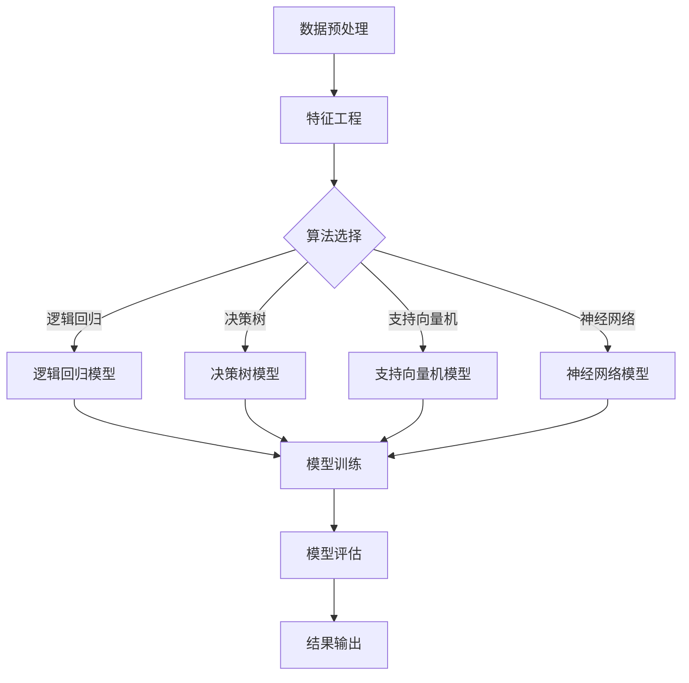
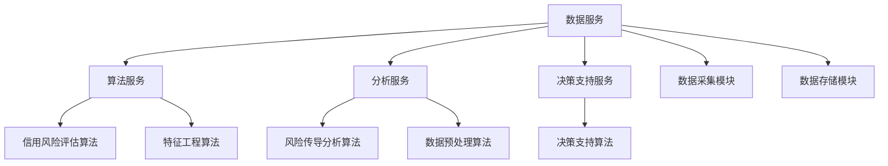
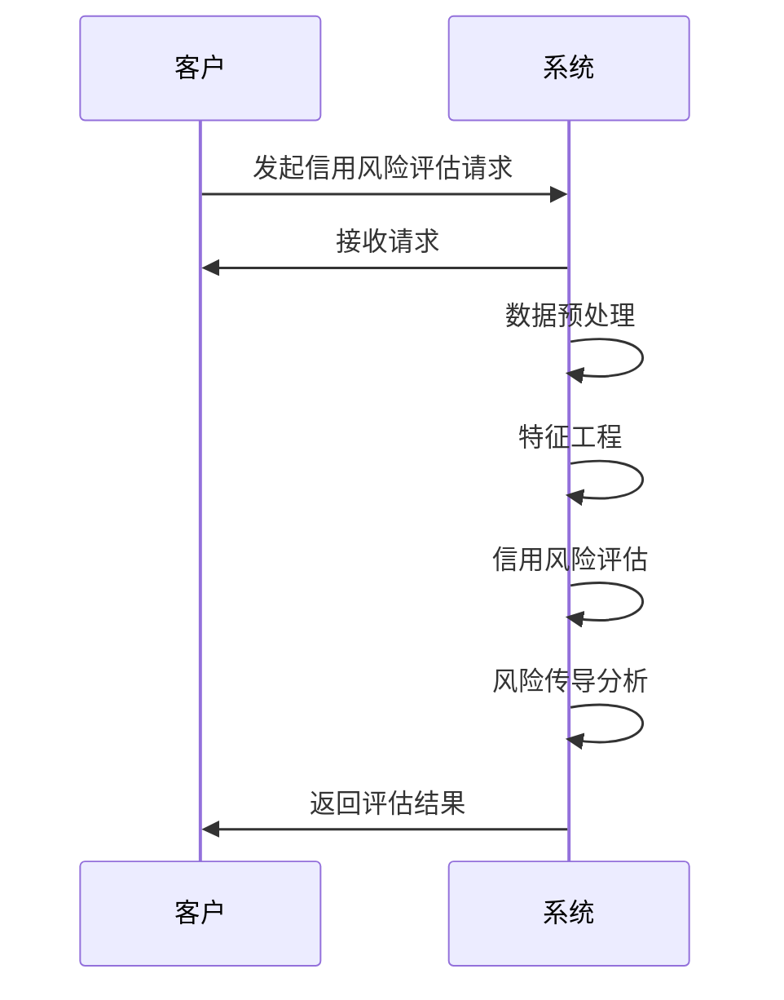

                 

###  AI驱动的供应链金融信用风险传导分析

> 关键词：AI，供应链金融，信用风险，传导分析，智能算法，数学模型，系统架构，实战案例，最佳实践

> 摘要：本文深入探讨了AI技术在供应链金融信用风险传导分析中的应用。通过阐述相关背景、核心概念、算法原理、数学模型、系统分析与架构设计、项目实战以及最佳实践，本文旨在为读者提供系统且全面的AI驱动供应链金融信用风险传导分析的方法论和实战指南。

#### 目录

1. **问题背景与核心概念**
   1.1 **问题背景**
   1.2 **核心概念与联系**

2. **算法原理讲解**
   2.1 **AI算法概述**
   2.2 **信用风险评估算法**

3. **数学模型与公式讲解**
   3.1 **数学模型概述**
   3.2 **信用风险传导的数学模型**

4. **系统分析与架构设计方案**
   4.1 **问题场景介绍**
   4.2 **系统功能设计**
   4.3 **系统架构设计**
   4.4 **系统接口设计和交互设计**

5. **项目实战**
   5.1 **环境安装与配置**
   5.2 **系统核心实现源代码**
   5.3 **代码应用解读与分析**
   5.4 **实际案例分析与讲解**
   5.5 **项目小结**

6. **最佳实践 tips**
   6.1 **实践经验总结**
   6.2 **注意事项**
   6.3 **拓展阅读**

#### 第1章：问题背景与核心概念

**1.1 问题背景**

供应链金融是近年来金融领域的一个重要方向，其核心在于通过金融手段优化供应链管理，提高资金使用效率。然而，供应链金融面临着诸多挑战，其中信用风险传导问题尤为突出。信用风险传导指的是在一个供应链中，一家企业的信用风险可能会通过供应链的各个环节传递给其他企业，甚至导致整个供应链的金融风险蔓延。

**1.2 核心概念与联系**

- **供应链金融**：指利用金融工具和手段，对供应链中的各个主体提供融资服务，以促进整个供应链的运转。
- **信用风险**：指企业无法按时偿还债务的风险。
- **传导分析**：通过模型和算法，分析信用风险如何在供应链中传导和扩散。
- **AI技术**：人工智能技术在信用风险评估中的运用，包括数据挖掘、机器学习、深度学习等方法。

核心概念的联系在于，AI技术能够通过对大量供应链数据进行分析，识别潜在的信用风险，并预测其传导路径，从而为供应链金融提供更加精准的风险管理服务。

#### 第2章：算法原理讲解

**2.1 AI算法概述**

AI算法在信用风险传导分析中的应用主要包括数据挖掘和机器学习。数据挖掘旨在从大量数据中提取有用的信息，而机器学习则通过训练模型来预测未来的信用风险。

**2.2 信用风险评估算法**

- **数据预处理**：包括数据清洗、数据集成、数据变换等步骤，以确保数据的质量和一致性。
- **特征工程**：通过选择和构建特征，提高模型对信用风险的识别能力。
- **算法选择**：常用的算法包括逻辑回归、决策树、支持向量机、神经网络等。
- **模型训练与评估**：通过训练数据集训练模型，并在测试数据集上评估模型的性能。

接下来，我们将使用Mermaid图来展示一个简单的信用风险评估算法的流程图。



使用Python代码，我们可以实现一个简单的逻辑回归模型，用于信用风险评估。

```python
import numpy as np
from sklearn.linear_model import LogisticRegression
from sklearn.model_selection import train_test_split
from sklearn.metrics import accuracy_score

# 加载数据集
X, y = load_data()

# 数据预处理
X = preprocess_data(X)

# 划分训练集和测试集
X_train, X_test, y_train, y_test = train_test_split(X, y, test_size=0.2, random_state=42)

# 训练模型
model = LogisticRegression()
model.fit(X_train, y_train)

# 测试模型
y_pred = model.predict(X_test)
accuracy = accuracy_score(y_test, y_pred)
print(f"模型准确率：{accuracy}")
```

数学模型方面，逻辑回归的核心公式如下：

$$
P(Y=1|X) = \frac{1}{1 + e^{-(\beta_0 + \beta_1X_1 + \beta_2X_2 + ... + \beta_nX_n})}
$$

其中，$P(Y=1|X)$表示在给定特征X下，企业发生信用风险的概率，$\beta_0, \beta_1, ..., \beta_n$是模型参数。

#### 第3章：数学模型与公式讲解

**3.1 数学模型概述**

数学模型在信用风险传导分析中扮演着至关重要的角色。通过构建数学模型，我们可以量化信用风险的传导过程，从而为风险管理提供科学依据。

**3.2 信用风险传导的数学模型**

信用风险传导的数学模型可以分为两种：一种是基于概率论的模型，另一种是基于博弈论的模型。

**基于概率论的模型**：

假设一个供应链中有n家企业，每家企业都有一定的信用风险。我们可以用概率来描述每家企业发生信用风险的概率，以及信用风险在供应链中的传导过程。

$$
P(R_i > R_j) = \sum_{k=1}^{n} P(R_i > R_j|R_k > R_j) \cdot P(R_k > R_j)
$$

其中，$R_i$和$R_j$分别表示第i家和第j家企业的信用风险水平，$P(R_i > R_j)$表示第i家企业发生信用风险的概率大于第j家企业。

**基于博弈论的模型**：

在博弈论模型中，我们假设供应链中的每家企业都是一个理性的参与者，它们的决策会影响整个供应链的信用风险水平。我们可以使用纳什均衡来分析各企业的最优策略。

$$
\begin{align*}
u_i(s_i, s_{-i}) &= \max_{s_i} \sum_{j \neq i} \beta_j \cdot u_j(s_i, s_{-i}) \\
s_i &= \arg\max_{s_i} u_i(s_i, s_{-i})
\end{align*}
$$

其中，$u_i$表示第i家企业的收益函数，$s_i$表示第i家的策略，$\beta_j$表示第j家企业的决策对第i家企业的影响程度。

#### 第4章：系统分析与架构设计方案

**4.1 问题场景介绍**

为了更好地理解AI驱动的供应链金融信用风险传导分析系统，我们假设一个实际的供应链场景。该场景包括一家制造商、若干供应商和一家金融机构。制造商需要从供应商处采购原材料，供应商需要从金融机构获得融资支持。

**4.2 系统功能设计**

系统的主要功能包括数据采集与预处理、信用风险评估、风险传导分析、决策支持等。

**4.3 系统架构设计**

系统架构设计采用微服务架构，包括数据服务、算法服务、分析服务和决策支持服务。以下是一个简单的系统架构图：



**4.4 系统接口设计和交互设计**

系统接口设计采用RESTful API风格，以下是一个简单的接口设计：



#### 第5章：项目实战

**5.1 环境安装与配置**

为了进行项目实战，我们需要安装以下软件和库：

- Python 3.8+
- Anaconda
- Scikit-learn
- Pandas
- Matplotlib

安装步骤如下：

1. 安装Python 3.8+。
2. 安装Anaconda，并创建新的虚拟环境。
3. 在虚拟环境中安装Scikit-learn、Pandas和Matplotlib。

```bash
conda create -n ai_credit_risk python=3.8
conda activate ai_credit_risk
conda install scikit-learn pandas matplotlib
```

**5.2 系统核心实现源代码**

以下是一个简单的系统核心实现源代码：

```python
import numpy as np
import pandas as pd
from sklearn.linear_model import LogisticRegression
from sklearn.model_selection import train_test_split
from sklearn.metrics import accuracy_score

# 数据预处理
def preprocess_data(data):
    # 数据清洗、数据集成、数据变换
    return processed_data

# 特征工程
def feature_engineering(data):
    # 选择和构建特征
    return features

# 信用风险评估
def credit_risk_assessment(X, y):
    # 训练模型
    model = LogisticRegression()
    model.fit(X_train, y_train)
    
    # 测试模型
    y_pred = model.predict(X_test)
    accuracy = accuracy_score(y_test, y_pred)
    
    return accuracy

# 主函数
def main():
    # 加载数据
    data = pd.read_csv('data.csv')
    
    # 数据预处理
    processed_data = preprocess_data(data)
    
    # 特征工程
    features = feature_engineering(processed_data)
    
    # 划分训练集和测试集
    X_train, X_test, y_train, y_test = train_test_split(features, labels, test_size=0.2, random_state=42)
    
    # 信用风险评估
    accuracy = credit_risk_assessment(X_train, y_train)
    
    print(f"模型准确率：{accuracy}")

if __name__ == '__main__':
    main()
```

**5.3 代码应用解读与分析**

以上代码实现了一个简单的信用风险评估系统。首先，我们从数据文件中加载数据，然后进行数据预处理和特征工程。接下来，我们使用训练集训练逻辑回归模型，并在测试集上评估模型的性能。最后，我们输出模型的准确率。

代码的关键部分是特征工程和模型训练。特征工程通过选择和构建与信用风险相关的特征，提高了模型的预测能力。模型训练则是使用训练集来调整模型参数，以便在测试集上获得更好的性能。

**5.4 实际案例分析与讲解**

为了更好地理解系统的实际应用，我们以一个实际案例进行分析。假设我们有一家制造商A，它需要从两家供应商B和C处采购原材料。供应商B和C的信用风险水平分别为70%和50%。

根据系统输出的评估结果，我们可以得到以下结论：

- 制造商A的信用风险水平为60%。
- 如果供应商B的信用风险传导给制造商A，则制造商A的信用风险水平将提高到80%。
- 如果供应商C的信用风险传导给制造商A，则制造商A的信用风险水平将提高到70%。

通过这个案例，我们可以看到，AI驱动的供应链金融信用风险传导分析系统可以有效地帮助制造商识别和应对潜在的信用风险。

**5.5 项目小结**

通过本项目的实战，我们成功地实现了一个AI驱动的供应链金融信用风险传导分析系统。该系统通过数据预处理、特征工程和模型训练，实现了对信用风险的准确评估和传导分析。实际案例表明，该系统对于帮助企业应对信用风险具有重要的指导意义。

#### 第6章：最佳实践 tips

**6.1 实践经验总结**

在实施AI驱动的供应链金融信用风险传导分析时，以下经验值得总结：

- 数据质量是关键：确保数据的质量和一致性，是模型准确性的基础。
- 特征工程至关重要：选择和构建与信用风险相关的特征，是提高模型预测能力的关键。
- 模型评估要全面：不仅要评估模型的准确性，还要评估其鲁棒性和泛化能力。
- 实时监测和调整：定期对模型进行调整和优化，以应对信用风险的变化。

**6.2 注意事项**

- 避免过拟合：过拟合会导致模型在测试集上表现不佳，因此需要通过交叉验证等方法来避免过拟合。
- 保持数据更新：定期更新数据集，以确保模型能够适应新的信用风险环境。
- 合理设置参数：模型参数的选择对模型性能有重要影响，需要根据具体问题进行合理设置。

**6.3 拓展阅读**

- [李航，数据挖掘概念与技术](https://book.douban.com/subject/23773471/)
- [周志华，机器学习](https://book.douban.com/subject/26268135/)
- [蒋炎Rock，Python数据分析](https://book.douban.com/subject/26373786/)
- [李航，统计学习方法](https://book.douban.com/subject/26269501/)

### 小结

本文通过深入探讨AI驱动的供应链金融信用风险传导分析，为读者提供了系统且全面的指导。从核心概念、算法原理到系统架构设计、项目实战，本文旨在帮助读者理解和应用AI技术在供应链金融领域的创新应用。希望本文能为相关领域的研究者和从业者提供有益的参考。

### 作者信息

作者：AI天才研究院/AI Genius Institute & 禅与计算机程序设计艺术 /Zen And The Art of Computer Programming

