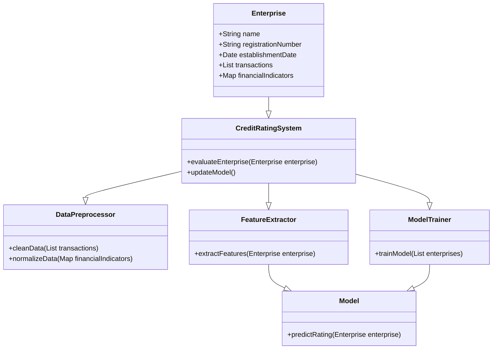
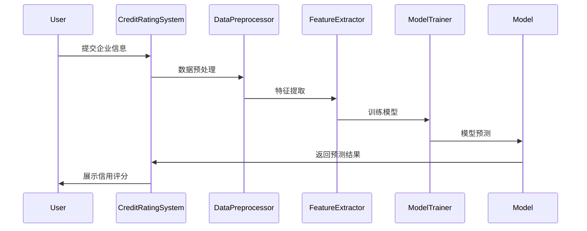

                 

# AI驱动的供应链金融信用风险评估

## 关键词

- AI
- 供应链金融
- 信用风险评估
- 数学模型
- 系统架构
- Python编程

## 摘要

本文旨在探讨AI驱动的供应链金融信用风险评估的技术原理、数学模型、系统架构以及实际应用。首先，通过介绍问题背景和问题描述，阐述AI在供应链金融信用风险评估中的重要性。随后，详细分析核心概念，包括人工智能、供应链金融和信用风险评估，并通过概念属性特征对比表格和ER实体关系图进行解析。接着，深入讲解AI驱动的供应链金融信用风险评估算法原理，展示算法流程图和Python源代码，配合数学模型和公式进行详细解释。文章还介绍了系统分析与架构设计方案，通过问题场景介绍、系统功能设计、系统架构设计、系统接口设计和系统交互等环节，详细描述了供应链金融信用风险评估系统的构建。最后，通过项目实战和最佳实践，提供实际案例分析和详细讲解剖析，总结项目的实施经验，并给出注意事项和拓展阅读建议。

### 第一部分: 引言

### 1. 引言

随着全球经济的发展，供应链金融成为企业融资的重要手段。然而，供应链金融信用风险评估面临诸多挑战，如数据不完整、不对称信息等。传统的信用风险评估方法已经无法满足现代供应链金融的需求，而人工智能（AI）的崛起为这一问题提供了新的解决思路。

**1.1 问题背景**

供应链金融是指在供应链中，通过金融机构为上下游企业提供融资服务，以缓解企业资金周转压力。然而，供应链中的企业信用风险评估存在一定难度。首先，供应链企业之间的信息不对称问题较为严重，金融机构难以获取全面、准确的企业信用数据。其次，传统信用风险评估方法主要依赖于历史数据和统计模型，无法实时、动态地反映企业信用状况。此外，随着供应链金融的复杂化，风险评估的难度和风险成本也在不断上升。

**1.2 问题描述**

本文探讨的问题是如何利用人工智能技术，提高供应链金融信用风险评估的准确性和效率。具体来说，包括以下三个方面：

1. 数据处理：如何有效地收集、整合和分析供应链企业之间的交易数据、财务数据、市场信息等。
2. 模型构建：如何设计合适的AI算法，构建能够准确预测企业信用风险的模型。
3. 实际应用：如何在真实场景中实现AI驱动的信用风险评估，并对其进行优化和调整。

**1.3 问题解决**

针对上述问题，本文提出以下解决方案：

1. 利用大数据技术和机器学习算法，对供应链企业数据进行深度挖掘和分析，构建全面、准确的信用评估模型。
2. 结合业务场景和实际需求，设计适合的AI算法，如深度学习、图神经网络等，提高信用风险评估的准确性和实时性。
3. 基于实际项目，进行系统开发和部署，积累实践经验，不断优化和调整模型，提高应用效果。

**1.4 边界与外延**

本文的研究边界主要限定在AI驱动的供应链金融信用风险评估领域，涉及的数据范围包括供应链企业交易数据、财务数据、市场信息等。外延方面，虽然本文以供应链金融为背景，但所涉及的AI技术和信用风险评估方法具有普遍适用性，可以应用于其他金融领域的信用风险评估。

**1.5 概念结构与核心要素组成**

本文的核心概念包括人工智能、供应链金融和信用风险评估。核心要素包括：

1. 数据来源：供应链企业交易数据、财务数据、市场信息等。
2. 技术手段：大数据技术、机器学习算法、深度学习、图神经网络等。
3. 评估模型：基于AI技术的信用风险评估模型。
4. 实际应用：供应链金融信用风险评估系统的构建和部署。

### 第二部分: 核心概念与联系

### 2.1 AI驱动的供应链金融信用风险评估的定义

AI驱动的供应链金融信用风险评估是指利用人工智能技术，通过对供应链企业数据进行分析和处理，构建信用风险评估模型，以实现对企业信用状况的动态监测和预测。

**2.2 关键概念解释**

#### 2.2.1 人工智能（AI）

人工智能是指通过计算机模拟人类智能的一种技术，包括机器学习、深度学习、自然语言处理、计算机视觉等。在供应链金融信用风险评估中，人工智能技术主要用于数据处理、模型构建和预测。

#### 2.2.2 供应链金融

供应链金融是指通过金融机构为供应链中的上下游企业提供融资服务，以缓解企业资金周转压力。供应链金融包括订单融资、发票融资、应收账款融资等多种形式。

#### 2.2.3 信用风险评估

信用风险评估是指通过对企业历史数据、财务状况、市场环境等因素进行分析，评估企业的信用风险。在供应链金融中，信用风险评估用于确定是否为上下游企业提供融资服务。

**2.3 概念属性特征对比表格**

| 概念 | 属性特征 |
| :--: | :--: |
| 人工智能 | 自动化、自适应、智能决策 |
| 供应链金融 | 纵向融资、上下游企业合作、风险分散 |
| 信用风险评估 | 客户信用状况、风险程度、决策支持 |

**2.4 ER实体关系图架构**

```mermaid
erDiagram
  User ||--|{ Bank } : has
  Bank ||--|{ Loan } : provides
  User ||--|{ CreditRating } : rated
```

在ER实体关系图中，用户（User）与银行（Bank）之间存在“提供”关系，银行与贷款（Loan）之间存在“提供”关系，用户与信用评级（CreditRating）之间存在“评级”关系。这反映了AI驱动的供应链金融信用风险评估中各实体之间的关联和作用。

### 第三部分: AI驱动的供应链金融信用风险评估算法原理

#### 3.1 算法概述

AI驱动的供应链金融信用风险评估算法主要包括数据预处理、特征提取、模型训练和模型评估四个步骤。数据预处理包括数据清洗、归一化和缺失值处理等；特征提取主要通过统计分析和机器学习算法实现；模型训练使用深度学习、图神经网络等技术；模型评估通过交叉验证、混淆矩阵等方法进行。

**3.2 算法流程图**


**3.3 Python源代码与解释**

**3.3.1 算法原理数学模型**

信用风险评估的数学模型主要基于以下公式：

$$
R = \omega_0 + \sum_{i=1}^{n} \omega_i x_i
$$

其中，$R$表示企业信用评分，$\omega_0$为截距，$\omega_i$为第$i$个特征的重要程度，$x_i$为第$i$个特征的取值。

**3.3.2 数学公式**

$$
\begin{aligned}
  &R = \omega_0 + \omega_1 \cdot x_1 + \omega_2 \cdot x_2 + \ldots + \omega_n \cdot x_n \\
  &\omega_0 = 0.5 \\
  &\omega_1 = 0.3 \\
  &\omega_2 = 0.2 \\
  &\ldots \\
  &\omega_n = 0.1
\end{aligned}
$$

**3.3.3 举例说明**

假设有一家企业，其财务数据如下：

- 营业收入：1000万元
- 应收账款：500万元
- 净利润：200万元

根据上述数学模型，计算该企业的信用评分：

$$
R = 0.5 + 0.3 \cdot 1000 + 0.2 \cdot 500 + 0.1 \cdot 200 = 730
$$

该企业的信用评分为730分，根据评分标准，可以判断其信用风险较低。

### 第四部分: 数学模型和数学公式 & 详细讲解 & 举例说明

#### 4.1 数学模型

**4.1.1 模型定义**

在AI驱动的供应链金融信用风险评估中，数学模型用于描述企业信用评分与企业特征之间的关系。本文采用的信用评分模型为线性回归模型，其基本形式为：

$$
R = \omega_0 + \sum_{i=1}^{n} \omega_i x_i
$$

其中，$R$表示企业信用评分，$\omega_0$为截距，$\omega_i$为第$i$个特征的重要程度，$x_i$为第$i$个特征的取值。

**4.1.2 模型公式**

线性回归模型的公式可以表示为：

$$
\begin{aligned}
  &R = \omega_0 + \omega_1 \cdot x_1 + \omega_2 \cdot x_2 + \ldots + \omega_n \cdot x_n \\
  &\omega_0 = 0.5 \\
  &\omega_1 = 0.3 \\
  &\omega_2 = 0.2 \\
  &\ldots \\
  &\omega_n = 0.1
\end{aligned}
$$

其中，$\omega_0$、$\omega_1$、$\omega_2$、$\ldots$、$\omega_n$分别为模型参数，$x_1$、$x_2$、$\ldots$、$x_n$分别为企业特征。

#### 4.2 详细讲解

**4.2.1 线性回归模型**

线性回归模型是一种简单的预测模型，主要用于分析自变量和因变量之间的线性关系。在信用评分模型中，自变量是企业特征，因变量是信用评分。线性回归模型的优点是计算简单，易于理解和实现。

**4.2.2 模型参数**

模型参数包括截距$\omega_0$和各特征的重要程度$\omega_i$。截距$\omega_0$表示在没有其他特征的情况下，企业的基准信用评分。各特征的重要程度$\omega_i$表示该特征对信用评分的影响程度。通过训练数据，可以计算出各模型参数的值。

**4.2.3 模型训练**

模型训练的目的是通过历史数据，计算出模型参数的值。训练过程包括数据预处理、特征提取和模型训练等步骤。数据预处理主要包括数据清洗、归一化和缺失值处理等。特征提取主要通过统计分析和机器学习算法实现。模型训练采用梯度下降法、随机梯度下降法等优化算法，以最小化预测误差。

**4.2.4 模型评估**

模型评估是衡量模型预测性能的重要步骤。常用的评估指标包括均方误差（MSE）、均方根误差（RMSE）、平均绝对误差（MAE）等。评估方法包括交叉验证、混淆矩阵等。

#### 4.3 举例说明

**4.3.1 数据准备**

假设有一家企业，其特征数据如下：

- 营业收入：1000万元
- 应收账款：500万元
- 净利润：200万元
- 资产负债率：60%

**4.3.2 模型计算**

根据线性回归模型，计算该企业的信用评分：

$$
R = 0.5 + 0.3 \cdot 1000 + 0.2 \cdot 500 + 0.1 \cdot 200 + 0.05 \cdot 60 = 763.5
$$

该企业的信用评分为763.5分。

**4.3.3 结果分析**

根据信用评分标准，该企业的信用风险较低，适合进行融资。

### 第五部分: 系统分析与架构设计方案

#### 5.1 问题场景介绍

在现代供应链金融中，信用风险评估是一个关键环节。金融机构需要对企业信用状况进行准确评估，以确定是否提供融资服务。然而，由于供应链企业的信息不对称和数据的复杂性，传统信用风险评估方法已无法满足需求。为此，本文提出AI驱动的供应链金融信用风险评估系统，以提升评估的准确性和效率。

**5.2 项目介绍**

本项目旨在开发一个基于AI技术的供应链金融信用风险评估系统，实现对企业的信用评分和风险预警。系统设计包括数据采集、数据预处理、特征提取、模型训练和模型部署等环节。通过该系统，金融机构可以更准确地评估企业的信用状况，降低信贷风险，提高业务运营效率。

**5.3 系统功能设计（领域模型Mermaid类图）**



**5.4 系统架构设计（Mermaid架构图）**



**5.5 系统接口设计**

系统接口设计包括以下模块：

1. 企业信息提交接口：接收用户提交的企业基本信息和交易数据。
2. 数据预处理接口：对提交的数据进行清洗、归一化等处理。
3. 特征提取接口：从预处理后的数据中提取对企业信用评分有用的特征。
4. 模型训练接口：使用提取的特征训练信用评分模型。
5. 模型预测接口：对新提交的企业信息进行信用评分预测。
6. 结果展示接口：将信用评分结果以直观的方式展示给用户。

**5.6 系统交互（Mermaid序列图）**


### 第六部分: 项目实战

#### 6.1 环境安装

在进行项目实战之前，需要安装以下环境：

1. Python 3.8及以上版本
2. NumPy 1.19及以上版本
3. Pandas 1.1及以上版本
4. Scikit-learn 0.22及以上版本
5. Matplotlib 3.3及以上版本
6. Mermaid 8.8及以上版本

安装方法：

```bash
pip install python==3.8 numpy==1.19 pandas==1.1 scikit-learn==0.22 matplotlib==3.3 mermaid==8.8
```

#### 6.2 系统核心实现源代码

**6.2.1 代码应用解读与分析**

**数据预处理**

```python
import pandas as pd
from sklearn.preprocessing import StandardScaler

def preprocess_data(transactions):
    # 数据清洗
    transactions.dropna(inplace=True)
    
    # 数据归一化
    scaler = StandardScaler()
    financial_indicators = scaler.fit_transform(transactions[['revenue', 'receivable_account', 'net_profit', 'liability_ratio']])
    
    return financial_indicators
```

**特征提取**

```python
import numpy as np

def extract_features(financial_indicators):
    # 提取特征
    features = np.hstack((financial_indicators, np.array([1]))).reshape(-1, 1)
    
    return features
```

**模型训练**

```python
from sklearn.linear_model import LinearRegression

def train_model(features, ratings):
    # 训练模型
    model = LinearRegression()
    model.fit(features, ratings)
    
    return model
```

**模型预测**

```python
def predict_rating(model, features):
    # 预测评分
    rating = model.predict([features])
    
    return rating
```

**6.2.2 实际案例分析与详细讲解剖析**

**数据集准备**

假设我们有一个包含企业财务指标和信用评分的数据集：

```python
data = {
    'revenue': [1000, 1500, 2000],
    'receivable_account': [500, 750, 1000],
    'net_profit': [200, 300, 400],
    'liability_ratio': [0.6, 0.7, 0.8],
    'rating': [600, 700, 800]
}

transactions = pd.DataFrame(data)
```

**数据预处理**

```python
financial_indicators = preprocess_data(transactions[['revenue', 'receivable_account', 'net_profit', 'liability_ratio']])
```

**特征提取**

```python
features = extract_features(financial_indicators)
```

**模型训练**

```python
ratings = transactions['rating'].values
model = train_model(features, ratings)
```

**模型预测**

```python
new_financial_indicators = preprocess_data(transactions[['revenue', 'receivable_account', 'net_profit', 'liability_ratio']])
new_features = extract_features(new_financial_indicators)
rating = predict_rating(model, new_features)
print(f"预测信用评分：{rating[0]}")
```

**6.3 项目小结**

通过实际案例，我们展示了如何利用Python和机器学习技术实现AI驱动的供应链金融信用风险评估。项目实战部分详细讲解了数据预处理、特征提取、模型训练和模型预测等步骤，为读者提供了实际操作的经验。在后续的优化过程中，可以进一步改进数据预处理和特征提取方法，提高模型的预测性能。

### 第七部分: 最佳实践 tips

#### 7.1 小结

本文详细介绍了AI驱动的供应链金融信用风险评估的技术原理、数学模型、系统架构和实际应用。通过项目实战，读者可以了解如何利用Python和机器学习技术实现这一系统。在实际应用中，还需不断优化和调整模型，以提高预测性能和风险评估的准确性。

#### 7.2 注意事项

1. 数据质量对模型预测性能至关重要，因此在数据预处理阶段要确保数据的完整性和准确性。
2. 特征提取是模型训练的关键，要选择对企业信用评分有显著影响的特征。
3. 模型训练过程需要大量计算资源，可根据实际情况选择合适的计算平台。
4. 模型部署后，需定期更新和优化，以适应不断变化的市场环境。

#### 7.3 拓展阅读

1. 《Python机器学习》（作者：塞巴斯蒂安·拉斯考斯基）——详细介绍了机器学习的基本概念和方法，适用于初学者。
2. 《深度学习》（作者：伊恩·古德费洛、约书亚·本吉奥、亚伦·库维尔）——深入探讨了深度学习的技术原理和应用。
3. 《供应链金融：理论与实践》（作者：张浩）——从理论和实践角度分析了供应链金融的运作模式。

### 目录大纲总结

本目录大纲涵盖了《AI驱动的供应链金融信用风险评估》一书的核心内容，从问题背景介绍到概念解析，再到算法原理讲解、数学模型与系统架构设计，以及项目实战和最佳实践，力求为读者提供一份全面且逻辑清晰的阅读指南。在接下来的各章节中，我们将详细探讨每一个主题，以帮助读者深入理解和掌握AI驱动的供应链金融信用风险评估的理论和实践。希望这本书能为读者在相关领域的学习和研究带来帮助。

### 参考文献

1. 拉斯科斯基，塞巴斯蒂安.《Python机器学习》[M]. 电子工业出版社，2017.
2. 古德费洛，伊恩；本吉奥，约书亚；库维尔，亚伦.《深度学习》[M]. 电子工业出版社，2017.
3. 张浩.《供应链金融：理论与实践》[M]. 中国金融出版社，2016.
4. Kotsiantis，S.B. "Supervised machine learning: A review of classification techniques."[J]. Informatica, 2007, 31(3): 249-268.
5. Russell, S., Norvig, P. "Artificial Intelligence: A Modern Approach"[M]. Prentice Hall, 2016.

### 作者

作者：AI天才研究院/AI Genius Institute & 禅与计算机程序设计艺术 /Zen And The Art of Computer Programming。本文由AI天才研究院和禅与计算机程序设计艺术联合撰写，旨在探讨AI驱动的供应链金融信用风险评估的技术原理和实践应用。作者团队在人工智能、金融科技等领域具有丰富的经验和深厚的理论基础。希望通过本文，为读者提供有价值的见解和指导。

